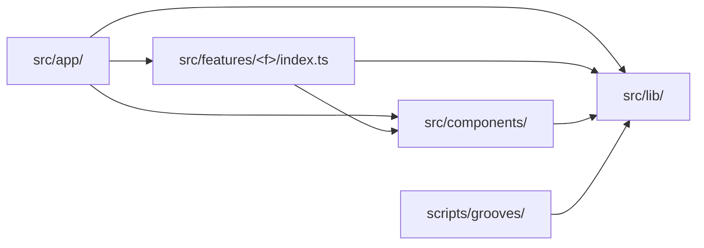

# Tech spec — Epic 4: Guidelines that lint enforces

PRD: [../prd/epic-4-guidelines-enforced.md](../prd/epic-4-guidelines-enforced.md) ·
Roadmap: [../roadmap.md](../roadmap.md)

## Approach

Two pieces of real work and one of consolidation. The type move takes the three
types the generator shares — `Root`, `Flavour`, `Groove` — out of the feature
and into `src/lib/groove.ts`, which closes the last crossing between
`scripts/` and `src/features/`. The lint work turns four boundary rules into
`import/no-restricted-paths` zones. The document work merges three appended
sections into one rulebook. All three own disjoint files and run at once.

The type move has one consequence worth naming up front: the generator *emits*
`import type { Groove } from '../types'` into `grooves.generated.ts`, so moving
the type changes the generated file's bytes. The manifest must be regenerated
and its hash in the lock file updated. That is not a freeze-rule violation — no
id, no audio and no answer changes — but it is the one step in this feature that
legitimately touches `grooves.lock.json`, and it needs its own proof that the
mp3s came back byte-identical.

## Architecture

```
src/lib/
├── hash.ts        hashString              (Epic 3)
└── groove.ts      Root, Flavour, Groove   (this epic)

src/features/daily-groove/types.ts
                   Answer, Attempt, DailyResult
```

The split is by ownership, not convenience: the generator produces grooves, so
`Groove` and the two types it is built from are the contract between the two
halves of the system. `Answer`, `Attempt` and `DailyResult` are gameplay and
persistence concepts the generator has never heard of, and they stay in the
feature.

The enforced import graph — an arrow is allowed, every pair not drawn is an
error:



`src/lib/` is a leaf. That is what lets the generator import it by relative path
from outside the `@/` alias, and it is why the rules forbid `src/lib/**` from
importing `src/features/**` or `src/components/**`.

## Contracts

```ts
// src/lib/groove.ts
export type Root = 'C' | 'C♯' | 'D' | 'E♭' | 'E' | 'F' | 'F♯' | 'G' | 'A♭' | 'A' | 'B♭' | 'B'
export type Flavour = string
export type Groove = {
  id: string; audioSrc: string; name: string; bpm: number
  scale: string; chord: string; progression: string
  root: Root; flavour: Flavour; bars: number
}
```

```ts
// src/features/daily-groove/types.ts — what remains
export type Answer = { root: Root; flavour: Flavour }
export type Attempt = { root: Root; flavour: Flavour; correct: boolean; rootMatched: boolean; flavourMatched: boolean }
export type DailyResult = { date: string; answer: Answer; attempts: Attempt[]; solved: boolean; grooveId?: string }
```

Both re-export through the feature's public surface, so consumers see no change:

```ts
// src/features/daily-groove/index.ts — export set unchanged
export type { Answer, Attempt, DailyResult, Flavour, Groove, Root }
```

`scripts/grooves/types.ts` stops declaring its own `Root`. Its `Flavour` stays —
the generator's is a union of eight internal mode names (`'dorian'`,
`'harmonic-minor'`), a different thing from the app's display-name
`Flavour = string`, and merging them would be a behaviour change rather than a
de-duplication.

The generator's six crossings, all becoming `src/lib/groove.ts`:

```
scripts/grooves/cli.ts:4          import type { Groove }
scripts/grooves/manifest.ts:3     import type { Groove }
scripts/grooves/pools.ts:1        import type { Groove }
scripts/grooves/manifest.test.ts  import type { Groove }
scripts/grooves/pools.test.ts     import type { Groove }
scripts/grooves/rng.test.ts       (hash only — Epic 3)
```

And the `Root` consumers, which move from `'../types.ts'` to the shared module:

```
scripts/grooves/theory/notes.ts      scripts/grooves/theory/scales.ts
scripts/grooves/theory/harmony.ts    scripts/grooves/theory/validity.ts
   + theory/harmony.test.ts, theory/validity.test.ts
```

The manifest's emitted header:

```ts
// scripts/grooves/manifest.ts:91 — what the generated file declares
import type { Groove } from '@/lib/groove'
```

## Tracks

### Track A — The type move

- **Goal** — `src/lib/groove.ts` holds the shared contract, nothing under
  `scripts/` imports `src/features/`, and the regenerated manifest is committed
  with byte-identical audio.
- **Owns** — `src/lib/groove.ts`, `src/features/daily-groove/types.ts`,
  `src/features/daily-groove/index.ts`, `scripts/grooves/cli.ts`,
  `scripts/grooves/manifest.ts`, `scripts/grooves/pools.ts`,
  `scripts/grooves/types.ts`, `scripts/grooves/theory/**`, and their tests
- **Depends on** — the type contract only
- **Parallel with** — B, C
- **Done when** — `npm test`, `npm run grooves` and `npm run grooves:verify` all
  pass and no mp3 changed.

### Track B — The lint boundaries

- **Goal** — four rules that fail `npm run lint` on a deliberate violation.
- **Owns** — `eslint.config.mjs`
- **Depends on** — nothing. It is written and proved against deliberate
  violations, not against the tree's final state.
- **Parallel with** — A, C
- **Done when** — each of Steps B2–B6 fails when its violation is introduced and
  passes when reverted.

### Track C — The document

- **Goal** — one rulebook rather than three appendices, cross-linked from
  `architecture.md` and `testing.md`.
- **Owns** — `docs/coding-guidelines.md`, `docs/architecture.md`,
  `docs/testing.md`
- **Depends on** — Epics 1–3 having written their sections
- **Parallel with** — A, B
- **Done when** — Step C3's checklist holds.

## Execution waves

- **Wave 1 (parallel):** Track A, Track B, Track C
- **Wave 2:** Integration — the clean-tree lint run, which is the only check
  that needs A and B both landed

## Implementation

### Track A — The type move

#### Step A1 — Create the shared type module

Covers: R11

- **Test first** — `src/lib/groove.test.ts` (new): a type-level assertion that a
  literal `Groove` object satisfies the type and that `root` rejects a
  non-member string, using `expectTypeOf` or a `satisfies` block that fails to
  compile. Also assert `ROOTS.length === 12` if a runtime value is added. Run
  it: fails with `Cannot find module '@/lib/groove'`.
- **Implement** — `src/lib/groove.ts`: move `Root`, `Flavour` and `Groove`
  verbatim out of `src/features/daily-groove/types.ts`, with their doc comments.
- **Green when** — the new test passes.
- **Refactor** — none.

#### Step A2 — Re-export through the feature

Covers: R15, AC14

- **Test first** — `src/features/daily-groove/index.test.ts`: it already asserts
  the public surface. Add an assertion that the exported type names are exactly
  `Answer`, `Attempt`, `DailyResult`, `Flavour`, `Groove`, `Root`. Run it: fails
  once `types.ts` no longer declares the three moved types.
- **Implement** — `src/features/daily-groove/types.ts`: delete the three moved
  types and `export type { Root, Flavour } from '@/lib/groove'` plus
  `export type { Groove } from '@/lib/groove'` so the feature's own modules keep
  importing `'../types'` unchanged. `index.ts` is untouched.
- **Green when** — the surface assertion passes and the app suite is green with
  no other import rewritten.
- **Refactor** — none. Re-exporting from `types.ts` is what keeps this step from
  touching seventeen feature modules.

#### Step A3 — Point the generator at the shared type

Covers: R6, R12, AC11

- **Test first** — `scripts/grooves/boundary.test.ts` (new, generator project):
  read every `.ts` under `scripts/`; assert no file contains the string
  `src/features`. Run it: fails listing `cli.ts`, `manifest.ts`, `pools.ts` and
  their tests.
- **Implement** — rewrite the `Groove` imports in `cli.ts:4`, `manifest.ts:3`,
  `pools.ts:1`, `manifest.test.ts` and `pools.test.ts` to
  `'../../src/lib/groove.ts'`. Update the comments in `rng.ts:13` and
  `types.ts:22` that reference the old path.
- **Green when** — the boundary test passes and
  `npx vitest run --project generator` is green. Once Track B's fifth zone lands,
  `npm run lint` is the real guard and this test is the fast one — it needs no
  eslint run, so it fails inside the generator project.
- **Refactor** — see Q1 on the generator's own `Root`.

#### Step A3b — Delete the generator's duplicate `Root`

Covers: R11, R12

- **Test first** — `scripts/grooves/boundary.test.ts`: assert that
  `scripts/grooves/types.ts` does not declare a `Root` type — a source read for
  `export type Root`. Run it: fails, the declaration is at line 24.
- **Implement** — delete the twelve-root union from `scripts/grooves/types.ts`
  along with the comment conceding it must match the app's. Repoint its six
  consumers — `theory/notes.ts`, `theory/scales.ts`, `theory/harmony.ts`,
  `theory/validity.ts` and the two theory tests — at
  `import type { Root } from '../../../src/lib/groove.ts'`. Leave `Flavour`
  where it is.
- **Green when** — `npx vitest run --project generator` is green and
  `npm run grooves` produces byte-identical output. A type-only change cannot
  alter the render; if it does, something else moved.
- **Refactor** — none. The deep relative path from `theory/` is the honest cost
  of one source of truth; if it grates later, `types.ts` can re-export without
  reintroducing a second declaration.

#### Step A4 — Change what the manifest declares

Covers: R13

- **Test first** — `scripts/grooves/manifest.test.ts`: it asserts the rendered
  manifest's text. Change the expected header to
  `import type { Groove } from '@/lib/groove'`. Run it: fails with
  `expected "…from '../types'" to contain "…from '@/lib/groove'"`.
- **Implement** — `scripts/grooves/manifest.ts:91`: change the emitted head
  string.
- **Green when** — the generator project is green.
- **Refactor** — none.

#### Step A5 — Regenerate, and prove the audio did not move

Covers: R13, R14, AC12, AC13

- **Test first** — none; this is the verification the epic turns on.
- **Implement** — run `npm run grooves`. Commit the changed
  `src/features/daily-groove/data/grooves.generated.ts` and the changed manifest
  hash in `scripts/grooves/grooves.lock.json`.
- **Green when** — `git status --short public/grooves/` is empty, the audio
  hashes in `grooves.lock.json` are unchanged, only the manifest hash moved, and
  `npm run grooves:verify` passes. Then run `npm run grooves` a second time:
  `git status` reports nothing, confirming the output is stable.
- **Refactor** — none. If any mp3 changed, stop and revert: that is a freeze-rule
  violation and means something other than the import line moved.

### Track B — The lint boundaries

#### Step B1 — Add the zones

Covers: R3, R5

- **Test first** — none directly; Steps B2–B6 are the tests, each run by hand.
- **Implement** — `eslint.config.mjs`: add an `import/no-restricted-paths` block
  with four zones — `src/components` may not import `src/features`;
  `src/features/<f>` may not be imported except through its `index.ts`, with the
  feature's own folder in the zone's `except` list; no feature may import
  another; `src/lib` may not import `src/features` or `src/components`; and
  `scripts` may not import `src/features` or `src/components`, leaving
  `scripts` → `src/lib` open as the generator's one channel into the app. Give
  each zone a `message` naming the rule and why, not just the path (R5).
- **Green when** — `npm run lint` still passes on the current tree.
- **Refactor** — none.

#### Step B2 — Prove the design-system rule

Covers: R3, AC1

- **Test first** — add `import { GroovePuzzle } from '@/features/daily-groove'`
  to `src/components/layout/Container.tsx`. Run `npm run lint`: it must fail,
  naming the file and the rule's message.
- **Implement** — the zone from B1.
- **Green when** — it fails as described, then passes once reverted.
- **Refactor** — none.

#### Step B3 — Prove the deep-import rule, both ways

Covers: R3, AC2

- **Test first** — in `src/app/page.tsx`, import
  `@/features/daily-groove/lib/theory/music`. Run `npm run lint`: must fail.
  Revert to `@/features/daily-groove`: must pass.
- **Implement** — the zone from B1.
- **Green when** — both halves behave as described.
- **Refactor** — none.

#### Step B4 — Prove the rule binds consumers, not the feature

Covers: R3, AC9

- **Test first** — `npm run lint` on
  `src/features/daily-groove/components/puzzle/GuessCard.tsx`, which imports
  `../../../lib/theory/music`. It must pass — the feature's own files import each
  other freely.
- **Implement** — the `except` clause from B1.
- **Green when** — it passes, while B3's external deep import still fails.
- **Refactor** — none. If the zone cannot express the carve-out, fall back to
  `no-restricted-imports` with path patterns and record which rule uses which
  mechanism in the document.

#### Step B5 — Prove the generator's boundary

Covers: R3, R6, R12, AC11

- **Test first** — in `scripts/grooves/pools.ts`, import
  `../../src/features/daily-groove/types.ts`. Run `npm run lint`: must fail with
  the zone's message. Change it to `../../src/lib/groove.ts`: must pass.
- **Implement** — the fifth zone from B1.
- **Green when** — both halves behave as described, and the generator's existing
  imports of `src/lib` are untouched by the rule.
- **Refactor** — none. `eslint.config.mjs` ignores only `specs/**`, so
  `scripts/` is already linted; the zone is the only addition needed.

#### Step B6 — Prove the rules bind tests too

Covers: R3, R4, AC3, AC4

- **Test first** — write B3's deep import into a `.test.tsx` file instead. Run
  `npm run lint`: must fail identically. Separately, add an import of
  `@/components/layout/Row` to `src/lib/hash.ts`: must fail.
- **Implement** — confirm no `files`/`ignores` in `eslint.config.mjs` exempts
  test files from these zones.
- **Green when** — both violations fail and both revert clean. This is the rule
  that matters most: both violations this feature found were in tests.
- **Refactor** — none.

### Track C — The document

#### Step C1 — Consolidate

Covers: R1

- **Test first** — none; prose.
- **Implement** — read the four sections Epics 1–3 wrote. Remove duplicated
  rules, resolve contradictions, and make the voice consistent. Order the
  document: the design system, feature slices, shared code, anti-patterns, then
  enforcement.
- **Green when** — no rule appears twice and none contradicts another.
- **Refactor** — none.

#### Step C2 — Tag every rule and fill `## Enforcement`

Covers: R2, R10, AC7, AC10

- **Test first** — none; the checklist in Step C3.
- **Implement** — tag every rule *lint-enforced* or *human-checked*, each with
  the file that motivated it. Under `## Enforcement`, list the four zones with
  the rule each encodes and the mechanism used. Confirm the five conventions R10
  names are present and tagged human-checked: generic component naming; no I/O
  adapter in a component file; generated data in `data/`, never `lib/`; feature
  components grouped by screen region; and `src/lib/hash.ts` frozen because
  changing it re-renders every groove and reassigns every past date's puzzle.
  Settle R7 here too: state that `npm run grooves:verify` already catches a
  hand-edited manifest via the manifest hash, so no second lint guard is added.
- **Green when** — Step C3's checklist holds.
- **Refactor** — none.

#### Step C3 — Cross-link and de-duplicate the other two docs

Covers: R8, AC8

- **Test first** — none; prose. The checklist: every rule tagged; every rule
  names a repo file; no rule the repo did not motivate; no rule stated in two
  documents.
- **Implement** — `docs/architecture.md` and `docs/testing.md` each link to the
  guidelines and drop what the guidelines now own, keeping their principles and
  reasoning. Neither is deleted.
- **Green when** — the checklist holds and `AGENTS.md`'s links still resolve.
- **Refactor** — none.

## Integration and verification

- **Step I1** — `npm run lint` on the clean tree after Epic 3: passes with no
  errors and no warnings (R9, AC5). This is the check that proves Epics 1–3 left
  no violations behind, and it needs Tracks A and B both landed.
- **Step I2** — `npm test`: green, including the new boundary and type tests.
- **Step I3** — `npm run build`: green. `prebuild` runs `grooves:verify`, so a
  mismatched manifest hash fails here.
- **Step I4** — `npm run grooves`: completes with no build step, and
  `git status` reports nothing (AC13).
- **Step I5** — `grep -r "src/features" scripts/` returns nothing (AC11).
- **Step I6** — Demo path: `npm run dev`, play a full puzzle. Unchanged.

## Requirement coverage

| Requirement | Steps |
| :-- | :-- |
| R1 | C1 |
| R2 | C2 |
| R3 | B1–B6 |
| R4 | B6 |
| R5 | B1, B2 |
| R6 | A3 |
| R7 | C2 |
| R8 | C3 |
| R9 | I1 |
| R10 | C2 |
| R11 | A1, A3b |
| R12 | A3, A3b, B5, I5 |
| R13 | A4, A5 |
| R14 | A5 |
| R15 | A2 |
| AC1 | B2 |
| AC2 | B3 |
| AC3 | B6 |
| AC4 | B6 |
| AC5 | I1 |
| AC6 | A3, I4 |
| AC7 | C2, C3 |
| AC8 | C3 |
| AC9 | B4 |
| AC10 | C2 |
| AC11 | A3, B5, I5 |
| AC12 | A5 |
| AC13 | A5, I4 |
| AC14 | A2 |

## Assumptions

- `types.ts` re-exports the three moved types rather than every feature module
  being repointed at `@/lib/groove`. Seventeen modules import `'../types'`
  today; re-exporting keeps this epic's diff to four files instead of twenty-one,
  and the re-export is what `index.ts` already does one level up.
- The generated manifest uses the `@/lib/groove` alias rather than a relative
  path. It is app code compiled by Next, where the alias resolves; only
  `scripts/` needs relative paths.
- The generator's `Flavour` is deliberately left alone. It is not a duplicate:
  eight internal mode names versus the app's display strings. Only `Root` is
  genuinely the same type declared twice.
- The `scripts/` zone and Step A3's boundary test both enforce R12. The overlap
  is deliberate — the zone is the real guard, the test runs without eslint and
  fails faster, and neither is expensive.
- Zone messages are written for a developer who has not read the guidelines,
  since a lint error is where most people meet these rules first.
- `src/lib/groove.test.ts` is largely type-level. If `expectTypeOf` proves
  awkward, a `satisfies` block that must compile is an acceptable substitute —
  the point is that the contract is asserted somewhere, not the mechanism.

## Decision log

Settled architectural decisions. The sections above are the source of truth —
this records how they got there, and what each one cost.

### Cycle 1 — 2026-08-30

**Q1. What happens to the generator's own `Root` type?**
Decision: **A) Delete it and import `Root` from `src/lib/groove.ts`** — it is
the same duplication as `hashString` one layer up, and the comment beside it
already conceded the two must agree.
Changed: new Step A3b deletes the declaration and repoints its six consumers
under `scripts/grooves/theory/`; Track A's ownership widens to
`scripts/grooves/theory/**`; Contracts records that `Flavour` is *not* merged,
because the generator's eight internal mode names are a different type from the
app's display string; R11 and R12 now trace to A3b.

**Q2. Do the lint rules apply to `scripts/`?**
Decision: **A) Add a fifth zone** forbidding `scripts/**` → `src/features/**`
and `src/components/**`, keeping `scripts/**` → `src/lib/**` open — it is the
boundary this epic exists to settle, and the import graph already draws
`src/lib` as the generator's only channel.
Changed: Step B1 gains the fifth zone; a new Step B5 proves it both ways and the
old B5 becomes B6; Step A3's boundary test is reframed as the fast redundant
guard rather than the only one.
