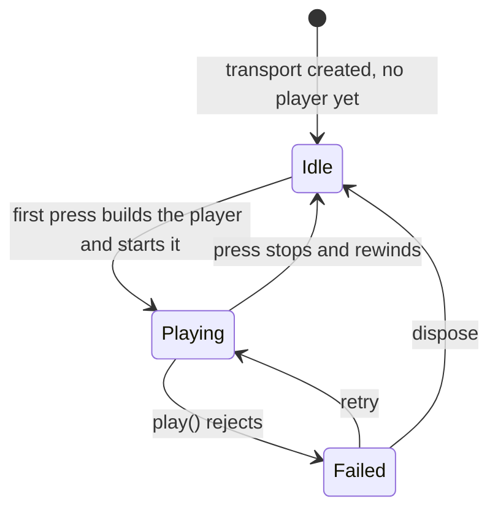

# PRD — Epic 1: The page ends at the puzzle

Feature: [briefing.md](../briefing.md) · [roadmap.md](../roadmap.md)

## Summary

The "Grooves you've played" row is removed, and with it every piece of code that
existed so one `AudioPlayer` could be handed back and forth between today's
groove card and the archive cards. What remains is a page that runs header →
groove card + guess card → solved panel and stops, with exactly one play control
on it. The player's saved history keeps being written to the store and the
streak keeps being computed from it, but the hooks stop handing the record list
out — nothing renders it, and the store still holds all of it.

## Problem

The archive strip was feature-4's answer to "turn the played-grooves row into
something you can replay". Making it playable meant the page acquired a
multi-source transport: a player that can be rebuilt for a different groove
mid-session, a `soundingId` every control on the page must compare itself
against, a `lastSource` ref so a failed press knows what to retry, and a
`resolveGrooveForResult` path to turn a stored record back into a groove. That
machinery is the largest single source of accidental complexity left in the
feature slice, and it is also what lets an archive groove drive the loop
visualisation inside today's card. The briefing asks for "even more
simplification"; this is where the most of it is.

## Scope

- Remove the archive UI and the presentation logic behind it.
- Remove groove-resolution-by-record, which existed only to feed that UI.
- Narrow the transport from "any of several grooves" to "the one groove this
  page is about".
- Remove the design-system components and control props left with no caller.
- Narrow the progress hooks to what the page actually reads.
- Update the two structure tests that name the removed files.

**Out of scope**
- **Storage.** `lib/persistence/storage.ts`, `lib/persistence/streak.ts` and
  the `DailyResult` record — `grooveId` included — are untouched. Every day is
  still written and `getAll()` still returns every record. The briefing is
  explicit: keep storing the history for now. What changes is only what
  `useProgress` and `usePuzzleSession` hand out, not what is kept.
- **The residual bar-highlight error** — Epic 2 owns it. This epic removes the
  cross-groove case as a side effect of removing the second groove; it does not
  re-derive position or change how it is measured.
- **Any replacement.** No archive route, no "yesterday's groove" link, no
  practice mode. Nothing takes the row's place.
- **The design system's remaining surfaces.** `Card` and `Panel` stay.

## Requirements

- **R1** — The page renders no played-grooves section in any state: with no
  history, with one day of history, or with many.
- **R2** — Exactly one play control exists on the page, and it plays today's
  groove. No control anywhere can put a second groove into the player.
- **R3** — The day's record is still written on every check, and the streak
  shown in the header is still computed from the stored records. A player with
  saved days sees the same streak before and after this epic.
- **R3a** — `useProgress` and `usePuzzleSession` no longer return the list of
  past records. The store keeps `getAll()`, which is what the streak reads;
  neither hook exposes a value nothing renders.
- **R4** — When playback fails to start, the page shows the error with a retry
  affordance, and pressing retry attempts today's groove. There is no other
  groove it could mean.
- **R5** — The transport exposes playback state as a boolean, not an identity.
  A consumer asks "is it playing", not "which groove is sounding".
- **R6** — The transport is built for one known groove and cannot be pointed at
  another. Rebuilding the player for a different source is not part of its
  surface.
- **R7** — The following are deleted, with their tests:
  `components/archive/ArchiveStrip.tsx`, `lib/presentation/archive.ts`,
  `lib/puzzle/resolveGroove.ts`, `src/components/surfaces/MiniCard.tsx` (both
  `MiniCard` and `MiniCardGrid`), and `src/components/controls/IconButton.tsx`.
- **R8** — `GroovePuzzle` holds no archive plumbing: no `groovesByDate`, no
  `archiveEntries`, no `handleArchiveToggle`, no `toggleSource` indirection and
  no `lastSource` ref.
- **R9** — `PlayControl` keeps only the props reachable from its one remaining
  caller: `isPlaying`, `onToggle` and `text`. `size`, `label` and `disabled` are
  removed, and with `size` goes the branch that rendered `IconButton`. The
  control renders the full-width `Button` form unconditionally.
- **R10** — Both structure tests describe the tree as it now is:
  `src/features/daily-groove/structure.test.ts` lists `header` and `puzzle` as
  the component regions with no `ArchiveStrip`, and
  `src/components/structure.test.ts` lists `surfaces` without `MiniCard` and
  `controls` without `IconButton`.
- **R11** — `TransportPanel` keeps its current shape and props. It is the seam
  Epic 2 builds against, and nothing about the archive's removal touches it.
- **R12** — The feature stays removable to the standard in
  `docs/architecture.md`: deleting `src/features/daily-groove/` and its route
  still leaves a building app.

## Behaviour details

**What the transport becomes.** Today it holds `player`, `playerId`,
`soundingId`, `unsubscribe` and `loopSeconds`, because a press can arrive for a
groove other than the one currently loaded. With one groove those collapse:
the player is built once on the first press, the groove and its loop length are
known at construction, and the only state left is whether it is running.

**What the progress hooks stop handing out.** `useProgress` returns
`{ todayResult, streak, history, recordAttempt, loaded }` and
`usePuzzleSession` passes `history` straight through to `GroovePuzzle`. With no
archive, nothing reads it. `history` leaves both returns, and
`sortMostRecentFirst` — which exists only to order it — goes with it. The store's
`getAll()` stays exactly as it is: `computeStreak` reads every record, so the
data is all still there for whatever wants it next.

**The empty state goes with the row.** `ArchiveStrip` currently renders a "No
grooves behind you yet" card when there is no history. That card is part of what
is removed — a first-time player sees the puzzle and nothing below it, not a
message explaining an absence they were never shown.

## Acceptance criteria

- **AC1** (R1) — Given a `localStorage` history of five solved days, when the
  page renders, then no element with the accessible text "Grooves you've played"
  exists and nothing renders below the solved panel.
- **AC2** (R1) — Given no stored history, when the page renders, then there is
  no empty-state card and no section below the two cards.
- **AC3** (R2) — Given the page has rendered with history present, when all
  play controls are queried, then exactly one is found.
- **AC4** (R3) — Given three consecutive solved days ending yesterday and an
  unsolved today, when the page renders, then the header shows a streak of 3.
- **AC5** (R3) — Given a fresh day, when a guess is checked, then the day's
  record is written to the store with its `grooveId`.
- **AC5a** (R3a) — Given `useProgress` and `usePuzzleSession`, when their
  returns are inspected, then neither carries a list of past records.
- **AC5b** (R3a) — Given a store holding five days, when the streak is computed,
  then it still reads all five through `getAll()`.
- **AC6** (R4) — Given playback rejects on press, when the retry control is
  pressed, then the transport is asked to play today's groove.
- **AC7** (R5, R6) — Given the transport, when its public surface is inspected,
  then it exposes no groove identifier and no way to supply a different source
  after construction.
- **AC8** (R7) — Given the repository, when the deleted paths are looked for,
  then none exists and no module imports them.
- **AC8a** (R9) — Given `PlayControl`, when its props are inspected, then
  `size`, `label` and `disabled` are absent and it renders the `Button` form.
- **AC9** (R10) — Given the new tree, when `npm test` runs, then both structure
  tests pass.
- **AC10** (R11) — Given the groove card, when it renders, then `TransportPanel`
  is present with its `position` and `isPlaying` props unchanged.
- **AC11** (R12) — Given the whole change, when `npm run lint`, `npm test` and
  `npm run build` run, then all three are clean.

## Dependencies

Nothing must exist first. This epic hands Epic 2 the contract it builds on:

- `lib/audio/transport.ts` exports a single-groove transport whose surface is
  `subscribe`, `isPlaying()`, `getPosition()`, `toggle()`, `dispose()`.
- `useTransport()` returns `{ isPlaying, position, error, toggle }`.
- `TransportPanel` keeps its props: `position: number`, `isPlaying: boolean`.

Epic 2 replaces what sits behind `getPosition()` and how the audio is played; it
does not change any of the three shapes above.

Epic 2 does add one thing back to `PlayControl`: a busy state for the gap
between a press and the first sound, which Web Audio introduces. That is a new
prop with a real caller, not a reinstatement of the three removed here — the
rule this epic applies is that a prop no caller can set does not survive, and at
the end of this epic none of the three has one.

## Assumptions

- `DailyResult.grooveId` stays on the record even though nothing reads it back
  after this epic. Records already carry it, and dropping it would mean a
  migration to reintroduce.
- The retry control in `GroovePuzzle` stays a bare `<button>` rather than being
  promoted to the design system's `Button`. It is pre-existing, and changing it
  is a design decision this epic has no mandate for.
- `Heading`'s `sm` size loses its last caller when `ArchiveStrip` goes. It stays
  in the size scale — Epic 4's R5a settles that — because a design-system
  primitive is tested against its own contract rather than against what the app
  happens to render, so an unused size is not the same leftover as an
  unreachable component.
- The hook tests that currently assert on `history` — in `useProgress.test.ts`,
  `useProgress.integration.test.ts` and `usePuzzleSession.test.ts` — are
  rewritten to assert the same facts through `streak` and `todayResult`, which
  are still derived from every stored record. The stored data being intact is
  what those tests are really about.

## Question log

Answered questions, kept for traceability. The requirements above are the source
of truth — this records how they got there. Append-only: never rewrite or prune
a past cycle, or the record stops being trustworthy.

### Cycle 1 — 2026-08-30

**Q1. What happens to `useProgress`'s `history` once nothing renders it?**
Answer: **A) Drop `history` from both hooks; keep `getAll()` on the store** —
the briefing asks for "even more simplification", and an unread return value is
exactly the leftover this feature exists to clear; the records are all still
stored.
Applied to: Summary, Scope, Out of scope, R3, R3a, AC5a, AC5b, Behaviour
details, Assumptions

**Q2. What happens to `PlayControl`'s `sm` size, and to `IconButton` behind it?**
Answer: **A) Drop `size`, `label` and `disabled`, and delete `IconButton`** —
the same dead-code argument that settled `MiniCard` in the roadmap, applied
consistently.
Applied to: R7, R9, R10, AC8a, Dependencies

**Q3. Does the groove card keep its own transport panel with only one groove on
the page?**
Answer: **A) Keep `TransportPanel` exactly as it is** — Epic 2 rewrites what
feeds it and the roadmap pins its props as the seam between the two epics.
Applied to: R11, AC10, Dependencies
