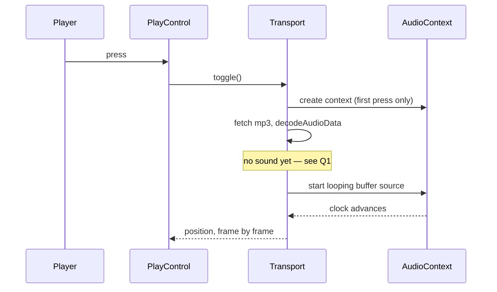

# PRD — Epic 2: The bar highlight lands on the beat

Feature: [briefing.md](../briefing.md) · [roadmap.md](../roadmap.md)

## Summary

The four-bar progress track stops drifting away from the music it is drawing.
Playback moves off `HTMLAudioElement` and onto Web Audio: the groove is decoded
once and played through an `AudioBufferSourceNode` that loops at the musical
boundary rather than at the end of the mp3, position is read from the audio
graph's own clock instead of a media element's estimate, and the drawn position
is offset by the output device's reported latency. The result is a highlight
that lands on the downbeat you hear, on the first repeat and on the fiftieth,
on speakers and over Bluetooth. Because Web Audio cannot play progressively, the
play control gains a busy state covering the gap between the press and the first
sound.

## Problem

The briefing reports the visualisation is "sometimes out of sync with groove".
Four distinct causes were found in the current code, and "sometimes" is what a
mix of four independent errors looks like from the outside:

1. **A groove you are not listening to drove the picture.** `GroovePuzzle`
   passed the transport's global `position` into today's `TransportPanel`
   whatever was sounding. `isPlaying` gated only the highlighted segment; the
   fill rect swept regardless. Epic 1 removes the second groove, so this cause
   is already gone — this epic makes it structurally impossible rather than
   merely absent.
2. **The loop wraps at the end of the file, not the end of the music.**
   `element.loop` restarts at `duration`. The mp3s are longer than the grooves
   they carry: `groove-01` is a 9.169s file holding 9.143s of music (4 bars at
   105bpm), `groove-02` a 10.031s file holding 10.000s. So every repeat pins the
   display at 100% through the tail padding, and the groove itself gains ~30ms
   of silence per repeat — which is why playing along slides later the longer
   you loop.
3. **Output latency.** `currentTime` reports what the element has handed to the
   output device, not what has reached the listener: roughly 10–40ms wired and
   150–300ms over Bluetooth. Same code, different headphones — the most likely
   explanation for "sometimes".
4. **One head-delay constant for sixteen files.** `HEAD_DELAY_SECONDS` is a
   single measured value assumed to hold across the whole catalogue. True today
   because one `ffmpeg` configuration produced all of them, and silently wrong
   for the first groove minted under a different one.

Causes 2, 3 and 4 are all consequences of playing compressed audio through a
media element and asking it what time it is. Web Audio reaches all three.

## Scope

- Rewrite `lib/audio/audio.ts` as a Web Audio player: fetch, decode once, play
  through a looping buffer source.
- Set the loop points from the groove's own tempo and bar count, not from the
  file's duration.
- Derive position from the audio graph's clock, compensated for output latency.
- Remove the shared head-delay constant in favour of a per-file value, or of
  nothing at all if decoding already strips the encoder delay.
- Add a busy state to the play control for the fetch-and-decode gap.
- Keep the transport, hook and panel contracts Epic 1 hands over unchanged.

**Out of scope**
- **Tempo control, count-in, transpose, jam mode.** The catalogue plays at its
  recorded tempo.
- **Regenerating or re-encoding the catalogue.** The fix goes in the player, not
  in the mp3s.
- **Caching decoded buffers across sessions or preloading tomorrow's groove.**
  One groove a day is one decode.
- **The visual design of the track.** `ProgressTrack` and its four segments,
  colours and markers are unchanged; only the number fed to them changes.
- **A fallback player.** There is no second playback path for browsers without
  Web Audio; a browser that cannot decode gets the error state, not a quieter
  version of the feature.
- **User-facing latency calibration.** The correction uses what the browser
  reports and offers no control to tune it.

## Requirements

- **R1** — The groove loops at its musical boundary. Every repeat is exactly
  `bars × 4 × 60 / bpm` seconds long, with no added silence at the loop point.
- **R2** — The position the page draws is derived from the audio clock, not from
  a media element's reported time, and advances smoothly enough to animate a
  bar highlight.
- **R3** — The drawn position is offset by the output device's latency as the
  browser reports it, so the highlight corresponds to audio that has reached the
  listener rather than audio that has been queued. Where the browser reports a
  partial figure the correction is partial; where it reports none it is zero.
  The page never asks the player to calibrate it.
- **R4** — The loop boundary for a groove is derived from that groove's own
  audio and metadata. No constant is shared across catalogue entries.
- **R5** — Position is zero whenever nothing is playing, and the highlighted
  segment is absent. There is no held or decaying value after a stop.
- **R6** — No `AudioContext` is constructed until the player's first press. None
  exists during render or server prerender.
- **R7** — A press surfaces the existing error state with its retry affordance
  when playback cannot start, covering fetch failure, decode failure, a rejected
  start, and a browser with no `AudioContext` at all. There is no separate
  fallback path and no separate error message for the unsupported case.
- **R7a** — Between the press and the first sound, the play control shows a
  distinct busy state: inert to further presses, with its own label saying it is
  loading. It leaves that state when audio starts or when the press fails.
- **R8** — Stopping rewinds. The next press begins at bar 1.
- **R9** — The transport, `useTransport` and `TransportPanel` contracts from
  Epic 1 are unchanged. This epic replaces what sits behind them.
- **R10** — Repeated presses, and a press during decode, do not produce two
  sounding voices.

## Behaviour details

**The loop window.** `loopSecondsOf(groove)` already gives the musical length
from `bars` and `bpm`. What the epic must establish is where the music starts
inside the decoded buffer. `decodeAudioData` strips the encoder delay when the
file's LAME/Xing header is honoured, and browsers differ on whether they do. So
the offset is measured rather than assumed: compare the decoded buffer's length
against `loopSecondsOf(groove)`. A buffer that is already the musical length has
been trimmed — `loopStart` is 0. A longer one has not — the excess at the head
is the encoder delay for that file, and `loopStart` takes it.

**Press to sound.** Web Audio does not play progressively. A press now means
fetch → decode → start, where `HTMLAudioElement` would have begun on the first
buffered frames. The catalogue's files are small and the browser caches them, so
a second press is instant, but the first is not — and the control has to say so
rather than sitting in "Stop" over silence.

This means `PlayControl` gains a busy state: a prop that renders it inert with
its own label. Epic 1 removes `size`, `label` and `disabled` from that component
on the grounds that no caller can set them. The rule holds — at the end of Epic
1 none of the three has a caller — and this is a new prop with a real one,
designed for this state rather than the pruned trio reinstated. Its `text` pair
becomes a triple so the busy word lives beside the play and stop words.

**Backgrounded tabs.** `requestAnimationFrame` stops when the tab is hidden, so
the drawn position freezes while the audio keeps running. On return the next
frame reads the audio clock and the highlight snaps to where the music actually
is — no drift accumulates, because position is derived rather than counted.

## Acceptance criteria

- **AC1** (R1) — Given any groove in the catalogue, when its loop window is
  computed, then `loopEnd - loopStart` equals `loopSecondsOf(groove)` to within
  one sample.
- **AC2** (R1, R2) — Given a playing groove and a driveable audio clock, when
  the clock advances past one full loop length, then position wraps to near zero
  rather than clamping at 1.
- **AC3** (R2) — Given a playing groove, when the clock is at 3/8 of the loop,
  then the highlighted segment is bar 2 (index 1).
- **AC4** (R3) — Given a context reporting 200ms of output latency, when the
  clock reads 200ms after start, then the drawn position is 0 — the first
  moment of audio has only just been heard.
- **AC4a** (R3) — Given a context reporting no latency figure at all, when
  position is read, then it is the uncorrected elapsed time rather than an
  error or a guessed constant.
- **AC5** (R4) — Given a decoded buffer longer than the groove's musical length,
  when the loop window is computed, then `loopStart` is the difference and not a
  shared constant.
- **AC6** (R5) — Given a groove that has been played and stopped, when position
  is read, then it is 0 and no segment is highlighted.
- **AC7** (R6) — Given the page has rendered and no control has been pressed,
  when the module is inspected, then no `AudioContext` has been constructed.
- **AC8** (R7) — Given decoding rejects, when the press resolves, then the error
  state is raised and the retry affordance is shown.
- **AC8a** (R7) — Given a browser with no `AudioContext`, when the control is
  pressed, then the same error state is raised, with no fallback player and no
  distinct message.
- **AC8b** (R7a) — Given a press whose fetch and decode have not resolved, when
  the control is inspected, then it is inert and labelled as loading.
- **AC8c** (R7a) — Given audio has started, when the control is inspected, then
  it has left the busy state and offers "Stop".
- **AC8d** (R7a) — Given a press that fails, when the error is raised, then the
  control has left the busy state.
- **AC9** (R8) — Given a groove stopped mid-loop, when it is pressed again, then
  position starts from 0.
- **AC10** (R10) — Given a press while a previous press is still decoding, when
  both resolve, then exactly one buffer source is started.

## Dependencies

Depends on Epic 1's single-groove transport. The three shapes Epic 1 pins are
this epic's inputs and stay fixed: the transport's `subscribe` / `isPlaying()` /
`getPosition()` / `toggle()` / `dispose()` surface, `useTransport`'s
`{ isPlaying, position, error, toggle }` return, and `TransportPanel`'s
`{ position, isPlaying }` props.

`loopSecondsOf(groove)` in `lib/theory/music.ts` is the source of truth for the
loop length and is not modified.

This epic changes one thing Epic 1 hands over: `PlayControl` gains a busy prop
and a third word in its `text` set. `useTransport` grows the corresponding flag
alongside `isPlaying`, `position` and `error`. The transport's own surface and
`TransportPanel`'s props are unchanged.

## Assumptions

- Every groove in the catalogue is 4 bars of 4/4, as `loopSecondsOf` and
  `TransportPanel`'s `BAR_COUNT` both already assume.
- `AudioContext.outputLatency` is used where available, falling back to
  `baseLatency`, and to zero where neither is reported. Safari exposes only
  `baseLatency`; that is a smaller correction, not a wrong one.
- The decoded buffer is held for the session and decoded once. A day is one
  groove.
- Tests drive a stubbed `AudioContext`, since jsdom implements no Web Audio.
  That stub is the seam the timing assertions run against.
- Every browser this app targets has had Web Audio for a decade, so the
  unsupported branch is a guard rather than a path anyone is expected to hit.
- The busy state reuses the disabled treatment `Button` already has rather than
  introducing a new visual state in the design system.

## Question log

Answered questions, kept for traceability. The requirements above are the source
of truth — this records how they got there. Append-only: never rewrite or prune
a past cycle, or the record stops being trustworthy.

### Cycle 1 — 2026-08-30

**Q1. What does the control show between the press and the first sound?**
Answer: **B) A distinct loading state on the control — disabled, with its own
label — until the buffer is ready** — the control should not claim to be
playing while nothing is audible.
Applied to: Summary, Scope, R7a, AC8b, AC8c, AC8d, Behaviour details,
Dependencies, Assumptions

**Q2. What happens where Web Audio is unavailable or decoding fails?**
Answer: **A) Treat both as the existing playback error** — R7 already covers the
failure path, and a silent second code path is the kind of complexity this
feature is removing.
Applied to: Out of scope, R7, AC8a, Assumptions

**Q3. How much of the latency correction is worth shipping?**
Answer: **A) Use whatever the context reports, accepting that Safari is partly
corrected** — strictly better than today on every browser, and the aim was to
stop the bar running visibly ahead rather than to guarantee sample accuracy.
Applied to: Out of scope, R3, AC4a
