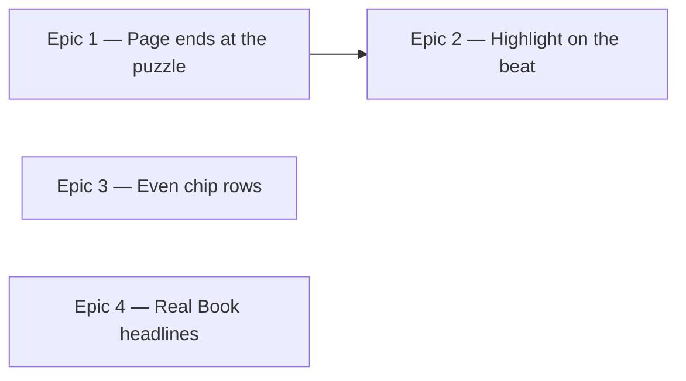

# Roadmap — Playback and Polish

Source: [briefing.md](briefing.md)

## Overview

Feature-6 takes the simplification of features 4 and 5 one step further and
finishes with two pieces of polish. The played-grooves row goes, and with it the
machinery that let one `AudioPlayer` be shared between today's card and the
archive — which is also what makes today's loop visualisation follow a groove
you are not listening to. Once the page has one player and one groove, the
remaining sync error in the bar highlight is worth chasing on its own. The chip
rows then get even spacing, and the headlines get a hand-lettered face in the
spirit of the Real Books.

History keeps being stored throughout. Only the UI that read it back and the
playback plumbing that served it are removed.

## Epics

### Epic 1 — The page ends at the puzzle

**Visible when done:** the "Grooves you've played" row is gone. The page runs
header → groove card + guess card → solved panel, and stops. Playback is one
button for one groove, and nothing on the page can put a second groove into the
player.
**Depends on:** none
**Parallel with:** Epic 3, Epic 4

**Scope**
- Delete `components/archive/` (`ArchiveStrip`, its test) and
  `lib/presentation/archive.ts` with its test.
- Delete `lib/puzzle/resolveGroove.ts` and its test — resolving a stored record
  back to a groove existed only to feed the strip.
- Strip `GroovePuzzle` of the archive plumbing it grew: `groovesByDate`,
  `archiveEntries`, `handleArchiveToggle`, `toggleSource`, and the
  `lastSource` ref that only existed because the retry button could not know
  which of several grooves had failed. Retry replays today's groove.
- Collapse `lib/audio/transport.ts` to one groove. `PlayableSource`,
  `ensurePlayerFor`, `releasePlayer`, the `playerId`-vs-`soundingId` split and
  the per-source `loopSeconds` all exist to switch the player between sources.
  What is left is start/stop/position for a single, known groove, and
  `soundingId` collapses to a boolean.
- Simplify `useTransport` to match the narrowed transport.
- Delete `MiniCard` and `MiniCardGrid` with their test. `ArchiveStrip` was their
  only caller, and an unrendered component is dead code however clean it is.
  `surfaces` keeps `Card` and `Panel`.
- Update both structure tests: in `structure.test.ts` the region list becomes
  `header` and `puzzle` and `ArchiveStrip` leaves `REGIONS`; in
  `src/components/structure.test.ts` `MiniCard` leaves the `surfaces` group.
- Prune the `PlayControl` props that had no second caller once the strip is
  gone (`size="sm"`, `disabled`, `label`) — only those genuinely unreachable
  from the remaining call site.

**Out of scope**
- Storage. `useProgress`, `lib/persistence/*`, the `DailyResult` records and
  their `grooveId` field all stay exactly as they are (briefing: "keep storing
  the history for now"). The streak keeps being computed from that history.
- The residual bar-highlight error, which Epic 2 owns. This epic removes the
  cross-groove case; it does not re-derive position.
- Any archive or replay route. Nothing replaces the row.

**Validation**
- Demo: load the app with several days of history in `localStorage`. Below the
  guess card there is nothing. Press play; the bar highlight moves. There is no
  second control anywhere on the page.
- `GroovePuzzle.test.tsx` loses its archive cases; the remaining suite proves
  the day still plays, guesses, solves and shows the streak with history
  present.
- `useProgress` and `streak` tests are untouched and still pass — the proof that
  removal stopped at the UI.
- `structure.test.ts` and `src/components/structure.test.ts` pass against the
  new tree.
- A clean `npm run lint`, `npm test` and `npm run build`.

### Epic 2 — The bar highlight lands on the beat

**Visible when done:** play a groove and watch the four-bar track. The
highlighted segment changes on the downbeat you hear, and it still does on the
fifth repeat of the loop, and on the fiftieth. On a Bluetooth output the picture
and the sound agree instead of the bar running visibly ahead.
**Depends on:** Epic 1 — both rewrite `lib/audio/transport.ts`, and the player
swap should be written against the single-groove transport, not the switching
one.
**Parallel with:** —

**Scope**

The briefing asks what is wrong. Four causes were found in the current code;
this epic settles each one:

1. **A groove you are not listening to drives the picture.** `GroovePuzzle`
   passes the transport's global `position` into today's `TransportPanel`
   whatever is sounding. `isPlaying` gates only the highlighted *segment* — the
   fill rect sweeps regardless. So while an archive card played, today's card
   ran on a different groove's clock at a different loop length. Epic 1 removes
   the second groove; this epic makes it structurally impossible by having the
   panel take its position from the one thing that is sounding, and show zero
   when nothing is.
2. **The loop wraps at the end of the file, not the end of the music.**
   `element.loop` restarts at `duration`, and the mp3 is longer than the
   groove: `groove-01` is a 9.169s file carrying 9.143s of music (4 bars at
   105bpm), `groove-02` a 10.031s file carrying 10.000s. So every repeat pins
   the display at 100% through the tail padding, and — the audible half — the
   groove gains ~30ms of silence per repeat, which is why playing along drifts
   later the longer you loop.
3. **Output latency.** `currentTime` reports what the element has handed to the
   output device, not what has reached your ears: ~10–40ms wired, 150–300ms
   over Bluetooth. Same code, different headphones — which is what "sometimes"
   most likely is.
4. **One head-delay constant for sixteen files.** `HEAD_DELAY_SECONDS` is a
   single measured value assumed identical across the catalogue. True today
   because one ffmpeg configuration produced all of them, and silently wrong for
   any groove minted under a different one.

Cause 1 is Epic 1's by construction; this epic makes it structurally impossible
rather than merely absent. Causes 2, 3 and 4 are settled by moving playback off
`HTMLAudioElement` and onto Web Audio, which is the only option that reaches all
three:

- `lib/audio/audio.ts` is rewritten. `createAudioPlayer` fetches the mp3,
  decodes it once with `AudioContext.decodeAudioData`, and plays it through an
  `AudioBufferSourceNode` with `loop = true`, `loopStart` at the downbeat and
  `loopEnd` at `loopStart + loopSeconds`. The loop point is then the musical
  boundary, not the end of the file, so cause 2 is gone and the ~30ms of silence
  per repeat with it.
- Position stops being a polled `element.currentTime` and becomes elapsed
  `AudioContext.currentTime` since the node started, wrapped by `loopSeconds`.
  The `requestAnimationFrame` poll stays — it is what keeps the bar moving
  frame by frame — but it now reads a clock in the audio graph rather than a
  media element's estimate.
- Compensate for output latency with `AudioContext.outputLatency`, falling back
  to `baseLatency` where it is unavailable, so the picture is drawn against what
  has reached the speakers rather than what has been queued (cause 3).
- Establish whether the decoded buffer still carries the encoder delay.
  `decodeAudioData` strips it when the file's LAME/Xing header is honoured, and
  browsers differ. Measure it rather than assume it: if the buffer is clean,
  `loopStart` is 0 and `HEAD_DELAY_SECONDS` is deleted; if not, `loopStart` is
  derived per file from the decoded buffer's own length against
  `loopSecondsOf(groove)`, which removes the one-constant-for-sixteen-files
  fragility either way (cause 4).
- The context is created on the first press, not at import — an `AudioContext`
  built without a user gesture starts suspended under every browser's autoplay
  policy, and none may exist during a server prerender. Keep the existing
  play/stop/error surface so the retry path and `useTransport` do not change
  shape.

**Out of scope**
- Tempo control, count-in, transpose — a jam mode is its own feature.
- Regenerating or re-encoding the catalogue. The fix goes in the player, not in
  the mp3s.
- Preloading or caching decoded buffers across sessions. One groove per day is
  one decode.

**Validation**
- Demo: play a groove for at least four full repeats with a wired output. The
  segment boundary and the downbeat stay together; there is no visible pause at
  the end of the bar four segment.
- Unit tests on the transport against a stubbed `AudioContext` with a driveable
  clock — jsdom has no Web Audio, so the fake is the seam: position at the
  downbeat, at the segment boundaries, across a loop wrap, and at zero when
  stopped.
- A test that `loopEnd - loopStart` equals `loopSecondsOf(groove)` for every
  groove in the catalogue, which is the assertion cause 2 actually turns on.
- A test that no `AudioContext` is constructed until the first press.
- `TransportPanel` tests keep their existing contract — position in, segment
  out — and gain the "nothing is sounding" case.
- Regression test that the panel reads zero whenever playback is not running.

### Epic 3 — Chip rows read as even rows

**Visible when done:** every row of chips on the page spreads across its card
instead of bunching to the left with dead space on the right — the twelve root
chips, the four flavour chips, and the solved panel's "The changes" and "Notes
to live in" columns.
**Depends on:** none
**Parallel with:** Epic 1, Epic 4

The row becomes a CSS grid with a fixed column count, not a wrapping flex row
with `justify-between`. Both of the cases that would break `justify-between` are
real here: twelve roots wrap at narrow widths and would leave the last row
stretched across the card, and "The changes" holds exactly two chips — one of
them a full progression like `C7–Em7♭5–B♭maj7–Fmaj7` — which `justify-between`
would pin to opposite edges. A grid is even by construction in both.

**Scope**
- `ChipGroup` lays its chips out on a grid with a responsive column count rather
  than `flex flex-wrap`. Roots (12) and flavours (4) both go through it, so they
  change together, and the count is chosen so every row is full at each
  breakpoint.
- A chip now fills its grid cell, which is what makes the row even. That
  subsumes `width="fixed"` — the prop either goes or stops meaning anything, and
  the epic should resolve which rather than leave a dead prop behind.
- `SolvedPanel`'s two `LabelledColumn`s get the same grid. They do *not* go
  through `ChipGroup`: the panel has its own local `ValueChips` row because its
  chips are disabled and `inverted`, and the two stay separate. Merging them
  would mean a `ChipGroup` carrying a tone and a read-only mode, which is more
  surface than the duplication costs. Applying the same rule twice is the
  cheaper trade.
- Column counts to settle in the epic: 12 roots, 4 flavours, 2 changes, 7 scale
  notes — the changes row is the awkward one, since its two chips differ
  wildly in natural width.

**Out of scope**
- The chip's own visual design — size, radius, selected and inverted states.
  Only the distribution of the row changes.
- The panel's two-column layout (`PanelColumns`) and its labels.
- Hoisting a shared `ChipRow` primitive. `ChipGroup` and `ValueChips` stay two
  components.

**Validation**
- Demo: at desktop width, the root row, the flavour row and both solved-panel
  columns each span their container evenly. Narrow the window until the column
  count drops; every row stays full, with no stretched orphan. Solve a day and
  check the two-chip "The changes" row does not read as two chips flung apart.
- `ChipGroup.test.tsx` asserts the grid contract at the component level, per
  `docs/testing.md` — the design system is tested against its own contract, not
  through the puzzle — including that a 12-item and a 4-item group both leave no
  partial row.
- `SolvedPanel.test.tsx` covers its own rows, including the two-item case.
- Existing `Chip` and `GuessCard` tests still pass unchanged.

### Epic 4 — Headlines in a Real Book hand

**Visible when done:** "Daily Groove" and the groove's name are set in a
hand-lettered jazz face instead of Newsreader, in both palettes, with no layout
shift on load. Nothing else on the page changes face.
**Depends on:** none
**Parallel with:** Epic 1, Epic 3

**Scope**
- Pick and vendor the face. The original Real Book is hand-lettered rather than
  typeset, and the Hal Leonard editions use **Finale Jazz / Jazz Text**
  (MakeMusic), which is proprietary and cannot be self-hosted here. The closest
  freely licensable match is **Petaluma Script** (Steinberg/MuseScore, SIL OFL
  1.1) — drawn from hand-copied jazz lead sheets, and licensed for embedding.
  Google Fonts fallbacks if it reads wrong at size: Caveat, Just Another Hand,
  Nanum Pen Script.
- Commit the font file and its OFL licence text into the repo.
- Load it with `next/font/local` in `src/app/layout.tsx` alongside the existing
  `next/font/google` faces (confirmed available in Next 16.3 —
  `node_modules/next/dist/docs/01-app/01-getting-started/13-fonts.md`), exposing
  it as a CSS variable the way `--font-newsreader` is exposed today.
- Add a `--font-jazz` token in `globals.css` pointing at it, with a serif
  fallback stack, and have `Heading` read that instead of `--font-display`. One
  token swap re-themes the h1 and the groove card title, since the design system
  already reads a token rather than naming a family.
- `--font-display` stays on Newsreader and keeps serving `NudgeBox`, which sets
  the revealed root note. The jazz face is for headlines only: a hand-lettered
  `E♭` at 15px is the one place on this page where legibility outweighs
  character. Adding a token rather than repointing the existing one also means
  `NudgeBox` needs no edit, and `layout.test.ts`'s existing Newsreader assertion
  keeps holding.
- Check both palettes and the `xl` (44px) and `sm` (19px) ends of the `Heading`
  size scale. A hand face at 19px is the size that decides whether the pick
  works.

**Out of scope**
- Body text. `--font-sans` / DM Sans is untouched.
- The revealed root note in `NudgeBox`, and the chord and progression symbols in
  the solved panel. All stay as they are.
- Any new design-system component.

**Validation**
- Demo: the h1 and the groove card's title render in the new face on a hard
  reload, in light and dark. The nudge's revealed root still reads as a serif.
- `globals.test.ts` gains `--font-jazz` alongside the tokens it already guards;
  `--font-display` and `--font-sans` assertions are untouched.
- `Heading.test.tsx` asserts it renders on the jazz token, not `--font-display`.
- `layout.test.ts` asserts the new local font's variable reaches the `html`
  element, and keeps its existing Newsreader and DM Sans assertions.
- Licence file present in the repo next to the font.

## Dependency map

## Execution waves

- **Wave 1 (parallel):** Epic 1, Epic 3, Epic 4 — three disjoint file sets:
  the feature slice's archive and audio; `ChipGroup` and `SolvedPanel`;
  `Heading` and the font layer.
- **Wave 2:** Epic 2 — needs Epic 1's single-groove transport to fix against.

## Assumptions

- "Remove the grooves you've played section" means the UI and its data
  plumbing, not the stored records. The briefing's next line says history keeps
  being stored, so `DailyResult` keeps its `grooveId` even though nothing reads
  it back after Epic 1 — the field costs nothing and its absence would be
  expensive to reintroduce.
- The streak survives untouched. It is computed from the stored results
  (`lib/persistence/streak.ts`), never persisted as a number, so removing the
  archive UI cannot affect it.
- The catalogue's grooves are all 4 bars of 4/4, as `loopSecondsOf` and
  `TransportPanel`'s `BAR_COUNT` both already assume. Epic 2's loop points are
  derived the same way rather than measured off the audio.
- The four sync causes in Epic 2 are the whole list. If the implementation
  finds a fifth, it belongs in Epic 2 rather than a new epic.
