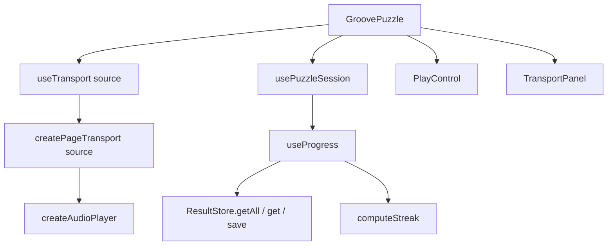

# Tech spec — Epic 1: The page ends at the puzzle

PRD: [../prd/epic-1-page-ends-at-the-puzzle.md](../prd/epic-1-page-ends-at-the-puzzle.md) ·
Roadmap: [../roadmap.md](../roadmap.md)

## Approach

This is a subtraction epic, and its shape is set by one fact: `GroovePuzzle` is
the hub. The archive strip, the multi-source transport, the `history` return on
both progress hooks and three `PlayControl` props all have exactly one thing
keeping them alive, and it is that component. Nothing else can be narrowed until
the strip is out of it.

So the work runs as one track that removes the archive and rewrites
`GroovePuzzle`, then three independent tracks that narrow what the removal
orphaned — the transport, the progress hooks, the design system — each owning
its own files and verifiable on its own. TDD for a deletion is inverted: the red
step is an assertion that something is *absent*, or an existing assertion
rewritten to the new truth, run against the current code to watch it fail before
the code goes.

## Architecture

After this epic the feature has one player, one groove and one control:



The transport is constructed for a known source and cannot be pointed at
another. `soundingId` is gone: the question every control used to ask — "is the
sounding groove mine?" — has one answer now, so it becomes `isPlaying()`.
Exclusivity stops being a property the transport enforces and becomes a fact
about the page: there is one source.

`useProgress` keeps the full record list in component state, because
`computeStreak` needs every record and the list is what `recordAttempt` updates
optimistically. What changes is that the list stops being returned.

## Contracts

Frozen before Track A starts. Tracks B, C and D implement behind them; Track A
writes `GroovePuzzle` against them.

```ts
// src/features/daily-groove/lib/audio/transport.ts
export type PlayableSource = {
  src: string
  /** Musical loop length in seconds, from `loopSecondsOf(groove)`. */
  loopSeconds: number
}

export type PageTransport = {
  subscribe(fn: () => void): () => void
  isPlaying(): boolean
  getPosition(): number
  /** Starts the source, or stops it if it is already running. */
  toggle(): Promise<void>
  dispose(): void
}

export function createPageTransport(source: PlayableSource): PageTransport
```

```ts
// src/features/daily-groove/hooks/useTransport.ts
export type UseTransport = {
  isPlaying: boolean
  position: number
  error: boolean
  toggle(): Promise<void>
}

export function useTransport(source: PlayableSource): UseTransport
```

```ts
// src/features/daily-groove/hooks/useProgress.ts
export type UseProgress = {
  todayResult: DailyResult | null
  streak: number
  recordAttempt: (day: DayProgress) => Promise<void>
  loaded: boolean
}
// `history` removed.
```

```ts
// src/features/daily-groove/hooks/usePuzzleSession.ts
// UsePuzzleSession loses `history`; every other field is unchanged.
```

```ts
// src/components/controls/PlayControl.tsx
type PlayControlProps = {
  isPlaying: boolean
  onToggle: () => void
  text?: { play: string; stop: string }
}
// `size`, `label` and `disabled` removed.
```

## Tracks

### Track A — The page loses its archive

- **Goal** — no played-grooves section renders, `GroovePuzzle` holds no archive
  plumbing, and the archive's modules are gone from the tree.
- **Owns** — `src/features/daily-groove/components/GroovePuzzle.{tsx,test.tsx}`,
  `src/features/daily-groove/components/archive/**`,
  `src/features/daily-groove/lib/presentation/archive.{ts,test.ts}`,
  `src/features/daily-groove/lib/puzzle/resolveGroove.{ts,test.ts}`,
  `src/features/daily-groove/structure.test.ts`
- **Depends on** — the contracts above only. It calls `useTransport(source)` and
  reads `isPlaying`, which Track B implements behind it.
- **Parallel with** — nothing. It is the precondition for B, C and D.
- **Done when** — the page renders no archive, `GroovePuzzle.test.tsx` passes
  with its archive cases removed, and the feature's structure test passes.

### Track B — One transport, one groove

- **Goal** — `createPageTransport(source)` and `useTransport(source)` match the
  contracts, with no source switching left inside.
- **Owns** — `src/features/daily-groove/lib/audio/transport.{ts,test.ts}`,
  `src/features/daily-groove/hooks/useTransport.{ts,test.ts}`
- **Depends on** — Track A, which removes the second caller of `toggle(source)`.
- **Parallel with** — Track C, Track D.
- **Done when** — its own tests pass and no `soundingId` remains in the module.

### Track C — The progress hooks stop handing out records

- **Goal** — neither hook returns the record list; the streak still reads every
  stored record.
- **Owns** — `src/features/daily-groove/hooks/useProgress.{ts,test.ts}`,
  `src/features/daily-groove/hooks/useProgress.integration.test.ts`,
  `src/features/daily-groove/hooks/usePuzzleSession.{ts,test.ts}`
- **Depends on** — Track A, which removes the only reader of `history`.
- **Parallel with** — Track B, Track D.
- **Done when** — its own tests pass with every `history` assertion rewritten to
  assert through `streak` and `todayResult`.

### Track D — The design system loses what nothing renders

- **Goal** — `MiniCard` and `IconButton` are gone, `PlayControl` carries three
  props, and the design system's structure test says so.
- **Owns** — `src/components/surfaces/MiniCard.{tsx,test.tsx}`,
  `src/components/controls/IconButton.{tsx,test.tsx}`,
  `src/components/controls/PlayControl.{tsx,test.tsx}`,
  `src/components/structure.test.ts`
- **Depends on** — Track A, which removes `ArchiveStrip`, the only caller of
  `MiniCard` and of `PlayControl`'s `sm` branch.
- **Parallel with** — Track B, Track C.
- **Done when** — its own tests pass and neither deleted module is imported
  anywhere.

## Execution waves

- **Wave 1:** Track A alone. This epic parallelizes less than most, and saying
  so is more useful than inventing tracks that would collide: every other
  narrowing is waiting on the archive leaving `GroovePuzzle`.
- **Wave 2 (parallel):** Track B, Track C, Track D — disjoint files, no shared
  edits, each verifiable alone.
- **Wave 3:** Integration.

## Implementation

### Track A — The page loses its archive

#### Step A1 — No played-grooves section renders

Covers: R1, AC1, AC2

- **Test first** — `src/features/daily-groove/components/GroovePuzzle.test.tsx`:
  in a new case, seed `localStorage` with five solved days, `await
  renderFeature()`, then assert
  `screen.queryByText(/Grooves you.{0,3}ve played/)` is `null` and
  `screen.queryByRole('region')` finds no archive section. Run it: fails —
  the heading is found.
- **Implement** — `GroovePuzzle.tsx`: remove the `<ArchiveStrip …/>` element and
  its import.
- **Green when** — the new case passes. The existing archive cases now fail;
  Step A2 removes them.
- **Refactor** — none yet.

#### Step A2 — The archive's own tests and modules leave the tree

Covers: R7, AC8

- **Test first** — delete from `GroovePuzzle.test.tsx` every case that asserts
  on the strip: the six named for `E5 R1`–`R11` plus
  `names the groove on each archive card`,
  `shows past days, and today once it is finished`,
  `shows today "In play" without its answer`,
  `shows the designed empty archive state on a first run`,
  `disables the control of a day whose groove has left the catalogue`,
  `still replays a day saved before groove ids existed` and
  `writes nothing to a record when a day is replayed`. Run the suite: it fails
  on the still-present `ArchiveStrip.test.tsx` and `archive.test.ts`, which
  import modules Step A1 orphaned.
- **Implement** — delete `src/features/daily-groove/components/archive/`
  (both files), `lib/presentation/archive.ts` and `archive.test.ts`,
  `lib/puzzle/resolveGroove.ts` and `resolveGroove.test.ts`.
- **Green when** — the suite passes with those files absent and no module
  imports them.
- **Refactor** — remove the now-unused imports from `GroovePuzzle.tsx`:
  `toArchiveEntries`, `ArchiveEntry`, `resolveGrooveForResult`, `ArchiveStrip`,
  `ArchiveStripEntry`.

#### Step A3 — `GroovePuzzle` holds no archive plumbing

Covers: R8

- **Test first** — `GroovePuzzle.test.tsx`: assert the composed page renders
  with a store holding a day whose `grooveId` names a groove absent from
  `GROOVES`, and that it neither throws nor renders a disabled control. Run it:
  passes already — so instead make this step's proof structural, asserting in
  `structure.test.ts` that `GroovePuzzle.tsx`'s source contains none of
  `groovesByDate`, `archiveEntries`, `handleArchiveToggle`, `toggleSource`,
  `lastSource`. Run it: fails, all five are present.
- **Implement** — `GroovePuzzle.tsx`: delete the `groovesByDate` and
  `archiveEntries` memos, `handleArchiveToggle`, the `lastSource` ref and the
  `toggleSource` indirection. `handleToggle` calls `toggle()` directly.
- **Green when** — the structural assertion passes and the component suite stays
  green.
- **Refactor** — drop the `history` destructure from the `usePuzzleSession`
  call; Track C removes it from the hook.

#### Step A4 — Exactly one play control on the page

Covers: R2, AC3

- **Test first** — `GroovePuzzle.test.tsx`: with five days of history seeded,
  assert `screen.getAllByRole('button', { name: /play|stop/i })` has length 1.
  Run it: passes after A1 — so run it *before* A1 to confirm it fails with
  length 6, then keep it as the regression guard.
- **Implement** — none; A1 and A3 satisfy it.
- **Green when** — the assertion holds.
- **Refactor** — none.

#### Step A5 — Retry replays today's groove

Covers: R4, AC6

- **Test first** — `GroovePuzzle.test.tsx`: rewrite
  `clears the error and plays again on retry` so the mocked player rejects the
  first press, then assert the retry press calls the transport's `toggle` and
  that the player was constructed with today's `audioSrc`. Run it: fails —
  `handleRetry` still reads `lastSource.current`.
- **Implement** — `GroovePuzzle.tsx`: `handleRetry` becomes `handleToggle`.
- **Green when** — the rewritten case passes.
- **Refactor** — none.

#### Step A6 — The component regions are `header` and `puzzle`

Covers: R10, AC9

- **Test first** — `src/features/daily-groove/structure.test.ts`: change
  `REGIONS` to drop the `archive` key, and change
  `contains exactly the three region directories` to expect
  `['header', 'puzzle']`, renaming it to `two`. Run it: passes if A2 landed;
  run it before A2 to see it fail with `['archive', 'header', 'puzzle']`.
- **Implement** — none beyond A2.
- **Green when** — the structure test passes.
- **Refactor** — none.

### Track B — One transport, one groove

#### Step B1 — The transport is built for a source and reports a boolean

Covers: R5, R6, AC7

- **Test first** — `src/features/daily-groove/lib/audio/transport.test.ts`:
  rewrite the construction cases to
  `const t = createPageTransport({ src: '/grooves/groove-01.mp3', loopSeconds: 9.142857 })`,
  then assert `t.isPlaying()` is `false`, `await t.toggle()` makes it `true`,
  and that `t` has no `getSoundingId`. Run it: fails —
  `createPageTransport` takes no argument and `toggle` requires a source.
- **Implement** — `transport.ts`: `createPageTransport(source: PlayableSource)`;
  replace `soundingId: string | null` with `running: boolean`; `getSoundingId`
  becomes `isPlaying`; `toggle()` takes no argument.
- **Green when** — the rewritten construction cases pass.
- **Refactor** — none yet.

#### Step B2 — One player is built, however many times it is toggled

Covers: R6

- **Test first** — `transport.test.ts`: toggle three times (start, stop, start)
  and assert the stubbed `Audio` constructor was called exactly once. Run it:
  fails if `ensurePlayerFor` is still keyed on a source id.
- **Implement** — `transport.ts`: delete `ensurePlayerFor`, `releasePlayer`'s
  rebuild path and `playerId`. Build the player lazily on the first press and
  keep it; `dispose()` releases it.
- **Green when** — the constructor-count assertion passes.
- **Refactor** — `loopSeconds` becomes a closed-over constant from `source`
  rather than mutable state.

#### Step B3 — Position maps onto the source's loop length

Covers: R5

- **Test first** — `transport.test.ts`: with `loopSeconds: 10`, drive the fake
  element's `currentTime` to `HEAD_DELAY_SECONDS + 2.5` and assert
  `getPosition()` is `0.25`; stop and assert it is `0`. Run it: fails while
  `loopSeconds` is still assigned per toggle.
- **Implement** — `transport.ts`: `getPosition` reads the constant.
- **Green when** — both assertions pass.
- **Refactor** — none.

#### Step B4 — `useTransport` takes the source and returns `isPlaying`

Covers: R5, R6

- **Test first** — `src/features/daily-groove/hooks/useTransport.test.ts`:
  `renderHook(() => useTransport({ src, loopSeconds: 9.142857 }))`, assert the
  returned object's keys are exactly
  `['isPlaying', 'position', 'error', 'toggle']`, and that `toggle()` with no
  argument starts playback. Run it: fails — the hook takes no argument and
  returns `soundingId`.
- **Implement** — `useTransport.ts`: accept `source`, pass it to
  `createPageTransport` inside the `useState` initialiser, and subscribe to
  `transport.isPlaying` instead of `transport.getSoundingId`.
- **Green when** — the key assertion and the toggle case pass.
- **Refactor** — none.

### Track C — The progress hooks stop handing out records

#### Step C1 — `useProgress` no longer returns the record list

Covers: R3a, AC5a

- **Test first** — `src/features/daily-groove/hooks/useProgress.test.ts`: change
  the existing key assertion at the `'history'` line to expect exactly
  `['todayResult', 'streak', 'recordAttempt', 'loaded']`. Run it: fails,
  `history` is present.
- **Implement** — `useProgress.ts`: drop `history` from `UseProgress` and from
  the returned object; delete the `history` memo and `sortMostRecentFirst`.
- **Green when** — the key assertion passes.
- **Refactor** — remove the now-unused `DailyResult[]` import if it is orphaned.

#### Step C2 — The streak still reads every stored record

Covers: R3, R3a, AC4, AC5b

- **Test first** — `useProgress.test.ts`: rewrite the three cases that asserted
  on `history` — the empty-store case, the
  `loads today's existing result and derives streak/history` case and the
  `carries the groove id through to the history it derives` case — to assert on
  `streak` and `todayResult` instead. For the groove-id case, seed a record with
  `grooveId: 'groove-11'` and assert `todayResult.grooveId` is `'groove-11'`.
  Run them: they fail while still reading `result.current.history`.
- **Implement** — none beyond C1.
- **Green when** — all three pass and the streak values are unchanged from
  before the epic.
- **Refactor** — none.

#### Step C3 — The integration test asserts through the store

Covers: R3, AC5b

- **Test first** — `useProgress.integration.test.ts`: replace
  `expect(second.result.current.history).toEqual([expected])` with an assertion
  that `await store.getAll()` contains `expected`, and
  `history[0].grooveId` with `todayResult.grooveId`. Run them: fail while
  reading a field that no longer exists.
- **Implement** — none.
- **Green when** — both pass, proving the records are still written and
  readable.
- **Refactor** — none.

#### Step C4 — `usePuzzleSession` no longer returns the record list

Covers: R3a, AC5a

- **Test first** — `src/features/daily-groove/hooks/usePuzzleSession.test.ts`:
  rewrite `exposes the streak and the history the day is played against` to
  assert only on `streak`, and drop the two `history` assertions. Add an
  assertion that the returned object has no `history` key. Run it: fails.
- **Implement** — `usePuzzleSession.ts`: drop `history` from
  `UsePuzzleSession`, from the `useProgress` destructure and from the return.
- **Green when** — the case passes.
- **Refactor** — update the hook's doc comment, which currently says the streak
  and history are returned together.

### Track D — The design system loses what nothing renders

#### Step D1 — `PlayControl` carries three props and renders the button form

Covers: R9, AC8a

- **Test first** — `src/components/controls/PlayControl.test.tsx`: delete the
  cases that pass `size`, `label` or `disabled`; add one asserting that
  `<PlayControl isPlaying={false} onToggle={fn} />` renders a full-width
  `button` whose accessible name is `Play the loop`. Run it: passes — so add
  the structural assertion instead, in `src/components/structure.test.ts`, that
  `PlayControl.tsx`'s source contains none of `size`, `PlayControlSize`,
  `disabled` or `IconButton`. Run it: fails, all four are present.
- **Implement** — `PlayControl.tsx`: remove `size`, `label`, `disabled`,
  `PlayControlSize`, the `IconButton` import and the `sm` branch. `NAME` is read
  directly, with no `label` override.
- **Green when** — the structural assertion and the component's own suite pass.
- **Refactor** — none.

#### Step D2 — `IconButton` is gone from `controls`

Covers: R7, R10, AC8

- **Test first** — `src/components/structure.test.ts`: remove `'IconButton'`
  from the `controls` list. Run it: fails — the file still exists and the
  "every listed component has a file" assertion is now inverted, so also assert
  no unlisted file remains in `controls`. Run it: fails on `IconButton.tsx`.
- **Implement** — delete `src/components/controls/IconButton.tsx` and
  `IconButton.test.tsx`.
- **Green when** — the structure test passes.
- **Refactor** — none.

#### Step D3 — `MiniCard` is gone from `surfaces`

Covers: R7, R10, AC8

- **Test first** — `src/components/structure.test.ts`: change the `surfaces`
  list to `['Card', 'Panel']`. Run it: fails on the leftover `MiniCard.tsx`.
- **Implement** — delete `src/components/surfaces/MiniCard.tsx` and
  `MiniCard.test.tsx`.
- **Green when** — the structure test passes.
- **Refactor** — none.

## Integration and verification

#### Step I1 — `TransportPanel` still receives its two props

Covers: R11, AC10

- **Test first** — `GroovePuzzle.test.tsx`: keep
  `moves the bar highlight with the player's position` and
  `renders the groove card header and the transport, with no tempo` unchanged,
  and re-run them against the narrowed transport. Run them: they fail if Track
  B changed the shape `GroovePuzzle` feeds the panel.
- **Implement** — wire `GroovePuzzle` to `useTransport(source)` where `source`
  is `{ src: groove.audioSrc, loopSeconds: loopSecondsOf(groove) }`, memoised on
  `groove`, and pass `isPlaying` straight through.
- **Green when** — both pass and `TransportPanel.test.tsx` is untouched.
- **Refactor** — none.

#### Step I2 — Removability and a clean build

Covers: R12, AC11

- **Test first** — `src/app/route-boundary.test.ts` and both structure tests,
  unchanged, plus `npm run lint`.
- **Implement** — none.
- **Green when** — `npm test` passes with no file count regressions,
  `npm run lint` is clean, and `npm run build` succeeds.
- **Refactor** — none.

#### Step I3 — The demo path

Covers: R1, R2, R3, R4

Run `npm run dev`, seed `localStorage` with several solved days, and confirm:
below the guess card there is nothing; there is exactly one play control; the
header shows the expected streak; pressing play moves the bar highlight.

## Requirement coverage

| Requirement | Steps |
| :-- | :-- |
| R1 | A1, I3 |
| R2 | A4, I3 |
| R3 | C2, I3 |
| R3a | C1, C2, C4 |
| R4 | A5, I3 |
| R5 | B1, B3, B4 |
| R6 | B1, B2, B4 |
| R7 | A2, D2, D3 |
| R8 | A3 |
| R9 | D1 |
| R10 | A6, D2, D3 |
| R11 | I1 |
| R12 | I2 |
| AC1 | A1 |
| AC2 | A1 |
| AC3 | A4 |
| AC4 | C2 |
| AC5 | C3 |
| AC5a | C1, C4 |
| AC5b | C2, C3 |
| AC6 | A5 |
| AC7 | B1 |
| AC8 | A2, D2, D3 |
| AC8a | D1 |
| AC9 | A6 |
| AC10 | I1 |
| AC11 | I2 |

## Assumptions

- The `PlayableSource` object is memoised in `GroovePuzzleView` on `groove`, so
  the `useState` initialiser inside `useTransport` captures a stable value.
- `structure.test.ts` grows a source-text assertion for `GroovePuzzle.tsx` in
  Step A3. That is the same technique the file already uses for import
  specifiers, so it introduces no new mechanism.
- `src/components/structure.test.ts` gains a "no unlisted file in this group"
  assertion in Step D2, which it needs for a deletion to be provable at all.
- Deleted test files count against the suite total; the drop from 86 files is
  expected, not a regression.

## Decision log

Settled architectural decisions. The sections above are the source of truth —
this records how they got there, and what each one cost. Append-only: never
rewrite or prune a past cycle.

### Cycle 1 — 2026-08-30

**Q1. Where does the transport learn which groove it plays?**
Decision: **A) At construction — `createPageTransport(source)` and `toggle()`** —
R6 requires that the transport cannot be pointed at another groove, and a source
captured at construction is the only option that makes that true by type rather
than by convention.
Changed: nothing. The Contracts section and Steps B1–B4 were written against
this shape, so the decision confirms the design rather than altering it.

**Q2. What does `useProgress` keep in state now that nothing reads the list?**
Decision: **A) Keep the full `DailyResult[]` in state and derive `streak` from
it** — it is what makes AC4 and the optimistic streak update work without a
reload; collapsing it would turn a synchronous derive into an async round trip
after every write.
Changed: nothing. Step C1 removes only the `history` return and
`sortMostRecentFirst`; the `all` state and the `streak` memo were already
staying.
