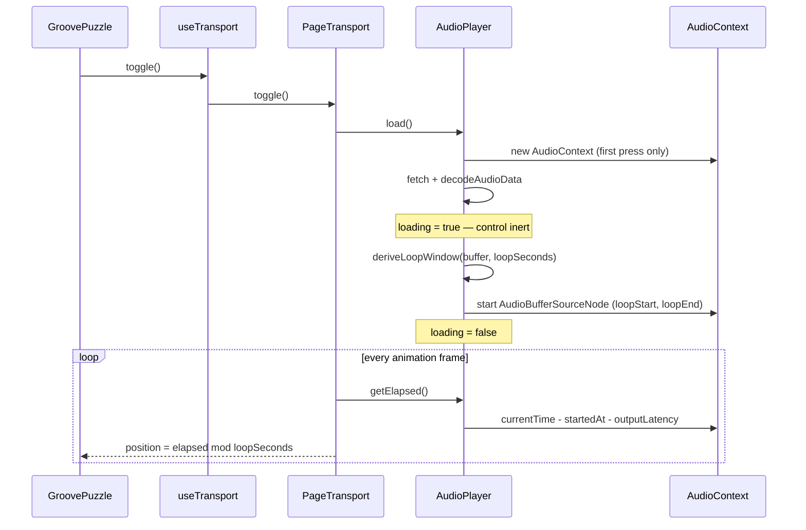

# Tech spec — Epic 2: The bar highlight lands on the beat

PRD: [../prd/epic-2-highlight-lands-on-the-beat.md](../prd/epic-2-highlight-lands-on-the-beat.md) ·
Roadmap: [../roadmap.md](../roadmap.md)

## Approach

The player is replaced, not patched. `createAudioPlayer` stops wrapping an
`Audio` element and becomes a Web Audio player: fetch the mp3, decode it once
with `decodeAudioData`, and play it through an `AudioBufferSourceNode` whose
`loopStart` and `loopEnd` bracket the music rather than the file. Position stops
being `element.currentTime / duration` and becomes elapsed `AudioContext.currentTime`
since the node started, minus the output latency the context reports.

Where the music starts inside each file is not guessed at runtime. The
generator already invokes `ffmpeg`, and `ffprobe` reports the encoder delay
exactly — `start_time` on the audio stream, 0.025057s across the current
catalogue, which is 1105 samples at 44.1kHz. So the generator measures it once
per file and writes it into the manifest as a `Groove` field, and the app reads
a number it was given rather than inferring one from durations.

That leaves four things that can be built at once: the loop arithmetic, the
player, the busy state the UI needs because Web Audio cannot play
progressively, and the generator's new field.

## Architecture



`HEAD_DELAY_SECONDS` is deleted, and nothing replaces it in the app. Each
`Groove` carries its own `headDelaySeconds`, measured from its own mp3 at mint
time by `ffprobe` and rendered into `grooves.generated.ts` beside `bpm` and
`bars`. A groove minted under a different encoder configuration therefore
carries a different, correct number, with no code path aware that it differs.

This is the one place the epic reaches outside `src/features/daily-groove`. The
PRD scopes the fix to the player and rules out re-encoding the catalogue, and
that rules out `npm run grooves` as it stands: it encodes every groove on every
run, so a plain regeneration would rewrite all sixteen mp3s to satisfy a change
that is purely metadata. Encoders differ between ffmpeg builds, so those bytes
could differ from the committed ones for reasons that have nothing to do with
the music.

The manifest and the lock must change regardless — a new field changes
`grooves.generated.ts`, which changes `manifestSha256`, which `prebuild`'s
`grooves:verify` checks. So the generator gains a manifest-only mode: it
re-renders the manifest, probes the *existing* mp3s for their head delays, and
rewrites the lock from the files already on disk. The audio is read, never
written.

Position is derived from the context clock on every read rather than counted, so
a frozen `requestAnimationFrame` loop — a backgrounded tab — costs nothing: the
next frame reads the truth and the highlight snaps to it.

There is one playback path. A browser with no `AudioContext`, a failed fetch and
a rejected decode all raise the same error the retry affordance already handles.

## Contracts

Frozen before the tracks start.

```ts
// src/lib/groove.ts — the generator/app contract gains one field
export type Groove = {
  // … existing fields unchanged …
  /**
   * Seconds of encoder delay at the head of this file, measured from the mp3
   * itself at mint time. The music begins here, not at 0.
   */
  headDelaySeconds: number
}
```

```ts
// scripts/grooves/probe.ts
/** The audio stream's `start_time`, via ffprobe. The encoder's head delay. */
export function probeHeadDelaySeconds(mp3Path: string): Promise<number>
```

```ts
// src/features/daily-groove/lib/audio/loop.ts
export type LoopWindow = {
  /** Seconds into the decoded buffer where the music begins. */
  loopStart: number
  /** `loopStart + loopSeconds`, clamped to the buffer's length. */
  loopEnd: number
}

/**
 * The loop window for a groove inside a decoded buffer. `headDelaySeconds` is
 * the groove's own measured value; `bufferSeconds` only clamps.
 */
export function deriveLoopWindow(
  headDelaySeconds: number,
  loopSeconds: number,
  bufferSeconds: number,
): LoopWindow

/** Elapsed seconds mapped onto 0..1 of the loop. Negative elapsed reads 0. */
export function loopPosition(elapsed: number, loopSeconds: number): number
```

```ts
// src/features/daily-groove/lib/audio/audio.ts
export type AudioPlayer = {
  /** Fetch and decode. Idempotent and safe to call concurrently. */
  load(): Promise<void>
  /** Starts a looping source from the top. Loads first if needed. */
  play(): Promise<void>
  stop(): void
  /** True between the first press and the first sound. */
  isLoading(): boolean
  isPlaying(): boolean
  /** Latency-corrected seconds since the source started. 0 when stopped. */
  getElapsed(): number
  subscribe(fn: () => void): () => void
  dispose(): void
}

export type PlayableSource = {
  src: string
  loopSeconds: number
  headDelaySeconds: number
}

export function createAudioPlayer(source: PlayableSource): AudioPlayer
```

`PlayableSource` is Epic 1's type, extended with the third field. Every existing
call site keeps its shape; `GroovePuzzle` reads the new field off the groove.

```ts
// src/features/daily-groove/lib/audio/transport.ts
export type PageTransport = {
  subscribe(fn: () => void): () => void
  isPlaying(): boolean
  isLoading(): boolean
  getPosition(): number
  toggle(): Promise<void>
  dispose(): void
}
```

```ts
// src/features/daily-groove/hooks/useTransport.ts
export type UseTransport = {
  isPlaying: boolean
  loading: boolean
  position: number
  error: boolean
  toggle(): Promise<void>
}
```

```ts
// src/components/controls/PlayControl.tsx
type PlayControlProps = {
  isPlaying: boolean
  onToggle: () => void
  /** Inert, showing the loading word, until audio starts. */
  busy?: boolean
  text?: { play: string; stop: string; loading: string }
}
```

```ts
// src/features/daily-groove/testing/fakeAudioContext.ts
export type FakeContext = {
  /** Advance the context clock, in seconds. */
  advance(seconds: number): void
  /** Every source node the context created. */
  sources: FakeSourceNode[]
  outputLatency: number
  decodeCalls: number
  /** Make the next decode reject. */
  failNextDecode(): void
}

/** Installs the stub on `globalThis` and returns the handle. */
export function installFakeAudioContext(opts?: {
  bufferSeconds?: number
  outputLatency?: number
}): FakeContext
```

## Tracks

### Track A — The loop maths

- **Goal** — `deriveLoopWindow` and `loopPosition` exist and are correct, with
  no Web Audio anywhere near them.
- **Owns** — `src/features/daily-groove/lib/audio/loop.{ts,test.ts}`
- **Depends on** — nothing.
- **Parallel with** — Track B, Track C.
- **Done when** — its own unit tests pass, including a case per catalogue groove.

### Track B — The Web Audio player

- **Goal** — `createAudioPlayer` matches its contract, driven entirely through
  the fake context.
- **Owns** — `src/features/daily-groove/lib/audio/audio.{ts,test.ts}`,
  `src/features/daily-groove/testing/fakeAudioContext.ts`
- **Depends on** — Track A's contract only; it calls `deriveLoopWindow` and can
  stub it until A lands.
- **Parallel with** — Track A, Track C.
- **Done when** — its own tests pass and no `Audio` element is constructed.

### Track C — The busy state, from control to page

- **Goal** — the play control has an inert loading state and the page drives it.
- **Owns** — `src/components/controls/PlayControl.{tsx,test.tsx}`,
  `src/features/daily-groove/hooks/useTransport.{ts,test.ts}`,
  `src/features/daily-groove/components/GroovePuzzle.{tsx,test.tsx}`
- **Depends on** — the `UseTransport` and `PlayControl` contracts only. It
  drives `useTransport` against a stubbed transport.
- **Parallel with** — Track A, Track B.
- **Done when** — the control renders inert with its loading word, and the page
  shows it during a pending press.

### Track D — The transport, rewired

- **Goal** — `createPageTransport` composes the new player and derives position
  from the audio clock.
- **Owns** — `src/features/daily-groove/lib/audio/transport.{ts,test.ts}`
- **Depends on** — Tracks A, B and E, built, not just contracted. It reads
  `headDelaySeconds` off a real groove.
- **Parallel with** — nothing.
- **Done when** — its tests pass against the fake context.

### Track E — The generator measures the head delay

- **Goal** — every `Groove` carries its own `headDelaySeconds`, measured from
  its mp3, and the committed manifest is re-rendered with it.
- **Owns** — `src/lib/groove.{ts,test.ts}`,
  `scripts/grooves/probe.{ts,test.ts}`, `scripts/grooves/cli.{ts,test.ts}`,
  `scripts/grooves/manifest.{ts,test.ts}`, `scripts/grooves/add.{ts,test.ts}`,
  `src/features/daily-groove/data/grooves.generated.{ts,test.ts}`
- **Depends on** — nothing. It touches no file any other track owns.
- **Parallel with** — Track A, Track B, Track C.
- **Done when** — a manifest-only run populates the field for all sixteen
  grooves, `public/grooves/` is byte-identical afterwards, and the generator
  suite passes.

## Execution waves

- **Wave 1 (parallel):** Track A, Track B, Track C, Track E — four disjoint
  file sets. Track E runs in the `generator` vitest project, the others in
  `app`, so they do not even share a test run.
- **Wave 2:** Track D — composes A, B and E.
- **Wave 3:** Integration.

## Implementation

### Track A — The loop maths

#### Step A1 — The window starts at the groove's own head delay

Covers: R4, AC5

- **Test first** — `src/features/daily-groove/lib/audio/loop.test.ts`: assert
  `deriveLoopWindow(0.025057, 9.142857, 9.168980)` equals
  `{ loopStart: 0.025057, loopEnd: 9.167914 }` to within `1e-6`. Run it: fails
  with "deriveLoopWindow is not a function".
- **Implement** — `src/features/daily-groove/lib/audio/loop.ts`: return
  `{ loopStart: headDelaySeconds, loopEnd: headDelaySeconds + loopSeconds }`.
- **Green when** — the assertion passes.
- **Refactor** — none.

#### Step A2 — A window is clamped to the buffer it sits in

Covers: R4, AC5

- **Test first** — `loop.test.ts`: two cases — a head delay longer than the
  buffer gives `loopStart: 0`; a window whose end exceeds `bufferSeconds` has
  `loopEnd` clamped to `bufferSeconds`. Run them: fail, the current
  implementation clamps nothing.
- **Implement** — `loop.ts`: clamp `loopStart` into `[0, bufferSeconds]` and
  `loopEnd` into `[loopStart, bufferSeconds]`.
- **Green when** — both assertions pass.
- **Refactor** — none.

#### Step A3 — Every groove in the catalogue gets a window of its own length

Covers: R1, AC1

- **Test first** — `loop.test.ts`: iterate `GROOVES`, and for each assert that
  `deriveLoopWindow(g.headDelaySeconds, loopSecondsOf(g), g.headDelaySeconds + loopSecondsOf(g) + 0.01)`
  gives `loopEnd - loopStart === loopSecondsOf(g)` to within one sample at
  44.1kHz (`1 / 44100`). Run it: fails to type-check until Track E adds the
  field, then passes — keep it as the catalogue-wide guard AC1 asks for.
- **Implement** — none.
- **Green when** — sixteen assertions pass.
- **Refactor** — none.

#### Step A4 — Elapsed seconds wrap inside the loop

Covers: R2, AC2, AC3

- **Test first** — `loop.test.ts`: assert `loopPosition(2.5, 10)` is `0.25`,
  `loopPosition(12.5, 10)` is `0.25` — the second repeat, not a clamp at 1 —
  and `loopPosition(-0.2, 10)` is `0`. Run it: fails with
  "loopPosition is not a function".
- **Implement** — `loop.ts`: `((elapsed % loopSeconds) + loopSeconds) % loopSeconds / loopSeconds`,
  returning 0 for a non-positive elapsed or a non-positive loop length.
- **Green when** — all three assertions pass.
- **Refactor** — none.

### Track B — The Web Audio player

#### Step B1 — A fake `AudioContext` the tests can drive

Covers: (infrastructure for R1–R10)

- **Test first** — `src/features/daily-groove/lib/audio/audio.test.ts`:
  `installFakeAudioContext()`, then assert `new AudioContext()` yields an object
  with `decodeAudioData`, `createBufferSource`, `currentTime` and
  `outputLatency`, and that `advance(1)` moves `currentTime` to `1`. Run it:
  fails with "installFakeAudioContext is not a function".
- **Implement** — `src/features/daily-groove/testing/fakeAudioContext.ts`: a
  class stubbed onto `globalThis.AudioContext` via `vi.stubGlobal`, with a
  manually advanced `currentTime`, a `decodeAudioData` resolving a fake buffer
  of `bufferSeconds`, and `createBufferSource` recording each node's
  `loop`, `loopStart`, `loopEnd`, `start` and `stop`. Stub `fetch` to resolve an
  `ArrayBuffer`.
- **Green when** — the assertions pass.
- **Refactor** — none.

#### Step B2 — No context exists until the first press

Covers: R6, AC7

- **Test first** — `audio.test.ts`: create a player, assert the fake
  constructor has not been called, then `await player.load()` and assert it has
  been called once. Run it: fails — today's module constructs `new Audio(src)`
  at creation.
- **Implement** — `audio.ts`: rewrite `createAudioPlayer(source)` to hold
  `context: AudioContext | null` and build it inside `load()`.
- **Green when** — both assertions pass.
- **Refactor** — delete the `Audio` element, `opts.loop` and `getPosition`.

#### Step B3 — The file is fetched and decoded exactly once

Covers: R10, AC10

- **Test first** — `audio.test.ts`: call `load()` three times concurrently via
  `Promise.all`, then assert `fake.decodeCalls` is `1`. Run it: fails with more
  than one decode.
- **Implement** — `audio.ts`: hold the in-flight `Promise<AudioBuffer>` and
  return it to every caller.
- **Green when** — the count is 1.
- **Refactor** — none.

#### Step B4 — Playing starts one looping source over the musical window

Covers: R1, R10, AC1, AC10

- **Test first** — `audio.test.ts`: with `bufferSeconds: 9.168980` and a source
  of `{ loopSeconds: 9.142857, headDelaySeconds: 0.025057 }`,
  `await player.play()`, then assert `fake.sources` has length 1, its `loop` is
  `true`, its `loopStart` is `0.025057` to within `1e-6`, and
  `loopEnd - loopStart` is `9.142857` to within `1e-6`. Run it: fails with
  "play is not a function" on the rewritten module.
- **Implement** — `audio.ts`: `play()` awaits `load()`, calls
  `deriveLoopWindow(source.headDelaySeconds, source.loopSeconds, buffer.duration)`,
  creates a buffer source with the window, connects it to `context.destination`,
  and starts it at `loopStart`.
- **Green when** — all four assertions pass.
- **Refactor** — none.

#### Step B5 — Stopping ends the source, and the next press starts a new one

Covers: R8, AC9

- **Test first** — `audio.test.ts`: play, advance the clock by 3s, `stop()`,
  assert `getElapsed()` is `0` and the first source's `stop` was called; then
  play again and assert `fake.sources` has length 2 and `getElapsed()` is `0`.
  Run it: fails.
- **Implement** — `audio.ts`: `stop()` calls `source.stop()`, disconnects, drops
  the reference and clears `startedAt`. A buffer source is single-use, so `play`
  always builds a fresh node — the decoded buffer is reused.
- **Green when** — all four assertions pass.
- **Refactor** — none.

#### Step B6 — Elapsed is the context clock minus the output latency

Covers: R2, R3, AC4, AC4a

- **Test first** — `audio.test.ts`: with `outputLatency: 0.2`, play, advance the
  clock by `0.2`, assert `getElapsed()` is `0`; advance by `2.5` more and assert
  it is `2.5`. Then re-install the fake with `outputLatency: undefined` and
  `baseLatency: undefined` and assert that after advancing `2.5` it reads `2.5`
  rather than throwing. Run it: fails with "getElapsed is not a function".
- **Implement** — `audio.ts`: `getElapsed()` returns
  `context.currentTime - startedAt - latency`, floored at 0, where `latency` is
  `outputLatency ?? baseLatency ?? 0`.
- **Green when** — all three assertions pass.
- **Refactor** — none.

#### Step B7 — Loading is visible while it happens

Covers: R7a, AC8b, AC8c

- **Test first** — `audio.test.ts`: hold the decode pending, call `play()`
  without awaiting, assert `isLoading()` is `true` and `isPlaying()` is `false`;
  resolve the decode, await, then assert `isLoading()` is `false` and
  `isPlaying()` is `true`. Run it: fails with "isLoading is not a function".
- **Implement** — `audio.ts`: a `loading` flag set around the load, with
  `notify()` on each change.
- **Green when** — all four assertions pass.
- **Refactor** — none.

#### Step B8 — Every failure path raises the same error

Covers: R7, AC8, AC8a, AC8d

- **Test first** — `audio.test.ts`: three cases — `fake.failNextDecode()` then
  expect `play()` to reject; a `fetch` stub rejecting, expect `play()` to
  reject; and `vi.stubGlobal('AudioContext', undefined)`, expect `play()` to
  reject rather than throw synchronously. In each, assert `isLoading()` is
  `false` afterwards. Run them: fail.
- **Implement** — `audio.ts`: wrap `load()` in try/catch, clear `loading`,
  rethrow. Guard the constructor lookup and throw a plain `Error` when absent.
- **Green when** — all six assertions pass.
- **Refactor** — none.

### Track C — The busy state, from control to page

#### Step C1 — The control renders inert with its loading word

Covers: R7a, AC8b

- **Test first** — `src/components/controls/PlayControl.test.tsx`: render
  `<PlayControl isPlaying={false} busy onToggle={fn} text={{play:'Play the groove', stop:'Stop', loading:'Loading…'}} />`
  and assert the button is disabled, shows `Loading…`, and that clicking it does
  not call `fn`. Run it: fails — `busy` is not a prop.
- **Implement** — `PlayControl.tsx`: add `busy?: boolean`, widen `text` to three
  words, and render `Button` with `disabled={busy}` and the loading glyph and
  word when busy.
- **Green when** — the three assertions pass.
- **Refactor** — none.

#### Step C2 — The control leaves the busy state when audio starts or fails

Covers: R7a, AC8c, AC8d

- **Test first** — `PlayControl.test.tsx`: re-render with `busy={false}` and
  `isPlaying` true, assert the button is enabled and reads `■ Stop`; then
  `busy={false}` with `isPlaying` false, assert it reads the play word. Run it:
  fails while `busy` still latches.
- **Implement** — none beyond C1; `busy` is a prop, never state.
- **Green when** — both assertions pass.
- **Refactor** — none.

#### Step C3 — `useTransport` exposes `loading`

Covers: R7a

- **Test first** — `src/features/daily-groove/hooks/useTransport.test.ts`:
  assert the returned keys are exactly
  `['isPlaying', 'loading', 'position', 'error', 'toggle']`, and that `loading`
  follows the transport's `isLoading()` through a `useSyncExternalStore`
  subscription. Run it: fails, `loading` is absent.
- **Implement** — `useTransport.ts`: a third `useSyncExternalStore` on
  `transport.isLoading`, server snapshot `false`.
- **Green when** — both assertions pass.
- **Refactor** — none.

#### Step C4 — The page shows the busy control during a pending press

Covers: R7a, AC8b

- **Test first** — `src/features/daily-groove/components/GroovePuzzle.test.tsx`:
  mock the audio module so the load hangs, press play, and assert the control is
  disabled and reads the loading word; resolve, and assert it reads `■ Stop`.
  Run it: fails — nothing passes `busy`.
- **Implement** — `GroovePuzzle.tsx`: destructure `loading` from `useTransport`
  and pass `busy={loading}`, with
  `text={{ play: 'Play the groove', stop: 'Stop', loading: 'Loading…' }}`.
- **Green when** — both assertions pass.
- **Refactor** — none.

#### Step C5 — The bar reads zero whenever nothing is playing

Covers: R1, R5, AC6

- **Test first** — `GroovePuzzle.test.tsx`: extend
  `returns the progress track to the start on stop` to also assert the fill
  rect's width is `0%` — not just that no segment is active — after a stop, and
  before any press. Run it: fails if the fill retains its last value.
- **Implement** — `GroovePuzzle.tsx`: pass `position={isPlaying ? position : 0}`
  to `TransportPanel`, so the panel cannot draw a position for audio that is not
  sounding.
- **Green when** — both assertions pass and `TransportPanel.test.tsx` is
  untouched.
- **Refactor** — none.

### Track D — The transport, rewired

#### Step D1 — The transport builds the new player and forwards its state

Covers: R6, R7a, AC7

- **Test first** — `src/features/daily-groove/lib/audio/transport.test.ts`:
  rewrite the suite against `installFakeAudioContext()`. Assert no context
  exists after `createPageTransport({ src, loopSeconds, headDelaySeconds })`,
  that `toggle()`
  makes `isPlaying()` true, and that `isLoading()` is true while the decode is
  pending. Run it: fails — the module still builds an `Audio` element.
- **Implement** — `transport.ts`: build `createAudioPlayer(source)` lazily on
  the first toggle; forward `isLoading`.
- **Green when** — the three assertions pass.
- **Refactor** — delete `HEAD_DELAY_SECONDS` and its export.

#### Step D2 — Position comes from the audio clock and wraps

Covers: R2, R5, AC2, AC3

- **Test first** — `transport.test.ts`: with `loopSeconds: 10`, toggle, advance
  the clock `3.75`, assert `getPosition()` is `0.375`; advance `10` more and
  assert it is again `0.375`; stop and assert it is `0`. Run it: fails.
- **Implement** — `transport.ts`: `getPosition()` returns
  `loopPosition(player.getElapsed(), source.loopSeconds)`, and `0` when not
  playing.
- **Green when** — the three assertions pass.
- **Refactor** — none.

#### Step D3 — A failed press rolls back and rethrows

Covers: R7, AC8, AC8d

- **Test first** — `transport.test.ts`: `fake.failNextDecode()`, expect
  `toggle()` to reject, then assert `isPlaying()` and `isLoading()` are both
  `false`. Run it: fails.
- **Implement** — `transport.ts`: keep the existing rollback-then-rethrow shape
  around the new `player.play()`.
- **Green when** — all three assertions pass.
- **Refactor** — none.

### Track E — The generator measures the head delay

#### Step E1 — `ffprobe` reports a file's encoder delay

Covers: R4

- **Test first** — `scripts/grooves/probe.test.ts`: assert
  `await probeHeadDelaySeconds('public/grooves/groove-01.mp3')` is `0.025057`
  to within `1e-6`, and that a missing path rejects with a message naming it.
  Run it: fails with "probeHeadDelaySeconds is not a function".
- **Implement** — `scripts/grooves/probe.ts`: spawn
  `ffprobe -v error -select_streams a:0 -show_entries stream=start_time -of csv=p=0 <path>`,
  parse the single number, reject on a non-zero exit — the same spawn-and-reject
  shape `encode.ts` already uses for `ffmpeg`.
- **Green when** — both assertions pass.
- **Refactor** — none.

#### Step E2 — `Groove` carries the field

Covers: R4

- **Test first** — `src/lib/groove.test.ts`: assert a `Groove` literal without
  `headDelaySeconds` fails to type-check (via the file's existing
  type-assertion pattern), and that a value with it is assignable. Run it: fails
  — the field does not exist.
- **Implement** — `src/lib/groove.ts`: add
  `headDelaySeconds: number` with the doc comment from the contract.
- **Green when** — both assertions pass. `grooves.generated.ts` now fails to
  type-check, which Step E6 fixes.
- **Refactor** — none.

#### Step E3 — The manifest renders the field

Covers: R4

- **Test first** — `scripts/grooves/manifest.test.ts`: render one entry with
  `headDelaySeconds: 0.025057` and assert the emitted source contains
  `headDelaySeconds: 0.025057,` on its own line, after `bars`. Run it: fails —
  `FIELDS` does not list it, so it is silently dropped.
- **Implement** — `scripts/grooves/manifest.ts`: append `'headDelaySeconds'` to
  `FIELDS` and update the comment that says "the ten fields of a Groove".
- **Green when** — the assertion passes.
- **Refactor** — none.

#### Step E4 — Both render paths measure what they encoded

Covers: R4

- **Test first** — `scripts/grooves/cli.test.ts`: assert `toGroove(spec, music,
  0.025057).headDelaySeconds` is `0.025057`. In
  `scripts/grooves/add.test.ts`: assert that a mint probes each newly written
  mp3 and that the entry it renders carries the probed value. Run them: fail —
  `toGroove` takes two arguments.
- **Implement** — `scripts/grooves/cli.ts`: `toGroove(spec, music,
  headDelaySeconds)`. The probe cannot happen inline: `cli.ts` pushes each entry
  inside its render loop, before that groove's mp3 has been encoded. So build
  `entries` in two passes — collect `{ spec, music }` in the loop, then after
  the loop probe `join(outDir, `${spec.id}.mp3`)` for every entry and map them
  through `toGroove`. `add.ts` already encodes the whole batch before it builds
  entries, so there the probe slots straight in before the existing
  `catalogue.map`.
- **Green when** — both assertions pass and `npm test` is green for the
  `generator` project.
- **Refactor** — none.

#### Step E5 — A render mode that touches no audio

Covers: R4

- **Test first** — `scripts/grooves/cli.test.ts`: call
  `generate({ encode: false, manifestPath, lockPath, outDir })` against a
  fixture directory holding one pre-existing mp3, and assert that no mp3 was
  written, that the manifest was rendered, and that the lock *was* written with
  the existing file's hash. Run it: fails — `writeLock` is currently skipped
  whenever `shouldEncode` is false.
- **Implement** — `scripts/grooves/cli.ts`: split the two concerns the `encode`
  flag currently conflates. Encoding stays behind `shouldEncode`; the lock is
  written whenever every groove's mp3 exists on disk, since `buildLock` hashes
  files rather than the PCM it just rendered. Add a `--manifest-only` argument
  to the direct-invocation branch that sets `encode: false`.
- **Green when** — all three assertions pass, and the determinism test — which
  calls `encode: false` against a directory with no mp3s — still passes by
  taking the "not every file exists" branch.
- **Refactor** — update `generate`'s doc comment, which currently explains the
  skip in terms of encoding alone.

#### Step E6 — The committed manifest carries a value for all sixteen grooves

Covers: R1, R4, AC1

- **Test first** — `src/features/daily-groove/data/grooves.generated.test.ts`:
  assert every entry in `GROOVES` has a finite, non-negative
  `headDelaySeconds`, and that at least one is greater than zero — a manifest of
  sixteen zeroes would pass a naive check while meaning the probe silently
  failed. Run it: fails, the field is absent.
- **Implement** — record the sha256 of all sixteen committed mp3s, run
  `node scripts/grooves/cli.ts --manifest-only`, and confirm every hash is
  unchanged. `grooves.generated.ts` and `grooves.lock.json` are the only two
  files that change; commit both.
- **Green when** — both assertions pass, `npm run grooves:verify` is clean, and
  `git status` shows no modification under `public/grooves/`.
- **Refactor** — none.

## Integration and verification

#### Step I0 — The page passes the groove's head delay through

Covers: R4

- **Test first** — `src/features/daily-groove/components/GroovePuzzle.test.tsx`:
  render with a groove whose `headDelaySeconds` is `0.05`, press play, and
  assert the started buffer source's `loopStart` is `0.05`. Run it: fails — the
  source object carries only `src` and `loopSeconds`.
- **Implement** — `GroovePuzzle.tsx`: extend the memoised source to
  `{ src: groove.audioSrc, loopSeconds: loopSecondsOf(groove), headDelaySeconds: groove.headDelaySeconds }`.
- **Green when** — the assertion passes.
- **Refactor** — none.

#### Step I1 — The whole page plays through the new path

Covers: R1, R2, R7, R8

- **Test first** — `GroovePuzzle.test.tsx`: keep
  `plays, stops and restarts on successive presses`,
  `moves the bar highlight with the player's position` and
  `shows an error with retry when playback rejects`, rewritten to drive the fake
  context instead of the fake `Audio`. Run them: fail until D1–D3 land.
- **Implement** — none beyond the tracks.
- **Green when** — all three pass.
- **Refactor** — remove the fake-`Audio` helpers from the test file.

#### Step I2 — Clean suite, types, lint and build

Covers: all

- **Green when** — `npm test`, `npm run lint` and `npm run build` are all clean,
  and no module references `HEAD_DELAY_SECONDS`.

#### Step I3 — The demo path

Covers: R1, R2, R3

Run `npm run dev`. Press play and let the groove run four full repeats on a
wired output: the segment boundary and the downbeat stay together, and there is
no visible pause at the end of the bar-four segment. Repeat on a Bluetooth
output and confirm the bar no longer runs visibly ahead of the sound. Reload,
press play once on a cold cache, and confirm the control shows its loading state
rather than claiming to be playing.

## Requirement coverage

| Requirement | Steps |
| :-- | :-- |
| R1 | A3, B4, C5, E6, I1, I3 |
| R2 | A4, B6, D2, I1, I3 |
| R3 | B6, I3 |
| R4 | A1, A2, E1, E2, E3, E4, E5, E6, I0 |
| R5 | C5, D2 |
| R6 | B2, D1 |
| R7 | B8, D3, I1 |
| R7a | B7, C1, C2, C3, C4 |
| R8 | B5, I1 |
| R9 | I1, I2 |
| R10 | B3, B4 |
| AC1 | A3, B4, E6 |
| AC2 | A4, D2 |
| AC3 | A4, D2 |
| AC4 | B6 |
| AC4a | B6 |
| AC5 | A1, A2 |
| AC6 | C5 |
| AC7 | B2, D1 |
| AC8 | B8, D3 |
| AC8a | B8 |
| AC8b | B7, C1, C4 |
| AC8c | B7, C2 |
| AC8d | B8, C2, D3 |
| AC9 | B5 |
| AC10 | B3, B4 |

## Assumptions

- The fake context lives in `src/features/daily-groove/testing/`, beside
  `renderFeature.tsx`, so deleting the feature deletes it.
- `fetch` is stubbed per test file rather than globally, matching how the
  existing audio suite stubs `Audio`.
- The loading word is `Loading…` and lives in `GroovePuzzle`, not in
  `PlayControl` — the design system does not name what is being loaded, the same
  rule that keeps "Play the groove" out of it.
- One `AudioContext` per player, disposed with it. A page plays one groove, so
  there is no reason to share a context across players.
- Tests assert timings to within one sample at 44.1kHz (`1 / 44100` ≈ 22.7µs),
  which is tighter than any error this epic is fixing.
- `ffprobe` ships with `ffmpeg`, which the generator already requires, so
  Track E adds no new tool dependency.
- `probe.test.ts` reads the committed `public/grooves/groove-01.mp3` rather than
  synthesising a file, matching how the rest of the generator suite works
  against real artefacts.
- `grooves.lock.json` is expected to change: `manifestSha256` moves because the
  manifest gains a field. The sixteen per-groove mp3 hashes must not move, and
  Step E6 checks that explicitly rather than trusting it.
- The `headDelaySeconds` values are identical (0.025057) across the current
  sixteen files, because one ffmpeg configuration produced them all. The field
  is per-groove regardless — that identity is a fact about today's catalogue,
  not a property to rely on.

## Decision log

Settled architectural decisions. The sections above are the source of truth —
this records how they got there, and what each one cost. Append-only: never
rewrite or prune a past cycle.

### Cycle 1 — 2026-08-30

**Q1. How does `deriveLoopWindow` find where the music starts?**
Decision: **C) A per-groove head delay, measured by the generator and written
into the manifest** — the generator already runs `ffmpeg`, and `ffprobe`'s
`start_time` reports the encoder delay exactly rather than inferring it from
durations, so the app reads a number it was given instead of guessing.
Changed: substantially. A fifth track was added (Track E, six steps) covering
`ffprobe`, the new `Groove` field, the manifest renderer, both render paths, a
manifest-only render mode, and the re-rendered committed manifest. `deriveLoopWindow`'s signature changed from
`(bufferSeconds, loopSeconds)` to
`(headDelaySeconds, loopSeconds, bufferSeconds)`, and Steps A1–A3 were rewritten
against it — A1 no longer infers the offset, A2 became a clamping step. Step B4
and Step D1 take the extended `PlayableSource`, and a new Step I0 threads the
field from the groove through the page. Wave 1 went from three parallel tracks
to four.
Cost noted: this reaches outside `src/features/daily-groove` into
`scripts/grooves/` and `src/lib/`, which the PRD's Scope section did not
anticipate. No mp3 is re-encoded, so the PRD's out-of-scope line still holds,
but `grooves.generated.ts` is re-rendered and committed.

**Q2. Where does the busy state live in the design system?**
Decision: **A) A `busy` prop on `PlayControl`, rendering `Button` disabled with
a loading word** — `docs/architecture.md` requires a primitive to hold no app
state and know no domain concept, and a boolean plus a caller-supplied word
satisfies both.
Changed: nothing. The `PlayControlProps` contract and Steps C1–C4 were written
against this shape.
