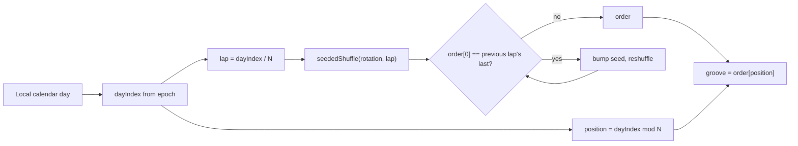

# PRD — Epic 1: Every groove before any repeat

Feature: [briefing.md](../briefing.md) · [roadmap.md](../roadmap.md)

## Summary

The daily groove is picked by walking a shuffled permutation of the whole
catalogue instead of hashing the date into it. Every groove is played once
before any is played twice, and the groove that opens a new lap is never the one
that closed the last. The pick stays what it is today in every other respect: a
pure function of the calendar day, identical for every player, reading no
storage.

## Problem

`selectGrooveForDate` is `hashString(isoDate(date)) % grooves.length` — a
per-date draw with no memory of the draws around it. Over the four weeks from
30 Aug 2026 it lands `groove-15` on the 30th, 2 Sep, 11 Sep and 24 Sep, lands
`groove-02` four times, and never reaches four of the sixteen grooves at all. A
player who meets a groove they solved eleven days ago does not have a puzzle
that day; they have a memory test they have already passed.

## Scope

- Replace the pick in `lib/puzzle/selectGroove.ts` with a cycle-based
  permutation of the catalogue.
- Export `seededShuffle` (and the `mulberry32` it needs) from
  `lib/theory/options.ts`, which already owns them, rather than writing a second
  shuffle.
- Guard the seam between one lap and the next.

**Out of scope**
- **Per-player rotation.** `DailyResult.grooveId` and `getAll()` would support
  picking from what this browser has not played, but the sequence stays global:
  every player gets the same groove on the same day, as they do now.
- **Any change to `src/lib/hash.ts`.** `hashString` seeds the groove generator
  as well as this pick; editing it re-renders the catalogue. This epic consumes
  it and does not touch it.
- **Any change to what is stored.** `DailyResult` keeps recording `grooveId`,
  which is what lets an old record survive a catalogue that has since grown.
- **Growing the catalogue.** Sixteen grooves is a sixteen-day lap; making the
  lap longer is `grooves:add`, and Epic 4 owns the one run this feature makes.
- **Changing which grooves are in the rotation.** Epic 4 removes four non-modal
  grooves from `catalogue.json` and mints six replacements, so the generated
  catalogue *is* the rotation — eighteen grooves, three per mode. This epic
  draws from whatever `GROOVES` holds; it neither filters it nor decides its
  contents.

## Requirements

- **R1** — Across any lap of `N` consecutive days, where `N` is the number of
  grooves in the rotation, each groove is the day's groove exactly once.
- **R2** — The day's groove is a pure function of the calendar date and the
  rotation. It reads no storage, consults no history, and is the same for every
  player in every browser.
- **R3** — The day's groove does not change during the day. "The day" is the
  viewer's local calendar day, as `isoDate` already computes it.
- **R4** — The groove on the first day of a lap is never the groove on the last
  day of the lap before it. Two identical days running is the repeat this epic
  most obviously exists to prevent.
- **R5** — Laps are fixed blocks of `N` days measured from a fixed epoch, not a
  rolling window. Two appearances of the same groove may therefore be as few as
  two days apart across a seam, or as many as `2N - 1` days apart within one.
- **R6** — When the rotation changes size, the guarantees in R1 and R4 hold from
  that point on for the new size. Days before the change keep whatever they were
  shown, because `DailyResult.grooveId` records what was actually played.
- **R6a** — A single early repeat spanning a size change is accepted. The lap is
  renumbered and the guarantee resumes immediately at the new size; the pick is
  not anchored to a stored epoch, because storing one would make it stateful and
  break R2.
- **R7** — An empty rotation throws, as it does today. A rotation of one groove
  yields that groove every day, and R4 does not apply to it.
- **R8** — The shuffle is the one already in the feature slice. `options.ts`
  exports it; `selectGroove.ts` imports it. No second implementation of a
  seeded shuffle exists in the codebase.

## Behaviour details

**The pick.**

1. Turn the local calendar date into a day index — a count of days from a fixed
   epoch, computed from the ISO day string so it is unaffected by clock time or
   DST.
2. Split it: `lap = floor(dayIndex / N)`, `position = dayIndex % N`.
3. Shuffle the rotation deterministically with the lap as the seed.
4. Take the groove at `position`.

Every groove appears exactly once per lap because a shuffle is a permutation —
R1 falls out of the construction rather than being checked for.

**The seam.** Laps are shuffled independently, so nothing stops lap *n+1*
opening with the groove lap *n* closed on. When that happens, re-derive lap
*n+1*'s order with a bumped seed and check again, until the two differ. The
retry is deterministic, so every player still sees the same corrected order.
With `N ≥ 2` a satisfying permutation always exists, so the loop terminates.

**What a growing catalogue does.** `N` appears in both the lap number and the
position, so adding a groove renumbers every lap and reshuffles every order.
Dates in the past are reassigned grooves they were never shown — which is
already true of the current `% length` pick, and harmless for the same reason:
nothing reads the pick for a past date. Records carry their own `grooveId`.

Forward of the change, the cost is one repeat: a player may meet a groove a few
days after last meeting it, once, at the seam where `N` changed. That is
accepted rather than engineered around. Epic 4 changes `N` from 16 to 18 exactly
once in this feature, and every lap after it holds the full guarantee.

## Acceptance criteria

- **AC1** (R1) — Given a rotation of `N` grooves, when the pick is run for `N`
  consecutive days starting at any date, then the set of grooves returned is the
  whole rotation and no groove appears twice.
- **AC2** (R2) — Given the same date, when the pick is run repeatedly, in any
  order, with no storage present, then it returns the same groove every time.
- **AC3** (R3) — Given two times on the same local calendar day, when the pick
  is run at each, then it returns the same groove.
- **AC4** (R4) — Given any lap boundary, when the pick is run for the last day of
  one lap and the first day of the next, then the two grooves differ.
- **AC5** (R5) — Given a lap of `N` days, when the pick is run across two
  consecutive laps, then each groove appears exactly twice in the `2N` days.
- **AC6** (R6) — Given a rotation grown by one groove, when the pick is run for
  the following `N+1` days, then AC1 and AC4 hold for the new size.
- **AC7** (R7) — Given an empty rotation, when the pick is run, then it throws
  the error it throws today. Given a rotation of one, when the pick is run for
  several days, then it returns that groove each day without looping forever.
- **AC8** (R8) — Given the source tree, when it is searched for a Fisher–Yates
  shuffle, then exactly one implementation exists, in `lib/theory/options.ts`.
- **AC9** (R2) — Given `src/lib/hash.test.ts`, when the suite runs, then it
  passes unmodified, proving `hashString` was consumed and not edited.

## Dependencies

Needs nothing to start. It hands nothing to another epic.

It shares no seam with **Epic 4**. Epic 4 changes the rotation by editing
`catalogue.json`, so the generated `GROOVES` is the rotation outright and there
is no filter for the two epics to agree on. `selectGrooveForDate` keeps taking
the rotation as an argument and the caller keeps passing `GROOVES`. The only
coupling left is arithmetic: `N` becomes 18.

Per `docs/testing.md`, this is logic in the feature's `lib/` and is tested
directly as a plain function. No rendering is needed to prove a rotation.

## Assumptions

- The epoch for the day index is 1970-01-01, computed from the ISO day string so
  it never depends on the time of day or on a timezone offset.
- The seam guard looks back exactly one day. Nothing prevents a groove appearing
  on the last day of lap *n* and the second day of lap *n+1*; two days apart is
  a far weaker complaint than two days running, and a wider guard costs
  determinism for little gain.
- The bumped seed is the lap seed with a counter appended, so the retry stays a
  pure function of the lap.
- `isoDate` keeps its current local-calendar-day semantics.

## Question log

Answered questions, kept for traceability. The requirements above are the source
of truth — this records how they got there. Append-only: never rewrite or prune
a past cycle, or the record stops being trustworthy.

### Cycle 1 — 2026-08-30

**Q1. Fixed laps, or a rolling no-repeat window?**
Answer: **A) Fixed laps with the seam guard** — the briefing's "all 16 selected
once before repeating" is exactly a lap, and it keeps the pick a pure function
of the date with no history to carry.
Applied to: R1, R4, R5, AC1, AC4, AC5, Behaviour details

**Q2. What happens to the lap when the catalogue grows?**
Answer: **A) Accept the one-off repeat** — the guarantee resumes immediately at
the new size, and the alternative is a stored lap epoch that would make the pick
stateful and break R2.
Applied to: R6a, AC6, Behaviour details
