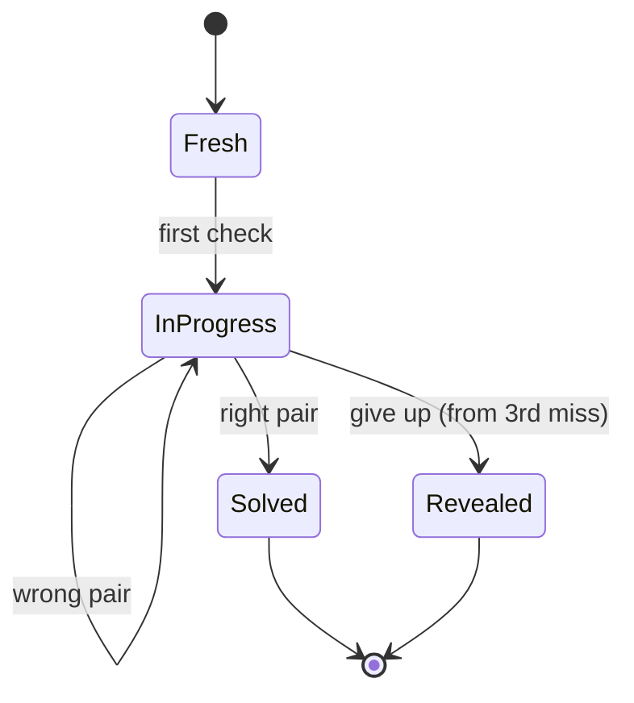

# PRD — Epic 3: The attempt row stops lying

Feature: [briefing.md](../briefing.md) · [roadmap.md](../roadmap.md)

## Summary

Three changes to how the guess card behaves as attempts accumulate. The dot row
explains that three tries is par and not a limit. The second miss hands the
player the root the nudge has already given away, by selecting it. The third
miss offers a way out: give up, see the answer, and the day is over. Together
they close the gap between what the card looks like it is doing and what it
actually does.

## Problem

The dot row is three dots and nothing else. It reads as three lives, and a
player rations guesses accordingly — but `dotStates` marks par, not lives, and
a fourth guess is accepted exactly like the first. The nudge names the day's
root in prose and then leaves the player to find that chip and press it, which
is busywork on information already surrendered. And a groove nobody can name has
no ending: the page will keep taking wrong guesses until midnight.

## Scope

- An explanation of what the dot row means, reachable without a mouse.
- Auto-selection of the day's root on the second miss.
- A reveal control from the third miss, and the terminal state it produces.
- The record and rendering that make a given-up day distinguishable from a
  solved one and from an unfinished one.

**Out of scope**
- **Simple mode's toggle**, which also lands at the top of this card — Epic 5.
- **The mode vocabulary in the second chip row** — Epic 4 changes the option
  values and the row's label; this epic changes the behaviour around them and
  touches neither `ChipGroup`'s props nor the values passed to it.
- **Any change to `lib/persistence/streak.ts`.** A revealed day does not extend
  the streak and ends the run like any other unsolved day, which is already
  exactly what `isQualifying` does — it keys on `solved`. The new flag
  distinguishes *given up* from *unfinished* for the UI and for a future stats
  view; the streak never reads it.
- **Changing the attempt budget.** Guesses stay unlimited. This epic makes that
  legible, it does not make it true.
- **Changing when the nudge appears.** It stays at two misses.

## Requirements

- **R1** — The attempt dots carry an explanation of what they mean: three tries
  is par, and a player may keep guessing past it.
- **R2** — The explanation is carried by the dot row's own accessible name and a
  native `title`, so the same words reach a pointer, a keyboard and a screen
  reader. No new design-system component is introduced to deliver it.
- **R3** — Guesses remain unlimited. A fourth and later miss is scored,
  recorded, and leaves the dot row full rather than extending it, as today.
- **R4** — On the second miss, the day's root becomes the selected root in the
  root chip row.
- **R5** — That selection is applied once and is the player's to change. The
  chips are not disabled, filtered or locked, and the nudge box stays where it
  is.
- **R6** — On the third miss, a control appears offering to give up and see the
  answer.
- **R6a** — Giving up takes two presses. The first arms the control, which
  changes to ask for confirmation; the second carries it out. A single press
  never ends the day.
- **R6b** — An armed control disarms on the player's next interaction with the
  card. Selecting a chip or checking a guess returns it to its unarmed label.
  There is no cancel affordance and no timer — the armed state simply does not
  survive doing something else.
- **R7** — Carrying it out ends the day: the answer is shown, no further guess
  is accepted, and the guess card's chips and check control are inert.
- **R8** — A revealed day survives a reload. Reopening the page on the same day
  shows the same terminal state, not a fresh puzzle and not an unfinished one.
- **R9** — A revealed day is recorded distinguishably from a solved day and from
  an unfinished one.
- **R10** — A revealed day is not presented as a win. It does not claim a
  solve, an attempt count, or a streak.
- **R10a** — A revealed day shows the whole solution: the answer, the chord and
  progression, and the scale notes — the same content a solved day shows, minus
  the claim. Giving up costs the day, not the explanation.
- **R11** — The reveal is never offered on a day that is already solved, and
  never before the third miss.
- **R12** — Nothing about progress is latched. Whether the nudge is due, whether
  the reveal is due, and what the dots show all stay pure derivations over the
  attempt list and the day's outcome, as they are today.
- **R13** — Records written before this epic still load. A record with no
  reveal flag is an unfinished or solved day exactly as it is now.

## Behaviour details

**The day's states.** A day is unplayed until the first check, then in progress,
and ends in one of two terminal states — or in neither, if the player simply
stops.

`Solved` and `Revealed` are both terminal for the day and both show the answer.
They differ in what they claim: `Solved` reports what the day cost and extends
the streak; `Revealed` reports neither.

**The thresholds, and where they live.** `lib/presentation/feedback.ts` already
derives the nudge from a miss count (`NUDGE_AFTER_MISSES = 2`). The reveal is a
third derivation of the same shape over the same input, and belongs beside it:

| Misses | Feedback line | Nudge | Root auto-selected | Reveal offered |
| :-- | :-- | :-- | :-- | :-- |
| 0 | opening guidance | no | no | no |
| 1 | which half was right | no | no | no |
| 2 | which half was right | yes | yes | no |
| 3+ | which half was right | yes | already | yes |

The auto-selection is the one row that is not a pure derivation — selecting a
chip is an action, not a rendering. It fires once when the count reaches two, and
does not re-fire if the player then chooses a different root and misses again.

**What the reveal shows.** The answer, on the same panel the solved day uses,
with its claim of victory removed — no "solved in *n* tries", no streak line.
"The changes" and "Notes to live in" are shown exactly as they are on a solved
day: they *are* the solution the player asked to see, and withholding them would
punish the day twice.

**Giving up is two presses.** The control arms on the first press and carries
out on the second, so the one irreversible action on the page cannot be reached
by a stray click on a card the player is already clicking through. Arming
changes only the control; the day is still in progress, the chips still live,
and a guess checked while armed is scored normally.

Getting back out is doing anything else. Touching a chip or checking a guess
disarms the control, which means the escape route is the thing a player who
changed their mind was going to do anyway — no Cancel to find, and no timer that
could arm or disarm behind their back.

## Acceptance criteria

- **AC1** (R1, R2) — Given the dot row, when its accessible name is read, then
  it states that three is par and that guessing may continue, and the row
  carries a `title` with the same words. No tooltip component exists in
  `src/components` as a result of this epic.
- **AC2** (R3) — Given three misses, when a fourth wrong pair is checked, then it
  is scored and recorded, and the dot row still shows three spent dots.
- **AC3** (R4) — Given one miss, when a second wrong pair is checked, then the
  root chip row's selected chip is the day's correct root.
- **AC4** (R5) — Given the root has been auto-selected, when the player presses
  a different root chip, then that chip becomes selected and stays selected
  through a further miss.
- **AC5** (R5) — Given two misses, when the card renders, then the nudge box is
  present and no chip is disabled.
- **AC6** (R6, R11) — Given two misses, when the card renders, then no reveal
  control is present. Given a third miss, when the card renders, then it is.
- **AC7** (R11) — Given a solved day, when the card renders, then no reveal
  control is present.
- **AC8** (R6a) — Given the reveal control, when it is pressed once, then it
  changes to ask for confirmation, the answer is not displayed, and the day is
  still playable.
- **AC8a** (R6a, R7) — Given the armed reveal control, when it is pressed again,
  then the answer is displayed and the chip rows and check control no longer
  accept input.
- **AC8b** (R6a, R6b) — Given the armed reveal control, when a guess is checked
  instead, then that guess is scored normally, the day has not ended, and the
  control has returned to its unarmed label.
- **AC8c** (R6b) — Given the armed reveal control, when a root or mode chip is
  selected, then the control returns to its unarmed label and the day is
  unchanged.
- **AC9** (R8) — Given a revealed day, when the page is reloaded on the same
  day, then the answer is still displayed and the puzzle is not playable.
- **AC10** (R9, R10) — Given a revealed day, when the answer panel renders, then
  it does not report an attempt count or a streak, and does not describe the day
  as solved.
- **AC10a** (R10a) — Given a revealed day, when the answer panel renders, then
  the chord, the progression and the scale notes are all present.
- **AC11** (R10) — Given a revealed day, when the streak is computed, then that
  day does not count toward it and the run ends there, exactly as an unsolved
  day does.
- **AC12** (R12) — Given the same attempt list and outcome, when the derivations
  are run repeatedly, then the nudge, the reveal and the dots are identical each
  time, with no stored flag behind them.
- **AC13** (R13) — Given a stored record written without a reveal flag, when the
  day loads, then it behaves as it does today.

## Dependencies

Needs nothing to start.

It shares `components/puzzle/GuessCard.tsx` with **Epic 4** and, later, with
**Epic 5**. The contract that lets Epic 4 run in parallel: Epic 4 owns the
second chip row's `label` and `options`; this epic owns everything else in the
card. Neither changes `ChipGroup`'s props.

It hands **Epic 5** a card whose top edge is where the simple-mode toggle goes,
and a `DailyResult` shape that already carries a terminal-state flag.

Per `docs/testing.md`, behaviour is tested through the feature's public surface
via `testing/renderFeature.tsx`, not by reaching past `index.ts`, and the
derivations in `lib/presentation/feedback.ts` are tested directly as plain
functions.

## Assumptions

- The reveal appears at three misses because the briefing says "after 3 failed
  attempts"; the nudge stays at two, unchanged.
- The reveal control is visually secondary to the check control — giving up
  should be available, not inviting.
- The armed control states what it is about to do rather than asking a bare
  "Sure?", so the second press is a decision and not a reflex.
- Armed-ness is component state for the day's session, not part of the stored
  record. A reload lands on an unarmed card, which is the safe direction.
- The auto-selected root is applied to the same selection state a press would
  set, so the check control's label follows it as it already does.
- A revealed day records the attempts spent before the reveal, unchanged. The
  reveal itself is not recorded as an attempt.
- The reveal flag is an additive optional field on `DailyResult`, like
  `grooveId` before it, so no migration is needed.
- The feedback line on a revealed day says something terminal rather than
  continuing to report which half was right.

## Question log

Answered questions, kept for traceability. The requirements above are the source
of truth — this records how they got there. Append-only: never rewrite or prune
a past cycle, or the record stops being trustworthy.

### Cycle 1 — 2026-08-30

**Q1. What does a revealed day show?**
Answer: **A) The same panel minus the claim** — the changes and the notes are
the solution the player asked for, and withholding them would punish the day
twice.
Applied to: R10a, AC10a, Behaviour details

**Q2. Is giving up a single press, or does it confirm?**
Answer: **B) Two-step — the control arms on the first press and carries out on
the second** — the day cannot be replayed, so the one irreversible action on the
page does not sit under a single stray click.
Applied to: R6a, R7, AC8, AC8a, AC8b, Behaviour details, Assumptions

**Q3. How is the dot row's explanation delivered?**
Answer: **A) Extend the row's `aria-label` and add a native `title`** — the row
already computes its own label, and this reaches pointer, keyboard and screen
reader without adding a primitive.
Applied to: R2, AC1

### Cycle 2 — 2026-08-30

**Q4. Can an armed reveal be backed out of?**
Answer: **A) It disarms on the player's next interaction with the card** — the
escape route is the thing a player who changed their mind was going to do
anyway, and it needs neither a cancel affordance nor a timer.
Applied to: R6b, AC8b, AC8c, Behaviour details, Assumptions
