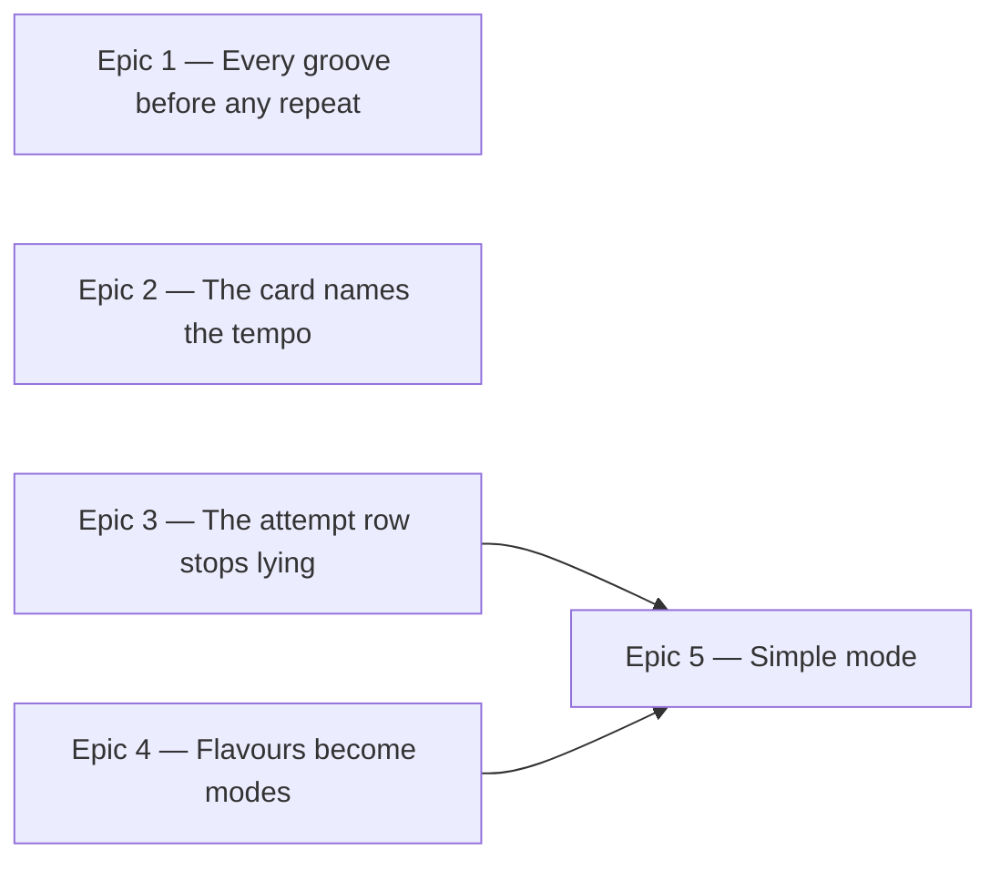

# Roadmap — Guessing Clarity

Source: [briefing.md](briefing.md)

## Overview

Feature-7 is about a puzzle you can actually win, and one that tells you the
truth about itself. Four of the seven briefing bullets change what the guessing
card does as attempts pile up — the dots stop reading as lives, the root you
were already shown gets handed to you, and a groove you cannot crack can be
given up on. The other three change what you are guessing *about*: the tempo
comes back onto the groove card, the flavour vocabulary collapses to modes —
with six new grooves minted, taking the catalogue to eighteen — three in each
surviving mode — once Blues and Harmonic minor go — and the daily pick stops handing you the same groove
twice in a fortnight.

The rotation, the tempo, the attempt behaviour and the mode vocabulary are
independent of each other and all ship in wave 1. Simple mode is last because
it is the only bullet that needs another one finished first: it cannot say what
"major or minor" means until the mode vocabulary is settled.

## Epics

### Epic 1 — Every groove before any repeat

**Visible when done:** play daily for a fortnight and you never meet the same
groove twice. Only after every groove in the catalogue has been played does it
come round again — and the groove on the first day of a new cycle is never the one
that closed the last.
**Depends on:** none
**Parallel with:** Epic 2, Epic 3, Epic 4

**Scope**
- Replace the pick in `lib/puzzle/selectGroove.ts`. Today it is
  `hashString(iso) % grooves.length`, a per-date draw with no memory, which is
  why `groove-15` lands on 30 Aug, 2 Sep, 11 Sep and 24 Sep, and why only 12 of
  16 grooves appear in a four-week window.
- The replacement is a cycle-based permutation, still a pure function of the
  date and the catalogue: derive a day index from the date, split it into a
  cycle number and a position within the cycle, seed a `seededShuffle` of the
  catalogue with the cycle number, and take the groove at that position. Every
  groove appears exactly once per cycle, and the sequence is identical for
  every player and stable all day — the two properties the current pick has and
  must keep.
- Guard the cycle seam: if position 0 of cycle *n+1* draws the same groove as
  the last position of cycle *n*, re-derive that cycle's order deterministically
  until it does not. Two identical days in a row is the one repeat the briefing
  most obviously means to kill.
- `lib/theory/options.ts` already owns `seededShuffle` and `mulberry32` but does
  not export them. Export what this needs rather than writing a second shuffle;
  it is the same feature slice, so no boundary is crossed.
- Tests: over any 16 consecutive days the set of grooves is the whole catalogue;
  no groove repeats within a cycle; no groove repeats across a seam; the same
  date always yields the same groove; growing the catalogue by one still
  satisfies all of the above.

**Out of scope**
- Per-player rotation driven by saved history. `DailyResult.grooveId` and
  `getAll()` would support it, but it would make two players see different
  grooves on the same day, and **Q1 settled on the global reading**: the
  sequence is a pure function of the date, identical for everyone, stored
  nowhere.
- Any change to what is stored. `grooveId` keeps recording what was actually
  played, which is what keeps old records readable when the catalogue grows.
- Growing the catalogue. The lap is as long as the catalogue — sixteen grooves
  today, eighteen once Epic 4 lands; making it longer is `grooves:add`, not
  this.

**Validation**
- Demo: with the date faked forward day by day, the groove name on the card
  walks the whole catalogue before any name recurs.
- Unit tests on `selectGrooveForDate` as a plain function, per `docs/testing.md`
  — no rendering needed to prove a rotation.
- `src/lib/hash.test.ts` still passes untouched: this epic reuses `hashString`
  and must not edit it.

### Epic 2 — The card names the tempo

**Visible when done:** the groove card reads `Rusted Shuffle` with `105 bpm`
beneath it. You know what you are playing along to before you press play.
**Depends on:** none
**Parallel with:** Epic 1, Epic 3, Epic 4

**Scope**
- `components/puzzle/GrooveCard.tsx` renders `groove.bpm` as a muted line under
  the heading. The data is already there on every groove; nothing is generated,
  fetched or computed.
- Update the component's own doc comment, which currently explains why the
  tempo is *not* rendered.
- Test the card shows the tempo, and that it is not announced as part of the
  heading.

**Out of scope**
- The rest of the canvas' meta line — `4/4`, `4 bars`, `loops until you stop`.
  The briefing asks for the tempo and only the tempo. All three are equally
  available if you want them later; say so and it is a one-line widening.
- The groove number. `groove.id` would fill the canvas' `No. 214`, but a visible
  integer is a lookup key a player can keep notes against, which Epic 1 makes
  worse rather than better once the cycle is predictable.
- A count-in, a metronome, or anything that makes the tempo audible. That is
  playback, not labelling.

**Validation**
- Demo: load the page. The tempo is under the groove name, before you press
  anything.
- `GrooveCard` unit test per `docs/testing.md`, driven by props.

### Epic 3 — The attempt row stops lying

**Visible when done:** the three dots explain themselves — three tries is par,
not a limit, and you may keep guessing. After the second miss the nudge's root
is already selected in the chip row, so the guess you are being handed is the
guess you are making. After the third miss a way out appears: give up, see the
answer, and the day is over.
**Depends on:** none
**Parallel with:** Epic 1, Epic 2, Epic 4

**Scope**
- `components/puzzle/AttemptDots.tsx` gains an explanation of what the row
  means. It must be reachable by keyboard and by screen reader, not hover-only —
  the row is already `role="img"` with a computed `aria-label`, so extend that
  rather than bolting a hover tooltip beside it.
- `lib/presentation/feedback.ts` gains the reveal threshold next to the existing
  `NUDGE_AFTER_MISSES`, as a third pure derivation over the attempt list. The
  file's standing rule holds: nothing about progress is latched, everything is
  derived from `attempts` and `solved`.
- Auto-select the day's root on the second miss. The selection is applied once
  and stays the player's to change — the chips are not disabled, filtered or
  locked, and `NudgeBox` stays where it is. The check control's label follows as
  it already does.
- A reveal control in `GuessCard`, shown from the third miss. Pressing it ends
  the day: the answer is shown, the chips go inert, and no further guess is
  checked.
- `DailyResult` gains a flag distinguishing a revealed day from a solved one and
  from an unfinished one. It is an additive optional field, like `grooveId`
  before it, so existing records keep loading.
- `SolvedPanel` is the natural home for the revealed answer, but it must not
  claim a win: a revealed day shows the answer, the changes and the notes
  without "solved in *n* tries".
- Tests through the feature's public surface: miss twice and the root is
  selected; miss three times and the reveal appears; reveal and the day is over,
  survives a reload, and reads as given up rather than won.

**Out of scope**
- Simple mode's toggle, which also lands at the top of this card. Epic 5 owns
  it and rebases onto whatever this epic leaves.
- The mode vocabulary in the flavour row. Epic 4 changes the option *values*;
  this epic changes the card's behaviour around them and touches neither
  `ChipGroup`'s props nor the values passed to it. That split is the contract
  that lets the two run together.
- Any change to `lib/persistence/streak.ts`. **Q4 settled** that a revealed
  day does not extend the streak and ends the run like any other unsolved day
  — which is already exactly what `isQualifying` does, since it keys on
  `solved`. The new flag distinguishes *given up* from *unfinished* for the UI
  and for a future stats view; the streak never reads it.

**Validation**
- Demo: guess wrong twice — the nudge appears and its root is already selected.
  Guess wrong a third time — the reveal appears. Press it: the answer is on
  screen, the chips are dead, and a reload still shows the day as given up.
- Feature tests via `testing/renderFeature.tsx`, not by reaching past
  `index.ts`.
- Keyboard pass: the dots' explanation is reachable without a mouse.

### Epic 4 — Flavours become modes

**Visible when done:** the second chip row is labelled `Mode` and offers mode
names — Ionian, Dorian, Phrygian, Lydian, Mixolydian, Aeolian — not the present
mixture of `Major`, `Minor`, `Harmonic minor` and `Blues`. A player who knows
what Dorian is can no longer be unsure whether to press `Minor` instead. Six new
grooves have joined the catalogue, taking the rotation to eighteen with each of
the six modes carried by exactly three.
**Depends on:** none
**Parallel with:** Epic 1, Epic 2, Epic 3

**Scope**
**Q2 settled on option B**, which gives this epic three steps in a fixed order.

- **Mint first.** Run `grooves:add` to add six new grooves, one in each
  surviving mode, *before* anything is removed. Two reasons: the catalogue only
  ever grows, so Epic 1's lap length changes exactly once — and `selectSeeds`
  allocates ids from the catalogue's high-water mark, which the two `Harmonic
  minor` grooves currently hold at `groove-15` and `groove-16`. Cut them first
  and the next mint re-issues those ids to different audio. This is a generator
  run with a real gate and a real listen, not a code change — budget for it as
  the long pole of the epic.
- **Then rename.** `Major`→`Ionian` and `Minor`→`Aeolian`, in both halves of the
  system: the generator's `scripts/grooves/theory/` (which knows the current
  eight flavours, their intervals, idioms and validity rules) and the app's
  `lib/theory/music.ts`. The notes do not move — C major and C Ionian are the
  same seven pitches — so this changes the word, not the answer, and no audio is
  re-rendered. That is what keeps it inside the freeze rule in
  `scripts/grooves/README.md`.
- **Then remove.** The two `Blues` and two `Harmonic minor` entries are deleted
  from `catalogue.json`, their mp3s from `public/grooves/`, and the manifest and
  lock are regenerated without them. Nothing surviving is renumbered or
  re-rendered.
- No filter anywhere. Because the four leave the catalogue itself, the generated
  `GROOVES` *is* the rotation: `flavourPool` and Epic 1's lap both read it
  directly, and neither epic needs a seam from the other.
- The `Flavour` type in `src/lib/groove.ts` stays a plain string. It is
  deliberately not a union so the pool can be derived from seed data, and the
  vocabulary narrowing does not change that.
- Tests: the option row offers only mode names; the pool matches the generated
  catalogue; the rotation grows from sixteen to eighteen with three grooves per
  mode; the generator's harmony tests pass for every surviving mode.

**Out of scope**
- Locrian. No groove carries it, and a half-diminished tonic is a poor thing to
  ask anyone to hear in four bars. The four replacements spread across the six
  surviving modes instead — see Assumptions.
- Simple mode's two-way collapse. Epic 5 owns it.
- Re-rendering, renumbering or re-answering any existing groove's audio. The
  freeze rule forbids it, and option B is chosen precisely so nothing has to.

**Validation**
- Demo: the guess card's second row reads `Mode` and every chip in it is a mode.
- `npm test` across both `src/` and `scripts/grooves/`, since the vocabulary is
  the contract between them.
- `scripts/grooves/boundary.test.ts` and the manifest tests still pass.

### Epic 5 — Simple mode

**Visible when done:** a toggle at the top of the guess card. Flick it and the
puzzle narrows: six roots instead of twelve, and two choices — major or minor —
instead of four modes. Flick it back and the full puzzle returns.
**Depends on:** Epic 4 (the mode vocabulary, and what major/minor collapse
*from*), Epic 3 (both edit `GuessCard`)
**Parallel with:** nothing — it is the wave on its own

**Scope**
- The toggle, at the top of `GuessCard`, above both chip rows.
- Six roots rather than twelve, built the way the flavour options already are:
  deterministic for the date and always including the day's answer, via the
  existing `buildOptions` (**Q5 → A**). A fixed six would make a groove in E♭
  unanswerable.
- The two-way collapse, graded by the third (**Q3 → A**): Ionian, Lydian and
  Mixolydian are *major*; Dorian, Phrygian and Aeolian are *minor*. Every groove
  stays answerable in simple mode, and the mapping is a pure function over the
  mode vocabulary Epic 4 settles — so it belongs in `lib/theory/`, next to the
  vocabulary rather than inside the card.
- Persistence of the toggle across days, alongside but separate from
  `daily-groove:v2:results` — it is a preference, not a day's play.
- Tests: the toggle narrows both rows; the day's answer is always reachable in
  simple mode; a simple-mode solve is recorded and reloads correctly; switching
  mid-day does not lose or invent attempts.

**Out of scope**
- An expert mode — dropping the narrowing entirely, or a shorter attempt budget.
  That is the other half of the `Difficulty levels` candidate in
  `specs/features.md` and stays there.
- Any change to the reveal or the nudge under simple mode beyond what falls out
  of the narrower option sets.

**Validation**
- Demo: toggle on — six roots, two modes. Solve. Toggle off mid-day on another
  date — twelve roots, four modes, attempts intact.
- Feature tests through `index.ts`, per `docs/testing.md`.

## Dependency map

## Execution waves

- **Wave 1 (parallel):** Epic 1, Epic 2, Epic 3, Epic 4. Four disjoint file
  sets: `lib/puzzle/selectGroove.ts`, `components/puzzle/GrooveCard.tsx`, the
  attempt/reveal path through `GuessCard` + `feedback.ts` + persistence, and the
  vocabulary shared with `scripts/grooves/`. Epics 3 and 4 both open
  `GuessCard`, so they hold to the contract named in Epic 3's *Out of scope*:
  Epic 4 changes the chip row's values and label, Epic 3 changes everything
  around it. Epic 4 is the long pole of the wave: it opens with a `grooves:add`
  run that has to pass the gate and then be listened to, and no amount of
  parallelism shortens that. It shares no seam with Epic 1 — the catalogue edit
  makes the generated `GROOVES` the rotation outright, so the only coupling is
  arithmetic: the lap becomes eighteen days.
- **Wave 2:** Epic 5 — needs Epic 4's vocabulary to define its two-way collapse,
  and rebases onto Epic 3's version of the card.

## Assumptions

- **Tempo only.** Epic 2 adds `bpm` and not the rest of the meta line, because
  that is what the briefing asks for.
- **The auto-selected root stays editable.** The player can change it; the
  chips are not locked and `NudgeBox` remains. Handing over a selection is a
  convenience, not a commitment.
- **Reveal is available from the third miss and ends the day.** No further
  guessing after it, and the day reads as given up rather than won.
- **The dots' explanation is not hover-only.** It extends the row's existing
  accessible name rather than adding a mouse-only affordance.
- **Simple mode is a preference, not part of a day's record.** It persists
  across days and does not change how a solve is stored.
- **The six replacement grooves are one per surviving mode**, rather than
  introducing Locrian. Which templates and seeds they come from is the
  generator's business at mint time, not a roadmap decision.

