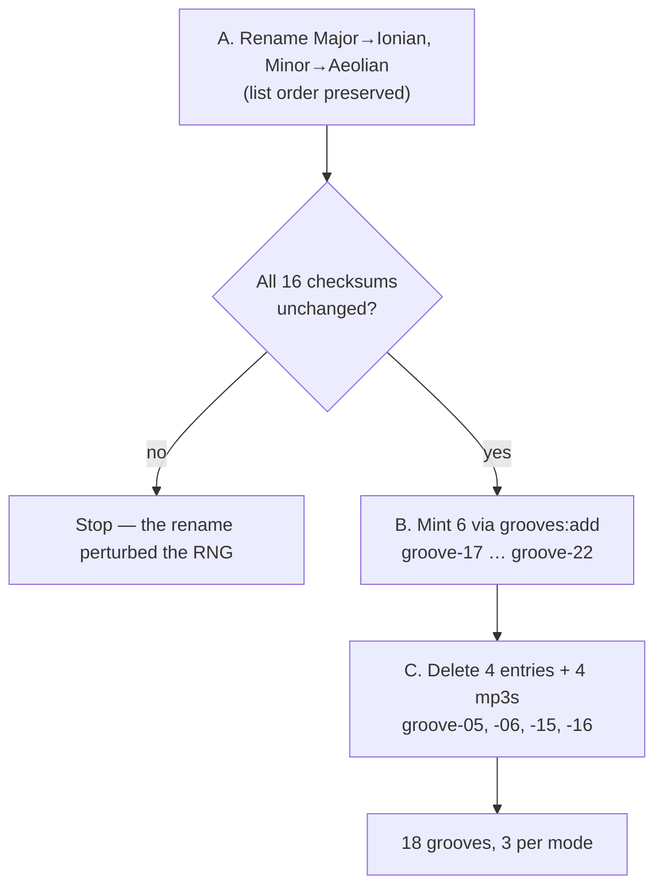

# Tech spec — Epic 4: Flavours become modes

PRD: [../prd/epic-4-flavours-become-modes.md](../prd/epic-4-flavours-become-modes.md) ·
Roadmap: [../roadmap.md](../roadmap.md)

## Approach

This is the only epic in the feature that changes committed audio artifacts, so
the order of operations is the design. Rename first, and prove with the lock
that not one byte of audio moved. Then mint six new grooves. Then delete four
entries and their mp3s. Each step ends with a green `grooves:verify`, so a
mistake is caught by the build guard rather than by a player.

The rename is where the real hazard is, and it is not the one it looks like.
`Major` → `Ionian` is musically inert — the same seven pitches — but the
generator draws a flavour per seed from a *list*, and a rename that reorders
that list changes which flavour a seed draws, which changes the audio, which is
a freeze violation. The rename must therefore preserve list order, and Step A3
is a hard gate that proves it: all sixteen checksums unchanged, or stop.

The app side is independent of all of it and runs in parallel from the start.

## Architecture

**Sequence, and why it cannot be reordered.**



*Rename before mint* so the six new grooves are answered in modal vocabulary
from the moment they are written, and never have to be re-answered.

*Mint before delete* for two reasons. The rotation only ever grows, so Epic 1's
lap length changes exactly once. And `selectSeeds` allocates ids from
`highestNumber(specs)` — the maximum in the catalogue, never the count,
precisely so ids are not re-issued. `groove-15` and `groove-16` are the two
`Harmonic minor` grooves. Delete them first and the high-water mark drops to 14,
so the very next mint issues `groove-15` and `groove-16` again, to different
audio, writing over the filenames the deletion just freed. Mint first and the
mark sits at 22.

**The end state.** Twelve survivors across six modes, two each, plus six new,
one each: eighteen grooves, three per mode.

| Mode | Surviving | Minted | Total |
| :-- | :-- | :-- | :-- |
| Ionian (was Major) | 2 | 1 | 3 |
| Aeolian (was Minor) | 2 | 1 | 3 |
| Dorian | 2 | 1 | 3 |
| Phrygian | 2 | 1 | 3 |
| Lydian | 2 | 1 | 3 |
| Mixolydian | 2 | 1 | 3 |

**No filter anywhere.** The four grooves leave `catalogue.json`, so the
generated `GROOVES` *is* the rotation. `flavourPool` and Epic 1's lap both read
it directly; neither epic needs a seam from the other.

## Contracts

Frozen before the tracks start.

```ts
// scripts/grooves/types.ts — the flavour union, renamed in place, order kept.
// NOTE: the internal union is lower-case and hyphenated; `displayFlavour()` in
// cli.ts title-cases it on the way into the manifest, so renaming the internal
// member is what makes the displayed `Ionian` / `Aeolian` follow.
export type Flavour =
  | 'blues'           // removed in Track C
  | 'dorian'
  | 'harmonic-minor'  // removed in Track C
  | 'lydian'
  | 'ionian'          // was 'major'
  | 'aeolian'         // was 'minor'
  | 'mixolydian'
  | 'phrygian'
```

The flavour draw is `pick(rng, template.flavours)` in `events.ts` — an index into
the template's own array, with the RNG seeded from
`` `${spec.template}:${spec.seed}:events` ``, never from the flavour string. That
is *why* an in-place rename cannot move audio, and why reordering would.

```ts
// src/lib/groove.ts — unchanged
export type Flavour = string   // stays a plain string, never a union
```

- `npm run grooves` — regenerates manifest + lock from `catalogue.json`.
- `npm run grooves:add -- 6` — appends six, gate-checked, ids from the
  high-water mark.
- `npm run grooves:verify` — the build guard; must be green after every track.

The app-side contract is one string: `ChipGroup`'s `label` on the second row
becomes `"Mode"`.

## Tracks

### Track A — The generator speaks modes

- **Goal** — the generator's vocabulary is modal, and no audio has changed.
- **Owns** — `scripts/grooves/types.ts`, `scripts/grooves/theory/**` and their
  tests.
- **Depends on** — nothing.
- **Parallel with** — Track D.
- **Done when** — `npx vitest run scripts/grooves` is green and Step A3's
  checksum gate passes.

### Track B — Six new grooves

- **Goal** — `groove-17` … `groove-22`, one per surviving mode, committed with
  audio, manifest and lock.
- **Owns** — `scripts/grooves/catalogue.json`, `grooves.lock.json`,
  `public/grooves/*.mp3`, `src/features/daily-groove/data/grooves.generated.ts`.
- **Depends on** — Track A merged. Minting before the rename would write
  `Major` into six new answers.
- **Parallel with** — Track D.
- **Done when** — the catalogue holds 22 grooves and `grooves:verify` is green.

### Track C — Four grooves leave

- **Goal** — eighteen grooves, three per mode, nothing unreferenced on disk.
- **Owns** — the same files as Track B.
- **Depends on** — Track B merged. Same files, so it is a wave, not a parallel
  track.
- **Done when** — the catalogue holds 18 and `grooves:verify` is green.

### Track D — The app says "Mode"

- **Goal** — the guess card's second row is labelled `Mode` and its options are
  whatever the catalogue carries.
- **Owns** — `src/features/daily-groove/components/puzzle/GuessCard.tsx`,
  `src/features/daily-groove/lib/theory/music.ts` and their tests.
- **Depends on** — nothing. It reads the pool from the manifest and never names
  a flavour.
- **Parallel with** — Tracks A, B and C throughout.
- **Done when** — its own tests pass.

## Execution waves

- **Wave 1 (parallel):** Track A, Track D
- **Wave 2:** Track B — needs A's vocabulary
- **Wave 3:** Track C — needs B's ids
- **Wave 4:** Integration

Tracks B and C are the long pole: both are generator runs that render audio,
pass a gate, and want a human ear before they are committed.

## Implementation

### Track A — The generator speaks modes

#### Step A1 — The vocabulary is modal

Covers: R3, AC3

- **Test first** — `scripts/grooves/theory/harmony.test.ts` (or wherever
  `FLAVOURS` is asserted): assert `FLAVOURS` contains `'Ionian'` and
  `'Aeolian'` and neither `'Major'` nor `'Minor'`. Run it: fails, listing the
  old names.
- **Implement** — rename the two members in `scripts/grooves/types.ts` and every
  reference across `scripts/grooves/theory/**` — `intervalsFor`, `IDIOMS`,
  `VALIDITY`, `scaleName`. **Rename in place: do not reorder the union, the
  `FLAVOURS` array, or any `Record` literal keyed by flavour.** Order is what a
  seed's draw depends on.
- **Green when** — the assertion passes and every generator suite is green.
- **Refactor** — none.

#### Step A2 — The scale name follows

Covers: R3

- **Test first** — `scripts/grooves/theory/scales.test.ts`: assert
  `scaleName('C', 'Ionian') === 'C ionian'`. Run it: fails with `'C major'` or a
  type error.
- **Implement** — whatever lower-casing `scaleName` already does now yields
  `ionian`/`aeolian` for free; adjust only if it holds a special case for the
  old words.
- **Green when** — the assertion passes.
- **Refactor** — none.

#### Step A3 — **Gate:** the rename moved no audio

Covers: R6, AC4, AC7

- **Test first** — this is a command, not a unit test, and it is the most
  important step in the epic. Run `npm run grooves` to regenerate the manifest
  and lock, then `git diff --stat scripts/grooves/grooves.lock.json`.
- **Green when** — the lock's `grooves[]` checksums and byte counts are
  **identical** for all sixteen entries. Only `catalogueSha256` and
  `manifestSha256` may move, and only if the catalogue or manifest text
  changed. `npm run grooves:verify` is green, and
  `git diff --stat public/grooves/` is empty.
- **If any checksum moved** — stop. The rename perturbed a flavour draw, which
  means a list was reordered somewhere. Revert, redo A1 preserving order, and
  run this gate again. Proceeding past a moved checksum is the freeze violation
  the whole ordering exists to prevent.
- **Implement** — commit the regenerated manifest, whose `flavour` and `scale`
  strings now read modally for the eight pre-existing renamed grooves.
- **Refactor** — none.

### Track B — Six new grooves

#### Step B1 — Mint six, one per mode

Covers: R5, R5a, R6a

- **Test first** — none; `grooves:add` is gate-checked code that already has its
  own suite. The verification is B2.
- **Implement** — run `npm run grooves:add -- 6`. `selectSeeds` already
  round-robins templates and prefers uncovered flavours, so a batch of six over
  six surviving modes should land one each; if it does not, run it in smaller
  batches until each mode has three. Listen to all six before committing —
  `docs/testing.md` has no automated substitute for whether a groove is dull.
- **Green when** — `catalogue.json` holds 22 entries, the new ids are
  `groove-17` … `groove-22`, and `grooves:verify` is green.
- **Refactor** — none.

#### Step B2 — The new ids continue the sequence

Covers: R6a, AC7b

- **Test first** — `scripts/grooves/catalogue.test.ts`: assert every id in the
  catalogue is unique, and that the highest number equals the count of ids ever
  issued — 22 at this point. Run it: fails if `grooves:add` re-issued anything.
- **Implement** — none expected.
- **Green when** — both assertions pass.
- **Refactor** — none.

### Track C — Four grooves leave

#### Step C1 — The four entries go

Covers: R4, R5b, AC5

- **Test first** — `scripts/grooves/catalogue.test.ts`: assert the catalogue
  contains none of `groove-05`, `groove-06`, `groove-15`, `groove-16`. Run it:
  fails, all four are present.
- **Implement** — delete those four objects from `catalogue.json`, then
  `npm run grooves` to regenerate the manifest and lock without them.
- **Also fold in here** — `scripts/grooves/pools.ts`'s `SCALE_DISTRACTORS` is a
  hand-written list of scale *display* strings still reading `'A major'`,
  `'C minor'`, `'G major'`, `'F minor'`, `'B minor'`, `'E♭ major'`, `'D major'`.
  It is not typed `Flavour`, so the rename did not reach it and nothing failed
  to compile. Left alone, `SCALE_POOL` mixes vocabularies — real answers read
  `B ionian` while the distractors beside them read `A major`, which is a tell
  if that row is ever rendered. Rename them to the modal spelling; this step
  regenerates the manifest anyway, so it costs only `manifestSha256`.
- **Green when** — the assertion passes and `grooves:verify` is green.
- **Refactor** — none.

#### Step C2 — The four mp3s go

Covers: R5b, AC7a

- **Test first** — `scripts/grooves/lock.test.ts`: read `public/grooves/` and
  assert every `.mp3` in it corresponds to an id in the lock, and vice versa.
  Run it: fails, listing four orphans.
- **Implement** — `git rm public/grooves/groove-05.mp3 groove-06.mp3
  groove-15.mp3 groove-16.mp3`, in the same commit as C1 so the two cannot
  drift apart in review.
- **Green when** — the assertion passes.
- **Refactor** — none.

#### Step C3 — Eighteen grooves, three per mode

Covers: R4, R5, R5a, AC5, AC6, AC6a

- **Test first** — `scripts/grooves/manifest.test.ts`: assert the generated
  manifest holds 18 grooves; that grouping them by `flavour` gives exactly six
  groups of three; and that no groove's flavour is `Blues` or `Harmonic minor`.
  Run it: fails on the count until C1 and B1 are both in.
- **Implement** — none expected. If a mode is not at three, mint or re-mint
  through Track B rather than editing the manifest, which is generated.
- **Green when** — all three assertions pass.
- **Refactor** — none.

#### Step C4 — Old records still load

Covers: R10, AC10

- **Test first** — `src/features/daily-groove/hooks/useProgress.test.ts`: seed
  the mock store with a `DailyResult` whose `grooveId` is `'groove-05'` and
  whose `solved` is true, and assert the hook loads, the streak counts that day,
  and nothing throws. Run it: passes — nothing resolves a `grooveId` back to a
  `Groove` since feature-6 deleted `resolveGroove.ts`. The step pins that.
- **Implement** — none.
- **Green when** — the assertion passes.
- **Refactor** — none.

### Track D — The app says "Mode"

#### Step D1 — The row is labelled `Mode`

Covers: R1, AC1

- **Test first** — `components/puzzle/GuessCard.test.tsx`: assert a
  `radiogroup` is labelled `Mode` and none is labelled `Flavour`. Run it: fails
  — the label is `Flavour`.
- **Implement** — `GuessCard.tsx`: change the second `ChipGroup`'s `label` to
  `"Mode"`. Leave `name="flavour"` alone; it is a DOM grouping key, not user
  text, and changing it is churn.
- **Green when** — both assertions pass.
- **Refactor** — none.

#### Step D2 — The pool is whatever the catalogue carries

Covers: R2, R7, R8, R9, AC2, AC8, AC9

- **Test first** — `lib/theory/music.test.ts`: assert `flavourPool` over a fake
  catalogue returns exactly its distinct flavours; assert `flavourOptions` for a
  date returns four options including the answer, stable across calls. Then a
  structural assertion: search `src/` for a retirement flag, allowlist or
  rotation filter and assert none exists. Then assert `Flavour` in
  `src/lib/groove.ts` is still `string`. Run it: the pool and options cases pass
  today; the structural ones pin R7 and R8.
- **Implement** — none expected. `flavourPool` already derives from `GROOVES`.
- **Green when** — all four assertions pass.
- **Refactor** — none.

## Integration and verification

- **Step I1 — the whole suite across both halves.** `npm test` covers `src/` and
  `scripts/grooves/`; the vocabulary is the contract between them, so both must
  be green in the same run. Covers AC11.
- **Step I2 — the build guard.** `npm run build` runs `grooves:verify` as
  `prebuild`. Green means the committed audio, manifest, lock and catalogue all
  agree.
- **Step I3 — the lap is eighteen.** Epic 1's tests are size-agnostic by
  construction; run them against the real `GROOVES` once to confirm a lap of 18
  covers the catalogue.
- **Demo path** — `npm run dev`. The guess card's second row reads `Mode` and
  every chip in it is a mode name. Across eighteen simulated days, no `Blues` or
  `Harmonic minor` chip ever appears, and each mode is the answer three times.
- **Full suite** — `npm test`, `npm run lint`, `npm run build` clean.

## Requirement coverage

| Requirement | Steps |
| :-- | :-- |
| R1 | D1 |
| R2 | D2 |
| R3 | A1, A2 |
| R4 | C1, C3 |
| R5 | B1, C3 |
| R5a | B1, C3 |
| R5b | C1, C2 |
| R6 | A3 |
| R6a | B1, B2 |
| R7 | D2 |
| R8 | D2 |
| R9 | D2 |
| R10 | C4 |
| AC1 | D1 |
| AC2 | D2 |
| AC3 | A1 |
| AC4 | A3 |
| AC5 | C1, C3 |
| AC6 | C3 |
| AC6a | C3 |
| AC7 | A3 |
| AC7a | C2 |
| AC7b | B2 |
| AC8 | D2 |
| AC9 | D2 |
| AC10 | C4 |
| AC11 | I1 |

## Assumptions

- The rename touches `scripts/grooves/` and the generated manifest only. Stored
  `DailyResult.answer` values naming `Major` or `Blues` are not migrated: the
  streak reads `solved` and `date`, and the answer on screen comes from the
  groove, not the record.
- `name="flavour"` on the second `ChipGroup` stays as it is — a DOM key, not
  user-visible text.
- The six minted grooves use the existing templates and the existing gate. Their
  seeds are whatever the search finds; the catalogue records them, which is the
  whole definition.
- Deleting the mp3s is a `git rm` in the same commit as the catalogue edit.
  History holds them if they are ever wanted back.
- The orphan check in Step C2 lives in `lock.test.ts`, beside the other
  disk-reading assertions, rather than becoming a new structural test file.
