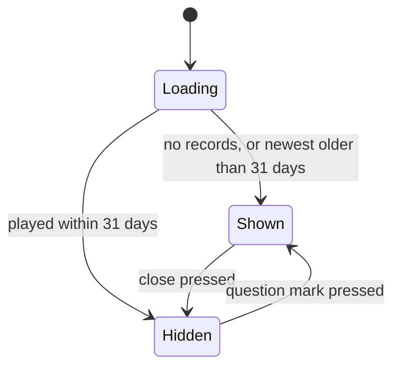

# PRD — Epic 3: How to play, for anyone new

Feature: [briefing.md](../briefing.md) · [roadmap.md](../roadmap.md)

## Summary

A visitor who has never played, or who has been away for over a month, is met
with a short how-to-play under the header: *Listen to the groove 🎧 · Jam along
🎸 · Guess the Root & Mode 🎯 · Come back every day for a new challenge ⏭*.
Everyone else never sees it. A question mark at the end of the subtitle brings it
back for anyone who wants it.

## Problem

The page explains its premise in a line (Epic 1) and points at the first action
(Epic 2), but never says what the loop actually is: that you listen, that you
may play along, that the answer has two halves, and that there is a new one
tomorrow. A regular does not need any of that and would resent being told it
daily. So the explanation has to know who it is talking to — which the app can
already work out, because it knows every day the player has recorded.

## Scope

- A how-to-play box under the header and above the two puzzle cards, carrying
  the four bullets.
- The rule for who sees it, derived from the saved record set.
- A close button on the box.
- A question mark control at the end of the subtitle that shows the box again.

**Out of scope**
- **Any interactive tutorial**, walkthrough, coach marks, or overlay on top of
  the puzzle. Four bullets in a box, as briefed.
- **Making "Jam along 🎸" true beyond what the looping groove already offers.**
  Tempo control, transpose, count-in and a fretboard are the *Jam mode*
  candidate in `specs/features.md` and stay there.
- **A remembered dismissal.** Nothing about closing the box is stored, in this
  browser or any other. Cross-device state is feature-A's question.
- **Changing what counts as a played day for the streak.** `isQualifying` in
  `streak.ts` is untouched: it asks whether a day was *solved*, and this box
  asks whether a day was *attempted*. Conflating them would hide the box from
  someone who plays daily and loses, or show it to someone who solved yesterday
  by luck.
- **The subtitle itself** — Epic 1 owns its text and position; this epic adds a
  control at the end of it.
- **Onboarding for anything else** the app might later grow.

## Requirements

- **R1** — A player with no saved results sees the how-to-play box on arrival.
- **R2** — A player whose most recent saved result is more than 31 days before
  today sees the box on arrival.
- **R3** — A player whose most recent saved result is within the last 31 days
  does not see the box on arrival.
- **R4** — The box contains exactly four items, in this order and with these
  words: `Listen to the groove 🎧`, `Jam along 🎸`, `Guess the Root & Mode 🎯`,
  `Come back every day for a new challenge ⏭`.
- **R4a** — The items are a numbered list, 1 to 4. The numbers come from the
  list itself, not from the copy, so an item's text is exactly the words above
  and the numbering cannot drift from the order.
- **R4b** — The items are the most prominent text in the box: set above body
  copy in size, in the page's full ink rather than the muted tone, with the
  numbers in the accent colour.
- **R5** — The box sits between the page header and the two puzzle cards. It
  precedes the game it explains and never covers it.
- **R5a** — The box is rendered on the recessed inset surface, so it reads as an
  aside rather than as a third card competing with the groove and the guess. It
  does not use the accent surface the solved panel uses.
- **R6** — The box carries a close control. Closing it hides it for the rest of
  the session.
- **R7** — Nothing about the dismissal is persisted. On the next visit, the rule
  in R1–R3 decides again from the record set alone.
- **R8** — A question mark control sits inline at the end of the subtitle,
  directly after its final character, so it follows the last word wherever the
  sentence wraps rather than sitting beside the paragraph. Pressing it shows the
  box, whether it was never shown, closed by the player, or hidden because they
  are a regular.
- **R9** — The question mark is a real button with the accessible name "How to
  play". It is reachable and operable by keyboard, and is not a hover-only
  affordance.
- **R10** — The question mark is present whenever the box is not showing, for
  every player regardless of their streak or their history. While the box *is*
  showing it is hidden: a control asking for something already on screen is
  noise. Closing the box brings it back in the same moment.
- **R11** — The box is never shown before the saved records have loaded. A
  returning player must not see it flash on the first painted frame.
- **R12** — "Most recent saved result" means the newest record by date,
  regardless of whether that day was solved, given up on, or merely guessed at.
  A day with attempts is a day the player was here.
- **R13** — The rule reads only the dates of saved records. No new storage key,
  no "seen the intro" flag, and no new field on `DailyResult`.
- **R14** — The emoji are decorative. Each bullet's text carries its meaning
  without them.
- **R15** — Corrupt, absent or unreadable storage is treated as no results,
  which shows the box. A new browser and a broken one look the same, and the
  safe direction is to explain the game rather than withhold the explanation.
- **R16** — Whether the player is new or returning is decided once, when the
  saved records first load, and held for the rest of the session. Records
  written afterwards — today's first attempt, and every attempt after it — do
  not change it.
- **R17** — Playing does not close the box. A player who guesses while the box
  is open keeps it until they close it themselves.

## Behaviour details

**Who sees it.** `ResultStore.getAll()` already returns every `DailyResult`, and
each carries its `date`. So the rule is one pure function of the record set and
today, sitting beside `computeStreak` in `lib/persistence/` and using the same
noon-anchored ISO date parsing that `streak.ts` uses to survive DST. `useProgress`
derives one boolean from it, the way it already derives the streak — the record
list itself stays private to the hook rather than being handed out.

**When it is decided.** Once, when the records load. This matters because the
first attempt of the day writes a record dated today: a lapsed player who starts
guessing stops being lapsed while the box is still on screen, and a rule that
re-read the record set would pull the explanation away mid-read. "New or
returning" is a property of how the player arrived, not of what they have done
since — so the boolean is computed at load and does not move until the page is
loaded again.

Recording an attempt is deliberately absent from that diagram: it is not a
transition. The only two things that move the box are the close control and the
question mark.

There is no `Shown --> Shown` edge either, because the question mark exists only
in the `Hidden` state — it cannot be pressed while the box is up, since it is not
rendered then.

**Where the state lives.** The question mark is in the header and the box is
below it, so whether the box is open is session state in `GroovePuzzleView`,
passed to both. It is not a preference: it says nothing about who the player is,
so it does not belong in `preferences.ts` alongside simple mode.

## Acceptance criteria

- **AC1** (R1) — Given empty storage, when the page loads, then the box is
  shown.
- **AC2** (R3) — Given a saved result dated yesterday, when the page loads, then
  the box is not shown.
- **AC3** (R2) — Given a single saved result dated 35 days ago, when the page
  loads, then the box is shown.
- **AC4** (R2, R3) — Given a saved result dated exactly 31 days ago, when the
  page loads, then the box is not shown; and given one dated 32 days ago, then
  it is.
- **AC5** (R4) — Given the box, when it renders, then it shows the four items in
  the stated order with the stated words.
- **AC5a** (R4a) — Given the box, when it renders, then the items are an ordered
  list, and no item's own text begins with its number.
- **AC5b** (R4b) — Given the box, when an item is inspected, then it is set above
  body size in the default ink and not the muted tone, and the list's markers
  carry the accent colour.
- **AC6** (R5) — Given the page with the box showing, when the layout is
  inspected, then the box follows the header and precedes the groove card.
- **AC6a** (R5a) — Given the box, when its surface is inspected, then it carries
  the inset treatment and not the raised or accent one.
- **AC7** (R6, R7) — Given the box showing, when the close control is pressed,
  then the box is gone; and when the page is reloaded with the same storage,
  then the box is shown again.
- **AC8** (R8) — Given the box closed, when the question mark is pressed, then
  the box is shown again.
- **AC9** (R8, R10) — Given a player with a result dated yesterday, when the page
  loads, then the question mark is present and the box is not; and when the
  question mark is pressed, then the box is shown.
- **AC9a** (R10) — Given a new player, when the page loads, then the box is shown
  and the question mark is absent; when the box is closed, then the question mark
  appears; and when it is pressed, then the box returns and the question mark goes
  again.
- **AC9b** (R8) — Given the header, when the tagline paragraph is inspected, then
  the question mark is inside it and is its last element child.
- **AC10** (R9) — Given the header, when the question mark is reached by
  keyboard and activated by keyboard, then the box is shown, and the control's
  accessible name is "How to play".
- **AC11** (R11) — Given a returning player, when the page renders before the
  records have loaded, then the box is not in the rendered output.
- **AC12** (R12) — Given a single saved result dated yesterday that was not
  solved, when the page loads, then the box is not shown.
- **AC13** (R13) — Given the box has been shown and closed, when localStorage is
  inspected, then no key beyond the existing results and preferences keys has
  been written.
- **AC14** (R15) — Given a storage that throws on read, when the page loads,
  then the box is shown and nothing throws into the UI.
- **AC15** (R16, R17) — Given empty storage and the box showing, when the player
  makes a guess and today's record is written, then the box is still shown.
- **AC16** (R16) — Given a single saved result dated 35 days ago and the box
  showing, when the player makes a guess, then the box is still shown; and when
  the page is then reloaded, then the box is not shown, because the newest
  record is now today.

## Dependencies

- **On Epic 1** — the subtitle node the question mark sits at the end of, and
  therefore the final shape of the header's left `Stack`. This epic edits
  `GrooveHeader.tsx` to add the control, so it starts after Epic 1 has landed
  rather than in parallel with it.
- **On Epic 2** — no contract, but it rebases onto whatever alignment Epic 2
  leaves the header row in.
- **Hands forward** — nothing. It is the last epic in the feature.

Per `docs/testing.md`, behaviour is tested through the feature's public surface
using `testing/renderFeature.tsx`, not by reaching past `index.ts`; the
who-sees-it rule is plain-function logic in `lib/` and is tested directly as a
plain function.

## Assumptions

- "Longer than a month" is 31 days. Calendar-month arithmetic buys nothing here
  and misbehaves at the end of February.
- The four items carry the emoji as trailing marks, exactly as the briefing
  writes them. They are numbered 1 to 4: the fourth is a habit rather than a
  step, but four numbered lines tell a newcomer there are exactly four things to
  know, which is worth more than the taxonomy.
- The box has a heading of its own ("How to play"), which is also what the
  question mark's accessible name refers to.
- The inset surface comes from `Card tone="inset"`, which already exists; no new
  design-system component is added for the box.
- The close control is an icon button with an accessible name, in the box's own
  corner.
- The question mark is never a toggle. It cannot be pressed while the box is
  showing, because it is not rendered then; the box carries its own close
  control, and a question mark that hides things would be a surprise.
- The page tells the header there is nothing to ask for by passing no handler,
  rather than by a second boolean prop. No handler, no control.
- The box does not scroll into view or steal focus when it appears. It is above
  the fold on arrival by construction.
- A session left open across midnight keeps the decision it loaded with. The
  page already resolves "today" once per session for the groove and the header;
  the box follows the same rule rather than inventing a midnight refresh of its
  own.

## Question log

Answered questions, kept for traceability. The requirements above are the source
of truth — this records how they got there. Append-only: never rewrite or prune
a past cycle, or the record stops being trustworthy.

### Cycle 1 — 2026-08-31

**Q2. What does the box look like?**
Answer: **A) An inset panel** — the explanation is an aside, not a third card
competing with the groove and the guess, and the accent surface would make the
instructions the loudest thing on a new player's page.
Applied to: R5a, AC6a, Assumptions

### Cycle 2 — 2026-08-31

**Q1. Is the who-sees-it rule decided once per session, or re-read as the player
plays?**
Answer: **A) Decided once, when the records load, and held for the session** —
the first attempt of the day would otherwise pull the box away mid-read, and
"new or returning" describes how the player arrived, not what they have done
since.
Applied to: R16, R17, AC15, AC16, Behaviour details ("When it is decided", the
state diagram's note), Assumptions

### Cycle 3 — 2026-08-31

**Follow-up from the Epic 1 QA review, given directly rather than as a ticked
option:** *"the question mark should go directly at the end of the subtitle.
otherwise, it looks misplaced. When the bullet point explanation is shown, hide
the question mark."*
Applied to: R8, R10, AC9a, AC9b, Assumptions. This reverses R10's original
reading — the question mark was specified as present for every player regardless
of the box's state — and tightens R8 from "at the end of the subtitle line" to
inside the subtitle's own paragraph.

### Cycle 4 — 2026-08-31

**Follow-up given directly:** *"please make the how to play box a bullet point
list (numbered 1. - 4.) and also make the bullet points more prominent (color and
maybe a bit bigger?)"*
Applied to: R4a, R4b, AC5a, AC5b, Assumptions. This overturns the earlier
assumption that the items should be an unnumbered list on the grounds that the
fourth item is not a step.
