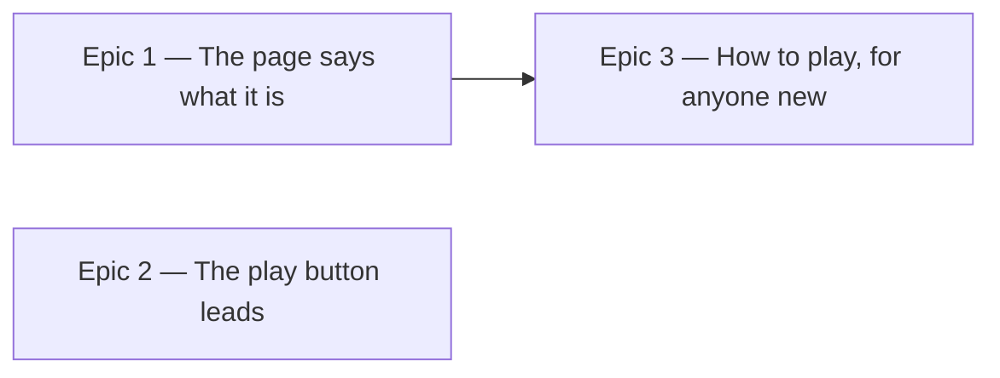

# Roadmap — First-run clarity

Source: [briefing.md](briefing.md)

## Overview

Feature-8 is about the first thirty seconds. Someone who has never been here
lands on a page headed *Daily Groove* with no statement of what it is, no
instructions, and a play button the same size as the button beside it — and has
to infer the game from the controls. This feature names the app *Eardle*, says
in one line what you are about to do, hands a genuinely new visitor a four-point
how-to-play that regulars never see, and makes the one thing you should do first
look like the one thing you should do first.

Three epics. The naming and the prominence pass are independent and both ship in
wave 1; the explanation box follows, because the question mark that brings it
back has to sit next to a subtitle that exists.

## Epics

### Epic 1 — The page says what it is

**Visible when done:** the masthead reads **Eardle**, and under it, in body
type, *"Wordle for your ears. Listen to today's groove, figure out the key, and
test your musicianship daily."* The browser tab says Eardle too. A visitor who
reads nothing else knows what the page wants from them.
**Depends on:** none
**Parallel with:** Epic 2

**Scope**
- `components/header/GrooveHeader.tsx`: the `<h1>` becomes `Eardle`, and the
  subtitle joins the left-hand `Stack` beneath it.
- The subtitle is `Text`, not a `Heading`. `Heading size="xl"` is the masthead
  and is set in the hand-lettered Petaluma face by the `FAMILY` table in
  `components/typography/Heading.tsx` — a sentence that long in a Real Book hand
  is a decorative smear, not a sentence. The face stays on the four words that
  earn it.
- The date line leaves the header — the groove card has carried the day beside
  the tempo since feature-7 — so the header reads name-then-pitch and
  `GrooveHeader`'s only prop is the streak.
- `app/layout.tsx` metadata: `title` becomes `Eardle`, and `description` becomes
  the subtitle, since it is now the app's one-line pitch and there is no reason
  for two.
- The feature's landmark label follows the name: `<section aria-label="Daily
  Groove">` in `GroovePuzzle.tsx` (both occurrences, the loading branch
  included) becomes `Eardle`.
- The existing assertions that name the old title move with it, rather than
  being deleted: `app/page.test.tsx`, `GrooveHeader.test.tsx` and the three in
  `GroovePuzzle.test.tsx` — including the one that checks the h1 carries the
  jazz face, which must keep passing on the new word.
- Tests: the h1 reads Eardle; the subtitle is present and is not part of the
  heading's accessible name; the masthead is still in the display face.

**Out of scope**
- Every internal use of the string `daily-groove`. The package name, the
  `src/features/daily-groove/` folder, and above all the storage keys
  `daily-groove:v2:results` and `daily-groove:v1:prefs` stay exactly as they
  are — see Assumptions. Renaming a storage key is not a rename, it is a
  deletion of everyone's history.
- The README, which is still the `create-next-app` boilerplate and is not made
  better or worse by this feature.
- Any new design-system component. The header is a `Heading` and a `Text` inside
  the `Stack` that is already there.

**Validation**
- Demo: load the page. Masthead reads Eardle, one line of body copy under it,
  tab title matches.
- `GrooveHeader` unit test driven by props, per `docs/testing.md`; page-level
  assertions stay where they are.

### Epic 2 — The play button leads

**Visible when done:** the play control is unmistakably the largest control on
the page — the obvious first move, no longer the twin of the check button beside
it. The streak still sits at the top right, now level with the middle of the
title block rather than stranded at its top.
**Depends on:** none
**Parallel with:** Epic 1

**Scope**
- **Q2 → A.** `Button` gains a `size` prop: `md`, today's geometry and the
  default, and `lg`. It stays a generic knob — a size, not a knowledge of what
  is being played. The design system may not learn what a groove is.
- `PlayControl` passes `size="lg"`. The check button in `GuessCard` keeps the
  default and is not touched, so the contrast is the point rather than a
  side-effect.
- This explicitly reverses feature-4, which made the two buttons the same size
  on purpose. `PlayControl`'s doc comment still argues that case — "there is one
  page and one loop, so there is one form" — and must be rewritten rather than
  left contradicting the code.
- `components/structure.test.ts` hard-codes the exact component list; because
  Q2 → A adds a prop rather than a primitive, that list stays as it is. Only
  `Button`'s own contract test grows.
- **Q1 → B.** The streak stays where it is: the right-hand end of the header
  row, inside the feature. What changes is one prop — `GrooveHeader`'s `Row`
  carries `align="start"` today and becomes `align="center"`, so the badge sits
  against the middle of the title block that Epic 1 makes two lines tall
  instead of floating at its top. `Row` already supports `center`; no
  design-system change is needed for this half.
- Tests: `Button`'s sizes against its own contract, with the default geometry
  unchanged — a size prop that silently moves every existing button is a
  regression, not a feature; `PlayControl` at the large size keeps its
  accessible name and its three states (`play` / `stop` / `loading`); the header
  still renders the badge opposite the title block.

**Out of scope**
- The caption under the play button ("Play along. Find the note that feels like
  home.") and the transport's loop visualisation. Both stay as they are; this is
  a size change, not a redesign of the card.
- What the streak *says*. `StreakBadge`'s empty state and wording are untouched.
- Moving the streak anywhere. Q1 → B settled that "top right of the page" is
  already where it is: it is not raised above the title, not lifted into the
  page shell, and not pinned to the viewport — it scrolls with the page like
  everything else.
- Asserting the vertical centring by class name. Where the badge sits in the
  header is a test; how a flex row aligns it is a look, checked by eye.

**Validation**
- Demo: on a narrow phone and a wide desktop, the play button is the largest
  control on the card and the streak is level with the title block.
- Component tests for `Button` and `PlayControl` per `docs/testing.md`; the
  header's arrangement asserted through `GrooveHeader`.
- Both themes and the `sm` collapse checked by eye — the header already
  collapses below `sm` and must still be legible when it does.

### Epic 3 — How to play, for anyone new

**Visible when done:** arrive with an empty browser, or after a month away, and
a box sits under the header: *Listen to the groove 🎧 · Jam along 🎸 · Guess the
Root & Mode 🎯 · Come back every day for a new challenge ⏭*. Come back tomorrow
and it is gone. Press the question mark by the subtitle and it is back.
**Depends on:** Epic 1 (the subtitle the question mark sits beside)
**Parallel with:** nothing — it is wave 2 on its own

**Scope**
- The four bullets, in a `Card`/`Panel` under the header and above the two
  puzzle cards. Domain copy, so it is a feature component under
  `components/`, not a design-system primitive.
- Who sees it: nothing stored, or nothing played in the last month. Both facts
  are already in the record set — `ResultStore.getAll()` returns every
  `DailyResult` and each carries its `date`. So this is one more pure function
  over records and today, sitting beside `computeStreak` in
  `lib/persistence/`, and `useProgress` derives it the way it already derives
  the streak. No new key, no new store, no "hasSeenIntro" flag.
- `useProgress` holds `all` in state but does not hand it out. It gains one
  derived boolean — not the record list, which would leak the day-by-day history
  into every consumer.
- The question mark: a small control that reopens the box once it is hidden.
  **Q3 → A** — it sits at the end of the subtitle line, where it belongs to the
  explanation and leaves the masthead clean. It must be a real button with an
  accessible name ("How to play"), reachable by keyboard — not a hover-only
  glyph.
- **Q4 → A.** The box carries a close button that hides it for the rest of the
  session. Nothing about that dismissal is stored, so the next visit is decided
  by the record rule alone — and a player who closes it and then wants it back
  presses the question mark. The box never vanishes out from under someone
  mid-read, and no "hasSeenIntro" flag can get stuck.
- Reopening is session state in the feature, not a preference: it says nothing
  about who the player is, so it does not belong in `preferences.ts`.
- The hydration rule the page already follows applies here too — `GroovePuzzle`
  refuses to paint before `hydrated`, precisely so a saved day never flashes as
  untouched. A how-to-play box that flashes at a five-year regular before their
  records load is the same bug, and the same guard prevents it.
- Tests through the feature's public surface via `testing/renderFeature.tsx`:
  empty storage shows the box; a record from yesterday does not; a record from
  five weeks ago does; closing it hides it and the question mark brings it back;
  the box is not in the first painted frame for a returning player.

**Out of scope**
- Any interactive tutorial, walkthrough, coach marks, or a first-run overlay
  over the puzzle. Four bullets in a box, as briefed.
- Making "Jam along 🎸" true beyond what the looping groove already offers.
  Tempo control, transpose, count-in and a fretboard are the **Jam mode**
  candidate in `specs/features.md` and stay there.
- A dismissal that is remembered across browsers or devices. Nothing here is
  synced; feature-A owns that question.
- Changing what counts as a played day for the streak. `isQualifying` in
  `streak.ts` is untouched — a day the player *attempted* is what this box reads,
  which is not the same test, and conflating them would make the box reappear
  for someone who plays daily and loses.

**Validation**
- Demo: clear site data, reload — the box is there. Play a groove, reload
  tomorrow — it is gone. Press the question mark — it is back.
- Faked clock at five weeks past the last record: the box returns.
- Keyboard pass: tab to the question mark, press it, the box appears and focus
  behaves.

## Dependency map

## Execution waves

- **Wave 1 (parallel):** Epic 1, Epic 2. Both open `GrooveHeader.tsx`, so they
  hold to a contract: **Epic 1 owns what the title block says** — the `<h1>`
  text and the subtitle inside the left `Stack` — and **Epic 2 owns the row's
  alignment**, touching neither the heading nor the subtitle. It is one prop
  each, on adjacent elements. Epic 2's larger half, `Button`/`PlayControl`,
  shares no file with Epic 1 at all. Epic 2's centring is correct either way,
  but only *looks* like the answer once Epic 1's second line exists — worth
  knowing when it is reviewed alone.
- **Wave 2:** Epic 3 — the question mark is positioned relative to the subtitle,
  which is Epic 1's, and it rebases onto whatever arrangement Epic 2 leaves the
  header in.

## Assumptions

- **"Eardle" renames the app, not the code.** The user-visible name, the tab
  title and the landmark change. `src/features/daily-groove/`, the package name,
  and both localStorage keys keep the old word. The keys are the load-bearing
  case: `daily-groove:v2:results` holds every streak anyone has, and renaming it
  is indistinguishable from wiping it.
- **The subtitle is body copy, not a heading.** It is one sentence and it is set
  in the sans face, for the reason given in Epic 1.
- **"Last attempted puzzle" means the newest saved record**, whether that day
  was solved, given up on, or merely guessed at. A day with attempts is a day
  the player was here.
- **"Longer than a month" is 31 days.** Calendar-month arithmetic buys nothing
  here and misbehaves at the end of February.
- **The explanation box sits between the header and the two puzzle cards.** It
  precedes the game it explains; it does not displace or overlay it.
- **The emoji are part of the copy**, exactly as briefed, and are decorative to
  a screen reader — the bullet text carries the meaning.
