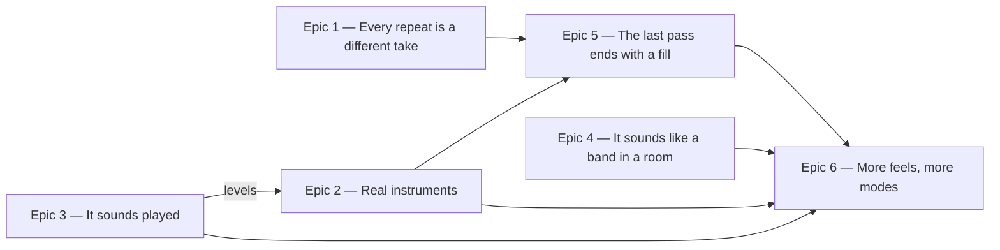

# Roadmap — Natural feel

Source: [briefing.md](briefing.md)

## Overview

The generator builds one bar of grid, stamps it four times, sprinkles white
noise on it, and plays it back on a cajon, an FM piano and a clavisynth. This
feature turns that into a band: real instruments, a loop of several *passes*
that are never bit-identical, a timing and dynamics model that behaves like
limbs, parts that sound like hands and fingers, a fill at the end of the last
pass, and more feels to draw from. The freeze rule goes first, because
none of it is possible while the committed audio is immutable.

Value arrives in that order. Epic 1 alone removes the loudest structural tell —
the ear locking onto a loop within two cycles because the repeats are the same
bytes — and Epic 2 removes the loudest timbral one. Everything after them is
depth on a shape that already works.

The briefing's four open questions are answered and folded in. Each epic now has
a PRD under [prd/](prd/) carrying its requirements, acceptance criteria and its
own question log.

## Epics

### Epic 1 — Every repeat is a different take

**Visible when done:** press play and listen past bar four. Bar five is the same
figure, but not the same recording — different micro-timing, different sample
alternates — so the loop stops announcing itself. The transport still shows four
bars and says nothing about which pass is sounding. And `npm run grooves`
re-renders the whole catalogue without anyone invoking an exception.
**Depends on:** none
**Parallel with:** Epics 2, 3, 4

**Scope**

- **The freeze rule goes.** Delete the section in `scripts/grooves/README.md`
  and its two other references — the "See the freeze rule below" pointer above
  *Regenerating*, and the troubleshooting line calling a re-render a violation.
  Rewrite the surrounding paragraphs rather than leaving dangling references.
- **`src/lib/hash.ts` stays frozen, for the other half of its reason.**
  `docs/coding-guidelines.md` justifies that rule twice over: re-rendering every
  groove, *and* reassigning every past date a different puzzle. The first
  justification dies with the freeze rule; the second does not. Rewrite the rule
  to stand on the date mapping alone. `src/lib/hash.test.ts` and its fixed
  input/output table are untouched.
- **The loop becomes several passes of four bars, and how many is the feel's
  decision.** `FeelTemplate` declares a pass count — four for the fast feels,
  two for half-time, whose 68–80 bpm range would otherwise make a sixteen-bar
  file 56 seconds long. The bar loop in `events.ts` becomes a pass loop;
  the chord for a bar is still
  `progressionMidi[barWithinPass % progressionMidi.length]`, so the harmony
  repeats every four bars and the manifest's `progression` stays exactly as
  true as it is today.
- **Rhythms are drawn once; performances are drawn per pass.** The kick, hat,
  bass and comp patterns stay the ones the seed picked — same figure, four
  readings. What is redrawn is the deviation: the humanize generator is
  labelled `${template}:${seed}:humanize:${pass}`. Round-robin alternates come
  free — `roundRobin()` in `voices.ts` already keeps one counter per voice
  across the whole event list, so pass two lands on different files without a
  line of change.
- **Split the rng, and keep the existing answers.** Today one generator
  labelled `:events` draws the tempo, the root, the flavour, the harmony *and*
  every rhythm choice in sequence, so any change to how many draws the rhythm
  side makes re-keys the whole catalogue — a player's record of solving
  `groove-07` starts pointing at a groove in another key. Split it: a `:music`
  generator for tempo/root/flavour/harmony, drawn first and never extended, and
  a `:rhythm` generator for everything else. Arrange the `:music` draws so every
  existing seed reproduces the answer it has today; Epics 2–6 then change how
  grooves *sound* without changing what they *are*.
- **The manifest carries both numbers.** `Groove` in `src/lib/groove.ts` gains
  `loopBars` (the file's loop) beside `bars` (4 — the musical figure), and
  `manifest.ts`'s `FIELDS` list grows with it. `loopBars` varies across the
  catalogue because the pass count does. `loopSecondsOf` in
  `lib/theory/music.ts` uses `loopBars`, falling back to `bars` so the function
  still describes a groove that has only one of them.
- **The transport shows a four-bar loop of a longer file, and nothing else.**
  `TransportPanel.tsx` keeps `BAR_COUNT = 4`, is told the pass count, and gains
  the arithmetic: position is 0..1 over the whole loop, so the sounding bar is
  `floor(position × passes × 4) % 4` and the bar fill is `(position × passes) %
  1`. Both must come from the same value or they disagree at a boundary. There
  is **no pass indicator** — the bar highlight already moves, and Epic 5's fill
  marks the loop audibly without adding chrome.
- `ProgressTrack` is unchanged. It takes a value, a segment count and an active
  segment; all three still describe exactly what it draws. The design system
  does not learn what a pass is.
- **The gate follows the length.** `checkDensity` in `gate.ts` divides events by
  `music.bars`; it must divide by the bar count it actually rendered. `mix.ts`'s
  overhang fold is untouched and now folds the bar past bar sixteen onto bar
  one.
- Re-render the catalogue, commit the mp3s, the manifest and the lock.

**Out of scope**

- Fills and toms — Epic 5. Every pass ends like the others for now.
- Any indication of which pass is sounding.
- Every change to what is *played*, how it is played, or what it is played on:
  Epics 2, 3 and 4.
- Re-encoding at a lower bitrate. See Assumptions.

**Validation**

- Demo: play a groove through two full cycles. Bar 5 is recognisably the same
  figure as bar 1 and audibly not the same recording. The bar highlight and the
  track fill reset together at every pass boundary, for a two-pass groove as
  well as a four-pass one.
- **The manifest diff is the proof of the answer-pinning rule**: after
  re-rendering, `grooves.generated.ts` differs only by the added `loopBars` and by each
  groove's `headDelaySeconds`. Every `scale`, `chord`, `progression`, `root`,
  `flavour` and `bpm` is byte-identical. A test pinning the eighteen answers
  makes that durable rather than a one-time eyeball.
- `npm run grooves` twice in a row leaves `git status` clean; `npm run
  grooves:verify` passes on the committed tree.
- Unit tests: `loopSecondsOf` reads `loopBars` and falls back to `bars`;
  `TransportPanel`'s bar and pass arithmetic across a full cycle, including the
  wrap; the events stage emits sixteen bars whose four passes share rhythm steps
  but not deviations; the `:music` generator's draws are unchanged by editing
  the `:rhythm` side.

### Epic 2 — Real instruments

**Visible when done:** the groove stops sounding like a sample-library demo. The
whole drum kit replaced from one source, an electric bass instead of the FM
piano, an electric piano instead of the clavisynth — and, because they come from
one kit rather than instruments recorded in separate rooms, they sound like they
belong together.
**Depends on:** none to start, but **merges after Epic 3**, whose corrected
dynamics scaling its levels are rebased onto
**Parallel with:** Epics 1, 3, 4

**Scope**

- **The pack swap is in this feature, as its own epic**, rather than deferred. It lands in wave 1 deliberately: it is the largest timbral change
  here, and every mix and dynamics decision in Epics 3 and 4 should be tuned
  against the final band rather than re-tuned after it.
- **Every voice is replaced.** Two are outright stand-ins — `kick` is a cajon
  bass tone and `rim` a woodblock — and `bass` (TX81Z FM Piano) and `comp`
  (TX81Z Clavisynth) are synths standing in for an electric bass and an electric
  piano. The snare and hi-hats are genuine drum samples and go anyway: they are
  three separate VCSL instruments recorded apart from each other, and coherence
  is the point.
- **Everything stays inside VCSL.** One library, one licence file, one
  provenance format — and where VCSL holds no ideal instrument for a voice, its
  closest is accepted rather than a source from outside. If it holds no kit
  recorded together, coherence is what gives rather than the licence boundary:
  the best instrument per voice is taken and Epic 4's shared room does the
  gluing, with the coherence sign-off taken once that room is in the path.
- **The pitched voices keep their sampling contract.** `samples/README.md`
  records it and `pack.test.ts` asserts it: sampled every 4 semitones so the
  renderer never shifts more than 2 — the bound that keeps `resample()`'s linear
  interpolation transparent. New `bass` covers sounding MIDI 22–50, new `comp`
  covers 46–86. A replacement that cannot be sampled that densely is the wrong
  replacement, not a reason to loosen the bound.
- **Measure the sounding pitch; never trust the filename.** The Clavisynth
  warning in `samples/README.md` goes when the clavisynth does, but the
  procedure it documents stays and gets restated for whatever arrives: VCSL's
  `Clavisynth_C2` sounds at C4, which was caught by measurement and would have
  made the game unplayable if assumed.
- **Layers stay un-normalised.** The level difference between velocity layers is
  the data — the README says so, and Epic 3's velocity fix depends on it. Trim,
  fade, downmix to mono, encode 44.1 kHz FLAC, exactly as the existing pipeline
  documents.
- **Every template's `pan` is re-tuned, and its `gain` is rebased.** A cajon at
  −3 dB and a bass drum at −3 dB are not the same loudness — but Epic 3 also
  moves every level when it fixes the doubled dynamics, so this epic's level work
  starts from Epic 3's values rather than today's. See the wave-1 contract.
- `pack.json`, `provenance.json` (one entry per file, original path recorded),
  `LICENSE.txt` if any source is not VCSL, and `pack.test.ts`'s stocking
  assertions all grow with the new files.
- **Repo weight.** `samples/` is generation-time only — never served, never
  bundled — but it is committed. More notes × more layers × more round-robins
  is a meaningfully larger tree; audition with that in mind rather than taking
  every alternate on offer.

**Out of scope**

- Toms. They belong to the same kit chosen here, but they exist to serve fills,
  so they are minted in Epic 5 against whatever this epic picks.
- Per-voice EQ, compression or saturation. Choosing better sources is not the
  same as mixing them, and `mix.ts` stays a summing bus plus Epic 4's send.
- Any change to what is played. Same events, better instruments.

**Validation**

- Demo: A/B the same seeds before and after. The answer is unchanged, the
  tempo is unchanged, and the band is different.
- `pack.test.ts`: every declared file exists; velocity layers differ in level
  (proving they were not normalised); both pitched voices cover their declared
  register with no shift beyond 2 semitones; the declared `midi` is the
  *sounding* pitch, verified by measurement for at least one note per octave.
- `provenance.json` accounts for every file in `samples/`, and licensing is
  recorded for any non-VCSL source.
- `npm run grooves` idempotent; `grooves:verify` clean; the eighteen answers
  still pinned by Epic 1's test.

### Epic 3 — It sounds played

**Visible when done:** the kit sounds like a person with four limbs. The snare
sits behind the beat, the hats push a little, ghost notes appear between the
backbeats, and no hi-hat jumps in level for no reason.
**Depends on:** none
**Parallel with:** Epics 1, 2, 4

**Scope**

- **Per-voice lean.** `FeelTemplate.humanize` grows a signed millisecond offset
  per voice, declared per template with no shared default — snare 8–15 ms late,
  hats a hair early — applied in `humanize.ts` before the random deviation. A
  shuffle and a half-time groove do not lay back by the same amount, so lean is
  as much a property of a feel as swing is. This is the largest audible change in
  the epic and the smallest diff in it. `types.ts` is no longer frozen: feature-3's
  "nobody changes this shape" was scoped to its own parallel epics and those
  shipped.
- **Deviations that correlate.** Replace `bipolar()`'s independent uniform draw
  with a gaussian draw off a slow random walk across the bar, so consecutive
  hits move together instead of each one teleporting. The existing
  sub-subdivision clamp stays exactly as it is — a laid-back snare plus a walk
  must still never cross into the neighbouring slot.
- **The bass locks to the kick.** Its deviation is derived from the kick's
  deviation at the same step rather than drawn fresh. A rhythm section is never
  statistically independent.
- **Fix the doubled dynamics.** `pack.ts` picks the velocity layer by velocity
  and `voices.ts` then multiplies the sample by velocity again, squaring the
  dynamic range and putting an audible level step at every layer boundary — the
  hats sit on 0.45 and flip layers hit to hit as humanize jitters across it.
  `SamplePack.get` returns the layer's nominal velocity alongside the PCM, and
  `renderVoices` scales relative to that. Every groove's level moves, so
  `gate.ts`'s peak and silence floors get a look.
- **Ghost notes that exist.** The snare plays only the backbeat today;
  `GHOST_VELOCITY_THRESHOLD` passes its test on quiet hats alone. Add real
  ghosts on off-sixteenths at 0.15–0.25, per template.
- **Hat accent shapes.** A repeating 2- or 4-step accent pattern for the hats
  instead of `velocityFor()`'s pure function of metric position. Kick, snare and
  the pitched voices keep the metric reading.
- **A breath of tempo drift.** ±0.3–0.8 % within each pass, from an envelope
  that is zero at every pass boundary, applied after swing and before
  `fitToLoop`. Resolving every four bars reads as a player breathing rather than
  as the tape slowing down, and it keeps the seam and the transport arithmetic
  honest at several anchor points instead of one.
- **Re-tune the density bands.** Ghosts push events-per-bar up; the existing
  `density` bands will reject candidates that are exactly what this epic set out
  to produce. Widen them deliberately rather than discovering it through
  `grooves:add` attempt-limit failures.
- **Re-tune the levels too.** The dynamics fix changes every groove's balance —
  ghosts up, accents down — so `gain` moves with it rather than being left for
  Epic 2 to discover. The fix and the levels it implies land in one change, and
  Epic 2 rebases onto them.

**Out of scope**

- Anything about *which notes* are played — voicings, bass line writing, note
  lengths. Epic 4.
- The room. Epic 4.
- Which instrument sounds, and `pan`. Epic 2.
- New voices. Epic 5.

**Validation**

- Demo: a listening pass across all four templates, before and after, same
  seeds.
- Unit tests: a seeded groove's snare onsets are consistently later than its
  grid and its kick's; no event crosses half a subdivision however large the
  lean plus the walk; the loop is still exactly `loopSec` long after drift;
  ghost-velocity events exist in every rendered groove; a velocity swept across
  a layer boundary produces a monotonic, step-free amplitude curve.
- `gate.ts` still accepts every catalogue entry, with the density band change
  recorded in the template rather than in the gate.

### Epic 4 — It sounds like a band in a room

**Visible when done:** the comp sounds like two hands on a keyboard rather than
a block chord stamped four times, the bass sounds like a player rather than an
arpeggiator, notes end when they should, and the voices sound like they are in
one room.
**Depends on:** none
**Parallel with:** Epics 1, 2, 3

**Scope**

- **Note-offs.** `durationSec` is decorative: `addAt` in `voices.ts` copies the
  whole sample regardless. Honour it with a short release fade at
  `timeSec + durationSec`. This makes `durationSec` load-bearing for the first
  time, so `fitToLoop`'s habit of stretching the last event to the loop end
  becomes audible and needs checking.
- **Hat choke.** A `hatClosed` onset truncates a still-ringing `hatOpen`. The
  smallest honest version is a choke group in the voices stage; no template
  field needed.
- **Comp voicings.** `inCompRegister()` folds each chord tone independently, so
  the voicing re-inverts at random on every chord change. Replace it with a fold
  that minimises motion from the previous chord. Then: spread the chord 5–15 ms
  (seeded direction), shape velocity within it (top voice up, inner voices
  down), and drop the root when the bass has it.
- **Bass lines.** `chord[i % chord.length]` walks the chord tones in fixed order
  inside one octave. Add repeated roots, octave jumps and rests.
- **Approach notes, narrowly.** The bass may play one chromatic approach
  note, and only on the last off-beat before a chord change, resolving into the
  next chord's root — the loop boundary included, since bar sixteen leading back
  into bar one is a chord change like any other and the note sounds inside the
  loop rather than in the overhang. **This is also where a gap gets closed.** `checkHarmony`
  validates the *harmony object* — chord names, degrees, pitch classes — and
  never looks at a `NoteEvent`; the events are in scale today only because
  `events.ts` derives every pitch from `harmony.progressionMidi`. The moment the
  bass may play a non-chord tone, "the events match the words" stops being true
  by construction and nothing is checking it. So this epic adds an event-level
  pitch check to the gate, with the approach note as its one named exception,
  written down where `IDIOMS` is written down.
- **A shared room.** One reverb send in `mix.ts`, at one amount for the whole
  mix — no per-voice amounts, and so no new `FeelTemplate` field to hold Epic 6
  up. It must be deterministic and
  dependency-free — an algorithmic room, or an impulse synthesised from a seeded
  generator, not a shipped IR file. Critically it is applied **before** the
  overhang wrap, on the pre-wrap buffer, so the tail folds back onto bar one
  like everything else and the seam check keeps meaning what it means.
- Re-check `gate.ts`'s peak and seam thresholds with reverb in the path.

**Out of scope**

- Which instruments are playing. Epic 2 chooses them; this epic decides what
  they play and where they stand.
- Per-voice EQ, saturation, or anything else that is mixing rather than
  performing. The send is the only bus addition.
- Toms — Epic 5.

**Validation**

- Demo: a listening pass with the comp soloed, then the bass, then the full mix,
  against the same seeds before the epic.
- Unit tests: an event's rendered energy ends within a few milliseconds of
  `timeSec + durationSec`; a closed hat following an open one truncates it; a
  comp voicing moves by fewer semitones across a chord change than the
  independent fold it replaces; the comp omits the root of a four-note chord
  when the bass sounds it, and keeps a triad's;
  the reverb path is deterministic across two renders and the seam still clears
  `SEAM_THRESHOLD`.
- `validity.ts` gains a test for the approach note specifically: one on the last
  off-beat before a change is accepted; the same pitch anywhere else in the bar
  is rejected; every other voice is still held to the strict rule. The whole
  catalogue passes the new check with no exemptions and no warning-only mode.

### Epic 5 — The last pass ends with a fill

**Visible when done:** the last pass finishes with a fill, and where the loop is
long enough to have a middle pass, that one ends with a lighter variation. The
passes stop being takes of the same bar and start being a section with a shape.
The downbeat after the fill stays clean.
**Depends on:** Epic 1 (the pass structure) and Epic 2 (the kit the toms must
match) · lands better on top of Epic 3's dynamics
**Parallel with:** nothing in wave 2

**Scope**

- **The pack grows one voice group, from the kit Epic 2 chose.** Two or three
  toms — trimmed, faded, downmixed to mono and re-encoded as 44.1 kHz FLAC as
  the pipeline documents, with un-normalised velocity layers and round-robins
  declared in `pack.json` and every file recorded in `provenance.json`. Sourcing
  them from the same kit is the whole reason this epic waits on Epic 2: toms
  from a different room than the snare put the fill in a different room than the
  groove.
- **`VoiceName` grows**, and with it `BACKING_VOICES`, the `VELOCITIES` table,
  and a `gain`/`pan` entry in every template. A template that does not want toms
  simply omits them from `voices` — the existing `plays()` guard already handles
  that.
- **A `FILLS` table beside `PLACEMENTS`** in `events.ts`, keyed by template id,
  with a default for a template that declares none. This is the same shape as
  the half-time backbeat override, and for the same reason: the variation is a
  property of the feel, not a new field on `FeelTemplate`.
- **The last bar of the last pass carries the fill; the last bar of the middle
  pass carries a lighter variation.** Positions are defined by pass, never by bar
  number, because Epic 1's per-template pass count makes "bar 16" mean different
  things in different templates. A two-pass groove has no middle pass and gets
  the fill alone.
- **Every template gets a fill.** The sparse feels get a sparser one, not an
  absent one — a template without a fill loses the whole benefit of the epic.
- **No crash.** The conventional resolution is a crash on the downbeat after the
  fill, which in a loop *is* the start of the file — so it would have to be
  written into the overhang and folded onto bar 1. That works, and it means
  every groove opens on a crash before any fill has been heard. Instead the fill
  resolves on the snare and the downbeat is left clean, which also keeps the
  pack work to one voice group and writes nothing into the overhang at all.
- Density bands account for the fill bar.

**Out of scope**

- Fills anywhere but the end of a pass. No turnarounds mid-figure, no drum solo.
- A crash, and anything written into the loop's overhang.
- Varying the *rhythm* of the ordinary passes. They stay the same figure; Epic 1
  already varies their performance.

**Validation**

- Demo: play through one full cycle. The last bar fills, the middle pass is
  marked more lightly where there is one, and the loop restarts cleanly.
- `grooves:verify` clean; `npm run grooves` idempotent.
- Unit tests: the pack declares toms and `pack.test.ts` proves the files exist;
  a rendered groove places fill events only in the last bar of the last pass, and
  a variation only in the last bar of the middle pass where one exists; no fill
  event is written past `loopSec`; every template produces a fill.

### Epic 6 — More feels, more modes

**Visible when done:** the catalogue stops sounding like four kits, a minted
batch spreads across all the templates, and every new feel brings its own two
modes — so the answer is drawn from a wider vocabulary and elimination stops
being a strategy.
**Depends on:** Epics 2, 3, 4 and 5 — specifically the final shape of
`FeelTemplate` and of the `PLACEMENTS`/`FILLS` tables
**Parallel with:** nothing in wave 3

**Scope**

- New feel templates under `scripts/grooves/templates/`, registered in
  `index.ts`, each with its `PLACEMENTS` and `FILLS` entries or a deliberate
  fall-through to the defaults.
- **One flavour pair per template, and the flavour set grows to match.**
  `templates/index.test.ts` keeps its invariant exactly as written — disjoint
  pairs whose union is the whole flavour set — and the set itself gets bigger:
  **two templates added means four modes added, twelve in total.**
- **New modes stay inside the diatonic and common minor families**, two with a
  major third and two with a minor third so the set stays evenly split. Locrian
  stays excluded, and symmetric scales are excluded by the tonic-chord rule
  below anyway. The balance is deliberate: a set skewed toward major makes
  "Major" the better blind guess in simple mode.
- **A new flavour is not a one-line addition.** It lands in `Flavour` in
  `scripts/grooves/types.ts`, in `theory/scales.ts` (`intervalsFor` and
  `scaleName`), in `theory/validity.ts`, and in `pools.ts`'s
  `SCALE_DISTRACTORS` — which must be spelled modally, the mistake that file
  already documents from feature-7.
- **`familyOf` throws on a mode it does not know, and that is the real app-side
  constraint.** `FAMILY_OF` in `lib/theory/families.ts` is total over exactly
  the six modes the rotation plays, and `familyOf` raises `UnknownFamilyError`
  rather than defaulting — deliberately, so a gap fails loudly. A new mode with
  no family entry therefore breaks simple mode outright on the day it is the
  answer. Every candidate mode must be gradeable as major or minor, which is
  what excludes locrian and every symmetric scale before any other argument.
- **Every candidate flavour must yield a nameable in-scale tonic chord.**
  `chordsForScale` takes the first quality in `QUALITIES` that the scale
  entirely contains; a symmetric scale with no perfect fifth (whole tone,
  altered) matches only `aug` or nothing at all, and blues already needed an
  `IDIOMS` entry for exactly this reason. Check each new mode against
  `chordsForScale` before adopting it, and give it an `IDIOMS` entry where the
  derivation produces something in-scale but unidiomatic.
- **The chip row does not get longer, but the game gets harder.**
  `flavourOptions` builds four options from `buildOptions`, drawing three
  distractors from the catalogue-derived pool — so more modes widen the *pool*,
  not the row. The player still sees four chips; they just repeat less, and
  elimination stops working. That is the intended effect and is not compensated
  for: the distractor draw stays uniform, with no weighting toward or away from
  the answer's family. Feature-7's simple mode remains the escape hatch, and it
  must still be winnable on every new mode.
- Mint new grooves so the catalogue is spread across the enlarged template set;
  `select.ts` and `add.ts` already rotate a batch across templates and need no
  change beyond the new ids.
- Retire nothing. Ids are stable even with the freeze rule gone.

**Out of scope**

- Any further change to the feel machinery. A template written here is data;
  if it needs a new knob, that knob belongs to Epic 3 or 4 and this epic waits.
- Redesigning the guess card. The row's shape is unchanged; if something here
  says it needs to change, that is a finding to raise, not a redesign to slip
  in.

**Validation**

- Demo: mint a batch and listen — the new feels are distinguishable from the
  four that exist, and the mode a player is asked to hear is still narrowed
  honestly by the feel.
- `templates/index.test.ts` passes unchanged in shape against the larger set.
- Every new mode: a scale test, a validity test, a `chordsForScale` test proving
  it has a nameable tonic, and a pool entry.
- Every mode the catalogue can play returns a family rather than throwing, and
  a simple-mode day on a new mode is winnable.
- `npm test` and `grooves:verify` clean.

## Dependency map

## Execution waves

- **Wave 1 (parallel):** Epics 1, 2, 3 and 4 — with one ordering inside it,
  **Epic 2 merges after Epic 3**, because Epic 3's dynamics fix moves every
  level and Epic 2's are rebased onto the corrected ones rather than onto
  today's.

  They own largely disjoint modules — Epic 1 the loop length, the pass seeding
  and the manifest/app contract; Epic 2 `samples/`, `pack.json` and
  `provenance.json`; Epic 3 `humanize.ts`, the velocity tables and the pack's
  layer scaling; Epic 4 voicing, note-offs and `mix.ts`'s send.

  Two shared files need a contract:

  - **`templates/*.ts`**, now touched by three epics — **Epic 1 owns `passes`**,
    **Epic 3 owns `humanize`, `density` and the first pass at `gain`**, and
    **Epic 2 owns `pan` and has the last word on `gain` by rebasing**. Nobody
    touches another's fields. `tempoRange`, `swing`, `voices` and `flavours`
    belong to nobody until Epic 6.
  - **`events.ts`** — **Epic 1 owns the pass loop and the rng labels**; Epics 3
    and 4 own what is emitted inside it.

  The real friction is artifacts, not source. All four re-render eighteen mp3s
  plus the manifest and the lock, so branches will conflict on binaries every
  time. **A generated-artifact conflict is never merged — take either side, run
  `npm run grooves`, commit the result.** That is what makes a
  deterministic-from-catalogue render worth having.

- **Wave 2:** Epic 5 — needs Epic 1's pass structure to have somewhere to put a
  fill and to know whether a middle pass exists, and Epic 2's kit for the toms to
  come from.

- **Wave 3:** Epic 6 — a template is data written against a settled shape.
  Authoring templates before Epics 2–5 stop adding fields to `FeelTemplate`
  means re-tuning every one of them afterwards, and its new modes reach the app,
  so it wants everything else stable underneath it.

## Assumptions

- **This is the promoted `feature-c`.** The folder was renamed and its
  `specs/features.md` row already points at `feature-9/`.
- **A loop is several passes of the four-bar figure, and the count is the
  template's.** The musical unit, the harmony and every answer in the manifest
  stay four bars; only the *file* is longer. That is why the transport keeps four
  segments and shows nothing about passes. The starting values are four passes
  for the fast feels and two for half-time, to be judged by ear and by file
  size.
- **Every instrument comes from VCSL**, on the same CC0 terms as the current
  pack — one library, one licence file, one provenance format — accepting its
  closest instrument where it holds no ideal one. Which instruments specifically
  is an audition decision inside Epic 2, not a roadmap one.
- **192 kbps stays.** Roughly 450 KB for a two-pass groove and 900 KB for a
  four-pass one, up from ~225 KB, and only today's groove is ever fetched — a
  per-visit cost, not a bundle cost. If it proves heavy in practice, 128 kbps is
  a one-flag change in `encode.ts` and a re-render; it is not worth spending an
  epic's attention on up front.
- **Ids never change, freeze rule or not.** A player's stored history refers to
  grooves by id, and renumbering would silently reassign it. What the freeze rule
  stops protecting is the *audio*; the rng split keeps the *answers* where they
  are.
- **The reverb is synthesised, not shipped.** `grooves:verify` must keep running
  on nothing but Node, and the render must stay byte-deterministic; an IR file
  would be a new committed asset in the render path for no musical gain at this
  scale.
- **Listening is the acceptance test.** Every epic here ends in a human ear.
  The automated gate can prove a groove is not broken; it cannot prove it swings.
