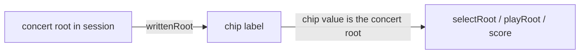

# PRD — Epic 1: Guess in your instrument's pitch

Feature: [briefing.md](../briefing.md) · [roadmap.md](../roadmap.md)

## Summary

A transpose pill in the header, beside share and the streak — tap to cycle
Concert, E♭ alto sax, B♭ tenor & trumpet — remembered across days. With alto sax chosen, the root chips read in
the sax player's pitch: the chip that says C plays the note an alto sax makes
when it fingers C, a concert E♭, and guessing C for a concert E♭ groove is
right. Inside, nothing moves. The session, the attempts, the scoring and the
narrowing keep working in concert pitch; a chip carries its concert value and
only wears a written label.

## Problem

Sam picks up the alto sax, hears the groove's home note, fingers it, and the
chip for that fingering says E♭. Today they must convert in their head at the
exact moment the puzzle is testing their ear — "being asked what they don't yet
know" is what loses them, and a transposition table is precisely that.

## Scope

- the transpose pill in the header, its label and its cycle
- one line in the how-to-play box saying what the pill does
- the preference behind it, stored like `simpleMode` and `tapSounds`
- root chips labelled in written pitch, valued in concert pitch
- the check button, the meta line and the solved heading in written pitch
- the reference note unchanged, so chip and sound agree
- the same behaviour on the shared-groove route

**Out of scope**
- **the staff, the lead sheet, the transport chord line, the concert line under
  the heading** — Epic 2
- **any change to sound** — the reference note, the mode lick and the groove
  are concert audio and stay so
- **stored attempts and results** — concert, unchanged
- **the share link** — a uuid, no pitch in it
- **the mode chips** — flavour names carry no pitch
- **other transpositions** — F horn, bass clef, octave instruments; three chips
  is the row

## Requirements

- **R1** — The header shows a transpose pill beside the share button and the
  streak badge, styled like them. It reads "Transpose" on Concert and the
  instrument name otherwise — "E♭ alto sax", "B♭ tenor & trumpet". One tap
  moves to the next state in the order Concert → E♭ alto sax → B♭ tenor &
  trumpet → Concert. It is present before the first guess, during the puzzle
  and after it, on the daily and the shared route, and is a button with an
  accessible name that says what it sets and what it is set to.
- **R2** — The selection is stored as a preference the moment it is made, in the
  same store as `simpleMode` and `tapSounds`, and comes back on the next visit.
  A player who never touches the pill is on Concert.
- **R3** — With storage unavailable or throwing, the pill still works for the
  session and nothing crashes; the choice is simply not remembered.
- **R4** — On Concert the app reads exactly as it does today, character for
  character.
- **R5** — On E♭ alto sax every root chip is labelled with the concert root
  raised a major sixth; on B♭ tenor & trumpet, a major second. Labels are spelt
  from the app's twelve root names, so concert C♯ reads B♭ on alto sax, not A♯.
- **R6** — The label is the only thing that changes about a chip. Its value
  stays the concert root: tapping it plays the same reference note as today,
  selecting it selects the same root, and Check compares the same concert pair.
  The chip an alto player reads as C therefore plays concert E♭, and is right
  for a concert E♭ groove.
- **R7** — Everything that names the selected or answered root to the player
  names it in written pitch: the Check button ("Check C Dorian"), the meta line
  under the groove name once solved or given up, and the solved heading.
- **R8** — Changing the instrument during a puzzle relabels every chip at once,
  including the selected one and the ones already ruled out, and no attempt is
  added, removed or re-scored. The narrowing, the eliminated count and the
  coaching line are what they were.
- **R9** — In Simple mode the six roots are chosen in concert pitch exactly as
  today, from the date and the answer, and only their labels transpose. Two
  players on the same puzzle see the same six roots whatever their instrument;
  the answer is among them as before.
- **R10** — Changing the instrument never counts as an action against the
  puzzle: it does not disarm, arm or reset a selection, and it does not touch
  `simpleMode` or `tapSounds`.
- **R11** — The root row carries no indication of the pitch it is written in.
  Its eyebrow reads "Root" on every instrument, there is no note under the
  chips, and the header pill is the only place the instrument is named. The guess card looks the same on alto sax as on Concert;
  only the letters on the chips differ.
- **R12** — The how-to-play box has one line under its four steps, beside the
  two-ways line, that names the pill and says what it does. Proposed text:
  *"Play a sax or a trumpet? Tap Transpose in the top row and the roots, chords
  and notes read in your instrument's pitch."* It is a paragraph, not a fifth
  list item, and it is the same text whichever instrument is set. It lives in
  `src/lib/snippets/en/intro.ts`.

## Behaviour details

One transposition, applied at the edge, in both directions:

The written label is a function of `(concert root, written key)` and nothing
else. For E♭ the offset is +9 semitones, for B♭ +2, for Concert 0, and the
result is spelt from `ROOTS`.

## Acceptance criteria

- **AC1** (R1) — Given any route and any puzzle state, when the page renders,
  then the header shows the transpose pill beside the share button and the
  streak badge, reading "Transpose" on Concert.
- **AC1b** (R1) — Given Concert, when the pill is tapped three times, then it
  reads "E♭ alto sax", then "B♭ tenor & trumpet", then "Transpose", and the
  root chip labels follow each state.
- **AC2** (R2) — Given alto sax was chosen, when the page is reloaded, then
  alto sax is selected and the chips read in alto pitch before any interaction.
- **AC3** (R2) — Given no stored preference, when the page renders, then
  Concert is selected.
- **AC4** (R3) — Given a preference store that throws on read and write, when
  the player picks alto sax, then the chips relabel and no error surfaces.
- **AC5** (R4) — Given Concert, when the guess card, meta line and solved
  heading render, then their text is identical to today's for the same session.
- **AC6** (R5) — For every concert root, the alto label is the root raised nine
  semitones and the tenor label the root raised two, each spelt from `ROOTS`;
  the concert label is the root itself.
- **AC7** (R6) — Given alto sax and a groove whose concert root is E♭, when the
  player taps the chip labelled C, then the reference note played is concert E♭
  — the same note tapping the E♭ chip plays on Concert.
- **AC8** (R6) — Given the same groove and mode, when the player selects the
  chip labelled C and the right mode and presses Check, then the puzzle is
  solved.
- **AC9** (R7) — Given that solve, then the Check button read "Check C
  <mode>", the meta line reads "C <mode>" and the solved heading reads "C
  <mode>"; switching to Concert changes all three to E♭ in place.
- **AC10** (R8) — Given two attempts made on Concert with roots ruled out, when
  the player switches to alto sax, then the attempt count, the ruled-out chip
  states and the coaching line are unchanged and every chip label is
  transposed, ruled-out ones included.
- **AC11** (R9) — Given Simple mode and alto sax, when the guess card renders,
  then six root chips show, their labels are the six concert roots transposed,
  and the answer's written label is among them.
- **AC12** (R10) — Given a selected root and mode, when the player switches
  instrument, then the selection stands and `simpleMode` and `tapSounds` are
  unchanged in the store.
- **AC13** (R11) — Given alto sax, when the guess card renders, then its
  eyebrows, headings and helper text are identical to the Concert rendering,
  and the only differences in the card's text are the root chip labels.
- **AC14** (R9) — Given Simple mode and the same date and groove, the six
  concert root values offered are identical on Concert, alto sax and tenor.
- **AC15** (R12) — Given the how-to-play box open, then the transpose line is
  visible, it contains the pill's resting label, and there are still exactly
  four list items.

## Dependencies

Hands to Epic 2, pinned first:

- `Written = 'C' | 'E♭' | 'B♭'` and `writtenRoot(root: Root, written: Written): Root`
  in `src/lib/theory/transpose.ts`
- `useWritten(): { written: Written; setWritten(w: Written): void; loaded: boolean }`
  in the puzzle module's hooks
- `written` on the puzzle session context, beside `simple` and `tapSounds`

Needs from today's code, unchanged: the root chips valued as `Root`, the
reference note keyed by concert `Root`, `guessCardView` as the one place the
root row is built.

## Assumptions

- Instrument names on the pill, not key letters: Sam knows what they play,
  not what key it is in. The key stays in the label as a prefix — "E♭ alto sax"
  — so the vocabulary arrives with the thing it names. On Concert the pill says
  "Transpose", not "Concert": the first tells a sax player what it is for, the
  second tells a guitar player nothing.
- A cycling pill rather than a menu: three states, one tap forward, and no
  popover primitive to add to the design system. The setting is made once.
- The pill is the design system's `Pill` made pressable, or a sibling primitive
  beside `InlineButton`; either way prop-driven and domain-free, tested against
  its own contract.
- A per-option label is added to the design system's `ChipGroup` so a root chip
  can show one string and report another. Prop-driven, no domain knowledge.
- The pill is not disabled when the puzzle is over; the reveal in Epic 2
  depends on switching it afterwards.
- The offset is applied to pitch class only. Register, octave and clef are
  Epic 2's concern and even there nothing moves.

## Question log

### Cycle 1 — 2026-09-04

**Q1. Does the root row itself say which pitch it is in?**
Answer: **A) No; the "Written for" row in the groove card is the only
indication** — the briefing says the guess boxes look exactly the same, and the
labels are what Sam fingers, so there is nothing on the row to explain.
Applied to: R11, AC13, Assumptions

**Q2. In Simple mode, are the six roots chosen in concert or in written pitch?**
Answer: **A) In concert, as today; only the labels transpose** — concert inside,
written at the edges; two players on the same puzzle keep the same six roots.
Applied to: R9, AC14

### Cycle 2 — 2026-09-04

**Where does the control live, and what does it say on Concert?** (asked in
chat, after the roadmap had put a chip row in the groove card)
Answer: **a pill in the header beside share and the streak, styled like them,
tapping cycles the three states; it reads "Transpose" on Concert** — a setting
made once belongs with the per-player things, the groove card stays play button
and chords, and "Transpose" is what tells a sax player the pill is for them.
Applied to: Summary, Scope, R1, R2, R3, R11, AC1, AC1b, Assumptions

### Cycle 3 — 2026-09-04

**Does the how-to-play box mention the pill?** (asked in chat)
Answer: **yes, one line under the four steps, the way it names Simple mode** —
"Transpose" as the resting label says what the pill is for; the line says what
it does.
Applied to: Scope, R12, AC15
