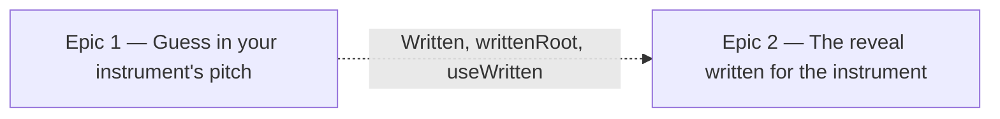

# Roadmap — Transpose for the sax

Source: [briefing.md](briefing.md)

## Overview

A transpose pill in the header, beside share and the streak, cycles Concert, E♭
alto sax and B♭ tenor & trumpet, and the whole puzzle reads in that instrument's written pitch: the
root chips, the check, the nudges, the heading, the lead sheet, the staff and
the chord line over the running groove. The audio and the share link stay in
concert pitch. Inside, nothing moves: the session, the stored attempts, the
scoring and the narrowing keep working in concert pitch, and the transposition
happens once at the edge where a root is shown or read. That is what makes the
reference note and the audio module fall out untouched — a chip keeps its
concert value and only its label changes — and what lets Sam switch instrument
halfway through a day without corrupting the attempts already made.

The guessing comes first, because that is where the wrong pitch hurts a sax
player most: they hear the groove's root, finger it, and today must name a note
they never fingered. The reveal follows.

## Epics

### Epic 1 — Guess in your instrument's pitch

**Visible when done:** Sam taps the header pill reading "Transpose" once; it now
reads "E♭ alto sax", and for a groove whose concert root is E♭ the root row
shows the same twelve chips as before. Tapping C plays
the groove's root. Sam guesses C Dorian, is told it's right, and the heading
says C Dorian. Tomorrow the pill still says alto sax.
**Depends on:** none
**Parallel with:** Epic 2, against the contract below

**Scope**
- `src/lib/theory/transpose.ts` — `Written = 'C' | 'E♭' | 'B♭'`, `writtenRoot(root, written)` and `concertRoot(written root, written)`: a major sixth up for E♭, a major second up for B♭, spelt from `ROOTS`; both are the identity for `'C'`
- `lib/persistence/preferences.ts` — `written?: Written`, default `'C'`, read with the same tolerance as `simpleMode`
- `hooks/useWritten.ts` — the `useTapSounds` shape over that field
- the transpose pill in the header, beside `ShareGroove` and `StreakBadge` and styled like them: a `Pill` that is a button, reading "Transpose" on Concert and the instrument name otherwise, one tap cycling Concert → E♭ alto sax → B♭ tenor & trumpet → Concert; on the page all day in every state
- one line in the how-to-play box under the four steps, beside the two-ways line, saying what the pill does — a paragraph, not a fifth step
- `lib/presentation` — `guessCardView` takes `written`; each root option carries its concert value and its written label, so `selectRoot`, `onHearRoot`, scoring and narrowing see concert roots as today
- `ChipGroup` learns an optional per-option label, so a chip can show one string and report another
- `metaLine` and the solved heading show the written root
- `GroovePuzzle` owns the hook and passes it down

**Out of scope**
- the staff, the lead sheet and the transport chord line — Epic 2. Until it lands, an alto player sees a written heading over a concert staff; the two epics are meant to ship in the same wave
- any change to what the reference note, the mode lick or the groove sound like — they are concert by construction and stay so
- stored attempts and results — concert, unchanged, so a switch mid-day or a change of instrument next month leaves history intact
- the share link — a uuid, no pitch in it

**Validation**
- The transpose pill sits in the header before, during and after the puzzle, on the daily and the shared route, and reads "Transpose" until an instrument is chosen
- Open how to play: a line names Transpose and what it does; still four steps
- Pick alto sax, play a concert E♭ groove: chip C plays the groove's root; guess C + the right mode: solved; heading says C. Switch to Concert: the same solved session reads E♭ everywhere. Reload: alto sax still chosen.
- Simple mode with alto sax: six chips, labelled in written pitch, the answer among them
- `transpose.test.ts`: every root × the three keys, spelt from `ROOTS`; `concertRoot(writtenRoot(r))` is `r`
- `preferences.test.ts`: round-trip, unknown value falls back to `'C'`
- `useWritten.test.ts`: loads, sets, survives a throwing store
- `ChipGroup.test.tsx`: a labelled option shows the label and reports the value
- `presentation/index.test.ts`: written labels, concert values, narrowing unaffected by `written`
- `GroovePuzzle.guessing.test.tsx`: the flow above, plus a mid-day switch that keeps the attempts

### Epic 2 — The reveal written for the instrument

**Visible when done:** with alto sax chosen, a concert E♭ Dorian answer reads
C Dorian in the heading, the staff shows C D E♭ F G A B♭, the lead sheet reads
Cm7 · E♭maj7 · F7 · Cm7 where concert was E♭m7 · G♭maj7 · A♭7 · E♭m7, and the
chord line over the running groove reads the same. A muted line under the
heading says "E♭ Dorian in concert pitch".
**Depends on:** Epic 1's contract — `Written`, `writtenRoot`, `useWritten`
**Parallel with:** Epic 1

**Scope**
- `src/lib/theory/transpose.ts` — `writtenAnswer(answer, written)` and `writtenChord(symbol, written)`: split the leading root (letter plus optional ♯/♭) from the suffix, shift the root, keep the suffix; the scale is re-spelt by `scaleNotes`
- `SolvedPanel` takes `written`: staff and its accessible label from the written answer; `LeadSheet` gets written chords, numerals unchanged; a muted line under the heading with the concert name, shown only when Concert is not selected
- `GroovePuzzle` hands `TransportPanel` written chords once solved or revealed

**Out of scope**
- transposing audio, tempo or anything heard
- a second transpose control in the solved box or the groove card; one setting, one pill, in the header

**Validation**
- Solve on alto sax: staff, lead sheet and transport chord line agree; switch to Concert: all three revert together
- `transpose.test.ts`: every chord symbol in `grooves.generated.ts` round-trips through `'C'` and re-spells under `'E♭'` and `'B♭'` with its suffix intact; `writtenAnswer` respells every root × flavour without a double accidental
- `SolvedPanel.test.tsx`: staff label and chords follow `written`; the concert line is present on alto sax and absent on Concert
- `GroovePuzzle.sounding.test.tsx`: the transport chord line matches the lead sheet for each selection

## Dependency map

## Execution waves

- **Wave 1 (parallel):** Epic 1, Epic 2 — Epic 2 builds against the `Written` type and the hook signature, pinned first thing in Epic 1

## Assumptions

- Concert inside, written at the edges. Attempts, results, scoring, narrowing, simple-mode root selection and every sound stay in concert pitch; only labels and the reveal are transposed. It is the only shape under which switching instrument never rewrites history.
- The pill names the instrument ("E♭ alto sax", "B♭ tenor & trumpet"), not the key alone. `docs/persona.md`: "being asked what they don't yet know" loses Sam; the instrument is what they know. On Concert it reads "Transpose" rather than "Concert", because "Concert" tells a guitar player nothing and "Transpose" tells a sax player what the pill is for.
- A cycling pill, not a menu: three states, one tap forward, no popover primitive to add to the design system. The setting is made once, so two taps to go back is fine.
- Default is Concert. Guitar is Sam's first instrument and it reads concert.
- Written roots are spelt from `ROOTS`, so concert C♯ on alto is written B♭, not A♯; the scale is then spelt by `scaleNotes` as for any root.
- The staff keeps its register: written notes are placed by `staffNotes` exactly as concert notes are.
- The setting applies on the shared-groove route as well; it is a preference, not a per-groove choice.
- The transport chord line keeps appearing only once solved or revealed, as today.
- The concert line is a `solved` snippet; the heading itself stays a single name.
- The nudge copy that names a root ("not C", "it's one of these") names the written root, since it comes out of `guessCardView` with everything else.
