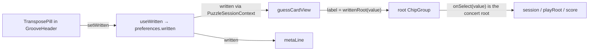

# Tech spec — Epic 1: Guess in your instrument's pitch

PRD: [../prd/epic-1-guess-in-your-instruments-pitch.md](../prd/epic-1-guess-in-your-instruments-pitch.md) ·
Roadmap: [../roadmap.md](../roadmap.md)

## Approach

Concert inside, written at the edges. Nothing that holds, stores, scores or
sounds a root changes: the session, the attempts, the narrowing, simple mode's
six roots and every audio path keep working in concert `Root`. One pure
function, `writtenRoot(root, written)` in `src/lib/theory/transpose.ts`, is
applied exactly where a root is *shown* — the chip label, the Check label, the
meta line, the solved heading — and nowhere else. A chip keeps its concert value
and only wears a written label, which is why tapping the chip an alto player
reads as C plays concert E♭ and why switching instrument mid-day rewrites no
history.

The setting is a transpose pill in the header beside share and the streak,
cycling Concert → E♭ alto sax → B♭ tenor & trumpet, stored as `written` in the
preference store beside `simpleMode` and `tapSounds`, and carried by a
`useWritten` hook with `useTapSounds`'s shape. The composer holds the hook and
hands `written` down through the session context; `guessCardView` in the
coaching door is the one place the root row is built, so it is the one place
the labels are transposed. Two design-system additions, both prop-driven and
domain-free: `ChipGroup` learns an optional per-option label, and a pressable
`PillButton` joins `controls/` so the header pill can look like the streak
`Pill` without making a display primitive clickable.

## Architecture

The three frozen exports Epic 2 builds against — `Written`, `writtenRoot`,
`useWritten` — land in Wave 1 and Wave 2 and never change shape afterwards.

- **Theory (`src/lib/theory/transpose.ts`).** `Written`, `WRITTEN`,
  `writtenRoot`, `concertRoot`. Pitch class only: `noteName(pitchClassOf(root) + offset)`
  with offsets `{ C: 0, 'E♭': 9, 'B♭': 2 }`, so every result is spelt from
  `ROOTS` and concert C♯ reads B♭ on alto, not A♯. Imports `./roots` and the
  `Root` type from `../groove`, nothing else; `src/lib/leaf.test.ts` and the
  sibling guard in the slice's `structure.test.ts` hold it to the leaf. It is
  the seventeenth theory module; the counts in `docs/architecture.md` and
  `docs/coding-guidelines.md` move with it.
- **Puzzle module.** `lib/persistence/preferences.ts` gains `written?: Written`
  with `simpleMode`'s tolerance: kept when it is one of `WRITTEN`, absent
  otherwise. `hooks/useWritten.ts` is `useTapSounds` over that field with a
  `'C'` default and one addition — a store whose `get()` rejects still flips
  `loaded`, because the composer gates the page on it. `state/PuzzleSessionContext.tsx`
  carries `written`/`setWritten` beside `simple` and `tapSounds`. New arrow on
  the map: **puzzle → theory** gains `lib/persistence/preferences.ts` and
  `hooks/useWritten.ts` (already a drawn arrow; two more files behind it).
- **Coaching (`lib/presentation/`).** `guessCardView` takes `written`
  (default `'C'`), every `OptionView` gains a `label`, root labels are
  `writtenRoot(value, written)`, flavour labels are the value, and the Check
  label names the written root. `metaLine` takes `written` as a fourth
  argument, default `'C'`. Narrowing, confirmation, selection, hint and
  enablement read only concert values and are untouched. The door's runtime
  export list stays `['guessCardView', 'metaLine']`. **coaching → theory**
  gains `index.ts` and `date.ts` reaching `transpose`.
- **Design system.** `controls/ChipGroup.tsx` gains `optionLabels?: Record<string, string>`:
  the shown text and the accessible name come from the label, `onSelect`,
  `onPress`, `value` and `optionStates` stay keyed by the value. New
  `controls/PillButton.tsx`: a `<button>` with `display/Pill`'s silhouette and
  `InlineButton`'s press contract. `display/Pill` stays read-only, so
  `display/`'s one-line test still holds. Neither imports snippets or a feature.
- **Shell.** `components/header/TransposePill.tsx` renders a `PillButton`
  reading `header.transpose` on Concert and `header.instruments[written]`
  otherwise, accessible name `header.transposeName({ instrument })`, one press
  advancing along `WRITTEN`. `GrooveHeader` gains a second slot, `transpose`,
  rendered beside `share` and the streak badge and knowing nothing about pitch.
  `GroovePuzzle.tsx` calls `useWritten()`, gates on its `loaded` alongside
  `hydrated` and `modeLoaded`, provides `written`/`setWritten` in the session
  value, passes the pill into the header and `written` into `metaLine`. `GuessCard` reads `written` from the context, hands it to
  `guessCardView`, and passes the view's labels to the root `ChipGroup`.
  `SolvedPanel` is Epic 2's file: heading, staff, lead sheet and concert line
  are all made written there, on a `written` prop Epic 2's composer step sets.
- **Words.** `HeaderSnippets` gains `transpose`, `transposeName` and
  `instruments` with literal keys `C`, `E♭`, `B♭` — the snippets module may not
  import theory (sibling guard), so the keys are data that happen to match
  `Written`, and TypeScript checks the pairing at the call site.
  `IntroSnippets` gains `transpose`, the one sentence the how-to-play box says
  about the pill; it contains `header.transpose` so the box names the control
  by its resting label.
- **Intro.** `components/intro/HowToPlay.tsx` renders `intro.transpose` as a
  second muted `Text` paragraph after `intro.twoWays`, under the `<ol>` — the
  shape F22 E2 used for the two-ways line. Static text, whatever instrument is
  set; the list stays four items.
- **Nothing renders in the groove card** beyond what is there today. Cycle 2 of
  the PRD moved the control from a chip row under the transport panel to the
  header; no `WrittenFor` component exists.



## Contracts

```ts
// src/lib/theory/transpose.ts — frozen; Epic 2 builds against Written and writtenRoot
import type { Root } from '../groove'

export type Written = 'C' | 'E♭' | 'B♭'
export const WRITTEN: readonly Written[] = ['C', 'E♭', 'B♭']        // the pill's cycle order
export function writtenRoot(root: Root, written: Written): Root       // +0 / +9 / +2 semitones, spelt by noteName
export function concertRoot(root: Root, written: Written): Root       // inverse: concertRoot(writtenRoot(r, w), w) === r
```

```ts
// src/features/daily-groove/lib/persistence/preferences.ts
export type Preferences = {
  simpleMode?: boolean
  tapSounds: boolean
  written?: Written          // absent when never stored or not one of WRITTEN — simpleMode's tolerance
}
```

```ts
// src/features/daily-groove/hooks/useWritten.ts — frozen; the useTapSounds shape
export type UseWritten = {
  written: Written           // 'C' until the store answers
  setWritten: (written: Written) => void
  loaded: boolean            // true once get() has settled — resolved OR rejected
}
export function useWritten(store: PreferenceStore = defaultStore): UseWritten
```

```ts
// src/features/daily-groove/state/PuzzleSessionContext.tsx — frozen
export type PuzzleSessionValue = {
  groove: Groove; today: Date; session: UsePuzzleSession
  simple: boolean; setSimple(simple: boolean): void
  tapSounds: boolean; setTapSounds(on: boolean): void
  written: Written; setWritten(written: Written): void      // new
}
```

```ts
// src/features/daily-groove/lib/presentation/index.ts
export type OptionView<T extends string = string> = {
  value: T                   // the concert root / the flavour — what onSelect, onHear and scoring see
  label: string              // what the chip shows: writtenRoot(value, written) for roots, the value for flavours
  state: OptionState
}
export type GuessCardViewInput = { /* …as today… */ written?: Written }   // default 'C'
// check.label: coaching.checkPair({ root: writtenRoot(selectedRoot, written), flavour })

// src/features/daily-groove/lib/presentation/date.ts
export function metaLine(groove: Groove, date: Date | null, answer?: Answer | null, written?: Written): string
//   answer named as `${writtenRoot(answer.root, written ?? 'C')} ${answer.flavour}`
```

```ts
// src/components/controls/ChipGroup.tsx — one new prop, additive
type ChipGroupProps = {
  /* …as today… */
  optionLabels?: Record<string, string>   // value → shown text; missing → the value
}
// Rendering contract: chip text and accessible name are the label (adornment still aria-hidden before it);
// onSelect / onPress report the VALUE; `value` and `optionStates` are matched by VALUE; layout classes unchanged.
```

```ts
// src/components/controls/PillButton.tsx — new
type PillButtonProps = {
  children: ReactNode
  onPress: () => void
  label?: string             // accessible name when given; children otherwise (InlineButton's contract)
  disabled?: boolean
}
// <button type="button">; classes include Pill's silhouette — rounded-full border border-border-strong
// bg-surface px-4 py-2 text-[14px] text-text — plus hover:bg-surface-inset and the focus-visible outline.
```

```ts
// src/lib/snippets/types.ts — frozen key names; no import from theory
export type HeaderSnippets = {
  /* …existing keys unchanged… */
  transpose: string                                          // the pill's text on Concert
  transposeName: (args: { instrument: string }) => string    // the pill's accessible name
  instruments: { C: string; 'E♭': string; 'B♭': string }     // pill text off Concert; the name's argument always
}
// src/lib/snippets/en/header.ts — the settled wording (PRD R1)
header.transpose      === 'Transpose'
header.instruments    === { C: 'Concert', 'E♭': 'E♭ alto sax', 'B♭': 'B♭ tenor & trumpet' }
header.transposeName({ instrument }) === `Transpose: ${instrument}`     // visible text is always inside the name

export type IntroSnippets = {
  /* …existing keys unchanged; steps stays a 4-tuple… */
  transpose: string                                          // new — the how-to-play line about the pill
}
// src/lib/snippets/en/intro.ts — the settled wording (PRD R12)
intro.transpose === "Play a sax or a trumpet? Tap Transpose in the top row and the roots, chords and notes read in your instrument's pitch."
// contains header.transpose verbatim (AC15)
```

```tsx
// src/features/daily-groove/components/header/TransposePill.tsx — new
type TransposePillProps = { written: Written; onChange(written: Written): void }
// text: written === 'C' ? header.transpose : header.instruments[written]
// label: header.transposeName({ instrument: header.instruments[written] })
// onPress: onChange(WRITTEN[(WRITTEN.indexOf(written) + 1) % WRITTEN.length])

// src/features/daily-groove/components/header/GrooveHeader.tsx — one new slot
type GrooveHeaderProps = { streak: number; onShowHelp: (() => void) | null; share?: ReactNode; transpose?: ReactNode }
// rendered in the right-hand `Row gap="sm"` in the order share · transpose · StreakBadge; with neither slot the badge renders bare, as today

// src/features/daily-groove/components/solved/SolvedPanel.tsx — Epic 2's file, not edited here
// Epic 2 adds `written: Written` (required) and renders heading, staff, label, lead sheet and
// concert line from it; Epic 2's Track E passes `written={written}` from the composer.
```

Test commands: `npm test` for every track. No track owns a generator file.

## Tracks

### Track A — The transposition

- **Goal** — `transpose.ts` exists with the four frozen exports, proven for
  every root × three keys, and the two docs count seventeen theory modules.
- **Owns** — `src/lib/theory/transpose.ts`, `src/lib/theory/transpose.test.ts`,
  `docs/architecture.md`, `docs/coding-guidelines.md`
- **Role** — `implementer`
- **Depends on** — nothing
- **Parallel with** — Tracks B, C
- **Done when** — `transpose.test.ts` green; `src/lib/leaf.test.ts`,
  `src/lib/theory/*.test.ts` and the slice's `structure.test.ts` (siblings
  guard) still green.

### Track B — Two primitives

- **Goal** — `ChipGroup` shows one string and reports another per option;
  `PillButton` is a pressable pill with `Pill`'s silhouette; both tested against
  their own contract and domain-free.
- **Owns** — `src/components/controls/ChipGroup.tsx`,
  `src/components/controls/ChipGroup.test.tsx`,
  `src/components/controls/PillButton.tsx`,
  `src/components/controls/PillButton.test.tsx`,
  `src/components/structure.test.ts`
- **Role** — `implementer`
- **Depends on** — the two contracts only
- **Parallel with** — Tracks A, C
- **Done when** — both component test files green;
  `src/components/structure.test.ts` green (controls list gains `PillButton`,
  no snippet import, no feature import); `GuessCard.test.tsx` and every
  `GroovePuzzle.*.test.tsx` still green with no consumer changed.

### Track C — The words

- **Goal** — the three header keys and the intro line exist with their types,
  worded as pinned, and nothing under `src/lib/snippets/` names theory.
- **Owns** — `src/lib/snippets/types.ts`, `src/lib/snippets/en/header.ts`,
  `src/lib/snippets/en/intro.ts`, `src/lib/snippets/snippets.test.ts`
- **Role** — `implementer`
- **Depends on** — nothing
- **Parallel with** — Tracks A, B
- **Done when** — `snippets.test.ts` green; `structure.test.ts` siblings case
  green.

### Track D — The preference, the hook, and where the composer holds it

- **Goal** — `written` round-trips through the store with `simpleMode`'s
  tolerance, `useWritten` exposes the frozen shape, the session context carries
  it, and `GroovePuzzle` calls the hook, gates on its `loaded` and provides the
  value — without yet rendering anything new.
- **Owns** — `src/features/daily-groove/lib/persistence/preferences.ts`,
  `…/lib/persistence/preferences.test.ts`, `…/hooks/useWritten.ts`,
  `…/hooks/useWritten.test.ts`, `…/state/PuzzleSessionContext.tsx`,
  `…/state/PuzzleSessionContext.test.tsx`, and in this wave
  `…/components/GroovePuzzle.tsx` (the hook call, the gate, the two session
  fields — nothing else)
- **Role** — `implementer`
- **Depends on** — Track A (`Written`, `WRITTEN`)
- **Parallel with** — Tracks E, G
- **Done when** — the three unit test files green; `npx tsc --noEmit` clean
  (the context's new required fields are provided by the composer in the same
  step); every `GroovePuzzle.*.test.tsx` still green.
- **Shared with Track F** — `components/GroovePuzzle.tsx`, in different waves.
  D edits the hook block at the top of `GroovePuzzleView`, the loading gate and
  the `sessionValue` memo; F edits the JSX (`GrooveHeader`, `metaLine`). Wave order settles it; F rebases onto D.

### Track E — Coaching names the written root

- **Goal** — `guessCardView` and `metaLine` take `written`; labels transpose,
  values do not; narrowing, states and selection are provably indifferent to
  `written`.
- **Owns** — `src/features/daily-groove/lib/presentation/index.ts`,
  `…/lib/presentation/index.test.ts`, `…/lib/presentation/date.ts`,
  `…/lib/presentation/date.test.ts`
- **Role** — `implementer`
- **Depends on** — Track A (`writtenRoot`, `Written`)
- **Parallel with** — Tracks D, G
- **Done when** — both test files green; the door guards in `index.test.ts`
  (`['guessCardView', 'metaLine']`, no re-export of a coaching module) and the
  slice `structure.test.ts` "coaching door is narrow" cases green;
  `GuessCard.test.tsx` and `GroovePuzzle.*.test.tsx` still green with
  `written` defaulting to `'C'`.

### Track G — The pill, its slot, and the line that explains it

- **Goal** — `TransposePill` renders the right text and name for each state
  and cycles on press; `GrooveHeader` takes a `transpose` slot beside `share`
  and the streak; the how-to-play box says what the pill does; the region list
  knows the new component.
- **Owns** — `src/features/daily-groove/components/header/TransposePill.tsx`,
  `…/components/header/TransposePill.test.tsx`,
  `…/components/header/GrooveHeader.tsx`,
  `…/components/header/GrooveHeader.test.tsx`,
  `…/components/intro/HowToPlay.tsx`, `…/components/intro/HowToPlay.test.tsx`,
  `src/features/daily-groove/structure.test.ts` (this wave: `REGIONS.header`)
- **Role** — `implementer`
- **Depends on** — Track A (`WRITTEN`, `Written`), Track B (`PillButton`),
  Track C (`header.transpose`, `header.instruments`, `header.transposeName`,
  `intro.transpose`)
- **Parallel with** — Tracks D, E
- **Done when** — the header and intro test files green; slice
  `structure.test.ts` green; `GroovePuzzle.header.test.tsx` and
  `GroovePuzzle.intro.test.tsx` still green (the composer passes no slot yet,
  so the header renders as today; the intro box has one more paragraph).
- **Shared with Track F** — `structure.test.ts`, in different waves: G adds
  `TransposePill` to `REGIONS.header`; F adds
  `GroovePuzzle.written.test.tsx` to `composedTests`. Different lines; F
  rebases onto G.

### Track F — The shell reads written

- **Goal** — the pill is in the header on every route and in every state; the
  root chips, Check, meta line and solved heading follow it; the whole flow is
  proven through the composed page.
- **Owns** — `src/features/daily-groove/components/GroovePuzzle.tsx` (this
  wave: the JSX), `…/components/puzzle/GuessCard.tsx`,
  `…/components/GroovePuzzle.written.test.tsx` (new),
  `src/features/daily-groove/structure.test.ts` (this wave: `composedTests`)
- **Role** — `implementer`
- **Depends on** — Tracks D, E, G (and through them A, B, C)
- **Parallel with** — nothing; it is the only Wave 3 track
- **Done when** — `GroovePuzzle.written.test.tsx` green; every existing `GroovePuzzle.*.test.tsx`, `GuessCard.test.tsx`,
  `GrooveHeader.test.tsx` and both structure tests green — the existing suite
  runs on Concert and is the AC5 regression.
- **Shared with Epic 2** — `components/GroovePuzzle.tsx` only. This epic
  edits the hook wiring, the session value, the `GrooveHeader` props and the
  `metaLine` call; Epic 2's Track E adds one theory import, the `TransportPanel`
  `chords=` map and `written={written}` on `SolvedPanel`. Whichever lands
  second rebases; the `written` identifier is fixed here.
  `components/solved/SolvedPanel.tsx` and its test are **Epic 2's entirely**:
  the solved heading in written pitch — R7's heading half, AC9's heading clause
  — is made there (Epic 2 step D3) and asserted through the composed page there
  (Epic 2 Track E). This epic writes no line in the solved region.

## Execution waves

- **Wave 1 (parallel):** Track A (theory), Track B (primitives), Track C
  (words) — three leaves, no shared file, nothing app-side changes.
- **Wave 2 (parallel):** Track D (preference, hook, context, composer wiring),
  Track E (coaching), Track G (pill and slot) — each needs a Wave 1 file;
  none needs another Wave 2 track. The tree stays green throughout because
  `written` defaults to `'C'` in coaching and the composer provides the
  context's new fields in the same step that requires them.
- **Wave 3:** Track F — needs D's provided `written`, E's labels and G's pill
  and slot.
- **Wave 4:** Integration — `npm test`, `npm run lint`, `npx tsc --noEmit`,
  `npm run build`; demo: pick alto, play a concert E♭ groove, tap the chip
  labelled C, hear the groove's root, guess C + the mode, read C in Check,
  meta and heading, tap the pill twice back to Concert and read E♭ in all
  three, reload and find alto still chosen.

Why D holds three lines of the composer rather than F: the context's new
fields are required, so the moment D lands them `GroovePuzzle.tsx` fails
typecheck unless it provides them. Letting D write the hook call keeps every
wave green; F22 Epic 1 split the same file the same way.

## Implementation

### Track A — The transposition

#### Step A1 — Every root, every key, spelt from ROOTS

Covers: R5, AC6

- **Test first** — `src/lib/theory/transpose.test.ts`:
  ```ts
  import { describe, expect, it } from 'vitest'
  import { ROOTS, pitchClassOf } from './roots'
  import { WRITTEN, concertRoot, writtenRoot, type Written } from './transpose'

  const OFFSET: Record<Written, number> = { C: 0, 'E♭': 9, 'B♭': 2 }
  const up = (from: string, to: string) =>
    (pitchClassOf(to as never) - pitchClassOf(from as never) + 12) % 12

  describe('writtenRoot', () => {
    it('lists the three keys in the pill’s order (F23 E1 R1)', () => {
      expect(WRITTEN).toEqual(['C', 'E♭', 'B♭'])
    })
    it.each(WRITTEN)('raises every root by the %s offset and spells it from ROOTS (F23 E1 R5, AC6)', (written) => {
      for (const root of ROOTS) {
        const out = writtenRoot(root, written)
        expect(ROOTS).toContain(out)
        expect(up(root, out)).toBe(OFFSET[written])
      }
    })
    it('is the identity on concert (F23 E1 R4, AC6)', () => {
      for (const root of ROOTS) expect(writtenRoot(root, 'C')).toBe(root)
    })
    it('spells with flats where ROOTS does: concert C♯ is B♭ on alto, concert E♭ is C on alto and F on tenor (F23 E1 R5)', () => {
      expect(writtenRoot('C♯', 'E♭')).toBe('B♭')
      expect(writtenRoot('E♭', 'E♭')).toBe('C')
      expect(writtenRoot('E♭', 'B♭')).toBe('F')
    })
  })
  ```
  Run it: fails with `Error: Failed to resolve import "./transpose" from "src/lib/theory/transpose.test.ts". Does the file exist?`
- **Implement** — `src/lib/theory/transpose.ts`:
  ```ts
  import type { Root } from '../groove'
  import { noteName, pitchClassOf } from './roots'

  export type Written = 'C' | 'E♭' | 'B♭'
  export const WRITTEN: readonly Written[] = ['C', 'E♭', 'B♭']
  const OFFSET: Record<Written, number> = { C: 0, 'E♭': 9, 'B♭': 2 }

  export function writtenRoot(root: Root, written: Written): Root {
    return noteName(pitchClassOf(root) + OFFSET[written])
  }
  export function concertRoot(root: Root, written: Written): Root {
    return noteName(pitchClassOf(root) - OFFSET[written])
  }
  ```
  `noteName` already normalises negative and over-range pitch classes. No
  `.ts` extension on the import: only generator-imported theory files carry
  one, and nothing under `scripts/` imports this module.
- **Green when** — passes; `src/lib/leaf.test.ts` (no `@/` specifier) and the
  slice `structure.test.ts` "snippets and theory are siblings" case pass.
- **Refactor** — none.

#### Step A2 — The inverse gets you home

Covers: R6 (the chip's value is recoverable from its label), roadmap validation

- **Test first** — same file:
  ```ts
  describe('concertRoot', () => {
    it.each(WRITTEN)('undoes writtenRoot for every root under %s', (written) => {
      for (const root of ROOTS) expect(concertRoot(writtenRoot(root, written), written)).toBe(root)
    })
  })
  ```
  Written alongside A1 and run before A1's implementation: same missing-module
  failure. Run after a `writtenRoot`-only implementation it fails with
  `TypeError: concertRoot is not a function`.
- **Implement** — in A1's module.
- **Green when** — passes.
- **Refactor** — none.

#### Step A3 — The docs count eighteen

Covers: nothing in the PRD; keeps the map honest (architecture.md: "a map that
has drifted from the import graph is worse than no map")

- **No test** — a documentation count.
- **Implement** — the feature adds two theory modules, this epic's
  `transpose.ts` and Epic 2's `written.ts`, and this is the one step that
  counts them, so it counts both. `docs/architecture.md` line 62: "sixteen
  modules" → "eighteen modules". `docs/coding-guidelines.md` line 345 "the
  sixteen modules of `theory/`" → eighteen; line 372 "all sixteen live here" →
  eighteen; line 391 "thirteen of the sixteen under `theory/`" → "fifteen of
  the eighteen". In `docs/architecture.md`'s arrow list, add
  `transpose` to the **coaching → theory** line (`index.ts` and `date.ts`
  reach it) and `lib/persistence/preferences.ts` and `hooks/useWritten.ts` to
  the **puzzle → theory** line. Numbers are as of 2026-09-04; locate by the
  phrase, not the line.
- **Green when** — `npm test` unchanged (no test reads these counts).

### Track B — Two primitives

#### Step B1 — A labelled option shows the label and reports the value

Covers: R6, AC6

- **Test first** — `src/components/controls/ChipGroup.test.tsx`, new
  `describe('per-option labels (F23 E1)')`:
  ```ts
  it('shows the label and reports the value beneath it (F23 E1 R6)', async () => {
    const user = userEvent.setup()
    const onSelect = vi.fn()
    const onPress = vi.fn()
    renderGroup({ onSelect, onPress, value: 'Two', optionLabels: { One: 'Uno', Two: 'Dos' } })

    expect([...chipList().querySelectorAll('button')].map((chip) => chip.textContent)).toEqual(['Uno', 'Dos', 'Three'])
    expect(screen.getByRole('button', { name: 'Dos' })).toHaveAttribute('aria-pressed', 'true')
    expect(screen.queryByRole('button', { name: 'Two' })).toBeNull()

    await user.click(screen.getByRole('button', { name: 'Uno' }))
    expect(onSelect).toHaveBeenCalledWith('One')
    expect(onPress).toHaveBeenCalledWith('One')
  })
  ```
  Run it: fails with `expected [ 'One', 'Two', 'Three' ] to deeply equal [ 'Uno', 'Dos', 'Three' ]`
  (the unknown prop is dropped; `tsc` also reports
  `Object literal may only specify known properties, and 'optionLabels' does not exist`).
- **Implement** — `ChipGroup.tsx`: add `optionLabels?: Record<string, string>`
  to the props and the destructure; in the map,
  `label={optionLabels?.[option] ?? option}`. `key`, `selected`, `unavailable`,
  `onSelect`, `onPress` keep using `option`.
- **Green when** — passes; every existing `ChipGroup.test.tsx` case passes
  unchanged (`optionLabels` absent ⇒ label is the value).
- **Refactor** — none.

#### Step B2 — A state and a label address the same value; the adornment still leads

Covers: R6, R8

- **Test first** — same describe:
  ```ts
  it('keys per-option state by the value while showing the label, and keeps the adornment in front (F23 E1 R6, R8)', async () => {
    const user = userEvent.setup()
    const onSelect = vi.fn()
    const onPress = vi.fn()
    renderGroup({
      onSelect, onPress, adornment: NOTE,
      optionLabels: { Two: 'Dos' },
      optionStates: { Two: { unavailable: true } },
    })
    const dos = screen.getByRole('button', { name: 'Dos' })
    expect(dos).toHaveAttribute('aria-disabled', 'true')
    expect(dos.textContent).toBe(`${NOTE}Dos`)

    await user.click(dos)
    expect(onPress).toHaveBeenCalledWith('Two')
    expect(onSelect).not.toHaveBeenCalled()
  })
  it('changes no layout class when labels are given (F23 E1 R11)', () => {
    const plain = renderGroup()
    const before = chipList().className
    cleanup()
    renderGroup({ optionLabels: { One: 'Uno' } })
    expect(chipList().className).toBe(before)
    void plain
  })
  ```
  Run it before B1: fails with
  `Unable to find an accessible element with the role "button" and name "Dos"`.
  After B1 it is green — write both in the same sitting so the red is seen
  once; the step exists to pin that labels never touch keying or layout.
- **Implement** — covered by B1.
- **Green when** — passes.
- **Refactor** — none.

#### Step B3 — A pressable pill

Covers: R1, AC1

- **Test first** — `src/components/controls/PillButton.test.tsx`:
  ```ts
  import { describe, expect, it, vi } from 'vitest'
  import { render, screen } from '@testing-library/react'
  import userEvent from '@testing-library/user-event'
  import { PillButton } from './PillButton'

  describe('PillButton', () => {
    it('is a button named by its children (F23 E1 R1, AC1)', () => {
      render(<PillButton onPress={() => {}}>12 days</PillButton>)
      const button = screen.getByRole('button', { name: '12 days' })
      expect(button).toHaveAttribute('type', 'button')
      expect(button).not.toHaveAttribute('aria-label')
    })
    it('takes its accessible name from label while keeping its visible text (F23 E1 R1)', () => {
      render(<PillButton label="Streak: 12 days" onPress={() => {}}>12 days</PillButton>)
      const button = screen.getByRole('button')
      expect(button).toHaveAccessibleName('Streak: 12 days')
      expect(button).toHaveTextContent('12 days')
    })
    it('calls onPress once per click and once per Enter (F23 E1 R1)', async () => {
      const user = userEvent.setup()
      const onPress = vi.fn()
      render(<PillButton onPress={onPress}>12 days</PillButton>)
      await user.click(screen.getByRole('button'))
      await user.tab()
      await user.keyboard('{Enter}')
      expect(onPress).toHaveBeenCalledTimes(2)
    })
    it('wears the Pill’s silhouette (F23 E1 R1, AC1)', () => {
      render(<PillButton onPress={() => {}}>12 days</PillButton>)
      const className = screen.getByRole('button').className
      for (const token of ['rounded-full', 'border-border-strong', 'bg-surface', 'px-4', 'py-2', 'text-[14px]']) {
        expect(className).toContain(token)
      }
      expect(className).toMatch(/focus-visible:outline/)
      expect(className).toMatch(/hover:/)
    })
    it('blocks onPress while disabled (F23 E1 R1)', async () => {
      const user = userEvent.setup()
      const onPress = vi.fn()
      render(<PillButton onPress={onPress} disabled>12 days</PillButton>)
      expect(screen.getByRole('button')).toBeDisabled()
      await user.click(screen.getByRole('button'))
      expect(onPress).not.toHaveBeenCalled()
    })
  })
  ```
  Run it: fails with `Failed to resolve import "./PillButton"`. And
  `src/components/structure.test.ts` "has no component file its role folder
  does not list" fails with `expected [ 'controls/PillButton' ] to deeply equal []`
  once the file exists — so add `'PillButton'` to `COMPONENTS.controls` first
  and watch "places every component in its role folder beside its own test"
  fail with `expected [ 'controls/PillButton.tsx', 'controls/PillButton.test.tsx' ] to deeply equal []`.
- **Implement** — `src/components/controls/PillButton.tsx`, `'use client'`,
  `InlineButton.tsx`'s body with a different `BASE`:
  `'inline-flex cursor-pointer items-center gap-2 rounded-full border border-border-strong bg-surface px-4 py-2 text-[14px] text-text transition-colors hover:bg-surface-inset focus-visible:outline-2 focus-visible:outline-offset-2 focus-visible:outline-accent disabled:cursor-default disabled:opacity-60'`.
  Props `{ children, onPress, label?, disabled? }`; `aria-label={label}`.
  `display/Pill.tsx` is untouched.
- **Green when** — passes; `src/components/structure.test.ts` fully green
  ("holds no snippet import", "has no import that climbs out of its own
  folder", the listing cases).
- **Refactor** — none. (Sharing a class constant between `Pill` and
  `PillButton` would cross groups for six tokens; not worth the import.)

### Track C — The words

#### Step C1 — The pill's three strings

Covers: R1, R11, AC1, AC1b

- **Test first** — `src/lib/snippets/snippets.test.ts`, new
  `describe('feature-23 wording')`:
  ```ts
  it('names the pill, its states and its accessible name (F23 E1 R1, AC1, AC1b)', () => {
    expect(snippets.header.transpose).toBe('Transpose')
    expect(snippets.header.instruments).toEqual({
      C: 'Concert',
      'E♭': 'E♭ alto sax',
      'B♭': 'B♭ tenor & trumpet',
    })
    expect(snippets.header.transposeName({ instrument: 'Concert' })).toBe('Transpose: Concert')
    expect(snippets.header.transposeName({ instrument: 'E♭ alto sax' })).toBe('Transpose: E♭ alto sax')
  })
  it('keeps the visible text inside the accessible name in every state (F23 E1 R1)', () => {
    const { transpose, instruments, transposeName } = snippets.header
    expect(transposeName({ instrument: instruments.C })).toContain(transpose)
    for (const key of ['E♭', 'B♭'] as const) {
      expect(transposeName({ instrument: instruments[key] })).toContain(instruments[key])
    }
  })
  it('leaves the root eyebrow one word, on every instrument (F23 E1 R11)', () => {
    expect(snippets.puzzle.rootGroup).toBe('Root')
  })
  ```
  Run it: fails with `expected undefined to be 'Transpose'`.
- **Implement** — `types.ts`: add the three keys to `HeaderSnippets` as in
  Contracts. `en/header.ts`: add
  `transpose: 'Transpose'`,
  `transposeName: ({ instrument }) => \`Transpose: ${instrument}\``,
  `instruments: { C: 'Concert', 'E♭': 'E♭ alto sax', 'B♭': 'B♭ tenor & trumpet' }`.
  No import from `theory/` — the keys are literals.
- **Green when** — passes; the slice `structure.test.ts` siblings case passes;
  `header.share` and `header.linkCopied` untouched.
- **Refactor** — none.

#### Step C2 — The how-to-play line

Covers: R12, AC15

- **Test first** — `snippets.test.ts`, same describe:
  ```ts
  it('explains the pill in one line that names it by its resting label (F23 E1 R12, AC15)', () => {
    expect(snippets.intro.transpose).toBe(
      "Play a sax or a trumpet? Tap Transpose in the top row and the roots, chords and notes read in your instrument's pitch.",
    )
    expect(snippets.intro.transpose).toContain(snippets.header.transpose)
    expect(snippets.intro.steps).toHaveLength(4)
  })
  ```
  Run it: fails with `expected undefined to be "Play a sax or a trumpet? …"`.
- **Implement** — `types.ts`: add `transpose: string` to `IntroSnippets`
  (`steps` stays the 4-tuple). `en/intro.ts`: add the sentence under
  `twoWays`.
- **Green when** — passes; `src/app/language.test.ts` untouched and green.
- **Refactor** — none.

### Track D — The preference, the hook, and where the composer holds it

#### Step D1 — The store learns `written`, tolerantly

Covers: R2, R3, R10, AC2, AC3, AC12

- **Test first** — `src/features/daily-groove/lib/persistence/preferences.test.ts`:
  ```ts
  it('round-trips the written key beside the others (F23 E1 R2, AC2)', async () => {
    const store = createLocalPreferenceStore()
    await store.update({ written: 'E♭' })
    await expect(store.get()).resolves.toEqual({ tapSounds: true, written: 'E♭' })
    await expect(createLocalPreferenceStore().get()).resolves.toEqual({ tapSounds: true, written: 'E♭' })
  })
  it('holds no written key when nothing was stored (F23 E1 R2, AC3)', async () => {
    const prefs = await createLocalPreferenceStore().get()
    expect('written' in prefs).toBe(false)
  })
  it.each(['F', 'Eb', 'concert', 3, null, true])('drops a stored written of %j (F23 E1 R2, R3)', async (raw) => {
    localStorage.setItem(PREFS_KEY, JSON.stringify({ tapSounds: true, written: raw }))
    await expect(createLocalPreferenceStore().get()).resolves.toStrictEqual({ tapSounds: true })
  })
  it('patches written without moving simpleMode or tapSounds (F23 E1 R10, AC12)', async () => {
    const store = createLocalPreferenceStore()
    await store.update({ simpleMode: true, tapSounds: false })
    await store.update({ written: 'B♭' })
    await expect(store.get()).resolves.toEqual({ simpleMode: true, tapSounds: false, written: 'B♭' })
  })
  ```
  Run it: first case fails with
  `expected { tapSounds: true } to deeply equal { tapSounds: true, written: 'E♭' }`
  — `readPreferences` destructures only the two known keys today. (`tsc`:
  `'written' does not exist in type 'Partial<Preferences>'`.)
- **Implement** — `preferences.ts`: `import { WRITTEN, type Written } from '@/lib/theory/transpose'`;
  `written?: Written` on `Preferences`; in `readPreferences` destructure
  `written` and spread `...(isWritten(written) ? { written } : {})` with
  `const isWritten = (value: unknown): value is Written => typeof value === 'string' && (WRITTEN as readonly string[]).includes(value)`.
  `defaultPreferences()` stays `{ tapSounds: true }`.
- **Green when** — passes; every existing case passes — in particular the
  `toStrictEqual({ tapSounds: true })` cases, which is why `written` is
  absent rather than `'C'` in the store.
- **Refactor** — none.

#### Step D2 — `useWritten`

Covers: R2, R3, R10, AC2, AC3, AC4, AC12

- **Test first** — `src/features/daily-groove/hooks/useWritten.test.ts`,
  `useTapSounds.test.ts`'s `makeStore` with `initial: Preferences = { tapSounds: true }`:
  ```ts
  it('starts on concert and reports loaded once the store has answered (F23 E1 R2, AC3)')
    // written 'C', loaded false → waitFor loaded true → still 'C'
  it('adopts a stored instrument (F23 E1 R2, AC2)')
    // makeStore({ tapSounds: true, written: 'E♭' }) → 'E♭' once loaded
  it('setWritten updates the value and writes a patch naming only written (F23 E1 R2, R10, AC12)')
    // makeStore({ simpleMode: true, tapSounds: false }); setWritten('B♭')
    // → written 'B♭'; store.update calledWith({ written: 'B♭' }); saved() toEqual { simpleMode: true, tapSounds: false, written: 'B♭' }
  it('a store that rejects on write does not cost the player the switch (F23 E1 R3, AC4)')
    // update throws → written still 'B♭'
  it('a store that rejects on read leaves the player on concert and still reports loaded (F23 E1 R3, AC4)')
    // get rejects → waitFor loaded true; written 'C'
  it('a load that resolves after unmount sets no state')
    // useTapSounds.test.ts's last case, verbatim
  ```
  Run it: fails with `Failed to resolve import "./useWritten"`. After a
  straight copy of `useTapSounds` the read-rejection case fails with
  `Timed out in waitFor … expected false to be true` — that case is the one
  difference.
- **Implement** — `hooks/useWritten.ts`: `useTapSounds.ts` with `written`
  in place of `tapSounds`, `useState<Written>('C')`,
  `setWrittenState(prefs.written ?? 'C')`, and the load chain written as
  `store.get().then(onPrefs, onFail)` where `onFail` does
  `if (active) setLoaded(true)`. `setWritten` calls
  `store.update({ written })` and swallows a rejection as `setTapSounds` does.
  Type import from `@/lib/theory/transpose`.
- **Green when** — passes; slice `structure.test.ts` "holds only genuine
  React hook modules under hooks/" passes.
- **Refactor** — none. (`useTapSounds` and `useWritten` now differ by a field
  and a rejection branch; a generic `usePreference<K>` is the refactor to do
  when a fourth field arrives, not now.)

#### Step D3 — The context carries it and the composer provides it

Covers: R2, R10, AC3

- **Test first** — `src/features/daily-groove/state/PuzzleSessionContext.test.tsx`:
  in `Probe`, append `· written ${value.written}` to the paragraph; in
  `aValue`, add `written: 'E♭', setWritten: vi.fn()`; add
  ```ts
  it('hands the instrument and its setter to a consumer (F23 E1 R2, R10)', async () => {
    const value = aValue(await aSession())
    render(<PuzzleSessionProvider value={value}><Probe name="a" /></PuzzleSessionProvider>)
    expect(screen.getByTestId('a')).toHaveTextContent('written E♭')
    reads[0].setWritten('B♭')
    expect(value.setWritten).toHaveBeenCalledWith('B♭')
  })
  ```
  Run it: green at runtime — the provider passes any object through — and red
  under `npx tsc --noEmit` with
  `Object literal may only specify known properties, and 'written' does not exist in type 'PuzzleSessionValue'`.
  Say so; do not pretend a runtime red. The type is the contract Epic 2 and
  Track F import.
- **Implement** — `PuzzleSessionContext.tsx`: add `written: Written` and
  `setWritten(written: Written): void` to `PuzzleSessionValue` (type import
  from `@/lib/theory/transpose`). `GroovePuzzle.tsx`, three edits and no
  more: `import { useWritten } from '../hooks/useWritten'`;
  `const { written, setWritten, loaded: writtenLoaded } = useWritten()` after
  the `useTapSounds()` line; `written, setWritten` in the `sessionValue`
  object and its dependency array; the gate becomes
  `if (!hydrated || !modeLoaded || !writtenLoaded) return <PuzzleLoading />`.
- **Green when** — `npx tsc --noEmit` clean; every `GroovePuzzle.*.test.tsx`
  green (the local store answers in the same tick `useSimpleMode` waits for,
  so no test's `settle()` budget moves).
- **Refactor** — none.

### Track E — Coaching names the written root

#### Step E1 — Root labels transpose, values do not

Covers: R4, R5, R6, AC5, AC6

- **Test first** — `src/features/daily-groove/lib/presentation/index.test.ts`,
  add `import { WRITTEN, writtenRoot } from '@/lib/theory/transpose'` and a
  new `describe('the written labels (F23 E1)')`:
  ```ts
  const labels = (options: readonly OptionView[]) => options.map((option) => option.label)

  it('labels every root chip in the written pitch and keeps its concert value (R5, R6, AC6)', () => {
    for (const written of WRITTEN) {
      const view = guessCardView(input({ written }))
      expect(values(view.roots)).toEqual(ROOTS)
      expect(labels(view.roots)).toEqual(ROOTS.map((root) => writtenRoot(root, written)))
    }
  })
  it('labels a concert row with the roots themselves, with or without the argument (R4, AC5)', () => {
    expect(labels(guessCardView(input()).roots)).toEqual(ROOTS)
    expect(labels(guessCardView(input({ written: 'C' })).roots)).toEqual(ROOTS)
    expect(labels(guessCardView(input()).flavours)).toEqual(FULL_FLAVOURS)
  })
  ```
  Run it: fails with `expected [ undefined, undefined, … ] to deeply equal [ 'C', 'C♯', … ]`.
- **Implement** — `index.ts`: `import { writtenRoot, type Written } from '@/lib/theory/transpose'`;
  `label: string` on `OptionView`; `written?: Written` on
  `GuessCardViewInput`; `optionStates` takes a `label: (value: T) => string`
  and sets it; call it with `(root) => writtenRoot(root, written)` for roots and
  `(flavour) => flavour` for flavours, with `const written = input.written ?? 'C'`.
- **Green when** — passes; every existing case in the file passes (`values()`
  reads `.value`, untouched); the door guards pass — no new runtime export,
  `Written` is a type import and is **not** re-exported through the door.
- **Refactor** — none.

#### Step E2 — Check names the written root

Covers: R7, AC9

- **Test first** — same describe:
  ```ts
  it('names the written root in the check label (R7, AC9)', () => {
    const flavour = WRONG_FLAVOURS[0]
    const view = guessCardView(input({ selectedRoot: 'E♭', selectedFlavour: flavour, canCheck: true, written: 'E♭' }))
    expect(view.check.label).toBe(coaching.checkPair({ root: writtenRoot('E♭', 'E♭'), flavour }))
    expect(view.selectedRoot).toBe('E♭')
    expect(view.check.enabled).toBe(true)
  })
  ```
  Run it: fails with `expected 'Check E♭ <flavour>' to be 'Check C <flavour>'`
  (the exact text is whatever `checkPair` renders; no sentence is typed into
  the test — the file is under the copied-sentence block).
- **Implement** — `index.ts`: in the label chain,
  `coaching.checkPair({ root: writtenRoot(selectedRoot, written), flavour: selectedFlavour })`.
  `selectedRoot` in the returned view stays the concert value.
- **Green when** — passes; the `CTA_CASES` table passes unchanged (`written`
  defaults to `'C'`).
- **Refactor** — none.

#### Step E3 — Everything else is indifferent to `written`

Covers: R8, R9, AC10, AC11, AC14

- **Test first** — same describe:
  ```ts
  const shape = (view: ReturnType<typeof guessCardView>) => ({
    roots: view.roots.map(({ value, state }) => ({ value, state })),
    flavours: view.flavours.map(({ value, state }) => ({ value, state })),
    selectedRoot: view.selectedRoot, selectedFlavour: view.selectedFlavour,
    hint: view.hint, enabled: view.check.enabled, giveUp: view.giveUp, over: view.over,
  })

  it('changes nothing but labels when the instrument changes mid-puzzle (R8, AC10)', () => {
    const attempts = misses(2)
    const over = { attempts, selectedRoot: 'G' as Root, selectedFlavour: WRONG_FLAVOURS[1], canCheck: true }
    const concert = guessCardView(input({ ...over, written: 'C' }))
    const alto = guessCardView(input({ ...over, written: 'E♭' }))
    expect(shape(alto)).toEqual(shape(concert))
    expect(alto.roots.filter((o) => o.state === 'out').length).toBeGreaterThan(0)
    expect(labels(alto.roots)).toEqual(ROOTS.map((root) => writtenRoot(root, 'E♭')))
  })
  it('offers simple mode’s six concert roots on every instrument, labelled for it, answer included (R9, AC11, AC14)', () => {
    for (const written of WRITTEN) {
      const view = guessCardView(input({ simple: true, written }))
      expect(values(view.roots)).toEqual(SIMPLE_ROOTS)
      expect(labels(view.roots)).toEqual(SIMPLE_ROOTS.map((root) => writtenRoot(root, written)))
      expect(labels(view.roots)).toContain(writtenRoot(ANSWER.root, written))
    }
  })
  ```
  Run it before E1: the label assertions fail with
  `expected [ undefined, … ] to deeply equal [ 'A', 'B♭', … ]`; the `shape`
  equality is green before and after and is the guard. Write it in E1's
  sitting.
- **Implement** — nothing beyond E1.
- **Green when** — passes.
- **Refactor** — none.

#### Step E4 — The meta line names the written root

Covers: R4, R7, AC5, AC9

- **Test first** — `src/features/daily-groove/lib/presentation/date.test.ts`,
  add `import { writtenRoot } from '@/lib/theory/transpose'`:
  ```ts
  it('names the answer in the written pitch when asked (F23 E1 R7, AC9)', () => {
    const day = new Date(2026, 7, 30)
    expect(metaLine(GROOVE, day, ANSWER, 'E♭')).toBe(
      `${puzzle.bpm({ bpm: GROOVE.bpm })} · ${writtenRoot(ANSWER.root, 'E♭')} ${ANSWER.flavour} · ${dateLine(day)}`,
    )
    expect(metaLine(GROOVE, null, ANSWER, 'B♭')).toBe(
      `${puzzle.bpm({ bpm: GROOVE.bpm })} · ${writtenRoot(ANSWER.root, 'B♭')} ${ANSWER.flavour} · ${puzzle.sharedGroove}`,
    )
  })
  it('reads as today on concert, with or without the argument (F23 E1 R4, AC5)', () => {
    const day = new Date(2026, 7, 30)
    expect(metaLine(GROOVE, day, ANSWER, 'C')).toBe(metaLine(GROOVE, day, ANSWER))
    expect(metaLine(GROOVE, day, null, 'E♭')).toBe(metaLine(GROOVE, day))
  })
  ```
  Run it: fails with
  `expected '96 bpm · C Mixolydian · Sunday, 30 August' to be '96 bpm · A Mixolydian · Sunday, 30 August'`
  (the extra argument is ignored at runtime; `tsc`: `Expected 2-3 arguments, but got 4`).
- **Implement** — `date.ts`: `import { writtenRoot, type Written } from '@/lib/theory/transpose'`;
  signature `metaLine(groove, date, answer: Answer | null = null, written: Written = 'C')`;
  the answer segment becomes `` `${writtenRoot(answer.root, written)} ${answer.flavour}` ``.
- **Green when** — passes; every existing `metaLine` case passes;
  `index.test.ts` "takes exactly metaLine from date" passes.
- **Refactor** — none.

### Track G — The pill, its slot, and the line that explains it

#### Step G1 — The pill reads its state and cycles

Covers: R1, AC1, AC1b

- **Test first** — add `'TransposePill'` to `REGIONS.header` in
  `src/features/daily-groove/structure.test.ts`; run it: "places every other
  component in its region beside its own test" fails with
  `expected [ 'header/TransposePill.tsx', 'header/TransposePill.test.tsx' ] to deeply equal []`.
  Then `src/features/daily-groove/components/header/TransposePill.test.tsx`:
  ```ts
  import { describe, expect, it, vi } from 'vitest'
  import { render, screen } from '@testing-library/react'
  import userEvent from '@testing-library/user-event'
  import { header } from '@/lib/snippets'
  import { WRITTEN, type Written } from '@/lib/theory/transpose'
  import { TransposePill } from './TransposePill'

  const nameOf = (written: Written) => header.transposeName({ instrument: header.instruments[written] })

  describe('TransposePill', () => {
    it('reads "Transpose" on concert and is named for what it sets and its state (F23 E1 R1, AC1)', () => {
      render(<TransposePill written="C" onChange={vi.fn()} />)
      const pill = screen.getByRole('button', { name: nameOf('C') })
      expect(pill).toHaveTextContent(header.transpose)
      expect(pill).not.toHaveTextContent(header.instruments.C)
    })
    it.each(['E♭', 'B♭'] as const)('reads the instrument name on %s (F23 E1 R1, AC1b)', (written) => {
      render(<TransposePill written={written} onChange={vi.fn()} />)
      expect(screen.getByRole('button', { name: nameOf(written) })).toHaveTextContent(header.instruments[written])
      expect(screen.queryByText(header.transpose)).toBeNull()
    })
    it.each([['C', 'E♭'], ['E♭', 'B♭'], ['B♭', 'C']] as const)('advances %s to %s on one press (F23 E1 R1, AC1b)', async (from, to) => {
      const user = userEvent.setup()
      const onChange = vi.fn()
      render(<TransposePill written={from} onChange={onChange} />)
      await user.click(screen.getByRole('button'))
      expect(onChange).toHaveBeenCalledTimes(1)
      expect(onChange).toHaveBeenCalledWith(to)
      expect(WRITTEN).toContain(to)
    })
    it('wears the streak pill’s silhouette and is never disabled (F23 E1 R1)', () => {
      render(<TransposePill written="B♭" onChange={vi.fn()} />)
      const pill = screen.getByRole('button')
      expect(pill.className).toContain('rounded-full')
      expect(pill).not.toBeDisabled()
    })
  })
  ```
  Run it: fails with `Failed to resolve import "./TransposePill"`.
- **Implement** — `TransposePill.tsx`, `'use client'`:
  ```tsx
  import { PillButton } from '@/components/controls/PillButton'
  import { header } from '@/lib/snippets'
  import { WRITTEN, type Written } from '@/lib/theory/transpose'

  type TransposePillProps = { written: Written; onChange(written: Written): void }

  export function TransposePill({ written, onChange }: TransposePillProps) {
    const next = WRITTEN[(WRITTEN.indexOf(written) + 1) % WRITTEN.length]
    const instrument = header.instruments[written]
    return (
      <PillButton label={header.transposeName({ instrument })} onPress={() => onChange(next)}>
        {written === 'C' ? header.transpose : instrument}
      </PillButton>
    )
  }
  ```
- **Green when** — passes; slice `structure.test.ts` green.
- **Refactor** — none.

#### Step G2 — The header takes a second slot

Covers: R1, AC1

- **Test first** — `GrooveHeader.test.tsx`: change the props guard's expected
  list to `['streak', 'onShowHelp', 'share', 'transpose']` and rename it
  `'takes the streak, the help handler and two slots (F8 E1 R12, AC10; F12 E2 R1a; F23 E1 R1)'`;
  add a `describe('the transpose slot (F23 E1)')`:
  ```ts
  const share = () => <button type="button">Share</button>
  const transpose = () => <button type="button">Transpose</button>

  it('renders the slot inside the header, between share and the streak pill (R1, AC1)', () => {
    render(<GrooveHeader streak={12} onShowHelp={() => {}} share={share()} transpose={transpose()} />)
    const shareButton = screen.getByRole('button', { name: 'Share' })
    const pill = screen.getByRole('button', { name: 'Transpose' })
    const badge = screen.getByLabelText(header.currentStreakName)
    const anchor = badge.closest('.self-end') as HTMLElement
    expect(anchor).toContainElement(shareButton)
    expect(anchor).toContainElement(pill)
    expect(shareButton.compareDocumentPosition(pill) & Node.DOCUMENT_POSITION_FOLLOWING).toBeTruthy()
    expect(pill.compareDocumentPosition(badge) & Node.DOCUMENT_POSITION_FOLLOWING).toBeTruthy()
  })
  it('renders the slot beside the streak when share is absent (R1)', () => {
    render(<GrooveHeader streak={12} onShowHelp={() => {}} transpose={transpose()} />)
    const badge = screen.getByLabelText(header.currentStreakName)
    expect(badge.closest('.self-end')).toContainElement(screen.getByRole('button', { name: 'Transpose' }))
  })
  it('learns nothing about pitch to render it (R1)', () => {
    const source = readFileSync(resolve(process.cwd(), 'src/features/daily-groove/components/header/GrooveHeader.tsx'), 'utf8')
    expect(source).not.toMatch(/transpose['"]/)          // no import from theory/transpose
    expect(source).not.toContain('TransposePill')
    expect(source).not.toContain('useWritten')
  })
  ```
  Run it: the props guard fails with
  `expected [ 'streak', 'onShowHelp', 'share' ] to deeply equal [ 'streak', 'onShowHelp', 'share', 'transpose' ]`;
  the slot case fails with `Unable to find an accessible element with the role "button" and name "Transpose"`.
- **Implement** — `GrooveHeader.tsx`: `transpose?: ReactNode` in the props and
  the destructure; the right-hand block becomes
  ```tsx
  {share || transpose ? (
    <Row gap="sm" align="center">
      {share}
      {transpose}
      <StreakBadge streak={streak} />
    </Row>
  ) : (
    <StreakBadge streak={streak} />
  )}
  ```
- **Green when** — passes; the existing share-slot cases pass unchanged,
  including "renders unchanged when no slot is given" (bare badge branch kept).
- **Refactor** — none.

#### Step G3 — The how-to-play box says what the pill does

Covers: R12, AC15

- **Test first** — `src/features/daily-groove/components/intro/HowToPlay.test.tsx`
  (add `header` to the `@/lib/snippets` import):
  ```ts
  it('explains the transpose pill in one line under the four steps, beside the two-ways line (F23 E1 R12, AC15)', () => {
    render(<HowToPlay onClose={vi.fn()} />)
    const line = screen.getByText(intro.transpose)
    expect(line).toBeVisible()
    expect(line).toHaveTextContent(header.transpose)
    expect(line.tagName).toBe('P')
    expect(line.className).toContain('text-text-muted')
    expect(line.closest('ol')).toBeNull()
    expect(screen.getAllByRole('listitem')).toHaveLength(4)
    const twoWays = screen.getByText(intro.twoWays)
    expect(twoWays.compareDocumentPosition(line) & Node.DOCUMENT_POSITION_FOLLOWING).toBeTruthy()
    expect(twoWays.parentElement).toBe(line.parentElement)
  })
  ```
  Run it: fails with `Unable to find an element with the text: Play a sax or a trumpet? …`.
- **Implement** — `HowToPlay.tsx`: after `<Text tone="muted">{intro.twoWays}</Text>`,
  render `<Text tone="muted">{intro.transpose}</Text>`. Nothing else changes;
  the text does not read the instrument.
- **Green when** — passes; `'shows the four items in order'`,
  `'holds no state of its own'`, `'names both ways to play…'` and
  `'carries no link'` still pass; `GroovePuzzle.intro.test.tsx` still passes.
- **Refactor** — none.

### Track F — The shell reads written

All composed tests live in a new file,
`src/features/daily-groove/components/GroovePuzzle.written.test.tsx`, with the
`beforeEach`/`afterEach` of `GroovePuzzle.header.test.tsx` (real preference
store, `seedFullSet()`, fake audio) and these local helpers on top of the
harness:

```ts
import { header, puzzle, coaching, solved } from '@/lib/snippets'
import { WRITTEN, writtenRoot, type Written } from '@/lib/theory/transpose'
const nameOf = (written: Written) => header.transposeName({ instrument: header.instruments[written] })
const pillAt = (written: Written) => screen.getByRole('button', { name: nameOf(written) })
const toAlto = (user: ReturnType<typeof userEvent.setup>) => user.click(pillAt('C'))
const rootLabels = () => within(rootGroup()).getAllByRole('button').map(chipLabel)
const dimmed = () => within(rootGroup()).getAllByRole('button').filter((c) => c.getAttribute('aria-disabled') === 'true').map(chipLabel)
const pressed = () => within(rootGroup()).getAllByRole('button').filter((c) => c.getAttribute('aria-pressed') === 'true').map(chipLabel)
const grooveCard = () => screen.getByRole('heading', { name: GROOVE.name }).parentElement as HTMLElement
const fetchedNotes = () => (globalThis.fetch as unknown as Mock).mock.calls.map(([url]) => String(url)).filter((url) => url.startsWith('/notes/'))
const noteSrc = (root: string) => (NOTES.find((note) => note.root === root) as ReferenceNote).audioSrc
const ALTO = (root: Root) => writtenRoot(root, 'E♭')
```

Add `'GroovePuzzle.written.test.tsx'` to `composedTests` in the slice's
`structure.test.ts` (F's one line in that file); before the file exists that
case fails with `expected [ 'GroovePuzzle.written.test.tsx' ] to deeply equal []`.

Write every F test in the first sitting and run them before F1's
implementation: F1–F3 and F5–F9 fail on
`Unable to find an accessible element with the role "button" and name "Transpose: Concert"`
(no pill in the header yet); the per-step notes below say what each one fails
on once the pill is there.

#### Step F1 — The pill is in the header on every route and in every state

Covers: R1, AC1, AC1b, AC3

- **Test first**:
  ```ts
  it('sits in the header beside share and the streak, reading Transpose, before, during and after the puzzle (R1, AC1, AC3)', async () => {
    const user = userEvent.setup()
    await renderPuzzle()
    const pill = pillAt('C')
    expect(pill).toHaveTextContent(header.transpose)
    expect(pill.closest('header')).not.toBeNull()
    const anchor = screen.getByLabelText(header.currentStreakName).closest('.self-end') as HTMLElement
    expect(anchor).toContainElement(pill)
    expect(anchor).toContainElement(screen.getByRole('button', { name: header.share }))
    expect(within(grooveCard()).queryByRole('button', { name: nameOf('C') })).toBeNull()

    await guess(user, 'G', wrongFlavour())
    expect(pillAt('C')).toBeInTheDocument()
    await guess(user, 'C', 'Aeolian')
    expect(pillAt('C')).toBeInTheDocument()
    expect(pillAt('C')).not.toBeDisabled()
  })
  it('is offered on a shared groove too (R1, AC1)', async () => {
    await renderPuzzle(<GroovePuzzle groove={GROOVE} mode="shared" />)
    expect(pillAt('C')).toHaveTextContent(header.transpose)
  })
  it('cycles Concert → alto → tenor → Concert, and the root chips follow (R1, AC1b)', async () => {
    const user = userEvent.setup()
    await renderPuzzle()
    expect(rootLabels()).toEqual(ROOTS)
    await user.click(pillAt('C'))
    expect(pillAt('E♭')).toHaveTextContent(header.instruments['E♭'])
    expect(rootLabels()).toEqual(ROOTS.map((r) => writtenRoot(r, 'E♭')))
    await user.click(pillAt('E♭'))
    expect(pillAt('B♭')).toHaveTextContent(header.instruments['B♭'])
    expect(rootLabels()).toEqual(ROOTS.map((r) => writtenRoot(r, 'B♭')))
    await user.click(pillAt('B♭'))
    expect(pillAt('C')).toHaveTextContent(header.transpose)
    expect(rootLabels()).toEqual(ROOTS)
  })
  ```
  Red: the missing-pill error above. After F1's implementation the third case
  goes on to fail at the alto labels with
  `expected [ 'C', 'C♯', … ] to deeply equal [ 'A', 'B♭', … ]` — that is F2's red.
- **Implement** — `GroovePuzzle.tsx`: `import { TransposePill } from './header/TransposePill'`;
  `<GrooveHeader … share={<ShareGroove groove={groove} />} transpose={<TransposePill written={written} onChange={setWritten} />} />`.
  Nothing is added to the groove card.
- **Green when** — the first two cases pass; `GroovePuzzle.header.test.tsx`
  still passes (share is found by `header.share`; the pill's name never
  collides).
- **Refactor** — none.

#### Step F2 — The guess card reads written

Covers: R5, R6, R8, AC6, AC7

- **Test first**:
  ```ts
  it('relabels the chips and leaves the sound alone: the chip an alto player reads as C plays concert E♭ (R5, R6, AC6, AC7)', async () => {
    const user = userEvent.setup()
    await renderPuzzle()
    await toAlto(user)
    expect(rootLabels()).toEqual(ROOTS.map(ALTO))

    await user.click(within(rootGroup()).getByRole('button', { name: ALTO('E♭') }))   // reads "C"
    expect(pressed()).toEqual([ALTO('E♭')])
    const [note] = await soundedNotes(1)
    expect(fetchedNotes()).toEqual([noteSrc('E♭')])
    expect(note.start).toHaveBeenCalledTimes(1)
  })
  ```
  Red after F1: `expected [ 'C', 'C♯', … ] to deeply equal [ 'A', 'B♭', … ]`.
- **Implement** — `GuessCard.tsx`: destructure `written` from
  `usePuzzleSessionContext()`; pass `written` into `guessCardView(...)`; add
  ```ts
  const chipLabels = (options: readonly OptionView[]) =>
    Object.fromEntries(options.map((option) => [option.value, option.label]))
  ```
  beside `chipStates`, and `optionLabels={chipLabels(view.roots)}` on the root
  `ChipGroup`. The flavour group is unchanged. `onSelect`/`onPress` still
  receive the value, so `session.selectRoot` and `onHearRoot` see concert
  roots.
- **Green when** — passes; F1's third case passes; `GuessCard.test.tsx`'s
  source guards pass (`ChipOptionState` still appears twice; the card still
  reads the session and the door).
- **Refactor** — none.

#### Step F3 — Solve as an alto player

Covers: R6, R7, AC8

- **Test first**:
  ```ts
  it('solves the day from the written chip and the right mode (R6, AC8)', async () => {
    const user = userEvent.setup()
    await renderPuzzle()
    await toAlto(user)
    await guess(user, ALTO(GROOVE.root), 'Aeolian')
    expect(screen.getByRole('status')).toBeInTheDocument()
    expect(screen.getByRole('group', { name: solved.notesToLiveIn })).toBeInTheDocument()
  })
  ```
  Red before F2: the chip named `ALTO(GROOVE.root)` does not exist, so `guess`
  throws `Unable to find an accessible element with the role "button" and name
  "A"`. Green the moment F2 lands: the solve is proven by the solved box
  rendering. The heading's text is not asserted here — it is Epic 2's (D3, E).
- **Implement** — nothing beyond F2.
- **Green when** — after F2.
- **Refactor** — none.

#### Step F4 — Check and meta line in written pitch, and back

Covers: R4, R7, AC5, AC9 (the Check and meta-line clauses; the heading clause
is Epic 2 D3 and E)

- **Test first** — the composed case:
  ```ts
  it('names the written root in Check and the meta line, and switches both back in place (R7, AC9)', async () => {
    const user = userEvent.setup()
    await renderPuzzle()
    await toAlto(user)
    const root = ALTO(GROOVE.root)
    await user.click(within(rootGroup()).getByRole('button', { name: root }))
    await user.click(within(flavourGroup()).getByRole('button', { name: 'Aeolian' }))
    expect(control()).toHaveAccessibleName(coaching.checkPair({ root, flavour: 'Aeolian' }))
    await user.click(control())

    expect(grooveCard()).toHaveTextContent(`${root} Aeolian`)
    expect(grooveCard()).not.toHaveTextContent(`${GROOVE.root} Aeolian`)

    await user.click(pillAt('E♭'))
    await user.click(pillAt('B♭'))
    expect(grooveCard()).toHaveTextContent(`${GROOVE.root} Aeolian`)
    expect(grooveCard()).not.toHaveTextContent(`${root} Aeolian`)
    expect(control()).toHaveAccessibleName(coaching.checkSolved)
  })
  ```
  Red after F2: `expected element to have text content "A Aeolian"` — the meta
  line still names the concert root.
- **Implement** — `GroovePuzzle.tsx`: `metaLine(groove, shared ? null : today, solved || revealed ? answer : null, written)`.
  Nothing in the solved region; `SolvedPanel` is Epic 2's file.
- **Green when** — F3 and F4 pass; `GroovePuzzle.page.test.tsx`'s `solutionPanel()`
  (found by heading `'C Aeolian'`) still resolves on Concert.
- **Refactor** — none.

#### Step F5 — A mid-puzzle switch moves labels and nothing else

Covers: R8, R10, AC10, AC12

- **Test first**:
  ```ts
  it('relabels every chip, ruled-out and selected included, and touches no attempt, no coaching, no other preference (R8, R10, AC10, AC12)', async () => {
    const user = userEvent.setup()
    await renderPuzzle()
    await guess(user, 'G', wrongFlavour())
    await guess(user, 'D', otherWrongFlavour())
    const dimmedBefore = dimmed()
    expect(dimmedBefore.length).toBeGreaterThanOrEqual(2)
    const moveBefore = move()
    const countBefore = nudgeLine()?.textContent ?? null
    await user.click(within(rootGroup()).getByRole('button', { name: 'E' }))
    await user.click(within(flavourGroup()).getByRole('button', { name: 'Aeolian' }))
    const attemptsBefore = (await createLocalStore().getAll())[0].attempts

    await toAlto(user)

    expect(dimmed()).toEqual(dimmedBefore.map((r) => ALTO(r as Root)))
    expect(pressed()).toEqual([ALTO('E')])
    expect(move()).toBe(moveBefore)
    expect(nudgeLine()?.textContent ?? null).toBe(countBefore)
    expect(control()).toBeEnabled()
    expect(control()).toHaveAccessibleName(coaching.checkPair({ root: ALTO('E'), flavour: 'Aeolian' }))
    expect((await createLocalStore().getAll())[0].attempts).toEqual(attemptsBefore)
    await expect(createLocalPreferenceStore().get()).resolves.toEqual({ simpleMode: false, tapSounds: true, written: 'E♭' })
  })
  ```
  (`createLocalStore` from `../lib/persistence/storage`,
  `createLocalPreferenceStore` from `../lib/persistence/preferences` — this
  file does not `vi.mock` the store; the real one is what R10 is about.) Red
  before F2: the `dimmed()` mapping fails with
  `expected [ 'G', 'D', … ] to deeply equal [ 'E', 'B', … ]`; the invariance
  assertions are green before and after and are the guard.
- **Implement** — nothing beyond F1–F2; `optionStates` is keyed by value, so
  the dims follow the value and the labels follow `written`.
- **Green when** — passes after F2.
- **Refactor** — none.

#### Step F6 — Simple mode on alto

Covers: R9, AC11, AC14

- **Test first**:
  ```ts
  it('keeps simple mode’s six concert roots and labels them for the instrument, answer included (R9, AC11, AC14)', async () => {
    const user = userEvent.setup()
    await seedPreferences({ simpleMode: true })
    await renderPuzzle()
    const six = simpleRootOptions(new Date(), ANSWER)
    expect(rootLabels()).toEqual(six)
    await toAlto(user)
    expect(rootLabels()).toEqual(six.map(ALTO))
    expect(rootLabels()).toContain(ALTO(ANSWER.root))
    await user.click(pillAt('E♭'))
    expect(rootLabels()).toEqual(six.map((r) => writtenRoot(r, 'B♭')))
    expect(rootLabels()).toHaveLength(6)
  })
  ```
  Red before F2: `expected [ …six concert… ] to deeply equal [ …six alto… ]`.
- **Implement** — nothing beyond F2; `simpleRootOptions(date, answer)` is
  called with concert values inside `guessCardView`.
- **Green when** — passes after F2.
- **Refactor** — none.

#### Step F7 — The instrument comes back tomorrow

Covers: R2, AC2

- **Test first**:
  ```ts
  it('reopens on alto, chips already in alto pitch, before any interaction (R2, AC2)', async () => {
    await seedPreferences({ written: 'E♭' })
    await renderPuzzle()
    expect(pillAt('E♭')).toHaveTextContent(header.instruments['E♭'])
    expect(rootLabels()).toEqual(ROOTS.map(ALTO))
  })
  it('stores the choice the moment it is made (R2)', async () => {
    const user = userEvent.setup()
    await renderPuzzle()
    await toAlto(user)
    await expect(createLocalPreferenceStore().get()).resolves.toMatchObject({ written: 'E♭' })
  })
  ```
  Red before F1: the first case fails at `pillAt('E♭')` with the
  missing-button error; before F2 at the labels.
- **Implement** — nothing beyond D2–D3 and F1–F2. The gate on
  `writtenLoaded` (D3) is what makes "before any interaction" hold without a
  concert flash; it has no observable red of its own at this level because the
  composer's hook takes no injected store — the `loaded` semantics are proven
  in `useWritten.test.ts`.
- **Green when** — passes after F2.
- **Refactor** — none.

#### Step F8 — Hostile storage

Covers: R3, AC4

- **Test first**:
  ```ts
  it('relabels for the session and surfaces no error when storage throws on read and write (R3, AC4)', async () => {
    vi.spyOn(globalThis.localStorage, 'getItem').mockImplementation(() => { throw new Error('SecurityError') })
    vi.spyOn(globalThis.localStorage, 'setItem').mockImplementation(() => { throw new Error('QuotaExceededError') })
    try {
      const user = userEvent.setup()
      await renderPuzzle()
      const before = rootLabels()
      await toAlto(user)
      expect(pillAt('E♭')).toBeInTheDocument()
      expect(rootLabels()).toEqual(before.map((r) => ALTO(r as Root)))
      expect(screen.queryAllByRole('alert')).toEqual([])
    } finally {
      vi.restoreAllMocks()
    }
  })
  ```
  (With `getItem` throwing, `useSimpleMode` sees no stored `simpleMode` and no
  results and lands on Simple, so `before` is six roots — the mapping holds
  either way, which is why the test compares against `before` rather than
  `ROOTS`.) Red before F1: missing pill.
- **Implement** — nothing beyond D1–D2 and F1–F2; `preferences.ts` already
  swallows storage errors, `useWritten` swallows a rejected `update`.
- **Green when** — passes after F2.
- **Refactor** — none.

#### Step F9 — The guess card says nothing about pitch

Covers: R11, AC13

- **Test first**:
  ```ts
  const cardTextWithoutRootChips = () => {
    const clone = card().cloneNode(true) as HTMLElement
    clone.querySelector('[role="radiogroup"] [data-testid="chip-list"]')?.remove()
    return clone.textContent
  }
  it('renders the guess card identically on alto but for the root chip letters (R11, AC13)', async () => {
    const user = userEvent.setup()
    await renderPuzzle()
    const concert = cardTextWithoutRootChips()
    await toAlto(user)
    expect(cardTextWithoutRootChips()).toBe(concert)
    expect(screen.getByRole('radiogroup', { name: puzzle.rootGroup })).toBeInTheDocument()
    expect(within(card()).queryByText(header.instruments['E♭'])).toBeNull()
    expect(screen.getAllByText(header.instruments['E♭'])).toHaveLength(1)   // the pill, and nothing else
  })
  ```
  with `card` as `GuessCard.test.tsx` defines it
  (`rootGroup().closest('div.rounded-card')`); the first `radiogroup` in the
  card is the root row. Red before F1: missing pill. It is otherwise an
  invariance test — green from the moment the pill exists, and that is the
  point: nothing in this epic may add a word to the card.
- **Implement** — nothing.
- **Green when** — passes after F1.
- **Refactor** — none.

## Requirement coverage

| Requirement | Steps |
| :-- | :-- |
| R1 | B3, C1, G1, G2, F1 |
| R2 | D1, D2, D3, F7 |
| R3 | D1, D2, F8 |
| R4 | E1, E4, F4 (switch back), and the existing suite, which runs on Concert; the solved box's concert case is Epic 2's |
| R5 | A1, E1, F2 |
| R6 | A2, B1, B2, E1, F2, F3 |
| R7 | E2, E4, F4 (Check, meta line); the heading is Epic 2 D3 and E |
| R8 | B2, E3, F5 |
| R9 | E3, F6 |
| R10 | D1, D2, D3, F5 |
| R11 | C1, F9 |
| R12 | C2, G3 |
| AC1 | B3, C1, G1, G2, F1 |
| AC1b | C1, G1, F1 |
| AC2 | D1, D2, F7 |
| AC3 | D1, D2, D3, F1 |
| AC4 | D2, F8 |
| AC5 | E1, E4, F4 |
| AC6 | A1, B1, E1, F2 |
| AC7 | F2 |
| AC8 | F3 |
| AC9 | E2, E4, F4 (Check, meta line); the heading clause is Epic 2 D3 and E |
| AC10 | E3, F5 |
| AC11 | E3, F6 |
| AC12 | D1, D2, F5 |
| AC13 | F9 |
| AC14 | E3, F6 |
| AC15 | C2, G3 |

## Assumptions

- **`PillButton` is a new `controls/` primitive rather than a pressable
  `Pill`.** `display/`'s one-line test is "renders a value read-only — no
  input", and a `Pill` that sometimes renders a `<button>` would fail it. The
  cost is six repeated class tokens; reversing it is one file move. The PRD
  allows either.
- **The pill sits between share and the streak** (share · transpose · streak).
  The PRD says "beside" both; this keeps the two buttons together and the
  badge at the edge where it has always been. One JSX line to reorder.
- **Accessible name is `Transpose: <instrument>`**, with `Concert` as the
  instrument name on `'C'`. It says what the control sets and what it is set
  to (R1), and the visible text is a substring of the name in every state. The
  wording is pinned only in `snippets.test.ts`.
- **The cycle lives in `TransposePill`**, one modular-arithmetic line over
  `WRITTEN`. A `nextWritten` in `src/lib/theory/` would be product knowledge
  (a UI cycle order) filed as domain.
- **`concertRoot` is exported though no production code calls it.** The
  roadmap names it and the round-trip is the cheapest proof that `writtenRoot`
  is a bijection. Nothing guards unused exports under `src/lib/theory/`.
- **`written` is optional with a `'C'` default** on `GuessCardViewInput`,
  `metaLine`, so Wave 2 lands without touching the
  shell and every existing test stays green. A forgotten caller would show
  concert, which F1's cycle test and F4 would catch.
- **The store keeps `written` absent, not `'C'`,** when never stored — the
  `toStrictEqual({ tapSounds: true })` cases in `preferences.test.ts` require
  it, and it is `simpleMode`'s convention. The `'C'` default is the hook's.
- **The composer gates on `writtenLoaded`.** F22 E1's reasoning applies: never
  draw a row whose labels are about to change. Practically the local store
  answers in the same tick `useSimpleMode` already waits for, so no test's
  settle budget moves; the gate is insurance, and it is why `useWritten` must
  report `loaded` on a rejected read (D2).
- **Snippet keys hold literal `'E♭'`/`'B♭'` keys** because `src/lib/snippets/`
  may not import `src/lib/theory/` (sibling guard). The pairing with `Written`
  is checked wherever `header.instruments[written]` is indexed.
- **`ChipGroup`'s label API is `optionLabels?: Record<string, string>`**,
  mirroring `optionStates`, rather than turning `options` into objects. No
  consumer changes; the flavour row passes nothing.
- **A new composed test file, `GroovePuzzle.written.test.tsx`,** rather than
  another 300 lines in `GroovePuzzle.guessing.test.tsx`; it uses the real
  preference and result stores, since R10/AC12 are about what is stored.
- **`SolvedPanel` is Epic 2's file entirely**, heading included. R7's and
  AC9's heading clause is covered by Epic 2's D3 and E; this epic covers Check
  and the meta line. One owner per file beats a shared prop across two epics
  running in the same wave.
- **The intro line rides with Track G**, the Wave 2 track that already owns
  region components and already depends on Track C; giving it to F would put
  a static paragraph behind the whole shell wave for no reason. The sentence
  is the PRD's proposed text verbatim, pinned only in `snippets.test.ts`.
- **Docs edits ride with Track A** and count both epics' theory modules
  (eighteen), so the sentence is edited once; counts and phrases are as of
  2026-09-04.
- **Line numbers** quoted for the docs are as of 2026-09-04; implementers
  locate by phrase.

## Decision log

### Cycle 1 — 2026-09-04

Settled before the first draft, by the roadmap and the PRD:

- **Concert inside, written at the edges** — session, attempts, scoring,
  narrowing, simple-mode selection and all audio stay concert; only labels and
  the reveal transpose. The only shape under which a mid-day switch rewrites no
  history.
- **The Epic 2 contract** — `Written`, `writtenRoot` in
  `src/lib/theory/transpose.ts`; `useWritten` with `useTapSounds`'s shape;
  `written`/`setWritten` on the session context.
- **`guessCardView` is the one place the root row is built**, so it is the one
  place labels transpose; `metaLine` takes the written root.
- **The solved heading is transposed here, not deferred to Epic 2.** Cost: two
  files shared with Epic 2, rebased by whichever lands second.

### Cycle 2 — 2026-09-04

**Where does the control live, and what does it say on Concert?**
Decision: **a transpose pill in the header beside share and the streak, one
tap cycling Concert → E♭ alto sax → B♭ tenor & trumpet, reading "Transpose" on
Concert** — a setting made once belongs with the per-player things; the groove
card stays play button and chords.
Changed: the `WrittenFor` chip row under `TransportPanel` is gone, and with it
the `wide: 3` column addition to `ChipGroup`; new `PillButton` primitive
(Track B); snippets move from `puzzle.ts` to `header.ts` as `transpose`,
`transposeName`, `instruments` (Track C); new Track G for `TransposePill` and
the `GrooveHeader` slot; `GrooveHeader.test.tsx`'s props guard gains
`transpose`; Track F's composed tests find the control by
`header.transposeName`. R1/AC1/AC1b now trace to B3, C1, G1, G2 and F1.

### Cycle 3 — 2026-09-04

**Does the how-to-play box mention the pill?** (PRD R12/AC15, added after
cycle 2)
Decision: **one muted paragraph after `intro.twoWays`, static, naming the pill
by its resting label** — the F22 E2 shape, so a first-time sax player learns
the control exists without the box growing a fifth step.
Changed: `IntroSnippets.transpose` and `en/intro.ts` join Track C (step C2);
`HowToPlay.tsx` and its test join Track G (step G3). No new track, no new wave,
ownership still disjoint.
