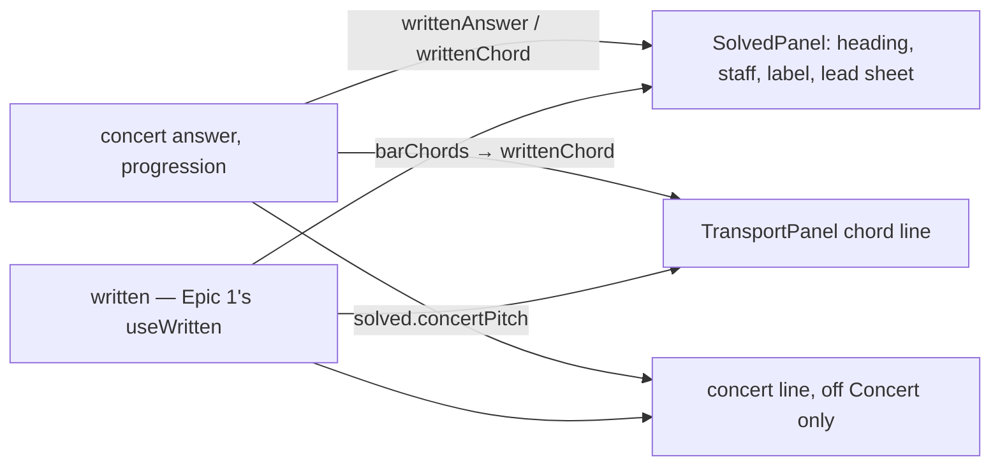

# Tech spec — Epic 2: The reveal written for the instrument

PRD: [../prd/epic-2-the-reveal-written-for-the-instrument.md](../prd/epic-2-the-reveal-written-for-the-instrument.md) ·
Roadmap: [../roadmap.md](../roadmap.md)

## Approach

Two pure functions, one snippet, one prop, three lines. `writtenAnswer` and
`writtenChord` land in a new theory module, `src/lib/theory/written.ts`, beside
Epic 1's `transpose.ts` rather than inside it, so the two epics never write the
same file; both lean on Epic 1's `writtenRoot` for the offset and on `ROOTS`
for the spelling, and `scaleNotes` re-spells the scale from the written root
exactly as it spells a concert one. `SolvedPanel` takes a `written` prop and
does every transposition itself — heading, staff, label, lead sheet, concert
line — so the solved box stays testable in isolation as its fifty existing
tests render it, and the heading Epic 1's R7 asks for is produced here.
`GroovePuzzle.tsx` changes by exactly three lines: an import, the
`TransportPanel` chord hand-off, and the `written` prop on `SolvedPanel`. The
concert line is a `solved` snippet, rendered only off Concert. Nothing under
`hooks/`, `state/`, `lib/persistence/`, `lib/presentation/` or `components/header/`
is touched — those are Epic 1's.

## Architecture

- **Theory.** `src/lib/theory/written.ts` (new) exports `writtenAnswer` and
  `writtenChord`. It imports `type Written` and `writtenRoot` from
  `./transpose` (Epic 1), `ROOTS` from `./roots`, `pitchClassOfNote` from
  `./notes` and `type Answer` from `../groove` — theory siblings and
  `../groove` only, so zone 4 and `src/lib/leaf.test.ts` hold. `notes.ts` gains
  one export, `pitchClassOfNote(note: string): number`, built on its existing
  private `splitNote` and `NATURAL` table, so a chord root spelt outside
  `ROOTS` (the PRD's `G♭maj7`) has a pitch class without a second letter table.
  `writtenChord` under `'C'` returns its input untouched — Concert is the
  identity character for character (R7), not a re-spelling through `ROOTS`.
- **Words.** `SolvedSnippets` gains `concertPitch: (args: { root: string;
  flavour: string }) => string`; `en/solved.ts` renders
  `"E♭ Dorian in concert pitch"`. The wording is pinned in
  `src/lib/snippets/snippets.test.ts`, the one place a sentence is written out.
- **Shell, solved region.** `components/solved/SolvedPanel.tsx` takes
  `written: Written`. It computes `shown = writtenAnswer(answer, written)` and
  renders the heading from `shown`, `scaleNotes(shown)` into `staffNotes` and
  `staffLabel`, `barChords(progression).map((c) => writtenChord(c, written))`
  into `LeadSheet`, and `barNumerals(answer.flavour, progressionDegrees)`
  unchanged. `scaleDegrees(answer)`, `characterOf`, `selectNearMiss(attempts,
  answer, revealed)` and `solved.heardIn` keep reading the concert `answer` —
  none of them names a pitch (R8). The concert line is a
  `<Text size="sm" tone="inverted-muted">` directly after the heading `Row`
  and before the near-miss and heard-in lines, rendered only when
  `written !== 'C'`.
- **Shell, composer.** `components/GroovePuzzle.tsx` passes
  `chords={solved || revealed ? barChords(groove.progression).map((chord) => writtenChord(chord, written)) : null}`
  to `TransportPanel` and `written={written}` to `SolvedPanel`, where
  `written` is the `Written` value Epic 1's Track D puts in scope in
  `GroovePuzzleView` (`useWritten()`). `TransportPanel.tsx` and `LeadSheet.tsx` are untouched:
  they render whatever strings they are given.
- **Catalogue guard.** The sweep the PRD's AC2 asks for — every chord symbol
  and every root × flavour in `grooves.generated.ts` under the three keys —
  lives in `src/features/daily-groove/data/grooves.generated.test.ts`, which
  already draws the catalogue → theory arrow. A test under `src/lib/theory/`
  may not import the manifest (zone 4 binds tests; `leaf.test.ts` rejects the
  `@/` alias), so `written.test.ts` tests the functions over `ROOTS` and hand
  fixtures, and the manifest's own test asserts the shipped data.
- **The double accidentals the PRD did not know about.** Measured on the
  shipped catalogue: three concert spellings already carry a double accidental
  on today's staff — `C♯ Lydian` (F♯♯), `C♯ Lydian dominant` (F♯♯),
  `A♭ Phrygian` (B♭♭), `E♭ Blues` (B♭♭) — because `scaleNotes` spells every
  degree from its letter and `staff.ts` draws `♯♯` and `♭♭`. AC2's "no double
  accidental" therefore fails on the identity before a line of this epic is
  written. The guard this spec writes instead: every written note is a note
  the staff can draw (`staffNotes` accepts it, accidental in `'' ♯ ♯♯ ♭ ♭♭`),
  the written scale has the concert scale's length, `'C'` is the identity, and
  the seven written scales that do carry a double accidental are pinned by
  name so a new one is a deliberate change. See Decision log D2.



## Contracts

From Epic 1 — consumed here, built there, frozen before either epic starts:

```ts
// src/lib/theory/transpose.ts — Epic 1 Track A, Wave 1
export type Written = 'C' | 'E♭' | 'B♭'
export const WRITTEN: readonly Written[] = ['C', 'E♭', 'B♭']        // the pill's cycle order
export function writtenRoot(root: Root, written: Written): Root       // +0 / +9 / +2 semitones, spelt from ROOTS
export function concertRoot(root: Root, written: Written): Root       // not used by this epic

// src/features/daily-groove/hooks/useWritten.ts — Epic 1 Track D, Wave 2
//   { written: Written; setWritten(written: Written): void; loaded: boolean }
//   GroovePuzzleView holds `const { written, setWritten, loaded } = useWritten()` and gates on loaded;
//   the identifier `written` is in scope where TransportPanel and SolvedPanel are rendered.

// src/features/daily-groove/lib/persistence/preferences.ts — Epic 1 Track D
//   Preferences.written?: Written  → seedPreferences({ written: 'E♭' }) works in page tests

// the header pill — Epic 1 Tracks G and F: <TransposePill> in GrooveHeader's `transpose` slot, a <button>
//   named header.transposeName({ instrument: header.instruments[written] }); one press cycles WRITTEN.
```

This epic's, frozen now:

```ts
// src/lib/theory/notes.ts — one added export
export function pitchClassOfNote(note: string): number
//   'C' → 0, 'G♭' → 6, 'B♯' → 0, 'E♭♭' → 2; throws UnknownRootError for anything splitNote rejects

// src/lib/theory/written.ts — new
import type { Answer } from '../groove'
import type { Written } from './transpose'
export function writtenAnswer(answer: Answer, written: Written): Answer
//   { root: writtenRoot(answer.root, written), flavour: answer.flavour }; a new object, input untouched
export function writtenChord(symbol: string, written: Written): string
//   written === 'C'            → symbol, unchanged
//   symbol === ''              → ''
//   /^([A-G])([♯♭]?)(.*)$/s    → ROOTS-spelt writtenRoot of the parsed root + the suffix, verbatim
//   no match ('N.C.', 'x')     → symbol, unchanged
//   slash chord 'Am7/G'        → first root only: 'F♯m7/G' under 'E♭'
```

```ts
// src/lib/snippets/types.ts — SolvedSnippets gains one key
export type SolvedSnippets = {
  // ...existing keys unchanged...
  concertPitch: (args: { root: string; flavour: string }) => string
}
// src/lib/snippets/en/solved.ts
solved.concertPitch({ root: 'E♭', flavour: 'Dorian' }) === 'E♭ Dorian in concert pitch'
```

```tsx
// src/features/daily-groove/components/solved/SolvedPanel.tsx
type SolvedPanelProps = {
  answer: Answer            // concert, as today
  progression: string       // concert, as today
  progressionDegrees?: number[]
  attempts: Attempt[]
  revealed: boolean
  heardIn?: HeardIn
  written: Written          // new, required — the composer always has one
}
// Rendering contract under written W, concert answer A, chords C[]:
//   heading text            === `${writtenRoot(A.root, W)} ${A.flavour}`          (Epic 1 R7 / AC9, made here)
//   staff accessible name   === staffLabel(scaleDegrees(A), scaleNotes(writtenAnswer(A, W)))
//   lead-sheet [data-bar]   === barChords(progression).map((c) => writtenChord(c, W))
//   lead-sheet [data-numeral] === barNumerals(A.flavour, progressionDegrees)   (unchanged by W)
//   concert line            present iff W !== 'C', text === solved.concertPitch(A), same classes as the mode line
//   near-miss, heard-in, mode line: identical text for every W
```

```tsx
// src/features/daily-groove/components/GroovePuzzle.tsx — the three lines this epic owns
import { writtenChord } from '@/lib/theory/written'
// TransportPanel:
chords={solved || revealed ? barChords(groove.progression).map((chord) => writtenChord(chord, written)) : null}
// SolvedPanel:
written={written}
```

Test command: `npm test` for every track. No track owns a generator file.

## Tracks

### Track A — The theory: a written answer and a written chord

- **Goal** — `writtenAnswer` and `writtenChord` exist with the contract above,
  proven over all twelve `ROOTS`, the three keys and hand fixtures including
  a root spelt outside `ROOTS`, an empty symbol, a slash chord and an
  unparseable symbol.
- **Owns** — `src/lib/theory/written.ts`, `src/lib/theory/written.test.ts`,
  `src/lib/theory/notes.ts`, `src/lib/theory/notes.test.ts`
- **Role** — `implementer`
- **Depends on** — Epic 1 Track A (Wave 1): `src/lib/theory/transpose.ts`
  with `Written`, `WRITTEN` and `writtenRoot`. Nothing else of Epic 1. This
  track starts once that file is on the branch; `written.ts` is a sibling
  that imports it and never edits it.
- **Parallel with** — Tracks B, C
- **Done when** — `written.test.ts` and `notes.test.ts` are green;
  `src/lib/leaf.test.ts` and `src/lib/theory/roots.test.ts` (tables declared
  once) still green; `npm run lint` clean.

### Track B — The words

- **Goal** — `solved.concertPitch` exists, typed, with its wording pinned.
- **Owns** — `src/lib/snippets/en/solved.ts`, the `SolvedSnippets` block of
  `src/lib/snippets/types.ts`, one new `describe` in
  `src/lib/snippets/snippets.test.ts`
- **Role** — `implementer`
- **Depends on** — nothing
- **Parallel with** — Tracks A, C
- **Done when** — `snippets.test.ts` green, `npx tsc --noEmit` clean.
- **Shared with Epic 1 Track C (Wave 1)** — `src/lib/snippets/types.ts` and
  `snippets.test.ts`. Epic 1 adds `transpose`, `transposeName` and
  `instruments` to `HeaderSnippets` and `transpose` to `IntroSnippets`, and
  edits `en/header.ts` and `en/intro.ts`; this track edits only the
  `SolvedSnippets` type block and `en/solved.ts`, and adds its own
  `describe`. Different blocks, either order, the second to land rebases.
  `en/solved.ts` is this epic's alone.

### Track C — The catalogue read for a transposing instrument

- **Goal** — the shipped catalogue is swept under every key: every chord
  symbol keeps its suffix and gets a `ROOTS`-spelt root, every scale is drawable,
  Concert is the identity, and the written scales that carry a double
  accidental are named.
- **Owns** — `src/features/daily-groove/data/grooves.generated.test.ts`
- **Role** — `test-writer`
- **Depends on** — Track A to go green; nothing to start (its red is the
  unresolved import of `@/lib/theory/written`).
- **Parallel with** — Tracks A, B
- **Done when** — the new `describe` is green with Track A landed and the rest
  of the file unchanged.

### Track D — The solved box follows the instrument

- **Goal** — `SolvedPanel` takes `written` and renders heading, staff, label,
  lead sheet and concert line from it, numerals and the three prose lines
  unchanged; on `'C'` it is today's box.
- **Owns** — `src/features/daily-groove/components/solved/SolvedPanel.tsx`,
  `src/features/daily-groove/components/solved/SolvedPanel.test.tsx`
- **Role** — `implementer`
- **Depends on** — Track A (`written.ts`), Track B (`solved.concertPitch`),
  Epic 1 Track A (`Written`)
- **Parallel with** — Epic 1's Wave 2 and Wave 3 tracks
- **Done when** — `SolvedPanel.test.tsx` green with every pre-existing case
  unchanged except for `written="C"` in the `renderPanel` default;
  `structure.test.ts` green.
- **Owned entirely by this epic.** Epic 1 writes no line in `SolvedPanel.tsx`
  or `SolvedPanel.test.tsx` and asserts nothing about the heading's text (its
  F3 checks the solved box renders, its F4 checks Check and the meta line).
  Epic 1's R7 / AC9 heading clause is credited to this track's D3 and to
  Track E's composed-page assertions.

### Track E — The composer hands the written chords down

- **Goal** — the transport chord line reads the same written symbols as the
  lead sheet, only once solved or revealed; a tap on the header pill changes
  chord line, lead sheet, staff, label and concert line together and a full
  cycle brings them back.
- **Owns** — `src/features/daily-groove/components/GroovePuzzle.tsx` (three
  lines, named in Contracts), `src/features/daily-groove/components/GroovePuzzle.sounding.test.tsx`
- **Role** — `implementer`
- **Depends on** — Tracks A and D; Epic 1 Track D (`useWritten` wired, the
  `written` identifier, `Preferences.written`) and Track F (the pill in the
  header) landed.
- **Parallel with** — nothing; last.
- **Done when** — every `GroovePuzzle.*.test.tsx` file is green, Epic 1's `GroovePuzzle.written.test.tsx` included,
  `structure.test.ts` green (`GroovePuzzle.tsx` gains one theory import and no
  `lib/presentation/` import).
- **Shared with Epic 1 Tracks D and F** — `GroovePuzzle.tsx`, the only file
  this epic shares with Epic 1. Epic 1's D edits the hook block, the loading
  gate and the `sessionValue` memo; its F edits the JSX (`GrooveHeader`'s
  `transpose` slot, `metaLine`'s fourth argument). This track edits the
  import block (one added line), the `TransportPanel` `chords=` attribute and
  adds `written={written}` to `SolvedPanel` — nothing else. This track lands
  after both, so it rebases; the `written` identifier is Epic 1's frozen name. `puzzleHarness.tsx` and Epic 1's
  `GroovePuzzle.written.test.tsx` are not edited by this epic — the locators
  it needs are local to `GroovePuzzle.sounding.test.tsx`.

## Execution waves

- **Wave 1 (parallel):** Track A, Track B, Track C — A once Epic 1 Track A
  (`transpose.ts`, Epic 1 Wave 1) is on the branch; B at once; C written at
  once, green when A lands
- **Wave 2:** Track D — needs `written.ts` and `solved.concertPitch`; runs
  beside Epic 1's Waves 2–3, in files Epic 1 never touches
- **Wave 3:** Track E — needs D, and Epic 1 Tracks D and F on the branch
- **Wave 4:** Integration — full suite, lint, typecheck, build, demo path

Against Epic 1's waves: this epic's Wave 1 follows Epic 1's Wave 1 (Track A
needs `transpose.ts`); Wave 2 overlaps Epic 1's Waves 2 and 3; Wave 3 is after
Epic 1's Wave 3. Why E is a wave of its own rather than parallel with D: its
red-green needs a seeded `written` preference to reach `GroovePuzzleView`,
which is Epic 1's hook, and its switch test taps Epic 1's pill. Everything
before it is provable against the frozen contract alone.

## Implementation

### Track A — The theory

#### Step A1 — A spelt note has a pitch class, whatever its accidental

Covers: R3 (roots spelt outside `ROOTS`, the PRD's `G♭maj7`)

- **Test first** — `src/lib/theory/notes.test.ts`, new
  `describe('pitchClassOfNote')`:
  ```ts
  import { pitchClassOfNote, UnknownRootError } from './notes'
  it('reads a letter and its accidental as a pitch class (F23 E2 R3)', () => {
    expect(pitchClassOfNote('C')).toBe(0)
    expect(pitchClassOfNote('G♭')).toBe(6)
    expect(pitchClassOfNote('F♯')).toBe(6)
    expect(pitchClassOfNote('B♯')).toBe(0)
    expect(pitchClassOfNote('C♭')).toBe(11)
    expect(pitchClassOfNote('E♭♭')).toBe(2)
  })
  it('agrees with ROOTS for every root the app spells', () => {
    ROOTS.forEach((root, index) => expect(pitchClassOfNote(root)).toBe(index))
  })
  it('rejects what is not a spelt note', () => {
    expect(() => pitchClassOfNote('H')).toThrow(UnknownRootError)
    expect(() => pitchClassOfNote('C♮')).toThrow(UnknownRootError)
  })
  ```
  Run it: fails with `TypeError: pitchClassOfNote is not a function`.
- **Implement** — `src/lib/theory/notes.ts`:
  ```ts
  export function pitchClassOfNote(note: string): number {
    const { letter, offset } = splitNote(note)
    return (NATURAL[letter] + offset + 12) % 12
  }
  ```
  `scaleNotes` keeps its own inline computation or calls this — either way no
  behaviour change; the existing `notes.test.ts` cases stay green.
- **Green when** — the three cases pass; `notes.test.ts` otherwise unchanged
  and green.
- **Refactor** — `scaleNotes` uses `pitchClassOfNote` for `rootPitch` so the
  modular arithmetic is written once.

#### Step A2 — A written answer moves the root and keeps the flavour

Covers: R1, AC2 (identity under Concert)

- **Test first** — `src/lib/theory/written.test.ts` (new):
  ```ts
  import { describe, expect, it } from 'vitest'
  import { ROOTS } from './roots'
  import { writtenRoot, type Written } from './transpose'
  import { writtenAnswer, writtenChord } from './written'
  import { FLAVOURS, displayFlavour } from './names'

  const KEYS: Written[] = ['C', 'E♭', 'B♭']

  describe('writtenAnswer', () => {
    it('re-roots the answer through writtenRoot and keeps the flavour (F23 E2 R1)', () => {
      for (const written of KEYS) for (const root of ROOTS) for (const slug of FLAVOURS) {
        const flavour = displayFlavour(slug)
        expect(writtenAnswer({ root, flavour }, written)).toEqual({
          root: writtenRoot(root, written),
          flavour,
        })
      }
    })
    it('is the identity on Concert and leaves its input alone (AC2)', () => {
      const answer = { root: 'E♭' as const, flavour: 'Dorian' }
      expect(writtenAnswer(answer, 'C')).toEqual(answer)
      expect(writtenAnswer(answer, 'E♭')).toEqual({ root: 'C', flavour: 'Dorian' })
      expect(writtenAnswer(answer, 'B♭')).toEqual({ root: 'F', flavour: 'Dorian' })
      expect(answer).toEqual({ root: 'E♭', flavour: 'Dorian' })
    })
  })
  ```
  Run it: fails with `Error: Failed to resolve import "./written" from
  "src/lib/theory/written.test.ts". Does the file exist?`
- **Implement** — `src/lib/theory/written.ts`:
  ```ts
  import type { Answer } from '../groove'
  import { writtenRoot, type Written } from './transpose'

  export function writtenAnswer(answer: Answer, written: Written): Answer {
    return { root: writtenRoot(answer.root, written), flavour: answer.flavour }
  }
  ```
- **Green when** — both cases pass; `src/lib/leaf.test.ts` still green (no
  `@/` specifier in the new file).
- **Refactor** — none.

#### Step A3 — A written chord moves its root and keeps its suffix

Covers: R3, AC2, AC4 (the transposition behind it)

- **Test first** — `written.test.ts`, `describe('writtenChord')`:
  ```ts
  const CASES: [string, Written, string][] = [
    ['Am7', 'E♭', 'F♯m7'],
    ['E♭maj7', 'E♭', 'Cmaj7'],
    ['A♭m7♭5', 'E♭', 'Fm7♭5'],
    ['EmMaj7', 'E♭', 'C♯mMaj7'],
    ['G♭maj7', 'E♭', 'E♭maj7'],
    ['E♭m7', 'E♭', 'Cm7'],
    ['A♭7', 'E♭', 'F7'],
    ['F♯m7', 'B♭', 'A♭m7'],
    ['Fdim7', 'B♭', 'Gdim7'],
    ['Bmaj7♯5', 'B♭', 'C♯maj7♯5'],
  ]
  it.each(CASES)('reads %s for %s as %s (F23 E2 R3, AC4)', (symbol, written, expected) => {
    expect(writtenChord(symbol, written)).toBe(expected)
  })
  it('spells every written root from ROOTS, with the suffix verbatim (AC2)', () => {
    for (const written of KEYS) for (const root of ROOTS) {
      expect(writtenChord(`${root}m7♭5`, written)).toBe(`${writtenRoot(root, written)}m7♭5`)
    }
  })
  it('is the identity on Concert, character for character (R7)', () => {
    for (const symbol of ['Am7', 'G♭maj7', 'A♭m7♭5', '', 'N.C.', 'Am7/G']) {
      expect(writtenChord(symbol, 'C')).toBe(symbol)
    }
  })
  it('leaves an empty bar empty and an unreadable symbol alone', () => {
    expect(writtenChord('', 'E♭')).toBe('')
    expect(writtenChord('N.C.', 'E♭')).toBe('N.C.')
  })
  it('transposes only the first root of a slash chord', () => {
    expect(writtenChord('Am7/G', 'E♭')).toBe('F♯m7/G')
  })
  ```
  Run it: fails with `TypeError: writtenChord is not a function`.
- **Implement** — `written.ts`:
  ```ts
  import { pitchClassOfNote } from './notes'
  import { ROOTS } from './roots'

  const LEADING_ROOT = /^([A-G][♯♭]?)([\s\S]*)$/

  export function writtenChord(symbol: string, written: Written): string {
    if (written === 'C') return symbol
    const match = LEADING_ROOT.exec(symbol)
    if (match === null) return symbol
    const [, root, suffix] = match
    return `${writtenRoot(ROOTS[pitchClassOfNote(root)], written)}${suffix}`
  }
  ```
- **Green when** — all five cases pass; `roots.test.ts`'s "declared once"
  guard still green (no second `ROOTS` table).
- **Refactor** — none.

### Track B — The words

#### Step B1 — The concert line has a sentence

Covers: R5, AC6

- **Test first** — `src/lib/snippets/snippets.test.ts`, new
  `describe('the concert line (F23 E2)')`:
  ```ts
  it('names the concert answer and says which pitch it is in (F23 E2 R5, AC6)', () => {
    expect(snippets.solved.concertPitch({ root: 'E♭', flavour: 'Dorian' })).toBe(
      'E♭ Dorian in concert pitch',
    )
  })
  it('returns the same string for the same arguments', () => {
    const args = { root: 'A♭', flavour: 'Phrygian' }
    expect(snippets.solved.concertPitch(args)).toBe(snippets.solved.concertPitch({ ...args }))
  })
  it('puts the root before the flavour and both before the qualifier', () => {
    const line = snippets.solved.concertPitch({ root: 'F♯', flavour: 'Blues' })
    expect(line.indexOf('F♯')).toBeLessThan(line.indexOf('Blues'))
    expect(line.indexOf('Blues')).toBeLessThan(line.indexOf('concert'))
  })
  ```
  Run it: fails with `TypeError: snippets.solved.concertPitch is not a function`.
- **Implement** — `src/lib/snippets/types.ts`: add
  `concertPitch: (args: { root: string; flavour: string }) => string` to
  `SolvedSnippets`. `src/lib/snippets/en/solved.ts`: add
  `concertPitch: ({ root, flavour }) => \`${root} ${flavour} in concert pitch\``.
- **Green when** — the three cases pass; the `satisfies SolvedSnippets` clause
  typechecks; `'exports a non-empty object per area'` still green.
- **Refactor** — none.

### Track C — The catalogue read for a transposing instrument

All three steps go in one new
`describe('the catalogue read for a transposing instrument (F23 E2)')` in
`src/features/daily-groove/data/grooves.generated.test.ts`, with these imports
added to the file: `writtenAnswer, writtenChord` from `@/lib/theory/written`,
`writtenRoot, type Written` from `@/lib/theory/transpose`. Written in Wave 1,
before Track A lands, so the red is observed; each step's stated failure is
what it reports once `written.ts` exists but before the function is right.

```ts
const KEYS: Written[] = ['C', 'E♭', 'B♭']
const LEADING_ROOT = /^([A-G][♯♭]?)([\s\S]*)$/
const SYMBOLS = [...new Set(GROOVES.flatMap((g) => barChords(g.progression)))]
const PAIRS = [...new Map(GROOVES.map((g) => [`${g.root}|${g.flavour}`, answerOf(g)])).values()]
```

#### Step C1 — Every shipped chord symbol survives with its suffix

Covers: R3, AC2

- **Test first**:
  ```ts
  it('keeps every suffix and spells every written root from ROOTS (F23 E2 R3, AC2)', () => {
    expect(SYMBOLS.length).toBeGreaterThan(40)
    for (const symbol of SYMBOLS) {
      const [, concertRoot, suffix] = LEADING_ROOT.exec(symbol) as RegExpExecArray
      expect(ROOTS, symbol).toContain(concertRoot)
      for (const written of KEYS) {
        const [, root, writtenSuffix] = LEADING_ROOT.exec(writtenChord(symbol, written)) as RegExpExecArray
        expect(writtenSuffix, `${symbol} under ${written}`).toBe(suffix)
        expect(root, `${symbol} under ${written}`).toBe(writtenRoot(concertRoot as Root, written))
      }
    }
  })
  it('is the identity on Concert for every shipped symbol (AC2)', () => {
    for (const symbol of SYMBOLS) expect(writtenChord(symbol, 'C')).toBe(symbol)
  })
  ```
  Run it before Track A: fails with `Error: Failed to resolve import
  "@/lib/theory/written"`. Against a `writtenChord` that returned its input
  under every key it would fail at `expect(root).toBe(writtenRoot(...))` with
  `expected 'A' to be 'F♯'`.
- **Implement** — nothing here; Track A's A3.
- **Green when** — passes with A3 landed.
- **Refactor** — none.

#### Step C2 — Every shipped scale is drawable in every key

Covers: R1, R7, AC2, AC8

- **Test first**:
  ```ts
  const DRAWABLE = /^[A-G](♯♯|♯|♭♭|♭)?$/
  it('spells every root × flavour as notes the staff can draw, in every key (F23 E2 R1, AC2)', () => {
    for (const answer of PAIRS) for (const written of KEYS) {
      const where = `${answer.root} ${answer.flavour} under ${written}`
      const shown = writtenAnswer(answer, written)
      expect(ROOTS, where).toContain(shown.root)
      const notes = scaleNotes(shown)
      expect(notes, where).toHaveLength(scaleNotes(answer).length)
      for (const note of notes) expect(note, where).toMatch(DRAWABLE)
      expect(() => staffNotes(notes), where).not.toThrow()
    }
  })
  it('shows today’s staff on Concert (R7, AC8)', () => {
    for (const answer of PAIRS) {
      expect(scaleNotes(writtenAnswer(answer, 'C'))).toEqual(scaleNotes(answer))
    }
  })
  ```
  Run it before Track A: the unresolved import. Against a `writtenAnswer` that
  returned an un-spelt root it would fail at `expect(ROOTS).toContain(...)`.
- **Implement** — nothing here; Track A's A2.
- **Green when** — passes with A2 landed.
- **Refactor** — none.

#### Step C3 — The double accidentals are named, not hidden

Covers: AC2 (the double-accidental clause, as the PRD now words it)

- **Test first**:
  ```ts
  it('carries a double accidental in exactly these written scales — each the spelling concert already shows for that root (F23 E2 AC2, D2)', () => {
    const doubles = KEYS.flatMap((written) =>
      PAIRS.map((answer) => ({ answer, written, notes: scaleNotes(writtenAnswer(answer, written)) }))
        .filter(({ notes }) => notes.some((note) => /♯♯|♭♭/.test(note)))
        .map(({ answer, written, notes }) => `${written}: ${answer.root} ${answer.flavour} → ${notes.join(' ')}`),
    )
    expect(new Set(doubles)).toEqual(
      new Set([
        'C: C♯ Lydian → C♯ D♯ E♯ F♯♯ G♯ A♯ B♯',
        'C: C♯ Lydian dominant → C♯ D♯ E♯ F♯♯ G♯ A♯ B',
        'C: A♭ Phrygian → A♭ B♭♭ C♭ D♭ E♭ F♭ G♭',
        'C: E♭ Blues → E♭ G♭ A♭ B♭♭ B♭ D♭',
        'E♭: B Phrygian dominant → A♭ B♭♭ C D♭ E♭ F♭ G♭',
        'E♭: F♯ Blues → E♭ G♭ A♭ B♭♭ B♭ D♭',
        'B♭: F♯ Blues → A♭ C♭ D♭ E♭♭ E♭ G♭',
      ]),
    )
    expect(doubles).toHaveLength(7)
  })
  ```
  Run it before Track A: the unresolved import. The seven lines were measured
  on the shipped catalogue (30 grooves, 30 distinct root × flavour pairs) with
  the offsets in Contracts; if Epic 1's `writtenRoot` differs from them this
  test says exactly where.
- **Implement** — nothing; the list is data.
- **Green when** — passes with A2 landed. A catalogue change that adds an
  eighth line is a deliberate edit to this list, with the new spelling read
  aloud first.
- **Refactor** — none.

### Track D — The solved box follows the instrument

All new cases go in `SolvedPanel.test.tsx`, in a new
`describe('written for an instrument (F23 E2)')`. `renderPanel` gains
`written="C"` in its defaults, so every existing case renders today's box
without being rewritten. Fixtures for the block:

```ts
import type { Written } from '@/lib/theory/transpose'
import { scaleDegrees } from '@/lib/theory/degrees'
import { scaleNotes } from '@/lib/theory/notes'
import { staffLabel } from '../../lib/presentation/staffLabel'

const E_FLAT_DORIAN: Answer = { root: 'E♭', flavour: 'Dorian' }
const CHANGES = 'E♭m7–G♭maj7–A♭7'
const DEGREES = [0, 2, 3]
const concertLine = () =>
  within(headerBlock()).queryByText(solved.concertPitch(E_FLAT_DORIAN))
```

#### Step D1 — The staff and its label read in written pitch

Covers: R1, R2, AC1, AC3

- **Test first**:
  ```ts
  it('spells the scale from the written root and keeps the degrees (F23 E2 R1, AC1)', () => {
    renderPanel({ answer: E_FLAT_DORIAN, written: 'E♭' })
    expect(staff()).toHaveAccessibleName('1 C, 2 D, ♭3 E♭, 4 F, 5 G, 6 A, ♭7 B♭')
    expect(degreeTexts()).toEqual(['1', '2', '♭3', '4', '5', '6', '♭7'])
    expect(noteheads()).toHaveLength(7)
    expect(accidentalGlyphs()).toEqual(['♭', '♭'])
  })
  it('pairs every degree with its written note in the accessible label (F23 E2 R2, AC3)', () => {
    renderPanel({ answer: E_FLAT_DORIAN, written: 'B♭' })
    expect(staff()).toHaveAccessibleName(
      staffLabel(scaleDegrees(E_FLAT_DORIAN), scaleNotes({ root: 'F', flavour: 'Dorian' })),
    )
    expect(staff()).toHaveAccessibleName('1 F, 2 G, ♭3 A♭, 4 B♭, 5 C, 6 D, ♭7 E♭')
  })
  ```
  Run it: `npx tsc --noEmit` reports `Object literal may only specify known
  properties, and 'written' does not exist in type
  'Partial<SolvedPanelProps>'`; at runtime the first case fails with
  `expected element to have accessible name "1 C, 2 D, ♭3 E♭, 4 F, 5 G, 6 A,
  ♭7 B♭" but had "1 E♭, 2 F, ♭3 G♭, 4 A♭, 5 B♭, 6 C, ♭7 D♭"`.
- **Implement** — `SolvedPanel.tsx`: add `written: Written` to the props
  (`import type { Written } from '@/lib/theory/transpose'`,
  `import { writtenAnswer, writtenChord } from '@/lib/theory/written'`);
  `const shown = writtenAnswer(answer, written)`;
  `const notes = scaleNotes(shown)`; `degrees = scaleDegrees(answer)` stays.
  `ScaleStaff` receives `staffNotes(notes)` and `staffLabel(degrees, notes)`
  as today — now written. In the test file, add `written="C"` to the
  `renderPanel` defaults.
- **Green when** — both cases pass; every pre-existing case passes unchanged.
- **Refactor** — none.

#### Step D2 — The lead sheet reads written symbols over concert numerals

Covers: R3, AC4

- **Test first**:
  ```ts
  it('transposes each chord root, keeps each suffix, and leaves the numerals (F23 E2 R3, AC4)', () => {
    renderPanel({ answer: E_FLAT_DORIAN, progression: CHANGES, progressionDegrees: DEGREES, written: 'E♭' })
    expect(barTexts()).toEqual(['Cm7', 'E♭maj7', 'F7', 'Cm7'])
    expect(numeralTexts()).toEqual(['I', '♭III', 'IV', 'I'])
    expect(leadSheet()).toHaveAccessibleName('Cm7 I · E♭maj7 ♭III · F7 IV · Cm7 I')
  })
  it('gives the numerals of the concert rendering (AC4)', () => {
    const { unmount } = renderPanel({ answer: E_FLAT_DORIAN, progression: CHANGES, progressionDegrees: DEGREES })
    const concert = numeralTexts()
    unmount()
    renderPanel({ answer: E_FLAT_DORIAN, progression: CHANGES, progressionDegrees: DEGREES, written: 'E♭' })
    expect(numeralTexts()).toEqual(concert)
  })
  ```
  Run it: fails with `expected [ 'E♭m7', 'G♭maj7', 'A♭7', 'E♭m7' ] to deeply
  equal [ 'Cm7', 'E♭maj7', 'F7', 'Cm7' ]`.
- **Implement** — `SolvedPanel.tsx`: `LeadSheet` gets
  `chords={barChords(progression).map((chord) => writtenChord(chord, written))}`;
  `numerals={barNumerals(answer.flavour, progressionDegrees)}` unchanged.
- **Green when** — passes; `'never prints the dash-joined progression'`,
  `'shows the tonic chord exactly once'` and the longest-progression case
  still pass (they render on `'C'`).
- **Refactor** — none.

#### Step D3 — The heading names the written root

Covers: R6 (the heading is one of the things that switch); Epic 1 R7 / AC9,
credited here

- **Test first**:
  ```ts
  it('names the answer in written pitch (F23 E1 R7, AC9 — the heading is this box’s)', () => {
    renderPanel({ answer: E_FLAT_DORIAN, written: 'E♭' })
    expect(screen.getByRole('heading', { name: 'C Dorian' })).toBeInTheDocument()
    expect(screen.queryByRole('heading', { name: 'E♭ Dorian' })).toBeNull()
    expect(within(header()).getByText(solved.modeLine({ flavour: 'Dorian' }) as string)).toBeInTheDocument()
  })
  it('names it in the tenor’s pitch on B♭', () => {
    renderPanel({ answer: E_FLAT_DORIAN, written: 'B♭' })
    expect(screen.getByRole('heading', { name: 'F Dorian' })).toBeInTheDocument()
  })
  ```
  Run it: fails with `Unable to find an accessible element with the role
  "heading" and name "C Dorian"`.
- **Implement** — `SolvedPanel.tsx`: the `Heading` renders
  `` `${shown.root} ${shown.flavour}` ``.
- **Green when** — passes; `'names the answer as root and flavour together'`
  (G Dorian on `'C'`) still passes.
- **Refactor** — none.

#### Step D4 — A muted concert line, only off Concert

Covers: R5, R7, AC6

- **Test first**:
  ```ts
  it('reads the concert answer under the heading on alto sax (F23 E2 R5, AC6)', () => {
    renderPanel({ answer: E_FLAT_DORIAN, written: 'E♭', heardIn: { track: 'So What', artist: 'Miles Davis' } })
    const line = concertLine() as HTMLElement
    expect(line).toBeInTheDocument()
    expect(classOf(line)).toBe(classOf(within(headerBlock()).getByText(/So What/)))
    const heading = screen.getByRole('heading', { level: 2 })
    expect(heading.compareDocumentPosition(line) & Node.DOCUMENT_POSITION_FOLLOWING).toBeTruthy()
    const lines = Array.from(headerBlock().querySelectorAll<HTMLElement>('p'))
    expect(lines.indexOf(line)).toBeLessThan(lines.indexOf(within(headerBlock()).getByText(/So What/)))
  })
  it('reads the same concert answer on tenor (R5)', () => {
    renderPanel({ answer: E_FLAT_DORIAN, written: 'B♭' })
    expect(concertLine()).toBeInTheDocument()
  })
  it('renders no concert line on Concert (F23 E2 R5, R7, AC6)', () => {
    renderPanel({ answer: E_FLAT_DORIAN, written: 'C' })
    expect(concertLine()).toBeNull()
    expect(headerBlock().textContent).not.toMatch(/concert/i)
  })
  ```
  Run it: fails with `Unable to find an element with the text: E♭ Dorian in
  concert pitch`.
- **Implement** — `SolvedPanel.tsx`: after the heading `Row` and before the
  near-miss line, inside the header `Stack`:
  ```tsx
  {written !== 'C' && (
    <Text size="sm" tone="inverted-muted">{solved.concertPitch(answer)}</Text>
  )}
  ```
  `answer` here is the concert `Answer` — `{ root, flavour }` is the snippet's
  whole argument shape, so it is passed as is.
- **Green when** — the three cases pass; `'renders nothing for the heard-in
  line when no track is known'` (one `<p>` in the header block) still passes
  on `'C'`.
- **Refactor** — none.

#### Step D5 — Switching in place changes everything at once and reverts

Covers: R6, AC7

- **Test first** — written in the same sitting as D1–D4 so its red is observed
  once (with the prop ignored, nothing changes on rerender):
  ```ts
  it('re-renders staff, label, lead sheet, heading and concert line together and back (F23 E2 R6, AC7)', () => {
    const props = { answer: E_FLAT_DORIAN, progression: CHANGES, progressionDegrees: DEGREES, attempts: [], revealed: false }
    const { rerender } = render(<SolvedPanel {...props} written="C" />)
    const concert = {
      label: staff().getAttribute('aria-label'),
      bars: barTexts(),
      heading: screen.getByRole('heading', { level: 2 }).textContent,
      numerals: numeralTexts(),
    }
    expect(concertLine()).toBeNull()

    rerender(<SolvedPanel {...props} written="E♭" />)
    expect(staff().getAttribute('aria-label')).not.toBe(concert.label)
    expect(barTexts()).not.toEqual(concert.bars)
    expect(screen.getByRole('heading', { level: 2 }).textContent).toBe('C Dorian')
    expect(numeralTexts()).toEqual(concert.numerals)
    expect(concertLine()).toBeInTheDocument()

    rerender(<SolvedPanel {...props} written="C" />)
    expect(staff().getAttribute('aria-label')).toBe(concert.label)
    expect(barTexts()).toEqual(concert.bars)
    expect(screen.getByRole('heading', { level: 2 }).textContent).toBe(concert.heading)
    expect(concertLine()).toBeNull()
  })
  ```
  Run it before D1: fails with `expected '1 E♭, 2 F, ♭3 G♭, …' not to be '1 E♭,
  2 F, ♭3 G♭, …'`.
- **Implement** — nothing beyond D1–D4: every transposed value is derived from
  props on each render, no state.
- **Green when** — passes.
- **Refactor** — none.

#### Step D6 — On Concert the box is today's box

Covers: R7, AC8

- **Test first** — the assertion is the existing suite: every pre-existing
  `it` in `SolvedPanel.test.tsx` renders through `renderPanel` with
  `written="C"` and is not rewritten. Add one explicit case:
  ```ts
  it('renders the same text on Concert as it did before it knew about instruments (F23 E2 R7, AC8)', () => {
    renderPanel({ answer: E_FLAT_DORIAN, progression: CHANGES, progressionDegrees: DEGREES, written: 'C' })
    expect(screen.getByRole('heading', { name: 'E♭ Dorian' })).toBeInTheDocument()
    expect(barTexts()).toEqual(['E♭m7', 'G♭maj7', 'A♭7', 'E♭m7'])
    expect(staff()).toHaveAccessibleName('1 E♭, 2 F, ♭3 G♭, 4 A♭, 5 B♭, 6 C, ♭7 D♭')
    expect(headerBlock().querySelectorAll('p')).toHaveLength(1)
  })
  ```
  Run it: the runtime assertions are green before D1 — the red is
  `npx tsc --noEmit`'s `'written' does not exist in type` until the prop is
  declared. Say so in the commit; this step exists so AC8 has a name in the
  file.
- **Implement** — nothing beyond D1's `written="C"` default in `renderPanel`.
- **Green when** — the whole file is green and its diff outside the new
  `describe` is the one default.
- **Refactor** — none.

#### Step D7 — The prose lines know no pitch

Covers: R8

- **Test first**:
  ```ts
  it('leaves the near-miss, heard-in and mode lines identical on every instrument (F23 E2 R8)', () => {
    const props = {
      answer: G_MIXOLYDIAN, progression: 'G7–C7–D7', attempts: [miss('Dorian')], revealed: true,
      heardIn: { track: 'So What', artist: 'Miles Davis' },
    }
    const prose = () => [
      within(headerBlock()).getByText(coaching.nearMissApart({ flavour: 'Dorian', notes: 1, guessed: '♭3', answered: '3' })).textContent,
      within(headerBlock()).getByText(solved.heardIn(props.heardIn)).textContent,
      within(header()).getByText(solved.modeLine({ flavour: 'Mixolydian' }) as string).textContent,
    ]
    const { rerender } = render(<SolvedPanel {...props} written="C" />)
    const concert = prose()
    for (const written of ['E♭', 'B♭'] as const) {
      rerender(<SolvedPanel {...props} written={written} />)
      expect(prose()).toEqual(concert)
    }
  })
  ```
  Run it: green before and after D1–D5 — `selectNearMiss`, `heardIn` and
  `modeLine` take the concert `answer` and name degrees, flavours, a track and
  an artist, never a root. This is the invariant R8 asks for; do not pretend a
  red.
- **Implement** — nothing.
- **Green when** — passes on all three keys.
- **Refactor** — none.

### Track E — The composer hands the written chords down

New cases go in `GroovePuzzle.sounding.test.tsx`, in a new
`describe('the chord line written for an instrument (F23 E2)')` beside the
existing chord-row cases. Local helpers, not harness edits:

```ts
import { header as headerSnippets, solved } from '@/lib/snippets'
import { writtenChord } from '@/lib/theory/written'
import type { Written } from '@/lib/theory/transpose'
// `storedDay` joins the existing harness import list; `createLocalStore` is already
// mocked to `mockStore` in this file, so a stored day is seeded the way the
// given-up chord-row case seeds one:
const seedStored = (stored: DailyResult) => {
  mockStore.get.mockResolvedValue(stored)
  mockStore.getAll.mockResolvedValue([stored])
}
const WRITTEN_BARS = (written: Written) => BAR_CHORDS.map((chord) => writtenChord(chord, written))
const solvedBox = (heading: string) =>
  screen.getByRole('heading', { name: heading }).closest('[role="status"]') as HTMLElement
const sheetBars = (box: HTMLElement) =>
  Array.from(within(box).getByRole('group', { name: solved.changes }).querySelectorAll('[data-bar]')).map((b) => b.textContent)
const staffLabelOf = (box: HTMLElement) =>
  within(box).getByRole('group', { name: solved.notesToLiveIn }).querySelector('[role="img"]')?.getAttribute('aria-label')
// Epic 1's pill: a <button> named header.transposeName({ instrument: header.instruments[written] })
const pillAt = (written: Written) =>
  screen.getByRole('button', {
    name: headerSnippets.transposeName({ instrument: headerSnippets.instruments[written] }),
  })
```

#### Step E1 — The chord line reads the written symbols the lead sheet reads

Covers: R4, AC5

- **Test first**:
  ```ts
  it('prints no chord over the bars while an alto player’s day is still on (F23 E2 R4, AC5)', async () => {
    await seedPreferences({ written: 'E♭' })
    await renderPuzzle()
    expect(trackChords()).toBeNull()
    for (const chord of WRITTEN_BARS('E♭')) expect(screen.queryAllByText(chord), chord).toEqual([])
  })
  it('writes the four symbols over the bars in the instrument’s pitch once the day is solved (F23 E2 R4, AC5)', async () => {
    await seedPreferences({ written: 'E♭' })
    seedStored(storedDay({ solved: true, attempts: [SOLVING] }))
    await renderPuzzle()
    expect(trackChords()).toEqual(WRITTEN_BARS('E♭'))
    expect(trackChords()).toEqual(['Am', 'Dm', 'E7', 'Am'])
    expect(trackChords()).toEqual(sheetBars(solvedBox('A Aeolian')))
  })
  it('writes them for a day given up on too, in the tenor’s pitch (R4)', async () => {
    await seedPreferences({ written: 'B♭' })
    seedStored(storedDay({ solved: false, revealed: true, attempts: [miss('G', wrongFlavour(), false)] }))
    await renderPuzzle()
    expect(trackChords()).toEqual(['Dm', 'Gm', 'A7', 'Dm'])
    expect(trackChords()).toEqual(sheetBars(solvedBox('D Aeolian')))
  })
  ```
  (`storedDay`, `SOLVING`, `miss`, `seedPreferences` are existing harness
  exports.) Run it: the first case is green already (nothing is printed before
  the day is over, on any instrument); the second fails with `expected
  [ 'Cm', 'Fm', 'G7', 'Cm' ] to deeply equal [ 'Am', 'Dm', 'E7', 'Am' ]`. If
  it instead fails at `solvedBox('A Aeolian')` with `Unable to find an
  accessible element with the role "heading" and name "A Aeolian"`, either
  the `SolvedPanel` `written=` line is missing or Epic 1's Track D is not on
  the branch yet — in the second case this track has started too early.
- **Implement** — `GroovePuzzle.tsx`: the three lines in Contracts —
  `import { writtenChord } from '@/lib/theory/written'`; the `TransportPanel`
  `chords=` attribute maps through `writtenChord(chord, written)`;
  `<SolvedPanel … written={written} />`.
- **Green when** — all three cases pass; the four existing chord-row cases
  (Concert, no preference seeded) pass unchanged; `structure.test.ts` green.
- **Refactor** — none.

#### Step E2 — One tap on the pill moves all five, three taps bring them back

Covers: R6, AC7; Epic 1 R7 / AC9 (heading, through the composed page)

- **Test first** — written with E1 so the red is observed once:
  ```ts
  it('changes chord line, lead sheet, staff, label and concert line together, and reverts on the way round (F23 E2 R6, AC7)', async () => {
    const user = userEvent.setup()
    seedStored(storedDay({ solved: true, attempts: [SOLVING] }))
    await renderPuzzle()
    const concert = { bars: trackChords(), label: staffLabelOf(solvedBox('C Aeolian')) }
    expect(within(solvedBox('C Aeolian')).queryByText(solved.concertPitch(ANSWER))).toBeNull()

    await user.click(pillAt('C'))
    const alto = solvedBox('A Aeolian')
    expect(trackChords()).toEqual(WRITTEN_BARS('E♭'))
    expect(sheetBars(alto)).toEqual(WRITTEN_BARS('E♭'))
    expect(staffLabelOf(alto)).not.toBe(concert.label)
    expect(within(alto).getByText(solved.concertPitch(ANSWER))).toBeInTheDocument()

    await user.click(pillAt('E♭'))
    expect(trackChords()).toEqual(WRITTEN_BARS('B♭'))
    expect(sheetBars(solvedBox('D Aeolian'))).toEqual(WRITTEN_BARS('B♭'))

    await user.click(pillAt('B♭'))
    expect(trackChords()).toEqual(concert.bars)
    expect(staffLabelOf(solvedBox('C Aeolian'))).toBe(concert.label)
    expect(within(solvedBox('C Aeolian')).queryByText(solved.concertPitch(ANSWER))).toBeNull()
  })
  ```
  Run it before E1's implementation: fails after the first tap at
  `solvedBox('A Aeolian')` with `Unable to find an accessible element with the
  role "heading" and name "A Aeolian"` (no `written` reaches the box); with
  only the `SolvedPanel` line in place it fails one assertion later with
  `expected [ 'Cm', 'Fm', 'G7', 'Cm' ] to deeply equal [ 'Am', 'Dm', 'E7', 'Am' ]`.
  The heading assertions in this step are the composed-page half of Epic 1's
  R7 / AC9 heading clause.
- **Implement** — nothing beyond E1: `written` is React state in Epic 1's
  hook, both consumers derive from it on render.
- **Green when** — passes.
- **Refactor** — none.

## Integration and verification

- **Wave 4, in this order:** `npm test` (app and tooling tiers — every file
  this epic touches is in them), `npm run lint` (zones 4 and 6, the
  copied-sentence block — no file this epic edits is in its scope, but D and E
  quote no sentence anyway), `npx tsc --noEmit`, `npm run build`.
- **Structural guards to read, not just run:** `src/lib/leaf.test.ts` (no `@/`
  in `written.ts`), `src/lib/theory/roots.test.ts` (one `ROOTS` table),
  `src/features/daily-groove/structure.test.ts` (`GroovePuzzle.tsx` has no
  deep coaching import; `SolvedPanel` sits in `solved/` beside its test),
  `src/lib/snippets/snippets.test.ts` (no `snippets/en` specifier outside the
  folder; areas unchanged).
- **Demo path, by hand:** open the daily route on Concert, solve; note the
  staff, the four lead-sheet symbols, the chord line over the transport, no
  line under the heading. Tap the header pill once: heading, staff, lead sheet
  and chord line all move a major sixth up together, a muted line under the
  heading reads the concert answer "in concert pitch". Tap twice more: back to
  Concert, line gone. Reload on alto: the solved box comes back in alto pitch.
  Open a shared groove already solved: same behaviour.
- **Coverage:** the table below; every R and AC has a step.

## Requirement coverage

| Requirement | Steps |
| :-- | :-- |
| R1 | A2, C2, D1 |
| R2 | D1 |
| R3 | A1, A3, C1, D2 |
| R4 | E1 |
| R5 | B1, D4 |
| R6 | D3, D5, E2 |
| R7 | A3, C2, D4, D6 |
| R8 | D7 |
| AC1 | D1 |
| AC2 | A2, A3, C1, C2, C3 |
| AC3 | D1 |
| AC4 | A3, D2 |
| AC5 | E1 |
| AC6 | B1, D4 |
| AC7 | D5, E2 |
| AC8 | C2, D6 |
| Epic 1 R7 / AC9 (heading clause, credited to this epic) | D3, E2 |

## Assumptions

- `written.ts` is a sibling of `transpose.ts`, not part of it, so the two
  epics own disjoint files; "beside them" in the PRD is read as the folder.
  The lead can fold the two into one file after both land — one `export`
  block moves, nothing else.
- A chord root is one letter and at most one accidental, as the PRD's
  assumption states; `'B♭♭7'` would read as `B♭` + `♭7`. No shipped symbol has
  a double-accidental root.
- `pitchClassOfNote` goes into `notes.ts` rather than `roots.ts` because
  `notes.ts` already owns the letter → semitone table and the accidental
  parser; a second table would fail the spirit of the declared-once guards.
- `writtenChord` under `'C'` returns the symbol unchanged even for a root spelt
  outside `ROOTS` (`G♭maj7` stays `G♭maj7`); under `'E♭'` / `'B♭'` the written
  root is always `ROOTS`-spelt. Concert is character-for-character identity,
  written pitch is the app's spelling.
- `SolvedPanel` reads `written` as a required prop, not from the session
  context, so its fifty isolated tests stay isolated and Epic 1's context
  shape is not a dependency of this box. The composer always has a value, so
  no default is needed; the price is one attribute line in `GroovePuzzle.tsx`.
- `scaleDegrees(answer)` is called with the concert answer, `characterOf` and
  `selectNearMiss` likewise. Degrees, character and near-miss depend on flavour
  and attempts, not on the root's spelling, so `shown` would give the same
  result; the concert argument makes "unchanged" literal in the source.
- The solved heading is made to read written pitch here (D3) and read
  through the composed page in E2; Epic 1's `GroovePuzzle.written.test.tsx`
  asserts Check and the meta line, not the heading's text.
- Epic 1's Step A3 writes the theory count as eighteen, counting
  `transpose.ts` and `written.ts` together; this epic touches neither
  `docs/architecture.md` nor `docs/coding-guidelines.md`.
- The pill's accessible name is
  `header.transposeName({ instrument: header.instruments[written] })` (Epic 1
  Track C); Track E's locator builds it from those snippets and types no
  label.
- No test asserts a sentence as a literal outside `snippets.test.ts`; note
  names, chord symbols and staff labels (`'1 C, 2 D, …'`) are theory data, as
  the existing `SolvedPanel.test.tsx` and the `staffLabel.test.ts` lint
  exemption already treat them.

## Decision log

### Cycle 1 — 2026-09-04

Decided while drafting; no question was asked because none is expensive to
reverse.

**D1. Where do `writtenAnswer` and `writtenChord` live?**
Decision: **a new `src/lib/theory/written.ts`, importing `writtenRoot` from
Epic 1's `transpose.ts`** — the PRD says "beside them", the two epics run in
one wave, and a file two tracks write is a merge conflict, not parallelism.
Reversal: move two functions into `transpose.ts` after both epics land.
Changed: Contracts, Track A's ownership, every `@/lib/theory/written` import
in Tracks C–E.

**D2. AC2 says "no double accidental"; the identity already has four.**
Decision: **redefine the guard as drawable spelling plus a pinned list of the
seven written scales that carry a double accidental** — measured on the shipped
catalogue, `C♯ Lydian`, `C♯ Lydian dominant`, `A♭ Phrygian` and `E♭ Blues`
show `F♯♯` or `B♭♭` on today's concert staff, because `scaleNotes` spells each
degree from its letter and `staff.ts` draws double accidentals on purpose.
`'E♭'` adds `A♭ Phrygian dominant` and `E♭ Blues` (from concert B and F♯),
`'B♭'` adds `A♭ Blues`. The alternative — re-spelling the written root
enharmonically when `ROOTS`' spelling is ugly (`C♯ Lydian` → `D♭ Lydian`) —
would make the staff disagree with the heading Epic 1 spells from `ROOTS`, and
would re-spell today's concert staff too. Written E♭ Blues on alto is exactly
the picture concert E♭ Blues shows today, which is the PRD's own rule
("spelt from `ROOTS`, then by `scaleNotes` as for any root"). Reversal: swap
C3's list for an enharmonic rule in `writtenAnswer`; nothing else moves.
Changed: Step C2's assertion, new Step C3, Architecture's last bullet.

**D3. Where does the catalogue sweep run?**
Decision: **in `data/grooves.generated.test.ts`, not under `src/lib/theory/`**
— zone 4 forbids `src/lib` importing `src/features`, tests included, and
`src/lib/leaf.test.ts` rejects any `@/` specifier under `src/lib/`. The
manifest's test already imports eight theory modules for exactly this kind of
assertion. Reversal: none needed; this is where such a test goes.
Changed: Track C exists; `written.test.ts` sweeps `ROOTS` and fixtures instead.

**D4. How does `written` reach the solved box and the chord line?**
Decision: **a required `written` prop on `SolvedPanel`, and three lines in
`GroovePuzzle.tsx`** (import, `chords=`, `written=`) — `SolvedPanel.tsx` and
its test are this epic's alone, so the heading transposition lives here too
and Epic 1's R7 / AC9 heading clause is credited to D3 and E2; reading the
session context inside `SolvedPanel` would save the attribute but cost a
provider wrapper around fifty isolated tests and make Epic 1's context shape
this box's dependency. A middle revision had Epic 1 declaring an optional
prop and the pass-through; the lead settled ownership the other way before
either was built. Reversal: swap the prop for
`usePuzzleSessionContext().written` and wrap `renderPanel`. Changed:
Contracts (`SolvedPanelProps`), Track D and E ownership notes, Step D3, the
coverage table.

**D5. What does `writtenChord` do on Concert with a root spelt outside `ROOTS`?**
Decision: **return the symbol unchanged** — R7 says the Concert box is today's
character for character; normalising `G♭maj7` to `F♯maj7` would break that
for any catalogue that ever spells a flat root. Reversal: drop the early
return. Changed: Contracts, Step A3's identity case.
