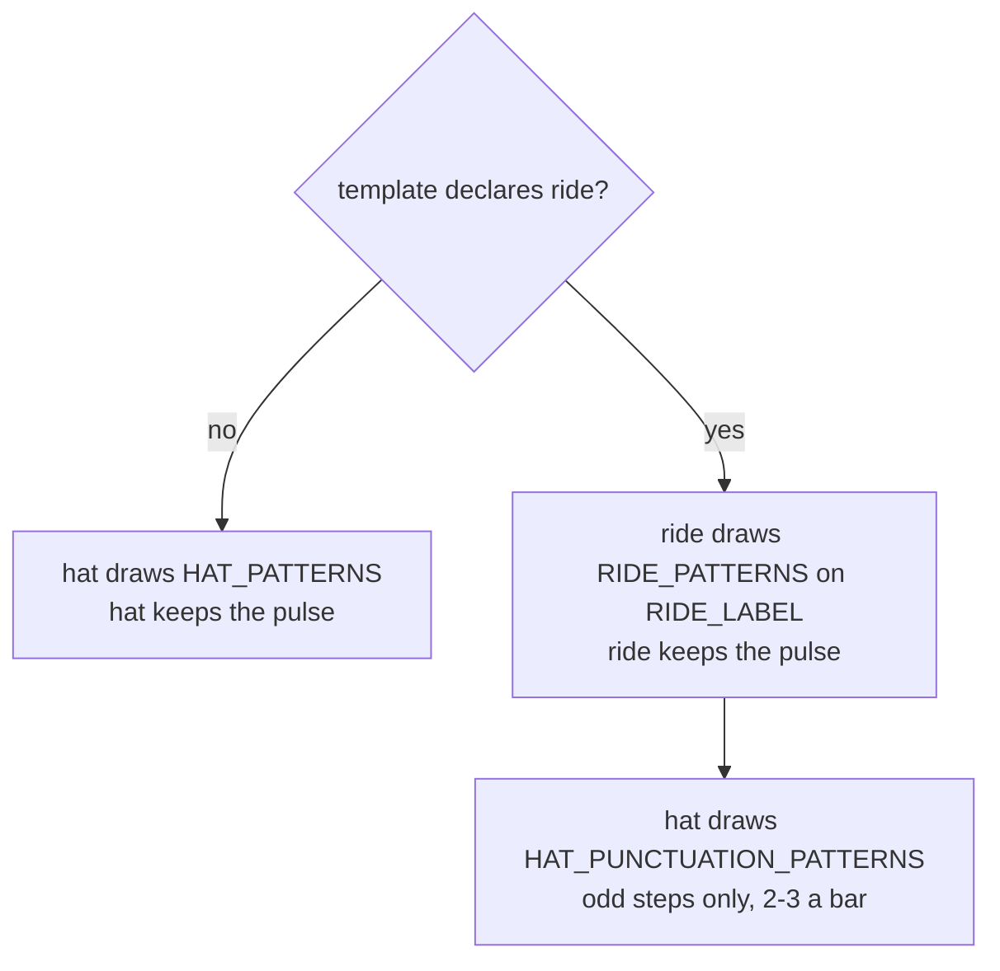

# PRD — Epic 1: A cymbal keeps the time

Feature: [briefing.md](../briefing.md) · [roadmap.md](../roadmap.md)

## Summary

Source a jazz ride from a library chosen for it, prepare it and three other new
percussion voices into the sample pack, and render one `shuffle` groove where
the cymbal carries the pulse and the hi-hat has dropped to punctuation. Nothing
reaches the app: this epic ends in a listening decision — the cymbal is right and
Epics 2 and 3 follow, or it is not and the feature stops here with the percussion
kept and the ride recorded as another failed candidate.

## Problem

`docs/music.md` documents a ride the code does not have. The voice list at line
37 names it, line 45 states the rule ("the bow, struck with the stick tip — not
the bell, not a crash-ride wash"), the feel table at 140–146 has four feels
riding, `HAT_PUNCTUATION_PATTERNS` is specified at 167 and `RIDE_LABEL` at 314.
In the code, `VoiceName` in `scripts/grooves/types.ts` lists eleven voices with
no ride, there is no `samples/ride/`, and `events.test.ts:1510` actively asserts
that no backing voice matches `/crash|cymbal|ride/`.

Feature-13 built a ride on MuldjordKit, heard that a rock kit reads as one, and
removed it — and the removal reached the code but not the docs. This epic is the
part of closing that gap that can fail, so it goes first and it goes alone.

## Scope

- audition candidate ride libraries against a rendered `shuffle` groove, before
  anything else is built
- prepare and declare all four new voices in one pass: the ride bow, the ride
  bell, the claves and the cowbell
- freeze the fifteen-voice contract — `VoiceName`, `VELOCITIES`,
  `BACKING_VOICES`, the `voices` keys of `samples/pack.json`
- `RIDE_LABEL` as a new labelled RNG stream, and a subdivision-8 ride pattern
  pool drawn on it
- `shuffle` takes the ride: its `voices`, `gain` and `pan`
- `shuffle`'s hat drops to punctuation
- lift the ride half of the `events.test.ts:1510` ban, keep the crash half
- record the levelling method so Epic 2 applies it rather than re-deriving it
- licence, provenance and `samples/README.md`

**Out of scope**
- `swung-sixteenth` — Epic 2
- the feathered kick — Epic 2, where it reaches both riding feels at once
- re-rendering the catalogue, `grooves.lock.json`, the manifest, the credit line
  in the app — Epic 3. Until then the browser plays the committed MP3s
  unchanged
- **playing** the claves, the cowbell or the ride bell. All three are sourced
  here and played by no template; the styles in
  [new-styles.md](../../new-styles.md) are what will reach for them
- `half-time` and `open-ballad`. They do not ride in this feature at all
- a crash cymbal. Its tail crosses the loop point, and the downbeat after a fill
  is position zero of the file
- brushes on the snare. A new articulation family from a new library, its own
  feature

## Requirements

### Sourcing and the stopping decision

- **R1** — Candidate ride libraries are shortlisted **CC0 first, CC-BY
  accepted**, and nothing else. A candidate under any other licence is not
  auditioned, whatever it sounds like.
- **R2** — Every candidate is prepared with the pack's existing recipe and heard
  **under a rendered `shuffle` groove**, not in isolation. A cymbal auditioned
  solo is the mistake feature-13 made: MuldjordKit's ride is a fine ride and a
  wrong one for this kit at this tempo, and only the mix says so.
- **R3** — Audition renders are written to a scratch directory via the CLI's
  `--out` option. `public/grooves/` is not touched by this epic.
- **R4** — A candidate that no round-robin alternates can be built from is
  rejected without an audition. A ride ping is the most-repeated event in the
  file — eight or more a bar over four bars — and one identical sample at one
  level is the machine-gun artefact feature-9 spent a whole feature undoing.
- **R5** — If no candidate passes the listening decision, this epic ends in a
  report naming every library auditioned and why each failed. The ride stays out
  of `VoiceName` and out of the pack; the claves, the cowbell and the ride bell
  are still prepared, declared and committed; Epics 2 and 3 do not run. A wrong
  ride recorded as a rejected candidate is worth more than a wrong ride shipped.

### The pack

- **R6** — Four voices are prepared in one pass: `ride` (the bow), `rideBell`,
  `claves` and `cowbell`. Preparation follows the pack's committed recipe — mono
  downmix, capped at that voice's own decay, 80 ms fade at the cap, 44.1 kHz
  16-bit FLAC, **no front trim, not normalised**. The `ffmpeg` invocation used
  for each is written into `samples/README.md`.
- **R7** — VCSL is checked for the claves and the cowbell before any other
  library is considered. It is already a CC0 source in this pack and is a broad
  percussion library; a second source for a voice VCSL already holds is a
  licence obligation bought for nothing.
- **R8** — Every new voice ships real round-robin alternates across its velocity
  layers, declared in `samples/pack.json`, and every layer declares an explicit
  `nominalVelocity` derived by the method already recorded under *Levelling* in
  `samples/README.md` — the top layer's midpoint scaled by the ratio of this
  layer's measured peak to the top layer's. No layer defaults to its band
  midpoint.
- **R9** — `samples/provenance.json` gains one row per committed file, carrying
  its source library, its path inside that library, its licence and what was
  done to it. Any licence text a new library requires is committed beside the
  three already there.
- **R10** — `samples/README.md`'s source table and voice-mapping table are
  rewritten to include the new libraries and the four new voices, and the
  paragraph headed "**The pack has no ride, and that is a decision rather than an
  oversight**" is replaced by what the pack now has and why that library was
  chosen over the ones rejected.

### The voice contract

- **R11** — `VoiceName` in `scripts/grooves/types.ts` reaches its final shape in
  this epic: fifteen voices, the eleven that exist plus `ride`, `rideBell`,
  `claves` and `cowbell`. Epic 2 builds against it and does not re-derive it.
- **R12** — Every total `Record<VoiceName, …>` in the generator is completed for
  all four new voices in this epic, `VELOCITIES` in `events.ts` included, so
  adding a voice to a template later is a template edit and not a type error.
- **R13** — `ride` is added to `BACKING_VOICES`. It is part of the backing track
  and occupies no register a soloist would — the rule the list exists to hold is
  about the lead register, not about cymbals.
- **R14** — `events.test.ts`'s "has no crash to write there" assertion is
  rewritten to ban `crash` and `cymbal` while permitting `ride`. The crash half
  of the ban is not weakened: no voice, no event and no fill phrase may name a
  crash.

### The figure and its randomness

- **R15** — Ride figures are drawn from a pattern pool on a new labelled stream,
  `RIDE_LABEL`, never on `rhythmRng`. A draw inserted into `rhythmRng` would
  re-roll the rhythm of all thirty grooves, including the four feels that will
  never ride.
- **R16** — The pool holds three figures for subdivision 8, denser than hat
  punctuation by construction, because on a riding feel the ride *is* the pulse.
- **R17** — Ride accents run on their own shallow cycle of three, coprime with
  the bar. A ride whose accent pattern locks to the bar is a machine; one that
  wavers hard is a drummer losing time. Shallower than `HAT_ACCENTS` because a
  wavering pulse is worse than a flat one.
- **R18** — A feel that declares `ride` draws its hat figure from
  `HAT_PUNCTUATION_PATTERNS` instead of `HAT_PATTERNS`, as a single `pick` at the
  position `rhythmRng` already draws the hat at. The number of draws on
  `rhythmRng` and their order are unchanged, so every feel that does not ride
  renders byte-identically.
- **R19** — Hat punctuation resolves onto the feel's own subdivision by the
  odd-preserving mapping `ghostSteps` already implements, not by `gridSteps`.
  `gridSteps` rounds: at subdivision 8 it maps 16-grid step 3 to step 2 and step
  7 to step 4 — both on the beat, which is exactly where a hat that has handed
  the pulse over may not be.

### `shuffle` takes the ride

- **R20** — `shuffle` is the only feel this epic changes. Its `voices` gains
  `ride` and its `gain` and `pan` gain an entry for it. Its `flavours`,
  `tempoRange`, `subdivision`, `swing` and `passes` are untouched — every one of
  those is a re-key of the feel's answers, and this feature moves no answers.
- **R21** — `shuffle` keeps `hatClosed`. The ride takes the timekeeping; the hat
  stays in the kit at punctuation duty.
- **R22** — The ride sits under the snare and above the hat it replaced. Which
  half of the level carries what is decided and recorded: the sample's own
  recorded loudness lives in `pack.json` per layer as `nominalVelocity`, the mix
  position lives in the template's `gain` in dBFS. A pack error corrected in a
  template's gain becomes five more corrections in the other five templates, so
  the pack is fixed first and only then the template.
- **R23** — A rendered `shuffle` groove passes all seven checks of the quality
  gate, the density band `16–38` events per bar included.

### The listening decision

- **R24** — Epic 1 is not done until a person has played a rendered `shuffle`
  groove and said the cymbal is right. Nothing in the repo can hear: the gate
  measures loudness, peak, silence, seams, harmony, off-scale pitches and
  density, and a rock ride passes all seven. This is the check feature-13
  failed, and it failed it late.
- **R25** — The listening hand-off names the file paths to play and what to
  listen for — that a cymbal keeps the time, that the hat marks two or three
  points a bar, that nothing rings across the loop seam, and that it reads as a
  jazz drummer rather than a rock one. It does not report that the result sounds
  good.

## Behaviour details

Who keeps time, per feel, after this epic:

Both branches spend exactly one `rhythmRng` draw on the hat, at the same point in
the stream. That is what keeps the nineteen grooves this feature does not touch
byte-identical.

## Acceptance criteria

- **AC1** (R11, R12) — Given the generator's types, `VoiceName` holds fifteen
  members including `ride`, `rideBell`, `claves` and `cowbell`, and
  `npm run test:gen` type-checks with no `Record<VoiceName, …>` left incomplete.
- **AC2** (R13, R14) — Given `BACKING_VOICES`, `ride` is a member; given every
  template rendered at every seed, no event's voice matches `/crash|cymbal/`,
  and no fill phrase names one.
- **AC3** (R6, R8) — Given `samples/pack.json`, each of the four new voices
  declares at least one velocity layer, every layer declares an explicit
  `nominalVelocity`, and every layer lists more than one file.
- **AC4** (R9) — Given `samples/provenance.json`, every committed file under the
  four new voice directories has a row naming its source, source path, licence
  and modifications; `samples/pack.test.ts`'s attribution assertion passes for
  every non-CC0 row.
- **AC5** (R1) — Given `provenance.json`, every row's `licence` is `CC0` or
  `CC-BY-4.0`.
- **AC6** (R10) — Given `samples/README.md`, the sentence "The pack has no ride"
  is absent, the source table names every library the pack draws on, and the
  voice-mapping table has a row for each of the fifteen voices.
- **AC7** (R20, R21) — Given the `shuffle` template, `voices` includes both
  `ride` and `hatClosed`, `gain` and `pan` have a `ride` entry, and
  `tempoRange`, `subdivision`, `swing`, `passes` and `flavours` are identical to
  their committed values.
- **AC8** (R15) — Given a `shuffle` groove built at any seed, its ride steps are
  a member of the subdivision-8 ride pool, and rebuilding it with the ride pool
  reordered changes the ride figure and changes no kick, bass, comp, ghost or
  bongo step of any feel.
- **AC9** (R18, R19) — Given a `shuffle` groove at any seed, every `hatClosed`
  step is odd, there are two or three of them per bar, and none of them
  coincides with a ride step.
- **AC10** (R18) — Given each of `straight-funk`, `bright-straight`,
  `half-time`, `open-ballad` and `swung-sixteenth` at every catalogue seed, the
  built events are identical to those built before this epic — same voices, same
  steps, same velocities, same `MusicMeta`.
- **AC11** (R16) — Given a riding feel at any seed, its ride step count per bar
  exceeds its hat step count per bar.
- **AC12** (R23) — Given a rendered `shuffle` groove, all seven gate checks pass
  and its events-per-bar sits inside `16–38`.
- **AC13** (R8) — Given the same `shuffle` groove rendered twice, the two files
  are byte-identical; given one render, the ride alternates chosen differ between
  passes.
- **AC14** (R3) — Given an audition render, `public/grooves/` is unmodified and
  `grooves.lock.json` still verifies.
- **AC15** (R5) — Given a run in which no candidate passes, `VoiceName` holds
  fourteen members and no `ride`, the pack declares `claves`, `cowbell` and
  `rideBell` and no `ride`, `events.test.ts` still bans `ride`, and the report
  names every library auditioned with its reason for rejection.
- **AC16** (R24) — The epic reports done only after a listening sign-off on a
  rendered `shuffle` groove has been recorded.

## Dependencies

Nothing precedes this epic. What it hands forward:

- `VoiceName`, fifteen members, final — Epics 2 and 3 add none.
- `samples/pack.json`'s `voices` keys, final.
- `RIDE_LABEL` and the ride pattern pool's shape, for Epic 2 to add its
  subdivision-16 figures to.
- The levelling method, recorded in `samples/README.md`, for Epic 2 to apply to
  `swung-sixteenth` without re-deriving it.
- A flag on whether a CC-BY library entered the pack, which is what decides
  whether Epic 3 touches `src/`.

## Assumptions

- **The ride is the bow, not the bell.** `rideBell` is sourced and played by no
  template in this feature.
- **The bell, the claves and the cowbell need no pattern pool, no RNG stream and
  no template entry** in this epic. They are pack rows and type members only.
- **The claves and the rim never sound in the same groove.** A briefing rule with
  nothing to bind yet, since no template plays claves. It is recorded in
  `docs/music.md` in Epic 2 so the styles that reach for the claves inherit it.
- **The ride's `lean` is a tuning knob under the listening sign-off**, like
  every other humanize value. Proposed and heard, not asserted.
- **The exact ride figures are the musician's call.** Three for subdivision 8 —
  eighths, eighths over a quarter skeleton, and a swung-eighth figure is the
  shape `docs/music.md:167` already sketches, and the musician may replace it.
- **A candidate's velocity-layer count follows what the library recorded.** Two
  layers with alternates is acceptable where that is all the recording supports,
  as `rim` and `hatOpen` already are; inventing a layer split the recording does
  not carry is the same erasure normalising would be.

## Open questions

Tick one option per question (`- [x]`), or write your own, then re-run
`/brainstorm feature-24 epic-1`.

### Q1. Where does a riding feel's hi-hat go?

`docs/music.md:167` says every punctuation step is odd — off-beats only, so the
hat cannot mark a position the ride is using. The jazz idiom is the opposite: the
hi-hat foot plays **beats 2 and 4**, on the beat, under the snare. Both are
"punctuation" and they are different sounds.

- [ ] A) Beats 2 and 4 — the foot hat *(recommended — it is what a jazz drummer's
      left foot does, and the briefing asks for "a jazz ride" and a hat "dropped to
      punctuation", which is that. Nothing in the roadmap or briefing requires the
      off-beat rule; `docs/music.md`'s line was written before any ride existed and
      Epic 2 is already correcting that document downwards. No persona bearing —
      Sam hears one groove and does not read the rule)*
- [ ] B) Odd steps only, 2–3 a bar, as `docs/music.md:167` states — keeps the
      document and the code agreeing without moving either
- [ ] C) Beats 2 and 4 on `shuffle`, off-beats on `swung-sixteenth` — the foot hat
      belongs to the swung-eighth idiom, and a sixteenth feel at 110 is closer to
      fusion
- [ ] D) Draw from a pool that holds both shapes, so a seed decides

### Q2. What happens to the open hat on a riding feel?

`DEFAULT_PLACEMENT` fixes the open hat on 16-grid step `[14]` — the "and" of
beat 4, a pickup into the next bar. It is not drawn; it is placement, like the
backbeat.

- [ ] A) Keep it exactly where it is *(recommended — it is one hit a bar in the
      pickup position, not a statement of the pulse, so it does not compete with
      the ride. It is also `DEFAULT_PLACEMENT`, and `docs/music.md` calls placement
      the part that is not drawn because "a groove whose backbeat moves is a
      different groove". Cheapest thing that can be wrong, and the listening pass
      will say so)*
- [ ] B) Drop it on riding feels — a jazz kit's open hat is the foot opening under
      the ride, not a stick hit on the "and" of 4, and one hat sound is enough
      beside a cymbal
- [ ] C) Keep it but pull its gain down on the riding feels only, so it reads as a
      colour rather than a pickup
- [ ] D) Move it to the "and" of 2 on riding feels — an open-hat splash mid-bar,
      away from the ride's densest region

### Q3. Does the ride play through the fill bar?

The last bar of the final pass plays a fill, and on loops of three or more passes
the middle pass's last bar plays a thinned variation. `DEFAULT_FILL` resolves on
the snare.

- [ ] A) The ride keeps playing its figure straight through the fill
      *(recommended — the roadmap's Epic 1 scope adds a pattern pool and says
      nothing about fills, and a cymbal that stops for a bar is a hole in the
      pulse the loop returns from. A jazz drummer's ride is the one thing that
      does not stop for the fill. No persona bearing; the reason is musical)*
- [ ] B) The ride drops out for the fill bar and returns on the downbeat — the
      fill is the snare's bar, and the cymbal re-entering is what marks the loop
      point
- [ ] C) The ride thins to the quarter-note skeleton for the fill bar, so the
      pulse survives but the snare has room
- [ ] D) The ride plays a crash-substitute accent on the downbeat after the fill —
      the loudest ride hit of the loop, standing in for the crash the pack refuses
      to hold

### Q4. When does the audition stop and the feature stop with it?

R5 makes "no cymbal passes" a real outcome. What triggers it needs to be
decidable rather than a matter of stamina.

- [ ] A) Three candidate libraries prepared and heard; if none passes, stop and
      report *(recommended — the briefing says "find the sample library first …
      auditioned before anything is built", which makes this a bounded search
      rather than an open one, and three is enough to tell a systematic problem
      from an unlucky pick. No persona bearing; the reason is that an unbounded
      audition has no failure state and so cannot report one)*
- [ ] B) One candidate, chosen carefully — if it fails, the failure is
      information and stopping immediately is cheaper than a second render
- [ ] C) Keep auditioning until one passes; there is a CC-BY jazz ride out there
      and the feature is worth the search
- [ ] D) Three candidates, and if none passes, fall back to the least-wrong one
      with its gain pulled well down rather than shipping no ride at all
