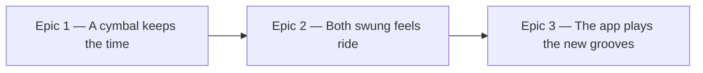

# Roadmap — Swing ride

Source: [briefing.md](briefing.md)

## Overview

`docs/music.md` already documents a ride cymbal: the voice list at line 37, the
rule at line 45 ("the bow, struck with the stick tip — not the bell, not a
crash-ride wash"), four of the six feels declaring it at lines 140–146,
`HAT_PUNCTUATION_PATTERNS` at 167, and `RIDE_LABEL` as its own RNG stream at
314. **None of it is in the code.** `VoiceName` in `scripts/grooves/types.ts`
lists eleven voices and no ride, there is no `samples/ride/`, and
`events.test.ts:1510` actively asserts that no backing voice matches
`/crash|cymbal|ride/`. Feature-13 built a ride on MuldjordKit, heard that a rock
kit reads as one, and removed it — and the removal never reached the docs.

This feature closes that gap. It sources a jazz ride from a library chosen for
it, hands the timekeeping to it on the feels that actually swing, drops their
hat to punctuation, feathers the kick underneath, and re-cuts those grooves so
the app plays a cymbal instead of a hi-hat.

The six open questions are answered and folded in. **Two feels ride, not
four**: `shuffle` at swing 0.64 and `swung-sixteenth` at 0.44. `half-time`
(0.28) and `open-ballad` (0.02) are straight in all but name and keep their
hats — so the docs' claim of four is corrected *down* to what the code will do,
rather than the code being built up to the docs. The **claves, the cowbell and
the ride bell are all sourced** in Epic 1's single pack pass and played by no
template. The licence bar is **CC0 preferred, CC-BY accepted** with the app's
sample credit extended. And if no cymbal passes the listening test, **the
feature stops after Epic 1** and reports, keeping whatever percussion was
sourced. The **feathered kick goes exactly as far as the ride does** and no
further, so `half-time` and `open-ballad` take nothing from this feature at all.
A CC-BY ride library is credited on **one line beside DrumGizmo**, in the place
the app already credits samples.

That halves the blast radius: **11 of the 30 grooves** are re-rendered — six
`shuffle` and five `swung-sixteenth` — and the other 19 must come out
byte-identical.

Value arrives in one place and late: until the catalogue is re-rendered and
committed, the browser plays the same MP3s it plays today. So Epic 1 is the
listening decision — one groove on the new cymbal, which is the earliest point
anyone can say whether the library was the right pick, and the point at which
feature-13's mistake would show up again. Epic 3 is the moment the app changes.

**The harmony does not move.** Every re-rendered groove keeps its id, its uuid,
its bpm, its root, its flavour, its chord and its progression. Only the audio
changes — which does mean a groove Sam played last month sounds different if
they open its share link, with the same answer behind it.

## Epics

### Epic 1 — A cymbal keeps the time

**Visible when done:** `npm run grooves -- <a shuffle groove>` renders a groove
where a ride carries the pulse and the hi-hat has dropped to punctuation, and it
sounds like a jazz drummer rather than a rock one. The quality gate passes. A
listening sign-off says the cymbal is right, or says it is not and the feature
stops here.
**Depends on:** none
**Parallel with:** none — every later epic needs the cymbal to exist

**Scope**

- **Source the ride first, and audition before building.** MuldjordKit has two
  rides and both read as rock; VCSL has none at all
  (`scripts/grooves/samples/README.md` says so). This needs a different library.
  Shortlist **CC0 first, CC-BY accepted** — nothing more permissive is required,
  and CC0 alone may leave nothing to pick. Prepare candidates with the pack's
  existing recipe and listen to each under a rendered shuffle groove before
  anything else in this epic is written.
- **If no cymbal passes, the feature stops here.** Epic 1 ends in a report
  naming what was auditioned and why each failed; the ride stays out, the
  percussion sourced below is kept and committed, and Epics 2 and 3 do not run.
  This is feature-13's outcome repeated deliberately rather than accidentally —
  a wrong ride recorded as a candidate beats a wrong ride shipped.
- **Write the pack once.** Sample preparation is one job, so every new voice
  this feature needs is acquired and declared in this pass: **the ride bow, the
  ride bell, the claves and the cowbell.** Mono downmix, capped per voice at
  that voice's decay, 80 ms fade at the cap, 44.1 kHz 16-bit FLAC, no front
  trim, **not normalised**. The invocation is written out in `samples/README.md`
  and is the shape to copy. Check VCSL for the claves and the cowbell before
  looking further — it is already a CC0 source in this pack and is a broad
  percussion library.
- **Round robins are not optional here.** A ride ping repeating identically over
  a four-bar loop is the machine-gun artefact feature-9 spent a whole feature
  undoing, and the claves are worse — a bare wood transient with nothing masking
  it. Every new voice gets real alternates across velocity layers, and the pack
  declares them.
- **Freeze the voice contract.** `VoiceName` in `types.ts` and the `voices` keys
  of `samples/pack.json` reach their final shape in this epic — fifteen voices,
  four of them new — so Epic 2 builds against them without re-deriving them.
- **One feel, and it is `shuffle`.** Swing 0.64 at 78–92 bpm is where a ride's
  job is most exposed; if the cymbal is wrong, it is wrong here first. Its
  `voices`, `gain` and `pan` gain the ride; its `flavours`, `tempoRange`,
  `subdivision`, `swing` and `passes` are untouched.
- **The ride figure and its RNG stream.** A ride pattern pool for subdivision 8,
  drawn on `RIDE_LABEL` — a new labelled stream, never `rhythmRng`, because
  inserting a draw there would re-roll the rhythm of all thirty grooves
  including the feels that never ride (`docs/music.md`, "What must never
  change").
- **The hat drops to punctuation on this feel**, and the ban lifts:
  `events.test.ts:1510`'s `/crash|cymbal|ride/` assertion is rewritten to ban
  crash and cymbal wash while permitting the ride.
- **Levelling.** The ride sits under the snare and above the hat it replaced;
  record which half of the level absorbs what — the sample's own recorded
  loudness (pack, per layer, `nominalVelocity`) or the mix position (template
  `gain`, dBFS) — so Epic 2 applies the method to `swung-sixteenth` without
  re-deriving it.
- **Licence and provenance.** `provenance.json` gains a row per file;
  `samples/README.md`'s source table and voice-mapping table are rewritten, and
  the paragraph that currently explains why the pack has no ride is replaced by
  what it now has. Any new licence text is committed, and a CC-BY source is
  flagged for Epic 3's credit line.

**Out of scope**

- `swung-sixteenth` — Epic 2.
- The feathered kick — Epic 2, where it applies to both riding feels at once.
- Re-rendering the catalogue, `grooves.lock.json`, the manifest — Epic 3. Until
  then the app is untouched and still plays the committed MP3s.
- Using the claves, the cowbell or the ride bell in any template. All three are
  sourced here and played nowhere; the styles in
  [new-styles.md](../../new-styles.md) are what will reach for them.
- `half-time` and `open-ballad`. They do not ride in this feature at all.
- A crash cymbal. The tail crosses the loop point and the briefing rules it out.

**Validation**

- Render a shuffle groove and listen: a cymbal keeps the time, the hat marks
  two or three points a bar, nothing rings across the loop seam.
- Render the same groove twice and confirm the ride's alternates differ between
  passes, and that the two renders are otherwise byte-identical.
- Render one groove from a feel that does **not** ride and confirm it is
  byte-identical to the committed one — the new RNG stream cost it nothing.
- `npm run test:gen` green, including `samples/pack.test.ts`'s attribution
  assertion for any non-CC0 row.

### Epic 2 — Both swung feels ride

**Visible when done:** `shuffle` and `swung-sixteenth` both render with a ride
keeping time, a hat on punctuation and a kick feathering quarter notes
underneath — and the other four feels are byte-identical to what they render
today.
**Depends on:** Epic 1 (the pack, `VoiceName`, `RIDE_LABEL`, the levelling
method)
**Parallel with:** none

**Scope**

- **`swung-sixteenth` takes the ride.** Its `voices`, `gain` and `pan` are
  re-derived by Epic 1's method — a ride at 106–116 bpm over swung sixteenths is
  not the same mix position as one at 85 over a shuffle.
- **Ride figures for subdivision 16**, alongside Epic 1's 8. The pool is drawn
  on `RIDE_LABEL`.
- **`HAT_PUNCTUATION_PATTERNS`** as a real pool — three patterns, every step
  odd, two to three a bar, per `docs/music.md:167`. A feel that declares a ride
  hands it the pulse and the hat may not restate it; a hat playing every
  off-beat would still be marking the pulse.
- **Feather the kick under the two riding feels, and only those.** Quarter
  notes at low velocity, no new sample. This is half of what makes a swung feel
  read as jazz, and it is a velocity decision rather than a pattern one — it
  must not make the kick louder or busier in the mix, only present. Feathering
  and the ride are one gesture, so the kick reaches exactly the feels the cymbal
  does: `half-time` and `open-ballad` keep the kick they have.
- **The four non-riding feels change by exactly nothing.**
  `bright-straight`, `straight-funk`, `half-time` and `open-ballad` keep their
  voices, their kick and their hat, and their renders are asserted
  byte-identical.
- **Correct `docs/music.md` down to two.** The document claims four feels ride;
  two do. The ride table at 140–146, the "who keeps time" section at 174 and the
  pattern-pool table are rewritten to what the code does, and the sentence
  "Four of the six ride" goes with them. The feathered kick and the four new
  percussion voices are documented at the same time. This is the direction the
  briefing asks for — docs and code agreeing — arrived at by moving the docs.

**Out of scope**

- Re-rendering the catalogue — Epic 3.
- `half-time` and `open-ballad` riding, or being feathered. Settled: they take
  nothing from this feature, and their renders must not move.
- Brushes on the snare. `open-ballad` at 62–74 with sticks is the wrong sound
  and the briefing says so, but a brush set is a new articulation family from a
  new library — its own feature.

**Validation**

- Render one groove per feel. `shuffle` and `swung-sixteenth` have a ride; the
  other four do not, and their bytes match the committed renders.
- A test asserts that no feel declaring a ride has a hat on every off-beat, and
  that every riding feel's kick carries quarter notes below the ghost threshold.
- A test asserts that exactly two templates declare `ride`, so the docs' old
  claim of four cannot creep back in as code.
- `npm run test:gen` green.
- A listening pass across both: the sixteenth feel's ride is not the shuffle's
  ride at a higher tempo.

### Epic 3 — The app plays the new grooves

**Visible when done:** Sam opens the app, hits play on a shuffle or a
swung-sixteenth groove, and hears a cymbal keeping time — the first point in
this feature where anything reaches a player.
**Depends on:** Epic 2
**Parallel with:** none

**Scope**

- **Re-render the catalogue.** `npm run grooves`, all thirty. The **11** grooves
  belonging to `shuffle` (6) and `swung-sixteenth` (5) get new audio; the other
  **19** must come out byte-identical.
- **The harmony is asserted unmoved.** Every groove keeps its id, uuid, bpm,
  root, flavour, chord and progression; the manifest's harmonic fields are
  compared byte-for-byte against the current ones before the audio is committed.
- **`grooves.lock.json` and `npm run grooves:verify`**, which runs on
  `prebuild` — the mechanism that exists to catch exactly the violation this
  epic risks.
- **The gate passes on all thirty**, including the loudness window
  (`LOUDNESS_FLOOR_DB` −29 to `LOUDNESS_CEILING_DB` −20 in `gate.ts`). A cymbal
  added to eleven grooves moves their loudness, and a groove that now fails is a
  levelling error rather than a gate to widen.
- **The credit line, if a CC-BY library was used.**
  `src/lib/snippets/en/puzzle.ts:20` carries `Drum samples provided by
  DrumGizmo.org`, sits on the groove box since feature-22, and is asserted in
  `snippets.test.ts:133`. A CC-BY ride library adds an obligation that follows
  the committed MP3s into the app. **One line names both sources** — the
  existing string grows to name the new library alongside DrumGizmo, and its
  test grows with it. The credit does not move off the groove box, does not
  become a stacked pair, and does not become a generic "and others"; a footer is
  a separate candidate idea and stays one. A CC0 ride library changes nothing
  here. This is the feature's only touch of `src/`.
- **A listening sign-off on all eleven changed grooves**, one at a time. This is
  the check feature-13's ride failed, and it failed it late.

**Out of scope**

- Any change to the puzzle, the guessing flow or the reveal. The answers are
  identical; only what they sound like moved.
- Minting new grooves. The catalogue stays at thirty.

**Validation**

- `npm run grooves` then `npm run grooves:verify` clean.
- The manifest diff shows exactly 11 changed audio hashes and no changed
  harmonic field.
- `npm test`, `npm run test:gen`, `npm run lint`, `npm run build` green.
- Open the app, play a shuffle groove, hear the ride. Open a share link to a
  `half-time` groove and hear no difference at all.

## Dependency map

## Execution waves

- **Wave 1:** Epic 1
- **Wave 2:** Epic 2 — needs the pack, `VoiceName` and the levelling method
- **Wave 3:** Epic 3 — needs both templates final before a render is worth
  committing

There is no parallelism in this feature, and pretending otherwise would cost
more than it bought. One pack, one `events.ts`, one render: Epic 2 cannot pick a
ride's mix position before the cymbal exists, and Epic 3 re-renders whatever
Epic 2 last changed. The one genuinely separable slice — sourcing the claves,
the cowbell and the bell — is folded into Epic 1 rather than given an epic of
its own, because writing the sample pack twice is worse than writing it once and
nobody can see a clave that no template plays.

Epic 1 stays a single-feel epic rather than merging into Epic 2, because the
decision to stop is attached to it: one feel is the cheapest render that can
prove the cymbal wrong.

## Assumptions

- **Past grooves change what they sound like.** The briefing accepts this. Their
  answers, ids and uuids do not move, so a share link still opens the same
  puzzle — it just plays a better take of it.
- **The catalogue stays at thirty.** No minting in this feature.
- **The ride is the bow, not the bell**, on both feels that ride — the rule
  `docs/music.md:45` already states. The bell is sourced but plays nowhere; it
  is for the styles in `new-styles.md`.
- **`swung-sixteenth`'s ride is a jazz ride, not a fusion one.** At swing 0.44
  over sixteenths the idiomatic pattern is not the shuffle's triplet ping, and
  the `musician` decides what it is during Epic 2. If that decision comes back
  as "this feel does not want a ride either", the feature narrows to one riding
  feel and Epic 2 becomes the docs correction alone.
- **Feathering follows the ride rather than the swing value.** It is half of
  one jazz gesture, not a separate improvement a slow feel could take on its
  own — so a feel that does not ride does not feather.
- **`bright-straight` keeps its bongos and gains nothing.** It is the one feel
  carrying the bongo today and this feature does not touch it.
- **`half-time` and `open-ballad` are recorded as considered and declined** in
  `docs/music.md`, not silently dropped — so the next person to read the table
  does not re-add them as an oversight.
