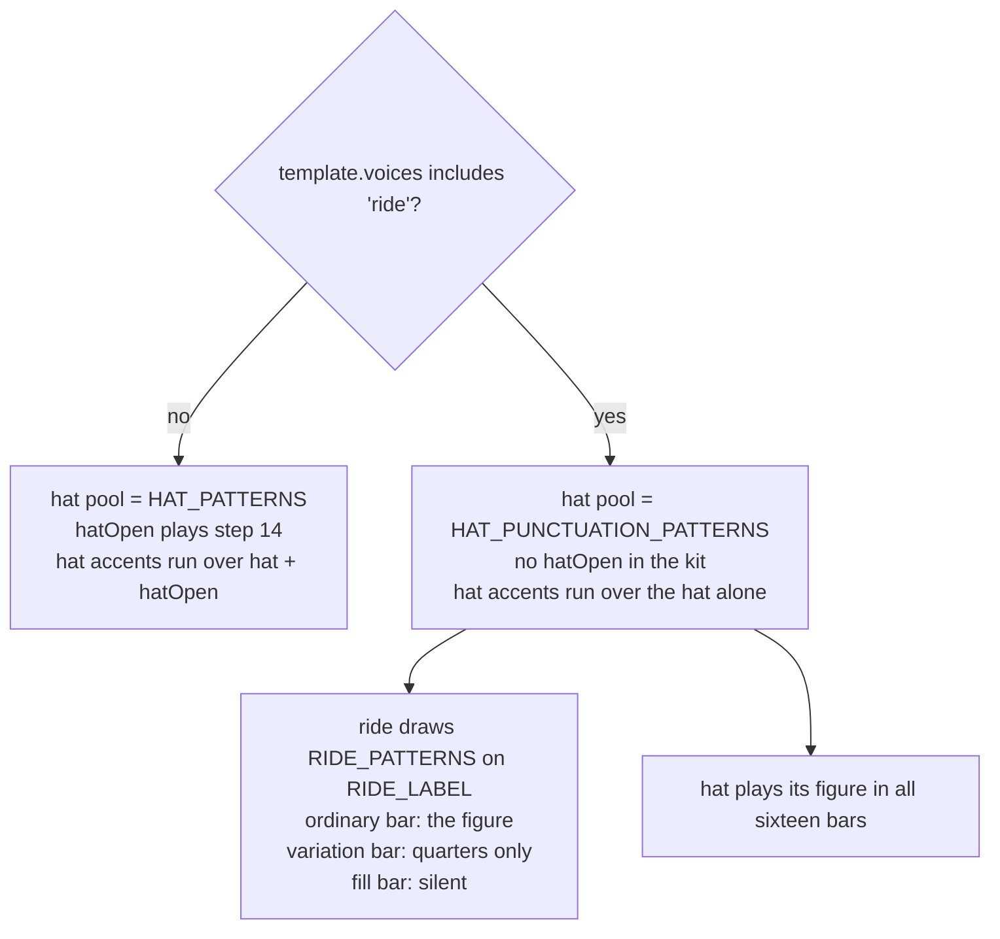

# Tech spec — Epic 1: A cymbal keeps the time

PRD: [../prd/epic-1-a-cymbal-keeps-the-time.md](../prd/epic-1-a-cymbal-keeps-the-time.md) ·
Roadmap: [../roadmap.md](../roadmap.md)

## Approach

The epic has a branch in it, so the plan is built around getting to the branch
cheaply and being able to walk back from it. Four parallel tracks land the parts
both outcomes keep — the fifteen-name voice vocabulary, a fixture that pins what
the five non-riding feels build today, an audition rig on the CLI, and the two
VCSL percussion voices. One track then writes the ride figure and re-kits
`shuffle`, which is what makes an audition possible at all: a candidate can only
be heard *under a rendered groove* (R2) if the generator already plays one. Only
then does the audition track prepare three candidate libraries into throwaway
pack directories outside the repo and render one shuffle groove per candidate to
a scratch dir. The verdict picks the last wave: ship the cymbal, or revert the
ride and keep the percussion.

The ordering constraint that shapes everything is the byte-identity promise
(R19b, AC10). Nineteen grooves must render exactly as they do today, so the
fixture that proves it has to be captured from an *unmodified* `events.ts` —
which is why it is a track of its own in Wave 1 and not a step inside the
generator work.

## Architecture

### The five moving parts

| Part | Where | What changes |
| :-- | :-- | :-- |
| the vocabulary | `types.ts`, `events.ts` | `VoiceName` derives from a new `VOICE_NAMES` array of fifteen; `VELOCITIES` and `FILL_DURATIONS` gain four rows each |
| the figure | `events.ts` | `RIDE_LABEL`, `RIDE_PATTERNS`, `RIDE_ACCENTS`, `HAT_PUNCTUATION_PATTERNS`, and three branches inside `buildEvents` |
| the kit | `templates/shuffle.ts` | `ride` in, `hatOpen` out, across `voices`, `gain`, `pan` and `humanize.lean` |
| the pack | `samples/**` | four voice directories, four `pack.json` blocks, provenance rows, the README's tables and its ride paragraph |
| the rig | `cli.ts` | `--out`, `--pack` and `--only`, so an audition renders nowhere near `public/grooves/` |

### How a riding feel is different, and how it is not



Both branches take **exactly one** `pick` off `rhythmRng` at the position the hat
is drawn today, in the same order, with the same number of draws before and
after it. Both pools hold three members, so the same random value selects the
same index either way. That is the whole of R19b: the four straight feels draw
what they draw today, byte for byte.

### Why the audition cannot come first, and what comes first instead

R2 forbids auditioning a cymbal in isolation, so a candidate cannot be heard
until `shuffle` plays a ride and `buildEvents` writes a ride line. The audition
is therefore Wave 3, not Wave 1 — but nothing is *committed* on a candidate's
behalf before it is heard. Candidates live in throwaway pack directories under
`os.tmpdir()`, assembled by copying `samples/`, dropping the candidate's FLACs
into `ride/` and patching a copy of `pack.json`. Nothing under
`scripts/grooves/samples/` moves until the verdict is in, which is also what
keeps `samples/pack.test.ts` green throughout — that suite asserts every audio
file on disk is declared *and* provenanced, so a staged candidate inside the
repo would fail it.

### The lock is not neutral about `pack.json`

`grooves.lock.json` carries `packSha256`, and `npm run grooves:verify` — which
runs on `prebuild` — compares it to `samples/pack.json`. The moment the pack
declares `claves`, `npm run build` fails with `pack-stale`. The sanctioned
refresh is `npm run notes`: it re-renders the reference notes from the `comp`
voice (untouched, so the MP3s come out byte-identical) and rewrites `packSha256`
into the lock. Every track that edits `pack.json` ends by running it and
asserting that **only** `packSha256` moved. This is not the catalogue re-render
Epic 3 is reserved for; no groove MP3 and no groove hash moves.

### Density, measured rather than hoped for

Today's six shuffle grooves, per bar over sixteen bars:

| groove | bpm | events/bar | hatClosed | hatOpen |
| :-- | --: | --: | --: | --: |
| groove-07 | 91 | 27.31 | 98 | 14 |
| groove-08 | 91 | 23.75 | 98 | 14 |
| groove-19 | 79 | 27.63 | 98 | 14 |
| groove-42 | 84 | 27.00 | 98 | 14 |
| groove-44 | 81 | 23.94 | 98 | 14 |
| groove-52 | 86 | 24.56 | 98 | 14 |

After the change the hat drops from 98 (7 a bar × 14 ordinary bars) to 2–4 a bar
× **16** bars, `hatOpen`'s 14 go, and the ride adds 5–8 a bar × 14 plus 4 in the
variation bar. Worst case low is groove-08 at 23.4/bar; worst case high is
groove-19 at 31.9/bar. Both sit inside `shuffle`'s `16–38` band with room, so
AC12's density check is not a knife edge and the band does not need widening.

## Contracts

Frozen before any track starts. Changing one mid-flight breaks parallel work.

### C1 — the fifteen-voice vocabulary

```ts
// scripts/grooves/types.ts
export const VOICE_NAMES = [
  'kick', 'snare', 'hatClosed', 'hatOpen', 'ride', 'rideBell',
  'rim', 'tomHigh', 'tomLow', 'bongoHigh', 'bongoLow',
  'claves', 'cowbell', 'bass', 'comp',
] as const

export type VoiceName = (typeof VOICE_NAMES)[number]
```

The order matches `docs/music.md`'s voice list with the three new percussion
names appended after the bongos, so Epic 2's docs correction is a smaller diff.
Nothing reads the order at runtime — `voiceOrder` in `events.ts` indexes
`template.voices`, not this — so it is a documentation choice, not a behavioural
one. Deriving the union from the array is what makes AC1 testable at runtime;
the compiler still enforces every total `Record<VoiceName, …>`.

### C2 — the two total records, complete and exported

```ts
// scripts/grooves/events.ts — exported so the contract can be asserted, not just compiled
export const VELOCITIES: Record<VoiceName, { strong: number; medium: number; weak: number }> = {
  …the eleven, unchanged…,
  ride:     { strong: 0.78, medium: 0.62, weak: 0.55 },
  rideBell: { strong: 0.80, medium: 0.66, weak: 0.55 },
  claves:   { strong: 0.70, medium: 0.60, weak: 0.50 },
  cowbell:  { strong: 0.74, medium: 0.62, weak: 0.52 },
}

export const FILL_DURATIONS: Record<VoiceName, number> = {
  …the eleven, unchanged…, ride: 8, rideBell: 8, claves: 1, cowbell: 1,
}
```

The eleven existing rows are byte-identical — a changed row re-renders a feel.
`rideBell`, `claves` and `cowbell` are declared for type totality only (R12);
`FILL_DURATIONS.ride` is never read in this epic, because the ride is silent in
the fill bar. The four new numbers are the musician's tuning knobs under the
Wave 4 sign-off; their *presence* is the contract.

### C3 — the pools and the stream

```ts
// scripts/grooves/events.ts
export const RIDE_LABEL = 'ride'          // frozen from here on — it keys a stream

export const HAT_PUNCTUATION_PATTERNS: number[][] = [
  [4, 12],          // the bare pair — beats 2 and 4
  [4, 12, 14],      // the pair plus a pickup on the "and" of 4, the step hatOpen vacated
  [0, 4, 8, 12],    // all four beats
]

export const RIDE_PATTERNS: Partial<Record<FeelTemplate['subdivision'], number[][]>> = {
  8: [
    [0, 2, 4, 6, 8, 10, 12, 14],   // straight eighths
    [0, 4, 6, 8, 12, 14],          // spang-a-lang
    [0, 4, 6, 8, 12],              // the quarter skeleton with one skip
  ],
}

export const RIDE_ACCENTS = [1, 0.9, 0.95]
export const RIDE_SUSTAIN_SIXTEENTHS = 8
```

Written on the sixteenth grid like every other pool and resolved by `gridSteps`.
`RIDE_PATTERNS` is keyed by subdivision because Epic 2 adds a `16` entry for
`swung-sixteenth`; a riding feel whose subdivision has no entry throws by name
rather than picking from an empty array.

Invariants the tests hold, all of them checkable:

- `HAT_PUNCTUATION_PATTERNS` has exactly three members; every one contains
  16-grid steps `4` and `12`; every one has two to four steps; steps ascending,
  unique, `0 ≤ s < 16`.
- `RIDE_PATTERNS[8]` has exactly three members; every one, gridded onto
  subdivision 8, contains **every quarter-note step** — which is what makes
  R21c's "returns on the downbeat" and R21d's quarter-note variation bar true for
  any drawn figure — and has more steps than the busiest gridded
  `HAT_PUNCTUATION_PATTERNS` member (R16, AC11: minimum 5 against a maximum 4).
- `RIDE_ACCENTS.length === 3`, coprime with the four-beat bar (R17), and
  `Math.min(...RIDE_ACCENTS) > Math.min(...HAT_ACCENTS)` — the machine-checkable
  form of "shallower than `HAT_ACCENTS`".
- `RIDE_LABEL` is distinct from `MUSIC_LABEL`, `RHYTHM_LABEL`, `GHOST_LABEL` and
  `BONGO_LABEL`.

### C4 — what `buildEvents` does

```
rides     = template.voices.includes('ride')
hatSteps  = grid(pick(rhythmRng, rides ? HAT_PUNCTUATION_PATTERNS : HAT_PATTERNS))
rideSteps = rides ? grid(pick(rngFor(`${t}:${seed}:${RIDE_LABEL}`), RIDE_PATTERNS[subdiv])) : []
hatLine   = unique(hatSteps ++ (plays('hatOpen') ? hatOpenSteps : []))     // R21b
quarters  = steps s in [0, subdiv) with s % (subdiv / 4) === 0
for each bar, role = 'fill' | 'variation' | null:
  if role !== null:  emit the phrase
                     if rides: emit hatClosed at hatSteps                  // R21e
                               if role === 'variation': emit ride at quarters   // R21d
                                                                           // 'fill': no ride — R21c
  else:              …every existing line, unchanged…
                     if rides: emit ride at rideSteps
```

Ride events carry `RIDE_SUSTAIN_SIXTEENTHS` as their duration and take their
velocity from `accentedVelocity`, which gains a `ride` branch reading a
`rideAccents` map built over `rideSteps` in order. Nothing else about the draw
order, the bass walk, the comp voicing or the humanize passes moves.

`phraseForBar` is refactored into a `barRole(pass, barInPass): 'fill' |
'variation' | null` plus a lookup, so the two riding branches can tell the bars
apart. That refactor changes no behaviour for any feel.

### C5 — the `shuffle` template

```ts
voices: ['kick', 'snare', 'hatClosed', 'ride', 'tomHigh', 'tomLow', 'bass', 'comp'],
humanize: { timingMs: 16, velocity: 0.13, lean: { snare: 14, hatClosed: -4, ride: -2 }, driftDepth: 0.007 },
gain: { tomHigh: -12, tomLow: -11, kick: -10, snare: -7, hatClosed: -7, ride: -11, bass: 1, comp: -4 },
pan:  { tomHigh: -0.22, tomLow: 0.26, kick: 0, snare: 0.06, hatClosed: -0.32, ride: 0.30, bass: 0, comp: 0.28 },
```

`tempoRange`, `subdivision`, `swing`, `flavours`, `passes` and `density` are
byte-identical to the committed values (AC7). The three `ride` numbers are
starting values so Wave 2 compiles and Wave 3 has something to hear; Wave 4
settles them under the sign-off. `+0.30` puts the ride to the right, which is
where it sits from the drummer's seat — the same perspective the toms already
use (`tomHigh −0.22`, `tomLow +0.26`).

### C6 — the audition rig

```
npm run grooves -- [--only <id>]… [--out <dir>] [--pack <dir>]
```

- `--out <dir>` — audio to `<dir>/`, manifest to `<dir>/grooves.generated.ts`,
  lock to `<dir>/grooves.lock.json`. `public/grooves/`, the real manifest and
  `grooves.lock.json` are never opened (R3, AC14).
- `--pack <dir>` — `GenerateOptions.packDir`.
- `--only <id>` — filters the catalogue to those ids, and forces `heardIn: {}`.
  Without that, `heardInFailures` throws for every scale the shortened run does
  not render.
- No flags — the `GenerateOptions` object is exactly today's, key for key.
- An unknown flag, a flag missing its value, or an `--only` id absent from the
  catalogue exits non-zero and names it. An audition typo must not quietly
  re-render thirty grooves into `public/`.

Parsing is a pure `parseArgs(argv)` plus `optionsFrom(args)`, both exported, so
the tests never spawn a process.

### C7 — a pack voice, and its provenance

Each of the four new voices declares `layers`, ascending by `maxVelocity`, top
layer at exactly `1`, every layer at least **two** files and an explicit
`nominalVelocity` derived by the method already in `samples/README.md` — the top
layer's midpoint scaled by the ratio of this layer's measured peak to the top
layer's (R8, AC3).

`provenance.json` gains one row per committed file with `file`, `source`,
`sourceFile`, `url`, `licence` ∈ `{CC0, CC-BY-4.0}` and `modifications` (R9, AC5).
Attribution stops being one global string: every non-CC0 row carries its own
non-empty `attribution`, and a new top-level `attributions: string[]` lists the
distinct ones. That array is the flag Epic 3 reads to decide whether the credit
line grows — `length > 1` means a second CC-BY library entered the pack.

## Tracks

### Track A — The fifteen-voice vocabulary

- **Goal** — `VoiceName` holds fifteen names, both total `Record<VoiceName, …>`
  are complete and exported, and a default placeholder pack can render a ride.
- **Owns** — `scripts/grooves/types.ts`, the `VELOCITIES` and `FILL_DURATIONS`
  declarations in `scripts/grooves/events.ts`,
  `scripts/grooves/testing/placeholderPack.ts`,
  `scripts/grooves/voiceContract.test.ts` (new)
- **Role** — `musician`
- **Depends on** — C1, C2
- **Parallel with** — B, C, D
- **Done when** — `npm run test:gen` green and `voiceContract.test.ts` asserts
  the fifteen names against both records.

### Track B — The byte-identity fixture

- **Goal** — a committed, exact record of what the five non-riding feels build
  today, captured before anything else touches `events.ts`.
- **Owns** — `scripts/grooves/eventsFixture.ts` (new),
  `scripts/grooves/events.fixture.json` (new),
  `scripts/grooves/eventsFixture.test.ts` (new)
- **Role** — `test-writer`
- **Depends on** — nothing, and specifically **not** on A, E or any change to
  `events.ts`. It must observe the current behaviour.
- **Parallel with** — A, C, D
- **Done when** — the fixture covers `straight-funk`, `bright-straight`,
  `half-time`, `open-ballad` and `swung-sixteenth` at every seed those feels hold
  in `catalogue.json`, and the assertion is green against unmodified sources.

### Track C — The audition rig

- **Goal** — `npm run grooves --` can render one groove, from a pack directory of
  its choosing, into a scratch directory, without touching anything committed.
- **Owns** — `scripts/grooves/cli.ts`, `scripts/grooves/cli.test.ts`
- **Role** — `musician`
- **Depends on** — C6
- **Parallel with** — A, B, D
- **Done when** — the flag tests pass and a no-flag invocation still produces
  today's `GenerateOptions`.

### Track D — Claves and cowbell in the pack

- **Goal** — the two VCSL percussion voices are prepared, declared, provenanced
  and documented; the lock's pack hash is refreshed.
- **Owns** — `scripts/grooves/samples/claves/**`,
  `scripts/grooves/samples/cowbell/**`,
  `scripts/grooves/samples/pack.json`,
  `scripts/grooves/samples/provenance.json`,
  `scripts/grooves/samples/README.md`,
  `scripts/grooves/samples/pack.test.ts`,
  `scripts/grooves/grooves.lock.json` (`packSha256` only)
- **Role** — `musician`
- **Depends on** — C7. It does **not** import `VOICE_NAMES`; its assertions name
  `claves` and `cowbell` as string literals, so it needs nothing from Track A.
- **Parallel with** — A, B, C
- **Done when** — `npm run test:gen` green, `npm run grooves:verify` clean, and
  the lock diff is `packSha256` alone.

### Track E — The ride figure and the shuffle kit

- **Goal** — a riding feel exists in the generator: a ride line on its own
  stream, a foot hat, no open hat, the fill and variation rules — and the five
  other feels build byte-identically.
- **Owns** — the rest of `scripts/grooves/events.ts`,
  `scripts/grooves/events.test.ts`, `scripts/grooves/templates/shuffle.ts`,
  `scripts/grooves/templates/index.test.ts`
- **Role** — `musician`
- **Depends on** — A (`VoiceName` must hold `ride` before `shuffle` may declare
  it), B (the fixture must exist and be green before `events.ts` is edited), C3,
  C4, C5
- **Parallel with** — none
- **Done when** — `npm run test:gen` green, Track B's fixture still green, and
  a `shuffle` groove built at any seed carries a ride line and a two-to-four-hit
  hat.

### Track F — The audition and the verdict

- **Goal** — three candidate libraries prepared, heard under a rendered shuffle
  groove, and a verdict: one of them, or none of them.
- **Owns** — `scripts/grooves/samples/ride/**`,
  `scripts/grooves/samples/rideBell/**`, the `ride` and `rideBell` blocks of
  `samples/pack.json`, their rows in `samples/provenance.json`, any new
  `samples/LICENSE-*.txt`, `samples/README.md`, `samples/pack.test.ts`,
  `scripts/grooves/grooves.lock.json` (`packSha256` only)
- **Role** — `musician`
- **Depends on** — C (the rig), D (the pack's new shape and its tests), E (a
  `shuffle` that plays a ride)
- **Parallel with** — none
- **Done when** — three candidates are recorded with a verdict each, and either a
  winner's files are committed or the reasons for three rejections are.

### Track G — Ship the cymbal

Runs **only** if Track F's verdict names a winner.

- **Goal** — the ride is levelled, a rendered shuffle groove passes all seven
  gate checks, and a person has signed the cymbal off.
- **Owns** — `scripts/grooves/templates/shuffle.ts`,
  `scripts/grooves/samples/README.md` (the *Levelling* section),
  `scripts/grooves/samples/pack.json` (`nominalVelocity` corrections only),
  `scripts/grooves/gate.test.ts`
- **Role** — `musician`
- **Depends on** — F's verdict
- **Parallel with** — none (H is its alternative, not its sibling)
- **Done when** — AC12, AC13, AC14 and AC16 hold.

### Track H — Stop and record

Runs **only** if Track F's verdict rejects all three.

- **Goal** — the ride leaves the code exactly as cleanly as it entered; the
  percussion stays; the three rejections are on the record.
- **Owns** — `scripts/grooves/types.ts`, `scripts/grooves/events.ts`,
  `scripts/grooves/events.test.ts`, `scripts/grooves/templates/shuffle.ts`,
  `scripts/grooves/templates/index.test.ts`,
  `scripts/grooves/testing/placeholderPack.ts`,
  `scripts/grooves/voiceContract.test.ts`,
  `scripts/grooves/samples/README.md`
- **Role** — `musician`
- **Depends on** — F's verdict
- **Parallel with** — none
- **Done when** — AC15 holds and `node scripts/grooves/rerender-check.ts` reports
  thirty of thirty matching.

## Execution waves

- **Wave 1 (parallel):** Track A, Track B, Track C, Track D
- **Wave 2:** Track E — needs `ride` in `VoiceName` (A) and the fixture captured
  from an unmodified `events.ts` (B)
- **Wave 3:** Track F — needs the rig (C), the pack's new shape (D) and a
  `shuffle` that plays a ride (E)
- **Wave 4:** Track G **or** Track H, never both — chosen by Wave 3's verdict

Wave 1's four tracks own disjoint paths. Waves 2–4 re-open files earlier waves
owned (`events.ts`, `pack.json`, `shuffle.ts`, `README.md`), which is safe
because no two tracks in the same wave name the same path.

## Implementation

### Track A — The fifteen-voice vocabulary

#### Step A1 — the vocabulary is a list, not just a union

Covers: R11, AC1

- **Test first** — `scripts/grooves/voiceContract.test.ts`: import
  `VOICE_NAMES` from `../types.ts` (relative to the file, `./types.ts`) and
  assert it has 15 entries, that they are unique, that they equal C1's array in
  order, and that it contains `ride`, `rideBell`, `claves` and `cowbell`. Run it:
  fails with `SyntaxError: The requested module './types.ts' does not provide an
  export named 'VOICE_NAMES'`.
- **Implement** — `scripts/grooves/types.ts`: add `export const VOICE_NAMES = […]
  as const` in C1's order and redefine `export type VoiceName = (typeof
  VOICE_NAMES)[number]`. The file now fails `tsc` because `VELOCITIES` and
  `FILL_DURATIONS` are incomplete — that is A2's red, and both land together.
- **Green when** — the fifteen-name assertion passes and `npm run test:gen` is
  green.
- **Refactor** — none. `boundary.test.ts`'s assertions about `types.ts` (no
  `Root`, no `Flavour =`, the `FlavourSlug as Flavour` re-export) are untouched;
  re-run it.

#### Step A2 — every total record covers every voice

Covers: R12, AC1

- **Test first** — `voiceContract.test.ts`: import `VELOCITIES` and
  `FILL_DURATIONS` from `./events.ts` and assert
  `Object.keys(VELOCITIES).sort()` and `Object.keys(FILL_DURATIONS).sort()` each
  equal `[...VOICE_NAMES].sort()`; assert every `VELOCITIES` row has
  `strong ≥ medium ≥ weak`, all inside `(0, 1]`. Run it: fails on the missing
  exports, then on four missing keys each.
- **Implement** — `scripts/grooves/events.ts`: `export` both constants and add
  C2's four rows to each, leaving the eleven existing rows character-identical.
- **Green when** — both key sets match and `npm run test:gen` is green.
- **Refactor** — none. Exporting a const changes no behaviour; confirm no name
  clash in `events.test.ts`'s import list.

#### Step A3 — a placeholder pack can play a cymbal

Covers: R12

- **Test first** — `voiceContract.test.ts`: build the default
  `placeholderPack()` and assert `pack.get('ride', { velocity: 0.7, index: 0 })`
  returns a sample; assert the same for `rideBell`, `claves` and `cowbell`. Run
  it: fails with `expected null not to be null`, because the default `voices`
  list is `PERCUSSIVE ++ PITCHED` and none of the four is in it.
- **Implement** — `scripts/grooves/testing/placeholderPack.ts`: add the four to
  `PERCUSSIVE` and give each a `DECAY` entry — `ride: 1.4`, `rideBell: 0.9`,
  `claves: 0.08`, `cowbell: 0.35`. Without this, every test that renders a
  shuffle groove through the placeholder pack would silently drop the ride and
  measure a groove that has no cymbal in it.
- **Green when** — all four return PCM and `npm run test:gen` is green.
- **Refactor** — none.

### Track B — The byte-identity fixture

#### Step B1 — one serialisation, used by the writer and the test

Covers: R19b

- **Test first** — `scripts/grooves/eventsFixture.test.ts`: import
  `serialiseGroove` from `./eventsFixture.ts` and assert that for
  `{ template: 'straight-funk', seed: 1 }` it returns
  `{ music: MusicMeta, events: string[] }` where each string is
  `"<voice>@<timeSec>:<durationSec>:<velocity>"` with nine decimal places, plus
  `":<midi>"` when the event carries one, and that the array is as long as
  `buildEvents` returned. Run it: fails, the module does not exist.
- **Implement** — `scripts/grooves/eventsFixture.ts`: `FIXTURE_FEELS` (the five
  non-riding ids), `fixtureSpecs()` reading `catalogue.json` and filtering to
  them, `serialiseGroove(spec)` calling `buildEvents` and formatting as above,
  `buildFixture()` returning `Record<"<template>:<seed>", …>`, and a
  direct-invocation block that writes `events.fixture.json` when run with
  `--write`.
- **Green when** — the shape assertion passes.
- **Refactor** — nine decimals is far below the 22.7 µs sample period at 44.1
  kHz, so the rounding discards nothing audible while making the fixture stable
  against float-printing differences. Say so in a one-line comment; this is the
  non-obvious kind.

#### Step B2 — the five feels are pinned at every catalogue seed

Covers: R19b, AC10

- **Test first** — `eventsFixture.test.ts`: read `./events.fixture.json` and
  assert `buildFixture()` deep-equals it. Run it: fails with `Cannot find module
  './events.fixture.json'`.
- **Implement** — run `node scripts/grooves/eventsFixture.ts --write` against
  the **unmodified** generator and commit `events.fixture.json` (roughly 24
  grooves × ~400 events; expect a few hundred KB, which is the price of a
  failure that names the first differing event instead of saying "a hash moved").
- **Green when** — the deep-equal passes on a clean tree.
- **Refactor** — none.

#### Step B3 — the fixture cannot silently shrink

Covers: R19b, AC10

- **Test first** — `eventsFixture.test.ts`: assert the fixture's key set equals
  `fixtureSpecs().map(s => \`${s.template}:${s.seed}\`)`; assert
  `FIXTURE_FEELS` is exactly the five ids that are not `shuffle`, derived from
  `allTemplates()` rather than typed out, so a seventh feel cannot slip past;
  assert every fixture entry has at least one event. Run it: passes only once
  B2's fixture is complete — write it as red by pointing it at a hand-truncated
  copy first if you want the failure on record.
- **Implement** — nothing beyond B1/B2 if they were done right; otherwise widen
  `fixtureSpecs()`.
- **Green when** — the key set matches and no entry is empty.
- **Refactor** — none.

### Track C — The audition rig

#### Step C1 — `--out` sends everything to the scratch directory

Covers: R3, AC14

- **Test first** — `scripts/grooves/cli.test.ts`: `expect(optionsFrom(parseArgs(
  ['--out', '/tmp/x']))).toMatchObject({ outDir: '/tmp/x', manifestPath:
  '/tmp/x/grooves.generated.ts', lockPath: '/tmp/x/grooves.lock.json' })`, and
  assert none of the three equals `DEFAULT_OUT_DIR`, `DEFAULT_MANIFEST_PATH` or
  `DEFAULT_LOCK_PATH`. Run it: fails, `parseArgs` is not exported.
- **Implement** — `scripts/grooves/cli.ts`: export `parseArgs(argv: readonly
  string[])` returning `{ only: string[]; outDir?: string; packDir?: string;
  manifestOnly: boolean }` and `optionsFrom(args): GenerateOptions`; when
  `outDir` is set, derive `manifestPath` and `lockPath` from it. Wire the
  direct-invocation block through both.
- **Green when** — the three paths land under the scratch dir.
- **Refactor** — keep `--manifest-only`'s existing behaviour reading off
  `parseArgs`, not off a second `process.argv` scan.

#### Step C2 — `--only` renders one groove and asks nothing of `heard-in.json`

Covers: R3, R24

- **Test first** — `cli.test.ts`: assert `optionsFrom(parseArgs(['--only',
  'groove-07'])).catalogue` is the single catalogue entry with that id, and that
  `.heardIn` is `{}`. Then assert `parseArgs(['--only', 'groove-99'])` — or the
  `optionsFrom` that follows it — throws naming `groove-99`. Run it: fails,
  `catalogue` is undefined.
- **Implement** — filter `readCatalogue()` by the requested ids, throw on any id
  that matches nothing, and set `heardIn: {}` whenever `only` is non-empty.
  Without the empty table, `heardInFailures` reports "no groove renders this
  scale" for every other entry and `generate` throws.
- **Green when** — a one-id run resolves to one spec and an unknown id is named
  in the error.
- **Refactor** — none.

#### Step C3 — `--pack` points at a throwaway pack directory

Covers: R2, R3

- **Test first** — `cli.test.ts`: assert `optionsFrom(parseArgs(['--pack',
  '/tmp/p'])).packDir === '/tmp/p'`, and that a flag given without a value
  throws naming the flag. Run it: fails on `packDir` undefined.
- **Implement** — parse `--pack`; make the "flag without a value" and "unknown
  flag" paths throw with the offending token in the message.
- **Green when** — both assertions pass.
- **Refactor** — none.

#### Step C4 — no flags means exactly today

Covers: R3, AC14

- **Test first** — `cli.test.ts`: assert `optionsFrom(parseArgs([]))` has no
  `outDir`, `packDir`, `catalogue`, `manifestPath`, `lockPath` or `heardIn` key
  at all (`Object.keys(...)` is empty but for `encode`). Run it: fails if the
  implementation eagerly fills defaults.
- **Implement** — build the options object by adding keys only when a flag was
  given, so an unflagged run is byte-for-byte the current call.
- **Green when** — the key list is empty but for `encode`.
- **Refactor** — none.

#### Step C5 — an audition renders one groove into a temp directory, end to end

Covers: R3, AC14

- **Test first** — `cli.test.ts`: with `mkdtempSync`, call `generate(optionsFrom(
  parseArgs(['--only', 'groove-07', '--out', dir])))` using
  `pack: placeholderPack()` and `encode: false`; assert `dir/grooves.generated.ts`
  exists, that `DEFAULT_MANIFEST_PATH`'s mtime and sha are unchanged, and that
  `readLock(DEFAULT_LOCK_PATH)` still deep-equals what it was before the call.
  Run it: fails before C1.
- **Implement** — no new code; this is the wire-up assertion.
- **Green when** — the scratch manifest exists and nothing committed moved.
- **Refactor** — none.

### Track D — Claves and cowbell in the pack

#### Step D1 — VCSL is checked first, and supplies both

Covers: R6, R7, R8, AC3

- **Test first** — `scripts/grooves/samples/pack.test.ts`: a new describe
  asserting `decl.voices.claves` and `decl.voices.cowbell` are defined, each with
  at least one layer, every layer holding **two or more** files and an explicit
  `nominalVelocity`, layers ascending by `maxVelocity` with the top at exactly
  `1`. Run it: fails with `claves is not declared`.
- **Implement** — source both from VCSL (CC0, already a pack source, so R7 is
  satisfied without a new licence obligation). Prepare each with the committed
  recipe — mono downmix, capped at that voice's own decay, 80 ms fade at the cap,
  44.1 kHz 16-bit FLAC, no front trim, not normalised. Proposed caps: `claves`
  0.40 s, `cowbell` 0.80 s. Measure each layer's peak, derive `nominalVelocity`
  as the top layer's midpoint scaled by the peak ratio, and write the blocks into
  `pack.json`.
- **Green when** — the new describe passes and every existing `pack.test.ts`
  assertion still does — in particular "names only files that exist" and "lists
  every audio file present in the pack".
- **Refactor** — if VCSL turns out to hold only one velocity group for a voice,
  ship one layer with alternates and say so, exactly as `rim` and `hatOpen`
  already do. Do not invent a layer split the recording does not carry.

#### Step D2 — every committed file has a provenance row

Covers: R9, AC4, AC5

- **Test first** — `pack.test.ts` already asserts "lists every audio file present
  in the pack" and "carries only a licence that permits redistribution"; the FLACs
  landing in D1 make the first one red. Add one assertion of your own: every row
  whose `file` starts `claves/` or `cowbell/` names a non-empty `source`,
  `sourceFile`, `url` and `modifications`, and a `licence` in `['CC0',
  'CC-BY-4.0']`.
- **Implement** — add one row per file to `samples/provenance.json`.
- **Green when** — both suites pass.
- **Refactor** — none.

#### Step D3 — attribution becomes per-row, and the pack says how many it owes

Covers: R9, AC4

- **Test first** — `pack.test.ts`: replace the global-string assertion with
  (a) every non-CC0 row carries a non-empty `attribution`; (b)
  `provenance.attributions` is a non-empty `string[]` equal to the sorted set of
  distinct non-CC0 row attributions; (c) it contains `'Drum samples provided by
  DrumGizmo.org'`. Run it: fails, `attributions` is `undefined`.
- **Implement** — `samples/provenance.json`: add `attributions: ['Drum samples
  provided by DrumGizmo.org']` beside the existing `attribution`. Keep
  `attribution` for now so nothing that reads it breaks; Epic 3 reads
  `attributions`.
- **Green when** — the three assertions pass.
- **Refactor** — this is what lets a second CC-BY library enter in Track F
  without rewriting the test under time pressure, and it is the flag Epic 3 uses
  to decide whether `src/` is touched at all.

#### Step D4 — the README's tables grow with the pack

Covers: R6, R10, AC6

- **Test first** — `pack.test.ts`: a new describe reading `README.md` from disk
  and asserting the voice-mapping table has a row for **every voice
  `pack.json` declares** (parse the `| \`voice\` |` column), that the source table
  names every distinct `source` library in `provenance.json`, and that the
  *Levelling* bands table has a row per `(voice, maxVelocity)` pair. Run it:
  fails naming `claves`.
- **Implement** — add the two voices to the voice-mapping table, their bands to
  the levelling table, their caps to the length-cap table, and their `ffmpeg`
  invocation to the recipe section (R6 requires the exact invocation used for
  each to be written down).
- **Green when** — the README describe passes.
- **Refactor** — phrasing the assertion as "a row for every declared voice"
  rather than "fifteen rows" is deliberate: it is satisfied in Wave 1 with
  thirteen, in Track G with fifteen and in Track H with fourteen, without being
  rewritten in either branch.

#### Step D5 — the lock stops calling the pack stale

Covers: R6

- **Test first** — `pack.test.ts`: assert `readLock(DEFAULT_LOCK_PATH)!
  .packSha256 === sha256File(samples/pack.json)`. Run it: fails, the hash moved
  when D1 landed.
- **Implement** — run `npm run notes`. It re-renders the reference notes from the
  untouched `comp` voice and rewrites `packSha256` into `grooves.lock.json`.
- **Green when** — the hash matches, `npm run grooves:verify` is clean, and the
  lock diff shows `packSha256` alone — every `notes[].sha256`, every
  `grooves[].sha256`, `manifestSha256`, `catalogueSha256` and
  `notesManifestSha256` unchanged. A moved note hash means something disturbed
  `comp`; stop and find out what.
- **Refactor** — none.

### Track E — The ride figure and the shuffle kit

#### Step E1 — the foot-hat pool exists and always holds two and four

Covers: R18, AC9d

- **Test first** — `scripts/grooves/events.test.ts`: import
  `HAT_PUNCTUATION_PATTERNS` and assert it has three members; every one contains
  `4` and `12`; every one has 2–4 steps, ascending, unique, `0 ≤ s < 16`; the
  second contains `14`, the step `hatOpen` vacates (R18b). Run it: fails, no such
  export.
- **Implement** — `events.ts`: add the constant from C3 beside `HAT_PATTERNS`.
- **Green when** — the five assertions pass.
- **Refactor** — none.

#### Step E2 — a riding feel reads a different pool from the same draw

Covers: R18, R19b, AC10

- **Test first** — `events.test.ts`: build a synthetic template
  `{ ...templateById('shuffle'), id: 'test-ride', voices: [...,'ride'] minus
  'hatOpen' }` and assert its `hatClosed` steps in bar 0 equal one gridded member
  of `HAT_PUNCTUATION_PATTERNS`; separately assert that for `straight-funk` at
  seed 1 the `hatClosed` steps are unchanged from the fixture. Run it: fails —
  the synthetic template still draws `HAT_PATTERNS`.
- **Implement** — `events.ts`: `const rides = template.voices.includes('ride')`
  and `const hatSteps = grid(pick(rhythmRng, rides ? HAT_PUNCTUATION_PATTERNS :
  HAT_PATTERNS))`. One `pick`, at the position the hat is drawn today.
- **Green when** — the riding template's hat comes from the punctuation pool and
  Track B's fixture is still green — that second half is the whole of R19b.
- **Refactor** — none. Resist adding a `rides` field to `FeelTemplate`; the
  presence of `ride` in `voices` is the declaration, and a second source of truth
  is a second thing to get out of step.

#### Step E3 — the ride draws on its own stream

Covers: R15, R16, R17, AC8, AC11

- **Test first** — `events.test.ts`, four assertions:
  1. `RIDE_LABEL` is `'ride'` and differs from `MUSIC_LABEL`, `RHYTHM_LABEL`,
     `GHOST_LABEL` and `BONGO_LABEL`.
  2. `RIDE_PATTERNS[8]` has three members; each, gridded onto subdivision 8,
     contains every quarter-note step and has more steps than the busiest gridded
     `HAT_PUNCTUATION_PATTERNS` member.
  3. `RIDE_ACCENTS.length === 3` and
     `Math.min(...RIDE_ACCENTS) > Math.min(...HAT_ACCENTS)`.
  4. The reorder test: capture every non-`ride` event of `shuffle` at seeds 1–6;
     rotate `RIDE_PATTERNS[8]` in place (`push(shift()!)`); rebuild; assert the
     ride steps changed for at least one seed and that **every** non-ride event —
     voice, time, duration, velocity, midi — is identical; restore the array in a
     `finally`.

  Run it: fails, no such exports.
- **Implement** — `events.ts`: add `RIDE_LABEL`, `RIDE_PATTERNS`, `RIDE_ACCENTS`
  and `RIDE_SUSTAIN_SIXTEENTHS` from C3; draw `rideSteps` from
  `rngFor(\`${spec.template}:${spec.seed}:${RIDE_LABEL}\`)` only when `rides`,
  throwing by name if `RIDE_PATTERNS[template.subdivision]` is absent; build a
  `rideAccents` map over `rideSteps`; extend `accentedVelocity` with a `ride`
  branch; emit the ride line in ordinary bars with `RIDE_SUSTAIN_SIXTEENTHS` as
  its duration.
- **Green when** — all four pass, Track B's fixture is green, and
  `AC11`'s ride-beats-hat comparison holds at every seed.
- **Refactor** — `RIDE_SUSTAIN_SIXTEENTHS` is the first knob to reach for if the
  gate's peak check fails in Track G: `addAt` holds the sample at full gain for
  the duration and releases over 8 ms, so a short value truncates the wash and
  makes a ride read as a hat, while a long one stacks overlapping pings.

#### Step E4 — the hat's accent cycle runs over the hits the feel plays

Covers: R21b, AC9b

- **Test first** — `events.test.ts`: for the synthetic riding template, assert
  the `hatClosed` velocities in bar 0 follow `HAT_ACCENTS` indexed from 0 over
  the *drawn* steps only; for `straight-funk`, assert the fixture is untouched.
  Run it: fails — `hatOpenSteps` still enters `hatLine` and shifts the indices by
  one wherever step 14 sorts in.
- **Implement** — `events.ts`: `const hatLine = [...new Set([...hatSteps,
  ...(plays('hatOpen') ? hatOpenSteps : [])])].sort((a, b) => a - b)`.
- **Green when** — the riding template's accents start at index 0 and all five
  fixture feels are unchanged — every one of them declares `hatOpen`, so their
  cycles cannot move.
- **Refactor** — none.

#### Step E5 — `shuffle` takes the ride and loses the open hat

Covers: R20, R21, AC7, AC9b

- **Test first**, two files:
  - `scripts/grooves/templates/index.test.ts`: narrow *gives every template both
    hats* to — every template plays `hatClosed`; a template that does **not**
    declare `ride` also plays `hatOpen`; a template that declares `ride` does not.
    Run it: fails, because `shuffle` still plays both.
  - `events.test.ts`: assert `shuffle.voices` contains `ride` and `hatClosed` and
    excludes `hatOpen`; that `gain.ride` and `pan.ride` are numbers and
    `gain.hatOpen`, `pan.hatOpen` and `humanize.lean.hatOpen` are `undefined`;
    that `tempoRange`, `subdivision`, `swing`, `passes`, `flavours` and `density`
    equal the committed values written out as literals; and that no `hatOpen`
    event exists at seeds 1–8. Then assert that each of the **five** feels that
    do not ride in this epic still plays `hatOpen` on the "and" of beat 4 —
    `straight-funk`, `bright-straight`, `half-time`, `open-ballad` and
    `swung-sixteenth`. AC9b says "four" because it is counting the feels that
    never ride; `swung-sixteenth` takes the ride in Epic 2 and must be unmoved
    until then, which AC10 does say.
- **Implement** — `templates/shuffle.ts`: C5's object, exactly.
- **Green when** — both files pass and the fixture is green.
- **Refactor** — `DEFAULT_PLACEMENT.hatOpen = [14]` is **not** touched. The voice
  leaves the template; the placement stays in the code for the four feels that
  still play it. `chokeOpenHats` in `voices.ts` returns early when there is no
  `hatOpen` track, so it needs no change either.

#### Step E6 — the fill bar, the variation bar, and the foot that does not stop

Covers: R21c, R21d, R21e, AC9, AC9c

- **Test first** — `events.test.ts`, for `shuffle` at seeds 1–8, with the bar
  index derived as it already is elsewhere (`Math.floor(grid / subdivision)`):
  - no `ride` event falls in bar 15 (the fill bar);
  - a `ride` event falls on step 0 of bar 0 — the bar after the fill, the loop
    wrapping round;
  - bar 7 (the variation bar, `middlePassOf(4) * 4 + 3`) carries `ride` events on
    exactly the quarter-note steps `[0, 2, 4, 6]` and nowhere else;
  - every bar, all sixteen, carries `hatClosed` on the same gridded member of
    `HAT_PUNCTUATION_PATTERNS`, two to four hits.

  Run it: fails — the ride and the hat both live under the `else` branch, so both
  vanish from bars 7 and 15.
- **Implement** — `events.ts`: extract `barRole(pass, barInPass): 'fill' |
  'variation' | null` from `phraseForBar`; inside the phrase branch, when
  `rides`, emit `hatClosed` at `hatSteps` and, for `'variation'` only, emit
  `ride` at the quarter-note steps.
- **Green when** — the four assertions pass and every existing fill and variation
  test still does. Check these four by name, because they read the same bars:
  *puts the fill in the last bar of the last pass and nowhere else*, *plays toms,
  which the figure never does*, *marks the last bar of the middle pass more
  lightly than the fill*, and *never stacks two hits of one voice on the same
  step*. They survive: `ride` is absent from that suite's `DRUMS` set, and the
  hat now appears identically in the fill bar, the variation bar and the ordinary
  bars, so it cancels out of every `distance()` on both sides.
- **Refactor** — do **not** add `ride` to that suite's `DRUMS` set to be helpful.
  It would work today and it would make the fill assertions depend on the ride
  rule, which is not what they are about.

#### Step E7 — the ban keeps the crash and releases the ride

Covers: R13, R14, AC2

- **Test first** — `events.test.ts:1509`, *has no crash to write there*: change
  all three regexes from `/crash|cymbal|ride/` to `/crash|cymbal/`, and add an
  assertion that `BACKING_VOICES` contains `ride`. Run it: fails, `ride` is not in
  the list.
- **Implement** — `events.ts`: add `'ride'` to `BACKING_VOICES`, after
  `'hatOpen'`.
- **Green when** — the narrowed ban passes and so does the pre-existing
  `expect(BACKING_VOICES).toContain(event.voice)` at `events.test.ts:436`, which
  would otherwise reject every ride event.
- **Refactor** — the crash half is not weakened: keep the phrase loop and the
  `BACKING_VOICES` loop, and keep `rideBell`, `claves` and `cowbell` **out** of
  `BACKING_VOICES` — that list is what may be played on the backing track, and no
  template plays them.

### Track F — The audition and the verdict

#### Step F1 — three candidates, licence-checked before a single file is prepared

Covers: R1, R4, R5, AC5, AC13b

- **Test first** — not a unit test: the deliverable is a shortlist table. Each
  row names the library, its URL, its licence *verified at the source* (`CC0` or
  `CC-BY-4.0` only — anything else is not auditioned whatever it sounds like),
  whether the ride has multiple velocity groups, and whether it has round-robin
  alternates within them. A library that cannot supply alternates is rejected
  here, without an audition (R4).
- **Implement** — start from these and replace any that fails the check; the
  licences below are the starting hypothesis, not a finding, and each must be
  re-read at the source before a file is downloaded:
  - **CrocellKit** (DrumGizmo) — multi-velocity, round-robin, and the same rock
    lineage as MuldjordKit, so it is the control: if it reads as rock, that is
    information about the kit rather than about the preparation.
  - **VSCO 2 Community Edition** percussion (CC0) — already a pack source, so a
    hit here costs no new obligation, in the same way R7 reasons about VCSL.
  - **A CC0 jazz-ride multisample** from a sample-sharing source — accepted only
    if it carries real alternates across velocity layers.
- **Green when** — three candidates are recorded as shortlisted, with at least
  three surviving the R4 check.
- **Refactor** — record the R4 rejections too. A library rejected without an
  audition is still part of the record R5 asks for.

#### Step F2 — each candidate is prepared and heard under a rendered shuffle groove

Covers: R2, R3, R6, R8, R22, AC13b, AC14

- **Test first** — the check is the render itself, and it is repeated three
  times. For candidate *n*: `mkdtemp` a scratch root; prepare the ride's velocity
  groups with the pack recipe (mono downmix, cap ≈ 2.0 s, 80 ms fade at the cap,
  44.1 kHz 16-bit FLAC, no front trim, not normalised); measure each layer's peak
  and derive `nominalVelocity` by the recorded method — the pack half of the
  level is fixed **before** the template half is touched (R22); copy `samples/`
  to `$SCRATCH/pack-n/`, drop the FLACs into its `ride/`, patch its `pack.json`;
  then

  ```sh
  npm run grooves -- --only groove-07 --pack "$SCRATCH/pack-n" --out "$SCRATCH/render-n"
  ```

  Nothing under `scripts/grooves/samples/` moves, so `samples/pack.test.ts` stays
  green throughout — it asserts every audio file on disk is declared and
  provenanced, and a half-staged candidate would fail it.
- **Implement** — hand over `$SCRATCH/render-n/groove-07.mp3` per candidate with
  R25's listening brief: a cymbal keeps the time; the hat marks two to four
  points a bar; nothing rings across the loop seam; it reads as a jazz drummer
  rather than a rock one. Report what is there. Do not report that it sounds
  good.
- **Green when** — three renders exist, three verdicts are recorded, and
  `git status` shows nothing under `public/grooves/` and nothing under
  `samples/`.
- **Refactor** — the ride is silent in the fill bar, so the last ride hit sits a
  full bar (≈ 2.7 s at 85 bpm) before the loop end. A 2.0 s cap therefore cannot
  ring across the seam, which is a second reason R21c is worth having and the
  first thing to check if the gate's seam test complains anyway.

#### Step F3 — the verdict, named

Covers: R5, R24, AC13b, AC15

- **Test first** — none. This is the decision the epic exists to reach.
- **Implement** — a table naming each of the three libraries and its outcome:
  chosen, or rejected with a reason in the terms of R25's brief. Exactly one of
  Track G and Track H follows from it. The least-wrong of three rejects is not
  shipped quietly at a low gain.
- **Green when** — the table has three rows and one verdict.
- **Refactor** — none.

#### Step F4 — the winner, or the bell alone, enters the pack

Covers: R6, R8, R9, R10, AC3, AC4, AC5, AC6

- **Test first** — `samples/pack.test.ts`: extend D1's describe to cover `ride`
  and `rideBell` on the same terms — at least one layer, every layer two or more
  files and an explicit `nominalVelocity`, ascending, topping out at 1. Add: the
  pack's declared voice keys equal `VOICE_NAMES` (import it; on the stopping
  outcome Track H removes `ride` from both sides at once, so the assertion holds
  in either branch). Add: `README.md` does not contain the string `'The pack has
  no ride'`. Run it: fails, `ride` is not declared.
- **Implement** — commit the chosen library's `ride/` and `rideBell/` FLACs, their
  `pack.json` blocks, one provenance row per file, any new `LICENSE-*.txt`, and
  the new attribution string in `provenance.attributions` if the library is
  CC-BY. Replace the README paragraph headed **"The pack has no ride, and that is
  a decision rather than an oversight"** with what the pack now has and why that
  library was chosen over the two rejected. Add both voices to the source table,
  the voice-mapping table, the levelling bands and the length caps.
  - On the stopping outcome, `rideBell` still ships — AC15 requires it — taken
    from the least-wrong candidate's library. A bell is not a timekeeper and no
    template plays it; the rejection was about the bow. Track H writes the
    paragraph instead, naming three rejections.
- **Green when** — `pack.test.ts` is green, including the licence and attribution
  assertions, and `npm run grooves:verify` after step F5.
- **Refactor** — if the ride library is CC-BY, D3's `attributions` array now has
  two entries. That is the flag Epic 3 reads. Say so in the README beside the
  attribution warning.

#### Step F5 — the lock again

Covers: R6

- **Test first** — D5's assertion, now red again because `pack.json` gained the
  ride.
- **Implement** — `npm run notes`.
- **Green when** — only `packSha256` moved and `npm run grooves:verify` is clean.
- **Refactor** — none.

### Track G — Ship the cymbal

#### Step G1 — the pack is levelled first, then the template

Covers: R22

- **Test first** — `samples/pack.test.ts`: assert every `ride` and `rideBell`
  layer's `nominalVelocity` is inside `(0, 1]`, and that the implied layer gain
  `VELOCITIES.ride.strong / nominalVelocity` for the layer that a strong ride hit
  selects is below `voices.ts`'s `MAX_LAYER_GAIN` of 2 — the ceiling `rim` was
  one small change away from clipping into before the nominals were corrected.
- **Implement** — correct the nominals in `pack.json` if the assertion fails,
  then and only then set `shuffle.gain.ride`, `pan.ride` and `humanize.lean.ride`
  under the listening pass. Record the two halves in `samples/README.md`'s
  *Levelling* section as a new subsection: which half absorbs the sample's own
  recorded loudness (the pack, per layer) and which the mix position (the
  template, dBFS), and what the ride's numbers came out at, so Epic 2 applies the
  method to `swung-sixteenth` rather than re-deriving it.
- **Green when** — the gain assertion passes and the README carries the method.
- **Refactor** — a pack error corrected in a template's gain becomes five more
  corrections in the other five templates. If a candidate needs more than about 4
  dB of template gain to sit right, suspect the nominals.

#### Step G2 — the gate passes on a rendered shuffle groove

Covers: R23, AC12

- **Test first** — `scripts/grooves/gate.test.ts`: render `groove-07` through the
  real pack and `mixTracks`, call `gateCandidate({ pcm, events, music, harmony,
  template })` and assert it returns `null`; separately assert
  `events.length / music.loopBars` is inside `shuffle.density` — measured at
  23.4–31.9 across the six shuffle seeds, against a band of 16–38.
- **Implement** — if a check fails, fix it in this order: peak →
  `RIDE_SUSTAIN_SIXTEENTHS`, then `gain.ride`; loudness → `gain.ride`; seam →
  the ride's length cap; density → the ride pool. Do not widen a threshold. A
  groove that now fails the loudness window is a levelling error, not a gate to
  move.
- **Green when** — `gateCandidate` returns `null` and the density sits inside the
  band.
- **Refactor** — none.

#### Step G3 — two renders agree, and the alternates do not

Covers: R8, AC13

- **Test first** — `cli.test.ts`: render `groove-07` twice into two scratch dirs
  with `--out` and assert the two MP3s are byte-identical; then, from one render,
  assert the ride's chosen alternate index differs between at least two passes —
  `roundRobin` in `voices.ts` returns `start + pass + played`, so with two or
  more alternates per layer the file chosen on pass 0 differs from pass 1.
- **Implement** — no new code if `ride` ships two or more alternates per layer,
  which C7 requires. If it does not, go back to F4.
- **Green when** — identical bytes, differing alternates.
- **Refactor** — none.

#### Step G4 — nothing committed moved

Covers: R3, AC14

- **Test first** — `git status --porcelain public/ | wc -l` is `0`, and
  `npm run grooves:verify` exits 0.
- **Implement** — nothing. This is the assertion that the whole `--out` design
  exists for.
- **Green when** — both hold. The six shuffle grooves in `public/grooves/` are
  still the old audio, and that is correct: Epic 3 re-renders them.
- **Refactor** — do **not** run `node scripts/grooves/rerender-check.ts` as a
  gate here. It renders all thirty and compares to the lock, so the six shuffle
  grooves will mismatch by design. It is Track H's tool, not Track G's.

#### Step G5 — a person says the cymbal is right

Covers: R24, R25, AC16

- **Test first** — none. Nothing in the repo can hear, and a rock ride passes all
  seven gate checks. This is the check feature-13 failed, and it failed it late.
- **Implement** — hand over the exact file path from G2's render with R25's
  brief: a cymbal keeps the time; the hat marks two to four points a bar; nothing
  rings across the loop seam; it reads as a jazz drummer rather than a rock one.
  Report what is there, not that it sounds good. Record the sign-off — who, when,
  which file — in the epic report.
- **Green when** — the sign-off exists. Until then the epic is not done, whatever
  the suite says.
- **Refactor** — the ride's `lean`, its `gain` and the exact pool members are
  tuning knobs under this sign-off. Change them here, then re-run G2 and G3.

### Track H — Stop and record

Runs only if F3 rejects all three. Every step is a reversal of a named change,
so the diff is reviewable as "the ride left the way it came in".

#### Step H1 — the ride leaves the vocabulary

Covers: R5, AC15

- **Test first** — `voiceContract.test.ts`: change the expected `VOICE_NAMES` to
  the fourteen without `ride`; `events.test.ts:1509`: restore all three regexes
  to `/crash|cymbal|ride/` and drop the `BACKING_VOICES` contains `ride`
  assertion. Run them: fail against the shipped code.
- **Implement** — remove `'ride'` from `VOICE_NAMES`, from `VELOCITIES`, from
  `FILL_DURATIONS`, from `BACKING_VOICES` and from `placeholderPack`'s
  `PERCUSSIVE` and `DECAY`. `rideBell`, `claves` and `cowbell` stay.
- **Green when** — `VOICE_NAMES` has fourteen members and the ban is whole again.
- **Refactor** — none.

#### Step H2 — the riding branches leave with it

Covers: R5, AC15

- **Test first** — delete E1–E6's assertions and restore `templates/index.test.ts`
  to *gives every template both hats*. Run it: fails, `shuffle` plays a ride.
- **Implement** — remove `RIDE_LABEL`, `RIDE_PATTERNS`, `RIDE_ACCENTS`,
  `RIDE_SUSTAIN_SIXTEENTHS`, `HAT_PUNCTUATION_PATTERNS`, the `rides` branches and
  the `accentedVelocity` ride case; restore `templates/shuffle.ts` to its
  committed object. Keep the `barRole` extraction and the
  `plays('hatOpen') ? hatOpenSteps : []` guard — both are behaviour-neutral for
  every remaining feel and both are what Epic 2 would otherwise re-derive.
- **Green when** — `npm run test:gen` is green.
- **Refactor** — with no feel riding, none of the removed constants has a reader.
  Code that only makes sense with a cymbal goes with the cymbal.

#### Step H3 — the record of three rejections

Covers: R5, R10, AC6, AC15

- **Test first** — `samples/pack.test.ts`: `README.md` does not contain `'The
  pack has no ride'`, its voice-mapping table has a row for every declared voice
  (fourteen), and its source table names every library in `provenance.json`.
- **Implement** — replace the "no ride" paragraph with what was auditioned: three
  libraries, each with its licence and the reason it was rejected, and the fact
  that the pack still has no ride *because three were heard and none was right* —
  which is a different sentence from the one it replaces, and the one Epic 2 and
  the next person to reach for a cymbal need.
- **Green when** — the README describe passes.
- **Refactor** — this README is the report R5 asks for. It is committed, it sits
  beside the pack it describes, and it survives the epic; a scratch markdown file
  would not.

#### Step H4 — thirty of thirty still match

Covers: R19b, AC10, AC14, AC15

- **Test first** — `node scripts/grooves/rerender-check.ts`. It renders all
  thirty into a temp dir and compares each to `grooves.lock.json`.
- **Implement** — nothing, if H1 and H2 were complete. A shuffle mismatch means a
  riding branch is still reachable.
- **Green when** — thirty of thirty match, the manifest matches, the catalogue
  matches, and Track B's fixture is green.
- **Refactor** — none.

## Integration and verification

- **Wave 1 → Wave 2** — Track E cannot start until Track B's fixture is committed
  and green on an unmodified `events.ts`; that is the gate, and it is worth
  checking explicitly rather than assuming, because a fixture captured *after* an
  edit proves nothing.
- **Wave 2 → Wave 3** — the audition render command is
  `npm run grooves -- --only groove-07 --pack <dir> --out <dir>`. Run it once
  against the unmodified `samples/` first: it must render a shuffle groove with a
  ride line and no ride audio (the pack has no `ride` rows yet), which confirms
  the rig, the events and the pack are wired independently.
- **The demo path from the PRD**, run by hand: `npm run grooves -- --only
  groove-07 --out /tmp/audition`, play `/tmp/audition/groove-07.mp3`, and hear a
  cymbal keeping the time with the hat on two and four. `git status` shows
  nothing changed.
- **The full set before either Wave 4 track reports:** `npm run test:gen`,
  `npm test`, `npm run lint`, `npm run build` — `build` runs `prebuild`, which
  runs `grooves:verify`, which is what catches a stale `packSha256`.
- **Coverage** — every R and AC below.

## Requirement coverage

| Requirement | Steps |
| :-- | :-- |
| R1 | F1 |
| R2 | C3, F2 |
| R3 | C1, C2, C3, C4, C5, F2, G4 |
| R4 | F1 |
| R5 | F1, F3, H1, H2, H3 |
| R6 | D1, D4, D5, F2, F4, F5 |
| R7 | D1 |
| R8 | D1, F2, F4, G3 |
| R9 | D2, D3, F4 |
| R10 | D4, F4, H3 |
| R11 | A1 |
| R12 | A2, A3 |
| R13 | E7 |
| R14 | E7 |
| R15 | E3 |
| R16 | E3 |
| R17 | E3 |
| R18 | E1, E2 |
| R18b | E1 |
| R19 | E1, E6 |
| R19b | B1, B2, B3, E2 |
| R20 | E5 |
| R21 | E5 |
| R21b | E4 |
| R21c | E6 |
| R21d | E6 |
| R21e | E6 |
| R22 | F2, G1 |
| R23 | G2 |
| R24 | C2, F3, G5 |
| R25 | F2, G5 |
| AC1 | A1, A2 |
| AC2 | E7 |
| AC3 | D1, F4 |
| AC4 | D2, D3, F4 |
| AC5 | D2, F1, F4 |
| AC6 | D4, F4, H3 |
| AC7 | E5 |
| AC8 | E3 |
| AC9 | E2, E6 |
| AC9b | E4, E5 |
| AC9c | E6 |
| AC9d | E1 |
| AC10 | B2, B3, E2, E4, H4 |
| AC11 | E3 |
| AC12 | G2 |
| AC13 | G3 |
| AC13b | F1, F2, F3 |
| AC14 | C1, C5, F2, G4, H4 |
| AC15 | F3, H1, H2, H3, H4 |
| AC16 | G5 |

## Assumptions

- **`VoiceName` derives from a runtime array.** AC1 asks for a check that no
  `Record<VoiceName, …>` is left incomplete, and `npm run test:gen` does not
  type-check — vitest strips types with esbuild. Deriving the union from
  `VOICE_NAMES` makes the completeness assertion a real runtime test while
  leaving the compiler's exhaustiveness check exactly where it was. The
  alternative, a test that parses `types.ts` from disk, is brittle in a way this
  is not.
- **`rideBell` is sourced in Wave 3, not Wave 1.** R6 asks for four voices in one
  pass, but a bell belongs to a cymbal: taking it from a different library than
  the bow gives the kit a bell that is not its ride's. So the bell follows the
  bow's library, and on the stopping outcome it comes from the least-wrong
  candidate — a bell is not a timekeeper, and the rejection was about the bow.
  AC15 still gets its `rideBell`.
- **`claves`, `cowbell` and `rideBell` stay out of `BACKING_VOICES`.** R13 names
  only `ride`. The list is what may be played on the backing track, and a voice
  no template plays would be an untested claim.
- **The ride's quarter-note variation bar is the bar's four quarters, not the
  drawn figure filtered to quarters.** C3 requires every ride figure to contain
  every quarter after gridding, so the two coincide today; stating it as the four
  quarters keeps R21d true for any figure Epic 2 adds at subdivision 16.
- **`RIDE_SUSTAIN_SIXTEENTHS = 8`** — half a bar, ≈ 1.4 s at 85 bpm. `addAt`
  holds the sample at full gain for the event's duration and releases over 8 ms,
  so a short duration truncates a cymbal's wash and makes it read as a hat. Eight
  means consecutive pings overlap, which is what a ride does and also what could
  push the peak check; it is the first knob in G2's fix order.
- **The three ride figures and the three foot-hat figures are the musician's
  call.** The pools' *shapes* are frozen in C3 — three members each, every hat
  figure holding beats 2 and 4, every ride figure holding every quarter and
  outnumbering the busiest hat figure. The exact members are tuning knobs under
  G5's sign-off, as is whether the "all four beats" hat figure earns its place
  once heard.
- **`shuffle`'s three ride numbers (`gain −11`, `pan +0.30`, `lean −2`) are
  starting values.** They exist so Wave 2 compiles and Wave 3 has something to
  hear; G1 settles them. `+0.30` is the drummer's-seat right, matching the toms.
- **Refreshing the lock's `packSha256` is in scope.** The PRD reserves
  `grooves.lock.json` for Epic 3, but `grooves:verify` runs on `prebuild` and
  hashes `samples/pack.json`, so the build breaks the moment the pack gains a
  voice. `npm run notes` is the sanctioned refresh; no groove MP3 and no groove
  hash moves, which is what Epic 3's reservation is actually protecting.
- **`events.fixture.json` costs a few hundred KB.** A per-groove hash would be a
  tenth the size and would fail with "a hash moved". The full serialisation fails
  by naming the first differing event, which is what the person debugging a
  byte-identity regression needs. `harmony.fixture.json` set the precedent for
  committing a fixture rather than recomputing an expectation.
- **The candidate shortlist in F1 is a starting point, not a finding.** No
  licence in it has been verified at the source in writing this spec, and F1's
  first job is to verify each one before a file is downloaded.

## Decision log

### Cycle 1 — 2026-09-05

**Q1. Can the audition run before any code is written, as the PRD's scope line
reads?**
Decision: **No — it runs in Wave 3, behind the generator work.** R2 forbids
hearing a cymbal in isolation, and a rendered shuffle groove needs `VoiceName`,
the pools, the template and the pack slot to exist first. What the PRD's ordering
actually protects is that nothing is *committed* on a candidate's behalf before
it is heard, and that is preserved instead by staging candidates in throwaway
pack directories under `os.tmpdir()` and rendering with `--pack` and `--out`.
Changed: the whole wave structure; Track F's method; C6 gained `--pack`.

**Q2. How is AC10's byte-identity proved?**
Decision: **A committed event-level fixture, captured before `events.ts` is
touched.** It is why Track B exists as a track rather than as a first step inside
Track E — a fixture captured after an edit proves nothing, and two tracks in the
same wave cannot be ordered against each other.
Changed: Track B; Wave 2's dependency on it; steps B1–B3, E2, E4, H4.

**Q3. Where does the audition record live, given AC15 asks for "a report"?**
Decision: **`scripts/grooves/samples/README.md`, in both outcomes.** R10 already
requires that file's "no ride" paragraph to be replaced by what the pack has and
why the chosen library beat the rejected ones, so the success branch writes the
record there anyway. Putting the failure branch's record in the same place gives
one home, keeps it committed beside the pack it describes, and lets one
`pack.test.ts` assertion — "a row for every declared voice" — hold at thirteen,
fourteen and fifteen voices without being rewritten.
Changed: Track F, steps F4 and H3, step D4's assertion phrasing.

**Q4. The CLI has no `--out` option, though R3 names one as existing. Build it,
or write a one-off script?**
Decision: **Build it, together with `--pack` and `--only`.** `generate()` already
takes `outDir`, `manifestPath`, `lockPath`, `packDir` and `catalogue` —
`rerender-check.ts` uses four of them — so the flags are a thin, testable
argv layer over an existing surface, and the roadmap's own demo line
(`npm run grooves -- <a shuffle groove>`) asks for `--only` anyway. A one-off
script would have to be written three times during the audition and would be
deleted before anyone could check what it did.
Changed: Track C; contract C6; steps C1–C5.

**Q5. What happens to `grooves.lock.json`'s `packSha256`, which Epic 3 is
supposed to own?**
Decision: **Refresh it with `npm run notes` in every track that edits
`pack.json`, and assert that nothing else in the lock moved.** Not doing it
breaks `npm run build` from Wave 1 onward. It is not the catalogue re-render Epic
3 is reserved for, and the assertion that every groove and note hash is unchanged
is what keeps the two apart.
Changed: steps D5 and F5; the *Architecture* section; an assumption.

**Q6. Does `samples/pack.test.ts`'s single global attribution string survive a
second CC-BY library?**
Decision: **No — attribution becomes per-row, with a `provenance.attributions`
array of the distinct values.** The current assertion requires every non-CC0 row
to carry the exact DrumGizmo string, so a CC-BY ride library would fail it. Doing
the change in Wave 1, before any candidate is chosen, means the test is not being
rewritten under pressure in Wave 3 — and the array's length is exactly the flag
the PRD's Dependencies section asks Epic 1 to hand Epic 3.
Changed: contract C7; steps D3 and F4.
