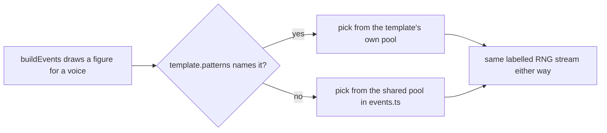

# PRD — Epic 1: A feel can carry more than two modes, and Bossa Nova proves it

Feature: [briefing.md](../briefing.md) · [roadmap.md](../roadmap.md)

## Summary

Remove the rule that each feel owns exactly two flavours and that the six pairs
are disjoint, replace it with "two to four modes, overlap allowed", and give a
template a way to declare its own rhythm figures. Then spend both on Bossa Nova,
so the mechanism ships proved by a groove Sam can hear rather than by a green
test suite. Epics 2–5 each add one style against the contract this epic freezes.

## Problem

Twelve flavours across six feels, two each, disjoint — so every flavour is taken
and a seventh feel cannot get a pair of its own. The rule is not a comment: it is
four assertions in `scripts/grooves/templates/index.test.ts` and a sentence in
`docs/music.md`. It came from feature-3 (epic 3, Q4: two flavours per template,
chosen for musical fit) and feature-9 (epic 6: hearing the feel narrows the
mode), and it has held while the catalogue had six feels and nothing wanted a
seventh.

The second wall is quieter. Bossa Nova needs a surdo kick and a syncopated comp
figure, and the pools those are drawn from — `KICK_PATTERNS`, `COMP_PATTERNS`,
`BASS_PATTERNS`, `BONGO_PATTERNS` in `events.ts` — are drawn with
`pick(rng, POOL)`, which scales the draw by the pool's length. Appending one
figure changes which pattern **every existing seed** picks, so all thirty
committed grooves re-render. A new style cannot bring its own rhythm without a
per-template escape hatch.

## Scope

- the flavour rule: two to four modes per template, overlap allowed, both bounds
  asserted
- the four assertions in `templates/index.test.ts` that encode the old rule, and
  the `TEMPLATE_COUNT` arithmetic riding on them
- `catalogue.test.ts`'s dominance cap, widened for an uneven spread
- an optional `patterns` block on `FeelTemplate` covering every drawn pool
- `grooves:add` gains a way to mint for one named template
- `templates/bossa-nova.ts`, registered, with six grooves minted and signed off
- `docs/music.md`: the feel section, and the routing table

**Out of scope**
- the other four styles — Epics 2, 3, 4 and 5, one each
- the rota. Sixty grooves in a new order is Epic 6; this epic leaves the daily
  selection exactly as it is and accepts that adding six grooves reshuffles it
  incidentally, as every past release did
- adding modes to any of the six existing templates. `pick` indexes the
  template's own `flavours` list, so an append re-renders that template's grooves
  and reassigns their answers. `docs/music.md` "What must never change" freezes
  those six lists and this epic does not unfreeze them
- new voices. Bossa Nova plays from the fifteen `VOICE_NAMES` already declared,
  and reaches for none of the four that feature-24 sourced unheard
- a thirteenth flavour. `locrian` stays out of `FLAVOURS`, and the app's option
  pools do not change

## Requirements

### The flavour rule

- **R1** — A template declares at least two flavours and at most four, with no
  duplicates inside its own list. Two templates may declare the same flavour.
- **R2** — Both bounds are asserted across every registered template. The lower
  bound is what stops a feel being a giveaway; the upper is what keeps it a clue
  at all.
- **R3** — Every flavour the game offers has at least one groove behind it in the
  shipped catalogue.
- **R4** — No groove in the shipped catalogue answers to a flavour that no
  template offers.
- **R5** — The six existing templates' `flavours` lists are byte-for-byte
  unchanged by this epic, in content and in order.
- **R6** — `FLAVOURS` in `src/lib/theory/names.ts` is unchanged: twelve entries,
  same order, `locrian` still absent.

### What replaces the tests that encoded the old rule

- **R7** — The assertions `gives every template exactly two flavours`, `keeps the
  pairs pairwise disjoint`, `covers exactly the twelve flavours the game offers`
  and `splits the twelve evenly between the two families` are replaced rather
  than deleted: each is re-expressed as the guarantee it was standing in for, or
  removed with the reason recorded in the test file.
- **R8** — `pairs each flavour with a feel that suits it` keeps asserting the six
  existing templates' exact lists, since R5 freezes them, and gains the new
  template's list.
- **R9** — Assertions derived from `TEMPLATE_COUNT` state what they actually mean
  once the count is no longer the flavour count: unique ids, unique swing values,
  unique tempo ranges and unique mix and humanize blocks hold across however many
  templates are registered.
- **R10** — `catalogue.test.ts`'s `lets no mode dominate the answers` cap is
  widened from 3× to 5×. Overlapping sets put ionian in three templates and
  harmonic-major in one, a spread near 7-to-2 that fails at 3× and clears 4× too
  narrowly for a sixth style to be added later without breaking it again. The cap
  is a guard against one mode swallowing the catalogue, not a coverage target.

### The `patterns` block

- **R11** — `FeelTemplate` gains an optional `patterns` block. A template may
  declare, per voice, the figures it draws from instead of the shared pool in
  `events.ts`.
- **R12** — The block covers every drawn pool from the start: kick, foot hat,
  ride, bass, comp, bongos and snare ghosts. Every field is optional and each
  keeps its pool's own shape — flat step lists on the sixteenth grid for most,
  `{ high, low }` for the bongos, keyed by subdivision for the ride.
- **R13** — A voice the block does not name falls back to the shared pool,
  drawn exactly as it is drawn today.
- **R14** — A template that declares no `patterns` block draws precisely what it
  draws today. The thirty committed mp3s re-render byte-identically, and
  `grooves.lock.json` is unchanged for every existing groove.
- **R15** — A declared pool is drawn on the same labelled RNG stream as the
  shared pool it replaces, with no draw inserted into or removed from
  `MUSIC_LABEL`. Every committed answer survives.
- **R16** — A declared pool must be non-empty, and its steps must be inside
  `0…15`. An empty or out-of-range pool fails loudly at build time rather than
  rendering silence.

### Minting for one style

- **R17** — `npm run grooves:add` accepts a template id and mints only for that
  template: `grooves:add 6 --template bossa-nova`. Without the flag it behaves
  exactly as it does today, filling by scarcity.
- **R18** — An unknown template id is rejected before anything is rendered, with
  the known ids listed.

### Bossa Nova

- **R19** — `templates/bossa-nova.ts` declares a straight bossa: subdivision 8,
  swing at or near zero, tempo range inside 120–140, and a tempo range and swing
  value distinct from all six existing templates.
- **R20** — Its flavours are between two and four of the twelve already offered.
  `new-styles.md` proposes ionian, lydian, dorian and melodic minor; the
  `musician` settles the final list, which is frozen the moment its first groove
  is minted.
- **R21** — The bossa clave lands on the rim through a `PLACEMENTS` entry, and
  the surdo kick and the syncopated comp figure through the template's own
  `patterns` block.
- **R22** — It plays no voice outside the fifteen already declared, and none of
  the four sourced-but-unplayed voices from feature-24.
- **R23** — Six grooves are minted for it, all seven gate checks passing, and its
  density band is declared so a straight-eighth bossa sits inside it rather than
  the band being widened after the fact.
- **R24** — The listening sign-off is a person's, recorded in the epic's report:
  it reads as a bossa, the clave is a clave and not a rim click on the wrong
  beats, and it is worth playing a guitar over — Sam's reward for solving, not
  just the question.

### The documents

- **R25** — `docs/music.md` "The six feels" is rewritten: the heading, the
  sentence stating the two-flavour rule, and the table, which gains Bossa Nova.
- **R26** — `docs/music.md` "Where to change what" gains a row for the
  per-template `patterns` block, beside the row that sends rhythm figures to the
  pools in `events.ts`.
- **R27** — `specs/new-styles.md`'s "The rule we will drop" section is marked as
  done rather than left reading as a proposal, and Bossa Nova's row notes that it
  shipped.

## Behaviour details

Where a figure comes from, per voice, per template:

The two properties that make this safe are worth stating separately, because
only one of them is about the pools. **Nothing is appended to a shared pool**, so
pool lengths are unchanged and every existing draw returns what it returned
before. **Nothing is added to `MUSIC_LABEL`'s draw order**, so every committed
answer — root and flavour — is untouched. A template with no block is
bit-identical; a template with one differs only in the figures it asked to
differ in.

## Acceptance criteria

- **AC1** (R1, R2) — Given the registered templates, when the flavour suite
  runs, then every template is asserted to hold two, three or four distinct
  flavours, and a template with one or five fails.
- **AC2** (R1) — Given two templates that declare the same flavour, when the
  suite runs, then it passes: no assertion forbids overlap.
- **AC3** (R3, R4) — Given the shipped catalogue, when `catalogue.test.ts` runs,
  then every offered flavour has at least one groove and every groove's flavour
  is offered by some template.
- **AC4** (R5, R6) — Given `git diff` for this epic, when the six existing
  template files and `names.ts` are inspected, then no `flavours` list and no
  entry of `FLAVOURS` has changed.
- **AC5** (R10) — Given the sixty-groove catalogue, when the dominance check
  runs, then the commonest flavour carries no more than five times the rarest,
  and the check reports both counts on failure.
- **AC6** (R11, R12, R13) — Given a template declaring a kick pool and nothing
  else, when its events are built, then its kick figure comes from its own pool
  and its bass, comp, hat and ghost figures come from the shared pools.
- **AC7** (R14) — Given `npm run grooves` on the unchanged catalogue, when it
  finishes, then `git status` shows no change to any of the thirty existing mp3s
  and `npm run grooves:verify` reports no drift in `grooves.lock.json`.
- **AC8** (R15) — Given every existing groove, when its music metadata is
  rebuilt, then its root, flavour, scale, chord and progression are identical to
  the committed manifest.
- **AC9** (R16) — Given a template declaring an empty pool, or a step of 16, when
  events are built, then it throws with the template id and the offending voice
  named.
- **AC10** (R17) — Given `grooves:add 2 --template bossa-nova` on a catalogue
  where another template is scarcer, when it completes, then both minted grooves
  are bossa-nova.
- **AC11** (R17) — Given `grooves:add 2` with no flag, when it completes, then it
  mints by scarcity exactly as before this epic.
- **AC12** (R18) — Given `grooves:add 1 --template bossa-nvoa`, when it runs,
  then it exits non-zero, lists the known template ids, and writes nothing.
- **AC13** (R19) — Given `bossa-nova`, when the template suite runs, then its
  swing value and its tempo range are unique across the registry and its tempo
  range lies inside 120–140.
- **AC14** (R21) — Given a rendered bossa groove, when its events are inspected,
  then the rim sounds the declared clave figure and the kick sounds the declared
  surdo figure, on both counts from the template rather than the shared pool.
- **AC15** (R22) — Given every bossa groove, when its events are inspected, then
  no event names `claves`, `cowbell`, `rideBell` or any voice outside the
  template's declared `voices`.
- **AC16** (R23) — Given the catalogue after this epic, when `npm run test:gen`
  runs, then it holds thirty-six grooves, six of them `bossa-nova`, and all seven
  gate checks pass for each of the six.
- **AC17** (R24) — Given the six bossa mp3s, when a person listens to each in
  full, then the epic's report records their verdict per groove in their own
  words. A gate pass is not a sign-off and does not substitute for one.
- **AC18** (R25, R26, R27) — Given `docs/music.md` and `specs/new-styles.md`,
  when read after this epic, then neither states the two-flavour rule as current,
  the feel table lists seven feels, and the routing table names the `patterns`
  block.

## Dependencies

**Needs:** nothing. This epic starts immediately and does not wait on feature-24.

**Hands to Epics 2–5, frozen once this epic merges:**
- `FeelTemplate.patterns` — the field name, the seven per-voice keys and each
  key's shape. Three epics write templates against it in parallel in wave 2, so
  this is the contract that cannot move.
- the two-to-four flavour rule and the assertion that enforces it, so a later
  style declares its modes without editing a test.
- `grooves:add <n> --template <id>`, so each style mints its own six.
- the pattern that a style is one file in `templates/`, one registry line, one
  `PLACEMENTS` entry, one optional `FILLS` entry and six grooves.

**Hands to Epic 6:** thirty-six grooves. Nothing else — Epic 6 depends on the
count, not on this epic's mechanism.

## Assumptions

- **The `musician` decides Bossa Nova's parameters**, not this PRD.
  `new-styles.md`'s row is the starting point: tempo, swing, gains, pans,
  humanize, density band, passes and the final mode list are the `musician`'s to
  set, and R19–R23 bound them rather than choosing them.
- **`PLACEMENTS` and `FILLS` need no new mechanism.** Both are already
  `Record<templateId, …>` in `events.ts`, and `placementFor` spreads over the
  default, so a bossa can override the rim and — where a style needs a voice
  absent — declare an empty list.
- **The block replaces a pool rather than extending it.** A style that declares
  its own kick figures draws only those, which is what lets a bossa rule out
  every figure that hits the "and" of 4.
- **Six grooves is the mint target, not a gate outcome.** If the gate rejects
  enough candidates that six is not reachable inside the attempt budget, that is
  a musical problem with the template and is fixed in the template rather than by
  shipping four.
- **The `patterns` block carries no per-groove randomness of its own.** It
  changes which pool is drawn from, not how many draws happen, which is what
  keeps R15 true.
