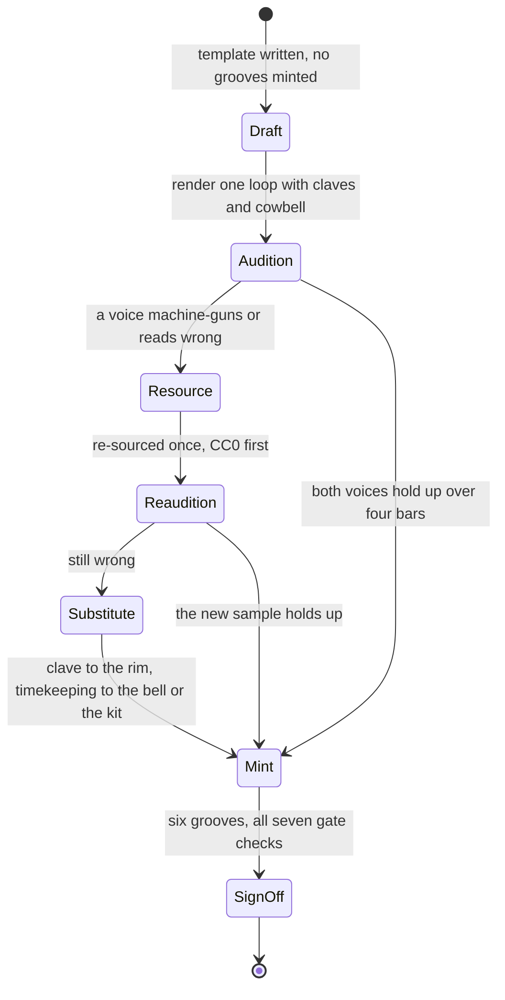

# PRD — Epic 5: Son montuno, and the claves finally get heard

Feature: [briefing.md](../briefing.md) · [roadmap.md](../roadmap.md)

## Summary

One template, `son-montuno`, and six grooves from it: the 2-3 clave on the
claves, a tumbao bass anticipating the "and" of 2 and beat 4, a montuno figure on
the keys, the cowbell keeping time and the bongos leading instead of decorating.
It is the strongest musical reason to do this feature, and it is also the epic
that finds out whether the four voices feature-24 bought actually work — because
feature-24 verified their round robins by counting files and rendered none of
them.

## Problem

`new-styles.md` calls this "the only style that would use the bongos for more
than decoration — the strongest reason to add it". Today the bongos are one
voice on one feel (`bright-straight`), drawn from `BONGO_PATTERNS` on
`BONGO_LABEL`, sitting behind the kit. A montuno wants them in front.

The larger problem is inherited. Feature-24 sourced `claves`, `cowbell` and
`rideBell` into the pack and played none of them: their round robins were checked
by counting files in `pack.json`, never by ear. A bare wood transient repeated
eight times a bar over four bars is exactly the machine-gun artefact feature-9
spent a whole feature undoing, and nobody has heard whether these samples have
it. **The first style that reaches for the claves owns that listening pass**, and
this is that style.

## Scope

- `templates/son-montuno.ts`, registered in `templates/index.ts`
- the 2-3 clave, the tumbao bass and the montuno comp figure in the template's
  own `patterns` block, and the bongos promoted to a lead voice
- the **first listening pass on the claves and the cowbell**, and re-sourcing one
  of them if it fails
- six grooves minted, gated and signed off by ear
- one row in `docs/music.md`'s feel table, and the provenance and licence entries
  for any voice re-sourced here

**Out of scope**
- the ride bell. It stays sourced and unplayed, unless the cowbell turns out to
  be the wrong sound for the timekeeping part, in which case the bell is the first
  substitute tried
- a second percussion layer — congas, timbales, güiro. Not in the pack, and each
  is its own sourcing job
- a 6/8 Afro feel. `new-styles.md` files it under "Not cheap" for the reason the
  sixteenth grid assumes four beats a bar
- the flavour rule and the `patterns` block — Epic 1's, frozen before this starts
- the rota — Epic 6

## Requirements

### The template

- **R1** — `templates/son-montuno.ts` declares tempo, subdivision and swing set
  by the `musician`, with a tempo range and a swing value distinct from every
  other registered template.
- **R2** — Its flavours are two to four of the twelve already offered.
  `new-styles.md` proposes mixolydian, dorian and phrygian-dominant; the
  `musician` settles the list, which is frozen the moment its first groove is
  minted.
- **R3** — The claves sound the 2-3 clave, from the template's own pool, as a
  fixed figure rather than a drawn variation — the clave is the style, not a
  parameter of it.
- **R4** — The bass plays a tumbao: it anticipates, sounding the "and" of 2 and
  beat 4 rather than the downbeat, from the template's own bass pool.
- **R5** — The comp plays a montuno figure — an arpeggiated, syncopated pattern
  rather than the block chords `COMP_PATTERNS` carries.
- **R6** — The bongos lead. Their gain places them level with the kit's loudest
  voices rather than behind them, and their figures come from the template's own
  bongo pool rather than the shared one.
- **R7** — The cowbell keeps time and is a declared voice of the template.
- **R8** — While the claves carry the clave, the rim is silent in every groove
  this template renders: it is not in the template's `voices`. The one thing that
  changes that is R13a — if the clave has to move to the rim, the rim is the
  clave and it is the claves that are absent. In neither case do both sound the
  figure.
- **R9** — Six grooves are minted, every one passing all seven gate checks.
- **R10** — Its density band is declared for a style with two percussion voices
  running alongside the kit, set from what it plays.

### The claves and the cowbell

- **R11** — Before any groove is minted, the claves and the cowbell are heard
  **under a rendered four-bar loop of this template**, not in isolation and not
  as a file count. A sample auditioned solo is the mistake feature-13 made with
  its ride.
- **R12** — The specific failure to listen for is named and reported on: does the
  claves' round robin break up the repetition, or does a bare wood transient
  machine-gun across four bars? The report answers it in words, per voice.
- **R13** — If a voice fails, it is re-sourced once — **CC0 first, CC-BY
  accepted**, nothing else — prepared with the pack's existing recipe, and heard
  again under the same rendered loop.
- **R13a** — If the re-sourced claves fail too, the clave moves to the rim and
  the style still ships. The rim plays the 2-3 clave from the template's own
  pool, the claves leave the template's `voices`, and the part survives its
  instrument — `bright-straight` already plays a clave-ish rim figure, so this is
  a substitution the kit can make. A montuno with a rim clave is still a montuno,
  and it is still worth playing a saxophone over, which is what the six grooves
  are for.
- **R13b** — Claves that fail twice are recorded in `specs/new-styles.md` as a
  failed candidate, with what was heard and what was tried, the way feature-13's
  ride was. They stay in the pack and in `VOICE_NAMES`, played by nothing, and
  the next style that wants them inherits the finding rather than repeating the
  audition.
- **R13c** — The same substitution applies to the cowbell: if it fails twice, the
  ride bell takes the timekeeping part, which is the one case the ride bell is in
  scope for. If neither works, the style ships with the kit keeping time and the
  finding recorded.
- **R14** — A re-sourced voice brings its licence, provenance and
  `samples/README.md` entries with it, and `pack.json`, `provenance.json` and the
  pack sha in `grooves.lock.json` are updated in the same commit as the audio.
- **R15** — Re-sourcing a voice re-renders nothing outside this template. No
  existing groove plays the claves or the cowbell, so no committed mp3 changes.
- **R16** — The listening sign-off is a person's, recorded per groove in the
  epic's report, and it answers what the gate cannot: do the bongos read as the
  lead, does the clave sit right against the tumbao, and is it worth playing a
  saxophone over?
- **R17** — `docs/music.md`'s feel table gains its row, and its voice-list
  section is corrected to say which feels now play the claves and the cowbell.

## Behaviour details

The order matters, because the expensive discovery is at the front:

Every path reaches `Mint`, and that is the point of the substitution: the style
ships six grooves whatever the pack turns out to hold, because the clave figure
is sounded by the claves or by the rim and the timekeeping by the cowbell, the
ride bell or the kit.

Auditioning before minting is what keeps a failed voice cheap: nothing is in
`catalogue.json`, no uuid is issued, and no mp3 is committed until both voices
have been heard.

## Acceptance criteria

- **AC1** (R1) — Given the registered templates, when the template suite runs,
  then `son-montuno`'s swing value and tempo-range string are unique across the
  registry.
- **AC2** (R2) — Given the template, when the flavour suite runs, then it holds
  two to four distinct flavours, every one of them in `FLAVOURS`.
- **AC3** (R3) — Given every rendered groove, when its claves events are
  inspected, then they sound the same 2-3 clave figure in every groove, on the
  steps the template declares.
- **AC4** (R4) — Given every rendered groove, when its bass events are inspected,
  then the bass sounds the anticipated steps the tumbao declares and does not
  sound a downbeat root on every bar.
- **AC5** (R5) — Given every rendered groove, when its comp events are compared
  against `COMP_PATTERNS`, then its figure is the template's own, not one of the
  four shared block-chord patterns.
- **AC6** (R6) — Given every rendered groove, when the template's gains are read,
  then `bongoHigh` and `bongoLow` sit within the same order of magnitude as the
  kick and snare, and the bongo figures come from the template's own pool.
- **AC7** (R7, R8) — Given every rendered groove, when its events are inspected,
  then exactly one of the claves and the rim sounds the clave figure and the
  other is absent from the output entirely — the claves by default, the rim only
  under R13a.
- **AC8** (R11, R12) — Given the audition loop, when a person has heard it, then
  the epic's report states, per voice, whether the round robin holds up over four
  bars — before any groove is minted.
- **AC9** (R13, R14) — Given a failed voice, when it has been re-sourced, then
  its licence is CC0 or CC-BY, `provenance.json` and `samples/README.md` name the
  source, and `pack.json`'s voice entry lists the new files.
- **AC10** (R15) — Given `npm run grooves` after any re-sourcing, when
  `git status` and `npm run grooves:verify` are inspected, then every mp3 outside
  this template is byte-identical and the only lock changes are this template's
  grooves and the pack sha.
- **AC10a** (R13a, R13b) — Given claves that failed twice, when the epic closes,
  then six `son-montuno` grooves are in the catalogue with the rim sounding the
  clave, `claves` is absent from the template's `voices`, and
  `specs/new-styles.md` records what was heard across both auditions.
- **AC10b** (R13c) — Given a cowbell that failed twice, when the epic closes,
  then the timekeeping part is on the ride bell or on the kit, and the substitution
  is stated in the report rather than left to be inferred from the template.
- **AC11** (R9) — Given the catalogue after this epic, when `npm run test:gen`
  runs, then it holds six `son-montuno` grooves and all seven gate checks pass
  for each.
- **AC12** (R10) — Given each rendered groove, when the density check runs, then
  its events per bar are inside the template's declared band.
- **AC13** (R16) — Given the six mp3s, when a person listens to each in full,
  then the report records their verdict per groove in their own words. A gate
  pass is not a sign-off.
- **AC14** (R17) — Given `docs/music.md`, when read after this epic, then the
  feel table lists `son-montuno` and no sentence still implies the claves and the
  cowbell are unplayed.

## Dependencies

**Needs:**
- **Epic 1** — the flavour rule, `FeelTemplate.patterns` with its bass, comp and
  bongo pools, and `grooves:add <n> --template <id>`.
- **feature-24, shipped** — `claves` and `cowbell` present in `VOICE_NAMES`,
  declared in `samples/pack.json` with their round robins, and covered by
  `provenance.json`. This epic plays them; it does not source them from scratch.

**Hands to Epic 6:** six grooves.

**Hands to whatever comes next:** the first heard verdict on three of
feature-24's four unplayed voices, so the next style that reaches for the claves
or the cowbell inherits a decision instead of a guess.

## Assumptions

- **The `musician` decides the parameters**, including how far forward the bongos
  come and what "level with the kit" means in gain terms.
- **`rideBell` stays unheard after this epic** unless R13's substitution reaches
  for it. That is not this feature's debt to clear — it is the next style's, on
  the same terms this epic accepted for the claves.
- **Two percussion voices plus the kit will press on the density band, not the
  loudness band.** The gate's loudness window is −29…−20 dBFS and deliberately
  wide; density is the check that discriminates, which is why R10 is a
  requirement and loudness is not.
- **One re-sourcing round is the budget the briefing set**, and R13a–R13c spend
  what is left after it: the part moves to an instrument the pack already has
  rather than the epic waiting on a third sample. Nothing here is a licence to
  ship a montuno without a clave — the figure is always sounded by something.
- **A substitution is a musical decision, so the `musician` makes it.** R13a says
  the rim takes the clave; what the rim's gain, velocity and lean have to be for a
  rim clave to sit against the tumbao is theirs.

## Question log

Answered questions, kept for traceability. The requirements above are the source
of truth — this records how they got there.

### Cycle 1 — 2026-09-05

**Q1. What ships if the claves fail twice?**
Answer: **A) The clave moves to the rim and the claves stay unplayed** — the part
survives its instrument, `bright-straight` already plays a clave-ish rim figure,
and a montuno with a rim clave is still a montuno. The style is the strongest
musical reason for the feature, so it does not get blocked by one sample.
Applied to: R8 (amended — the rim is no longer unconditionally silent), R13a,
R13b, R13c, AC7 (rewritten), AC10a, AC10b, Assumptions
