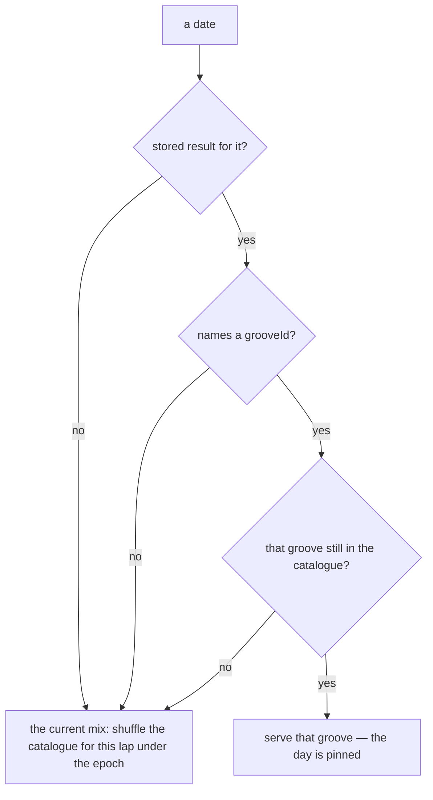

# PRD — Epic 6: New grooves mix into the rota, this release and every one after

Feature: [briefing.md](../briefing.md) · [roadmap.md](../roadmap.md)

## Summary

Give the daily rota an epoch, bump it, and make bumping it part of minting. The
sixty grooves come round in an order that has nothing to do with the thirty Sam
learned, new styles and old favourites interleaved by the shuffle — and the next
release that mints grooves reshuffles the same way without anyone remembering to
make it. Along the way, a day already played stops changing underneath the player
who played it, which is a hole every past groove release has had.

## Problem

`selectGrooveForDate` shuffles the catalogue per lap with the seed `lap:${lap}`,
where `lap = floor(dayIndex / grooves.length)`. Two things follow.

First, the mix already moves whenever the catalogue grows, because both the lap
number and the position depend on the length. That reshuffle is a side effect
nobody chose, and it arrives at whatever moment a release lands. Epics 1–5 add
thirty grooves, so it is going to happen; the choice is whether it is spent
deliberately or absorbed.

Second, nothing pins a played day. `DailyResult` records `grooveId`
(`types.ts:14`) and no production code reads it — the only readers are
`useProgress`, which writes it, and a test harness. So a player who solved this
morning and reloads after a release gets a different groove for today, under a
solved panel holding the answer to the groove that is no longer playing.

## Scope

- a rota epoch in `lib/puzzle/selectGroove.ts`, bumped by this feature
- the epoch carried into the lap-boundary guard in `orderFor`
- a played date pinned to the groove it was played on, read from
  `DailyResult.grooveId`
- two rows in `docs/music.md`
- the rota's tests: the epoch, the boundary, the pin

**Out of scope**
- minting anything. This epic decides the order of what Epics 1–5 left behind,
  and touches no mp3, no `catalogue.json`, no manifest and no lock
- an arrival guarantee. The mix is a uniform shuffle over the whole catalogue and
  promises nothing about *when* a new style first turns up: day one after the
  release may well be a groove Sam already knows
- a shuffle button, a "give me another", or any way to choose the day's groove.
  One puzzle a day, and it ends
- back-filling the epoch over past releases. The rule starts here; the
  reshuffles that already happened stay as they were
- changing `src/lib/hash.ts`. The epoch changes a seed *string*; the hash
  function and its fixed table are untouched, and that is what makes this a
  reshuffle rather than a re-release

## Requirements

### The epoch

- **R1** — `selectGrooveForDate` derives each lap's order from a seed that
  includes a rota epoch, so bumping the epoch produces a different order for
  every lap.
- **R2** — This feature bumps the epoch exactly once, as part of the release that
  ships Epics 1–5.
- **R3** — The epoch is a single value with no knowledge of which grooves are
  new. Because the shuffle is uniform over the whole catalogue, nothing indexes
  `GROOVES`, no field is added to `Groove`, and the manifest does not change.
- **R4** — `src/lib/hash.ts` is unchanged, and `hash.test.ts`'s fixed table still
  passes. The epoch changes what is hashed, never how.
- **R5** — Every groove still appears exactly once per lap, and the day-to-groove
  mapping stays a pure function of the date, the catalogue and the epoch — the
  same date under the same epoch always gives the same groove.
- **R6** — `orderFor`'s lap-boundary guard, which reads the previous lap's closing
  groove so the same groove does not land two days running, reads it under the
  current epoch. It never compares against an order the epoch has replaced.
- **R7** — Every release that mints grooves bumps the epoch. This is stated where
  a person minting grooves will find it, not only in this PRD.

### The pin

- **R8** — A date whose stored result names a groove is served that groove,
  whatever the current mix says for that date.
- **R9** — A date with no stored result, or a stored result with no `grooveId`,
  is served the groove the current mix gives it. Results saved before the field
  existed take the new order, because a stored answer with no groove behind it has
  nothing to be honest to.
- **R10** — A stored `grooveId` that names no groove in the catalogue is ignored,
  and the date falls back to the current mix. A missing groove must not leave the
  page with nothing to play.
- **R11** — The player never sees a groove change under them. The puzzle is
  already withheld until the stored result has loaded — `GroovePuzzle.tsx:233`
  renders the loading state until `hydrated`, `modeLoaded` and
  `instrumentKeyLoaded` — and the pin is applied inside that same wait. It adds
  no second spinner and no post-load swap.
- **R12** — A solved day still reads as solved on first paint. Nothing in this
  epic may make the page show an unsolved board that then flips: seeing a day you
  finished look unfinished is worse to the player than any groove changing, and
  the day is meant to close and stay closed.
- **R13** — The pin costs the player no observable delay on a normal visit. On a
  day with no stored result — every first visit of the day — the page reaches the
  playable groove exactly as fast as it does today.

### The documents

- **R14** — `docs/music.md` gains a line beside "What must never change" naming
  the epoch as the thing that deliberately *may*, and stating what bumping it
  does: every unplayed date, past or future, maps to a different groove.
- **R15** — `docs/music.md`'s "Where to change what" gains a row sending "the
  daily order, after minting" to the epoch, so the next release bumps it by
  default instead of rediscovering this epic.

## Behaviour details

Which groove a date gets, after this epic:

Two consequences worth stating rather than discovering:

**A pinned day and the new mix can name the same groove.** One groove may be
both a date in the past and a date still to come. Nothing in the app replays a
past date — the results store feeds the streak, not a history view — so the
overlap is invisible today, and it becomes a real question the day a history view
is built.

**The rota has two other consumers.** `isTodaysGroove` (`lib/puzzle/isTodaysGroove.ts`)
asks the rota whether a shared groove is today's, and `GroovePuzzle.tsx:84`
resolves the daily groove. Both must agree with the pin or the same day answers
two different questions two different ways.

## Acceptance criteria

- **AC1** (R1, R2) — Given a fixed catalogue and date, when the groove is
  selected under the old epoch and under the new one, then the two differ, and
  each is stable across repeated calls.
- **AC2** (R3) — Given `git diff` for this epic, when inspected, then `Groove`
  has no new field, `grooves.generated.ts` is unchanged, and no mp3, catalogue
  entry or lock entry has changed.
- **AC3** (R4) — Given `npm test`, when it runs, then `src/lib/hash.test.ts`'s
  fixed table passes unmodified.
- **AC4** (R5) — Given a sixty-groove catalogue and sixty consecutive dates, when
  each is selected, then all sixty grooves appear exactly once.
- **AC5** (R5) — Given the same date, catalogue and epoch, when selected a
  hundred times, then the same groove comes back every time.
- **AC6** (R6) — Given the last date of one lap and the first of the next, when
  both are selected, then the two grooves differ.
- **AC7** (R8) — Given a stored result for a date naming `groove-07`, when that
  date is served, then it is `groove-07`, even where the current mix gives that
  date another groove.
- **AC8** (R9) — Given a stored result with no `grooveId`, and given a date with
  no stored result at all, when each is served, then both take the current mix.
- **AC9** (R10) — Given a stored result naming a `grooveId` absent from the
  catalogue, when that date is served, then a playable groove from the current
  mix is served and nothing throws.
- **AC10** (R11, R12) — Given a saved solved result for today whose groove is not
  the one the current mix gives today, when the page loads, then the first render
  showing a puzzle shows the pinned groove **and** its solved state — at no point
  is a different groove, or an unsolved board, on screen.
- **AC11** (R13) — Given no stored result for today, when the page loads, then it
  reaches the playable groove in the same number of render phases as before this
  epic.
- **AC12** (R8, and the two-consumer note) — Given a shared link to the groove
  today is pinned to, when the shared route is opened, then it is treated as
  today's puzzle, not as somebody else's shared groove.
- **AC13** (R7, R14, R15) — Given `docs/music.md`, when read after this epic,
  then the epoch appears both beside "What must never change" as deliberately
  changeable and in "Where to change what" as a step after minting.
- **AC14** — Given `npm test`, `npm run lint`, `npm run build` and
  `npm run grooves:verify`, when all four run, then all pass and `grooves:verify`
  reports no drift — this epic touched no groove.

## Dependencies

**Needs:** Epics 1–5 merged, so the mix is fixed over the catalogue that ships.
It depends on the grooves existing, not on how any of them were built — and a
style that stopped short (Epic 4's negative verdict) costs it nothing, because it
reads the catalogue as it finds it.

**Contracts it touches, and nothing else:**
- `selectGrooveForDate(date, grooves)` — the signature the two callers use. If the
  pin needs a third argument, it is optional and defaulted, so
  `isTodaysGroove` and the composer keep compiling.
- `DailyResult.grooveId` — read for the first time, still optional, still written
  the same way by `useProgress`.

**Hands on:** the standing rule. The next release that mints grooves bumps the
epoch, and R14/R15 are what make that discoverable without reading this PRD.

## Assumptions

- **The pin is per date, not per player session.** It comes out of the result
  store, so it survives a reload, a new tab and a phone that was closed
  overnight, and it needs no new storage key or migration — the field has been
  written since it was added.
- **Today is the only date the pin can matter for in practice.** Nothing in the
  app serves a past date's puzzle; the store feeds `computeStreak` and
  `isNewOrLapsed`. The requirement is written per date anyway, because that costs
  nothing and a history view would otherwise reopen it.
- **The epoch's type is an implementation choice.** An integer, a string, a
  version tag — the tech spec picks it. What the PRD needs is that it is one
  value, that bumping it changes every lap's order, and that it is visible enough
  in the source that a release remembers to bump it.
- **No migration of stored results.** Nothing about the envelope, its version or
  its shape changes, so `daily-groove:v2:results` stays at version 2.
