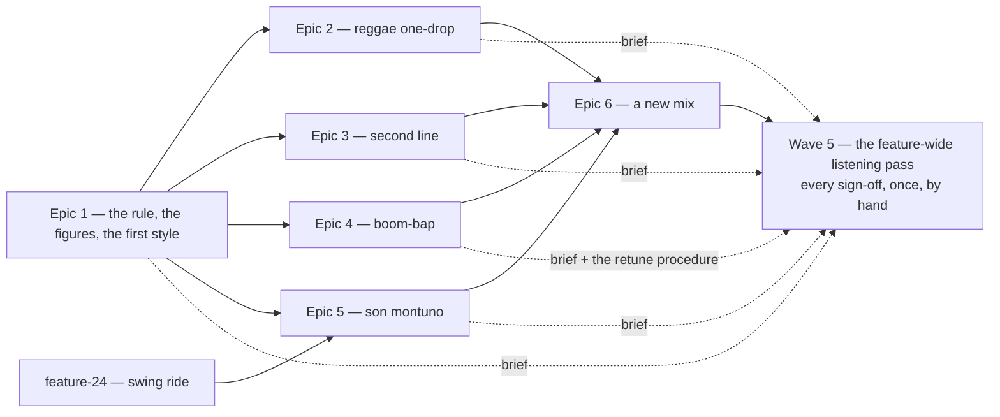

# Roadmap — Five new styles

Source: [briefing.md](briefing.md)

## Overview

The catalogue has six feels and twelve modes, paired one-to-one, and that pairing
is the reason a seventh feel cannot exist. Epic 1 removes it, gives a template a
way to declare rhythm figures the shared pools do not carry, and spends both on
Bossa Nova, so the mechanism is proved by something Sam can hear. Epics 2–5 are
one style each, in decreasing order of how different they sound from what is
already there. Son montuno goes last because it is the only one waiting on
another feature's voices. Each style mints six grooves, so the catalogue goes
from thirty to sixty — two months before anything repeats. Epic 6 reshuffles all
sixty into one new mix, and makes mixing new grooves through the old ones the
rule for every addition after this one rather than something this feature did
once. Nobody listens to any of it until Epic 6 is done: every sign-off is held
back to one feature-wide pass, so the five styles are judged against each
other rather than each against a catalogue the other four have not joined yet.

## Epics

### Epic 1 — A feel can carry more than two modes, and Bossa Nova proves it

**Visible when done:** Sam hits play and hears a bossa — rim clicking the clave,
the kick as a surdo, keys on the syncopated comp — a style the app has never made
before, and the mode behind it is one they have already met under a different
feel.
**Depends on:** none
**Parallel with:** none — every later epic adds a template, and this epic decides
what a template is

**Scope**
- drop the "exactly two flavours, pairwise disjoint" rule: a template declares
  at least two modes and at most four, and two templates may share one. Both
  ends are asserted in `templates/index.test.ts` — the lower bound is what keeps
  a feel from being a giveaway, the upper what keeps it a clue at all
- rewrite the assertions in `scripts/grooves/templates/index.test.ts` that
  encode it — `gives every template exactly two flavours`, `keeps the pairs
  pairwise disjoint`, `covers exactly the twelve flavours the game offers`,
  `pairs each flavour with a feel that suits it` — and the `TEMPLATE_COUNT`-derived
  counts that ride on them (`splits the twelve evenly between the two families`,
  the unique-swing and unique-tempo-range assertions)
- keep the two guarantees the rule was standing in for, as their own assertions:
  every flavour the game offers has at least one groove behind it, and no groove
  answers to a flavour no template offers (`catalogue.test.ts` already tests both)
- widen `catalogue.test.ts`'s `lets no mode dominate the answers` cap from 3× to
  5×. Overlapping sets put ionian in three templates and harmonic-major in one,
  a spread near 7-to-2, which fails at 3× and clears 4× too narrowly for a sixth
  style to be added later without breaking it again. The exact number is Epic 1's
  to set once the mint's real counts are in; the cap is a guard against one mode
  swallowing the catalogue, not a coverage target — asked directly, Sam's answer
  was "I can't feel a ratio. I can feel a repeat"
- rewrite `docs/music.md` "The six feels" — the sentence, the heading, the table
  — and add the per-template `patterns` block to "Where to change what", beside
  the row that sends rhythm figures to the pools in `events.ts`
- add an optional `patterns` block to `FeelTemplate`: per voice, the rhythm
  figures a template draws from instead of the shared pool in `events.ts`,
  falling back to that pool for every voice it does not name. The existing six
  omit it and draw exactly what they draw today, so nothing re-renders — it is
  the shape `PLACEMENTS` and `FILLS` already use, one level down
- the block covers **every** drawn pool from the start — kick, foot hat, ride,
  bass, comp, bongos and snare ghosts — each field optional, each keeping its
  pool's own shape: flat step lists for most, `{ high, low }` for the bongos,
  keyed by subdivision for the ride. Three epics write templates against this in
  parallel in wave 2 and none of them can afford to reopen it, so Bossa Nova
  leaves four of the seven fields empty and that is the price
- write `templates/bossa-nova.ts` — 120–140 bpm, straight, the modes
  `new-styles.md` proposes and the `musician` settles; the bossa clave on the
  rim through `PLACEMENTS`, the surdo kick and the syncopated comp figure
  through the new `patterns` block
- register it in `templates/index.ts`, mint **six** grooves, re-render the
  manifest and the lock
- a listening brief: what to listen for in these six, handed to Wave 5. The
  sign-off itself is not collected here

**Out of scope**
- the other four styles — epics 2–5
- adding modes to any of the six existing templates. `pick` scales the draw by
  the list's length, so an append re-renders that template's grooves and
  reassigns their answers; `docs/music.md` "What must never change" already
  freezes those six lists and this epic does not unfreeze them

**Validation**
- `npm run test:gen` — the rewritten flavour-coverage suite is green, and
  `catalogue.test.ts`'s coverage assertions still are
- `npm run grooves:verify` — no unrendered catalogue, no stale manifest
- `git status` after `npm run grooves` shows the thirty existing mp3s unchanged
- `npm test`, `npm run lint`, `npm run build`
- open the app, reach the new style's groove by uuid, and play it

### Epic 2 — Reggae one-drop

**Visible when done:** Sam meets a groove with nothing on beat one — kick and rim
together on three, hat on the off-beats, bass carrying it — and hears something
the app has never sounded like.
**Depends on:** Epic 1
**Parallel with:** Epics 3, 4 (see the waves note)

**Scope**
- `templates/reggae-one-drop.ts`: 70–80 bpm, straight, aeolian / mixolydian /
  ionian
- the one-drop: the rim on 3 through `PLACEMENTS`, and a kick figure that leaves
  beat one empty — which needs the `patterns` block, because every figure in
  `KICK_PATTERNS` hits step 0 — plus the skank comp figure
- mint six grooves, re-render the manifest and the lock, and write the
  listening brief Wave 5 reads

**Out of scope**
- new voices. Everything it needs is in today's eleven

**Validation**
- `npm run test:gen`, `npm run grooves:verify`, the full pre-push set
- play it: beat one is empty and it still keeps time

### Epic 3 — Second line / New Orleans

**Visible when done:** Sam meets a kit-led groove — syncopated snare over a
clave-ish kick, toms and rim earning their place, keys sparse.
**Depends on:** Epic 1
**Parallel with:** Epics 2, 4

**Scope**
- `templates/second-line.ts`: blues / mixolydian, bass following the kick
- its snare and kick figures, and a fill vocabulary — this is the style where
  the fill is part of the idiom rather than a bar-four punctuation
- mint six grooves, re-render, and write the listening brief Wave 5 reads

**Out of scope**
- new voices

**Validation**
- as Epic 2, plus: the density band holds with a busy snare

### Epic 4 — Boom-bap

**Visible when done:** Sam meets an 85–95 bpm groove with swung sixteenths, a
hard kick and snare and ghost notes underneath.
**Depends on:** Epic 1
**Parallel with:** Epics 2, 3

**Scope**
- `templates/boom-bap.ts`: dorian / aeolian / phrygian, swung sixteenths, sparse
  comp
- mint six grooves, re-render, and write the listening brief Wave 5 reads

**Out of scope**
- new voices

**Validation**
- as Epic 2, plus one judgement made out loud: back to back with `straight-funk`
  and `half-time`, does it read as its own feel? `new-styles.md` flags it as the
  closest of the five to what exists

### Epic 5 — Son montuno, and the claves finally get heard

**Visible when done:** Sam meets a groove where the bongos lead instead of
decorate, the claves carry the 2-3 clave and the bass anticipates — and the four
voices feature-24 bought get played for the first time.
**Depends on:** Epic 1, and feature-24 shipped
**Parallel with:** nothing — it is last

**Scope**
- `templates/son-montuno.ts`: mixolydian / dorian / phrygian-dominant
- the 2-3 clave on the claves, the tumbao bass, the montuno comp figure, bongos
  as a lead voice, cowbell keeping time
- **the claves' and cowbell's listening pass, before the mint.** Feature-24
  verified their round robins by counting files in `pack.json` and rendered
  neither. This epic is the first to hear them, and owns finding out whether a
  bare wood transient machine-guns over a four-bar loop. One sitting, two
  questions, and the only human step in the whole build — see Wave 5's exception
- budget for re-sourcing one voice if it does
- mint six grooves, re-render, and write the listening brief Wave 5 reads

**Out of scope**
- the ride bell, unless the cowbell turns out to be the wrong sound for the part

**Validation**
- as Epic 2, plus: the claves survive four bars without sounding like a sample
  trigger, and the rim is silent in every groove this template renders

### Epic 6 — New grooves mix into the rota, this release and every one after

**Visible when done:** Sam plays through the week after the release and the
order is one two months of playing gives them no way to predict — new styles and
old favourites interleaved by the shuffle, with the sixty coming round in a
sequence that has nothing to do with the thirty they had learned. The same is
true the next time styles are added, without anyone having to remember to make
it true.
**Depends on:** Epics 1–5 — the mix can only be fixed over grooves that exist
**Parallel with:** nothing — it is last, and it is the release

**Scope**
- add a rota epoch to `selectGroove.ts`: the per-lap shuffle seed goes from
  `lap:${lap}` to `${ROTA_EPOCH}:lap:${lap}`, and this feature bumps the epoch.
  It changes the seed *string*, not the hash — `src/lib/hash.ts` and its fixed
  table are untouched, which is exactly what keeps this a reshuffle and not one
  of the re-releases `docs/music.md` forbids
- **the standing rule, which is the point of the epic:** every release that
  mints grooves bumps the epoch, so the whole catalogue reshuffles rather than
  new grooves being appended to an order that already exists. The mixing is what
  a uniform shuffle over all of them gives you — no interleave, no front-loading,
  and no promise about *when* a new style first turns up. Day one after the
  release may well be a groove Sam already knows, and that is accepted: the mix
  is genuinely new every time and which morning the bossa lands on is luck
- the epoch is one integer. Because the shuffle is uniform, nothing has to know
  which grooves are new — no index into `GROOVES`, no field on `Groove`, no
  manifest change
- carry the epoch into `orderFor`'s lap-boundary guard. It reads the previous
  lap's closing groove to stop the same groove landing twice running; seeded
  from the old epoch it would be comparing against an order that no longer
  exists, and the guard would silently stop guarding
- pin a played day to the groove it was played on: read `DailyResult.grooveId`,
  which is written today and read nowhere, and serve that groove for that date
  whatever the new mix says. Only unplayed dates take the new order, so nobody
  is handed a different groove under their own solved panel — on release morning
  or at any later reshuffle
- fall back cleanly when there is no `grooveId` to pin to. The field is optional
  and results saved before it existed carry none; those days take the new mix,
  because a stored answer with no groove behind it is the one case where there is
  nothing to be honest to
- two rows in `docs/music.md`. One beside "What must never change", for the epoch
  as the thing that deliberately *may* — bumping it remaps every unplayed date,
  past or future. One in "Where to change what", so the next release that mints
  grooves bumps it by default instead of rediscovering this
- assert what the epoch is for: the same date under two epochs gives two
  different grooves, every groove still appears exactly once a lap, and no
  groove repeats across a lap boundary

**Out of scope**
- minting anything. This epic decides the order of what Epics 1–5 left behind
- back-filling the epoch over past releases. The rule starts here; the reshuffles
  that already happened stay as they were
- a shuffle button or a "give me another" control. One puzzle a day, and it ends
- re-rendering audio. No mp3 changes, no lock change, no manifest change

**Validation**
- `npm test` — the rota suite covers the epoch, the lap boundary and the pin;
  `src/lib/hash.test.ts`'s fixed table is still green, which is the proof this
  was a reshuffle
- `npm run grooves:verify` reports nothing — no groove was touched
- with a saved result for today in `localStorage`, the release does not change
  which groove that day shows
- the full pre-push set, then open the app on three consecutive simulated dates
  and see three grooves nobody could have guessed from the old order

## Dependency map

The dotted lines are the briefs, not dependencies: each style epic writes down
what to listen for in its six grooves and ships without waiting for an answer.

## Execution waves

- **Wave 1:** Epic 1
- **Wave 2 (parallel):** Epic 2, Epic 3, Epic 4
- **Wave 3:** Epic 5 — needs feature-24's claves and cowbell in the pack
- **Wave 4:** Epic 6 — the mix over all sixty grooves, and the last epic
- **Wave 5:** the feature-wide listening pass — by hand, and the only place a
  person is asked for anything

**What "parallel" means in wave 2, honestly.** Each epic's own
`templates/<style>.ts` and its half of `events.ts` are disjoint and can be
written at once. Four files are not: `templates/index.ts`,
`templates/index.test.ts`, `catalogue.json` and `grooves.lock.json` — every mint
appends to the catalogue and rewrites the lock and the manifest. So the three
epics can be built in parallel and must be *minted* one after another, in
whatever order they finish. The minting step is minutes; the template is the
work.

The mints serialise because two of them cannot write the same lock file, which
is a queue a machine clears in minutes. That is the only thing left that runs
one-at-a-time. Waiting on a person used to be the other, and it is not one any
more.

## Wave 5 — the feature-wide listening pass

**Every listening sign-off in this feature happens here, once, and nowhere
else.** Epics 1–5 each mint six grooves and ship them *unheard*. No epic waits
for a person, no track branches on a verdict, and the build runs from Epic 1 to
the end of Epic 6 without stopping. What each epic writes instead of a verdict
is a **brief**: what a listener should listen for in its six grooves, and where
the mp3s are.

The reason is not impatience. Four of the five styles are asking a question that
only a comparison can answer — does this read as its own feel, next to the other
ten? Boom-bap says so outright: its R8 sits it "between three feels that already
exist", and Epic 4 alone can never hear that. Judging each style the day it was
built, against a catalogue the other four have not joined yet, is judging it
against the wrong thing.

### What it does

1. **Plays all thirty new grooves, grouped by style, the five styles back to
   back** — bossa nova, reggae one-drop, second line, boom-bap, son montuno.
   Each style's six in a run, then the next style, so the ear carries one across
   to the other.
2. **Records a verdict per groove, in the listener's own words**, against that
   style's brief. This is what discharges Epic 1's R24/AC17, Epic 2's R12/AC10,
   Epic 3's R10/AC10, Epic 4's R10/AC9 and Epic 5's R16/AC13. A gate pass is not
   a sign-off and never was; the gates all ran, inside the epics, and blocked
   there on their own terms.
3. **Answers the distinctness question for each style** — Epic 4's R8, and the
   same question the other four are implicitly asking. This is the part that
   could not be done before now.
4. **Runs boom-bap's retune loop, if it comes to that.** Epic 4's R9, R9a and R9b
   are preserved whole: a negative first verdict retunes `swing`, `tempoRange`
   and `patterns.snareGhosts` and re-mints on the same seeds, a second hearing
   is final, and there is no third. A negative second verdict pulls boom-bap's
   six grooves. Epic 4's spec carries the procedure; this pass executes it.
5. **Hands back a list of proposed changes**, each naming the template field to
   move and what re-rendering it costs.
6. **Re-baselines `pastPuzzles.test.ts` last**, once the catalogue's final length
   is known — see below. Nothing before this point touches it.

### One test is red for the whole feature, on purpose

`src/features/daily-groove/data/pastPuzzles.test.ts` is the repo's record of
what players are already holding: `3 × GROOVES.length` days, each pinned to the
groove it resolved to when the fixture was captured. It passes today at thirty
grooves. **It goes red at Epic 1's mint and stays red until this feature is
finished**, and that is expected rather than a regression.

Two of its checks cannot survive a growing catalogue, and both say so in their
own failure messages. `selectGrooveForDate` indexes a seeded shuffle of the
*whole* catalogue, so thirty-one grooves reassign every past day — the test calls
that growth "sanctioned (feature-7 R6)" and branches its message on it. And
`DAYS.length === 3 * GROOVES.length` is arithmetic that breaks at 36 and again at
42, 48, 54 and 60. Epic 6's epoch bump reassigns everything a seventh time.

**No epic repairs it, and nothing regenerates it from the tree that broke it.**
The test forbids exactly that, in as many words: regenerating from today's tree
"makes it agree with whatever broke it", which is the one failure the record
exists to catch. An epic that finds it red leaves it red and says so.

It is re-baselined **once**, as the last thing in the feature, after Wave 5 has
settled — because Wave 5 can still change the catalogue's length by pulling a
style's six grooves, and a fixture captured before that would be wrong within the
hour. The procedure is the one the test prints: `git archive` the last commit
before Epic 1's mint into a scratch tree, resolve `3 × GROOVES.length` days
against *that* catalogue, and set `provenance.catalogueLength` to the final
number.

This is the one place the "the run does not stop for a person" rule has a cost
worth naming: a red suite for the length of the feature hides any *other*
regression in that file. Nothing else in it moves, which is what makes the trade
affordable.

### What it costs, said plainly

Thirty grooves are committed — audio, lock and manifest — before anyone has
heard one. So every change this pass proposes is a *post-mint* change, and the
epics price that consistently: re-rendering a style's six mp3s, and re-running
whatever sign-off the change touches. Deferring does not create that cost, it
guarantees it, because a first hearing this late can no longer be free.

Three things make it affordable.

**The mechanism already exists and is the designed path.** `npm run grooves`
walks the committed `catalogue.json` and re-renders every entry through the four
stages. A groove is `{ id, uuid, template, seed }`; a retune edits the template
and the id and the uuid never move. `scripts/grooves/README.md` says it outright —
"changing the generator and re-rendering is how the whole catalogue is meant to
change… the diff is reviewed by listening" — and `rerender-check.ts` polices it.
So applying a Wave 5 finding is: edit one template file, run one command, commit
the six mp3s that changed. Nothing is pulled and no uuid is burned.

**A change is scoped to one style.** Each style's six grooves render from one
template file, so a finding costs six files, not sixty.

**Almost every knob is answer-safe.** `swing`, the figures, the pools, the mix
and the pans move the audio and leave `bpm`, `root` and `flavour` exactly where
they were, so the puzzle's answer is untouched. **`tempoRange` is the exception**
— `bpm` is drawn from it and `bpm` is part of what the player is shown, so
retuning a tempo rewrites those six answers. Harmless inside this feature, since
nobody has played these grooves before the release; worth knowing because it is
the one Wave 5 finding that is not free.

### The one exception, named so it is not a surprise

**Epic 5 keeps one listen, and it is the only human step anywhere in the build.**
Before it mints, someone plays one rendered demo through once and answers two
questions about the raw samples: do the claves and the cowbell sound at all, and
does a bare wood transient machine-gun over a four-bar loop. That is a pass/fail
on an *asset*, not a verdict on a groove — machine-gunning is heard, not
preferred, so taste does not enter — and R11's `Audition → Mint` ordering is
built on it. Deferring it to Wave 5 would mean minting six grooves on a sample
R13 may then force a re-source of, re-rendering all six after their uuids and
audio are committed, and Wave 5 would answer it with *less* information than
Epic 5 has, because no other style plays either voice. Epic 5's Step D3 is the
sitting and its Cycle 4 log carries the reasoning.

Everything else that stops a build here is a machine finding, not a verdict: the
quality gate, the seven thresholds, the uniqueness assertions, and Epic 3's two
"stop and report" contingencies — a density band that will not fit, and six
grooves not reachable inside the attempt budget. Those still stop their own epic
where they are, and should.

## Assumptions

- **No new modes.** All five styles' modes are among the twelve `FLAVOURS`
  already offers, so nothing is appended to `names.ts`, `scales.ts` or
  `theory/validity.ts`, and the app's option pools do not change.
- **The app never learns what a feel is.** `Groove` has no feel field and the
  manifest carries none, so the whole rule change is generator-side. Epics 1–5
  change nothing in `src/features/daily-groove/` but the regenerated manifest;
  Epic 6 is the one that touches app code, and only `lib/puzzle/selectGroove.ts`
  and the hook that reads a stored day.
- **Weakening the clue costs the player nothing they had.** The option pool the
  puzzle offers is all twelve flavours whatever the groove's feel is, and the
  nudges narrow that pool, not a per-feel subset — so a four-mode template does
  not make a day harder to solve or harder to resolve. Asked directly, Sam's
  answer was that it is not a clue they lose but "a clue I was never handed",
  and that solving by style-spotting would work against "get better at hearing,
  not at reading" anyway. Their one condition — that the nudges still walk down
  to one and giving up still reveals — is satisfied by the pool being unchanged.
- **The six existing templates' `flavours` lists stay exactly as they are** — see
  Epic 1's out-of-scope. `new-styles.md` reads as if appending to one were the
  safe operation; it is not, and `docs/music.md` already says so.
- **Eleven templates need eleven distinct swing values and eleven distinct tempo
  ranges**, because `index.test.ts` asserts uniqueness across the set. The five
  new styles' tempos are spread enough (70–80, 85–95, 120–140, plus two mid) that
  this is a constraint, not a problem.
- **Each new style mints six grooves** — thirty new, matching the three fullest
  existing feels, and doubling the catalogue to sixty. At one a day that is
  another month before anything repeats.
- **The daily rota is reshuffled by every mint, and Epic 6 makes that the
  point.** `selectGrooveForDate` takes `dayIndex % grooves.length` on a per-lap
  shuffle, so growing the catalogue already reassigns which groove each date
  lands on — every past release that added grooves did it incidentally. Nothing
  in `docs/music.md` "What must never change" freezes it: what is frozen is
  `hashString`, a groove's uuid and the answer behind it, and a reshuffle moves
  none of those. Epic 6 stops treating the reassignment as a side effect and
  spends it deliberately, on one new mix of all sixty.
- **A pinned day and the new rota may name the same groove.** Epic 6 serves a
  played date its recorded groove and gives unplayed dates the new mix, so one
  groove can be both a date in the past and a date to come. Nothing in the app
  replays a past date — the results store feeds the streak, not a history view —
  so the overlap is invisible, and it stops being a question if a history view is
  ever built.
- **`PLACEMENTS` and `FILLS` are already per-template**, keyed by id, so a
  style's fixed hits and fill vocabulary need no new mechanism. Only the drawn
  pools do.
