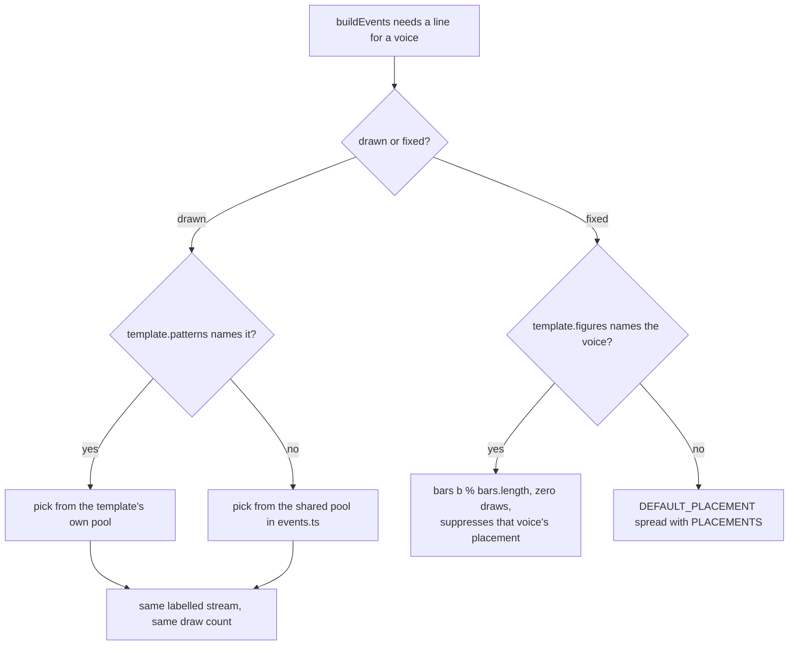

# Tech spec — Epic 1: A feel can carry more than two modes, and Bossa Nova proves it

PRD: [../prd/epic-1-a-feel-can-carry-more-than-two-modes.md](../prd/epic-1-a-feel-can-carry-more-than-two-modes.md) ·
Roadmap: [../roadmap.md](../roadmap.md)

## Approach

The epic is one hard promise with four independent pieces hanging off it. The
promise is R14/AC7: thirty committed mp3s must re-render byte for byte, which
means the `patterns` block may add no draw and may not change the length of any
shared pool. Every design choice below falls out of that — the block is resolved
with `??` at the seven existing `pick` sites, so a template that declares nothing
evaluates to the expression that is there today, character for character. Four
tracks can therefore run at once in Wave 1: a fixture that pins what the
generator builds *before* anything is touched, the `patterns` type and its
validator, the flavour rule and the four assertions that encoded the old one, and
`grooves:add --template`. Only then does the draw-site edit land (Wave 2), then
Bossa Nova (Wave 3, because its `PLACEMENTS` entry re-opens `events.ts`), then
the mint and the documents in parallel (Wave 4).

**Revised after reading Epics 2, 3, 4 and 5.** Four sibling specs were written
in parallel against this epic's PRD rather than against this section, and three
of them invented an extension the block could not carry. The block now carries
eight keys rather than seven, the ambiguous `hat` key is spelled `hatClosed` and
says which pool it replaces, a drawn kit figure exists for a style whose snare is
not a backbeat, and a fixed per-bar `figures` list replaces the one-bar clave
this spec first proposed — which is the decision that settles Epic 5's open
question about fixed figures too. What the contract deliberately does **not** carry is named in
*Architecture* below, with the cost of each omission.

The tail is a genuine chain, not caution: the template cannot be written until
the block resolves, the six grooves cannot be minted until the template exists,
and the app-side counts cannot be corrected until the six grooves are in the
manifest. What is *not* in the chain is the flavour rule — it is a pure predicate
over a list of templates, so it is written and proved against synthetic templates
in Wave 1 and merely re-run when the seventh feel arrives.

## Architecture

### The moving parts

| Part | Where | What changes |
| :-- | :-- | :-- |
| the pin | `eventsFixture.ts`, `events.fixture.json` | coverage goes from five feels to every feel the committed catalogue names |
| the block | `types.ts`, new `patterns.ts` | `PatternPools` (eight keys), `Subdivision`, `KitFigure`, `FixedFigure`, `FeelTemplate.patterns` and `.figures`, `assertPatterns`, `assertFigures` |
| the draw sites | `events.ts` | seven `??` fallbacks, one new conditional draw on `KIT_LABEL`, the fixed-figure emission, two guard calls |
| the rule | new `templates/rules.ts`, `templates/index.test.ts`, `catalogue.test.ts`, `select.test.ts` | two-to-four with overlap; four assertions replaced; the cap widened |
| the flag | `add.ts`, `add-cli.ts` | `--template <id>`, validated before anything renders |
| the style | `templates/bossa-nova.ts`, `templates/index.ts`, `FILLS` | one file, one registry line, its clave on the template rather than in `events.ts` |
| the mint's manifest | `add.ts` | `writeManifest` gets the `heardIn` argument it is missing today |
| the mint | `catalogue.json`, six mp3s, the lock, both manifests' arithmetic | thirty becomes thirty-six |

### Where a figure comes from



Two properties make that safe, and only one of them is about pools. **No shared
pool grows**, so `pick(rng, POOL)` — which scales the draw by `POOL.length` —
returns for every existing seed exactly what it returned before. **Nothing is
added to `MUSIC_LABEL`'s draw order**, so every committed root and flavour is
untouched. `assertPatterns` runs before the first draw and consumes no
randomness, and it is called only when a block is present, so the six existing
templates reach the first `pick` having executed no new code at all.

### What the four styles needed, and what the contract now carries

Epics 2, 3, 4 and 5 read this epic's PRD, not this spec, and between them they
asked for five things. Four are in the contract; one is not, on purpose.

| What a style needed | Who | Answer |
| :-- | :-- | :-- |
| a hat pool for a feel that does **not** ride | 2, 3, 4 | the key is `hatClosed` and it replaces **whichever** hat pool the template would otherwise draw — `HAT_PATTERNS` or `HAT_PUNCTUATION_PATTERNS`. No `events.ts` edit is left for Epic 2 to make |
| a snare line drawn per seed, with its tom accents | 3 | `patterns.kit`, an eighth key, drawn once per groove on a new `KIT_LABEL` stream, replacing `placement.snare` where declared |
| a two-bar clave | 5, and this epic's own bossa | `FeelTemplate.figures`, a list of single-voice per-bar figures, zero draws |
| a tom accent once per pass | 3 | the same `figures` list, with empty bars where the tom is silent — the mechanism toms have never had |
| an arpeggiated comp | 5 | **not in this contract.** See below |

**`compArpeggio` stays Epic 5's.** The line this epic draws is between the
*frozen* part of the contract and the *append-only* part. `patterns`' keys are
frozen and must be complete today, because three epics read that block at the
same time and Epic 3's own Q1 names reopening it as the cost that stops wave 2.
`FeelTemplate` beside `patterns` is append-only: a later epic may add an optional
field of its own provided C8's four conditions hold. `compArpeggio` has exactly
one claimant, changes no frozen key, is read by no other epic, and its semantics
— one tone per step, rotating by step and pass — are a musical decision nothing
in this epic can test. Freezing an untested rotation rule here would be worse
than leaving it where it can be heard. Cost of that choice: Epic 5 edits
`types.ts` and the comp-emission block in `events.ts` in wave 3. Nothing in wave
2 touches either — the three wave-2 epics append a `PLACEMENTS` key and nothing
else — so the collision risk is zero and the reversal is Epic 5's alone.

### What the seventh template turns on for free

Registering an id in `TEMPLATES` enrols it in assertions that already loop
`allTemplates()`: `events.test.ts` alone does so at thirty-four places, including
`every template's density band admits its own grooves` (seeds 1–120),
`every template fills`, `nothing is written past the loop`, and
`gate.test.ts`'s `accepts every feel as committed`. That is most of R19–R23's
coverage, which is why Track F's own steps are the ones no loop can express.

Two ordering facts the registration must respect:

- **Bossa Nova is appended last.** `catalogue.test.ts`'s
  `leaves every first-generation survivor exactly as selectSeeds produced it`
  calls `allTemplates().slice(0, 4)`. Registry order is load-bearing; inserting
  anywhere but the end rewrites that expectation.
- **`selectSeeds` must keep seeing every template even when minting for one.**
  Its `existing` loop skips any spec whose template is not in the list it was
  handed, and a skipped spec contributes nothing to `usedPairs`, `usedAnswers` or
  `flavourCounts`. Narrowing that list is how you mint a groove that duplicates
  another feel's answer and fails `catalogue.test.ts` after the audio is already
  encoded. `--template` narrows *which template is chosen*, never the list
  `selectSeeds` is given.

### The tests that encoded the old rule, and what each becomes

| Assertion | Where | Becomes |
| :-- | :-- | :-- |
| `gives every template exactly two flavours` | `templates/index.test.ts` | `flavourFailures(allTemplates())` is empty — two to four, no duplicates |
| `keeps the pairs pairwise disjoint` | same | deleted, with the reason recorded in the file: overlap is now the point |
| `covers exactly the twelve flavours the game offers` | same | the *set* of offered flavours still equals `FLAVOURS`; the multiset claim (`2 × TEMPLATE_COUNT`) goes |
| `splits the twelve evenly between the two families` | same | the twelve *distinct* offered flavours still split 6/6 by third — `music.md`'s constraint 2, stated over a set instead of a multiset |
| `pairs each flavour with a feel that suits it` | same | kept verbatim for the six (R5 freezes them), plus a row for `bossa-nova` |
| `TEMPLATE_COUNT`-derived counts | same | `allTemplates().length`, with a floor so an empty registry cannot pass |
| `covers every flavour the game offers, evenly` | `select.test.ts` | every offered flavour is reached, and a template's own quota is split as evenly as its list allows |
| `lets no mode dominate the answers` | `catalogue.test.ts` **and** `data/grooves.generated.test.ts` | cap 3× → 5×, reporting both counts |

The last row is the one the PRD names only half of. The app's manifest test
carries the same 3× cap over the same data, and it goes red on the same mint, so
R10 lands in two files on either side of the tier boundary. They cannot share a
constant — an app test may not import from `scripts/` — so both declare
`DOMINANCE_RATIO = 5` under that exact name and a grep finds the pair.

**The guard stays a ratio, and 5× is the number this epic ships.** It is not the
number that survives the whole feature, and that is deliberate. Measured today:
max 3, min 1, clearing 3× with zero margin. `lydian-dominant` and
`melodic-minor` sit at 1 each because only `open-ballad` offers them. Six bossa
grooves take their modes to 4, and `ionian` — offered by `bright-straight`, Bossa
Nova and Epic 2's reggae — climbs toward 7 while the floor stays at 1. **A style
epic whose mint pushes the commonest mode past five times the rarest widens
`DOMINANCE_RATIO` in both copies as part of that mint, and records the new spread
in its report.** That is settled, not contingent: Epics 2–5 cite it rather than
re-asking, and a widening is one line in `scripts/grooves/catalogue.test.ts` and
one in `src/features/daily-groove/data/grooves.generated.test.ts`. The
alternatives — a share of the catalogue, or a ratio graded against a floor of two
— buy a number that never has to move, at the price of a guard nobody can restate
to a player. The ratio says what it is for, and the epic holding the evidence for
where it should sit is the epic that just minted.

### Why the pin covers shuffle now

`events.fixture.json` exists (feature-24) and excludes `shuffle`, because
feature-24 changes it. This epic changes no feel, so its pin has to cover all
thirty or it is not the proof R14 asks for. The fixture's own assertion
`names every feel but shuffle, derived from the templates rather than typed out`
compares `FIXTURE_FEELS` against `allTemplates()`, so it breaks the moment the
seventh template registers regardless — the file has to be touched either way.
Coverage therefore becomes *every feel the committed catalogue names*, derived
from `catalogue.json` rather than from the registry, which is also what makes it
survive Epics 2–5: a mint adds keys, and the review of that diff is the promise
— **additions only, no key rewritten**.

## Contracts

Frozen before any track starts. Epics 2, 3, 4 and 5 write templates against C1
simultaneously in Wave 2 of the roadmap, so C1 is the one that cannot move.

### C1 — the `patterns` block

```ts
// scripts/grooves/types.ts
export type Subdivision = 4 | 8 | 16

export type BongoFigure = { high: number[]; low: number[] }

// The snare line a style plays instead of a backbeat, and the tom accents that
// travel with it. Adopted from Epic 3's KitFigure, shape unchanged.
export type KitFigure = { snare: number[]; tomHigh?: number[]; tomLow?: number[] }

export type PatternPools = {
  kick?: number[][]
  hatClosed?: number[][]
  ride?: Partial<Record<Subdivision, number[][]>>
  bass?: number[][]
  comp?: number[][]
  bongos?: BongoFigure[]
  snareGhosts?: number[][]
  kit?: KitFigure[]
}

export type FeelTemplate = {
  // …every field it has today, unchanged, with `subdivision: Subdivision`…
  patterns?: PatternPools
  figures?: FixedFigure[]        // C7
}
```

R12's seven drawn pools are the first seven keys; `kit` is an eighth, and it is
the only one that does not replace a pool `events.ts` carries today — it creates
one. Every key is optional (R13). Each keeps its pool's own shape:

| Key | Replaces | Shape |
| :-- | :-- | :-- |
| `kick` | `KICK_PATTERNS` | flat sixteenth-grid step lists |
| `hatClosed` | `HAT_PATTERNS`, **or** `HAT_PUNCTUATION_PATTERNS` when the template rides — whichever that template would otherwise draw | flat step lists |
| `ride` | `RIDE_PATTERNS` | step lists keyed by subdivision |
| `bass` | `BASS_PATTERNS` | flat step lists |
| `comp` | `COMP_PATTERNS` | flat step lists |
| `bongos` | `BONGO_PATTERNS` | `{ high, low }` pairs |
| `snareGhosts` | `SNARE_GHOST_PATTERNS` | flat step lists, re-oddened by `ghostSteps` as today |
| `kit` | `placement.snare`, for ordinary bars | `{ snare, tomHigh?, tomLow? }` figures, drawn on `KIT_LABEL` |

Five rules about that table, all frozen:

- **The hat key is spelled `hatClosed`, and it replaces whichever pool applies.**
  Epics 2, 3 and 4 all read this key and all three of them read it as the
  non-riding pool; the PRD's phrase "foot hat" named only the riding one. One key
  covering both is what lets a reggae skank and a riding punctuation figure be
  declared the same way, and it deletes the `events.ts` fallback Epic 2 was
  carrying in its Step A7.
- **A declared pool replaces, never extends.** Declaring `kick` means those
  figures and no others, which is what lets a bossa rule out every figure that
  hits the "and" of 4 and a one-drop rule out every figure that hits step 0.
- **`ride` replaces the whole subdivision map.** A declared `ride` block missing
  an entry for the template's own subdivision throws the error `events.ts`
  already throws for that case, rather than falling back to the shared table.
- **`kit` is the only key that adds a draw, and it adds it on its own stream.**
  `pick` on `rngFor(template:seed:KIT_LABEL)` over `pools.kit`, taken only when
  the key is declared. `KIT_LABEL = 'kit'` joins `RHYTHM_LABEL`, `GHOST_LABEL`,
  `BONGO_LABEL` and `RIDE_LABEL`; nothing is inserted into any of them, which is
  the rule `docs/music.md` states for new randomness. A template that declares no
  `kit` opens no stream and takes no draw, so the thirty are untouched.
- **`kit` owns the snare line where it is declared.** `snareSteps` becomes the
  drawn figure's `snare` instead of `placement.snare`; the ghost filter keeps
  working against it unchanged, and the fill and variation bars still come from
  `FILLS`. A template may declare `PLACEMENTS[...].snare` **or** `patterns.kit`,
  never both — `assertPatterns` rejects the pair, because two sources for one
  voice is a groove nobody can read off the template.

### C2 — the draw sites and the emission

```
pools = template.patterns
if (pools) assertPatterns(template, PLACEMENTS)   // no RNG, before the first draw
if (template.figures) assertFigures(template)

kickSteps   = grid(pick(rhythmRng, pools?.kick      ?? KICK_PATTERNS))
hatSteps    = grid(pick(rhythmRng, pools?.hatClosed ?? (rides ? HAT_PUNCTUATION_PATTERNS : HAT_PATTERNS)))
bassSteps   = grid(pick(rhythmRng, pools?.bass      ?? BASS_PATTERNS))
compSteps   = grid(pick(rhythmRng, pools?.comp      ?? COMP_PATTERNS))
ridePool    = (pools?.ride ?? RIDE_PATTERNS)[template.subdivision]
bongoFigure = pick(bongoRng, pools?.bongos ?? BONGO_PATTERNS)
ghostsForBar = () => ghostSteps(pick(ghostRng, pools?.snareGhosts ?? SNARE_GHOST_PATTERNS), subdiv)

// the one new draw, on its own stream, taken only when the key is declared
kitFigure   = pools?.kit ? pick(rngFor(kitLabelFor(spec)), pools.kit) : null
snareSteps  = grid(kitFigure ? kitFigure.snare : placement.snare)
kitToms     = { tomHigh: grid(kitFigure?.tomHigh ?? []), tomLow: grid(kitFigure?.tomLow ?? []) }

// zero draws, every bar, after the role branch
figureVoices = new Set(template.figures?.map(f => f.voice) ?? [])
rimSteps     = figureVoices.has('rim')     ? [] : grid(placement.rim)
hatOpenSteps = figureVoices.has('hatOpen') ? [] : grid(placement.hatOpen)
for each figure, for each bar b:
  if plays(figure.voice): emit figure.voice at grid(figure.bars[b % figure.bars.length])
```

Order, count and stream of the seven existing draws are exactly today's.
`MUSIC_LABEL` is not touched, no shared pool changes length, and the eighth draw
exists only for a template that declares `kit`. This is the whole of R14 and
R15.

### C3 — the flavour rule as a predicate

```ts
// scripts/grooves/templates/rules.ts
export const FLAVOURS_MIN = 2
export const FLAVOURS_MAX = 4

// One string per broken rule, empty when the set is legal.
export function flavourFailures(templates: readonly FeelTemplate[]): string[]
```

It reports, per template: fewer than `FLAVOURS_MIN`, more than `FLAVOURS_MAX`, a
duplicate inside one list, and a flavour absent from `FLAVOURS`. It reports
**nothing** about two templates sharing a flavour — that is the rule being
dropped, and AC2 is the assertion that no code forbids it. Messages name the
template id and the offending flavour, so a failure reads as a fix rather than a
count.

### C4 — `grooves:add --template <id>`

```
npm run grooves:add 6 -- --template bossa-nova
```

```ts
// scripts/grooves/add-cli.ts
export type AddArgs = { n: number; templateId?: string }
export function parseArgs(argv: readonly string[]): AddArgs

// scripts/grooves/add.ts
export type AddOptions = { /* …as today… */; templateId?: string }
```

- `--template <id>` and `--template=<id>` both parse. An unknown flag, or the
  flag without a value, throws naming the token.
- `templateId` set: every mint is that template, whatever the scarcity order
  says. `templateId` absent: the options object is key-for-key today's, and the
  scarcity path is untouched (AC11).
- An id no registered template holds throws before the pack is loaded and before
  any candidate is rendered, with the known ids listed (R18, AC12). Nothing is
  written.
- `selectSeeds` is still handed the full template list, rotated so the wanted
  template is first — see *Architecture*.
- **`addGrooves` writes the manifest with its `heardIn` table.** `add.ts` calls
  `writeManifest(entries, path, buildPools(entries))` with no fourth argument
  today, so every mint rewrites `grooves.generated.ts` with `HEARD_IN = {}` —
  verified in the working tree, and it fails the app's
  `leaves some scales without an entry rather than padding the table`. `AddOptions`
  gains `heardIn?: HeardInTable`, defaulting to `readHeardIn()`, and passes it
  through. Every minting epic then needs no repair pass, and
  `npm run grooves -- --manifest-only` after a mint becomes a check rather than a
  fix.

Both functions are pure and exported, so no test spawns a process. `--` is the
documented invocation because npm's own argument handling is not part of this
contract.

### C5 — what `bossa-nova` must satisfy

The musician settles every number; these are the bounds, and each is
machine-checked by an existing or specified assertion.

| Field | Bound | Checked by |
| :-- | :-- | :-- |
| `id` | `bossa-nova`, registered **last** in `TEMPLATES` | F1 |
| `subdivision` | `8` | F1 |
| `swing` | `> 0` and `< 0.02` — see C9, Epic 2 has reserved 0.03–0.05 | F2 |
| `tempoRange` | inside `[120, 140]`, `lo < hi`, its `lo-hi` string unique | F2 |
| `flavours` | two to four of `FLAVOURS`, no duplicates; frozen at the first mint | F3 |
| `voices` | holds `kick, snare, hatClosed, bass, comp, rim`; holds none of `ride, rideBell, claves, cowbell`. The closed hat is the timekeeper — this feel does not ride | F6 |
| `humanize` | `lean.snare > 0`, every hat lean `<= 0`, leans only voices it plays, the whole block unique across the registry | existing `index.test.ts` |
| `gain` / `pan` | one of each per played voice, `pan` in `[-1, 1]`, the `[gain, pan]` pair unique | existing |
| `passes` | integer `>= 2`; **if `>= 3`, `FILLS['bossa-nova']` declares a `variation` distinct from its `fill`** | F8 |
| `density` | admits every seed 1–120 | existing `events.test.ts` |
| `patterns` | declares `kick`, `comp` and `hatClosed` — the surdo, the syncopated comp and the straight-eighth timekeeper; `bass` and `snareGhosts` optional; `ride`, `bongos` and `kit` left undeclared | F5 |
| `figures` | one entry, `{ voice: 'rim', bars: [...] }`, two bars — the bossa clave, which suppresses `placement.rim` for this template | F4 |

The `passes` row is the trap worth naming: `withoutToms(DEFAULT_FILL)` is the
default variation, and a template with no toms makes that identical to its fill,
which fails `marks the last bar of the middle pass more lightly than the fill`.
Either declare both phrases or declare two passes.

### C6 — the pin

```ts
// scripts/grooves/eventsFixture.ts
export function fixtureSpecs(catalogue = readCatalogue()): GrooveSpec[]  // the whole catalogue
export function fixtureFeels(catalogue = readCatalogue()): string[]      // its distinct templates, sorted
```

`FIXTURE_FEELS` is deleted. `serialiseEvent`, `fixtureKey`, `buildFixture`,
`readFixture` and `writeFixture` keep their signatures and their nine decimal
places, so the existing digests in `events.fixture.json` stay comparable — the
recapture must add `shuffle`'s keys and rewrite none of the other twenty-four.

### C7 — the fixed figure

Adopted from Epic 5's C3, with one change: a **list** of single-voice figures
rather than the named slots `{ clave?, timekeeper? }`.

```ts
// scripts/grooves/types.ts
export type FixedFigure = {
  voice: VoiceName
  bars: number[][]      // one step list per bar of the cycle, on the sixteenth grid
}
```

- Bar `b` of a pass plays `bars[b % bars.length]`, resolved onto the template's
  subdivision by `gridSteps`. Two entries give a two-bar clave; one entry gives a
  one-bar figure that repeats; four entries with three of them empty give a
  once-per-pass accent, which is the mechanism the toms have never had.
- Emitted in **every** bar, fill and variation bars included — a clave does not
  stop for a fill.
- Emitted only when `template.voices.includes(figure.voice)`.
- Duration `FILL_DURATIONS[voice]`, velocity `velocityFor(voice, sixteenth)`. No
  accent map, no per-figure velocities.
- **Zero RNG draws.** No stream opened, nothing inserted into an existing one,
  which is why this can be frozen here at all.
- A figure naming `rim` or `hatOpen` **suppresses that voice's placement line**
  for the template. A figure naming `snare` is rejected at build time: the snare
  line is either `placement.snare` or `patterns.kit`, and a third source is one
  too many.
- A figure naming `tomHigh` or `tomLow` must leave `bars[BARS_PER_PASS - 1]`
  empty. `events.test.ts`'s `takes the toms out of the variation` is a
  registry-wide assertion over every four-pass template, and a tom sounding in
  the last bar of a pass fails it. This is the non-obvious coupling in the whole
  contract; `assertFigures` throws it by name rather than letting a style
  discover it at mint time.
- `figures` voices are **not** required to be in `BACKING_VOICES`. That array is
  the no-lead-instrument list and `claves` and `cowbell` are deliberately absent
  from it (feature-24's `lets the ride onto the backing track` asserts exactly
  that), so no assertion here may check membership.
- An empty `bars`, a `bars` whose every entry is empty, a step outside `0…15` or a
  non-integer step throws at build time naming the template id and the voice.

Why a list and not Epic 5's named slots: `{ clave?, timekeeper? }` cannot hold
two tom entries, and Epic 3 needs one. What the list costs Epic 5 is its R8
invariant — "exactly one of the claves and the rim, never both" stops being a
property of the type and becomes one assertion over the list. What it keeps is
R13a, the reason the shape was proposed: moving the clave to another instrument
is still one word in `templates/son-montuno.ts`, and the rim suppression still
falls out of the mechanism rather than out of a second edit.

### C8 — what a later epic may add without reopening this contract

`patterns`' keys are **frozen and complete**: three epics read that block at the
same time in wave 2, and adding a key later is the cost Epic 3's Q1 option C
names. `FeelTemplate` beside `patterns` is **append-only**. A later epic may add
an optional field of its own, and it is not a contract change, provided all four
hold:

1. the field is optional, and every template that exists omits it;
2. it adds, removes and reorders no RNG draw;
3. it changes the length of no shared pool and no entry of `MUSIC_LABEL`'s draw
   order;
4. no other epic in flight reads it.

Epic 5's `compArpeggio` satisfies all four. So would a later style's own fixed
table. What does **not** qualify is a new key inside `patterns`, a change to any
key's shape, or a change to `FixedFigure` — those are this epic's to freeze, and
a style that finds them insufficient says so before wave 2 starts rather than
editing them during it.

### C9 — what each style reserves in the shared registry

`templates/index.test.ts` asserts swing values and `lo-hi` tempo strings are
unique across the registry, and three epics write templates in the same wave
without being able to read each other. Bossa Nova takes the near-zero end, so it
has to be narrower than this spec first wrote it: Epic 2 has reserved 0.03–0.05
and explicitly left "the near-zero value Epic 1's bossa will want" to this epic.

| Style | Swing | Tempo range | Source |
| :-- | :-- | :-- | :-- |
| `bossa-nova` | `> 0` and `< 0.02`, so `0.01` or `0.015` | inside 120–140 | this spec, C5 |
| `reggae-one-drop` | 0.03–0.05 | 70–80 | Epic 2, C `Reserved across wave 2` |
| `second-line` | 0.20–0.26 | inside 84–98 | Epic 3, C `second-line's declared shape` |
| `boom-bap` | 0.30–0.40 | inside 85–95, both ends ≤ 92 | Epic 4, C2 |
| `son-montuno` | unreserved — wave 3, so it reads the registry | unreserved | Epic 5 |

Taken today: `0.02, 0.06, 0.18, 0.28, 0.44, 0.64`. `0.02` is `open-ballad`'s, so
"at or near zero" (R19) means strictly under it. `passes` needs no reservation —
nothing asserts it unique, so Epic 4's claim that `3` is unique is true today and
costs nothing if it stops being.

## Tracks

### Track A — The pin over every committed groove

- **Goal** — a committed, exact record of what the generator builds for all
  thirty catalogued grooves, captured before anything else in this epic is
  touched.
- **Owns** — `scripts/grooves/eventsFixture.ts`,
  `scripts/grooves/events.fixture.json`,
  `scripts/grooves/eventsFixture.test.ts`
- **Role** — `musician` (the role every `scripts/grooves/**` track takes; the
  work here is mechanical and needs no musical judgement)
- **Depends on** — C6, and specifically **not** on B, E or any edit to
  `events.ts`. It must observe the base tree.
- **Parallel with** — B, C, D
- **Done when** — `npm run test:gen` is green, the fixture holds one key per
  catalogue spec, and the recapture diff adds `shuffle`'s six entries and
  rewrites no existing digest.

### Track B — The `patterns` type and its guard

- **Goal** — the contract Epics 2–5 write against exists — eight pattern keys,
  the fixed-figure list, and two validators that fail loudly — with a type that
  makes an illegal declaration a compile error where it can.
- **Owns** — `scripts/grooves/types.ts`, `scripts/grooves/patterns.ts` (new),
  `scripts/grooves/patterns.test.ts` (new)
- **Role** — `musician`
- **Depends on** — C1, C7, C8
- **Parallel with** — A, C, D
- **Done when** — `npm run test:gen` is green, `PATTERN_VOICES` names the eight,
  `assertPatterns` rejects an empty pool, an out-of-range step and a
  `kit`-with-`placement.snare` pair by name, and `assertFigures` rejects a snare
  figure and a tom figure that sounds in the last bar of a pass — all without
  `events.ts` having changed.

### Track C — The flavour rule replaces the pair rule

- **Goal** — two to four modes with overlap allowed, asserted as a predicate over
  any template list; the four assertions that encoded the old rule replaced or
  removed on the record; the dominance cap widened generator-side.
- **Owns** — `scripts/grooves/templates/rules.ts` (new),
  `scripts/grooves/templates/rules.test.ts` (new),
  `scripts/grooves/templates/index.test.ts`,
  `scripts/grooves/catalogue.test.ts`, `scripts/grooves/select.test.ts`
- **Role** — `musician`
- **Depends on** — C3
- **Parallel with** — A, B, D
- **Done when** — `npm run test:gen` is green with six templates registered, and
  every new assertion is proved against a synthetic four-flavour template rather
  than waiting for Bossa Nova.

### Track D — Minting for one style

- **Goal** — `grooves:add <n> --template <id>` mints only that template, rejects
  an unknown id before rendering anything, behaves exactly as today without the
  flag, and stops writing an empty `HEARD_IN` into the manifest.
- **Owns** — `scripts/grooves/add.ts`, `scripts/grooves/add-cli.ts`,
  `scripts/grooves/add.test.ts`, `scripts/grooves/add-cli.test.ts`
- **Role** — `musician`
- **Depends on** — C4. It needs no template that does not yet exist: every test
  passes `templates:` and a temp-directory catalogue.
- **Parallel with** — A, B, C
- **Done when** — `npm run test:gen` is green, the committed catalogue, lock and
  `public/grooves/` are byte-identical after the suite, a flagged run mints only
  the named template, and a minted manifest carries a non-empty `HEARD_IN`.

### Track E — The draw sites

- **Goal** — all eight pattern keys resolve through the template's own block, the
  fixed-figure list is emitted and suppresses the placements it replaces, and the
  thirty committed grooves build byte-identically when a template declares
  neither.
- **Owns** — `scripts/grooves/events.ts`, `scripts/grooves/events.test.ts`
- **Role** — `musician`
- **Depends on** — B (`PatternPools`, `FixedFigure`, `assertPatterns` and
  `assertFigures` must exist), A (the pin must be captured and green before
  `events.ts` is edited), C1, C2, C7
- **Parallel with** — none
- **Done when** — `npm run test:gen` is green, Track A's fixture is still green,
  a synthetic template declaring one pool differs from the same template without
  the block in that voice alone, and `KIT_LABEL`, `KitFigure` and the figure
  emission are exported for Epics 3 and 5 to build against.

### Track F — Bossa Nova

- **Goal** — a seventh feel exists: straight, 120–140, its clave on the rim, its
  surdo kick, comp figure and straight-eighth closed hat from its own pools, no
  ride anywhere in it, and the registry's assertions green with seven templates.
- **Owns** — `scripts/grooves/templates/bossa-nova.ts` (new),
  `scripts/grooves/templates/index.ts`, the `FILLS['bossa-nova']` entry in
  `scripts/grooves/events.ts` if it declares three or more passes, and the
  `bossa-nova` rows in `scripts/grooves/templates/index.test.ts`. Its clave is on
  the template, in `figures`, so it appends no `PLACEMENTS` key — which is one
  fewer edit in the file all four style epics share.
- **Role** — `musician`
- **Depends on** — E (its `patterns` block must actually be drawn from, and its
  placement entry re-opens `events.ts`), C (the rule must accept three or four
  flavours), C5
- **Parallel with** — none
- **Done when** — `npm run test:gen` is green with seven templates, and a bossa
  groove built at any seed carries the declared clave on the rim, the declared
  surdo on the kick, the declared straight eighths on the closed hat and no voice
  outside its kit.

### Track G — The mint, the arithmetic and the sign-off

- **Goal** — six bossa grooves in the catalogue, all seven gate checks passing,
  thirty untouched mp3s, both tiers' counts corrected, and a person's verdict on
  record.
- **Owns** — `scripts/grooves/catalogue.json`,
  `public/grooves/groove-31.mp3` … `groove-36.mp3`,
  `scripts/grooves/grooves.lock.json`,
  `scripts/grooves/events.fixture.json` (regenerated),
  `src/features/daily-groove/data/grooves.generated.ts`,
  `src/features/daily-groove/data/grooves.generated.test.ts`
- **Role** — `musician`, with the app-tier arithmetic as its second, mechanical
  turn
- **Depends on** — D (the flag), F (the template)
- **Parallel with** — H
- **Done when** — `npm run test:all` is green, `npm run grooves:verify` is clean,
  `node scripts/grooves/rerender-check.ts` reports thirty-six of thirty-six
  matching, and the report carries a listening verdict per groove.

The mint and the app-side counts are one track on purpose: the app suite is red
between them, because `covers all 30 catalogued grooves` and the app's own 3×
dominance cap both fail the instant the manifest grows. Their dependency is the
mint's *output*, not a file, so they cannot be two waves.

### Track H — The documents

- **Goal** — nothing in the repo still states the two-flavour rule as current,
  the feel table has a row per registered template, the routing table sends a
  rhythm figure to the right of three places, and `KIT_LABEL` joins the list of
  streams `MUSIC_LABEL` may not absorb.
- **Owns** — `docs/music.md`, `specs/new-styles.md`,
  `scripts/grooves/README.md`, `scripts/grooves/docs.test.ts`
- **Role** — `musician`
- **Depends on** — F (the table needs Bossa Nova's settled parameters), B (the
  routing row names the block)
- **Parallel with** — G. It touches no catalogue, audio, lock or manifest file,
  and G touches no document.
- **Done when** — `npm run test:gen` is green and `docs.test.ts` derives the feel
  table's rows from `allTemplates()`, so Epics 2–5 update the document or fail.

## Execution waves

- **Wave 1 (parallel):** Track A, Track B, Track C, Track D
- **Wave 2:** Track E — needs `PatternPools` (B) and the pin captured from an
  unedited `events.ts` (A)
- **Wave 3:** Track F — its `PLACEMENTS` entry re-opens `events.ts`, which E owns
  in Wave 2
- **Wave 4 (parallel):** Track G, Track H

Wave 1's four tracks own disjoint paths. Later waves re-open files an earlier
wave owned — `events.ts` in E then F, `index.test.ts` in C then F,
`events.fixture.json` in A then G — which is safe because no two tracks in the
same wave name the same path.

**`events.ts` is the file the whole feature contends for.** Epics 2, 3 and 4 each
append a `PLACEMENTS` key to it in the roadmap's wave 2, and Epic 5 edits its
comp block in wave 3. Two things in this epic are shaped by that. Every extension
it adds is a **per-template key or a template field**, never a positional edit, so
three parallel appends conflict textually and not semantically. And Bossa Nova's
clave lives in `figures` on the template rather than in `PLACEMENTS`, which takes
this epic's own style out of that queue entirely.

## Implementation

### Track A — The pin over every committed groove

#### Step A1 — the fixture covers every feel the catalogue names

Covers: R14

- **Test first** — `scripts/grooves/eventsFixture.test.ts`: replace
  `names every feel but shuffle, derived from the templates rather than typed out`
  with `names every feel the committed catalogue uses`: assert
  `fixtureFeels()` equals the sorted distinct `template` values in
  `readCatalogue()`, and that it contains `shuffle`. Assert
  `fixtureSpecs()` has the same length as `readCatalogue()`. Run it: fails with
  `SyntaxError: … does not provide an export named 'fixtureFeels'`, then on the
  length — `fixtureSpecs()` returns 24 of 30.
- **Implement** — `scripts/grooves/eventsFixture.ts`: delete `FIXTURE_FEELS`, add
  `fixtureFeels(catalogue = readCatalogue())`, and make `fixtureSpecs` return the
  catalogue unfiltered.
- **Green when** — both assertions pass and the deep-equal in
  `the byte-identity fixture` is the only remaining failure.
- **Refactor** — none. Every other export keeps its signature so the committed
  digests stay comparable.

#### Step A2 — the thirty are captured from the base tree

Covers: R14, AC7

- **Test first** — `eventsFixture.test.ts`: `expect(buildFixture()).toEqual(readFixture())`
  is already there and is now red — it fails on six missing `shuffle:*` keys.
  Add `expect(Object.keys(readFixture())).toHaveLength(readCatalogue().length)`.
- **Implement** — with **no other feature-25 edit in the tree**, run
  `node scripts/grooves/eventsFixture.ts --write` and commit
  `events.fixture.json`. Check the diff before committing: it must add
  `shuffle:*` keys and touch no existing key. If any existing digest moved,
  stop — something in the base tree is not what this epic thinks it is.
- **Green when** — the deep-equal passes on a clean tree and the key count is
  thirty.
- **Refactor** — none.

#### Step A3 — the pin cannot silently shrink

Covers: R14

- **Test first** — `eventsFixture.test.ts`: assert the fixture's key set equals
  `readCatalogue().map(fixtureKey)` exactly — in both directions, so neither a
  dropped groove nor a stale key survives; assert every entry has at least one
  event and a positive `bpm`. Prove it red by pointing `readFixture` at a
  hand-truncated copy in a temp file first, so the failure is on record.
- **Implement** — nothing beyond A1 and A2 if they were done right.
- **Green when** — both directions match.
- **Refactor** — delete `the five feels that do not ride` phrasing from the
  remaining test names; the fixture is no longer about riding.

### Track B — The `patterns` type and its guard

#### Step B1 — the block names all eight pools from the start

Covers: R11, R12

- **Test first** — `scripts/grooves/patterns.test.ts`: import `PATTERN_VOICES`
  from `./patterns.ts` and assert it equals
  `['kick', 'hatClosed', 'ride', 'bass', 'comp', 'bongos', 'snareGhosts', 'kit']`
  in that order, with eight unique entries, and that the first seven are the
  pools `events.ts` carries today while `kit` is the one that is not. Then
  declare a `const t: FeelTemplate` literal with
  `patterns: { kick: [[0, 6, 10]], kit: [{ snare: [3, 11], tomLow: [14] }] }` and
  a second with `figures: [{ voice: 'rim', bars: [[0, 6, 12], [2, 8]] }]`, and
  assert both read back — the compile is half the assertion. Run it: fails, no
  such module.
- **Implement** — `scripts/grooves/types.ts`: add `Subdivision`, `BongoFigure`,
  `KitFigure`, `FixedFigure`, `PatternPools` and the optional `patterns` and
  `figures` fields per C1 and C7, and retype `subdivision: Subdivision`.
  `scripts/grooves/patterns.ts`: export `PATTERN_VOICES` as a `const` tuple.
- **Green when** — the eight names match and `npm run test:gen` is green.
- **Refactor** — `boundary.test.ts` asserts what `types.ts` may and may not
  declare (no `Root`, no `Flavour =`, the `FlavourSlug as Flavour` re-export).
  Re-run it: three new type aliases are none of those, but the assertion is
  cheap to break by accident.

#### Step B2 — a declared pool may not be empty

Covers: R16, AC9

- **Test first** — `patterns.test.ts`: `assertPatterns({ ...someTemplate, id: 'x',
  patterns: { kick: [] } })` throws matching `/x/` and `/kick/`; the same for
  `comp: [[]]` (a figure with no steps), for `bongos: [{ high: [], low: [] }]`
  and for `kit: [{ snare: [] }]`. Assert a template with no block, and one whose
  block names only voices with legal pools, do **not** throw. Run it: fails,
  `assertPatterns` is not exported.
- **Implement** — `scripts/grooves/patterns.ts`: `assertPatterns(template:
  FeelTemplate): void`, walking `PATTERN_VOICES` and throwing
  `Error(\`${template.id}: patterns.${voice} …\`)` on the first fault. One message
  per fault, naming the template and the voice.
- **Green when** — all six cases behave and `npm run test:gen` is green.
- **Refactor** — none.

#### Step B3 — every step is an integer inside 0…15

Covers: R16, AC9

- **Test first** — `patterns.test.ts`: a step of `16`, of `-1`, and of `2.5`
  each throw naming the template and the voice and quoting the offending step;
  `[[0, 15]]` does not. Run it: fails, only emptiness is checked.
- **Implement** — extend `assertPatterns` with the range and integer check
  against `PATTERN_RESOLUTION`'s 16-step grid.
- **Green when** — the three bad steps throw and the boundary pair passes.
- **Refactor** — export the grid bound from one place rather than repeating
  `16`; `events.ts` owns `PATTERN_RESOLUTION` and `patterns.ts` may not import
  from `events.ts` without a cycle, so declare the bound in `patterns.ts` and
  have `events.ts` assert the two agree in Step E6.

#### Step B4 — the bongos, the ride and the kit keep their own shapes

Covers: R12, R16

- **Test first** — `patterns.test.ts`: a `bongos` figure with a legal `high` and
  an out-of-range `low` throws naming `bongos`; a `ride` block whose `8` entry is
  `[]` throws naming `ride`; a `ride` block keyed only at `16` does **not** throw
  at validation time — the subdivision mismatch is `buildEvents`' error, checked
  in E5; a `kit` figure whose `tomHigh` shares a step with its own `snare` throws
  naming `kit` and the step, and one whose lines hold a duplicate step throws
  too; a template declaring both `patterns.kit` and a
  `PLACEMENTS[id].snare` entry throws naming both sources (C1's last rule). Run
  it: fails, all four are treated as flat step lists.
- **Implement** — branch `assertPatterns` on the four shapes, and read
  `PLACEMENTS` for the snare-source check. The five validation rules for `kit`
  are Epic 3's, adopted unchanged: the pool is non-empty, every figure's `snare`
  line is non-empty, every step is an integer inside `0…15`, each line is
  duplicate-free, and a figure's tom lines do not share a step with its own
  snare line.
- **Green when** — the shape-specific messages appear.
- **Refactor** — none. `patterns.ts` importing `PLACEMENTS` from `events.ts`
  would make a cycle once `events.ts` imports `assertPatterns`; pass the
  placement table in as an argument instead, defaulted to `PLACEMENTS` at the
  call site in `buildEvents`.

#### Step B5 — silence is legal, and so is an absent block

Covers: R13, R14

- **Test first** — `patterns.test.ts`: for each of the six committed templates,
  `template.patterns` is `undefined` and `assertPatterns` is never reached (assert
  the field, not the call); a block naming `kick` alone leaves the other six keys
  `undefined`. Run it: passes only once B1 landed; write it as red by asserting
  the field before B1's type exists.
- **Implement** — nothing; this pins the fallback contract Epics 2–5 rely on.
- **Green when** — all six templates declare no block.
- **Refactor** — none.

#### Step B6 — a fixed figure is a list of bars, and it knows what it may not name

Covers: R11, R16

- **Test first** — `patterns.test.ts`: `assertFigures` accepts
  `[{ voice: 'rim', bars: [[0, 6, 12], [2, 8]] }]` and
  `[{ voice: 'tomLow', bars: [[], [], [10], []] }]`. It throws, naming the
  template id and the voice, on: `bars: []`; `bars: [[]]`; a step of `16`, `-1`
  or `2.5`; `voice: 'snare'` (C7 — the snare has two sources already); and
  `{ voice: 'tomHigh', bars: [[2], [4], [6], [8]] }`, whose last bar would put a
  tom in the variation bar and fail
  `events.test.ts`'s `takes the toms out of the variation`. Assert it does
  **not** require the voice to be in `BACKING_VOICES` — a `claves` figure is
  legal, which is what Epic 5 needs. Run it: fails, `assertFigures` is not
  exported.
- **Implement** — `patterns.ts`: `assertFigures(template: FeelTemplate): void`.
  The tom rule reads `BARS_PER_PASS - 1`; declare that bound in `patterns.ts` and
  assert it against `events.ts`' own in Step E6, the same way the grid bound is
  handled.
- **Green when** — the two legal cases pass and the five illegal ones throw by
  name.
- **Refactor** — the tom rule earns a one-line comment naming the assertion it
  protects. It is the one rule in the contract that a reader cannot derive from
  the music.

### Track C — The flavour rule replaces the pair rule

#### Step C1 — two to four, no duplicates

Covers: R1, R2, AC1

- **Test first** — `scripts/grooves/templates/rules.test.ts`: build synthetic
  templates off `templateById('bright-straight')` with `flavours` of length 1, 2,
  3, 4 and 5, and one with `['ionian', 'ionian']`. Assert
  `flavourFailures([one])` names the template and says two is the floor;
  `flavourFailures([five])` names it and says four is the ceiling;
  `flavourFailures([two])`, `[three]`, `[four]` are `[]`; the duplicate case
  names `ionian`. Assert `FLAVOURS_MIN === 2` and `FLAVOURS_MAX === 4`. Run it:
  fails, no such module.
- **Implement** — `scripts/grooves/templates/rules.ts` per C3.
- **Green when** — six cases behave and `npm run test:gen` is green.
- **Refactor** — none.

#### Step C2 — two templates may declare the same flavour

Covers: R1, AC2

- **Test first** — `rules.test.ts`: two synthetic templates that share `ionian`
  and differ in id — `flavourFailures` returns `[]`. Assert the same for three
  templates sharing one flavour. Then, in
  `scripts/grooves/templates/index.test.ts`, assert
  `flavourFailures(allTemplates())` is `[]`, and — the assertion that keeps the
  rule from creeping back — that inserting a synthetic template sharing
  `bright-straight`'s `ionian` into that list still returns `[]`. Run it: the
  synthetic-overlap case fails against the old `keeps the pairs pairwise
  disjoint` assertion with `Expected: [] Received: ["ionian"]`, which is the
  failure this step retires.
- **Implement** — nothing in `rules.ts` beyond C1; delete
  `keeps the pairs pairwise disjoint` and leave a one-line note in
  `index.test.ts` recording that overlap is the point of feature-25 rather than
  an oversight.
- **Green when** — the overlap cases pass and no assertion forbids sharing.
- **Refactor** — none.

#### Step C3 — the two-flavour assertion becomes the rule it stood in for

Covers: R7

- **Test first** — `index.test.ts`: replace
  `gives every template exactly two flavours` with an assertion that
  `flavourFailures(allTemplates())` is `[]` **and** that every registered
  template holds two, three or four distinct flavours. Prove the old assertion's
  failure first by running it against `[...allTemplates(), FOUR_MODE]`, where
  `FOUR_MODE` is a synthetic four-flavour template: `expected length 4 to be 2`.
- **Implement** — the replacement, in the `flavour coverage` describe, renamed to
  name feature-25's requirement ids rather than feature-3's.
- **Green when** — `npm run test:gen` is green with six templates.
- **Refactor** — none.

#### Step C4 — the coverage claim keeps the direction that matters

Covers: R7

- **Test first** — `index.test.ts`: rewrite
  `covers exactly the twelve flavours the game offers` as two assertions — the
  *set* of flavours the registry offers equals the set `FLAVOURS` names, and no
  template offers a flavour `FLAVOURS` does not. Delete the multiset claim
  `expect(union).toHaveLength(2 * TEMPLATE_COUNT)`. Prove the old form red
  against `[...allTemplates(), FOUR_MODE]`: `expected length 16 to be 12`.
- **Implement** — the rewrite.
- **Green when** — both directions hold for six templates and would hold for
  seven.
- **Refactor** — none. `renders twelve of the thirteen scales the shared table
  carries` is untouched: it is R6's assertion and locrian's absence does not
  depend on the rule.

#### Step C5 — the family split is about the twelve, not about the pairs

Covers: R7, R3, R4, AC3

- **Test first** — `index.test.ts`: rewrite
  `splits the twelve evenly between the two families` over the **distinct**
  offered flavours: six graded major, six minor, and every one gradeable by a
  single third. Prove the old form red against `[...allTemplates(), FOUR_MODE]`:
  `major-third modes: expected length 8 to be 6`. Separately, in
  `scripts/grooves/catalogue.test.ts`, leave
  `puts grooves behind every mode its templates offer` exactly as it is — it
  already asserts both R3 and R4 — and add a line to its name recording that it
  is now the only place those guarantees live.
- **Implement** — the rewrite in `index.test.ts`; a name change only in
  `catalogue.test.ts`.
- **Green when** — the split is 6/6 over the set and the catalogue coverage
  assertions still pass.
- **Refactor** — none.

#### Step C6 — the counts say what they mean

Covers: R9

- **Test first** — `index.test.ts`: replace every use of `TEMPLATE_COUNT` with
  `allTemplates().length` in `holds six templates with unique ids`,
  `does not give every template the same subdivision, swing or tempo range` and
  `gives each template its own mix and its own feel`; rename the first to
  `holds every template under a unique id`. Add
  `expect(allTemplates().length).toBeGreaterThanOrEqual(6)` so an empty or
  truncated registry cannot make the suite vacuous. Prove it red by deleting the
  `const TEMPLATE_COUNT = 6` line first: `ReferenceError: TEMPLATE_COUNT is not
  defined` in three assertions.
- **Implement** — the substitution, and delete the constant.
- **Green when** — unique ids, swings, tempo ranges, mixes and humanize blocks
  all hold across `allTemplates().length`.
- **Refactor** — none. These four assertions are what stop the seventh feel
  being a copy of a sixth, so they get stronger, not weaker, as the registry
  grows.

#### Step C7 — the dominance cap widens to 5×, and says both numbers

Covers: R10, AC5

- **Test first** — `catalogue.test.ts`: add a describe over a pure local helper
  `dominanceFailure(counts: Map<Flavour, number>, ratio: number): string | null`
  — `{a: 7, b: 2}` at ratio 5 returns `null`; `{a: 11, b: 2}` returns a string
  containing `11`, `2` and both flavour names; `{a: 4, b: 1}` returns `null` at 5
  and a string at 3. Then rewrite `lets no mode dominate the answers` to call it
  with `DOMINANCE_RATIO = 5` over the real catalogue and assert `null`. Run it:
  fails, no such helper.
- **Implement** — the helper and the constant in `catalogue.test.ts`.
  `DOMINANCE_RATIO` is a single named `const` at the top of the file and
  `dominanceFailure` takes the ratio as an argument, so a later style epic widens
  the number by editing one line and touches no assertion.
- **Green when** — the four synthetic cases behave and the real catalogue passes.
  Today's spread is max 3, min 1 — at 3× it passes by exactly nothing, which is
  why the widening is not cosmetic.
- **Refactor** — name the constant `DOMINANCE_RATIO` here and in
  `src/features/daily-groove/data/grooves.generated.test.ts` (Step G4) so one
  grep finds both halves of R10. They cannot share a declaration: an app test
  may not import from `scripts/`. Name it in the test's failure message too: a
  style epic whose mint pushes the commonest mode past 5× widens both constants
  as part of that mint, and the message is what tells it which two lines to
  open.

#### Step C8 — an even spread is per template, not per flavour

Covers: R7, R9

- **Test first** — `scripts/grooves/select.test.ts`: rewrite
  `covers every flavour the game offers, evenly` as — every offered flavour is
  reached by at least one selected spec, and within each template's own four
  specs each of its flavours appears `floor(4/k)` or `ceil(4/k)` times, where `k`
  is the length of its list. Prove the old form red by running it over
  `[...allTemplates(), FOUR_MODE]`: `ionian: expected 3 to be 2`.
- **Implement** — the rewrite. `select.ts` itself does not change: its quota
  logic already splits `perTemplate` over a list of any length, and its
  scarcity-first tie-break is what will spread six bossa mints across three or
  four modes.
- **Green when** — both assertions hold for six templates and for the synthetic
  seventh.
- **Refactor** — none.

#### Step C9 — the six lists and the twelve names are untouched

Covers: R5, R6, R8, AC4

- **Test first** — `index.test.ts`: leave `pairs each flavour with a feel that
  suits it` byte-identical — it is the assertion that freezes the six lists in
  content and order — and add to it that each of the six templates' `flavours`
  has exactly two entries, so an append to an existing list fails here rather
  than in a re-render. Add an assertion that `FLAVOURS` has twelve entries in a
  literal, hard-coded order with `locrian` absent. Run it: the order pin fails
  only if someone has already reordered `names.ts`.
- **Implement** — nothing in source. This step exists to make R5 and R6 break a
  test rather than break a player's history.
- **Green when** — green, and `git diff` for this epic touches none of the six
  template files' `flavours` lines and none of `src/lib/theory/names.ts`.
- **Refactor** — none.

### Track D — Minting for one style

#### Step D1 — the CLI reads a template id

Covers: R17

- **Test first** — `scripts/grooves/add-cli.test.ts`: assert
  `parseArgs(['6', '--template', 'bossa-nova'])` is
  `{ n: 6, templateId: 'bossa-nova' }`; that `--template=bossa-nova` parses the
  same; that `parseArgs(['6'])` has no `templateId` key; that
  `parseArgs(['6', '--template'])` throws naming `--template`; and that
  `parseArgs(['6', '--wat'])` throws naming `--wat`. Run it: fails,
  `parseArgs` is not exported.
- **Implement** — `scripts/grooves/add-cli.ts`: export `parseArgs` in the shape
  `cli.ts` already uses (a `switch` over tokens with a `valueFor` helper), and
  route `main` through it. Extend `USAGE` to
  `usage: npm run grooves:add <n> [-- --template <id>]`.
- **Green when** — the five cases behave and the existing
  `refuses a missing or non-numeric count` test still passes, including its
  `npm run grooves:add <n>` substring check.
- **Refactor** — the count validation moves inside `parseArgs`, so `main` is left
  with one failure path to report rather than two.

#### Step D2 — an unknown id is rejected before anything renders

Covers: R18, AC12

- **Test first** — `add-cli.test.ts`: with the temp-directory fixture, call
  `main(['1', '--template', 'bossa-nvoa'], { ...f, templates: allTemplates() })`
  and assert it returns `1`; the log contains `bossa-nvoa` and every registered
  id; `catalogue.json` in the fixture is byte-identical; `readdirSync(f.outDir)`
  is unchanged. Add an `add.test.ts` case that `addGrooves(1, { templateId:
  'nope', … })` rejects with a message listing the known ids **and** that the
  pack loader was never called (pass a `pack` whose `get` throws). Run it: fails,
  `templateId` is not a known option and the run mints a groove.
- **Implement** — `add.ts`: resolve `templateId` against `templates` at the top of
  `addGrooves`, before `readCatalogue` and before `loadPack`, throwing
  `addGrooves: unknown template "nope" — known: bright-straight, half-time, …`.
- **Green when** — both assertions pass and nothing is written.
- **Refactor** — reuse the existing `templateFor` helper's message shape so the
  two unknown-template errors read alike.

#### Step D3 — the flag beats the scarcity order

Covers: R17, AC10

- **Test first** — `add.test.ts`: a fixture catalogue holding two
  `straight-funk` grooves and nothing else, so every other template is scarcer.
  `addGrooves(2, { templateId: 'straight-funk', startSeed: 9000, gate: PASS, …})`
  → both minted specs name `straight-funk`. Add the mirror: with
  `templateId: 'bright-straight'`, both name `bright-straight` even though
  `straight-funk` is not the scarcest. Run it: fails — the scarcity path mints
  two different templates.
- **Implement** — `add.ts`: when `templateId` resolves, the per-attempt template
  is that template instead of `byScarcity[minted.length % …]`.
- **Green when** — every minted spec names the requested template.
- **Refactor** — none.

#### Step D4 — no flag means exactly today

Covers: R17, AC11

- **Test first** — `add.test.ts`: with a fixed `startSeed` and `gate: PASS`, two
  runs of `addGrooves(4, …)` over identical fixtures produce identical spec
  arrays; the existing `spreads a batch across more than one template` still
  passes; and `addGrooves(4, { templateId: undefined, … })` equals
  `addGrooves(4, { … })`. Run it: passes only if the flag was added without
  disturbing the default path — write it before D3 so it is a regression guard,
  not a formality.
- **Implement** — nothing beyond D3 if the branch was added around the choice of
  template only.
- **Green when** — the two runs match spec for spec.
- **Refactor** — none.

#### Step D5 — a one-template mint still sees every other template's answers

Covers: R17

- **Test first** — `add.test.ts`: a fixture catalogue with grooves from two
  templates; mint 2 with `templateId` naming a third; assert that across the
  resulting catalogue no `root|flavour` pair and no `scale|progression` pair
  repeats, rebuilding each entry through `buildEvents`. Run it red by
  implementing D3 the tempting way first — passing `[wanted]` to `selectSeeds` —
  and watch a duplicate answer appear.
- **Implement** — keep passing `rotate(templates, wanted)` to `selectSeeds`, so
  its `existing` loop can still resolve every committed spec's template and
  register its answer.
- **Green when** — no duplicate answer or scale-and-progression pair.
- **Refactor** — none. This is the assertion that stops a mint that only fails
  later, in `catalogue.test.ts`, after six mp3s have been encoded.

#### Step D6 — a mint stops emptying the reveal's "heard in" table

Covers: R17

- **Test first** — `add.test.ts`: after `addGrooves(1, …)` against the temp
  fixture, read the written manifest and assert its `HEARD_IN` object is
  non-empty and holds the same keys as the `heardIn` table the run was given.
  Pass a two-entry table through the new option so the assertion does not depend
  on the committed `heard-in.json`. Run it: fails — the manifest carries
  `export const HEARD_IN: Record<string, HeardIn> = {}`, because
  `add.ts` calls `writeManifest` with three arguments where `cli.ts` passes four.
- **Implement** — `add.ts`: `AddOptions` gains `heardIn?: HeardInTable`, resolved
  as `opts.heardIn ?? readHeardIn()` and passed as `writeManifest`'s fourth
  argument.
- **Green when** — the minted manifest carries the table, and the app's
  `leaves some scales without an entry rather than padding the table` — which
  asserts `Object.keys(HEARD_IN).length > 0` — cannot be broken by a mint.
- **Refactor** — none. Every style epic mints, so this bug would otherwise be
  found five times. `npm run grooves -- --manifest-only` after a mint stays in
  Track G's verification as a check, not as the repair it is today.

### Track E — The draw sites

#### Step E1 — a template's own kick pool is drawn instead of the shared one

Covers: R11, R13, AC6

- **Test first** — `scripts/grooves/events.test.ts`, a new describe
  `a template brings its own figures — feature-25 epic-1`: build
  `WITH = { ...templateById('straight-funk'), id: 'own-kick', patterns: { kick:
  [[0, 6]] } }` and `WITHOUT = { ...WITH, patterns: undefined }` at the same
  seed. Assert every `kick` event in `WITH` lands on a step in
  `gridSteps([0, 6], 16)` and on no other; assert the `bass`, `comp`,
  `hatClosed`, `hatOpen` and ghost-`snare` event lists serialise identically
  between `WITH` and `WITHOUT`. Run it: fails — `WITH`'s kick lands on
  `KICK_PATTERNS`' drawn figure.
- **Implement** — `events.ts`: the `kick` fallback from C2, and
  `if (template.patterns) assertPatterns(template)` above the first draw.
- **Green when** — the kick moves and nothing else does.
- **Refactor** — none.

#### Step E2 — all eight pools route, and an unnamed voice falls back

Covers: R12, R13, AC6

- **Test first** — `events.test.ts`: one case per key. `hatClosed` on a
  non-riding template **and** on a riding one — both replace the pool that would
  otherwise apply, which is the assertion that retires Epic 2's `events.ts`
  fallback. `bass`, `comp`, `snareGhosts` on `straight-funk`; `bongos` on
  `bright-straight`; `ride` on `shuffle`. Each asserts (a) the voice's events sit
  on the declared figure, (b) every *other* voice's events serialise identically
  to the same template with `patterns: undefined`. Run it: fails on six of the
  seven.
- **Implement** — the remaining six fallbacks from C2. `kit` is Step E7.
- **Green when** — seven declared-pool cases and seven fallback cases pass.
- **Refactor** — the seven `??` expressions read alike; do not factor them into a
  loop. A helper that picks by name would put a lookup between the stream and
  the draw, and the audit that matters here is "the same `pick` in the same order
  as before".

#### Step E3 — the block adds no draw, and the thirty do not move

Covers: R14, R15, AC8

- **Test first** — `events.test.ts`: for every spec in `readCatalogue()`, assert
  `serialiseGroove(spec)` deep-equals `readFixture()[fixtureKey(spec)]` —
  Track A's pin, asserted from the suite that changes `events.ts`. Add: for a
  template declaring `kick` alone, `music` deep-equals the same template's
  `music` without the block, at ten seeds — the root, flavour, scale, chord,
  progression and degrees are untouched by a rhythm pool. Run it: green if C2 was
  implemented as written, red the moment a draw is inserted.
- **Implement** — nothing. This is the wire-up assertion for the promise.
- **Green when** — thirty digests match and ten `music` blocks match.
- **Refactor** — none.

#### Step E4 — an illegal block fails at build time

Covers: R16, AC9

- **Test first** — `events.test.ts`: `buildEvents(spec, { ...straightFunk,
  id: 'bad', patterns: { comp: [] } })` throws matching `/bad/` and `/comp/`;
  with `{ kick: [[16]] }` it throws naming `kick` and `16`. Assert the throw
  happens before any event is returned, and that a legal block does not throw.
  Run it: fails — the empty pool reaches `pick` and returns `undefined`, then
  `gridSteps` throws something unreadable about iteration.
- **Implement** — nothing beyond E1's guard call if `assertPatterns` is invoked
  before the first draw. If the guard was placed later, move it.
- **Green when** — both messages name the template and the voice.
- **Refactor** — none.

#### Step E5 — a declared ride pool replaces the whole subdivision map

Covers: R12

- **Test first** — `events.test.ts`: a riding template with `patterns: { ride:
  { 8: [[0, 4, 8, 12]] } }` sounds the ride on the quarters and nowhere else; a
  riding template whose declared block is keyed only at `16` throws the existing
  `no ride pattern pool for subdivision 8` error, naming the template. Run it:
  fails, the declared block is ignored.
- **Implement** — `events.ts`: `(pools?.ride ?? RIDE_PATTERNS)[template.subdivision]`,
  keeping the existing throw for a missing entry.
- **Green when** — both cases behave and `shuffle` is unchanged.
- **Refactor** — retype `RIDE_PATTERNS` as
  `Partial<Record<Subdivision, number[][]>>`, so the two tables have one type.

#### Step E6 — one grid bound, asserted in both places

Covers: R16

- **Test first** — `events.test.ts`: assert `PATTERN_RESOLUTION` equals
  `patterns.ts`'s exported grid bound. Run it: fails if the two drift.
- **Implement** — export `PATTERN_RESOLUTION` from `events.ts` and assert the
  equality; do not import across the two modules in the other direction.
- **Green when** — the two agree.
- **Refactor** — none.

#### Step E7 — a drawn kit figure replaces the backbeat

Covers: R11, R12, R13, AC6

- **Test first** — `events.test.ts`: `KIT = { ...templateById('straight-funk'),
  id: 'own-kit', patterns: { kit: [{ snare: [2, 7, 10], tomLow: [14] }] } }`.
  Assert (a) every ordinary-bar `snare` event that is not a ghost lands on
  `gridSteps([2, 7, 10], 16)` and **none** lands on `DEFAULT_PLACEMENT.snare`'s
  `[4, 12]`; (b) `tomLow` sounds at step 14 of every ordinary bar; (c) ghosts
  still avoid the snare line, now the drawn one; (d) the fill and variation bars
  are unchanged — they come from `FILLS`; (e) `KIT_LABEL` is distinct from
  `MUSIC_LABEL`, `RHYTHM_LABEL`, `GHOST_LABEL`, `BONGO_LABEL` and `RIDE_LABEL`;
  (f) the same template with `patterns: undefined` serialises identically to
  today's `straight-funk` at the same seed. Run it: fails, `kit` is ignored and
  the backbeat sounds.
- **Implement** — `events.ts`: export `KIT_LABEL = 'kit'` beside the other stream
  labels; take the conditional draw from C2; make `snareSteps` read the drawn
  figure when there is one; emit the tom lines in the ordinary-bar branch beside
  the snare.
- **Green when** — the six assertions pass and Track A's fixture is still green —
  the last one is what proves the new stream took no draw from `rhythmRng`.
- **Refactor** — none. Do not fold the kit's tom lines into the fill phrase
  machinery: a fill is a bar-role phrase and a kit figure is the ordinary bar.

#### Step E8 — a fixed figure plays every bar and takes over its placement

Covers: R11, R21

- **Test first** — `events.test.ts`: `CLAVE = { ...templateById('bright-straight'),
  id: 'own-clave', figures: [{ voice: 'rim', bars: [[0, 6, 12], [2, 8]] }] }` at
  subdivision 8. Assert (a) bar 0 of every pass sounds the rim on
  `gridSteps([0, 6, 12], 8)` and bar 1 on `gridSteps([2, 8], 8)`, alternating;
  (b) the rim sounds in **all** sixteen bars, fill and variation included;
  (c) `placement.rim`'s `[14]` never sounds for this template, and
  `bright-straight` itself is unaffected; (d) a figure naming a voice the
  template does not play emits nothing; (e) durations equal
  `FILL_DURATIONS['rim']` and velocities equal `velocityFor('rim', sixteenth)`;
  (f) the same template with `figures: undefined` serialises identically to
  today's `bright-straight` at the same seed — the proof that a fixed figure
  takes no draw. Run it: fails, `figures` is ignored.
- **Implement** — `events.ts`: the figure emission and the placement suppression
  from C2, plus `if (template.figures) assertFigures(template)` beside the
  `assertPatterns` call.
- **Green when** — all six assertions pass and the fixture is still green.
- **Refactor** — none.

### Track F — Bossa Nova

#### Step F1 — a seventh feel is registered, last

Covers: R19

- **Test first** — `scripts/grooves/templates/index.test.ts`: assert
  `templateById('bossa-nova').subdivision === 8`; assert
  `allTemplates().at(-1)!.id === 'bossa-nova'` and that
  `allTemplates().slice(0, 4).map(t => t.id)` still equals
  `['straight-funk', 'shuffle', 'bright-straight', 'half-time']` — the four
  `catalogue.test.ts`'s survivor assertion depends on. Run it: fails with
  `templateById: unknown template "bossa-nova"`.
- **Implement** — `scripts/grooves/templates/bossa-nova.ts` per C5, exporting
  `bossaNova`; register it as the **last** entry in `TEMPLATES` and add it to
  `templates/index.ts`'s re-export list.
- **Green when** — the registry assertions pass and every
  `allTemplates()`-driven suite in `events.test.ts` and `gate.test.ts` accepts
  the new feel. Expect several of them to fail first — that is the template's
  parameters being wrong, not the registration.
- **Refactor** — none.

#### Step F2 — its swing and its tempo are its own

Covers: R19, AC13

- **Test first** — `index.test.ts`: assert `bossaNova.swing > 0` and `< 0.02`;
  that `bossaNova.tempoRange[0] >= 120` and `[1] <= 140`; and — already covered
  by C6's uniqueness assertions, so assert it directly here too for the failure
  message — that no other template shares its swing or its `lo-hi` string. Run
  it: fails on whichever the first draft duplicates.
- **Implement** — settle `swing` and `tempoRange` in `bossa-nova.ts`, inside C9's
  reservation. The taken swings are `0.02, 0.06, 0.18, 0.28, 0.44, 0.64`, Epic 2
  has reserved 0.03–0.05, and `0.02` is `open-ballad`'s — so this is `0.01` or
  `0.015`. `bright-straight` holds `116-132`, which overlaps 120–140 but is a
  different string.
- **Green when** — all four assertions pass.
- **Refactor** — none. A straight bossa wants swing at zero and the registry
  wants it above zero (`declares a feel: some swing`); `0.01` is a displacement
  of under half a millisecond at 130 bpm on the eighth grid, well inside the
  humanize noise floor, so the value is straight to the ear and unique to the
  test. Say so in the template's own header comment — the non-obvious kind.

#### Step F3 — two to four modes, frozen at the first mint

Covers: R20, R1, R8

- **Test first** — `index.test.ts`: extend `pairs each flavour with a feel that
  suits it` with a row asserting `[...templateById('bossa-nova').flavours].sort()`
  equals the settled list; assert `flavourFailures(allTemplates())` is `[]`; and
  assert every entry of that list is in `FLAVOURS`. Run it: fails until the list
  is written.
- **Implement** — the `flavours` line in `bossa-nova.ts`. `new-styles.md`
  proposes `ionian`, `lydian`, `dorian` and `melodic-minor`; the musician settles
  it, and the assertion is what freezes it — after Track G mints, changing this
  line re-rolls six committed answers.
- **Green when** — the row matches and the rule reports nothing.
- **Refactor** — none.

#### Step F4 — the clave lands on the rim, and it is two bars long

Covers: R21, AC14

- **Test first** — `events.test.ts`: for six seeds, bossa's `rim` events sound
  the two-bar figure `bossaNova.figures![0].bars` alternating bar by bar and land
  on no other step; the rim sounds in **every** bar of every pass, fill included;
  `DEFAULT_PLACEMENT.rim`'s `[14]` never sounds; and the two bars differ from each
  other — the assertion that separates a clave from a one-bar figure repeated.
  Run it: fails, `placementFor('bossa-nova')` returns the default and the rim
  clicks step 14 in bars 1 and 3.
- **Implement** — the `figures` entry in `templates/bossa-nova.ts`: one
  `FixedFigure` naming `rim`, with two bars. The bossa clave's 3-side is beat 1,
  the "and" of 2 and beat 4; its 2-side is the "and" of 1 and beat 3 — the
  musician settles both step lists and which side leads. `events.ts` is not
  edited: the suppression of `placement.rim` falls out of C7.
- **Green when** — the rim plays the two-bar figure and nothing else.
- **Refactor** — none. This is the step that replaced this spec's first
  proposal, a one-bar figure in `PLACEMENTS`; see the decision log.

#### Step F5 — the surdo, the comp and the timekeeping hat come from the template's own pools

Covers: R11, R12, R21, R22, AC14, AC15

- **Test first** — `events.test.ts`: for six seeds, the set of `kick` steps in a
  bossa groove is one of `bossaNova.patterns!.kick!`'s figures gridded onto
  subdivision 8, and the set of `comp` steps is one of
  `bossaNova.patterns!.comp!`'s; and neither set is producible by any figure in
  the shared pools — assert directly that the drawn kick set is not in
  `KICK_PATTERNS` gridded, which is what makes "from the template rather than the
  shared pool" a measurement rather than a claim. Then the timekeeper: the set of
  `hatClosed` steps is one of `bossaNova.patterns!.hatClosed!`'s figures, it is
  `gridSteps` of a straight eighth-note list, it sounds in every ordinary bar,
  and no event in the groove names `ride`. Run it: fails until the block is
  declared — the hat leg fails on the shared `HAT_PATTERNS` draw, which is not
  straight.
- **Implement** — the `patterns` block in `bossa-nova.ts`: the surdo kick, the
  syncopated comp figure, and `hatClosed` as the timekeeper — straight eighths,
  which is what a bossa's hand keeps time on. The musician settles a kick-locked
  `bass` and a sparse `snareGhosts` beside them. `ride`, `bongos` and `kit` stay
  undeclared: this feel does not ride, and a bossa's snare is the backbeat, so
  `DEFAULT_PLACEMENT.snare` is right for it.
- **Green when** — all three voices draw from the template, the hat is straight,
  no ride sounds, and the "not producible by the shared pool" assertion holds.
- **Refactor** — none. Declaring `hatClosed` rather than leaving the timekeeper
  to `HAT_PATTERNS` is what puts the figure a listener hears on the template,
  where the musician changes it in one line after G6.

#### Step F6 — it plays no voice it has not been given

Covers: R22, AC15

- **Test first** — `events.test.ts`: for six seeds, `new Set(events.map(e =>
  e.voice))` is a subset of `bossaNova.voices`; and no event names `ride`,
  `rideBell`, `claves` or `cowbell`. Assert the same over `bossaNova.voices`
  itself, so the kit is wrong before the render is. Run it: fails if the kit
  names one of the four.
- **Implement** — the `voices`, `gain`, `pan` and `humanize.lean` blocks. Fifteen
  names are declared in `VOICE_NAMES`; bossa reaches for the eleven that were
  playable before feature-24.
- **Green when** — both assertions pass for six seeds.
- **Refactor** — none.

#### Step F7 — the density band is declared from measurement

Covers: R23

- **Test first** — `events.test.ts`'s existing
  `every template's density band admits its own grooves` now covers
  `bossa-nova` across seeds 1–120 and will fail on a guessed band. Run it:
  fails with `bossa-nova renders denser than its ceiling` or its floor twin.
- **Implement** — measure the min and max events per bar over those 120 seeds and
  declare `density` around the measurement with headroom on both sides. Widening
  the band *after* a groove fails the gate is the thing R23 forbids; widening it
  before any groove is minted, from the measured spread, is how every other feel
  got its band.
- **Green when** — the loop passes for all seven templates.
- **Refactor** — record the measured spread in the epic's report, so the mint's
  gate failures can be read against it.

#### Step F8 — the middle pass is marked, or there is no middle pass

Covers: R19

- **Test first** — `events.test.ts`'s existing
  `marks the last bar of the middle pass more lightly than the fill` and
  `takes the toms out of the variation` cover `bossa-nova` if it declares four
  passes. Run them: with no toms and no `FILLS` entry, the variation equals the
  fill and the first fails with `marks its middle as heavily as it fills`.
- **Implement** — either declare `FILLS['bossa-nova']` with a `fill` and an
  explicitly lighter `variation` — every step inside `0…15`, ascending, and every
  voice in `BACKING_VOICES`, which the existing
  `writes every declared phrase on the sixteenth grid` assertion enforces — or
  declare two passes and let `middlePassOf` return `null`.
- **Green when** — the fill suite passes for seven templates.
- **Refactor** — none.

#### Step F9 — the open-hat assertion learns about a third case

Covers: R7, R19, R22

- **Test first** — `index.test.ts`: rewrite
  `gives every template a closed hat, and an open one unless it rides` as three
  claims — every template plays `hatClosed`; no template plays both `ride` and
  `hatOpen`; and exactly one template, named `bossa-nova`, plays neither. Run the
  old form first: it fails with `bossa-nova plays no open hat`.
- **Implement** — the rewrite. Naming the one exception keeps the guard's teeth:
  a later feel that quietly drops its open hat fails here until someone decides
  it should.
- **Green when** — the three claims hold.
- **Refactor** — none.

#### Step F10 — seven templates, and the catalogue's guarantees still hold

Covers: R3, R4, R9, AC3

- **Test first** — run `npm run test:gen` whole. `catalogue.test.ts`'s
  `puts grooves behind every mode its templates offer` must still pass **before**
  any bossa groove is minted: bossa offers only flavours other templates already
  put grooves behind, which is the property that lets the template land a wave
  before its grooves.
- **Implement** — nothing, if the settled `flavours` list holds no flavour that
  is new to the catalogue. If it does, the mint has to land in the same commit as
  the template, and Track G's wave collapses into this one — decide it here, not
  there.
- **Green when** — the generator tier is green with seven templates and thirty
  grooves.
- **Refactor** — none.

### Track G — The mint, the arithmetic and the sign-off

#### Step G1 — six grooves, all seven gate checks

Covers: R23, AC16

- **Test first** — `scripts/grooves/catalogue.test.ts`'s
  `draws grooves from every template` already loops `allTemplates()` and now
  fails with `bossa-nova: expected 0 to be greater than 0`. That is the red.
  `catalogue-gate.test.ts` renders every committed spec through
  `gateCandidate` and will cover the six new ones the moment they exist.
- **Implement** — `npm run grooves:add 6 -- --template bossa-nova`. Read the
  rejection log: a candidate rejected on `density` or `loudness` is the template
  talking, and the fix is in `bossa-nova.ts`, not in the band or the gate. Six
  grooves is the target, not a gate outcome — shipping four is not the fallback.
- **Green when** — `catalogue.json` holds thirty-six specs, six of them
  `bossa-nova`, and `npm run test:gen` is green including `catalogue-gate`.
- **Refactor** — none. Note the seeds and the rejection count in the report.

#### Step G2 — the thirty do not move

Covers: R14, R15, AC7, AC8

- **Test first** — before the mint, run `node scripts/grooves/rerender-check.ts`
  and record `30 of 30 grooves match`. After it, run it again: `36 of 36`. In
  the same step, `npm run grooves:verify` reports no drift, and
  `git status public/grooves/` lists six additions and no modification.
- **Implement** — regenerate `events.fixture.json`
  (`node scripts/grooves/eventsFixture.ts --write`) and read the diff: six
  `bossa-nova:*` keys added, no existing key rewritten. Read the manifest diff
  the same way: six entries appended, no existing entry's `bpm`, `scale`,
  `chord`, `progression`, `root` or `flavour` changed. The distractor pools grow
  by the new answers' values, which is what `buildPools` does on every mint.
- **Green when** — `36 of 36`, `grooves:verify` clean, both diffs additions-only.
- **Refactor** — none. If `rerender-check.ts` reports a mismatch on a
  pre-existing groove, stop: something in `events.ts` added or removed a draw,
  and the fixture will name the first differing event.

#### Step G3 — the app's catalogue count

Covers: AC16

- **Test first** — `src/features/daily-groove/data/grooves.generated.test.ts`:
  `covers all 30 catalogued grooves` fails with `expected length 36 to be 30`.
- **Implement** — the literal becomes 36 and the test's name with it. Keep it a
  literal: an app test may not import `readCatalogue` from `scripts/`, and a
  count derived from `GROOVES.length` would assert nothing.
- **Green when** — `npm test` is green on that file but for G4.
- **Refactor** — none.

#### Step G4 — the app's dominance cap widens too

Covers: R10, AC5

- **Test first** — the app's own `lets no mode dominate the answers` fails with
  `expected 4 to be less than or equal to 3`. Rewrite it around
  `DOMINANCE_RATIO = 5` and a message naming both counts and both flavours, the
  same shape as Step C7's helper.
- **Implement** — the constant and the message, `DOMINANCE_RATIO` as a single
  named `const` at the top of the file so the number moves in one line. Leave
  `counts.size >= 12` exactly as it is: with overlapping sets the catalogue still
  answers to all twelve, and that assertion is the reason to care.
- **Green when** — `npm test` green. Today's post-mint spread is max 4, min 1,
  which clears 5× with one groove of margin — enough for this epic and not for
  the feature, which is why the widening is written down as a step every later
  mint may have to repeat.
- **Refactor** — none. Note in the report that R10 landed in two files, and that
  a style epic whose mint pushes the commonest mode past 5× widens this constant
  and `catalogue.test.ts`'s together.

#### Step G5 — the transposing reader's double accidentals

Covers: R14

- **Test first** — `grooves.generated.test.ts`'s
  `carries a double accidental in exactly these written scales` derives its set
  from the catalogue's `root × flavour` pairs across five instrument keys, and
  asserts a literal set of eight. Six new answers may add rows. Run `npm test`:
  either it is green, or it fails naming the exact rows it did not expect.
- **Implement** — if it fails, add the new rows to the expected set — each is the
  spelling concert already shows for that root, which is what the assertion's own
  name says. Do **not** relax it to a count or a regex: the point is that every
  double accidental in the app is one somebody has looked at.
- **Green when** — the set matches and `toHaveLength` matches its size.
- **Refactor** — none.

#### Step G6 — a person listens to all six

Covers: R24, AC17

- **Test first** — none. This is the step no test can stand in for, and the gate
  passing six candidates is not it.
- **Implement** — run `npm run build`, open the app, reach each of the six by its
  uuid at `/groove/<uuid>`, and play it in full. Record, per groove, in the
  epic's report and in the listener's own words: does it read as a bossa; is the
  clave a clave rather than a rim click on the wrong beats; is it worth playing a
  guitar over. A groove that fails the first two is fixed in `bossa-nova.ts` and
  re-minted, which re-runs G1–G5 for that groove.
- **Green when** — six verdicts are written down and none of them is a
  restatement of a gate result.
- **Refactor** — none.

### Track H — The documents

#### Step H1 — the docs suite reads `music.md`

Covers: R25, AC18

- **Test first** — `scripts/grooves/docs.test.ts`: a new describe
  `the music reference`, asserting the file is found (over 2000 characters,
  contains `# Music`) and that it carries a `## The feels` heading — the section
  can no longer be called *The six feels*. Run it: fails, the heading is
  `## The six feels`.
- **Implement** — `docs/music.md`: rename the heading.
- **Green when** — the describe passes.
- **Refactor** — none.

#### Step H2 — nothing states the two-flavour rule as current

Covers: R25, AC18

- **Test first** — `docs.test.ts`: assert `docs/music.md` matches neither
  `/exactly two flavours/` nor `/disjoint across the set/`; that its feel table
  has a row naming **every** `allTemplates()` id, parsed from the leading
  backticked cell; and that `scripts/grooves/README.md` does not match
  `/two flavours/`. Assert the same absence for `specs/new-styles.md`, plus that
  it contains `shipped`. Run it: fails on four of the five.
- **Implement** — `docs/music.md`: replace the two-flavour sentence with the
  two-to-four rule and what it costs the clue, add the `bossa-nova` row to the
  table with its settled parameters, and correct the surrounding prose that
  counts the feels — including the loudness paragraph, which measures six.
  `scripts/grooves/README.md`: the "two flavours it is allowed to use" phrase.
  `specs/new-styles.md`: retitle *The rule we will drop* to record it as dropped
  and mark Bossa Nova's row shipped.
- **Green when** — the four absences and the registry-derived table pass. The
  table assertion is the one that makes Epics 2–5 update this document or fail.
- **Refactor** — none.

#### Step H3 — the routing table names the block, the figure and the new stream

Covers: R26, AC18

- **Test first** — `docs.test.ts`: assert `music.md`'s *Where to change what*
  table has a row matching `/patterns/` that names `templates/`, a row matching
  `/figures/` for a fixed per-bar figure, and that the existing row sending
  figures to `events.ts`' pools survives — all three, so a reader learns the
  choice rather than one of the answers. Assert that the *What must never change*
  bullet listing the labelled streams names `KIT_LABEL` alongside
  `RHYTHM_LABEL`, `GHOST_LABEL`, `BONGO_LABEL` and `RIDE_LABEL`. Run it: fails on
  three of the four.
- **Implement** — two rows in the routing table, and `KIT_LABEL` in the
  `MUSIC_LABEL` bullet. The `figures` row is the one that matters most to the
  next reader: it is where a fixed two-bar figure goes, and `PLACEMENTS` is where
  a one-bar override goes, and nothing else in the repo says which is which.
- **Green when** — all four assertions pass.
- **Refactor** — none.

#### Step H4 — the catalogue line stops carrying a count

Covers: R25

- **Test first** — `docs.test.ts`: assert `music.md` does not match
  `/30 grooves/` or `/6 feels/`. Run it: fails on the
  `| Catalogue | 30 grooves: 6 feels × 5 seeds |` row.
- **Implement** — rewrite that row so it names the shape and not the count —
  the count is stale after every mint and this epic is the fourth to have to fix
  it.
- **Green when** — neither pattern matches.
- **Refactor** — none.

## Integration and verification

The tracks meet at Track G, and the epic is proven in this order:

1. **The generator tier, whole.** `npm run test:gen`. Thirty-six specs through
   the gate, seven templates through every `allTemplates()` loop, the pin over
   thirty-six digests, `patterns.test.ts` and `rules.test.ts` green.
2. **The app tier.** `npm test`. Thirty-six grooves, the 5× cap, the pinned
   feature-9 answers untouched — that suite re-asserts eighteen exact answers and
   is the second independent proof of R15.
3. **The lock.** `npm run grooves:verify` reports thirty-six grooves, the notes,
   both manifests and the catalogue matching. If it reports a stale manifest,
   `npm run grooves -- --manifest-only` re-renders it and the lock — with Step D6
   in place that should change nothing, and if it does, D6 regressed.
4. **The re-render.** `node scripts/grooves/rerender-check.ts` reports
   thirty-six of thirty-six. This is AC7's real proof: it renders every groove
   from scratch and compares against the committed hashes.
5. **The frozen lists.** `git diff` for the epic touches no `flavours` line in
   the six existing template files and nothing in `src/lib/theory/names.ts`
   (AC4), and `events.fixture.json`'s diff is additions only (AC8).
6. **The pre-push set.** `npm run lint`, `npm run build` — `prebuild` runs
   `grooves:verify`, so a stale manifest fails the build.
7. **The demo path.** Open the app; today's puzzle still resolves and its four
   flavour options still include the answer. Then `/groove/<uuid>` for each of
   the six bossa grooves: play it, hear the rim click a clave, the kick sit as a
   surdo, the closed hat keep straight eighths and the keys on the syncopated
   comp — and write down what you heard (AC17).

## Requirement coverage

| Requirement | Steps |
| :-- | :-- |
| R1 | C1, C2, F3 |
| R2 | C1, C3 |
| R3 | C5, F10 |
| R4 | C5, F10 |
| R5 | C9, Integration 5 |
| R6 | C9 |
| R7 | C2, C3, C4, C5, C8, F9 |
| R8 | C9, F3 |
| R9 | C6, C8, F10 |
| R10 | C7, G4 |
| R11 | B1, B6, E1, E7, E8, F5 |
| R12 | B1, B4, E2, E5, E7, F5 |
| R13 | B5, E1, E2, E7 |
| R14 | A1, A2, A3, E3, G2, G5 |
| R15 | E3, G2 |
| R16 | B2, B3, B4, B6, E4, E6 |
| R17 | D1, D3, D4, D5, D6 |
| R18 | D2 |
| R19 | F1, F2, F8, F9 |
| R20 | F3 |
| R21 | F4 (through `figures`, not `PLACEMENTS` — see the decision log), F5 |
| R22 | F5, F6, F9 |
| R23 | F7, G1 |
| R24 | G6 |
| R25 | H1, H2, H4 |
| R26 | H3 |
| R27 | H2 |
| AC1 | C1, C3 |
| AC2 | C2 |
| AC3 | C5, F10 |
| AC4 | C9, Integration 5 |
| AC5 | C7, G4 |
| AC6 | E1, E2, E7 |
| AC7 | A2, G2, Integration 4 |
| AC8 | E3, G2, Integration 5 |
| AC9 | B2, B3, E4 |
| AC10 | D3 |
| AC11 | D4 |
| AC12 | D2 |
| AC13 | F2 |
| AC14 | F4, F5 |
| AC15 | F5, F6 |
| AC16 | G1, G3 |
| AC17 | G6 |
| AC18 | H1, H2, H3 |

## Assumptions

- **This epic is specified against the working tree as it stands**, which already
  carries feature-24 Epic 1: fifteen `VOICE_NAMES`, `ride` in `BACKING_VOICES`,
  `RIDE_PATTERNS`, `HAT_PUNCTUATION_PATTERNS`, `shuffle` riding, and
  `events.fixture.json`. Four files are owned by both features'
  Epic 1 — `events.ts`, `events.test.ts`, `eventsFixture.ts` and
  `eventsFixture.test.ts` — and feature-24's own Track G or H re-opens two of
  them. **Build this epic on a base where `node scripts/grooves/rerender-check.ts`
  reports thirty of thirty matching before any feature-25 edit.** If feature-24's
  ride is in the tree but its audio has not been re-rendered and committed, that
  check reports six shuffle mismatches, and AC7 cannot be told apart from
  feature-24's own work. In that case Track A's pin still holds this epic
  honest — it is base-relative by construction — but the `git status` leg of AC7
  has to be read as "no mp3 change attributable to this epic".
- **Bossa Nova keeps time on the closed hat, in straight eighths, and does not
  ride.** `new-styles.md` offers either. The hat needs nothing from feature-24,
  which is what keeps the PRD's Dependencies line — "does not wait on
  feature-24" — true in fact and not only on paper, and it reads R22 as
  forbidding all four sourced-but-unplayed voices rather than the three AC15
  happens to list. The timekeeper is `patterns.hatClosed` on the template, not a
  fallback to `HAT_PATTERNS`, so the figure a listener hears is one line the
  musician can change. After Track G mints, moving it to the ride re-renders all
  six mp3s — the answers survive, since the voice list never touches
  `MUSIC_LABEL`, but six committed files change and a player who has heard them
  hears something else. Effectively one-way from that point.
- **R21's mechanism clause is superseded; its behaviour clause is not.** R21 says
  the bossa clave lands on the rim "through a `PLACEMENTS` entry", and the PRD
  assumes `PLACEMENTS` needs no new mechanism. Epic 5's spec is evidence that the
  assumption does not survive the feature: a 2-3 son clave is two bars by
  definition and `Placement` holds one. The clave still lands on the rim, still
  needs no drawn pool and still takes no RNG draw — it is declared in `figures`
  instead. Flagged rather than buried, because it is a settled requirement's
  mechanism being changed by a later reading.
- **`patterns.kit` is the only source of a drawn snare, and `PLACEMENTS` the only
  source of a fixed one.** A template may declare either. `figures` may not name
  the snare at all. Three sources for one voice is a groove that cannot be read
  off the template, and Epic 3's Q1 option D — a fixed tom table beside a drawn
  snare pool — is declined for the same reason.
- **`compArpeggio` is left to Epic 5.** It clears every safety constraint, so the
  reason is not risk: it changes no frozen key, no other epic reads it, and its
  rotation rule is a musical decision nothing in this epic can hear. C8 is the
  rule that lets Epic 5 add it in wave 3 without this being a contract change.
- **Bossa Nova's swing is narrower than this spec first wrote it.** Epic 2
  reserved 0.03–0.05 and left the near-zero value to this epic, so C5's band is
  `(0, 0.02)` rather than `(0, 0.05]`. Without the narrowing, two templates
  written in different waves could collide on a value `index.test.ts` asserts
  unique.
- **The dominance guard stays a ratio, and later epics move its number.** R10 is
  implemented literally: `DOMINANCE_RATIO = 5` in both copies, no change of
  shape. The number does not survive sixty grooves — the floor stays at 1 while
  `ionian`, offered by three templates once Epic 2 lands, climbs toward 7 — so a
  style epic whose mint breaks the check widens both constants as part of that
  mint. Each widening is one line per file and the epic doing it is the one that
  can say what the new spread is.
- **The `heardIn` bug is fixed here rather than worked around five times.**
  `add.ts` drops the table today; every style epic mints, so every style epic
  would otherwise write an empty `HEARD_IN` and repair it with
  `--manifest-only`.
- **`patterns` is validated inside `buildEvents`**, not by a separate pass, and
  only when a block is present. R16 asks for a build-time failure and AC9 asks
  for it "when events are built"; a guard that runs on every call for every
  template would put new code in front of the first draw for the six templates
  that declare nothing.
- **`assertPatterns` lives in its own module.** `patterns.ts` keeps Track B and
  Track E disjoint in Wave 1 and gives Epics 2–5 something to import that does
  not drag in `events.ts`.
- **A new module is worth it for the flavour rule too.** `templates/rules.ts`
  turns AC1's "a template with one or five fails" into an assertion over a real
  subject instead of a claim about the registry, which is what lets Track C
  finish in Wave 1 without Bossa Nova existing.
- **The distractor pools grow, and that is not the pool change the PRD excludes.**
  `buildPools` unions the catalogue's own values with the fixed distractor lists,
  so six new grooves add up to six scales, chords and progressions to
  `SCALE_POOL`, `CHORD_POOL` and `PROGRESSION_POOL`. The PRD's out-of-scope line
  is about the twelve-flavour option pool, which does not move.
- **`heard-in.json` needs no entry for the new scales.** `heardInFailures` only
  fails a table entry with no groove behind it, never a groove with no entry, and
  the app test asserts the table is *smaller* than the catalogue. The six new
  reveals will show no "heard in" line, exactly as nine of the thirty already do.
- **Groove names may collide.** `nameFor` is hash-derived and three names already
  repeat across the thirty; nothing asserts uniqueness. Six more is not a new
  problem.
- **The invocation is written with `--`.** `npm run grooves:add 6 --
  --template bossa-nova`. Every test drives `parseArgs` and `main` directly, so
  npm's argument forwarding is not part of the contract.
- **`specs/features.md` is the skill's to update**, not a track's.

## Decision log

Settled architectural decisions. The sections above are the source of truth —
this records how they got there, and what each one cost. Append-only.

### Cycle 1 — 2026-09-05 — the contract revision, after reading Epics 2, 3, 4 and 5

Six decisions, all forced by sibling specs written in parallel against this
epic's PRD rather than against its Contracts section. None of them was asked as
a question, because in each case the evidence settles it and inventing a
question would leave four epics blocked on a preference.

**D1. The hat key is `hatClosed`, and it replaces whichever hat pool applies.**
Epics 2, 3 and 4 all read the key under that name and all three read it as the
non-riding pool; the PRD's phrase "foot hat" named only the riding one. Epic 2
was carrying a one-line `events.ts` fallback in its Step A7 to cover the
ambiguity.
Changed: C1's key list and table, C2's pseudo code, Steps B1, E2 and F5.
Cost of reversal: renaming a frozen key edits `types.ts`, `patterns.ts`,
`events.ts` and four template files. Splitting it into two keys instead would
leave every non-riding style — three of the five — with a field wired to the
wrong branch.

**D2. A drawn snare figure lives in `patterns.kit`, not in a `KIT_FIGURES` table
in `events.ts`.** Epic 3's Q1 option C — "ask Epic 1 to add a snare key before
wave 2 starts" — called that the cleanest home and priced it at "wave 2 waits".
Wave 2 has not started, so the price is zero and the option is taken. The shape
is Epic 3's `KitFigure` unchanged; only its home moves, from a
`Record<templateId, …>` in `events.ts` to a key on the template.
Changed: C1, C2, Steps B1, B2, B4, E7 (new), and Track E's exports.
Cost of reversal: about fifteen lines in `events.ts` and a moved declaration in
one template; after Epic 3 mints, a re-render of its six grooves — the audio, the
lock and the manifest, though no committed answer, because `KIT_LABEL` is its own
stream. Putting it in `events.ts` instead would add a third `Record<string, …>`
table to the file all four style epics append to, and would leave the snare's
source split between a table and a template.

**D3. `kit` gets its own labelled stream, `KIT_LABEL`.** A conditional `pick` on
`rhythmRng` would make that stream's meaning depend on whether a template
declares a block, which is the failure mode `docs/music.md`'s
"new randomness goes on … a new labelled stream of its own" exists to prevent.
The ride and the bongos each took one for the same reason.
Changed: C1's fifth rule, C2, Step E7, Step H3.
Cost of reversal: none before a mint; after one, the stream label is frozen for
every groove drawn on it.

**D4. Fixed figures are `FeelTemplate.figures`, a list of single-voice per-bar
figures.** This is Epic 5's C3 shape with named slots replaced by a list, and it
settles this spec's own Q1 in favour of extending now. Three of the four styles
want it: Epic 5's two-bar 2-3 clave, this epic's two-bar bossa clave, and Epic
3's tom accent once per pass — which is a gesture the toms have never had, since
today they sound only from a fill phrase.
Changed: C1, C7 (new), C5's bounds table, C2, Steps B1, B6 (new), E8 (new), F4;
Track F no longer appends a `PLACEMENTS` key.
Cost of reversal: the clave declaration moves back into `PLACEMENTS`, which
merges two of Epic 5's tracks and spreads its R13a substitution across two files
in different waves. Cost of the list over Epic 5's named slots: its R8 invariant
— "exactly one of the claves and the rim, never both" — stops being a property of
the type and becomes one assertion over the list. Named slots were rejected
because `{ clave?, timekeeper? }` cannot hold two tom entries and Epic 3 needs
one.

**D5. `compArpeggio` is not in this contract.** It clears every byte-identity
constraint, so this is not a safety call. `patterns`' keys must be frozen and
complete today because three epics read that block simultaneously;
`FeelTemplate` beside `patterns` is append-only, and C8 states the four
conditions under which a later epic adds a field without reopening anything.
`compArpeggio` meets all four, has one claimant, and its rotation rule is a
musical decision this epic cannot test.
Changed: a new *Architecture* subsection, C8 (new), Assumptions.
Cost of reversal: Epic 5 edits `types.ts` and the comp-emission block in
`events.ts` in wave 3. Nothing in wave 2 touches either — the three wave-2 epics
append a `PLACEMENTS` key and nothing else — so the collision risk is zero.
Adopting it here instead would freeze an untested rotation rule that only one
style has ever heard.

**D6. Bossa Nova's swing band narrows to `(0, 0.02)`, and the registry
reservations are written down.** Epic 2 reserved 0.03–0.05, Epic 3 0.20–0.26 and
Epic 4 0.30–0.40, none of them able to read the others. This spec's original
`(0, 0.05]` overlapped Epic 2's claim on a value `index.test.ts` asserts unique
across the registry.
Changed: C5's swing row, C9 (new), Step F2.
Cost of reversal: one line before the mint; after it, a re-render of six mp3s and
a repeat of the listening sign-off, since swing is what the sign-off is judging.

### Cycle 2 — 2026-09-06 — the two questions Cycle 1 left open

**D7. The dominance guard keeps its ratio shape, and the number becomes 5×.**
R10 asks for exactly that, and this epic implements it to the letter rather than
replacing the check with a share of the catalogue or a ratio graded against a
floor of two. The arithmetic that made those attractive is real and unchanged:
today's spread is max 3, min 1, clearing 3× with nothing to spare, and by the end
of feature-25 `ionian` — offered by `bright-straight`, Bossa Nova and reggae —
sits near 7 against a floor that stays at 1. So 5× is a number this epic clears
with one groove of margin and the feature does not. The consequence is written
into the spec as a settled fact rather than a risk: **a style epic whose mint
pushes the commonest mode past five times the rarest widens `DOMINANCE_RATIO` in
both copies as part of that mint, and records the new spread in its report.**
Epics 2–5 cite that line; none of them has to ask again. What the ratio buys over
a share is that a reader can restate it — one mode may not carry five times what
the rarest carries — and what it costs is a number that moves. The share form
`max <= ceil(n / 4)` would never move and cannot be said out loud to a player.
Changed: the *Architecture* paragraph under the assertion table, Steps C7 and G4
(the constant becomes a single named `const` per file, the helper takes the ratio
as an argument, and both failure messages name it), and a new bullet in
Assumptions.
Cost of reversal: one line in `scripts/grooves/catalogue.test.ts` and one in
`src/features/daily-groove/data/grooves.generated.test.ts`, at any point, with no
re-render and no manifest change. That is what makes a number that will move
survivable rather than wrong.

**D8. Bossa Nova keeps time on the closed hat, in straight eighths, and does not
ride.** `new-styles.md` offered either. The hat is what makes this epic's
independence from feature-24 a fact rather than a claim — the PRD's Dependencies
section says this epic waits on nothing, and a riding bossa would wait on
feature-24's cymbal verdict, with the failure mode that a rejection there strands
a feel whose grooves are already minted. It also reads R22 as forbidding all four
sourced-but-unplayed voices; AC15 lists three of them and leaves `ride` out, and
the requirement is the wider of the two. The timekeeper is declared as
`patterns.hatClosed` rather than left to the shared `HAT_PATTERNS` draw, so the
straight eighths a listener hears are on the template where the musician can
change them, and the pool is a required key of Bossa Nova's block rather than an
optional one.
Changed: C5's `voices` and `patterns` rows, Track F's goal and done-condition,
Step F5 (retitled, a third voice asserted, and R11 and R12 added to its coverage),
the demo path in *Integration and verification*, and the Assumptions bullet that
used to defer the choice.
Cost of reversal: before Track G mints, one line in `templates/bossa-nova.ts` plus
the `voices`, `gain`, `pan` and `humanize` entries the ride would need. After it,
all six mp3s re-render and the listening sign-off runs again. The committed
answers survive either way — a voice list touches no `MUSIC_LABEL` draw — but six
files a player has heard would change, so this is effectively one-way once G1
lands.
