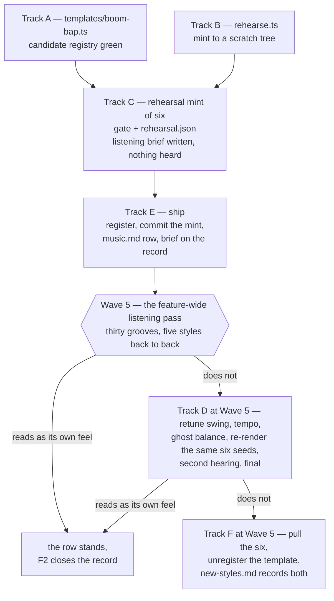

# Tech spec — Epic 4: Boom-bap

PRD: [../prd/epic-4-boom-bap.md](../prd/epic-4-boom-bap.md) ·
Roadmap: [../roadmap.md](../roadmap.md)

## Approach

The epic is one template file and six grooves, and the judgement that decides
whether boom-bap earned its place no longer lives inside it. Every human
listening sign-off in feature-25 has moved to the **feature-wide listening
pass** — `## Wave 5 — the feature-wide listening pass` in
[../roadmap.md](../roadmap.md) — which runs once, by hand, after Epic 6, and
hears all thirty new grooves grouped by style, the five styles back to back. So
this epic runs end to end without stopping for a person: it mints once with the
`swing`, `tempoRange` and `patterns.snareGhosts` it declares, ships those six
grooves, and closes.

What is left here is machine work, and it is still built around rehearsing
before committing. Two tracks run in parallel first: the template itself, checked
against a *candidate registry* (`[...allTemplates(), boomBap]`) so every
whole-registry rule is satisfied before the template is registered at all, and a
**rehearsal mint** — a small committed script that mints six grooves into a
scratch tree under `os.tmpdir()`, from a pinned start seed, leaving
`catalogue.json`, the manifest, the lock and `public/grooves/` untouched. Then
the epic ships, unconditionally: the registry line, the mint, the manifest
refresh, the `docs/music.md` row and the listening brief, in that order.

The two-hearing loop the PRD builds is preserved in full, and only its location
moves. R9's retune, R9a's final second hearing and R9b's ban on a third are the
procedure Track D and Track F set out below, executed at Wave 5 rather than
here. If the feature-wide pass returns a negative first verdict for boom-bap, the
retune, the re-render and the second hearing all happen there under exactly R9a's
and R9b's rules; if the second verdict is negative, boom-bap's six grooves are
pulled from the catalogue there, which is AC8a's outcome reached at a later
moment.

The rehearsal still earns its place, for a reason that has changed. It was the
thing that made AC8a's "unchanged by this epic" a tautology; with the verdict
deferred the epic commits either way, so that is not what it buys any more. What
it buys now is **the seed list**. `rehearsal.json` pins the `startSeed` and the
six `(template, seed)` pairs, and `commit` refuses to run if the catalogue moved
underneath it — so a retune weeks later re-renders *the same six questions in a
different feel*, and the second hearing is directly comparable to the first. That
property is the Cycle 1 log's Q1 decision, and two hearings that may be days apart
need it more than two hearings an hour apart ever did.

## Architecture

### The branch, and where each outcome is reached



The epic is the top half — A, B, C, E, and then it closes. Everything below the
`Wave 5` node is procedure this spec writes down and does not execute. There is
no branch out of D other than G and F, which is how R9b is enforced: the
procedure has nowhere to put a third hearing, and Wave 5 is the last thing in the
feature.

### This epic ships its grooves unheard, by design

Say it plainly: Track E commits six mp3s that no person has listened to. All
seven gate checks have passed them and the rehearsal has proved they render, but
the per-groove sign-off R10 asks for and the distinctness verdict R8 asks for both
happen at Wave 5, after the grooves are already in the catalogue.

**Why the trade was made.** R8's question is not "is this groove good" — it is
"does boom-bap read as its own feel", and that is a comparison. Asked at the end
of this epic it can only be asked against two committed grooves picked by tempo,
alone, on the day the template was written: the hardest version to answer honestly
and the easiest to answer generously. At Wave 5 the five new styles play back to
back and boom-bap is judged in the company it will actually keep — which is what
R8 is really asking, and what this epic could never do alone.

**What the trade costs, and it is a command rather than a rescue.** A negative
first verdict is a *post-mint* retune, and the mechanism for it already exists:
edit the three fields in `boom-bap.ts` and run `npm run grooves`, which walks the
committed catalogue and puts every entry back through the four stages. The six
boom-bap mp3s change bytes; the manifest and the lock follow. `catalogue.json` is
that command's *input*, not its output — its entries are
`{ id, uuid, template, seed }` — so no id, uuid or seed moves, which is the
generator README's § *Ids never move*, and `rerender-check.ts` and
`rerenderReport.ts` exist to police exactly this operation. The README says it
outright: "changing the generator and re-rendering is how the whole catalogue is
meant to change. Expect the committed mp3s to change bytes when you do — that is
the point of the command, and the diff is reviewed by listening." So the price of
a positive Wave 5 retune is one template file edited, one command, six changed
mp3s plus two changed generated files, and the quality gate re-run over the whole
catalogue. `rehearse.ts` has no part in it; that script is for *minting*, which
is a different operation.

**One of the three retunable fields is answer-bearing; the other two are not.**
`bpm` is drawn from `tempoRange` at render time, so moving the tempo range
changes what those six grooves *are*, not only how they sound — same id, same
uuid, same seed, a different question. `swing` and `patterns.snareGhosts` move
the rendered audio and leave `bpm`, `root` and `flavour` exactly where they were.
Here it is harmless: nobody has played these six, they ship inside an unreleased
feature, and `docs/music.md`'s row is written after the fact either way. It is
worth writing down because the same retune on a groove already in players' hands
would be a different act — the frozen list in `docs/music.md` exists precisely
because re-rendering can re-answer a puzzle somebody has already solved.

**What it costs on the path nobody wants** is larger, and this spec does not hide
it. A negative *second* verdict means pulling six grooves out of a committed
catalogue: six rows deleted from `catalogue.json`, six mp3s deleted from
`public/grooves/`, the manifest and the lock rewritten over a catalogue Epics 2
and 3 have also appended to — a `git revert` will not do it, because it would
take their grooves out with ours — a `rerender-check.ts` run to prove the
remaining grooves are bit-identical, and six groove ids burned permanently,
because `catalogue.test.ts`'s `never re-issues an id` and its `RETIRED` list mean
the numbers cannot come back. That is the exact cost the Cycle 1 log's Q1 decision
was written to avoid, and deferring the verdict brings it back. It is paid only if
a person says no twice, and Track F is where.

### Where boom-bap sits between its neighbours

The distinctness risk is arithmetic before it is musical. These are the four
registered templates it is closest to, and the two numbers the epic reserves.

| Template | BPM | Subdiv | Swing | Kit note |
| :-- | :-- | :-- | --: | :-- |
| `half-time` | 68–80 | 16 | 0.28 | kick, snare, both hats, toms, bass, comp |
| `straight-funk` | 94–106 | 16 | 0.18 | + rim |
| `swung-sixteenth` | 106–116 | 16 | 0.44 | as `half-time` |
| **`boom-bap`** | **86–92** | **16** | **0.34** | kick, snare, both hats, bass, comp — no toms |

- **Tempo.** 86–92 leaves two bpm of daylight under `straight-funk`'s 94 floor.
  R1 only asks for a distinct range *string*, and `85–95` would satisfy it while
  putting a 94 bpm boom-bap and a 94 bpm straight-funk one swing value apart —
  which is the exact failure the hearing exists to catch, imported into the
  template on purpose. The top of the reserved band is 92 for that reason.
- **Swing.** 0.34 sits 0.06 above `half-time` and 0.10 below `swung-sixteenth`.
  The retune's room is upward, to 0.40, because 0.44 is taken.
- **Ghosts.** The template declares its own `patterns.snareGhosts` pool, and that
  pool is the whole of the ghost-note balance boom-bap controls: how many ghosts
  a bar carries and which odd sixteenths they land on. How *loud* a ghost is
  belongs to the generator, not to a template — `GHOST_VELOCITY_RANGE` is a
  module constant in `events.ts` drawn once per groove, and the mix applies the
  single `gain.snare` to backbeats and ghosts alike. So the figure is the lever,
  it lives entirely inside `templates/boom-bap.ts`, and moving it costs no edit
  to a file another wave-2 epic is minting through.
- **Comp.** One onset a bar, its position drawn per groove from boom-bap's own
  single-step figures. `COMP_PATTERNS`'s sparsest shared figure carries two
  onsets, so a declared pool is the only way under the three templates R5 names —
  and one stab a bar at 88 bpm is the idiom rather than a concession to the
  assertion: the keys are a sample hit, not a comp.
- **Kit.** Dropping the toms is what makes the kit itself distinct — with them,
  boom-bap declares exactly `half-time`'s eight voices and the whole difference
  has to be carried by tempo, swing, figures and mix. It also makes
  `DEFAULT_FILL` resolve to `kick: [0]`, `snare: [0, 2, 4, 6, 14]` — a snare
  fill, which is the idiom — so **no `FILLS` entry is needed**, and boom-bap's
  backbeat is `DEFAULT_PLACEMENT`'s `[4, 12]`, so **no `PLACEMENTS` entry is
  needed either**. The epic edits no line of `events.ts`.

### Density, measured rather than hoped for

Events per bar over 399 seeds, built through the real `buildEvents` with the
shared kick, hat, bass and ghost pools, no toms, and a one-onset comp, grouped by
which hat figure the seed drew:

| Hat hits/bar | Seeds | Events/bar | Median |
| --: | --: | :-- | --: |
| 7–8 (eighths) | 125 | 19.50 – 22.58 | 21.0 |
| 9–10 (broken) | 152 | 20.42 – 24.17 | 22.6 |
| 15–16 (sixteenths) | 122 | 26.25 – 29.08 | 27.8 |

The spread is the hat figure, not the seed. `19–31` covers all of it with about
two events a bar of headroom at each end — enough for a declared kick pool one
hit busier than the shared one and for a ghost figure retune, and distinct from
every registered band (`18–44`, `16–42`, `14–48`, `16–38`, `17–40`, `8–30`),
which is what R7 asks for.

### The mint writes a manifest with no `HEARD_IN`, and `verify` will say so

`addGrooves` calls `writeManifest(entries, path, buildPools(entries))` with no
fourth argument, and `renderManifest` omits the `HEARD_IN` export entirely when
none is passed. `generate` does pass it. So a bare mint leaves
`grooves.generated.ts` without the export the reveal imports, and
`grooves:verify` fails on `manifestSha256` — which is the trap catching itself.
The sanctioned refresh is `npm run grooves -- --manifest-only`: it re-renders
the manifest *with* `HEARD_IN`, encodes no audio (`encode: !manifestOnly`), and
rewrites the lock from the mp3s already on disk. Every commit step here ends with
it. Boom-bap's six new scale names get no `heard-in.json` entry and need none —
`heardInFailures` only requires that every scale the table *names* is rendered,
not the reverse.

### The files this epic touches, and who else touches them

| Path | Who else | When it is touched |
| :-- | :-- | :-- |
| `templates/boom-bap.ts`, `templates/boom-bap.test.ts` | nobody | Waves 1, 3 |
| `scripts/grooves/rehearse.ts`, `rehearse.test.ts` | nobody | Wave 1 |
| `templates/index.ts`, `templates/index.test.ts` | Epics 2, 3 | Track E, unconditionally |
| `catalogue.json`, `grooves.lock.json`, `grooves.generated.ts`, `public/grooves/` | Epics 2, 3 | Track E, in one serial mint slot |
| `docs/music.md` (one feel-table row) | Epics 1, 2, 3 | Track E |
| `specs/new-styles.md` (the boom-bap row) | nobody | Track E writes the brief; **Wave 5** closes it |
| `events.ts` | Epics 2, 3 | never |
| `types.ts` | Epic 1 | never |

Nothing sits behind a verdict any more, so boom-bap takes the shared minting slot
in Wave 2 the way Epics 2 and 3 do, and serialising that slot is the only
coordination the three of them need. The last two rows are the ones Wave 5's
retune could reach and does not: every parameter R9 names — swing, tempo range,
ghost figure — is a field of `boomBap`, so the second hearing costs one template
file plus a re-render of six mp3s, and `types.ts` and `events.ts` stay shut either
way.

## Contracts

Frozen before any track starts. Epic 1's own contracts sit above these — where
the two disagree, Epic 1 wins and only the call sites named below change.

### C1 — `templates/boom-bap.ts`

```ts
// scripts/grooves/templates/boom-bap.ts
export const boomBap: FeelTemplate = {
  id: 'boom-bap',
  tempoRange: [86, 92],
  subdivision: 16,
  swing: 0.34,
  flavours: ['dorian', 'aeolian', 'phrygian'],
  voices: ['kick', 'snare', 'hatClosed', 'hatOpen', 'bass', 'comp'],
  humanize: { timingMs: 14, velocity: 0.1, lean: { snare: 12, hatClosed: -3, hatOpen: -3 }, driftDepth: 0.006 },
  gain: { kick: -4, snare: -4, hatClosed: -14, hatOpen: -20, bass: -7, comp: -9 },
  pan:  { kick: 0, snare: -0.04, hatClosed: 0.3, hatOpen: 0.32, bass: 0, comp: -0.25 },
  passes: 3,
  density: { minPerBar: 19, maxPerBar: 31 },
  patterns: { /* C3 */ },
}
```

What is contract and what is a knob:

- **Contract** — the id, `subdivision: 16`, the reserved swing and tempo bands
  (C2), the shape of `patterns` (C3), `density` being declared rather than
  copied, and the *relation* in `gain`: `kick` and `snare` are the two highest
  numbers the template declares, strictly above every other voice (R3, AC3).
- **Knobs the `musician` settles** — every exact number, the flavour list within
  R2's two-to-four, `passes`, the three figure pools, and whether the toms come
  back. Three of those knobs are also the retune's, and they are the only three:
  `swing`, `tempoRange` and `patterns.snareGhosts`. `passes: 3` is
  chosen because it is unique in the registry (the others declare 4 or 2) and
  gives a 12-bar, ~33 s loop with one variation bar and one fill bar.
- **Frozen the moment the first groove is minted** — `flavours` (R2), because
  `pick` indexes the list and a later edit re-renders and re-answers every
  boom-bap groove.

### C2 — the two numbers boom-bap reserves in the shared registry

`templates/index.test.ts` asserts swing values and tempo-range strings are
unique across the registry, and three epics are writing templates at once. So
boom-bap claims, for both hearings:

- **swing ∈ [0.30, 0.40]** — Epics 2 and 3 stay out of that closed interval.
- **tempo range inside 85–95, both ends ≤ 92** — nobody else is near it.

The retune (R9) moves within these bands. A retune that needed to leave them
would be a registry-level negotiation with two epics in flight, which is the
reason the bands are wider than the values.

### C3 — the `patterns` block boom-bap declares

Three pools, and only three:

Each is a pool of figures in the shape its shared pool already uses — `number[][]`
on the 16-step grid — and `pick` draws one figure from it.

```ts
patterns: {
  kick:        [ /* figures of 3–5 steps, 0…15 */ ],
  comp:        [ /* figures of exactly one step, 0…15 */ ],
  snareGhosts: [ /* figures of 1–4 odd steps, 0…15 */ ],
}
```

- **`comp` carries one onset a bar.** Every figure in the pool is a single step;
  `buildEvents` draws the comp figure once per groove, outside the bar loop, so
  which step a groove stabs on varies from groove to groove and never within one.
  That is what puts boom-bap strictly under `straight-funk`, `swung-sixteenth`
  and `bright-straight`, which all draw `COMP_PATTERNS` and so play two or three
  (R5, AC4).
- **`snareGhosts` carries the ghost-note balance in full.** `ghostsForBar` draws
  a fresh figure from the pool for every bar, so the pool sets both how many
  ghosts a bar has and which odd sixteenths they fall on, and both vary across
  the twelve bars. It does not set their level: `GHOST_VELOCITY_RANGE` is
  `events.ts`'s constant, drawn once per groove, and `gain.snare` covers
  backbeats and ghosts together. The retune (R9) moves this pool and nothing else
  about the ghosts — `types.ts` gains no velocity field and `events.ts` is not
  opened (AC8).

- The **key names come from Epic 1's tech spec verbatim.** Epic 1's R12 names
  seven per-voice fields — kick, foot hat, ride, bass, comp, bongos and snare
  ghosts — but not their spellings, and Epic 1's tech spec is not written yet.
  `kick`, `comp` and `snareGhosts` above are the assumed spellings; if Epic 1
  names them differently, the rename is confined to `templates/boom-bap.ts` and
  its own test, because no other track reads them.
- **The hat is deliberately not declared.** Epic 1's field list says "foot hat",
  which is `HAT_PUNCTUATION_PATTERNS` — the pool a *riding* feel draws. Boom-bap
  does not ride, so it draws `HAT_PATTERNS`, and whether Epic 1's hat key
  replaces one pool or whichever pool applies is unknown. All three shared hat
  figures (eighths, sixteenths, broken) are idiomatic at 88 bpm, so boom-bap
  needs no hat key and takes no risk on the answer. The measured density band
  already covers all three.
- **The bass is not declared either.** `BASS_PATTERNS`'s four figures follow the
  kick closely enough, and one fewer declared pool is one fewer thing the retune
  can be accused of having rewritten.
- Epic 1's R16 already requires a declared pool to be non-empty with steps in
  `0…15` and to throw by template id and voice otherwise. This epic asserts its
  own pools against that rule rather than re-implementing it.

### C4 — the rehearsal rig

```ts
// scripts/grooves/rehearse.ts
export type Rehearsal = {
  template: string
  startSeed: number
  catalogueSha256: string          // of the committed catalogue.json at rehearsal time
  dir: string                      // the scratch tree
  grooves: { id: string; template: string; seed: number; sha256: string; bytes: number }[]
}

export function resolveTemplate(id: string, opts?: { modulePath?: string }): FeelTemplate
export async function rehearse(opts: RehearseOptions): Promise<Rehearsal>
export async function commit(rehearsal: Rehearsal, opts?: CommitOptions): Promise<GrooveSpec[]>
```

```
node scripts/grooves/rehearse.ts --template boom-bap --count 6 [--seed <n>]
node scripts/grooves/rehearse.ts --commit <dir>/rehearsal.json
```

- `rehearse` creates a scratch tree under `os.tmpdir()`, hard-links (falling back
  to `copyFileSync` across filesystems) every committed mp3 into
  `<dir>/audio/` so `probeHeadDelaySeconds` can read the whole catalogue, copies
  `catalogue.json` into `<dir>/`, and calls `addGrooves(count, { cataloguePath,
  outDir, manifestPath, lockPath, startSeed, templates })` with all four paths
  inside `<dir>`. `DEFAULT_OUT_DIR`, `DEFAULT_MANIFEST_PATH`,
  `DEFAULT_LOCK_PATH`, `CATALOGUE_PATH` and `public/grooves/` are never opened
  for writing (R6, AC8a).
- `templates` is `[...allTemplates(), resolveTemplate(id)]` when the id is not
  registered, and `allTemplates()` when it is. `add.ts` resolves every existing
  spec's template out of that same list when it rebuilds the manifest, so the
  list must stay complete; only the *choice* of what to mint is narrowed, which
  is Epic 1's `--template` mechanism (R17). **That option's name is Epic 1's**;
  `rehearse.ts` passes it at one call site.
- `startSeed` defaults to `seedFromClock(Date.now())` and is written into
  `rehearsal.json`, which is what makes the hearing repeatable.
- `commit` re-hashes the committed `catalogue.json`, **refuses if it no longer
  matches `catalogueSha256`** — another epic minted in between, so the rehearsal
  is void and must be re-run — then mints against the real paths with the same
  `startSeed`, and asserts the returned specs' `(template, seed)` list and each
  mp3's `sha256` equal the rehearsed ones. A mismatch throws and names the first
  differing groove.
- Both modes print a table: id, seed, bpm, root, flavour, scale, chord, and
  every gate rejection on the way (R6).

The asserted sha equality is what turns "six mp3s were heard" into "the six
grooves in the catalogue are the six that were heard" (AC8b, AC9). Byte-stable
re-rendering is already assumed by `rerender-check.ts` and by
`grooves:verify`'s per-groove `sha256`; if it turns out not to hold, `commit`
falls back to comparing `(template, seed)` and says so in the report rather than
shipping unheard audio.

### C5 — what Track E appends, unconditionally

- `templates/index.ts`: one import, one `[boomBap.id]: boomBap` entry, one name
  in the trailing re-export.
- `templates/index.test.ts`: one row in `pairs each flavour with a feel that
  suits it`, asserting `['aeolian', 'dorian', 'phrygian']` sorted.
- `docs/music.md`: one row in the feel table, and the count in the sentence above
  it (Epic 1 rewrote that heading; this epic only increments what it says).
- **`specs/new-styles.md` gains a pending entry, not an outcome.** AC10 asks that
  *exactly one* of the two documents record boom-bap's **outcome**; at the end of
  this epic that is `docs/music.md`, which says what shipped. The new-styles entry
  carries the declared values, what a listener should listen for, the two
  neighbours R8 compares against and the rehearsal seed list — a hand-off to Wave
  5, worded as pending, with no verdict in it. Step F2 completes it at Wave 5.

### C6 — what Wave 5's stop procedure leaves

Reached only on a negative second verdict at Wave 5. It is a removal now rather
than an abstention, because the six grooves are already committed when Wave 5
begins:

- `templates/boom-bap.ts` and `templates/boom-bap.test.ts` stay, **unregistered
  again** — Step E1's line comes back out. `catalogue.test.ts`'s `draws grooves
  from every template` requires every *registered* template to have at least one
  groove, so unregistering and removing the six catalogue rows are one change and
  not two (AC5's second half).
- the six grooves leave `catalogue.json`, the six mp3s leave `public/grooves/`,
  and `npm run grooves -- --manifest-only` rewrites the manifest and the lock. Six
  ids are burned and are recorded in `catalogue.test.ts`'s `RETIRED` list.
- `docs/music.md`'s boom-bap row is removed, so `specs/new-styles.md`'s row is
  again the only record and AC10 holds — with the direction it holds in flipped.
- `specs/new-styles.md`'s boom-bap row records both hearings, what the retune
  changed, and whether it moved the verdict at all (R11, AC10).

## Tracks

### Track A — The template, and the registry it would join

- **Goal** — `templates/boom-bap.ts` exists, and every whole-registry rule it
  will have to satisfy is already green against a candidate registry, so
  registration later is a formality rather than a discovery.
- **Owns** — `scripts/grooves/templates/boom-bap.ts` (new),
  `scripts/grooves/templates/boom-bap.test.ts` (new)
- **Role** — `musician`
- **Depends on** — C1, C2, C3, and Epic 1's `FeelTemplate.patterns` being merged
- **Parallel with** — Track B
- **Done when** — `npm run test:gen` is green, `boom-bap.test.ts` asserts the
  candidate registry's uniqueness and shape rules, and the template is *not* in
  `TEMPLATES`.

### Track B — The rehearsal rig

- **Goal** — six grooves can be minted, gated and rendered to mp3 without a
  single write inside the repo, and the same start seed gives the same six twice —
  in this epic and again at Wave 5.
- **Owns** — `scripts/grooves/rehearse.ts` (new),
  `scripts/grooves/rehearse.test.ts` (new)
- **Role** — `musician` (it owns generator files; the musical content is nil, and
  `/implement-feature`'s musician-then-implementer pair is the right shape for a
  script)
- **Depends on** — C4, and Epic 1's `--template` mechanism for the one call site
- **Parallel with** — Track A. Its tests use `placeholderPack()` and an existing
  template id, so it needs nothing boom-bap.
- **Done when** — `npm run test:gen` is green and `rehearse.test.ts` proves the
  four committed artefacts are byte-identical across a rehearsal.

### Track C — The rehearsal mint, and the listening brief

- **Goal** — six boom-bap grooves rendered to a scratch tree with all seven gate
  checks passing, a `rehearsal.json` that pins the seed list, and a written brief
  saying what a listener should listen for in these six when Wave 5 plays them.
  **Nobody listens in this epic.**
- **Owns** — nothing under version control. Its product is the scratch tree under
  `os.tmpdir()`, its `rehearsal.json`, and the brief in the epic's report.
- **Role** — `musician`
- **Depends on** — A (a template to mint from), B (the rig)
- **Parallel with** — none
- **Done when** — six mp3s exist in the scratch tree, `git status --porcelain` is
  empty, `rehearsal.json` records the start seed and the six `(template, seed)`
  pairs, and the brief is written: the per-groove listening points, R8's
  distinctness question with its two neighbours named, and where the mp3s are.

**The machine half still blocks.** C1 and C4 are real gates — if the rehearsal
cannot produce six gated grooves, or if `git status` is not empty afterwards, the
epic stops here and the fix is in the template, not in a wider band bolted on
after the fact. Only C2 and C3, the listening half, became briefs.

### Track D — the retune procedure, executed at Wave 5

**This is not a track of this epic.** It is the written procedure the
feature-wide listening pass executes if — and only if — it returns a negative
distinctness verdict for boom-bap. The epic does not wait for a verdict and does
not run these steps; it ships (Track E) and closes. Steps D1–D4 are set down here,
in the epic that knows the template, so whoever runs Wave 5 has the procedure
rather than having to invent it.

R9, R9a and R9b bind it exactly as the PRD wrote them: one retune, one final
second hearing, never a third.

- **Goal** — `swing`, `tempoRange` and `patterns.snareGhosts` moved, with a
  written prediction of what each change should do *before* the render, the same
  six seeds re-rendered from the retuned template, and a second hearing that is
  final.
- **Owns**, at Wave 5 — `scripts/grooves/templates/boom-bap.ts`,
  `scripts/grooves/templates/boom-bap.test.ts`, a fresh scratch tree, and — only
  if the second verdict is positive — the six committed grooves' rendered audio,
  and the manifest and lock that `npm run grooves` rewrites with them. All three
  retuned parameters are fields of `boomBap`, so `types.ts` and `events.ts` stay
  shut, as they do in the epic.
- **Role** — `musician`
- **Runs when** — Wave 5's first verdict for boom-bap is negative
- **Done when** — AC8 holds — three parameters changed, the prediction recorded
  before the re-render, the six re-rendered from the retuned template and heard
  again — and exactly one of two things follows: the retuned six replace the
  shipped six and Step F2 closes the record positive, or Track F pulls them.

### Track E — Ship the six

Runs **unconditionally**. There is no verdict to wait for: the six grooves are
registered, minted and committed, and pulling them is Wave 5's business if it
comes to that.

- **Goal** — boom-bap is a registered feel with six grooves in the catalogue,
  nothing else re-rendered, the feel table says so, and the listening brief is on
  the record where Wave 5 will find it.
- **Owns** — `scripts/grooves/templates/index.ts`,
  `scripts/grooves/templates/index.test.ts`, `scripts/grooves/catalogue.json`,
  `scripts/grooves/grooves.lock.json`,
  `src/features/daily-groove/data/grooves.generated.ts`, six new files under
  `public/grooves/`, `docs/music.md`, `specs/new-styles.md`
- **Role** — `musician`
- **Depends on** — C (a rehearsal to commit and a brief to record), and a free
  minting slot (Epics 2 and 3 mint from the same four files)
- **Parallel with** — none
- **Done when** — AC1, AC5, AC6, AC10 and AC11 hold, `npm run grooves:verify` is
  clean, the full set of *Integration and verification* is green **except
  `src/features/daily-groove/data/pastPuzzles.test.ts`**, and the brief names the
  six committed ids. AC8b's antecedent is a
  positive verdict, so it is graded at Wave 5 and not here.

### Track F — the record, and the stop procedure, executed at Wave 5

Also not a track of this epic. **Step F2 runs at Wave 5 whichever way the verdict
goes** — the pending entry Step E5 wrote is closed with the verdicts either way.
Steps F1 and F3 run only on a negative second verdict, and they are a removal
rather than an abstention, because the six grooves are in the catalogue before
Wave 5 begins.

- **Goal** — the feature ends with boom-bap's outcome on the record, and — on the
  negative-then-negative path — a catalogue, a lock and a manifest that carry no
  boom-bap groove and are internally consistent again.
- **Owns**, at Wave 5 — `specs/new-styles.md`; and on the stop path
  `scripts/grooves/templates/index.ts`, `templates/index.test.ts`,
  `catalogue.json`, `grooves.lock.json`, `grooves.generated.ts`, the six files
  under `public/grooves/`, `docs/music.md`
- **Role** — `musician`
- **Runs when** — F2 always, at Wave 5; F1 and F3 on a negative second verdict
- **Done when** — AC8a and AC10 hold, `npm run test:gen` and
  `npm run grooves:verify` are green, and — on the stop path — no `boom-bap`
  groove is in the catalogue.

## Execution waves

- **Wave 1 (parallel):** Track A, Track B
- **Wave 2:** Track C — needs a template (A) and the rig (B)
- **Wave 3:** Track E — unconditional. **The epic closes here.**

Wave 1's two tracks own disjoint paths. Wave 3 re-opens one file Wave 1 owned —
`boom-bap.test.ts`, whose registration assertion Step E1 flips — which is safe
because no two tracks in the same wave name the same path.

**After the feature, at Wave 5** — the feature-wide listening pass, not part of
this epic's schedule and nothing in the feature waits on it: the per-groove
sign-offs and the distinctness verdict; then Track D on a negative first verdict;
then Step F2 always, and Steps F1 and F3 on a negative second verdict.

There is no third hearing anywhere in that procedure, which is R9b.

## Implementation

### Track A — The template, and the registry it would join

#### Step A1 — a template nobody has registered, with numbers nobody else has taken

Covers: R1, AC1

- **Test first** — `scripts/grooves/templates/boom-bap.test.ts`: import
  `{ boomBap }` from `./boom-bap.ts` and `{ TEMPLATES, allTemplates }` from
  `./index.ts`. Define `const CANDIDATE = [...allTemplates(), boomBap]`. Assert:
  `boomBap.id === 'boom-bap'`; `subdivision === 16`; `tempoRange[0] >= 85 &&
  tempoRange[1] <= 95 && tempoRange[1] <= 92 && tempoRange[0] < tempoRange[1]`;
  `swing >= 0.3 && swing <= 0.4`; and across `CANDIDATE` — ids unique, swing
  values unique, `tempoRange.join('-')` strings unique,
  `JSON.stringify([gain, pan])` unique, `JSON.stringify(humanize)` unique. Assert
  also `TEMPLATES['boom-bap']` is `undefined` — registration is Track E's, and
  this file is what makes that safe. Run it: fails with `Cannot find module
  './boom-bap.ts'`.
- **Implement** — `scripts/grooves/templates/boom-bap.ts`: C1's object, with
  `patterns` omitted for now — A4 and A5 add its three keys. Omit the field; do
  not write `patterns: { kick: [] }`, which Epic 1's R16 makes a build-time
  throw.
- **Green when** — the uniqueness assertions pass against seven templates and
  `npm run test:gen` is green.
- **Refactor** — none. Keep `CANDIDATE` a module-level const in the test; A7
  reuses it.

#### Step A2 — two to four modes, all of them modes the game offers

Covers: R2, AC2

- **Test first** — `boom-bap.test.ts`: assert `boomBap.flavours.length` is 2, 3
  or 4; `new Set(boomBap.flavours).size === boomBap.flavours.length`; every entry
  is in `FLAVOURS` (import from `../../../src/lib/theory/names.ts`); and the
  sorted list equals the literal the `musician` settled — `['aeolian', 'dorian',
  'phrygian']` as proposed by `new-styles.md`. Run it: fails on the literal until
  the list is settled.
- **Implement** — set `flavours` in `boom-bap.ts`.
- **Green when** — all four assertions pass.
- **Refactor** — none. The literal in the test is the same device
  `index.test.ts`'s `pairs each flavour with a feel that suits it` uses, and it
  is what freezes the list once the first groove is minted.

#### Step A3 — the kick and the snare are the two loudest things in the mix

Covers: R3, AC3

- **Test first** — `boom-bap.test.ts`: assert every voice in `boomBap.voices` has
  a numeric `gain` and `pan` with `|pan| <= 1`; that
  `Math.min(gain.kick, gain.snare)` is strictly greater than every other declared
  gain — including `bass`, which every existing template puts on top; and that
  `Object.keys(gain)` and `Object.keys(pan)` name no voice the template does not
  play. Run it: fails with `bass -1 is not below kick -4` against a template
  copied from a neighbour's mix.
- **Implement** — set `gain` and `pan` in `boom-bap.ts` with the drums forward
  and the bass under them.
- **Green when** — the strict inequality holds for every non-drum voice.
- **Refactor** — none, but flag it for C2's brief: the bass carries the root, and
  a drum-forward mix is the one decision in this template that could make the
  *puzzle* harder rather than the groove better. Gains are pre-normalisation —
  `mixTracks` pins true peak to `PEAK_CEILING` — so what these numbers set is
  balance, not level.

#### Step A4 — the ghosts sit under the backbeat, in every bar of every seed

Covers: R3, R4, AC3

- **Test first** — `boom-bap.test.ts`: assert `boomBap.patterns?.snareGhosts` is
  a non-empty pool of figures, each one 1–4 ascending, unique, **odd** steps
  inside `0…15` — odd because `ghostSteps` snaps a ghost between the backbeats
  and a declared even step would silently move — and that the pool holds at least
  two distinct figures, since `ghostsForBar` draws per bar and a one-figure pool
  makes every bar's ghosts identical. Then, for `seed` 1…40, build
  `buildEvents({ id: 'x', uuid: '', template: 'boom-bap', seed }, boomBap)`, split
  the `snare` events by `GHOST_VELOCITY_THRESHOLD` (import from `../events.ts`),
  and assert: both sets are non-empty; `Math.max(...ghostVelocities) <
  Math.min(...backbeatVelocities)`; and the margin is at least the floor R3 asks
  the `musician` to name — **0.2**, which is what the measurement supports:
  across 199 seeds the lowest backbeat velocity is 0.607 and the highest ghost
  0.327, a margin of 0.28. Those are post-humanize values, which is why the floor
  is not the 0.75 the raw tables suggest; the same measurement is what makes the
  threshold split safe, since no backbeat falls under `0.5` and no ghost reaches
  it. Run it: fails with `expected undefined to be an array`, because
  `patterns.snareGhosts` is not declared yet.
- **Implement** — declare `patterns.snareGhosts` in `boom-bap.ts`.
- **Green when** — all forty seeds separate cleanly.
- **Refactor** — none. The velocity separation is structural — ghosts are struck
  at `0.15–0.25` and a backbeat at `1.0` — so this step is a guard against a
  future template-level change to that, not a knob this epic turns. The figure
  pool is the whole of boom-bap's ghost balance and the only ghost lever the
  retune has, which is why this step's shape assertions are written to survive
  D2 changing its contents.

#### Step A5 — the comp is sparser than any of the three named templates renders

Covers: R5, AC4

- **Test first** — `boom-bap.test.ts`: assert `boomBap.patterns?.comp` is
  non-empty and **every figure holds exactly one step** in `0…15`. Then a
  rendered comparison, which is AC4's own wording: for `seed` 1…40 and for each
  of `boom-bap`, `straight-funk`, `swung-sixteenth` and `bright-straight`, count
  distinct comp *onsets* per bar (unique `timeSec` quantised to the bar's
  sixteenth grid — a comp event is one note of a voicing, so raw event counts
  measure the voicing, not the figure), and assert that boom-bap is **exactly 1
  in every bar of every seed** while each of the other three is at least 2. The
  strict form is the assertion, not "below the minimum": one onset a bar is what
  the template declares, so a seed that renders two means a figure with two steps
  got into the pool. Run it: fails, `patterns.comp` is undefined.
- **Implement** — declare `patterns.comp` as single-step figures at the positions
  the `musician` chooses (the "and" of 2 and beat 3 are the idiomatic stabs).
  Which of them a groove plays is `pick`'s one draw per groove, so the pool is
  the vocabulary and the bar count stays 1 whichever figure comes up.
- **Green when** — boom-bap renders exactly 1 onset a bar against the other
  three's 2 or 3, on all forty seeds.
- **Refactor** — none. `COMP_PATTERNS` is module-private in `events.ts`, so the
  comparison goes through rendered events rather than through a new export; that
  also keeps it honest, since it measures what the feel actually plays.

#### Step A6 — the density band is boom-bap's own, and every seed lands inside it

Covers: R7, AC6

- **Test first** — `boom-bap.test.ts`: assert `boomBap.density` equals
  `{ minPerBar: 19, maxPerBar: 31 }`; that no registered template declares the
  same band (`JSON.stringify` over `allTemplates()`); and that for `seed` 1…200,
  `events.length / music.loopBars` is inside the band with at least 1.5 events a
  bar of margin at both ends. Run it: fails against a band copied from
  `half-time`.
- **Implement** — set `density` in `boom-bap.ts` from a fresh measurement taken
  **with the declared pools in place** (A4 and A5 change the counts): build 200
  seeds, print min/median/max grouped by hat figure, and set the band to cover
  the measured range plus two events a bar at each end. The starting numbers are
  the *Architecture* section's table — 19.50 to 29.08 over 399 seeds with the
  shared pools — so a large divergence means a declared pool is busier than
  intended, not that the band is wrong.
- **Green when** — 200 of 200 seeds land inside, with margin.
- **Refactor** — none. The band is the gate's rejection rule as well as an
  assertion; a band with no margin turns the mint into a lottery.

#### Step A7 — the candidate registry passes every rule the real one applies

Covers: R1, R2, AC1

- **Test first** — `boom-bap.test.ts`: run `index.test.ts`'s registry-level rules
  over `CANDIDATE` rather than `allTemplates()` — contains `hatClosed`; contains
  `hatOpen`, since it declares no `ride`; plays `kick`, `snare`, `hatClosed`,
  `bass`, `comp`; `voices` has no duplicate; `swing` in `(0, 1]`;
  `humanize.timingMs > 0` and below `((60 / tempoRange[1]) * 4 / subdivision) *
  500`; `humanize.velocity` in `(0, 0.5)`; `driftDepth` in `(0, 0.01]`;
  `lean.snare > 0` and `lean.hatClosed`, `lean.hatOpen` `<= 0`; `lean` names only
  played voices; `passes` an integer `>= 2`. Run it: fails on whichever rule the
  first draft of the template broke — most likely a `lean` sign or a `lean` on a
  voice the trimmed kit no longer plays. `timingMs` has room: half a sixteenth at
  92 bpm is 81.5 ms.
- **Implement** — fix `boom-bap.ts` until every rule holds.
- **Green when** — all of them pass and `npm run test:gen` is green.
- **Refactor** — none. This step is why Track E's registration is one line and
  not a debugging session inside a shared test file with two other epics
  appending to it.

### Track B — The rehearsal rig

#### Step B1 — a rehearsal writes nothing inside the repo

Covers: R6, AC8a

- **Test first** — `scripts/grooves/rehearse.test.ts`: capture the committed
  state the way `add.test.ts` does — the text of `catalogue.json`,
  `grooves.lock.json` and `grooves.generated.ts`, plus a name-and-size
  fingerprint of `public/grooves/` — then `await rehearse({ template:
  'straight-funk', count: 1, startSeed: 5, pack: placeholderPack() })` and assert
  all four are unchanged, that the returned `dir` is under `os.tmpdir()`, that
  `<dir>/audio/` holds one new mp3 plus one per committed groove, and that
  `<dir>/rehearsal.json` parses as a `Rehearsal` with `startSeed === 5`. Run it:
  fails with `Cannot find module './rehearse.ts'`.
- **Implement** — `scripts/grooves/rehearse.ts`: build the scratch tree
  (hard-link the committed mp3s, fall back to copy), copy the catalogue, call
  `addGrooves` with all four paths inside it, hash each new mp3, write
  `rehearsal.json`, return it.
- **Green when** — the four committed artefacts are byte-identical and the
  scratch tree holds the mint.
- **Refactor** — hard-linking rather than copying keeps a rehearsal cheap enough
  to run three times in an afternoon, which is what the retune loop needs. Say so
  in one line beside the fallback; it is the non-obvious kind.

#### Step B2 — the same start seed gives the same six grooves, and the same bytes

Covers: R6, AC8b

- **Test first** — `rehearse.test.ts`: rehearse twice with `startSeed: 5`,
  `count: 2`, the same pack, against the same committed catalogue; assert the two
  `grooves` arrays are deep-equal on `(template, seed, sha256, bytes)` and differ
  only in `dir`. Run it: fails if `rehearse` lets `addGrooves` default
  `startSeed` off the clock.
- **Implement** — thread `startSeed` through and record it in `rehearsal.json`.
- **Green when** — the two rehearsals agree groove for groove.
- **Refactor** — none. This is the property the whole ordering rests on: the six
  that get committed are the six that were heard.

#### Step B3 — a stale rehearsal is refused, not silently committed

Covers: AC8a, AC8b

- **Test first** — `rehearse.test.ts`: rehearse against a temp catalogue, then
  append a groove to that catalogue, then `commit(rehearsal, { cataloguePath })`
  and assert it rejects with a message naming `catalogueSha256` and both hashes,
  and that the catalogue, manifest, lock and audio dir are unchanged. Run it:
  fails, `commit` is not exported.
- **Implement** — `commit` re-hashes the catalogue first and throws before it
  loads a pack.
- **Green when** — the mismatch throws and nothing was written.
- **Refactor** — none. This is the wave-2 serialisation guard: if Epic 2 or 3
  mints between the hearing and the commit, the ids and the answer-uniqueness
  checks have moved, and the honest response is to re-rehearse — minutes — rather
  than to commit six grooves nobody heard.

#### Step B4 — commit mints exactly what was rehearsed

Covers: R6, AC5, AC8b

- **Test first** — `rehearse.test.ts`: rehearse `count: 2` against a temp
  catalogue, `commit` against the same temp paths, and assert the returned specs'
  `(template, seed)` list equals the rehearsal's, each committed mp3's sha256
  equals the rehearsed one, the temp catalogue grew by exactly two, and each spec
  has a canonical uuid distinct from the rehearsal's (uuids are minted per run
  and do not touch the audio). Then doctor one seed in a copy of the rehearsal
  and assert `commit` throws naming that groove. Run it: fails on the sha
  comparison until `commit` performs it.
- **Implement** — `commit` mints with the recorded `startSeed`, then compares
  specs and hashes and throws with the first difference.
- **Green when** — both directions hold.
- **Refactor** — if mp3 encoding turns out not to be byte-stable across runs,
  drop to comparing `(template, seed)` and record that in the epic's report and
  in this spec's assumptions — do not weaken the check quietly.

#### Step B5 — an unregistered template can still be rehearsed

Covers: R6

- **Test first** — `rehearse.test.ts`: assert
  `resolveTemplate('straight-funk')` returns the registered object; that
  `resolveTemplate('no-such-feel')` throws naming both the registry and the path
  it looked for; and that `resolveTemplate('temp-feel', { modulePath })`, pointed
  at a one-template module written into a temp dir, returns it and rejects a
  module whose exported `id` does not match. Run it: fails, `resolveTemplate` is
  not exported.
- **Implement** — resolve from `TEMPLATES` first, then dynamic-import
  `./templates/<id>.ts` (or `modulePath`), take the single exported value whose
  `id` matches, and assert the match.
- **Green when** — all three assertions pass, and `rehearse` passes
  `[...allTemplates(), resolved]` as `templates` when the id was not registered.
- **Refactor** — none. This is what lets registration be the last, reversible
  step instead of the first.

### Track C — The rehearsal mint, and the listening brief

#### Step C1 — six candidates, rehearsed and gated

Covers: R6, AC5, AC6

- **Test first** — not a unit test: the deliverable is a scratch tree and a log.
  Run `node scripts/grooves/rehearse.ts --template boom-bap --count 6` and record
  the printed `startSeed`, the six ids, seeds, bpms and answers, and every gate
  rejection on the way with its check and measured value. Six accepted candidates
  means all seven checks passed for each — `gateCandidate` returns on the first
  failure, and `addGrooves` discards anything it returns.
- **Implement** — nothing new. If the run gives up on its attempt budget, the
  fix is in the template — most likely the density band (A6) or the loudness
  floor against a sparse comp — and not a wider band bolted on after the fact.
- **Green when** — `<dir>/audio/` holds six new mp3s, `rehearsal.json` records
  them, and `git status --porcelain` is empty.
- **Refactor** — record the rejection reasons even on a clean run. A template
  that needed twenty attempts for six grooves is telling you something about the
  band before anyone listens — and at Wave 5 nobody will be able to tell you that
  from the audio.

#### Step C2 — the brief: what to listen for in each of the six

Covers: R10 (the brief half — the sign-off itself is Wave 5's, AC9)

- **Test first** — none, and nothing is heard here. The listening pass is the
  feature's, not this epic's.
- **Implement** — write, in the epic's report and in the `specs/new-styles.md`
  entry Step E5 lands, what a listener at Wave 5 should be listening for in these
  six, and where the six mp3s are: the scratch tree path and `rehearsal.json`'s
  `startSeed` and seed list, so they can be re-rendered at any time, plus the six
  committed ids and uuids once E2 has minted them, so they can be played straight
  out of `public/grooves/`. The brief, for boom-bap specifically:
  - do the kick and the snare **read as sampled rather than played** — struck
    hard, landing in the same place every bar, sitting forward of everything
    else? That is the style's whole claim, and it is the one thing no gate check
    can measure;
  - are the ghosts texture rather than a second backbeat (R4);
  - are the keys sparse rather than absent — one stab a bar is the intent, not an
    omission (R5);
  - and, because A3 put the drums above the bass, is the root still audible enough
    to answer the puzzle from.
- **Green when** — the brief names all four listening points, the six mp3s are
  locatable two ways (scratch tree plus seeds, and committed ids), and **no
  verdict has been written**. A verdict here would be this epic answering the
  question it moved.
- **Refactor** — none.

#### Step C3 — the brief: R8's distinctness question, and who it is asked against

Covers: R8 (the brief half — the verdict is Wave 5's, AC7)

- **Test first** — none.
- **Implement** — record the distinctness question and everything Wave 5 needs in
  order to ask it, so nobody has to reconstruct it weeks later: *does boom-bap
  read as its own feel, heard against its two closest neighbours?* Name them —
  `public/grooves/groove-02.mp3` (straight-funk, 96 bpm, E dorian) and
  `public/grooves/groove-13.mp3` (half-time, 79 bpm, A♭ phrygian), the two
  committed grooves closest in tempo to 86–92 from either side, both in modes
  boom-bap's own list carries, so what is judged is the feel and not the mode.
  And name the playlist shape: eighteen files — for each of the six, the
  straight-funk groove, then the half-time groove, then the boom-bap one — played
  without the file names visible where that is practical.
  Wave 5 already plays the five new styles back to back, which answers a broader
  version of the same question; this pairing is the narrow one boom-bap needs on
  top of it, because its two nearest neighbours are already in the catalogue
  rather than in this feature.
- **Green when** — the report and the new-styles entry carry the question, the two
  named neighbours and the playlist shape, and no answer.
- **Refactor** — none. A near miss is a negative verdict when Wave 5 gets there;
  the retune is one re-render, and R9b's budget is what keeps that from becoming a
  habit.

#### Step C4 — nothing has moved

Covers: R6, AC11 — and the no-write property Wave 5's stop procedure leans on

- **Test first** — `git status --porcelain` and `npm run grooves:verify`.
- **Implement** — nothing. Then `node scripts/grooves/rerender-check.ts` and
  assert every committed groove matches the lock, which is the strong form of
  AC11 and costs one command.
- **Green when** — `git status` is empty but for Wave 1's two new files, verify
  reports the catalogue and both manifests match the lock, and rerender-check
  reports all of them matching.
- **Refactor** — none.

### Track D — the retune procedure, executed at Wave 5

**Not executed by this epic.** These four steps are the procedure the feature-wide
listening pass runs on a negative first verdict for boom-bap, and the epic does
not wait for one. Every step is a bounded change to the three parameters R9 names,
so the diff reads as a retune and not a rewrite — and by Wave 5 the six grooves
are already in the catalogue, which is what D3 and D4 have to deal with and the
first hearing's version did not.

#### Step D1 — the prediction, written before the render

Covers: R9, AC8

- **Test first** — none, and the ordering is the point: this table is written
  while `boom-bap.ts` still holds the values that were heard, which by now are
  also the values that shipped.
- **Implement** — a three-row table in Wave 5's record: parameter, old → new,
  what the change is expected to do to the sound, and which neighbour it pulls
  away from. All three rows are required, and the three parameters are named:
  `swing` (within C2's `[0.30, 0.40]`), `tempoRange` (within 85–95, both ends
  ≤ 92) and `patterns.snareGhosts` — the ghost-note balance being how many ghosts
  a bar carries and on which odd sixteenths, since level is `events.ts`'s and not
  this template's. A ghost row that predicts a change in loudness is predicting
  something no field in this epic can deliver; write it as figure and placement.
- **Green when** — the table names all three parameters with both values and an
  expectation each, and no value has yet changed in the file.
- **Refactor** — none. R9 asks for the prediction because a retune whose
  expectation is written afterwards cannot be wrong.

#### Step D2 — three parameters move, and nothing else does

Covers: R9, AC8

- **Test first** — `boom-bap.test.ts`: update A1's `swing` and `tempoRange`
  assertions to the retuned values, still inside C2's bands, and A4's
  `snareGhosts` assertion to the new pool — its shape rules (odd, ascending,
  unique, 1–4 steps, at least two figures) are unchanged and still asserted, only
  the contents move. Add the guard that makes "not a rewrite" machine-checkable:
  `boomBap.flavours` sorted still equals A2's literal, and `patterns.kick` and
  `patterns.comp` still deep-equal the literals they held at the first hearing,
  written into the test. Run them: the first three fail against the shipped
  values, the last two pass and must keep passing.
- **Implement** — change exactly those three fields in `boom-bap.ts`. Nothing
  outside that file is opened: no `FeelTemplate` field is added for this, and
  `events.ts` keeps its ghost velocity range and its shared pools.
- **Green when** — the retuned assertions pass, the frozen ones still pass, and
  A5's and A6's rendered assertions still hold — if the density band no longer
  covers 200 seeds, widening it is part of the retune and is recorded in D1's
  table as a fourth row.
- **Refactor** — none. A retune that wanted the mode list or the kick and comp
  figures is a different template wearing the same id, and its grooves would owe
  a first hearing, not a second.

#### Step D3 — the same six seeds, re-rendered from the retuned template

Covers: R9, AC5, AC8

- **Test first** — not a unit test: run
  `node scripts/grooves/rehearse.ts --template boom-bap --count 6 --seed <the
  `startSeed` in Track C's `rehearsal.json`>` into a fresh scratch tree. That
  file is the reason the second hearing is directly comparable to the first even
  though the two are weeks apart: same start seed, same six seeds, same six
  answers, one changed feel.
- **Implement** — nothing new. Expect the same six seeds: `intBetween` draws the
  bpm as the *first* value off `MUSIC_LABEL`, so a changed tempo range shifts no
  later draw, and each groove keeps its root, flavour, scale and progression
  across the retune. Its **bpm does not** — `tempoRange` is the one answer-bearing
  field of the three, and a tempo retune re-asks those six questions at a new
  speed. A retune that moves only `swing` and `patterns.snareGhosts` leaves every
  answer untouched and changes the audio alone. A seed that drops out did so at the gate — most likely
  density or loudness — and the record names it and the check that rejected it.
- **Green when** — six mp3s exist in the new scratch tree, `git status` names only
  `boom-bap.ts` and its test, and the seed list is recorded next to the first
  hearing's and shown to be the same list.
- **Refactor** — none. That the answers survive a tempo retune is worth stating in
  the record: the same six questions, asked in a different feel.

#### Step D4 — the second hearing, and it is final

Covers: R9a, R9b, AC7, AC9

- **Test first** — none.
- **Implement** — repeat C2's and C3's briefs as hearings, on the retuned audio: a
  per-groove sign-off against the four listening points, then the eighteen-file
  playlist against `groove-02` and `groove-13`, then a stated verdict. Record it
  beside the first, with one line on whether the retune moved the verdict at all —
  which is what R11's record asks for and the hardest thing to reconstruct later.
- **Green when** — two verdicts are on the record and exactly one of two things
  follows.
  - **Positive** — the retuned template is what ships, and shipping it is one
    command. D2 has already edited `boom-bap.ts`; run `npm run grooves`, which
    re-renders the committed catalogue, so the six boom-bap mp3s change bytes and
    the manifest and the lock follow. Ids, uuids, templates and seeds are
    untouched — `catalogue.json` is that command's input, and the README's
    § *Ids never move* is the guarantee. Then `npm run grooves:verify` and
    `node scripts/grooves/rerender-check.ts`, whose report is the review of
    exactly this operation, and Step F2 closes the record. State in that record
    which of the three fields moved: a `tempoRange` change moved the six grooves'
    bpm and so their questions, while `swing` and `patterns.snareGhosts` leave the
    six answers as they shipped.
  - **Negative** — Track F: the six are pulled, the template is unregistered, and
    the record carries both verdicts.
- **Refactor** — none. There is no third hearing. If the second verdict is a shrug
  rather than a yes, it is a no: the four other styles do not depend on this one.

### Track E — Ship the six

Runs unconditionally, in Wave 3. Nothing here is behind a verdict.

#### Step E1 — boom-bap joins the registry

Covers: R1, AC1

- **Test first** — `scripts/grooves/templates/index.test.ts`: add boom-bap's row
  to `pairs each flavour with a feel that suits it`, asserting
  `[...templateById('boom-bap').flavours].sort()` equals
  `['aeolian', 'dorian', 'phrygian']`. In `boom-bap.test.ts`, flip A1's
  registration assertion: `TEMPLATES['boom-bap']` is now `boomBap`. Run them:
  fail with `templateById: unknown template "boom-bap"`.
- **Implement** — `templates/index.ts`: one import, one `[boomBap.id]: boomBap`
  entry, one name added to the trailing re-export.
- **Green when** — `npm run test:gen` is green, including the whole-registry
  uniqueness assertions Epic 1 rewrote — which Track A already proved against the
  candidate registry.
- **Refactor** — none. `index.ts` and `index.test.ts` are shared with Epics 2 and
  3; this is an append at the end of each, and it merges as one line.

#### Step E2 — the six grooves, the manifest, and the lock

Covers: R6, AC5, AC8b

- **Test first** — `npm run test:gen`, which runs `catalogue-gate.test.ts` over
  every catalogue entry and so puts all six boom-bap grooves through all seven
  checks in CI, and `catalogue.test.ts`, which asserts the new answers are unique
  and the modes are not dominated. Both are red before the mint only in the sense
  that the grooves do not exist; the red that matters is
  `npm run grooves:verify` failing on `catalogueSha256` the moment the catalogue
  grows.
- **Implement** — in one minting slot, no other epic minting:
  1. `node scripts/grooves/rehearse.ts --commit <dir>/rehearsal.json` — refuses
     if the catalogue moved since the hearing (B3), then mints the same six.
  2. `npm run grooves -- --manifest-only` — restores the `HEARD_IN` export the
     mint's manifest omits, encodes no audio, and rewrites the lock's
     `manifestSha256`.
  3. `npm run grooves:verify` — must report the catalogue, both manifests and
     every groove matching the lock.
- **Green when** — `catalogue.json` holds exactly six `boom-bap` entries, the
  manifest carries `HEARD_IN` again, the lock has six new entries and no changed
  `sha256` for any existing groove, and `npm run test:gen` is green.
- **The mint moves one app test further from its baseline, and that is
  expected.** `src/features/daily-groove/data/pastPuzzles.test.ts` is already red
  from Epic 1's mint; six more grooves break its `3 × GROOVES.length` arithmetic
  and reassign every recorded day again. It is not this epic's to repair or
  regenerate — see *Assumptions*. Record the new catalogue length in the epic's
  report and move on.
- **Refactor** — none. Fixing `addGrooves` to pass `heardIn` through belongs to
  whoever owns `add.ts` — Epic 1 — and this epic works with the sanctioned
  two-command sequence rather than editing a file two other epics are minting
  through.

#### Step E3 — nothing outside this template re-rendered

Covers: AC11

- **Test first** — `node scripts/grooves/rerender-check.ts`: it renders the whole
  catalogue into a temp dir and compares each groove's sha256 to the committed
  lock.
- **Implement** — nothing, if E2 was clean. Then AC11's own literal check:
  `npm run grooves` followed by `git status`, which must show no change to any
  mp3 other than the six new ones and no change to the manifest or the lock.
- **Green when** — rerender-check reports every groove matching, `git status` is
  clean, and the report states plainly that no hearing has happened yet and points
  at Wave 5 for the two the PRD budgets.
- **Refactor** — none. A single mismatch means something outside the template
  moved — check `events.ts` first, because this epic is not supposed to have
  touched it.

#### Step E4 — the feel table gains a row

Covers: R11, AC10

- **Test first** — read `docs/music.md`'s feel table and assert by eye that its
  row count matches `allTemplates().length` and that the sentence above it agrees.
  There is no structural test over this table today; `docs.test.ts` covers the
  generator README and the coding guidelines only, and adding one is Epic 1's
  call, since Epic 1 rewrites the section.
- **Implement** — one row: `` `boom-bap` | 86–92 | 16 | 0.34 | dorian, aeolian,
  phrygian | 3 | 19–31 | hat ``, with the settled values, and increment the count
  in the sentence above the table. This is the epic's **outcome** record — six
  grooves shipped — and under AC10 it is the only one: Step E5's new-styles entry
  states a plan and a brief, never a verdict.
- **Green when** — the table lists boom-bap with the values the template declares,
  and the sentence above it agrees with `allTemplates().length`.
- **Refactor** — none.

#### Step E5 — the brief and the seeds go on the record, unfinished on purpose

Covers: R10, R11, AC10 — and it is what Wave 5 reads first

- **Test first** — none; the deliverable is a document.
- **Implement** — write `specs/new-styles.md`'s boom-bap row into a **pending
  entry**: that six grooves shipped unheard by design and name the six committed
  ids; the declared `swing`, `tempoRange` and `patterns.snareGhosts`, which are
  the three fields a retune may move; C2's four listening points; C3's question,
  its two named neighbours (`groove-02`, `groove-13`) and the playlist shape; and
  the rehearsal seeds — `rehearsal.json`'s `startSeed` and the six
  `(template, seed)` pairs, copied into the row so they survive the scratch tree
  being deleted. Then a line saying the two verdicts are outstanding and that Step
  F2 completes the row at Wave 5.
- **Green when** — the row carries the values, the brief, the neighbours and the
  seeds; contains **no verdict and no outcome**, so AC10's "exactly one records
  the outcome" still resolves to `docs/music.md`; and the seed list in it matches
  `rehearsal.json` exactly.
- **Refactor** — none. `specs/new-styles.md` is the right home for the same reason
  feature-24 put its rejections in `samples/README.md`: it is committed, it sits
  beside the candidate list it corrects, and it is what the next person to reach
  for boom-bap reads first.

### Track F — the record, and the stop procedure, executed at Wave 5

**Not executed by this epic.** Step F2 runs at Wave 5 whichever way the verdict
goes; Steps F1 and F3 run only on a negative second verdict.

#### Step F1 — the registry gives boom-bap back

Covers: R9a, AC5, AC8a — on a negative second verdict only

- **Test first** — `boom-bap.test.ts`: flip Step E1's registration assertion back —
  `TEMPLATES['boom-bap']` is `undefined` and
  `allTemplates().some((t) => t.id === 'boom-bap')` is `false` — with a comment
  naming Wave 5's second verdict as the reason. Run `npm run test:gen`: red on
  `catalogue.test.ts`'s `draws grooves from every template` until the six
  catalogue rows go too, which is the point — unregistering and removing the
  grooves are one change.
- **Implement** — remove the import, the `[boomBap.id]: boomBap` entry and the
  re-export name from `templates/index.ts` and boom-bap's row from
  `templates/index.test.ts`; remove the six `boom-bap` entries from
  `catalogue.json` and the six mp3s from `public/grooves/`; add the six ids to
  `catalogue.test.ts`'s `RETIRED` list, because they can never be re-issued; then
  `npm run grooves -- --manifest-only` and `npm run grooves:verify`. Remove
  `docs/music.md`'s boom-bap row and decrement the count above the table.
  `templates/boom-bap.ts` and its test **stay**, unregistered: R9a's instruction
  is that the template and both verdicts are what ships.
- **Green when** — `npm run test:gen` is green with a template file that no
  registry names, the catalogue holds no `boom-bap` groove, and
  `npm run grooves:verify` is clean.
- **Refactor** — none. This is the expensive road the *Architecture* section
  prices, and it is reached only after two negative verdicts.

#### Step F2 — both hearings go on the record

Covers: R9a, R11, AC8a, AC10 — **always, at Wave 5**

- **Test first** — none; the deliverable is a document.
- **Implement** — complete the pending entry Step E5 wrote in
  `specs/new-styles.md`: the first hearing's verdict in the listener's own words;
  if there was a retune, what it changed, with D1's written expectation beside
  what was actually heard; the second verdict; and whether the retune moved the
  verdict at all. Then close it in whichever direction the verdicts went.
  - **Shipped** — the entry says so and points at `docs/music.md`'s row, which
    stays the outcome record. The new-styles entry is now history, not a plan.
  - **Stopped** — the entry becomes the outcome record: boom-bap was tried twice,
    both verdicts, the retune's before-and-after, the six retired ids, and where
    the unregistered template file sits, so the next person to reach for boom-bap
    starts from it rather than from the candidate row. `docs/music.md` no longer
    names boom-bap (F1), so AC10's "exactly one" holds in the other direction.
- **Green when** — the row carries both verdicts and, if there was one, the
  retune's before-and-after; and exactly one of `docs/music.md` and
  `specs/new-styles.md` records the outcome, matching what actually shipped.
- **Refactor** — none.

#### Step F3 — the generated artefacts are consistent again

Covers: AC8a, AC11 — on a negative second verdict only

- **Test first** — `git status --porcelain`, which after F1 must name the removal
  of six mp3s and the edits to `catalogue.json`, `grooves.lock.json`,
  `grooves.generated.ts`, `templates/index.ts`, `templates/index.test.ts`,
  `catalogue.test.ts`, `docs/music.md` and `specs/new-styles.md` — and nothing
  else.
- **Implement** — nothing. Then `npm run grooves:verify` and
  `node scripts/grooves/rerender-check.ts`.
- **Green when** — no `boom-bap` groove remains, verify is clean, and
  rerender-check reports every *remaining* groove matching the lock — which is the
  form AC11 takes on this path, since the lock was rewritten wholesale rather than
  left untouched.
- **Refactor** — none, and the honest note: with the verdict deferred, AC8a's
  "unchanged by this epic" is reached by removal rather than by abstention. The
  Cycle 1 ordering made it an empty `git status`; Cycle 3 traded that away
  knowingly, and the *Architecture* section prices what for.

## Integration and verification

- **Wave 1 → Wave 2** — Track C cannot start until `boom-bap.test.ts` is green
  *and* `rehearse.test.ts` proves a rehearsal leaves the four committed artefacts
  byte-identical. Check the second one explicitly: a rehearsal that quietly wrote
  into `public/grooves/` would make the whole ordering a fiction.
- **The rehearsal command, run once against a registered template first** —
  `node scripts/grooves/rehearse.ts --template straight-funk --count 1`, to
  confirm the rig, the scratch tree and the pack are wired before boom-bap is the
  variable under test.
- **The minting slot.** Epics 2, 3 and 4 mint from the same four files. Boom-bap
  takes the slot only at Step E2, and `commit`'s catalogue-hash check (B3) is what
  turns a lost race into a re-rehearsal instead of six grooves that are not the six
  the brief points at. If Epic 2 or 3 mints between C1 and E2, re-run C1 and
  update the brief’s seed list — nothing was heard, so the cost is one rehearsal.
- **The demo path from the PRD**, by hand once E2 has minted: `npm run dev`,
  open one of the six by uuid from `grooves.generated.ts`, play it, and hear an
  88 bpm groove with swung sixteenths, a hard kick and snare, ghosts underneath
  and one keys stab a bar — then solve it, to check the bass still carries the
  answer under a drum-forward mix with a comp that plays once a bar.
- **The full set before Track E reports:** `npm run test:gen`,
  `npm test`, `npm run lint`, `npm run build` — `build` runs `prebuild`, which
  runs `grooves:verify`, which is what catches a manifest missing its `HEARD_IN`
  or a lock left behind by the mint. **`npm test` is green except
  `src/features/daily-groove/data/pastPuzzles.test.ts`**, which arrives red from
  Epic 1 and which Step E2's mint moves again. That is the one failure this epic
  may leave standing; every other red stops it. Do not regenerate the fixture to
  clear it — the test forbids exactly that, and *Assumptions* says why.
- **The hand-off to Wave 5.** The epic is not done until the brief is findable
  without this spec: `specs/new-styles.md`'s pending entry (E5) carries the six
  committed ids, the four listening points, R8's question with `groove-02` and
  `groove-13` named, and `rehearsal.json`'s start seed and six seeds. If a Wave 5
  listener has to open a tech spec to know what they are listening for, E5 was
  written badly.
- **Coverage** — every R and AC below, with the moment each one is discharged.

## Requirement coverage

| Requirement | Steps | Where it is discharged |
| :-- | :-- | :-- |
| R1 | A1, A7, E1 | the epic |
| R2 | A2, A7 | the epic |
| R3 | A3, A4 | the epic |
| R4 | A4 | the epic |
| R5 | A5 | the epic |
| R6 | B1, B2, B4, C1, E2 | the epic |
| R7 | A6 | the epic |
| R8 | C3 (the question, the two neighbours, the playlist), D4 | the **verdict at Wave 5** |
| R9 | D1, D2, D3 | **Wave 5**, on a negative first verdict |
| R9a | D4, F1, F2 | **Wave 5** |
| R9b | D4, and the shape of the Wave 5 procedure — it has nowhere to put a third hearing | **Wave 5** |
| R10 | C2 (what to listen for), D4 | the **per-groove sign-off at Wave 5** |
| R11 | E4, E5, F2 | E4 and E5 in the epic; F2 completes the record at Wave 5 |
| AC1 | A1, A7, E1 | **done** at epic close |
| AC2 | A2 | **done** |
| AC3 | A3, A4 | **done** |
| AC4 | A5 | **done** |
| AC5 | C1, E2 | **done** — its first branch: six `boom-bap` grooves, all seven gate checks each. Its second branch ("no `boom-bap` grooves") is R9a's stopping outcome and belongs to Wave 5's F1 |
| AC6 | A6, C1, E2 | **done** |
| AC7 | C3, D4 | **partly** — the question, the two named neighbours and the playlist are on the record; the verdict is Wave 5's |
| AC8 | D1, D2, D3 | **partly** — the retune procedure is written; it runs at Wave 5, on a negative first verdict |
| AC8a | B1, B3, C4, F1, F2, F3 | **partly** — phrased "when the epic closes", and with the loop deferred the epic no longer closes on this question; the feature does. Discharged at Wave 5 |
| AC8b | B2, B4, E2, E3 | **partly** — the six are in the catalogue at epic close, but "given a positive verdict … no third hearing was required" is only assertable once Wave 5 has heard them |
| AC9 | C2, D4 | **partly** — the brief is written; the per-groove sign-off is Wave 5's |
| AC10 | E4, E5, F2 | **done** at epic close, in the direction "`docs/music.md` records the outcome, `specs/new-styles.md` carries a pending brief with no verdict in it". Wave 5's F2 closes it, and F1 can flip the direction |
| AC11 | C4, E3 | **done** — and F3 re-establishes it at Wave 5 if the six are pulled |

**Read the five *partly* rows as a deferral, not a miss.** A
`/verify-epic feature-25 epic-4` run in isolation will grade AC7, AC8, AC8a, AC8b
and AC9 partly, because every one of them turns on a person listening and no
person listens in this epic. AC8, AC8a and AC8b are the sharpest cases: they are
phrased "when the epic closes", and the loop they assert now closes with the
feature instead. All three are discharged at `## Wave 5 — the feature-wide
listening pass`, under exactly the rules R9, R9a and R9b state.

## Assumptions

- **The `musician` sets every number in C1.** The spec fixes the id, the
  subdivision, the reserved swing and tempo bands, the `gain` relation, the
  declared-not-inherited density band and the shape of `patterns`. Everything
  else — the exact swing, the tempo ends, the figures, `passes`, the humanize
  block, the pans — is theirs, under C2's and C3's sign-off. The values written
  above are starting points measured or reasoned, not decisions.
- **Boom-bap drops the toms.** It makes the kit distinct from `half-time`'s
  otherwise-identical eight voices, makes `DEFAULT_FILL` resolve to a snare fill
  (the idiom), and means the epic needs no `FILLS` entry and so no `events.ts`
  edit at all. If the `musician` wants the toms back, the cost is one shared-file
  line at boom-bap's own key in `FILLS` — and a kit that no longer distinguishes
  it from its neighbour.
- **Ghost level is the generator's, not the template's.** A template can say how
  many ghosts a bar has and where they land; it cannot say how loud they are.
  `GHOST_VELOCITY_RANGE` is `events.ts`'s `[0.15, 0.25]`, one draw per groove, and
  the mix applies one `gain.snare` to backbeats and ghosts alike. So R3's
  velocity margin (A4's 0.2) is a property this epic asserts rather than one it
  sets, and R9's ghost-note balance is placement and count. A hearing that wants
  the ghosts quieter or louder is asking for a `FeelTemplate` field, which is a
  change to `types.ts` and `events.ts` and belongs to whoever owns them.
- **The backbeat is `DEFAULT_PLACEMENT`'s `[4, 12]`**, so there is no
  `PLACEMENTS` entry either. A boom-bap backbeat is the default backbeat; what
  makes it boom-bap is the swing and what sits between the backbeats.
- **`passes: 3`** is unique in the registry and gives a 12-bar loop with one
  variation bar and one fill bar (`middlePassOf(3) === 1`). At 88 bpm that is
  ~33 s, between `half-time`'s two passes and `straight-funk`'s four.
- **Boom-bap's six new scale names get no `heard-in.json` entry.** The table is
  checked one way only — every scale it names must be rendered — so new scales
  without an entry simply show no line on the reveal. Adding entries is a
  separate, optional change and the PRD does not ask for it.
- **The six new grooves will take ids in the fifties or sixties.** Ids continue
  from the highest ever used (`groove-52` today), never from the catalogue's
  length, and Epics 1–3 mint eighteen before this one. Nothing in this epic
  depends on the numbers, but the report should name them — and Step E5 must,
  because Wave 5 plays the grooves by id.
- **Answer uniqueness is a real constraint on the mint, not a formality.**
  `selectSeeds` rejects a candidate whose `root|flavour` or `scale|progression`
  already exists, so six boom-bap grooves need six unused answers among its two
  to four modes across twelve roots. With three modes that is 36 answers against
  at most a dozen already taken, so there is headroom — but a two-mode list would
  halve it, which is one more reason R2's list is settled before the first mint.
- **`rehearse.ts` earns its place as a committed file** rather than a shell
  one-liner. It is run at least twice (C1, D3) and possibly four times, its
  guarantees are exactly what AC8a and AC8b assert, and a script nobody can read
  cannot be reviewed for whether it wrote into the repo. The same reasoning
  feature-24 used for its audition rig.
- **Byte-stable mp3 encoding.** `commit`'s sha comparison assumes re-rendering a
  spec twice gives the same mp3, which `rerender-check.ts` and the lock's
  per-groove `sha256` already assume. B4's refactor note says what to do if that
  turns out to be false.
- **`src/features/daily-groove/data/pastPuzzles.test.ts` is red when this epic
  starts and redder when it closes, and this epic repairs neither state.** The
  record pins `3 × GROOVES.length` days to the grooves they resolved to at
  thirty. `selectGrooveForDate` indexes a seeded shuffle of the *whole*
  catalogue, so Epic 1's mint reassigned every recorded day and Step E2's six do
  it again; the lap arithmetic moves with the length on top of that. Growth is
  the sanctioned cause — the test says so itself, citing feature-7 R6 — and
  regenerating the fixture from this tree is what it forbids in as many words,
  because that "makes it agree with whatever broke it". The single re-baseline
  happens after Wave 5 has settled, from a `git archive` of the last commit
  before Epic 1's mint, with `provenance.catalogueLength` set to the final
  number. Later than this epic on purpose: **Wave 5 can pull these six grooves**
  (R9a's stopping outcome, Step F1), which changes the catalogue's length one
  more time, so a fixture captured at this epic's close would be wrong on exactly
  the path this epic is written to allow. `../roadmap.md` §
  *One test is red for the whole feature, on purpose* is the authority.
- **Epic 1 lands before Wave 1 starts.** `FeelTemplate.patterns` and
  `grooves:add --template` are both Epic 1's, and both are load-bearing here. The
  roadmap puts this epic in Wave 2 for exactly that reason.

## Decision log

Settled decisions taken in writing this spec. The sections above are the source
of truth; this records how they got there and what each one cost.

### Cycle 1 — 2026-09-05

**Q1. Are the six grooves minted before the hearing, or rehearsed into a scratch
tree?**
Decision: **Rehearsed, into a scratch tree under `os.tmpdir()`, with the commit
behind the verdict.** AC8a asks that a stopping outcome leave the lock and the
manifest "unchanged by this epic". Minting first can reach that state only by
deleting six rows, deleting six mp3s and regenerating two derived files that
Epics 2 and 3 are appending to in the same window — a `git revert` would take
their grooves out with ours — and it burns six ids permanently. Rehearsing makes
AC8a an empty `git status` instead, and turns R9's retune into a second
rehearsal rather than a rollback. `addGrooves` already accepts
`cataloguePath`, `outDir`, `manifestPath`, `lockPath` and `startSeed`, and
`add.test.ts` already mints into temp trees, so the mechanism is proven; what is
new is a committed script for it.
Changed: the whole wave structure; Track B exists; contract C4; steps B1–B5,
C1, C4, D3, E2, F3.

**Q2. When does boom-bap enter `TEMPLATES`?**
Decision: **On the ship branch only, as Step E1.** R9a leaves the template file
in the repo with no grooves, and `catalogue.test.ts`'s `draws grooves from every
template` requires every *registered* template to have at least one groove — so
a registered, groove-less boom-bap fails the suite, and AC5's second half ("a
registry the suite still passes") could not hold. Deferring registration also
keeps the two files Epics 2 and 3 share out of the stop branch entirely. The
cost is that the whole-registry rules would not be checked until late, which
Track A removes by running them against a *candidate registry*,
`[...allTemplates(), boomBap]`, in Wave 1.
Changed: Tracks A, E and F; contracts C5 and C6; steps A1, A7, E1, F1.

**Q3. Does this epic edit `events.ts`?**
Decision: **No.** `PLACEMENTS` is unnecessary because a boom-bap backbeat is the
default `[4, 12]`, and `FILLS` is unnecessary because dropping the toms makes
`DEFAULT_FILL` resolve to a kick-and-snare fill, which is the idiom. Since
`events.ts` is the one generator file all three wave-2 epics would otherwise
touch, zero edits is worth a kit decision — and the kit decision is independently
right, because with toms boom-bap declares exactly `half-time`'s voices and the
distinctness the epic is judged on has less to carry it.
Changed: the *Architecture* file table; C1's `voices`; an assumption.

**Q4. How is the density band arrived at, given R7 forbids inheriting one?**
Decision: **Measured over 399 seeds through the real `buildEvents` before the
band is written, and asserted over 200 seeds afterwards.** The measurement is in
*Architecture*: 19.50–29.08 events per bar, with the spread driven by which of
the three shared hat figures the seed drew, not by the seed. The band is `19–31`
— the measured range plus roughly two events a bar at each end, distinct from
all six registered bands. A band with no margin makes the gate a lottery and
invites the post-hoc widening R7 exists to forbid.
Changed: step A6; the *Architecture* density table.

**Q5. Which grooves does the R8 comparison use?**
Decision: **`groove-02` (straight-funk, 96 bpm, E dorian) and `groove-13`
(half-time, 79 bpm, A♭ phrygian).** They are the committed grooves closest in
tempo to 86–92 from either side, so the comparison is the hardest fair version
of itself, and both are in modes boom-bap's own list carries, so what is being
judged is the feel rather than the mode. Naming them in the spec also makes the
second hearing (D4) directly comparable to the first.
Changed: steps C3 and D4.


### Cycle 2 — 2026-09-06

**Q1. What is the "ghost-note balance" the retune (R9, AC8) is allowed to move?**
Decision: **The figure only — `patterns.snareGhosts`: how many ghosts a bar
carries, and on which odd sixteenths.** Ghost velocity is a shared constant,
`GHOST_VELOCITY_RANGE = [0.15, 0.25]` in `events.ts` with one draw per groove,
and the mix applies the template's single `gain.snare` to backbeats and ghosts
alike — so placement and count are the whole of what a template can say about its
ghosts today, and saying more means a new `FeelTemplate` field in `types.ts` and
a read of it in `events.ts`, two files Epics 2 and 3 are minting through while
this epic runs. Placement is also the more distinctive lever at swung sixteenths,
because the odd steps are exactly where the swing is audible: moving a ghost from
step 3 to step 7 changes the feel more than a velocity trim would. The risk the
answer accepts is real and worth naming: a first verdict of "the ghosts are too
loud" has no lever at all, and the honest response would be to land option B —
the optional `ghostVelocity` on `FeelTemplate` — in the middle of wave 2, in
shared generator files, with a retune already in flight. Reversal costs nothing
while the grooves are unminted, and the two hearings' audio would have to be
re-rendered after it.
Changed: the *Architecture* neighbours list gains a **Ghosts** bullet and a
`types.ts` row in the file table; C1's knob list; C3's `snareGhosts` bullet;
Track D's goal and `Owns`; steps A4, D1, D2; one assumption.

**Q2. How sparse is "sparser than the three named templates" (R5, AC4)?**
Decision: **One comp onset a bar, its position drawn per groove — the literal
reading.** `COMP_PATTERNS`'s four shared figures carry two or three steps, and
`straight-funk`, `swung-sixteenth` and `bright-straight` all draw from it, so
"below the lowest of the three named templates'" is one. It is the only reading
under which AC4 passes without an argument about which sentence it means, and it
is the idiom rather than a concession to the assertion — one stab a bar at 88 bpm
is a sample hit, not a comp. The pool is therefore single-step figures only, and
because `buildEvents` draws the comp figure once per groove, outside the bar
loop, the count is one in every bar of every seed and only *which* step varies.
That makes A5's assertion the strict form — exactly 1 — rather than a comparison
that a two-step figure could sneak past. Reversal before the mint is one pool
edit; after it, six re-rendered grooves and a second hearing's worth of doubt
about which audio was signed off.
Changed: the *Architecture* neighbours list gains a **Comp** bullet; C3's
`comp` bullet; step A5.


### Cycle 3 — 2026-09-06 — the two hearings move to the end of the feature

**Q1. Where does boom-bap's listening judgement happen?**
Decision: **At the feature-wide listening pass — `## Wave 5 — the feature-wide
listening pass` in [../roadmap.md](../roadmap.md) — and not inside this epic.**
Every human sign-off in feature-25 moved there in one go: the pass runs once,
after Epic 6, plays all thirty new grooves grouped by style with the five styles
back to back, records a per-groove verdict in the listener's own words — which is
what discharges every epic's "the listening sign-off is a person's, recorded per
groove" — and hands back a list of proposed changes, each naming the template
field to move and the re-render cost. Boom-bap's retune loop is one of those, and
it runs there.

Why: R8 asks whether boom-bap reads as its own feel, and that is a comparison this
epic cannot stage. Alone, at the end of Wave 2, it can only be asked against two
committed grooves picked by tempo, on the day the template was written. At Wave 5
it is asked against the four other new styles as well — the company boom-bap will
actually keep — which is what R8 is really after. The second reason is the build:
with the verdict inside the epic, Wave 2 stops dead in the middle and waits for a
person, and Epic 6 waits behind it. Deferring lets the implementation run end to
end.

What it changed: the *Approach* and the branch diagram; a new *Architecture*
subsection saying out loud that the six ship unheard; the files table, whose "ship
branch only" and "stop branch only" columns described branches that no longer
exist inside the epic; C5 and C6. Track C keeps its machine half — the rehearsal
mint, the gate, `rehearsal.json`, the `git status` check — and C1 and C4 still
block on failure; its listening half, C2 and C3, became a written brief. Track D
and Track F stopped being tracks of this epic and became the procedure Wave 5
executes, keeping steps D1–D4 and F1–F3 as written. Track E runs unconditionally
and gained Step E5, which puts the brief, the two named neighbours and the
rehearsal seeds into `specs/new-styles.md` as a pending entry with no verdict in
it. The execution waves lost Wave 4. The coverage table gained a column saying
where each requirement is discharged.

**The PRD's requirements are preserved in content; three acceptance criteria move
their moment.** R9, R9a and R9b are unchanged and unweakened — a verdict, at most
one retune, one final second hearing, never a third — and R8's and R10's hearings
still happen, in the listener's own words, per groove. What moved is *where*. But
AC8, AC8a and AC8b are each phrased "when the epic closes", and with the loop
deferred the epic no longer closes on that question: the feature does. A
`/verify-epic feature-25 epic-4` run in isolation will therefore grade those three
**partly**, discharged at Wave 5 — and so will AC7 and AC9, whose "when a person
hears them" is Wave 5's moment too. That is the shape of the trade rather than a
miss, and the coverage table now says so row by row.

Repeatability is what carries the loop across the gap. The fixed seed list,
`rehearsal.json` and `commit`'s catalogue-hash refusal were Cycle 1's answer to a
retune an hour later; they matter more now that the two hearings may be days or
weeks apart, because "the same six seeds so the second hearing is directly
comparable to the first" is the only thing making a Wave 5 retune a comparison
rather than a fresh start.

What it costs to reverse: nothing while the mint has not happened — put C2 and C3
back to hearings, restore Wave 4, and the epic is Cycle 2's again. After the mint
it costs what the *Architecture* section prices: a negative first verdict is a
post-mint retune — one template file, `npm run grooves`, six changed mp3s and two
changed generated files, with no id, uuid or seed moved;
a negative second verdict is a pull that burns six groove ids permanently, which
is the exact cost Cycle 1's Q1 was written to avoid and which deferring the
verdict brings back. That is the risk this spec accepts on purpose. The narrower
cost worth naming is the one Step D3 and Step D4 now carry: `tempoRange` is the
one answer-bearing field of the three the retune may move, because `bpm` is drawn
from it at render time, so a tempo retune re-asks those six questions while
`swing` and `patterns.snareGhosts` change only the audio. It is harmless on six
grooves nobody has played, and it is the distinction that would matter if the
same retune were ever attempted on a groove already in players' hands.
Changed: *Approach*; *Architecture* (the diagram, the new subsection, the files
table); C5, C6; Tracks C, D, E, F; *Execution waves*; steps C1, C2, C3, C4, D1,
D3, D4, E3, E4, E5, F1, F2, F3; *Integration and verification*; *Requirement
coverage*.

### Cycle 4 — 2026-09-06 — the past-puzzles record is re-baselined once, at the end

**Absorbed from the roadmap, not decided here.** `../roadmap.md` §
*One test is red for the whole feature, on purpose* settles
`src/features/daily-groove/data/pastPuzzles.test.ts` for every epic in
feature-25. It is the repo's only record of what players are already holding, it
passes at thirty grooves, and Epic 1's mint turns it red: `selectGrooveForDate`
indexes a seeded shuffle of the whole catalogue, so each added groove reassigns
every recorded day, and `DAYS.length === 3 * GROOVES.length` moves with the
length. Step E2's six do it again.

No epic repairs it, and the obvious repair is the forbidden one — regenerating
the fixture from the tree that broke it "makes it agree with whatever broke it",
which is the single failure the record exists to catch. The one re-baseline
happens after Wave 5, from a `git archive` of the last commit before Epic 1's
mint. This epic has a particular reason to want it late: Wave 5 may pull these
six grooves (F1), and a fixture captured at this epic's close would be wrong on
the very path the epic is written to allow.

Changed: an *Assumptions* bullet; Track E's *Done when*; Step E2, which now says
the mint makes it redder and that the new catalogue length goes in the report;
and *Integration and verification*'s full-set bullet, which names it as the one
red this epic may leave standing. Nothing in the template, the rig or the mint
moves.

Cost of reversal: one re-baseline becomes several. Capturing it here needs its
own archived tree, and a Wave 5 pull would invalidate it the same week.
