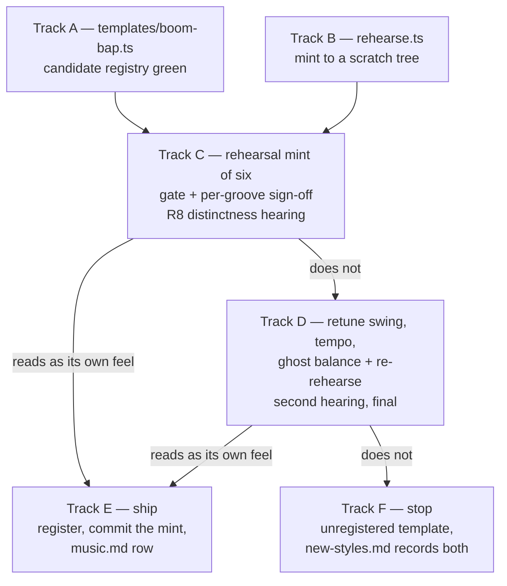

# Tech spec — Epic 4: Boom-bap

PRD: [../prd/epic-4-boom-bap.md](../prd/epic-4-boom-bap.md) ·
Roadmap: [../roadmap.md](../roadmap.md)

## Approach

The epic is one template file and one judgement, and the judgement can send the
template back once and then stop the epic dead — so the plan is built around
reaching the hearing cheaply and being able to walk away from it having written
nothing. Two tracks run in parallel first: the template itself, checked against
a *candidate registry* (`[...allTemplates(), boomBap]`) so every whole-registry
rule is satisfied before the template is registered at all, and a **rehearsal
mint** — a small committed script that mints six grooves into a scratch tree
under `os.tmpdir()`, from a pinned start seed, leaving `catalogue.json`, the
manifest, the lock and `public/grooves/` untouched. The six scratch mp3s are
what gets heard. Only a positive verdict commits: the registry line, the mint,
the manifest refresh and the `docs/music.md` row all land after the verdict, in
that order.

That inversion is the whole design. R9a's stopping outcome asks for a catalogue
and a lock "unchanged by this epic" (AC8a); minting first and reverting later
can *reach* that state, but only by regenerating derived files that two other
wave-2 epics are appending to at the same time. Rehearsing first makes AC8a a
tautology — there is nothing to revert, because nothing was written — and makes
R9's retune loop a second rehearsal rather than a rollback.

## Architecture

### The branch, and what each outcome costs



There is no wave after E/F, which is how R9b is enforced: the plan has nowhere
to put a third hearing.

**What the stopping outcome costs, as planned:** one file added
(`templates/boom-bap.ts`), one test file added, one row edited in
`specs/new-styles.md`. `git status` shows nothing else. `catalogue.json`,
`grooves.lock.json`, `src/features/daily-groove/data/grooves.generated.ts` and
`public/grooves/` were never opened for writing, so AC8a is provable by
`git status --porcelain` and `npm run grooves:verify` rather than by inspection.

**What it would have cost if the six were minted and committed before the
hearing**, which is the ordering this spec rejects:

- six rows deleted from `catalogue.json`, six mp3s deleted from
  `public/grooves/`;
- `npm run grooves` re-run to rewrite the manifest and the lock — a `git revert`
  will not do it, because by then Epics 2 and 3 have appended their own grooves
  to the same two derived files and a revert would take theirs out with ours;
- six groove ids burned permanently. `catalogue.test.ts`'s `never re-issues an
  id` and its `RETIRED` list mean the numbers cannot come back, so the stopping
  outcome would leave a six-wide hole in the numbering and a shared-test edit to
  record it;
- `npm run grooves:verify` and `rerender-check.ts` re-run to prove the remaining
  grooves are bit-identical, because the lock was rewritten wholesale;
- and the one that is not mechanical: a reviewer can no longer tell by reading
  the diff that nothing shipped. "Unchanged by this epic" becomes a claim about
  two generated files instead of an empty `git status`.

### Where boom-bap sits between its neighbours

The distinctness risk is arithmetic before it is musical. These are the four
registered templates it is closest to, and the two numbers the epic reserves.

| Template | BPM | Subdiv | Swing | Kit note |
| :-- | :-- | :-- | --: | :-- |
| `half-time` | 68–80 | 16 | 0.28 | kick, snare, both hats, toms, bass, comp |
| `straight-funk` | 94–106 | 16 | 0.18 | + rim |
| `swung-sixteenth` | 106–116 | 16 | 0.44 | as `half-time` |
| **`boom-bap`** | **86–92** | **16** | **0.34** | kick, snare, both hats, bass, comp — no toms |

- **Tempo.** 86–92 leaves two bpm of daylight under `straight-funk`'s 94 floor.
  R1 only asks for a distinct range *string*, and `85–95` would satisfy it while
  putting a 94 bpm boom-bap and a 94 bpm straight-funk one swing value apart —
  which is the exact failure the hearing exists to catch, imported into the
  template on purpose. The top of the reserved band is 92 for that reason.
- **Swing.** 0.34 sits 0.06 above `half-time` and 0.10 below `swung-sixteenth`.
  The retune's room is upward, to 0.40, because 0.44 is taken.
- **Kit.** Dropping the toms is what makes the kit itself distinct — with them,
  boom-bap declares exactly `half-time`'s eight voices and the whole difference
  has to be carried by tempo, swing, figures and mix. It also makes
  `DEFAULT_FILL` resolve to `kick: [0]`, `snare: [0, 2, 4, 6, 14]` — a snare
  fill, which is the idiom — so **no `FILLS` entry is needed**, and boom-bap's
  backbeat is `DEFAULT_PLACEMENT`'s `[4, 12]`, so **no `PLACEMENTS` entry is
  needed either**. The epic edits no line of `events.ts`.

### Density, measured rather than hoped for

Events per bar over 399 seeds, built through the real `buildEvents` with the
shared kick, hat, bass and ghost pools, no toms, and a one-onset comp, grouped by
which hat figure the seed drew:

| Hat hits/bar | Seeds | Events/bar | Median |
| --: | --: | :-- | --: |
| 7–8 (eighths) | 125 | 19.50 – 22.58 | 21.0 |
| 9–10 (broken) | 152 | 20.42 – 24.17 | 22.6 |
| 15–16 (sixteenths) | 122 | 26.25 – 29.08 | 27.8 |

The spread is the hat figure, not the seed. `19–31` covers all of it with about
two events a bar of headroom at each end — enough for a declared kick pool one
hit busier than the shared one and for a ghost figure retune, and distinct from
every registered band (`18–44`, `16–42`, `14–48`, `16–38`, `17–40`, `8–30`),
which is what R7 asks for.

### The mint writes a manifest with no `HEARD_IN`, and `verify` will say so

`addGrooves` calls `writeManifest(entries, path, buildPools(entries))` with no
fourth argument, and `renderManifest` omits the `HEARD_IN` export entirely when
none is passed. `generate` does pass it. So a bare mint leaves
`grooves.generated.ts` without the export the reveal imports, and
`grooves:verify` fails on `manifestSha256` — which is the trap catching itself.
The sanctioned refresh is `npm run grooves -- --manifest-only`: it re-renders
the manifest *with* `HEARD_IN`, encodes no audio (`encode: !manifestOnly`), and
rewrites the lock from the mp3s already on disk. Every commit step here ends with
it. Boom-bap's six new scale names get no `heard-in.json` entry and need none —
`heardInFailures` only requires that every scale the table *names* is rendered,
not the reverse.

### The files this epic touches, and who else touches them

| Path | Who else | When it is touched |
| :-- | :-- | :-- |
| `templates/boom-bap.ts`, `templates/boom-bap.test.ts` | nobody | Waves 1, 3 |
| `scripts/grooves/rehearse.ts`, `rehearse.test.ts` | nobody | Wave 1 |
| `templates/index.ts`, `templates/index.test.ts` | Epics 2, 3 | **ship branch only** |
| `catalogue.json`, `grooves.lock.json`, `grooves.generated.ts`, `public/grooves/` | Epics 2, 3 | **ship branch only**, in one serial mint slot |
| `docs/music.md` (one feel-table row) | Epics 1, 2, 3 | **ship branch only** |
| `specs/new-styles.md` (the boom-bap row) | nobody | **stop branch only** |
| `events.ts` | Epics 2, 3 | never |

Everything shared with Epics 2 and 3 sits behind the verdict, so a stopped
boom-bap cannot break their minting: it never entered the registry, never
appended to the catalogue and never rewrote the lock.

## Contracts

Frozen before any track starts. Epic 1's own contracts sit above these — where
the two disagree, Epic 1 wins and only the call sites named below change.

### C1 — `templates/boom-bap.ts`

```ts
// scripts/grooves/templates/boom-bap.ts
export const boomBap: FeelTemplate = {
  id: 'boom-bap',
  tempoRange: [86, 92],
  subdivision: 16,
  swing: 0.34,
  flavours: ['dorian', 'aeolian', 'phrygian'],
  voices: ['kick', 'snare', 'hatClosed', 'hatOpen', 'bass', 'comp'],
  humanize: { timingMs: 14, velocity: 0.1, lean: { snare: 12, hatClosed: -3, hatOpen: -3 }, driftDepth: 0.006 },
  gain: { kick: -4, snare: -4, hatClosed: -14, hatOpen: -20, bass: -7, comp: -9 },
  pan:  { kick: 0, snare: -0.04, hatClosed: 0.3, hatOpen: 0.32, bass: 0, comp: -0.25 },
  passes: 3,
  density: { minPerBar: 19, maxPerBar: 31 },
  patterns: { /* C3 */ },
}
```

What is contract and what is a knob:

- **Contract** — the id, `subdivision: 16`, the reserved swing and tempo bands
  (C2), the shape of `patterns` (C3), `density` being declared rather than
  copied, and the *relation* in `gain`: `kick` and `snare` are the two highest
  numbers the template declares, strictly above every other voice (R3, AC3).
- **Knobs the `musician` settles** — every exact number, the flavour list within
  R2's two-to-four, `passes`, and whether the toms come back. `passes: 3` is
  chosen because it is unique in the registry (the others declare 4 or 2) and
  gives a 12-bar, ~33 s loop with one variation bar and one fill bar.
- **Frozen the moment the first groove is minted** — `flavours` (R2), because
  `pick` indexes the list and a later edit re-renders and re-answers every
  boom-bap groove.

### C2 — the two numbers boom-bap reserves in the shared registry

`templates/index.test.ts` asserts swing values and tempo-range strings are
unique across the registry, and three epics are writing templates at once. So
boom-bap claims, for both hearings:

- **swing ∈ [0.30, 0.40]** — Epics 2 and 3 stay out of that closed interval.
- **tempo range inside 85–95, both ends ≤ 92** — nobody else is near it.

The retune (R9) moves within these bands. A retune that needed to leave them
would be a registry-level negotiation with two epics in flight, which is the
reason the bands are wider than the values.

### C3 — the `patterns` block boom-bap declares

Three pools, and only three:

```ts
patterns: {
  kick:        [ /* 3–5 steps, boom-bap kick figures on the 16-grid */ ],
  comp:        [ /* every figure exactly one step — see Q2 */ ],
  snareGhosts: [ /* 1–4 odd steps, 0…15 */ ],
}
```

- The **key names come from Epic 1's tech spec verbatim.** Epic 1's R12 names
  seven per-voice fields — kick, foot hat, ride, bass, comp, bongos and snare
  ghosts — but not their spellings, and Epic 1's tech spec is not written yet.
  `kick`, `comp` and `snareGhosts` above are the assumed spellings; if Epic 1
  names them differently, the rename is confined to `templates/boom-bap.ts` and
  its own test, because no other track reads them.
- **The hat is deliberately not declared.** Epic 1's field list says "foot hat",
  which is `HAT_PUNCTUATION_PATTERNS` — the pool a *riding* feel draws. Boom-bap
  does not ride, so it draws `HAT_PATTERNS`, and whether Epic 1's hat key
  replaces one pool or whichever pool applies is unknown. All three shared hat
  figures (eighths, sixteenths, broken) are idiomatic at 88 bpm, so boom-bap
  needs no hat key and takes no risk on the answer. The measured density band
  already covers all three.
- **The bass is not declared either.** `BASS_PATTERNS`'s four figures follow the
  kick closely enough, and one fewer declared pool is one fewer thing the retune
  can be accused of having rewritten.
- Epic 1's R16 already requires a declared pool to be non-empty with steps in
  `0…15` and to throw by template id and voice otherwise. This epic asserts its
  own pools against that rule rather than re-implementing it.

### C4 — the rehearsal rig

```ts
// scripts/grooves/rehearse.ts
export type Rehearsal = {
  template: string
  startSeed: number
  catalogueSha256: string          // of the committed catalogue.json at rehearsal time
  dir: string                      // the scratch tree
  grooves: { id: string; template: string; seed: number; sha256: string; bytes: number }[]
}

export function resolveTemplate(id: string, opts?: { modulePath?: string }): FeelTemplate
export async function rehearse(opts: RehearseOptions): Promise<Rehearsal>
export async function commit(rehearsal: Rehearsal, opts?: CommitOptions): Promise<GrooveSpec[]>
```

```
node scripts/grooves/rehearse.ts --template boom-bap --count 6 [--seed <n>]
node scripts/grooves/rehearse.ts --commit <dir>/rehearsal.json
```

- `rehearse` creates a scratch tree under `os.tmpdir()`, hard-links (falling back
  to `copyFileSync` across filesystems) every committed mp3 into
  `<dir>/audio/` so `probeHeadDelaySeconds` can read the whole catalogue, copies
  `catalogue.json` into `<dir>/`, and calls `addGrooves(count, { cataloguePath,
  outDir, manifestPath, lockPath, startSeed, templates })` with all four paths
  inside `<dir>`. `DEFAULT_OUT_DIR`, `DEFAULT_MANIFEST_PATH`,
  `DEFAULT_LOCK_PATH`, `CATALOGUE_PATH` and `public/grooves/` are never opened
  for writing (R6, AC8a).
- `templates` is `[...allTemplates(), resolveTemplate(id)]` when the id is not
  registered, and `allTemplates()` when it is. `add.ts` resolves every existing
  spec's template out of that same list when it rebuilds the manifest, so the
  list must stay complete; only the *choice* of what to mint is narrowed, which
  is Epic 1's `--template` mechanism (R17). **That option's name is Epic 1's**;
  `rehearse.ts` passes it at one call site.
- `startSeed` defaults to `seedFromClock(Date.now())` and is written into
  `rehearsal.json`, which is what makes the hearing repeatable.
- `commit` re-hashes the committed `catalogue.json`, **refuses if it no longer
  matches `catalogueSha256`** — another epic minted in between, so the rehearsal
  is void and must be re-run — then mints against the real paths with the same
  `startSeed`, and asserts the returned specs' `(template, seed)` list and each
  mp3's `sha256` equal the rehearsed ones. A mismatch throws and names the first
  differing groove.
- Both modes print a table: id, seed, bpm, root, flavour, scale, chord, and
  every gate rejection on the way (R6).

The asserted sha equality is what turns "six mp3s were heard" into "the six
grooves in the catalogue are the six that were heard" (AC8b, AC9). Byte-stable
re-rendering is already assumed by `rerender-check.ts` and by
`grooves:verify`'s per-groove `sha256`; if it turns out not to hold, `commit`
falls back to comparing `(template, seed)` and says so in the report rather than
shipping unheard audio.

### C5 — what the ship branch appends

- `templates/index.ts`: one import, one `[boomBap.id]: boomBap` entry, one name
  in the trailing re-export.
- `templates/index.test.ts`: one row in `pairs each flavour with a feel that
  suits it`, asserting `['aeolian', 'dorian', 'phrygian']` sorted.
- `docs/music.md`: one row in the feel table, and the count in the sentence above
  it (Epic 1 rewrote that heading; this epic only increments what it says).
- **`specs/new-styles.md` is not touched on this branch.** AC10 asks that
  *exactly one* of the two documents records the outcome.

### C6 — what the stop branch leaves

- `templates/boom-bap.ts` and `templates/boom-bap.test.ts` stay, **unregistered**.
  `catalogue.test.ts`'s `draws grooves from every template` requires every
  *registered* template to have at least one groove, so a registered template
  with no grooves would fail the suite; a template file that no registry names
  passes everything (AC5's second half).
- `specs/new-styles.md`'s boom-bap row records both hearings, what the retune
  changed, and whether it moved the verdict at all (R11, AC10).
- `docs/music.md` is not touched on this branch, for the same AC10 reason.

## Tracks

### Track A — The template, and the registry it would join

- **Goal** — `templates/boom-bap.ts` exists, and every whole-registry rule it
  will have to satisfy is already green against a candidate registry, so
  registration later is a formality rather than a discovery.
- **Owns** — `scripts/grooves/templates/boom-bap.ts` (new),
  `scripts/grooves/templates/boom-bap.test.ts` (new)
- **Role** — `musician`
- **Depends on** — C1, C2, C3, and Epic 1's `FeelTemplate.patterns` being merged
- **Parallel with** — Track B
- **Done when** — `npm run test:gen` is green, `boom-bap.test.ts` asserts the
  candidate registry's uniqueness and shape rules, and the template is *not* in
  `TEMPLATES`.

### Track B — The rehearsal rig

- **Goal** — six grooves can be minted, gated and heard without a single write
  inside the repo, and the same start seed gives the same six twice.
- **Owns** — `scripts/grooves/rehearse.ts` (new),
  `scripts/grooves/rehearse.test.ts` (new)
- **Role** — `musician` (it owns generator files; the musical content is nil, and
  `/implement-feature`'s musician-then-implementer pair is the right shape for a
  script)
- **Depends on** — C4, and Epic 1's `--template` mechanism for the one call site
- **Parallel with** — Track A. Its tests use `placeholderPack()` and an existing
  template id, so it needs nothing boom-bap.
- **Done when** — `npm run test:gen` is green and `rehearse.test.ts` proves the
  four committed artefacts are byte-identical across a rehearsal.

### Track C — The first hearing

- **Goal** — six boom-bap grooves rendered to a scratch tree, all seven gate
  checks passing, a per-groove listening sign-off, and R8's distinctness verdict
  in words, before anything is decided.
- **Owns** — nothing under version control. Its product is the scratch tree
  under `os.tmpdir()`, its `rehearsal.json`, and the epic's report.
- **Role** — `musician`
- **Depends on** — A (a template to mint from), B (the rig)
- **Parallel with** — none
- **Done when** — six mp3s exist in the scratch tree, `git status --porcelain` is
  empty, and two verdicts are recorded: R10's per groove, and R8's one for the
  style.

### Track D — The retune and the second hearing

Runs **only** if Track C's distinctness verdict is negative.

- **Goal** — swing, tempo range and ghost-note balance moved, with a written
  prediction of what each change should do *before* the render, and a second
  hearing that is final.
- **Owns** — `scripts/grooves/templates/boom-bap.ts`,
  `scripts/grooves/templates/boom-bap.test.ts`, and a second scratch tree
- **Role** — `musician`
- **Depends on** — C's verdict
- **Parallel with** — none
- **Done when** — AC8 holds — three parameters changed, the prediction recorded
  before the re-render, the six re-rendered from the retuned template and heard
  again — and one of Track E or Track F follows.

### Track E — Ship the six

Runs if the verdict at **either** hearing is positive.

- **Goal** — boom-bap is a registered feel with six grooves in the catalogue,
  nothing else re-rendered, and the feel table says so.
- **Owns** — `scripts/grooves/templates/index.ts`,
  `scripts/grooves/templates/index.test.ts`, `scripts/grooves/catalogue.json`,
  `scripts/grooves/grooves.lock.json`,
  `src/features/daily-groove/data/grooves.generated.ts`, six new files under
  `public/grooves/`, `docs/music.md`
- **Role** — `musician`
- **Depends on** — C's or D's positive verdict, and a free minting slot (Epics 2
  and 3 mint from the same four files)
- **Parallel with** — none (F is its alternative, not its sibling)
- **Done when** — AC5, AC6, AC8b, AC10 and AC11 hold and `npm run grooves:verify`
  is clean.

### Track F — Stop and record

Runs **only** if Track D's second verdict is negative.

- **Goal** — the epic ends with a template on disk, two verdicts on the record,
  and a repo whose generated artefacts this epic never touched.
- **Owns** — `specs/new-styles.md`,
  `scripts/grooves/templates/boom-bap.test.ts` (one assertion)
- **Role** — `musician`
- **Depends on** — D's negative verdict
- **Parallel with** — none
- **Done when** — AC8a and AC10 hold, `npm run test:gen` is green with the
  template unregistered, and `git status --porcelain` names only the two boom-bap
  files and `specs/new-styles.md`.

## Execution waves

- **Wave 1 (parallel):** Track A, Track B
- **Wave 2:** Track C — needs a template (A) and the rig (B)
- **Wave 3:** Track D if C's verdict is negative; **otherwise Track E** and the
  epic is over
- **Wave 4:** reached only through D — Track E **or** Track F, never both,
  chosen by D's verdict

There is no Wave 5, which is R9b.

Wave 1's two tracks own disjoint paths. Waves 3 and 4 re-open files Wave 1 owned
(`boom-bap.ts`, its test), which is safe because no two tracks in the same wave
name the same path.

## Implementation

### Track A — The template, and the registry it would join

#### Step A1 — a template nobody has registered, with numbers nobody else has taken

Covers: R1, AC1

- **Test first** — `scripts/grooves/templates/boom-bap.test.ts`: import
  `{ boomBap }` from `./boom-bap.ts` and `{ TEMPLATES, allTemplates }` from
  `./index.ts`. Define `const CANDIDATE = [...allTemplates(), boomBap]`. Assert:
  `boomBap.id === 'boom-bap'`; `subdivision === 16`; `tempoRange[0] >= 85 &&
  tempoRange[1] <= 95 && tempoRange[1] <= 92 && tempoRange[0] < tempoRange[1]`;
  `swing >= 0.3 && swing <= 0.4`; and across `CANDIDATE` — ids unique, swing
  values unique, `tempoRange.join('-')` strings unique,
  `JSON.stringify([gain, pan])` unique, `JSON.stringify(humanize)` unique. Assert
  also `TEMPLATES['boom-bap']` is `undefined` — registration is Track E's, and
  this file is what makes that safe. Run it: fails with `Cannot find module
  './boom-bap.ts'`.
- **Implement** — `scripts/grooves/templates/boom-bap.ts`: C1's object, with
  `patterns` omitted for now — A4 and A5 add its three keys. Omit the field; do
  not write `patterns: { kick: [] }`, which Epic 1's R16 makes a build-time
  throw.
- **Green when** — the uniqueness assertions pass against seven templates and
  `npm run test:gen` is green.
- **Refactor** — none. Keep `CANDIDATE` a module-level const in the test; A7
  reuses it.

#### Step A2 — two to four modes, all of them modes the game offers

Covers: R2, AC2

- **Test first** — `boom-bap.test.ts`: assert `boomBap.flavours.length` is 2, 3
  or 4; `new Set(boomBap.flavours).size === boomBap.flavours.length`; every entry
  is in `FLAVOURS` (import from `../../../src/lib/theory/names.ts`); and the
  sorted list equals the literal the `musician` settled — `['aeolian', 'dorian',
  'phrygian']` as proposed by `new-styles.md`. Run it: fails on the literal until
  the list is settled.
- **Implement** — set `flavours` in `boom-bap.ts`.
- **Green when** — all four assertions pass.
- **Refactor** — none. The literal in the test is the same device
  `index.test.ts`'s `pairs each flavour with a feel that suits it` uses, and it
  is what freezes the list once the first groove is minted.

#### Step A3 — the kick and the snare are the two loudest things in the mix

Covers: R3, AC3

- **Test first** — `boom-bap.test.ts`: assert every voice in `boomBap.voices` has
  a numeric `gain` and `pan` with `|pan| <= 1`; that
  `Math.min(gain.kick, gain.snare)` is strictly greater than every other declared
  gain — including `bass`, which every existing template puts on top; and that
  `Object.keys(gain)` and `Object.keys(pan)` name no voice the template does not
  play. Run it: fails with `bass -1 is not below kick -4` against a template
  copied from a neighbour's mix.
- **Implement** — set `gain` and `pan` in `boom-bap.ts` with the drums forward
  and the bass under them.
- **Green when** — the strict inequality holds for every non-drum voice.
- **Refactor** — none, but flag it for C2's brief: the bass carries the root, and
  a drum-forward mix is the one decision in this template that could make the
  *puzzle* harder rather than the groove better. Gains are pre-normalisation —
  `mixTracks` pins true peak to `PEAK_CEILING` — so what these numbers set is
  balance, not level.

#### Step A4 — the ghosts sit under the backbeat, in every bar of every seed

Covers: R3, R4, AC3

- **Test first** — `boom-bap.test.ts`: assert `boomBap.patterns?.snareGhosts` is
  a non-empty array of 1–4 ascending, unique, **odd** steps inside `0…15` — odd
  because `ghostSteps` snaps a ghost between the backbeats and a declared even
  step would silently move. Then, for `seed` 1…40, build
  `buildEvents({ id: 'x', uuid: '', template: 'boom-bap', seed }, boomBap)`, split
  the `snare` events by `GHOST_VELOCITY_THRESHOLD` (import from `../events.ts`),
  and assert: both sets are non-empty; `Math.max(...ghostVelocities) <
  Math.min(...backbeatVelocities)`; and the margin is at least the floor R3 asks
  the `musician` to name — **0.2**, which is what the measurement supports:
  across 199 seeds the lowest backbeat velocity is 0.607 and the highest ghost
  0.327, a margin of 0.28. Those are post-humanize values, which is why the floor
  is not the 0.75 the raw tables suggest; the same measurement is what makes the
  threshold split safe, since no backbeat falls under `0.5` and no ghost reaches
  it. Run it: fails with `expected undefined to be an array`, because
  `patterns.snareGhosts` is not declared yet.
- **Implement** — declare `patterns.snareGhosts` in `boom-bap.ts`.
- **Green when** — all forty seeds separate cleanly.
- **Refactor** — none. The velocity separation is structural — ghosts are struck
  at `0.15–0.25` and a backbeat at `1.0` — so this step is a guard against a
  future template-level change to that, and the ghost *figure* is the only lever
  the retune has on the balance (see Q1).

#### Step A5 — the comp is sparser than any of the three named templates renders

Covers: R5, AC4

- **Test first** — `boom-bap.test.ts`: assert `boomBap.patterns?.comp` is
  non-empty and **every figure holds exactly one step** in `0…15`. Then a
  rendered comparison, which is AC4's own wording: for `seed` 1…40 and for each
  of `boom-bap`, `straight-funk`, `swung-sixteenth` and `bright-straight`, count
  distinct comp *onsets* per bar (unique `timeSec` quantised to the bar's
  sixteenth grid — a comp event is one note of a voicing, so raw event counts
  measure the voicing, not the figure), and assert boom-bap's maximum is strictly
  below the minimum of the other three. Run it: fails, `patterns.comp` is
  undefined.
- **Implement** — declare `patterns.comp` with one-step figures at the positions
  the `musician` chooses (the "and" of 2 and beat 3 are the idiomatic stabs).
- **Green when** — boom-bap renders 1 onset a bar against the other three's 2 or
  3.
- **Refactor** — none. `COMP_PATTERNS` is module-private in `events.ts`, so the
  comparison goes through rendered events rather than through a new export; that
  also keeps it honest, since it measures what the feel actually plays.

#### Step A6 — the density band is boom-bap's own, and every seed lands inside it

Covers: R7, AC6

- **Test first** — `boom-bap.test.ts`: assert `boomBap.density` equals
  `{ minPerBar: 19, maxPerBar: 31 }`; that no registered template declares the
  same band (`JSON.stringify` over `allTemplates()`); and that for `seed` 1…200,
  `events.length / music.loopBars` is inside the band with at least 1.5 events a
  bar of margin at both ends. Run it: fails against a band copied from
  `half-time`.
- **Implement** — set `density` in `boom-bap.ts` from a fresh measurement taken
  **with the declared pools in place** (A4 and A5 change the counts): build 200
  seeds, print min/median/max grouped by hat figure, and set the band to cover
  the measured range plus two events a bar at each end. The starting numbers are
  the *Architecture* section's table — 19.50 to 29.08 over 399 seeds with the
  shared pools — so a large divergence means a declared pool is busier than
  intended, not that the band is wrong.
- **Green when** — 200 of 200 seeds land inside, with margin.
- **Refactor** — none. The band is the gate's rejection rule as well as an
  assertion; a band with no margin turns the mint into a lottery.

#### Step A7 — the candidate registry passes every rule the real one applies

Covers: R1, R2, AC1

- **Test first** — `boom-bap.test.ts`: run `index.test.ts`'s registry-level rules
  over `CANDIDATE` rather than `allTemplates()` — contains `hatClosed`; contains
  `hatOpen`, since it declares no `ride`; plays `kick`, `snare`, `hatClosed`,
  `bass`, `comp`; `voices` has no duplicate; `swing` in `(0, 1]`;
  `humanize.timingMs > 0` and below `((60 / tempoRange[1]) * 4 / subdivision) *
  500`; `humanize.velocity` in `(0, 0.5)`; `driftDepth` in `(0, 0.01]`;
  `lean.snare > 0` and `lean.hatClosed`, `lean.hatOpen` `<= 0`; `lean` names only
  played voices; `passes` an integer `>= 2`. Run it: fails on whichever rule the
  first draft of the template broke — most likely a `lean` sign or a `lean` on a
  voice the trimmed kit no longer plays. `timingMs` has room: half a sixteenth at
  92 bpm is 81.5 ms.
- **Implement** — fix `boom-bap.ts` until every rule holds.
- **Green when** — all of them pass and `npm run test:gen` is green.
- **Refactor** — none. This step is why Track E's registration is one line and
  not a debugging session inside a shared test file with two other epics
  appending to it.

### Track B — The rehearsal rig

#### Step B1 — a rehearsal writes nothing inside the repo

Covers: R6, AC8a

- **Test first** — `scripts/grooves/rehearse.test.ts`: capture the committed
  state the way `add.test.ts` does — the text of `catalogue.json`,
  `grooves.lock.json` and `grooves.generated.ts`, plus a name-and-size
  fingerprint of `public/grooves/` — then `await rehearse({ template:
  'straight-funk', count: 1, startSeed: 5, pack: placeholderPack() })` and assert
  all four are unchanged, that the returned `dir` is under `os.tmpdir()`, that
  `<dir>/audio/` holds one new mp3 plus one per committed groove, and that
  `<dir>/rehearsal.json` parses as a `Rehearsal` with `startSeed === 5`. Run it:
  fails with `Cannot find module './rehearse.ts'`.
- **Implement** — `scripts/grooves/rehearse.ts`: build the scratch tree
  (hard-link the committed mp3s, fall back to copy), copy the catalogue, call
  `addGrooves` with all four paths inside it, hash each new mp3, write
  `rehearsal.json`, return it.
- **Green when** — the four committed artefacts are byte-identical and the
  scratch tree holds the mint.
- **Refactor** — hard-linking rather than copying keeps a rehearsal cheap enough
  to run three times in an afternoon, which is what the retune loop needs. Say so
  in one line beside the fallback; it is the non-obvious kind.

#### Step B2 — the same start seed gives the same six grooves, and the same bytes

Covers: R6, AC8b

- **Test first** — `rehearse.test.ts`: rehearse twice with `startSeed: 5`,
  `count: 2`, the same pack, against the same committed catalogue; assert the two
  `grooves` arrays are deep-equal on `(template, seed, sha256, bytes)` and differ
  only in `dir`. Run it: fails if `rehearse` lets `addGrooves` default
  `startSeed` off the clock.
- **Implement** — thread `startSeed` through and record it in `rehearsal.json`.
- **Green when** — the two rehearsals agree groove for groove.
- **Refactor** — none. This is the property the whole ordering rests on: the six
  that get committed are the six that were heard.

#### Step B3 — a stale rehearsal is refused, not silently committed

Covers: AC8a, AC8b

- **Test first** — `rehearse.test.ts`: rehearse against a temp catalogue, then
  append a groove to that catalogue, then `commit(rehearsal, { cataloguePath })`
  and assert it rejects with a message naming `catalogueSha256` and both hashes,
  and that the catalogue, manifest, lock and audio dir are unchanged. Run it:
  fails, `commit` is not exported.
- **Implement** — `commit` re-hashes the catalogue first and throws before it
  loads a pack.
- **Green when** — the mismatch throws and nothing was written.
- **Refactor** — none. This is the wave-2 serialisation guard: if Epic 2 or 3
  mints between the hearing and the commit, the ids and the answer-uniqueness
  checks have moved, and the honest response is to re-rehearse — minutes — rather
  than to commit six grooves nobody heard.

#### Step B4 — commit mints exactly what was rehearsed

Covers: R6, AC5, AC8b

- **Test first** — `rehearse.test.ts`: rehearse `count: 2` against a temp
  catalogue, `commit` against the same temp paths, and assert the returned specs'
  `(template, seed)` list equals the rehearsal's, each committed mp3's sha256
  equals the rehearsed one, the temp catalogue grew by exactly two, and each spec
  has a canonical uuid distinct from the rehearsal's (uuids are minted per run
  and do not touch the audio). Then doctor one seed in a copy of the rehearsal
  and assert `commit` throws naming that groove. Run it: fails on the sha
  comparison until `commit` performs it.
- **Implement** — `commit` mints with the recorded `startSeed`, then compares
  specs and hashes and throws with the first difference.
- **Green when** — both directions hold.
- **Refactor** — if mp3 encoding turns out not to be byte-stable across runs,
  drop to comparing `(template, seed)` and record that in the epic's report and
  in this spec's assumptions — do not weaken the check quietly.

#### Step B5 — an unregistered template can still be rehearsed

Covers: R6

- **Test first** — `rehearse.test.ts`: assert
  `resolveTemplate('straight-funk')` returns the registered object; that
  `resolveTemplate('no-such-feel')` throws naming both the registry and the path
  it looked for; and that `resolveTemplate('temp-feel', { modulePath })`, pointed
  at a one-template module written into a temp dir, returns it and rejects a
  module whose exported `id` does not match. Run it: fails, `resolveTemplate` is
  not exported.
- **Implement** — resolve from `TEMPLATES` first, then dynamic-import
  `./templates/<id>.ts` (or `modulePath`), take the single exported value whose
  `id` matches, and assert the match.
- **Green when** — all three assertions pass, and `rehearse` passes
  `[...allTemplates(), resolved]` as `templates` when the id was not registered.
- **Refactor** — none. This is what lets registration be the last, reversible
  step instead of the first.

### Track C — The first hearing

#### Step C1 — six candidates, rehearsed and gated

Covers: R6, AC5, AC6

- **Test first** — not a unit test: the deliverable is a scratch tree and a log.
  Run `node scripts/grooves/rehearse.ts --template boom-bap --count 6` and record
  the printed `startSeed`, the six ids, seeds, bpms and answers, and every gate
  rejection on the way with its check and measured value. Six accepted candidates
  means all seven checks passed for each — `gateCandidate` returns on the first
  failure, and `addGrooves` discards anything it returns.
- **Implement** — nothing new. If the run gives up on its attempt budget, the
  fix is in the template — most likely the density band (A6) or the loudness
  floor against a sparse comp — and not a wider band bolted on after the fact.
- **Green when** — `<dir>/audio/` holds six new mp3s, `rehearsal.json` records
  them, and `git status --porcelain` is empty.
- **Refactor** — record the rejection reasons even on a clean run. A template
  that needed twenty attempts for six grooves is telling you something about the
  band before anyone listens.

#### Step C2 — a person signs off each of the six

Covers: R10, AC9

- **Test first** — none. This is a listening pass, and a gate pass is not a
  sign-off.
- **Implement** — play each of the six in full and record a verdict per groove in
  the epic's report, in the listener's own words. The brief: the kick and snare
  land hard; the ghosts are texture and not a second backbeat; the keys are
  sparse rather than absent; and — because A3 put the drums above the bass — the
  root and the chord are still audible enough to answer the puzzle from.
- **Green when** — six verdicts are on the record, each naming what is there
  rather than that it sounds good.
- **Refactor** — none.

#### Step C3 — the distinctness hearing, against its two closest neighbours

Covers: R8, AC7

- **Test first** — none. This is the decision the epic exists to reach, and it is
  separate from C2: one asks whether the groove is good, the other whether the
  feel is new.
- **Implement** — build a playlist of eighteen: for each of the six boom-bap
  mp3s, the straight-funk groove, then the half-time groove, then the boom-bap
  one. Use `public/grooves/groove-02.mp3` (straight-funk, 96 bpm, E dorian) and
  `public/grooves/groove-13.mp3` (half-time, 79 bpm, A♭ phrygian) — the two
  committed grooves closest in tempo to 86–92 from either side, and both in modes
  boom-bap's own list carries, so the comparison is of the feel and not of the
  mode. Play them without the file names visible where that is practical. Then
  state, in the listener's words: does boom-bap read as its own feel? Record the
  verdict whichever way it goes, before any decision to ship.
- **Green when** — the report carries one verdict for the style, with reasons in
  the terms of the brief.
- **Refactor** — none. A near miss is a negative verdict; the retune is one
  rehearsal, and R9b's budget is what keeps that from becoming a habit.

#### Step C4 — nothing has moved

Covers: AC8a, AC11

- **Test first** — `git status --porcelain` and `npm run grooves:verify`.
- **Implement** — nothing. Then `node scripts/grooves/rerender-check.ts` and
  assert every committed groove matches the lock, which is the strong form of
  AC11 and costs one command.
- **Green when** — `git status` is empty but for Wave 1's two new files, verify
  reports the catalogue and both manifests match the lock, and rerender-check
  reports all of them matching.
- **Refactor** — none.

### Track D — The retune and the second hearing

Runs only on a negative verdict at C3. Every step is a bounded change to the
three parameters R9 names, so the diff reads as a retune and not a rewrite.

#### Step D1 — the prediction, written before the render

Covers: R9, AC8

- **Test first** — none, and the ordering is the point: this table is written
  while `boom-bap.ts` still holds the values that were heard.
- **Implement** — a three-row table in the epic's report: parameter, old → new,
  what the change is expected to do to the sound, and which neighbour it pulls
  away from. All three rows are required — `swing` (within C2's `[0.30, 0.40]`),
  `tempoRange` (within 85–95, both ends ≤ 92) and the ghost-note balance
  (`patterns.snareGhosts`, per Q1's answer).
- **Green when** — the table names all three parameters with both values and an
  expectation each, and no value has yet changed in the file.
- **Refactor** — none. R9 asks for the prediction because a retune whose
  expectation is written afterwards cannot be wrong.

#### Step D2 — three parameters move, and nothing else does

Covers: R9, AC8

- **Test first** — `boom-bap.test.ts`: update A1's `swing` and `tempoRange`
  assertions to the retuned values, still inside C2's bands, and A4's
  `snareGhosts` assertion to the new figure. Add the guard that makes "not a
  rewrite" machine-checkable: `boomBap.flavours` sorted still equals A2's
  literal, and `patterns.kick` and `patterns.comp` still deep-equal the literals
  they held at the first hearing, written into the test. Run them: the first three
  fail against the shipped values, the last two pass and must keep passing.
- **Implement** — change exactly those three fields in `boom-bap.ts`.
- **Green when** — the retuned assertions pass, the frozen ones still pass, and
  A5's and A6's rendered assertions still hold — if the density band no longer
  covers 200 seeds, widening it is part of the retune and is recorded in D1's
  table as a fourth row.
- **Refactor** — none. A retune that wanted the mode list or the kick and comp
  figures is a different template wearing the same id, and its grooves would owe
  a first hearing, not a second.

#### Step D3 — the six are re-rehearsed from the retuned template

Covers: R9, AC5, AC8

- **Test first** — not a unit test: run
  `node scripts/grooves/rehearse.ts --template boom-bap --count 6 --seed <the
  first hearing's startSeed>` into a fresh scratch tree.
- **Implement** — nothing new. Expect the same six seeds: `intBetween` draws the
  bpm as the *first* value off `MUSIC_LABEL`, so a changed tempo range shifts no
  later draw, and each groove keeps its root, flavour, scale and progression
  across the retune. A seed that drops out did so at the gate — most likely
  density or loudness — and the report names it and the check that rejected it.
- **Green when** — six mp3s exist in the new scratch tree, `git status` is still
  empty, and the seed list is recorded next to the first hearing's.
- **Refactor** — none. That the answers survive a tempo retune is worth stating
  in the report: the same six questions, asked in a different feel.

#### Step D4 — the second hearing, and it is final

Covers: R9a, R9b, AC7, AC9

- **Test first** — none.
- **Implement** — repeat C2 and C3 exactly: a per-groove sign-off, then the
  eighteen-file playlist against `groove-02` and `groove-13`, then a stated
  verdict. Record it beside the first, with one line on whether the retune moved
  the verdict at all — which is what R11's stop-branch record asks for and the
  hardest thing to reconstruct later.
- **Green when** — two verdicts are on the record and exactly one of Track E and
  Track F is chosen.
- **Refactor** — none. There is no third hearing. If the second verdict is a
  shrug rather than a yes, it is a no: the four other styles do not depend on
  this one.

### Track E — Ship the six

#### Step E1 — boom-bap joins the registry

Covers: R1, AC1

- **Test first** — `scripts/grooves/templates/index.test.ts`: add boom-bap's row
  to `pairs each flavour with a feel that suits it`, asserting
  `[...templateById('boom-bap').flavours].sort()` equals
  `['aeolian', 'dorian', 'phrygian']`. In `boom-bap.test.ts`, flip A1's
  registration assertion: `TEMPLATES['boom-bap']` is now `boomBap`. Run them:
  fail with `templateById: unknown template "boom-bap"`.
- **Implement** — `templates/index.ts`: one import, one `[boomBap.id]: boomBap`
  entry, one name added to the trailing re-export.
- **Green when** — `npm run test:gen` is green, including the whole-registry
  uniqueness assertions Epic 1 rewrote — which Track A already proved against the
  candidate registry.
- **Refactor** — none. `index.ts` and `index.test.ts` are shared with Epics 2 and
  3; this is an append at the end of each, and it merges as one line.

#### Step E2 — the six grooves, the manifest, and the lock

Covers: R6, AC5, AC8b

- **Test first** — `npm run test:gen`, which runs `catalogue-gate.test.ts` over
  every catalogue entry and so puts all six boom-bap grooves through all seven
  checks in CI, and `catalogue.test.ts`, which asserts the new answers are unique
  and the modes are not dominated. Both are red before the mint only in the sense
  that the grooves do not exist; the red that matters is
  `npm run grooves:verify` failing on `catalogueSha256` the moment the catalogue
  grows.
- **Implement** — in one minting slot, no other epic minting:
  1. `node scripts/grooves/rehearse.ts --commit <dir>/rehearsal.json` — refuses
     if the catalogue moved since the hearing (B3), then mints the same six.
  2. `npm run grooves -- --manifest-only` — restores the `HEARD_IN` export the
     mint's manifest omits, encodes no audio, and rewrites the lock's
     `manifestSha256`.
  3. `npm run grooves:verify` — must report the catalogue, both manifests and
     every groove matching the lock.
- **Green when** — `catalogue.json` holds exactly six `boom-bap` entries, the
  manifest carries `HEARD_IN` again, the lock has six new entries and no changed
  `sha256` for any existing groove, and `npm run test:gen` is green.
- **Refactor** — none. Fixing `addGrooves` to pass `heardIn` through belongs to
  whoever owns `add.ts` — Epic 1 — and this epic works with the sanctioned
  two-command sequence rather than editing a file two other epics are minting
  through.

#### Step E3 — nothing outside this template re-rendered

Covers: R9b, AC8b, AC11

- **Test first** — `node scripts/grooves/rerender-check.ts`: it renders the whole
  catalogue into a temp dir and compares each groove's sha256 to the committed
  lock.
- **Implement** — nothing, if E2 was clean. Then AC11's own literal check:
  `npm run grooves` followed by `git status`, which must show no change to any
  mp3 other than the six new ones and no change to the manifest or the lock.
- **Green when** — rerender-check reports every groove matching, `git status` is
  clean, and the report states that two hearings at most were needed to get here.
- **Refactor** — none. A single mismatch means something outside the template
  moved — check `events.ts` first, because this epic is not supposed to have
  touched it.

#### Step E4 — the feel table gains a row

Covers: R11, AC10

- **Test first** — read `docs/music.md`'s feel table and assert by eye that its
  row count matches `allTemplates().length` and that the sentence above it agrees.
  There is no structural test over this table today; `docs.test.ts` covers the
  generator README and the coding guidelines only, and adding one is Epic 1's
  call, since Epic 1 rewrites the section.
- **Implement** — one row: `` `boom-bap` | 86–92 | 16 | 0.34 | dorian, aeolian,
  phrygian | 3 | 19–31 | hat ``, with the settled values, and increment the count
  in the sentence above the table. Do **not** touch `specs/new-styles.md`: AC10
  wants exactly one of the two documents to record the outcome, and on this
  branch it is `music.md`.
- **Green when** — the table lists boom-bap with the values the template
  declares, and `grep -c 'boom-bap' specs/new-styles.md` still finds only the
  candidate row it always had.
- **Refactor** — none.

### Track F — Stop and record

#### Step F1 — the registry never learns about boom-bap

Covers: R9a, AC5, AC8a

- **Test first** — `boom-bap.test.ts`: keep A1's assertion that
  `TEMPLATES['boom-bap']` is `undefined`, and add that
  `allTemplates().some((t) => t.id === 'boom-bap')` is `false`, with a comment
  naming this epic's second verdict as the reason. Run `npm run test:gen`: green,
  and specifically `catalogue.test.ts`'s `draws grooves from every template`
  passes, because the assertion is over registered templates and boom-bap is not
  one.
- **Implement** — nothing. Step E1 is simply not performed.
- **Green when** — the whole generator suite is green with a template file that
  no registry names.
- **Refactor** — none. That the file stays is R9a's instruction: the template and
  both verdicts are what ships.

#### Step F2 — both hearings go on the record

Covers: R9a, R11, AC8a, AC10

- **Test first** — none; the deliverable is a document.
- **Implement** — `specs/new-styles.md`'s boom-bap row records: that it was
  tried twice; the first hearing's verdict in the listener's words; what the
  retune changed, with D1's expectation beside what was actually heard; the second
  verdict; and whether the retune moved the verdict at all. Name where the
  template file sits, unregistered, so the next person to reach for boom-bap
  starts from it rather than from the candidate row. Do **not** touch
  `docs/music.md` — no feel shipped, and AC10 wants exactly one record.
- **Green when** — the row carries both verdicts and the retune's before-and-
  after, and `grep -c 'boom-bap' docs/music.md` finds nothing.
- **Refactor** — none. `specs/new-styles.md` is the right home for the same
  reason feature-24 put its rejections in `samples/README.md`: it is committed,
  it sits beside the candidate list it corrects, and it is what the next attempt
  reads first.

#### Step F3 — the generated artefacts are byte-identical to what was committed

Covers: AC8a, AC11

- **Test first** — `git status --porcelain`, which must name only
  `scripts/grooves/templates/boom-bap.ts`,
  `scripts/grooves/templates/boom-bap.test.ts`,
  `scripts/grooves/rehearse.ts`, `scripts/grooves/rehearse.test.ts` and
  `specs/new-styles.md`.
- **Implement** — nothing. Then `npm run grooves:verify` and
  `node scripts/grooves/rerender-check.ts`.
- **Green when** — `catalogue.json`, `grooves.lock.json`,
  `grooves.generated.ts` and every file under `public/grooves/` are untouched,
  verify is clean, and rerender-check reports every groove matching.
- **Refactor** — none. This is AC8a, and with this ordering it is a `git status`
  rather than a repair.

## Integration and verification

- **Wave 1 → Wave 2** — Track C cannot start until `boom-bap.test.ts` is green
  *and* `rehearse.test.ts` proves a rehearsal leaves the four committed artefacts
  byte-identical. Check the second one explicitly: a rehearsal that quietly wrote
  into `public/grooves/` would make the whole ordering a fiction.
- **The rehearsal command, run once against a registered template first** —
  `node scripts/grooves/rehearse.ts --template straight-funk --count 1`, to
  confirm the rig, the scratch tree and the pack are wired before boom-bap is the
  variable under test.
- **The minting slot.** Epics 2, 3 and 4 mint from the same four files. Boom-bap
  takes the slot only at Step E2, and `commit`'s catalogue-hash check (B3) is what
  turns a lost race into a re-rehearsal instead of six unheard grooves. If Epic 2
  or 3 mints between C3 and E2, re-run C1 and re-hear.
- **The demo path from the PRD**, on the ship branch, by hand: `npm run dev`,
  open one of the six by uuid from `grooves.generated.ts`, play it, and hear an
  88 bpm groove with swung sixteenths, a hard kick and snare and ghosts
  underneath — then solve it, to check the bass still carries the answer under a
  drum-forward mix.
- **The full set before either Wave 4 track reports:** `npm run test:gen`,
  `npm test`, `npm run lint`, `npm run build` — `build` runs `prebuild`, which
  runs `grooves:verify`, which is what catches a manifest missing its `HEARD_IN`
  or a lock left behind by the mint.
- **Coverage** — every R and AC below.

## Requirement coverage

| Requirement | Steps |
| :-- | :-- |
| R1 | A1, A7, E1 |
| R2 | A2, A7 |
| R3 | A3, A4 |
| R4 | A4 |
| R5 | A5 |
| R6 | B1, B2, B4, C1, E2 |
| R7 | A6 |
| R8 | C3 |
| R9 | D1, D2, D3 |
| R9a | D4, F1, F2 |
| R9b | D4, E3 |
| R10 | C2, D4 |
| R11 | E4, F2 |
| AC1 | A1, A7, E1 |
| AC2 | A2 |
| AC3 | A3, A4 |
| AC4 | A5 |
| AC5 | C1, E2, F1 |
| AC6 | A6, C1 |
| AC7 | C3, D4 |
| AC8 | D1, D2, D3 |
| AC8a | B1, B3, C4, F1, F2, F3 |
| AC8b | B2, B4, E2, E3 |
| AC9 | C2, D4 |
| AC10 | E4, F2 |
| AC11 | C4, E3, F3 |

## Assumptions

- **The `musician` sets every number in C1.** The spec fixes the id, the
  subdivision, the reserved swing and tempo bands, the `gain` relation, the
  declared-not-inherited density band and the shape of `patterns`. Everything
  else — the exact swing, the tempo ends, the figures, `passes`, the humanize
  block, the pans — is theirs, under C2's and C3's sign-off. The values written
  above are starting points measured or reasoned, not decisions.
- **Boom-bap drops the toms.** It makes the kit distinct from `half-time`'s
  otherwise-identical eight voices, makes `DEFAULT_FILL` resolve to a snare fill
  (the idiom), and means the epic needs no `FILLS` entry and so no `events.ts`
  edit at all. If the `musician` wants the toms back, the cost is one shared-file
  line at boom-bap's own key in `FILLS` — and a kit that no longer distinguishes
  it from its neighbour.
- **The backbeat is `DEFAULT_PLACEMENT`'s `[4, 12]`**, so there is no
  `PLACEMENTS` entry either. A boom-bap backbeat is the default backbeat; what
  makes it boom-bap is the swing and what sits between the backbeats.
- **`passes: 3`** is unique in the registry and gives a 12-bar loop with one
  variation bar and one fill bar (`middlePassOf(3) === 1`). At 88 bpm that is
  ~33 s, between `half-time`'s two passes and `straight-funk`'s four.
- **Boom-bap's six new scale names get no `heard-in.json` entry.** The table is
  checked one way only — every scale it names must be rendered — so new scales
  without an entry simply show no line on the reveal. Adding entries is a
  separate, optional change and the PRD does not ask for it.
- **The six new grooves will take ids in the fifties or sixties.** Ids continue
  from the highest ever used (`groove-52` today), never from the catalogue's
  length, and Epics 1–3 mint eighteen before this one. Nothing in this epic
  depends on the numbers, but the report should name them.
- **Answer uniqueness is a real constraint on the mint, not a formality.**
  `selectSeeds` rejects a candidate whose `root|flavour` or `scale|progression`
  already exists, so six boom-bap grooves need six unused answers among its two
  to four modes across twelve roots. With three modes that is 36 answers against
  at most a dozen already taken, so there is headroom — but a two-mode list would
  halve it, which is one more reason R2's list is settled before the first mint.
- **`rehearse.ts` earns its place as a committed file** rather than a shell
  one-liner. It is run at least twice (C1, D3) and possibly four times, its
  guarantees are exactly what AC8a and AC8b assert, and a script nobody can read
  cannot be reviewed for whether it wrote into the repo. The same reasoning
  feature-24 used for its audition rig.
- **Byte-stable mp3 encoding.** `commit`'s sha comparison assumes re-rendering a
  spec twice gives the same mp3, which `rerender-check.ts` and the lock's
  per-groove `sha256` already assume. B4's refactor note says what to do if that
  turns out to be false.
- **Epic 1 lands before Wave 1 starts.** `FeelTemplate.patterns` and
  `grooves:add --template` are both Epic 1's, and both are load-bearing here. The
  roadmap puts this epic in Wave 2 for exactly that reason.

## Decision log

Settled decisions taken in writing this spec. The sections above are the source
of truth; this records how they got there and what each one cost.

### Cycle 1 — 2026-09-05

**Q1. Are the six grooves minted before the hearing, or rehearsed into a scratch
tree?**
Decision: **Rehearsed, into a scratch tree under `os.tmpdir()`, with the commit
behind the verdict.** AC8a asks that a stopping outcome leave the lock and the
manifest "unchanged by this epic". Minting first can reach that state only by
deleting six rows, deleting six mp3s and regenerating two derived files that
Epics 2 and 3 are appending to in the same window — a `git revert` would take
their grooves out with ours — and it burns six ids permanently. Rehearsing makes
AC8a an empty `git status` instead, and turns R9's retune into a second
rehearsal rather than a rollback. `addGrooves` already accepts
`cataloguePath`, `outDir`, `manifestPath`, `lockPath` and `startSeed`, and
`add.test.ts` already mints into temp trees, so the mechanism is proven; what is
new is a committed script for it.
Changed: the whole wave structure; Track B exists; contract C4; steps B1–B5,
C1, C4, D3, E2, F3.

**Q2. When does boom-bap enter `TEMPLATES`?**
Decision: **On the ship branch only, as Step E1.** R9a leaves the template file
in the repo with no grooves, and `catalogue.test.ts`'s `draws grooves from every
template` requires every *registered* template to have at least one groove — so
a registered, groove-less boom-bap fails the suite, and AC5's second half ("a
registry the suite still passes") could not hold. Deferring registration also
keeps the two files Epics 2 and 3 share out of the stop branch entirely. The
cost is that the whole-registry rules would not be checked until late, which
Track A removes by running them against a *candidate registry*,
`[...allTemplates(), boomBap]`, in Wave 1.
Changed: Tracks A, E and F; contracts C5 and C6; steps A1, A7, E1, F1.

**Q3. Does this epic edit `events.ts`?**
Decision: **No.** `PLACEMENTS` is unnecessary because a boom-bap backbeat is the
default `[4, 12]`, and `FILLS` is unnecessary because dropping the toms makes
`DEFAULT_FILL` resolve to a kick-and-snare fill, which is the idiom. Since
`events.ts` is the one generator file all three wave-2 epics would otherwise
touch, zero edits is worth a kit decision — and the kit decision is independently
right, because with toms boom-bap declares exactly `half-time`'s voices and the
distinctness the epic is judged on has less to carry it.
Changed: the *Architecture* file table; C1's `voices`; an assumption.

**Q4. How is the density band arrived at, given R7 forbids inheriting one?**
Decision: **Measured over 399 seeds through the real `buildEvents` before the
band is written, and asserted over 200 seeds afterwards.** The measurement is in
*Architecture*: 19.50–29.08 events per bar, with the spread driven by which of
the three shared hat figures the seed drew, not by the seed. The band is `19–31`
— the measured range plus roughly two events a bar at each end, distinct from
all six registered bands. A band with no margin makes the gate a lottery and
invites the post-hoc widening R7 exists to forbid.
Changed: step A6; the *Architecture* density table.

**Q5. Which grooves does the R8 comparison use?**
Decision: **`groove-02` (straight-funk, 96 bpm, E dorian) and `groove-13`
(half-time, 79 bpm, A♭ phrygian).** They are the committed grooves closest in
tempo to 86–92 from either side, so the comparison is the hardest fair version
of itself, and both are in modes boom-bap's own list carries, so what is being
judged is the feel rather than the mode. Naming them in the spec also makes the
second hearing (D4) directly comparable to the first.
Changed: steps C3 and D4.

## Open questions

Tick one option per question (`- [x]`), or write your own, then re-run
`/writespec feature-25 epic-4`.

### Q1. What is the "ghost-note balance" the retune (R9, AC8) is allowed to move?

Ghost velocity is a shared constant — `GHOST_VELOCITY_RANGE = [0.15, 0.25]` in
`events.ts`, one draw per groove — and the mix applies the template's single
`gain.snare` to backbeats and ghosts alike. So today a template can change
*where and how many* ghosts it plays, and nothing else about them. Steps A4, D1
and D2 change with the answer.

- [x] A) **The figure only** — `patterns.snareGhosts`: how many ghosts, and on which odd sixteenths *(recommended — nothing outside `templates/boom-bap.ts` moves, and with swung sixteenths the odd steps are exactly where the swing is audible, so placement is the more distinctive lever anyway. Reversal costs nothing while the grooves are unminted; the risk it accepts is that a verdict of "the ghosts are too loud" has no lever at all, and would land option B mid-wave-2)*
- [ ] B) **Add an optional `ghostVelocity?: [number, number]` to `FeelTemplate` in Wave 1**, omitted by every other template and so behaviour-neutral, proved by `rerender-check.ts` and feature-24's `events.fixture.json` *(costs ~5 lines in `types.ts` and `events.ts` — two files Epics 2 and 3 also touch — and adds a field Epic 1's frozen contract did not include, which the PRD puts out of scope)*
- [ ] C) **A now, B only if the first verdict names ghost level** — the cheapest start, at the price of editing two shared generator files at the moment two other epics are minting through them
- [ ] D) **Retune swing and tempo only**, and drop ghosts from R9 — needs the PRD amended, since AC8 asserts all three changed

### Q2. How sparse is "sparser than the three named templates" (R5, AC4)?

`COMP_PATTERNS`'s four shared figures carry two or three steps, so its *sparsest*
figure is two onsets a bar. Read literally, "below the lowest of the three named
templates'" means boom-bap plays at most one comp onset a bar. Step A5 changes
with the answer, and reversing it after the mint re-renders all six grooves.

- [x] A) **One onset a bar**, position drawn per groove — the literal reading *(recommended — it is the only reading under which AC4 passes unambiguously, and one stab a bar at 88 bpm is the idiom: the keys are a sample hit, not a comp. Reversal before the mint is one pool edit; after the mint it is six re-rendered grooves and a second hearing's worth of doubt about which audio was signed off)*
- [ ] B) **Two onsets a bar**, with AC4 read as "fewer than the busiest of the three declare" (three) — a fuller comp, and an assertion that passes on a looser reading of the same sentence
- [ ] C) **One onset in some bars and two in others**, drawn per bar — needs a mechanism `patterns` does not have (a pool is drawn once per groove), so it is a change to `events.ts` and to Epic 1's contract
- [ ] D) **Fewer comp *events* per bar rather than onsets** — measured after voicing, which lets one onset of a three-note voicing count as three and makes the comparison about `playedVoicing`, not about the figure
