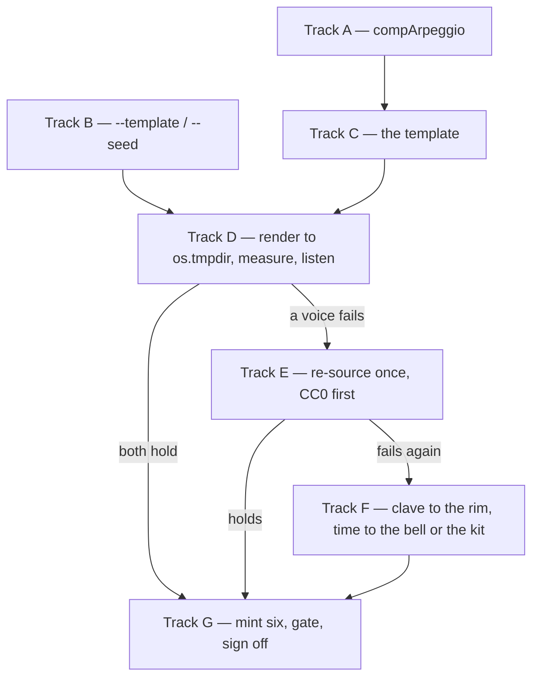

# Tech spec — Epic 5: Son montuno, and the claves finally get heard

PRD: [../prd/epic-5-son-montuno.md](../prd/epic-5-son-montuno.md) ·
Roadmap: [../roadmap.md](../roadmap.md) ·
Epic 1's contract: [epic-1-a-feel-can-carry-more-than-two-modes.md](epic-1-a-feel-can-carry-more-than-two-modes.md)

## Approach

The plan is shaped by one ordering constraint and one chicken-and-egg. The
constraint is the PRD's state diagram: nothing enters `catalogue.json`, no uuid
is issued and no mp3 is committed until both new voices have been heard. The
chicken-and-egg is R11: they may only be heard *under a rendered loop of this
template*, so the template must play before it can be judged — which is the
problem feature-24's Epic 1 solved with an audition rig, and the same answer,
extended by one flag pair.

Most of the mechanism this epic first proposed is no longer this epic's work.
Epic 1 adopted the fixed figure into its own contract as
`FeelTemplate.figures?: FixedFigure[]` (its C7), so the two-bar clave, the
timekeeping figure, the placement suppression and the all-sixteen-bars rule
arrive already built and already tested. What is left in the shared generator is
`compArpeggio`: one optional field on `FeelTemplate`, one branch in the comp
block, and one rule — the comp step at position `i` of the template's own comp
figure sounds the single tone `voicing[(i + pass) % voicing.length]`. Epic 1's
C8 is what lets this epic append that field without reopening the frozen
`patterns` contract, and son montuno is the roadmap's wave 3, so `types.ts` and
the comp emission are this epic's alone while it runs. Everything else it does
is a template, an audition and a mint.

One tone per step is not free, and the price is paid in Wave 1 rather than
discovered in Wave 2. Three registry-wide assertions in `events.test.ts`
describe a comp as a stack of voices — the `COMP_VOICE_DROP` ladder, the
`compSpreadSec` span and the top-voice shape — and each of them expects more
than one event per `bar:step` group, so all three fail the moment any template
declares the flag. Teaching them the arpeggio is Step A3, and it is Track A's
because Track C does not own that file.

The verdict picks the tail. Both voices hold and the epic mints. One fails and
one re-sourcing round runs. One fails twice and the substitution runs — and the
substitution is kept to one file, because R13a and R13c are the reason the style
ships whatever the pack turns out to hold.

## Architecture

### The four moving parts

| Part | Where | What changes |
| :-- | :-- | :-- |
| the montuno comp | `types.ts`, `events.ts`, `events.test.ts` | `FeelTemplate.compArpeggio`, one branch inside the comp block, and three registry-wide comp assertions taught the arpeggio |
| the rig | `cli.ts` | `--template <id> --seed <n>`, so an unminted template can be rendered |
| the style | `templates/son-montuno.ts` | tempo, swing, flavours, kit, gains, pans, `patterns`, `figures`, density |
| the pack | `samples/**` | nothing, unless a voice fails its audition |

The fixed figure is **not** in that table. It is Epic 1's C7, landed in its
Track B (`assertFigures`) and Track E (the emission), and this epic only
declares against it.

### The order, and what makes it possible



Every path reaches Track G, which is the point of the substitution. Nothing
before Track G writes a byte under `scripts/grooves/catalogue.json`,
`public/grooves/`, `src/features/daily-groove/data/` or `grooves.lock.json`.

### What Epic 1's list shape gave, and what it cost

Epic 1 took this epic's proposal and replaced the named slots
`{ clave?, timekeeper? }` with a list, because `{ clave?, timekeeper? }` cannot
hold the two tom entries Epic 3 needs. Its C7 records both sides of that trade,
and this spec is bound by it.

**What survives.** The clave is still declared on the template rather than in
`PLACEMENTS`, so R13a is still an edit to one file — `figures[0].voice`, one
word — and `placement.rim` is still suppressed by the mechanism rather than by a
second edit in `events.ts`. Tracks A and C are still separable, because the
template does not have to reach into a shared table to declare its own figure.

**What is gone, and it is this epic's R8.** With named slots, "exactly one of
the claves and the rim sounds the clave figure and the other is absent entirely"
was a property of the type: one slot, one `voice`, no way to name two. Over a
list it is a thing a template could get wrong — `figures` may hold a `claves`
entry *and* a `rim` entry, and `assertFigures` will accept both, because it
validates a figure and not a style's intent. So R8 becomes **an assertion**, in
two halves, and Step C3 is the whole of it:

- on the declaration: the template's `figures` name at most one of `claves` and
  `rim`, and the one they name is in `voices`;
- on the rendered output: at every seed, one of the two appears and the other
  appears in no event at all.

One further gap is worth naming because it is general rather than this style's.
Epic 1's `assertFigures` rejects `snare`, empty bars, out-of-range steps and a
tom in the variation bar; it does **not** reject a list that names the same
voice twice. Two figures on one voice would silently interleave into one
unreadable line. Step C3 asserts against it registry-wide rather than reaching
into Epic 1's `patterns.ts`, which C8 reserves.

### The montuno comp is a rule, not a step list

The comp block emits `voicing.length` events per comp step — every tone of the
bar's voicing, spread by `compSpreadSec`. That is a strum, and a syncopated step
list only makes it a *syncopated strum*: R5 rules that out in as many words
("rather than the block chords `COMP_PATTERNS` carries"). Epic 1 froze
`patterns`' eight keys as complete because three epics read that block at once,
so per-step tone selection cannot go there.

`compArpeggio` is therefore a per-template flag on `FeelTemplate` beside
`patterns`, which Epic 1's C8 declares append-only. When it is set, the comp
step at position `i` of `compSteps` emits exactly one event in bar `b` of pass
`p`, carrying `compFigure[b][(i + p) % compFigure[b].length]` — the bar's
voicing ascending, indexed by the step's own position and turned one place per
pass. `+ p` is the phase term `accentedVelocity` already rotates `COMP_ACCENTS`
by, so the tone and the accent turn together instead of drifting against each
other, and the figure stays readable off the template: a reader can say what the
comp plays without running the generator. C5 has the whole rule.

Three consequences follow, and all three are load-bearing. It is eight events a
bar instead of twenty-four to thirty-two, because a voicing is three or four
tones. The per-voice `COMP_VOICE_DROP` ladder and the `compSpreadSec` strum
spread both become no-ops, since there is only one event per step to apply
them to —
which is what breaks the three registry-wide assertions Step A3 amends. And the
rotation only sounds a whole chord inside a bar when the comp figure has at
least as many steps as the voicing has tones, which is a constraint on the
template's own pool rather than on the branch: Step C4 asserts it.

### What feature-24 actually left behind

The dependency is checkable, and half of it is already in the tree. Feature-24's
run is **held mid-Epic-1**: its Track D landed the two percussion voices, and
its Tracks F/G/H — the ride audition and its verdict — have not run.

| Needed | State |
| :-- | :-- |
| `claves`, `cowbell` in `VOICE_NAMES`, `VELOCITIES`, `FILL_DURATIONS` | **landed** |
| both declared in `samples/pack.json`, one layer, two round-robin alternates, explicit `nominalVelocity` | **landed** |
| both covered by `samples/provenance.json`, licence CC0 | **landed** |
| `packSha256` in step, `grooves:verify` clean | **landed** |
| `rideBell` sourced and declared in the pack | **not landed, and not expected to be** |

That last row decides R13c. `scripts/grooves/samples/` holds no `rideBell`
directory, `pack.json` declares no `rideBell` block, and `provenance.json`
carries no row for one — the voice exists in `VOICE_NAMES` and nowhere else.
Feature-24's Track G would commit it and its Track H would remove it from the
vocabulary altogether, and neither has run. **So the plan treats the ride bell
as unavailable and the kit as the live fallback**: R13c already sanctions both,
and Step C2's *plays only voices the pack can sound* assertion is what turns
that from a guess into a check. A cowbell that fails twice puts the pulse on the
hat, and the bell only enters if feature-24 has shipped it by then.

### The audition question is about sequence, and the numbers already exist

`samples/README.md` § *VCSL recorded no round robins for the claves or the
cowbell* records that both voices were auditioned as raw samples in feature-24
**and liked** — the sourcing is settled, the sequence is not. `roundRobin` in
`voices.ts` returns `start + pass + played`, so with two alternates the choice
strictly alternates hit to hit inside a pass, and the `+ pass` term flips the
parity at every pass boundary. A rendered groove at `passes: 4` is sixteen bars
— four passes — so **one file is the whole audition**, and it contains both the
within-pass alternation and the phase flip between passes.

Three findings are inherited, and R12's report answers all three in words:

- the cowbell's two alternates are **3.96 dB apart against a 3.06 dB**
  weak-to-strong span, so a weak hit can land 0.9 dB above a strong one;
- `claves_mf_3`'s strongest partial is at **5.6 kHz** where `claves_mf`'s is at
  **2.3 kHz** — one player or two is an ear question;
- the legacy claves are a drier, brighter capture than the `_Mid` bongos, so a
  style playing both wants a room-mismatch check. **This epic is that style.**

### This epic ships its grooves unheard, and that is the design

Every per-groove listening sign-off in feature-25 has moved out of its epic and
into the **feature-wide listening pass** — `roadmap.md` § *Wave 5 — the
feature-wide listening pass* — which runs once, by hand, after Epic 6, plays all
thirty new grooves grouped by style, and records a verdict per groove in the
listener's own words. So this epic mints six grooves, gates them, documents them
and hands them on **without anyone having heard one of them end to end**. Every
track here runs to completion without waiting on a person, and the build of the
whole feature runs end to end the same way.

The trade was made deliberately, and it is a trade about comparison rather than
about time. Whether the bongos read as the lead, whether the clave sits right
against the tumbao, whether a montuno is worth playing a saxophone over — those
are answered far better with the reggae, the second line, the boom bap and the
bossa playing back to back in one sitting than against the memory of a style
heard a week earlier. Five styles judged together is a different, better
question than five styles judged one at a time.

What it accepts is real and worth naming. Six mp3s, six catalogue entries, six
uuids and a `grooves.lock.json` diff are committed on the gate's word alone, and
the gate cannot hear. If the feature-wide pass rejects a groove, the fix is a
value in `templates/son-montuno.ts` or the rotation in Track A's branch, and the
six re-render — a change that is cheap in machine time and costs a `git revert`
of committed audio in tree terms. The epic's job is to make that fix cheap to
aim: Step G4 writes the brief that tells the listener what to listen for in
these six, and Steps C5, D2 and G2 leave the measured numbers behind it.

**One listening step does not defer, and it is the only one in the build.** Step
D3 is a pass/fail on two *samples*, not a verdict on a groove — see the decision
log's Cycle 4 for why it stayed.

## Contracts

Frozen before any track starts. C1–C4 are inherited and quoted so a track need
not read two specs; C5–C8 are this epic's.

### C1 — what this epic inherits, and how it is checked

`npm run test:gen` green, with two suites carrying feature-24's half of the
dependency: `scripts/grooves/samples/pack.test.ts` § *the claves and the cowbell
are stocked, sourced and levelled* and `scripts/grooves/voiceContract.test.ts`.
If either is red, this epic does not start; the missing piece is feature-24's.
`rideBell`'s absence is **not** a blocker — see the table above.

Epic 1's half is checked the same way: `npm run test:gen` green with
`scripts/grooves/patterns.test.ts` § *a fixed figure is a list of bars* (its
Step B6) and `events.test.ts` § *a fixed figure plays every bar and takes over
its placement* (its Step E8) both passing. Those two are the mechanism this
epic declares against, and neither is this epic's to edit.

### C2 — Epic 1's `patterns` block, as this epic reads it

Frozen by Epic 1's C1: eight keys, complete, no key may be added and no key's
shape may change. This epic reads **three** of the eight, and the names below
are Epic 1's final ones, not its PRD's:

```ts
patterns?: {
  bass?: number[][]                                  // flat step lists, 0…15
  comp?: number[][]
  bongos?: { high: number[]; low: number[] }[]
}
```

Drawn on the streams the shared pools are drawn on — `bass` and `comp` on
`rhythmRng` at exactly the positions `BASS_PATTERNS` and `COMP_PATTERNS` are
drawn today, `bongos` on `BONGO_LABEL` — with no draw inserted, removed or
reordered. **A declared pool replaces, never extends.**

Two keys this epic deliberately does not use. `hatClosed` is available and
son montuno keeps the shared pool — the hat is not the interesting voice here,
and leaving it drawn keeps one thing in the template unspecified by hand. `kit`
is the eighth key, drawn on Epic 1's new `KIT_LABEL`, and son montuno keeps
`placement.snare`: a montuno's backbeat is ordinary, and declaring `kit` would
open a stream this style has no use for.

### C3 — the fixed figure, as Epic 1 froze it

Epic 1's C7, quoted for the parts this epic depends on. **Not this epic's to
change** — C8 reserves `FixedFigure` to Epic 1.

```ts
// scripts/grooves/types.ts
export type FixedFigure = {
  voice: VoiceName
  bars: number[][]      // one step list per bar of the cycle, on the sixteenth grid
}

// FeelTemplate:
figures?: FixedFigure[]
```

- Bar `b` of a pass plays `bars[b % bars.length]`, resolved onto the template's
  subdivision by `gridSteps`. Two entries give a two-bar clave.
- Emitted in **every** bar, fill and variation bars included — a clave does not
  stop for a fill.
- Emitted only when `template.voices.includes(figure.voice)`.
- Duration `FILL_DURATIONS[voice]`, velocity `velocityFor(voice, sixteenth)`.
  No accent map, no per-figure velocities.
- **Zero RNG draws.** Nothing opened, nothing inserted into an existing stream.
- A figure naming `rim` or `hatOpen` **suppresses that voice's placement line**
  for the template. A figure naming `snare` is rejected at build time.
- A figure's voice is **not** required to be in `BACKING_VOICES`, which is what
  makes a `claves` figure legal.
- Empty `bars`, all-empty `bars`, a step outside `0…15` or a non-integer step
  throws at build time naming the template id and the voice.
- **`assertFigures` does not reject two figures naming one voice.** Step C3
  covers that gap from the outside.

### C4 — the 2-3 son clave and the timekeeper, as two list entries

```ts
figures: [
  { voice: 'claves',  bars: [[4, 8], [0, 6, 12]] },
  { voice: 'cowbell', bars: [[0, 4, 8, 12]] },
]
```

The 2-side is beats 2 and 3; the 3-side is beat 1, the "and" of 2 and beat 4.
Bars 0 and 2 of every pass take the 2-side, bars 1 and 3 the 3-side, so a pass
holds two whole claves. `gridSteps` at subdivision 16 leaves both untouched; at
8 they become `[2, 4]` and `[0, 3, 6]`, still the son clave. The clave is
`figures[0]` and the timekeeper `figures[1]`, by convention rather than by the
type — which is exactly what R8 now has to assert.

The `musician` settles the timekeeper's figure. The value above is quarters, and
the even count is deliberate: with two alternates and four hits a bar, one bell
holds beats 1 and 3 and the other 2 and 4 for a whole pass, which reads as two
bells trading rather than as one bell wobbling.

### C5 — `compArpeggio`, this epic's own field

`compArpeggio` is **not** part of Epic 1's frozen `patterns` block, and that is
deliberate on both sides. Epic 1's D5 declined to freeze a rotation rule nothing
there can hear; its C8 makes `FeelTemplate` *beside* `patterns` append-only and
names four conditions under which a later epic adds a field without reopening
anything. All four hold, so this is **settled, not proposed**:

| C8's condition | Why it holds |
| :-- | :-- |
| optional, and every existing template omits it | ten registered templates by the time this epic runs — the six existing, the bossa and the three wave-2 styles — and none declares it |
| adds, removes and reorders no RNG draw | it changes what a comp step emits, not how many draws happen; `compSpreadSec` is still drawn from `rhythmRng` in the same position and simply goes unused |
| changes no shared pool's length and no entry of `MUSIC_LABEL`'s draw order | it reads `compSteps` and the bar's voicing, both already computed |
| no other epic in flight reads it | son montuno is the roadmap's wave 3 and runs alone; the three wave-2 styles have landed, and none of them touches `types.ts` or the comp block |

```ts
// scripts/grooves/types.ts, on FeelTemplate
compArpeggio?: boolean
```

**The rotation, as arithmetic.** `compFigure[b]` is bar `b`'s played voicing,
ascending, three or four tones — four, minus the root where the bass already
sounds it. `compIndex` maps each member of `compSteps` to its position `i` in
that list. For bar `b` of pass `p`, the comp step at position `i` emits exactly
one event:

```
midi       = compFigure[b][(i + p) % compFigure[b].length]
velocity   = accentedVelocity('comp', step, sixteenth, p)   // COMP_ACCENTS, as today
offsetSec  = 0                                              // no compSpreadSec
duration   = 4 sixteenths                                   // unchanged
```

An eight-step figure over a four-tone voicing therefore sounds tones
`0,1,2,3,0,1,2,3` in pass 0 and `1,2,3,0,1,2,3,0` in pass 1. `+ p` is the same
phase term `accentedVelocity` rotates `COMP_ACCENTS` by, so the tone and the
accent turn together. There is no `COMP_VOICE_DROP` ladder, because a ladder
needs a stack.

**One constraint follows, and it binds the template rather than the branch.**
Three registry-wide assertions in `events.test.ts` require a bar's comp to sound
the *whole* voicing — *plays the harmony its metadata names*, *repeats the
harmony every four bars, so bar 5 carries bar 1's chord* and *voices the whole
loop rootless where the bass has the root*. The rotation sounds all of it
exactly when the figure has at least as many steps as the voicing has tones, and
a voicing is at most four. So **every member of a `compArpeggio` template's
`patterns.comp` holds at least four steps.** Step C4 asserts it; C4's pools hold
seven and eight.

When the field is absent or false, the comp block emits exactly what it emits
today — every tone of the voicing, the `COMP_VOICE_DROP` ladder, the
`compSpreadSec` offsets.

### C6 — the off-catalogue render

Extends feature-24's C6, which already ships `--only`, `--out` and `--pack`.

```
npm run grooves -- --template <id> --seed <n> [--seed <n>]… --out <dir> [--pack <dir>]
```

- Synthesises a catalogue of one spec per `--seed`:
  `{ id: 'audition-<template>-<seed>', uuid: '', template, seed }`, in the order
  the flags appear.
- Forces `heardIn: {}`, for the reason `--only` does: `heardInFailures` throws
  for every scale a shortened run does not render.
- **Requires `--out`.** Without it a one-groove run would overwrite the real
  manifest and lock. `--only` still has that hole open today (feature-24's
  report names it); `--template` does not inherit it.
- Rejects `--template` together with `--only`, an unknown template id (listing
  the known ids), and a `--seed` that is not a non-negative integer. Every
  rejection exits non-zero, names the offender, and writes nothing.
- `parseArgs` and `optionsFrom` stay pure and exported, so no test spawns a
  process.

This is deliberately not Epic 1's `grooves:add --template <id>`. That flag mints
— catalogue entry, uuid, committed mp3 — which is precisely what R11 forbids
before the audition. Track G uses it; Track D cannot.

### C7 — the bongos are level with the kit, as a number

AC6 asks for "the same order of magnitude as the kick and snare", which needs a
figure to be testable:

```
| template.gain[bongoHigh] − max(gain[kick], gain[snare]) | ≤ 3   // dB
| template.gain[bongoLow]  − max(gain[kick], gain[snare]) | ≤ 3
```

3 dB is the smallest step that reads as a level change on a transient, and
`bright-straight` — the one template that plays bongos today — sits them 4 to
6 dB *below* its kick and snare, so the rule is strictly a promotion rather than
a restatement.

### C8 — what a re-sourced voice brings

Unchanged from feature-24's C7, and it is the standard Track E is held to:
layers ascending by `maxVelocity` with the top layer at exactly `1`, at least
**two** files per layer, an explicit `nominalVelocity` derived by the method in
`samples/README.md` § *How the nominals were derived* (the top layer's midpoint
scaled by the ratio of this layer's **first-listed alternate's** peak to the top
layer's), and one `provenance.json` row per committed file with `file`,
`source`, `sourceFile`, `url`, `licence` ∈ `{CC0, CC-BY-4.0}` and
`modifications` — plus a non-empty `attribution` on every non-CC0 row and its
distinct string in the top-level `attributions` array.

### C9 — what this style takes from the shared registry

`templates/index.test.ts` asserts swing values and `lo-hi` tempo strings unique
across the registry. Epic 1's C9 records every reservation and leaves
son montuno unreserved, because it is the roadmap's wave 3 and can read the
registry rather than guess:

| Held or reserved | Swing | Tempo |
| :-- | :-- | :-- |
| the six existing | `0.02, 0.06, 0.18, 0.28, 0.44, 0.64` | six ranges |
| `bossa-nova` | `(0, 0.02)` | inside 120–140 |
| `reggae-one-drop` | 0.03–0.05 | 70–80 |
| `second-line` | 0.20–0.26 | inside 84–98 |
| `boom-bap` | 0.30–0.40 | inside 85–95, both ends ≤ 92 |
| **`son-montuno`** | **0.08** — the one clear gap, between 0.06 and 0.18 | **`[96, 110]`**, above every reservation and below the bossa |

Starting values, and Step C1 re-reads the registry before trusting them.

## Tracks

### Track A — The montuno comp

- **Goal** — a template can declare an arpeggiated comp, the suite describes
  what an arpeggiated comp is, and the committed grooves build byte-identically.
- **Owns** — `scripts/grooves/types.ts` (the `compArpeggio` field),
  `scripts/grooves/events.ts` (the comp block),
  `scripts/grooves/events.test.ts`
- **Role** — `musician`. C5 settles the rotation; whether it reads as a montuno
  rather than as a broken chord is heard at the feature-wide listening pass
  (`roadmap.md` § *Wave 5 — the feature-wide listening pass*), after this epic
  has closed, and what comes back lands in this branch then.
- **Depends on** — Epic 1 merged, C5
- **Parallel with** — Track B
- **Done when** — `npm run test:gen` green with `ARPEGGIO_FIXTURE` in all three
  registry-wide comp assertions,
  `git diff --stat scripts/grooves/events.fixture.json` empty, and it names
  `son-montuno` nowhere.

### Track B — An off-catalogue render

- **Goal** — `npm run grooves --` renders a template that has no catalogue
  entry, into a scratch directory, and refuses to render one anywhere else.
- **Owns** — `scripts/grooves/cli.ts`, `scripts/grooves/cli.test.ts`
- **Role** — `musician`
- **Depends on** — C6
- **Parallel with** — Track A. Its tests name `shuffle`, a template that already
  exists, so it needs nothing from A or C.
- **Done when** — the flag tests pass and a no-flag invocation still produces
  today's `GenerateOptions`, key for key.

### Track C — The template

- **Goal** — `son-montuno` is registered, plays the kit plus two percussion
  voices with the bongos in front, carries the clave on exactly one voice, and
  declares a density band measured from what it plays.
- **Owns** — `scripts/grooves/templates/son-montuno.ts`,
  `scripts/grooves/templates/index.ts`,
  `scripts/grooves/templates/index.test.ts`, and
  `docs/music.md`'s **`son-montuno` feel-table row only** — see Step C6 for why
  that row cannot wait for Track H
- **Role** — `musician`
- **Depends on** — A (`compArpeggio` must exist before a template may declare
  it), C2, C3, C4, C5, C7, C9
- **Parallel with** — none
- **Done when** — `npm run test:gen` green, including
  `events.test.ts` § *every template's density band admits its own grooves* over
  120 seeds and `docs.test.ts`'s registry-derived feel-table assertion, and the
  fixture still green with its JSON untouched.

### Track D — The audition and the verdict

- **Goal** — the claves and the cowbell heard under a rendered loop of this
  template, with the two inherited measurements re-taken, and a **usable /
  unusable** verdict per voice — before anything is minted. It judges the two
  samples, not the six grooves; the grooves are judged at the feature-wide
  listening pass.
- **Owns** — nothing committed. It writes the epic's report and files under
  `os.tmpdir()` only.
- **Role** — `musician`
- **Depends on** — A, B, C
- **Parallel with** — none
- **Done when** — the report states, per voice, whether the round robin holds up
  over four bars, and `git status` is clean.

### Track E — Re-source a failed voice

Runs **only** if Track D fails a voice. One round, per R13.

- **Goal** — the failed voice replaced with a licence-cleared, provenanced,
  levelled one, and heard again under the same loop.
- **Owns** — `scripts/grooves/samples/<voice>/**`, that voice's block in
  `scripts/grooves/samples/pack.json`, its rows in
  `scripts/grooves/samples/provenance.json`, any new
  `scripts/grooves/samples/LICENSE-*.txt`,
  `scripts/grooves/samples/README.md`,
  `scripts/grooves/samples/pack.test.ts`,
  `scripts/grooves/grooves.lock.json` (`packSha256` only)
- **Role** — `musician`
- **Depends on** — D's verdict
- **Parallel with** — none
- **Done when** — `npm run test:gen` green, `npm run grooves:verify` clean, the
  lock diff is `packSha256` alone, `node scripts/grooves/rerender-check.ts`
  reports every committed groove matching, and the re-audition has a verdict.

### Track F — The substitution

Runs **only** if a voice fails twice.

- **Goal** — the clave figure on the rim and/or the timekeeping on the kit (or
  the ride bell, if feature-24 has shipped it), with the finding recorded, and
  six grooves still reachable.
- **Owns** — `scripts/grooves/templates/son-montuno.ts`,
  `scripts/grooves/templates/index.test.ts`, `specs/new-styles.md`, and
  `docs/music.md`'s `son-montuno` feel-table row — a substitution changes which
  voice the *Pulse* column names, and Epic 1's docs assertion checks the row
  exists rather than what is in it, so nothing here goes red on its own
- **Role** — `musician`. What a rim clave's gain, velocity and lean have to be to
  sit against the tumbao is a musical decision, and so is where the pulse goes
  if the bell is unavailable.
- **Depends on** — E's re-audition verdict
- **Parallel with** — none. It re-opens two files Track C owned in wave 2, which
  is safe because the waves are disjoint.
- **Done when** — AC7, AC10a and AC10b hold and `npm run test:gen` is green.

### Track G — Mint, gate and hand forward

- **Goal** — six `son-montuno` grooves in the catalogue, every one through all
  seven gate checks, and a brief handed to the feature-wide listening pass
  saying what to listen for in these six and where their mp3s are.
- **Owns** — `scripts/grooves/catalogue.json`, `public/grooves/*.mp3`,
  `src/features/daily-groove/data/grooves.generated.ts`,
  `src/features/daily-groove/data/grooves.generated.test.ts`,
  `scripts/grooves/catalogue.test.ts` (the dominance ratio only — see Step G2),
  `scripts/grooves/grooves.lock.json`,
  `scripts/grooves/events.fixture.json`
- **Role** — `musician`
- **Depends on** — D's verdict, and F if it ran
- **Parallel with** — Track H
- **Done when** — `npm run test:all` green (it owns files in both tiers)
  **except `src/features/daily-groove/data/pastPuzzles.test.ts`**, which arrives
  red from Epic 1's mint and which this track's own mint moves again without
  repairing — see *Assumptions* —
  `npm run grooves:verify` clean, and the report carries Step G4's brief: the
  six uuids, their mp3 paths, and what the feature-wide pass should listen for
  in this style. No track in this epic waits on a person after Step D3.

### Track H — The voice list

- **Goal** — no sentence in `docs/music.md` still implies the claves and the
  cowbell are sourced but unplayed.
- **Owns** — `docs/music.md`, **except** the `son-montuno` feel-table row, which
  is Track C's (Step C6) because Epic 1's registry-derived docs assertion cannot
  wait four waves for it.
- **Role** — `musician`. `scripts/tiers.test.ts` routes `docs/music.md` to the
  generator tier, and it is the musical reference rather than an engineering
  one.
- **Depends on** — D's verdict, and F if it ran, for which voices the prose
  names
- **Parallel with** — Track G. It states no groove count — Epic 1's Step H4
  removed the last one — so it does not wait on the mint.
- **Done when** — AC14 holds and `npm run test:gen` is green.

## Execution waves

- **Wave 1 (parallel):** Track A, Track B
- **Wave 2:** Track C — a template may not declare `compArpeggio` before the
  field exists
- **Wave 3:** Track D — needs the flag (A), the rig (B) and a template to
  render (C)
- **Wave 4:** Track E — only if D fails a voice
- **Wave 5:** Track F — only if E's re-audition fails the same voice
- **Wave 6 (parallel):** Track G, Track H

Waves 5 and 6 re-open `templates/son-montuno.ts` and `templates/index.test.ts`
(Track C's) and `events.fixture.json` (which no earlier wave of this epic
owns). That is safe because no two tracks in the same wave name the same path.

**`docs/music.md` is split by row rather than by wave**, and that is forced
rather than chosen: Epic 1's Step H2 made `docs.test.ts` assert the feel table
carries a row for every `allTemplates()` id, so registering the template in
Wave 2 turns the generator tier red until the row exists. Track C owns that one
row (Step C6), Track F owns its voice cells if the substitution runs, and Track
H owns everything else in the file in Wave 6. Three waves, one file, no two in
the same wave.

## Implementation

### Track A — The montuno comp

#### Step A1 — the comp arpeggiates when the template asks it to

Covers: R5, AC5

- **Test first** — `scripts/grooves/events.test.ts`, new describe *an
  arpeggiated comp sounds one tone at a time — R5, AC5*, and a module-level
  `ARPEGGIO_FIXTURE`: `bright-straight` with `compArpeggio: true` and
  `patterns: { comp: [[2, 3, 6, 7, 10, 11, 14, 15]] }` at subdivision 16. Step
  A3 reuses it, so it is a const rather than a local. The oracle is the same
  template with the flag stripped: un-flagged, every comp step sounds all of
  `compFigure[b]` ascending, which is how a test reads the bar's voicing without
  reaching into `events.ts`. Assert, over seeds 1–12:
  1. exactly one `comp` event per comp step per bar — eight a bar, not
     twenty-four to thirty-two;
  2. the event at comp-step position `i` of bar `b` in pass `p` carries
     `midi === voicing[b][(i + p) % voicing[b].length]`, with `voicing[b]` read
     off the un-flagged render. Written out for the fixture's eight-step figure
     over a four-tone voicing, that is tones `0,1,2,3,0,1,2,3` in pass 0 and
     `1,2,3,0,1,2,3,0` in pass 1;
  3. every bar sounds every tone of `voicing[b]` at least once, which is what
     the whole-chord assertions downstream depend on;
  4. the eight comp onsets of a bar are distinct and strictly increasing, so
     nothing is stacked inside one step — a strum spread would put two onsets
     inside one;
  5. every `midi` is still below `COMP_REGISTER_CEILING` and inside 48…84, so
     the existing register assertions and `gate.ts`'s `checkPitch` both still
     hold.
  Run it: fails with three or four events per step.
- **Implement** — `scripts/grooves/types.ts`: `compArpeggio?: boolean` on
  `FeelTemplate`. `scripts/grooves/events.ts`: the branch in the comp block per
  C5. The `compSpreadSec` draw stays exactly where it is, outside the branch and
  unconditional — moving it would move `rhythmRng` for every template.
- **Green when** — every assertion passes and `npm run test:gen` is green.
- **Refactor** — the two branches share the step loop and the one
  `accentedVelocity` call; the arpeggio branch adds no second copy of either.

#### Step A2 — the flag is inert everywhere it is not set

Covers: R15, AC10

- **Test first** — same describe. `ARPEGGIO_FIXTURE` with the flag stripped
  emits `voicing.length` events per comp step with the
  `COMP_VOICE_DROP` ladder and the `compSpreadSec` offsets intact, and
  `serialiseGroove` on a real `bright-straight` catalogue spec is identical
  before and after. Then the standing guard:
  `eventsFixture.test.ts` § *deep-equals what the generator builds today* over
  the whole committed catalogue — Epic 1's Step A1 removed `FIXTURE_FEELS` and
  made `fixtureSpecs` return every spec, so this now pins **every** groove
  including `shuffle` and the six bossas.
- **Implement** — nothing beyond A1, if A1 was written correctly. If the fixture
  moves, the branch is reading something it should not.
- **Green when** — `npm run test:gen` green **and**
  `git diff --stat scripts/grooves/events.fixture.json` empty. That combination
  is R15's event-level proof: this epic's only shared-generator edit moved
  nothing that was rendered, and it costs no mp3 re-encoding to show it.
- **Refactor** — none.

#### Step A3 — three registry-wide comp assertions learn the arpeggio

Covers: R5, AC5

`events.test.ts` describes a comp as a stack of voices in three assertions that
run over `allTemplates()`, and every one of them reads a `bar:step` group and
expects more than one event in it:

| Assertion | What it expects of one comp strike |
| :-- | :-- |
| *leaves kick, snare and bass reading from metric position — R12, AC11* | more than one velocity, following `1 − 0.12 × (n − 1 − i)` |
| *spreads a chord like a hand rather than stamping it — R4, AC5* | at least two onsets, a span in `(0, 0.015]`, ascending by pitch |
| *shapes a chord so the top voice sings and the inner voices sit under it — R5, AC6* | more than one velocity, the top pitch the loudest |

An arpeggiated strike is one event, so all three fail the moment a template
declares the flag. Amending them belongs to Wave 1 and not to Wave 2: Track C
does not own `events.test.ts`, so a Wave-2 registration would leave
`npm run test:gen` red on a file no wave-2 track may open — the same trap Step
C6 keeps out of `docs/music.md`, in a second file.

- **Test first** — the three assertions themselves, amended in place. Each runs
  over `[...allTemplates(), ARPEGGIO_FIXTURE]` instead of `allTemplates()`, so
  the arpeggio path is exercised in Wave 1 by a template that is not in the
  registry and names nothing of this epic. Each keeps its subject for a stacked
  comp and gains the arpeggio's contract for a template whose `compArpeggio` is
  set: exactly one event per `bar:step` group, one velocity in it, that velocity
  equal to `accentedVelocity('comp', step, sixteenth, pass)` with no ladder
  applied, and no span to measure. Run it: the fixture fails all three — the
  ladder assertion on `shape.length` being 1, the spread assertion on
  `chord.length` being 1, the top-voice assertion on a one-element velocity set.
- **Implement** — nothing in `events.ts`. The three amendments are the work.
- **Green when** — `npm run test:gen` green, and the ten registered templates
  still take the stacked path: the ladder, the span and the top-voice shape are
  asserted for them exactly as they are today.
- **Refactor** — the three read the flag through one local predicate, so a
  fourth assertion that grows the same shape has one place to reach for.

### Track B — An off-catalogue render

#### Step B1 — `--template` and `--seed` name a groove the catalogue does not hold

Covers: R11, AC8

- **Test first** — `scripts/grooves/cli.test.ts`, new describe *an off-catalogue
  render — R11*. `parseArgs(['--template', 'shuffle', '--seed', '7', '--seed',
  '9', '--out', dir])` returns `{ template: 'shuffle', seeds: [7, 9], outDir:
  dir, only: [], manifestOnly: false }`. `optionsFrom` on it returns a
  `catalogue` of two specs — `audition-shuffle-7` and `audition-shuffle-9`, in
  that order, `uuid: ''` — plus `heardIn: {}` and `outDir`/`manifestPath`/
  `lockPath` all under `dir`. Run it: fails with `unknown argument:
  --template`.
- **Implement** — `scripts/grooves/cli.ts`: `CliArgs` gains
  `template?: string` and `seeds: number[]`; two cases in `parseArgs`; a branch
  in `optionsFrom` per C6.
- **Green when** — both assertions pass and the existing *no flags produces
  today's options* assertion is untouched.
- **Refactor** — none.

#### Step B2 — it refuses to write anywhere real

Covers: R11, AC8

- **Test first** — same describe. Four rejections, each naming the offender and
  writing nothing: `--template` without `--out`; `--template` with `--only`;
  `--template no-such-feel` (the message lists the known ids); `--seed abc`.
  After each, assert the committed manifest's hash and `grooves.lock.json`'s
  mtime are unchanged, the way the existing `--out` assertions do. Run it: fails
  — the first case happily builds a real-manifest path.
- **Implement** — the four guards in `parseArgs`/`optionsFrom`, all before any
  render.
- **Green when** — four throws, nothing written. This closes the hole
  feature-24's report left standing for `--only`, for `--template` only; the
  `--only` hole stays open because closing it would change `optionsFrom`'s
  frozen shape.
- **Refactor** — none.

#### Step B3 — an audition renders end to end into a temp directory

Covers: R11, AC8

- **Test first** — same file. With `mkdtempSync` and the placeholder pack,
  `generate(optionsFrom(parseArgs(['--template', 'shuffle', '--seed', '7',
  '--out', tmp, '--pack', packDir])))` writes `audition-shuffle-7.mp3`,
  `grooves.generated.ts` and `grooves.lock.json` under `tmp`, and leaves
  `public/grooves/`, the committed manifest and the committed lock byte-
  identical. Run it: fails before B1 lands.
- **Green when** — the three scratch files exist and the three committed paths
  are unchanged.
- **Refactor** — none.

### Track C — The template

#### Step C1 — the feel is declared, and it is nobody else's feel

Covers: R1, R2, AC1, AC2

- **Test first** — `scripts/grooves/templates/index.test.ts`. Assert
  `son-montuno`'s exact `flavours` list, in a new assertion of its own — Epic 1's
  Step C9 froze `pairs each flavour with a feel that suits it` byte-identical
  around the original six and pinned each of them to exactly two entries, so a
  seventh or eighth list is not appended to it. Then assert son montuno's list
  holds two to four distinct entries, every one in `FLAVOURS`. Epic 1's Step C6
  replaced `TEMPLATE_COUNT` with `allTemplates().length` in the unique-id,
  unique-swing, unique-tempo-range and unique-mix assertions, so those cover AC1
  the moment the template is registered. Run it: fails with
  `templateById: unknown template "son-montuno"`.
- **Implement** — `scripts/grooves/templates/son-montuno.ts` and one line in
  `templates/index.ts`. **Read the registry before trusting C9's numbers** —
  four other styles land before this one and one may have moved. Starting
  values, for the `musician` to settle:

  | Field | Starting value | Why |
  | :-- | :-- | :-- |
  | `tempoRange` | `[96, 110]` | montuno territory, and above every range Epic 1's C9 reserves |
  | `subdivision` | `16` | the montuno comp is a sixteenth figure; the clave and the tumbao survive the finer grid unchanged |
  | `swing` | `0.08` | straight, but `index.test.ts` requires `swing > 0`; the one gap Epic 1's C9 leaves, between `0.06` and `0.18` |
  | `flavours` | `['mixolydian', 'dorian', 'phrygian-dominant']` | `new-styles.md`'s proposal; three of the twelve, overlap now allowed |
  | `passes` | `4` | four passes is sixteen bars, four turns of the clave — and what makes the audition one file |

- **Green when** — `npm run test:gen` green.
- **Refactor** — none.

#### Step C2 — the kit: two percussion voices, no rim, bongos in front

Covers: R6, R7, AC6

- **Test first** — same file, new describe *son montuno's kit — R6, R7*.
  Assert: `voices` contains `claves`, `cowbell`, `bongoHigh`, `bongoLow`, and
  not `rim`, `ride` or `rideBell`; C7's 3 dB rule for both bongo voices; the
  existing *declares a gain and a pan for every voice it plays* covers the rest.
  Then one assertion that binds **every** registered template, and is what makes
  R13c's route checkable rather than hopeful: *plays only voices the pack can
  sound* — `loadPack(DEFAULT_PACK_DIR)` and, for every voice of every template,
  `pack.get(voice, { velocity: 1, index: 0 })` is not null. Run it: the kit
  assertions fail with an unknown template; the pack assertion passes today,
  and it is what would reject a `rideBell` timekeeper against a pack that
  declares none.
- **Implement** — the `voices`, `gain`, `pan` and `humanize.lean` blocks.
  Starting gains: `kick -11`, `snare -9`, `bongoHigh -11`, `bongoLow -10`,
  `hatClosed -12`, `claves -12`, `cowbell -13`, `bass -2`, `comp -5`. The
  bongos sit inside 3 dB of the loudest kit voice, which is the promotion R6
  asks for; `bright-straight` has them 4–6 dB below.
- **Green when** — every assertion passes.
- **Refactor** — none.

#### Step C3 — one voice carries the clave, and the list says so

Covers: R3, R8, AC3, AC7

This is the step Epic 1's list shape created. Under the named slots this epic
first proposed, the type made it impossible to name two voices; over
`FixedFigure[]` it is a template's mistake to make, so it is asserted here.

- **Test first** — same file, new describe *one voice carries the clave — R8,
  AC7*. Four assertions, the first two on the declaration and the last two on
  rendered output at seeds 1–12.
  1. `son-montuno.figures` names at most one of `claves` and `rim`, the one it
     names is in `voices`, and the other is in neither `figures` nor `voices`.
  2. Registry-wide: no template's `figures` names one voice twice — the gap
     Epic 1's `assertFigures` leaves open, asserted from outside `patterns.ts`
     because C8 reserves that file.
  3. The clave voice sounds `[4, 8]` in bars 0 and 2 of every pass and
     `[0, 6, 12]` in bars 1 and 3, in **all sixteen** bars including the fill,
     identically at every seed — fixed, not drawn. Its two bars differ from each
     other, which is the assertion that separates a clave from a one-bar figure
     repeated.
  4. The other of `claves` and `rim` appears in **no event at all**, and the
     cowbell sounds `[0, 4, 8, 12]` in every bar.
  Run it: 1, 3 and 4 fail with no `figures` on the template; 2 passes today and
  is a guard, not a red.
- **Implement** — the `figures` list of C4 in `templates/son-montuno.ts`.
  Nothing in `events.ts`: the emission and the `placement.rim` suppression are
  Epic 1's Step E8.
- **Green when** — all four pass. Assertion 4 is the half of R8 that no type
  now carries, and it is the one Step F1 must keep green after the
  substitution.
- **Refactor** — assertions 1 and 4 read `['claves', 'rim']` from one local
  constant, so F1 changes a declaration and not a test's structure.

#### Step C4 — the tumbao and the montuno come from the template's own pools

Covers: R4, R5, R6, AC4, AC5, AC6

- **Test first** — same file, new describe *the tumbao and the montuno are its
  own — R4, R5, R6*. On the template: `patterns.bass` is non-empty and **no
  member contains step 0**; every member contains 6 (the "and" of 2) and 12
  (beat 4); `patterns.comp` is non-empty and no member equals any member of
  `COMP_PATTERNS`; `compArpeggio` is `true`; `patterns.bongos` is non-empty and
  no member equals any member of `BONGO_PATTERNS`. On rendered output over seeds
  1–12: no `bass` event on step 0 of any bar; at least one `bass` event on the
  gridded "and" of 2 in every bar; the bongo steps are a member of the
  template's own pool and of no member of `BONGO_PATTERNS`; **every member of
  `patterns.comp` holds at least four steps**, which is C5's constraint on an
  arpeggiated template — a shorter figure could not sound a four-tone voicing
  inside one bar, and the three whole-chord assertions the registry already runs
  would fail for this template alone; and every bar of every rendered pass
  sounds every tone of its chord's played voicing. Run it: fails with
  no `patterns` block.
- **Implement** — the `patterns` block. Starting values, for the `musician`:
  `bass: [[6, 12], [6, 12, 14], [6, 10, 12]]`,
  `comp: [[2, 3, 6, 7, 10, 11, 14, 15], [2, 3, 6, 7, 10, 14, 15]]`,
  `bongos: [{ high: [3, 6, 7, 11, 14, 15], low: [0, 4, 8, 12] }, …]`.
  The bass pool wants no note on step 0, and the generator already models the
  tumbao's defining move for free: `bassSteps.forEach` gives the figure's
  **first** step the chord root, so a pool starting at step 6 makes the root
  arrive early, which is what anticipation is.
- **Green when** — every assertion passes over 12 seeds.
- **Refactor** — none.

#### Step C5 — the density band is measured, then declared

Covers: R10, AC12

- **Test first** — no new test.
  `scripts/grooves/events.test.ts` § *every template's density band admits its
  own grooves* iterates `allTemplates()` over 120 seeds and is already the
  assertion. Declare a deliberately narrow band first and run it: it fails
  naming the measured minimum and maximum per bar.
- **Implement** — read the failure's two numbers and set
  `density: { minPerBar, maxPerBar }` with margin at both ends. Do **not** widen
  it after a mint rejection — a density rejection in Step G1 is a musical
  problem with the template and comes back here.
- **Green when** — the suite reports the template's 120-seed spread inside its
  own band. Two percussion voices plus the kit press on this band, and
  `compArpeggio` pulls the other way by exactly
  `compSteps.length × (voicing.length − 1)` events a bar — sixteen to
  twenty-four with C4's eight-step figure, since a voicing is three or four
  tones — which is the whole reason the band is set after Step A1 rather than
  before it.
- **Refactor** — none.

#### Step C6 — the feel table gains its row, in the same wave as the template

Covers: R17, AC14

Epic 1's Step H2 made `docs.test.ts` assert that the feel table has a row naming
**every** `allTemplates()` id, parsed from the leading backticked cell. That
assertion is registry-derived, and it is in the generator tier — so it turns red
the instant `templates/index.ts` gains a line, and it stays red until the row
exists. A `docs/music.md` step in Wave 6 would leave `npm run test:gen` failing
for four waves, which is why this row is Track C's and only the rest of the
document is Track H's.

- **Test first** — no new test. Register the template in Step C1 and run
  `npm run test:gen`: `docs.test.ts` fails naming `son-montuno` as a feel with no
  row. That is Epic 1's assertion doing exactly what its Step H2 says it is for
  — "the assertion that makes Epics 2–5 update this document or fail".
- **Implement** — one row in `docs/music.md`'s feel table: BPM, subdivision,
  swing, flavours, passes, density band, and the clave's voice in the *Pulse*
  column. Values come from `templates/son-montuno.ts`, so this step lands after
  C5 sets the band.
- **Green when** — `npm run test:gen` green, and the row's values match the
  template exactly. Nothing else in `docs/music.md` is touched here; the
  voice-list correction R17 also asks for is Step H1.
- **Refactor** — none.

### Track D — The audition and the verdict

#### Step D1 — the loop is rendered before anything is minted

Covers: R11, AC8

- **Test first** — no unit test; this is the demo path, and its assertion is
  `git status`. Run
  `npm run grooves -- --template son-montuno --seed <a> --seed <b> --seed <c> --out "$SCRATCH"`
  for three seeds chosen so the three renders between them draw the busiest and
  the sparsest member of the bongo and comp pools — one seed is not an audition
  of a pool. Then assert: `git status` clean; no entry named `son-montuno` in
  `scripts/grooves/catalogue.json`; no uuid minted; nothing under
  `public/grooves/`.
- **Implement** — nothing. The rig is Track B's.
- **Green when** — three mp3s under `$SCRATCH`, each sixteen bars, and a clean
  tree. Report the three seeds and which pool members each drew.
- **Refactor** — none.

#### Step D2 — the two numbers, measured before anyone listens

Covers: R12, AC8

- **Test first** — no unit test; a measurement, recorded in the report so the
  verdict rests on evidence and not only on ears. Using `level.ts`'s
  `rmsDbfs`/`voiceLevels` over the rendered per-voice tracks, report per voice:
  the level difference between consecutive hits of that voice inside one pass,
  against the voice's own weak-to-strong span in `VELOCITIES` — 2.9 dB for the
  claves, 3.1 dB for the cowbell. The baselines to beat are
  `samples/README.md`'s committed figures: the cowbell's alternates 3.96 dB
  apart, `claves_mf_3` at 5.6 kHz against `claves_mf` at 2.3 kHz.
- **Implement** — nothing.
- **Green when** — both numbers are in the report, with the prediction stated:
  the alternation is phase-locked to the bar when the figure has an even number
  of hits per bar and rotates when it is odd, so C4's four-hit cowbell puts one
  bell on beats 1 and 3 and the other on 2 and 4 for a whole pass, and the
  clave's five hits over two bars rotate.
- **Refactor** — none.

#### Step D3 — the one listen: are these two samples usable at all?

Covers: R12, AC8

**This is the single human step remaining anywhere in feature-25's build.**
Everything else in this epic, and in the five others, runs to completion without
stopping for a person; the per-groove verdicts are collected once, at the
feature-wide listening pass, after Epic 6. This step is the exception, and it is
kept as short as a step can be: **one sitting, one file, both voices at once,
before the mint.**

It is a check on two *assets*, not a verdict on a groove. The question is
whether a bare wood transient is usable at all under this style — which is not a
matter of taste, is not improved by hearing the other four styles beside it, and
if it were deferred would be answered only after six grooves had been minted on
the failed sample, re-rendering all six. The decision log's Cycle 4 records the
call and its cost.

- **Test first** — none. A person plays **one** of Step D1's three renders in
  full — sixteen bars, both voices sounding throughout — and the report answers,
  per voice, in their own words:
  1. does the round robin break up the repetition, or does a bare wood transient
     machine-gun across four bars?
  2. is the cowbell's 0.9 dB overshoot audible on a timekeeping part, or below
     the transient JND as `samples/README.md` predicts?
  The other two renders exist for a borderline call and are played only then.
  R11 is why this is the rendered loop and not the raw files: a sample
  auditioned solo is the mistake feature-13 made with its ride, and
  machine-gunning is audible only in a loop.
- **Implement** — nothing.
- **Green when** — a verdict per voice, **usable** or **unusable**, and the route
  it selects: both usable → Wave 6; either unusable → Wave 4.
- **The bar is unusable, not imperfect.** Two of the inherited findings —
  `claves_mf_3` at 5.6 kHz against `claves_mf` at 2.3 kHz reading as one player
  or two, and the drier legacy claves sitting in the same room as the `_Mid`
  bongos — are questions of taste that the feature-wide pass answers better,
  with four other styles to compare against. Note them and pass them into Step
  G4's brief; they fail a voice here only if the sample is unusable under this
  style, not if it is merely odd.
- **Refactor** — none.

#### Step D4 — the cheap fix before the expensive one

Covers: R13

- **Test first** — none. Before spending R13's one re-sourcing round, try the
  change that costs one line of `figures`: re-phase the timekeeper so the two
  bells land consistently against the bar (an even hit count per bar), or move
  the clave's denser side off the position where the brightness alternation is
  most exposed. Re-render through Step D1 and re-hear through D3.
- **Implement** — nothing committed. If the figure change fixes it, the change
  itself lands in Track C's file in Wave 6, not here.
- **Green when** — either the voice now **holds** and R13's budget is unspent,
  or it does not and Wave 4 runs. This is not a substitute for R13: a sample
  that is the wrong sound is still the wrong sound at every phase.
- **Refactor** — none.

### Track E — Re-source a failed voice

#### Step E1 — licence before audio

Covers: R13, R14, AC9

- **Test first** — none yet; a shortlist, recorded in the report. CC0 first,
  CC-BY-4.0 accepted, **nothing else** — share-alike is not CC-BY, and
  feature-24 rejected Salamander (CC-BY-SA 3.0) and Tchackpoum (CC-BY-SA 4.0)
  unheard on exactly this rule. No file is prepared until its licence clears.
- **Implement** — nothing committed.
- **Green when** — at least one candidate with a licence in `{CC0, CC-BY-4.0}`,
  a URL and a named source file. If none exists, the voice has failed its second
  audition by default and Wave 5 runs — R13a and R13c both accept that route.
- **Refactor** — none.

#### Step E2 — prepared by the pack's own recipe, and heard in a scratch pack first

Covers: R13, R14, AC9

- **Test first** — `scripts/grooves/samples/pack.test.ts`'s claves-and-cowbell
  describe already asserts C8's shape: at least one layer, two or more
  round-robin alternates per layer, an explicit `nominalVelocity` on every
  layer, layers ascending and topping out at exactly 1, and every layer inside
  `MAX_LAYER_GAIN` at the voice's strongest hit. Prepare the candidate into a
  **throwaway pack directory under `os.tmpdir()`** — copy `samples/`, drop the
  new files in, patch a copy of `pack.json` — and re-run Step D1 with
  `--pack "$SCRATCH_PACK"`. Nothing under `scripts/grooves/samples/` moves yet,
  which is what keeps `pack.test.ts` green throughout: it asserts every audio
  file on disk is declared *and* provenanced, so a staged candidate inside the
  repo would fail it.
- **Implement** — the FLACs, prepared by `samples/README.md`'s recipe: capped,
  faded, downmixed to mono, 44.1 kHz 16-bit FLAC, not normalised.
- **Green when** — the scratch render is audible and the shape assertions pass
  against the patched declaration.
- **Refactor** — none.

#### Step E3 — provenance, README and the lock in one commit as the audio

Covers: R14, AC9

- **Test first** — `pack.test.ts` § *every sample is CC0 and accounted for*
  (every file on disk provenanced, no row naming an absent file, non-empty
  source and origin, licence redistributable, `attribution` on every non-CC0
  row, the distinct strings in `attributions`, the licence text shipped) and
  § *the README documents the pack it ships beside* (voice mapping, library
  list, a levelling band per declared layer, a length cap per levelled voice).
  Move the files into `samples/<voice>/`, and run it: fails on the missing
  provenance rows and README rows.
- **Implement** — the files, the `pack.json` block, the `provenance.json` rows,
  any `LICENSE-*.txt`, and the four `samples/README.md` tables. Then
  `npm run notes` to refresh `packSha256`.
- **Green when** — `npm run test:gen` green, `npm run grooves:verify` clean, the
  `grooves.lock.json` diff is `packSha256` alone, and all 24 note mp3s are
  byte-identical. The audio, the declaration, the provenance, the README and the
  pack sha are one commit.
- **Refactor** — none.

#### Step E4 — re-sourcing re-renders nothing outside this template

Covers: R15, AC10

- **Test first** — `node scripts/grooves/rerender-check.ts` reports every
  committed groove matching, and `git status` shows no file under
  `public/grooves/` changed. No committed groove plays the claves or the
  cowbell, so no committed mp3 can move — this step is the proof, not the hope.
- **Implement** — nothing.
- **Green when** — all matching, and the only lock change is `packSha256`.
- **Refactor** — none.

#### Step E5 — heard again under the same loop

Covers: R13

- **Test first** — none. Re-run Steps D1, D2 and D3 against the committed pack.
  One round only: R13's budget is one re-sourcing, and R13a–R13c spend what is
  left.
- **Green when** — a second verdict per re-sourced voice. Holds → Wave 6.
  Fails → Wave 5.
- **Refactor** — none.

### Track F — The substitution

#### Step F1 — the clave moves to the rim

Covers: R13a, AC7, AC10a

Under the named slots this was one word. Over `FixedFigure[]` it is still one
file and still one word in the declaration — but the assertion that made R8 true
now has to be moved with it, which is why Track F owns `index.test.ts` too.

- **Test first** — Step C3's describe, amended. `figures` names `rim` and not
  `claves`; `rim` is in `voices`, `gain`, `pan`; `claves` is in none of them; the
  rim sounds the two-bar clave in every bar and **nothing on step 15** — Epic 1's
  C7 suppresses `placement.rim` for a template whose `figures` name the rim, so
  that assertion needs no new mechanism. Step C3's assertion 4 flips direction:
  it is now `claves` that must appear in no event. Run it: fails against the
  template as Track C left it.
- **Implement** — `templates/son-montuno.ts`: `figures[0].voice` becomes `rim`;
  `claves` out of `voices`/`gain`/`pan`/`humanize.lean`, `rim` in. The rim's
  gain, velocity and lean against the tumbao are the `musician`'s: a cross-stick
  is a quieter, drier transient than a clave, and `VELOCITIES.rim` tops out at
  0.55 against the claves' 0.7, so the gain has to come up rather than across.
- **Green when** — `npm run test:gen` green; exactly one of the claves and the
  rim appears in any rendered event and the other appears in none.
- **Refactor** — none. Step C3's local `['claves', 'rim']` constant is what
  keeps this to a declaration change.

#### Step F2 — the timekeeping part moves to the kit, or to the bell if there is one

Covers: R13c, AC10b

- **Test first** — same describe. Step C2's *plays only voices the pack can
  sound* assertion decides which case is legal, and **the expected case is the
  kit**: `scripts/grooves/samples/` holds no `rideBell` directory and
  `pack.json` declares no `rideBell` block, so the bell branch is unavailable
  unless feature-24's Track G has shipped it by the time this wave runs. Two
  cases:
  - **kit (expected)** — the `cowbell` entry leaves `figures` entirely,
    `cowbell` leaves `voices`/`gain`/`pan`, and the hat carries the pulse:
    `hatClosed`'s gain comes up and the report says by how much. R13c sanctions
    this outcome in as many words.
  - **ride bell (only if the pack declares it)** — the entry's `voice` becomes
    `rideBell`, which joins `voices`/`gain`/`pan`, and `cowbell` leaves them.
  Run it: fails against Track C's template.
- **Implement** — `templates/son-montuno.ts` only.
- **Green when** — `npm run test:gen` green, and the substitution is **stated in
  the report in words** rather than left to be inferred from the template, which
  is what AC10b asks for — including, if the kit took it, that the bell was
  unavailable rather than rejected.
- **Refactor** — none.

#### Step F3 — the failure is on the record

Covers: R13b, AC10a

- **Test first** — none. `specs/new-styles.md` gains a failed-candidate entry
  the way feature-13's ride has: what was heard in both auditions, the two
  measured numbers from Step D2, what was tried in Step D4, and what was
  re-sourced in Track E.
- **Implement** — the entry, and a correction. That file's § *The claves and the
  cowbell arrive heard once, in isolation* currently says "budget nothing for
  re-sourcing", which contradicts R13. This step is where that sentence stops
  being a forecast and becomes a finding; if the PRD is amended first so R13's
  round is removed, this step still runs — the entry records a voice that failed
  its one audition rather than its second, and R13a/R13c are reached one wave
  earlier. Either way the voice **stays** in the pack and in `VOICE_NAMES`,
  played by nothing, so the next style that wants it inherits the finding
  rather than repeating the audition.
- **Green when** — a reader of `specs/new-styles.md` can tell what was heard
  without re-rendering anything, and `docs.test.ts` is still green: Epic 1's
  Step H2 taught it to assert that file contains `shipped` and matches neither
  `/exactly two flavours/` nor `/disjoint across the set/`, and a
  failed-candidate entry touches none of the three.
- **Refactor** — none.

### Track G — Mint, gate and sign off

#### Step G1 — six grooves, all seven checks

Covers: R9, AC11, AC12

- **Test first** — `scripts/grooves/catalogue.test.ts` § *draws grooves from
  every template* turns red the moment `son-montuno` is registered with no
  grooves behind it, and § *puts grooves behind every mode its templates offer*
  turns red for its three flavours. Those are the red. Run
  `npm run grooves:add 6 --template son-montuno` (Epic 1's C4 flag) to make them
  green.
- **Implement** — the mint. Every rejection is logged with the check and the
  measured value. A density rejection goes back to Step C5 rather than widening
  the band; `selectSeeds` already refuses a duplicate root-and-flavour and a
  duplicate scale-and-progression, so `catalogue.test.ts`'s uniqueness
  assertions cannot be broken by the mint.
- **Green when** — six `son-montuno` entries in `catalogue.json`, six mp3s under
  `public/grooves/`, and `npm run test:gen` green including all seven gate
  checks per groove via `catalogue-gate.test.ts`, which runs `gateCandidate`
  over every catalogue entry.
- **The mint takes the catalogue to sixty, and `pastPuzzles.test.ts` fails on
  the new length.** It has been red since Epic 1's mint; this one reassigns
  every recorded day once more and moves the `3 × GROOVES.length` arithmetic
  with it. Expected, and not this step's to fix or regenerate. Record the new
  catalogue length in the epic's report and move on.
- **Refactor** — none.

#### Step G2 — the manifest grows by six, and nothing else moves

Covers: R15, AC10

- **Test first** — `src/features/daily-groove/data/grooves.generated.test.ts`
  § *covers all N catalogued grooves* holds a literal that Epic 1's Step G3
  moved to 36 and each style epic has moved since; it fails with `expected
  length <N+6> to be <N>`. Update the literal and the test's name.
  § *lets no mode dominate the answers* stays a ratio —
  `Math.max(...n) <= Math.min(...n) * 5` — the literal 5× Epic 1 set in both
  copies, this one and `scripts/grooves/catalogue.test.ts`. This epic reads that
  guard rather than redesigning it, but **runs it rather than assuming it**:
  this is the feature's last mint and the sixty-groove case. If son montuno's
  three flavours push the spread past 5×, the number moves in **both** copies
  together — they are one guard in two tiers, and a copy left behind is a guard
  that disagrees with itself — with the measured per-mode counts in this epic's
  report saying what the spread actually was. § *the answers feature-9 must not
  move* pins eighteen grooves and must stay green untouched — that is R15 at the
  answer level.
- **Implement** — the literal in *covers all N catalogued grooves*, and, only if
  the measured spread demands it, one new ratio in both copies of *lets no mode
  dominate the answers*.
- **Green when** — `npm run test:all` green but for `pastPuzzles.test.ts`, whose
  failure Step G1's mint caused and which no epic in this feature repairs;
  `npm run grooves:verify` clean;
  `git status` shows every mp3 outside the six unchanged;
  `node scripts/grooves/rerender-check.ts` reports every pre-existing groove
  matching; the `grooves.lock.json` diff is the six new grooves and nothing it
  did not already carry.
- **Refactor** — none.

#### Step G3 — the byte-identity pin takes the six

Covers: R15, AC10

- **Test first** — `eventsFixture.test.ts` § *deep-equals what the generator
  builds today* and the key-count assertion Epic 1's Step A2 added both turn red
  once six `son-montuno` specs are in the catalogue and not in the pin. That is
  the red.
- **Implement** — `node scripts/grooves/eventsFixture.ts --write`.
- **Green when** — the suite is green and the `events.fixture.json` diff **adds
  only `son-montuno:<seed>` keys** and changes no existing key. An existing key
  that moved means Step A1's branch leaked, and the fix is in Track A.
- **Refactor** — none.

#### Step G4 — the brief for the feature-wide listening pass

Covers: R16, AC13 — **discharged at** `roadmap.md` § *Wave 5 — the feature-wide
listening pass*

The per-groove sign-off does not happen here. It happens once, for all thirty
new grooves, after Epic 6, grouped by style so the five can be judged against
each other. What this step produces is the brief that pass reads when it reaches
son montuno's six: no verdict is collected, and no track waits on one.

- **Test first** — none, and that is still the point: *nothing here can hear*.
  The gate ran in Step G1 and it blocks — six grooves through all seven checks
  or no mint — but **a gate pass is not a sign-off**, and this step does not
  pretend otherwise. It writes down what a person cannot be told by a number.
- **Implement** — the mint's own bookkeeping, and then, in the epic's report,
  the brief. Four things, and no more:
  1. **Where.** The six uuids, their `public/grooves/*.mp3` paths, their seeds,
     and the root, flavour and tempo of each, so the pass can play them in one
     run without opening the catalogue.
  2. **What to listen for in *these* six**, which is this style's question and
     nobody else's: does the arpeggiated comp read as a **montuno**, or as a
     syncopated strum — the exact thing C5's rotation rule was chosen to avoid,
     and the one thing in this epic no assertion can distinguish; and does the
     **2-3 clave sit where a player expects** against the tumbao, with the 2-side
     in bars 0 and 2 and the 3-side in bars 1 and 3.
  3. **What is already known.** Step D3's two usable/unusable verdicts, the two
     measurements from Step D2, the taste questions D3 deliberately passed
     forward (the two claves takes' brightness difference, and the legacy claves
     against the `_Mid` bongos), and any substitution Track F made, in words.
  4. **What a rejection would move**, so a proposed change carries its cost: the
     bongo and clave gains and `humanize.lean` in `templates/son-montuno.ts`;
     the figures in its `patterns` block; `swing` and `tempoRange`; the rotation
     in Track A's `events.ts` branch. Every one of those re-renders all six
     grooves and moves `events.fixture.json`; a gain or a `lean` change re-renders
     nothing outside this template.
- **Green when** — the report carries the four items above, the pass can find
  and play the six from it alone, and `git status` is clean apart from the mint.
- **Refactor** — none.

### Track H — The voice list

#### Step H1 — no sentence still implies the claves and the cowbell are unplayed

Covers: R17, AC14

- **Test first** — `scripts/grooves/docs.test.ts`, which Epic 1's Step H1 taught
  to read `music.md`. Assert it does not match `/twelve voices/` and that its
  voice section names `claves` and `cowbell`. Run it: fails on the heading.
- **Implement** — three edits, none of them the feel-table row.
  § *The twelve voices* is the voice-list section R17 names: it lists twelve
  while `VOICE_NAMES` holds fifteen, and omits `rideBell`, `claves` and
  `cowbell` — correct the heading and the list, and say which feels play the two
  this epic sounds. § *Rhythm*'s drawn-pool table gains a line noting the claves
  and the cowbell are **not** drawn — they are fixed figures — so a reader is not
  sent looking for a pool that does not exist. And the feel section's closing
  paragraph reads "`bright-straight` is the only feel with bongos, and the only
  one besides `straight-funk` with a rim"; the first half is now false.
  **Do not re-add the routing row.** Epic 1's Step H3 already put a `figures`
  row in *Where to change what* and named `KIT_LABEL` in the *What must never
  change* bullet; this step confirms both survived and adds nothing.
- **Green when** — no sentence in `docs/music.md` states or implies that the
  claves or the cowbell are sourced-but-unplayed. `rideBell` stays described as
  unplayed unless Step F2 moved the pulse to it.
- **Refactor** — none.

## Integration and verification

Order matters here more than usual, because the whole plan is an ordering claim.

1. **Preflight (C1).** `npm run test:gen` green, with feature-24's two suites
   and Epic 1's two mechanism suites all passing. Record whether `pack.json`
   declares `rideBell`; that decides Step F2's route before anyone needs it, and
   today the answer is no.
2. **Wave 1–2 gate.** `npm run test:gen` green — which now includes
   `docs.test.ts`'s registry-derived feel-table assertion, so Step C6's row is
   part of this gate rather than of step 5, and the three comp assertions Step
   A3 amended, which is why registering an arpeggiated template in Wave 2 leaves
   the tier green — and
   `git diff --stat scripts/grooves/events.fixture.json` empty. That pair is
   R15's cheap proof, and after Epic 1's Step A1 it covers **every** committed
   groove rather than twenty-four of them.
3. **Wave 3, the demo path.**
   `npm run grooves -- --template son-montuno --seed <a> --seed <b> --seed <c> --out "$SCRATCH"`,
   then `git status` — clean. Play **one** of the three mp3s in full, once, and
   answer Step D3's two questions; the other two are for a borderline call.
   Nothing is in `catalogue.json`, no uuid is issued, no mp3 is committed.
   **This is the only point in the whole feature's build that waits on a
   person**, and Waves 4–6 are chosen by what it hears.
4. **Waves 4–5, only if needed.** `npm run grooves:verify` clean and
   `rerender-check.ts` all-matching after each, so a re-sourcing or a
   substitution cannot silently move a committed groove.
5. **Wave 6.** `npm run grooves:add 6 --template son-montuno`, then
   `npm run test:all`, `npm run lint`, `npm run build` (which runs
   `grooves:verify` on `prebuild`), and `rerender-check.ts`. All green **except
   `src/features/daily-groove/data/pastPuzzles.test.ts`** under `npm run
   test:all` — the one red this epic may leave standing, red before it started
   and redder after its mint. Every other failure stops the epic, and the
   fixture is not to be regenerated to clear it.
6. **The player's path.** Open the app, reach one of the six by uuid, and play
   it: the bongos lead, the clave carries, the bass anticipates, and the rim is
   silent — or, under R13a, the rim carries and the claves are silent. Never
   both.
7. **The report.** Per-voice usable/unusable verdicts (D3), the two measurements
   (D2), the substitution if any in words (F2), the brief for the feature-wide
   listening pass (G4), whether the 5× dominance ratio survived sixty
   grooves, with the measured per-mode counts (G2), and the catalogue length
   `pastPuzzles.test.ts` is now failing against. No per-groove verdict — that
   is collected at `roadmap.md` § *Wave 5 — the feature-wide listening pass*,
   after Epic 6.

## Requirement coverage

| Requirement | Steps |
| :-- | :-- |
| R1 | C1 |
| R2 | C1 |
| R3 | C3 |
| R4 | C4 |
| R5 | A1, A3, C4 |
| R6 | C2, C4 |
| R7 | C2, C3 |
| R8 | C3 |
| R9 | G1 |
| R10 | C5 |
| R11 | B1, B2, B3, D1 |
| R12 | D2, D3 — **stays in this epic.** It is a usable/unusable check on two samples before the mint, not a per-groove verdict, so it does not defer |
| R13 | D4, E1, E2, E5 |
| R13a | F1 |
| R13b | F3 |
| R13c | F2 |
| R14 | E1, E2, E3 |
| R15 | A2, E4, G2, G3 |
| R16 | G4 writes the brief; **the sign-off itself is discharged at** `roadmap.md` § *Wave 5 — the feature-wide listening pass*, after Epic 6. Not unmet in this epic — deliberately deferred, and covered by the two together |
| R17 | C6, H1 |
| AC1 | C1 |
| AC2 | C1 |
| AC3 | C3 |
| AC4 | C4 |
| AC5 | A1, A3, C4 |
| AC6 | C2, C4 |
| AC7 | C3, F1 |
| AC8 | B1, B2, B3, D1, D2, D3 — before any groove is minted, as the criterion says, and the one human step the build keeps |
| AC9 | E1, E2, E3 |
| AC10 | A2, E4, G2, G3 |
| AC10a | F1, F3 |
| AC10b | F2 |
| AC11 | G1 |
| AC12 | C5, G1 |
| AC13 | G4 writes the brief and the six mp3 paths; **the per-groove verdict in a person's own words is recorded at** `roadmap.md` § *Wave 5 — the feature-wide listening pass*. A `/verify-epic` run on Epic 5 alone should read this as **discharged at the feature-wide listening pass**, not as not done |
| AC14 | C6, H1 |

R5 gained a step without changing its meaning: A1 is the branch, A3 is the
suite learning what the branch produces, and C4 is the template's own figure
under C5's four-step constraint.

**R16 and AC13 are covered, not skipped, and the two halves are named so a
verifier can find them.** This epic's half is Step G4's brief — the six uuids and
mp3 paths, the two style-specific questions, what is already known, and what a
rejection would move. The other half is the verdict itself, recorded per groove
in the listener's own words at `roadmap.md` § *Wave 5 — the feature-wide
listening pass*, which runs once after Epic 6 and discharges the same
requirement for all five styles at once. Epic 5 closing with no per-groove
verdict in its report is the plan working, not a gap in it. R12 is the one
listening requirement that does **not** work that way, and its row says so.

R8, R13a and R13c are the three an earlier reconcile cycle moved, and all three
now land on assertions rather than on a type: R8 on Step C3's four assertions, R13a
on Step F1 keeping C3's assertion 4 green in the other direction, R13c on Step
F2's two cases with Step C2's pack check deciding which is legal.

## Assumptions

- **Epic 1 is merged before this epic starts.** Its C1, C4, C7, C8 and C9 are
  quoted above rather than read from its PRD, so a rename inside `patterns` is
  no longer a live risk. What remains a risk is `FixedFigure` itself: C8
  reserves it to Epic 1, so if Epic 1 changes it after merging, Step C3 and
  Step F1 are affected and nothing else here is.
- **`specs/new-styles.md` and the PRD disagree about the re-sourcing budget,
  and the plan reads correctly either way.** That file — edited during this run —
  says "budget nothing for re-sourcing" because the samples were liked in
  isolation; R13 budgets one round. If the PRD keeps R13, Track E is a
  conditional wave spent only on failure. If the PRD drops it, Track E is deleted
  and a failing voice goes straight from Step D4 to Track F: R13a and R13c are
  unaffected, because neither depends on a re-sourcing having been attempted.
  Only Step F3's wording ("what was heard across both auditions") narrows to
  one, and that step says so.
- **The ride bell is expected to be unavailable.** R13c's first substitute has
  no samples, no `pack.json` block and no provenance today, and feature-24's
  held Epic 1 could go either way on it. Step F2's expected case is the kit.
- **`BACKING_VOICES` is untouched, and its `claves`/`cowbell` assertion stays
  exactly as feature-24 wrote it.** Epic 1's C7 states that a figure's voice is
  deliberately not checked against that array, and cites
  `events.test.ts` § *lets the ride onto the backing track, and nothing else
  new* as the assertion that keeps `claves` and `cowbell` out of it. That
  assertion stays green and unedited: what changes is only that its message
  ("played by no template") is now stale prose, and prose in a test name is not
  something this epic edits in a file it does not own.
- **Son montuno keeps the shared hat pool and `placement.snare`.** Two of Epic
  1's eight `patterns` keys are available and unused, which is a choice rather
  than an omission — `kit` in particular would open `KIT_LABEL` for a style whose
  backbeat is ordinary.
- **The six new grooves may render scales `heard-in.json` does not carry.**
  `heardInFailures` only reports table entries that no groove renders, never the
  reverse, so nothing breaks and the reveal shows no track for those scales.
  Epic 1's Step D6 stops a one-template mint from emptying the table; adding
  entries is not in this epic's scope.
- **No `FILLS['son-montuno']` entry.** No requirement asks for one, so
  `DEFAULT_FILL` applies and `resolvePhrase` filters out its tom hits because
  the template declares no toms — leaving a kick-and-snare fill. The clave and
  the timekeeper play through it, per C3, so the fill bar is not bare. If the
  feature-wide listening pass says it collapses anyway, the entry is added
  then — after this epic has closed, with the six grooves re-rendering.
- **`src/features/daily-groove/data/pastPuzzles.test.ts` is red on arrival, red
  on close, and this epic neither repairs nor regenerates it.** It is the repo's
  record of what players are holding: `3 × GROOVES.length` days pinned to the
  grooves they resolved to at thirty. `selectGrooveForDate` indexes a seeded
  shuffle of the *whole* catalogue, so Epic 1's mint reassigned every recorded
  day, each style epic since has done it again, and Step G1's six — the
  feature's last mint — take it to sixty. Growth is the sanctioned cause and the
  test says so itself, citing feature-7 R6; regenerating the fixture from this
  tree is what it forbids in as many words, since that "makes it agree with
  whatever broke it". **Being the last mint does not make this epic the one that
  re-baselines it.** Epic 6's `ROTA_EPOCH` bump reassigns everything again, and
  `roadmap.md` § *Wave 5 — the feature-wide listening pass* can still pull a
  style's six grooves and change the length after that. The single re-baseline
  therefore runs after that pass has settled — `git archive` the last commit
  before Epic 1's mint into a scratch tree, resolve `3 × GROOVES.length` days
  against *that* catalogue, set `provenance.catalogueLength` to the final
  number — and `roadmap.md` § *One test is red for the whole feature, on
  purpose* is the authority for it.
- **The audition is one file per seed because `passes: 4` is sixteen bars.** If
  the `musician` sets `passes: 2`, the audition needs each file played twice
  through instead.

## Decision log

Settled architectural decisions. The sections above are the source of truth —
this records how they got there, and what each one cost. Append-only.

### Cycle 1 — 2026-09-05 — first draft

Two decisions were made to write an executable plan and both were raised as
questions rather than logged, because Epic 1's tech spec did not exist yet and
either could have been settled there. Both now are: see Cycle 2.

### Cycle 2 — 2026-09-05 — reconciled against Epic 1's tech spec

**D1. Fixed figures are `FeelTemplate.figures?: FixedFigure[]` — a list, not the
named slots this spec proposed.** This settles Cycle 1's Q1 as option A, in
Epic 1's shape rather than in this spec's. Epic 1 adopted the proposal into its
own C7 and replaced `{ clave?, timekeeper? }` with a list, because named slots
cannot hold the two tom entries Epic 3 needs. Its D4 records the same trade from
the other side.

What it keeps is the reason the shape was proposed: the clave stays on the
template rather than in `PLACEMENTS`, so R13a is one file and the
`placement.rim` suppression still falls out of the mechanism.

Cost, and it is this epic's alone: **R8 stops being a property of the type and
becomes an assertion.** `figures` can hold a `claves` entry and a `rim` entry
and `assertFigures` will accept both, so "exactly one of the claves and the rim
sounds the clave figure and the other is absent entirely" is now four assertions
in Step C3 — two on the declaration, two on rendered output — plus a
registry-wide guard against one voice named twice, which Epic 1's validator does
not cover. R13a's substitution is still one word in one declaration, but it now
also flips Step C3's assertion 4, so Track F owns `templates/index.test.ts`
alongside the template.

Changed: Architecture (*What Epic 1's list shape gave, and what it cost*
replaces *One voice carries the clave, by construction*), C3, C4, Track A
(reduced to `compArpeggio`; its Steps A1–A3, A5 and A6 were Epic 1's work and are
deleted), Track C (new Step C3, and C3–C5 renumbered), Track F (F1 rewritten, and
`index.test.ts` added to its ownership), the coverage table for R3, R7, R8 and
R15.

Cost of reversing to named slots: Epic 3 loses its tom accent, which is a
mechanism it has no substitute for. Not reversible in practice.

**D2. `compArpeggio` is this epic's, and it is settled rather than proposed.**
Epic 1 declined to freeze it (its D5) and gave the reason: `patterns`' keys must
be frozen and complete because three epics read that block in one wave, but
`FeelTemplate` beside it is append-only, and an arpeggio rotation rule is a
musical decision nothing in Epic 1 can hear. Its C8 states four conditions for
appending a field without reopening the contract; C5 above checks all four
against `compArpeggio`, and nothing in the roadmap's wave 2 touches `types.ts`
or the comp block, so the collision risk is zero.

Changed: C5 (new, replacing the Cycle-1 sketch inside C3), Track A's goal and
role, Step A1's grounding, Step C5's ordering note (the density band is measured
after the arpeggio exists, not before).

Cost of reversal: the comp emission block is rewritten and Track C's density
band re-measured — and if that happens after Track G, six grooves re-render and
the listening sign-off repeats. Cheap before Wave 6, expensive after. Cycle 1's
Q2 stays open for exactly that reason: it is the rotation rule that is unsettled,
not the field.

**D3. `docs/music.md`'s feel-table row is Track C's, not Track H's — the
document is split by row.** Found while reconciling, not chosen. Epic 1's Step
H2 made `docs.test.ts` assert the feel table carries a row for every
`allTemplates()` id, parsed from the leading backticked cell, and `docs.test.ts`
is generator-tier. So registering the template turns `npm run test:gen` red and
it stays red until the row exists. A documents track in Wave 6 would have left
the generator tier failing from Wave 2 to Wave 6 — and Track C's own
done-condition is that same command.

The alternatives were worse. Moving all of Track H to Wave 2 would have it write
prose about voices nobody has heard yet, which is what R17's "no sentence still
implies they are unplayed" needs the audition for. Excluding `docs.test.ts` from
Track C's done-condition would make "the generator tier is green" stop meaning
anything for four waves.

Changed: Track C's ownership and done-condition, new Step C6, Track H renamed
and reduced to one step, Track F's ownership, the waves note, the coverage table
for R17 and AC14, and step 2 of *Integration and verification*.
Cost of reversal: none in code — it is an ownership boundary inside one
document. What it costs is that `docs/music.md` is now named by three tracks in
three waves, which is the most any file in this spec is split across, and a
reader has to check the waves are disjoint. They are.

### Cycle 3 — 2026-09-06 — the rotation rule, and the dominance guard

**D4. The montuno comp is one tone per comp step, rotating by step index and
pass.** This settles Cycle 1's Q2 as option A. The comp block emits every tone
of the voicing at every comp step, so a syncopated step list on top of it is a
syncopated strum — which R5 rules out in as many words. An arpeggiated
template's comp step at position `i` therefore sounds
`compFigure[b][(i + p) % compFigure[b].length]`: bar `b`'s voicing ascending,
indexed by the step's own position, turned one place per pass. `+ p` is the
phase term `accentedVelocity` already rotates `COMP_ACCENTS` by, so the tone and
the accent turn together, and the figure stays readable off the template — a
reader can say what the comp plays without running the generator, which the
labelled-stream option would have cost, on top of a `docs/music.md` "what must
never change" entry from its first mint.

The field is not in Epic 1's frozen `patterns` block and was never proposed for
it. Epic 1's D5 declined to freeze a rotation rule nothing there can hear; its
C8 makes `FeelTemplate` beside `patterns` append-only and names four conditions
for appending a field, and C5 above checks all four. Son montuno is the
roadmap's wave 3 and runs alone, so `types.ts` and the comp emission in
`events.ts` are this epic's alone while it runs.

Two things it changed that were not visible from the question. **Three
registry-wide assertions in `events.test.ts` describe a comp as a stack of
voices** — the `COMP_VOICE_DROP` ladder, the `compSpreadSec` span and the
top-voice shape — and each expects more than one event per `bar:step` group, so
all three fail the moment a template declares the flag. Amending them is Step
A3, in Wave 1, because Track C does not own `events.test.ts` and a Wave-2
registration would otherwise redden the generator tier on a file no wave-2 track
may open. That is Cycle 2's D3 trap found in a second file, and it is handled
the same way — in the wave that owns the file rather than in the wave that
triggers it. **And the rotation binds the template's own comp pool**: three
further registry-wide assertions require every bar to sound the whole voicing,
which the rotation does exactly when a comp figure has at least as many steps as
the voicing has tones, so every member of `patterns.comp` holds at least four
steps.

Changed: the Approach, the moving-parts table, Architecture § *The montuno comp
is a rule, not a step list*, C5 (the arithmetic and the four-step constraint),
Track A's goal, role and done-condition, Steps A1 and A2, new Step A3, Step C4's
declaration assertions, Step C5's density arithmetic, step 2 of *Integration and
verification*, and the coverage table for R5 and AC5.

Cost of reversal: the comp emission block is rewritten, the three amended
assertions go back to describing a stack, and Track C's density band is
re-measured. Cheap before Wave 6; after it, six grooves re-render and the Step
G4 sign-off repeats.

**D5. The dominance guard stays a ratio at a literal 5×, in both copies, and
this epic reads it rather than setting it.** Epic 1 settled its own Q1 that way:
*lets no mode dominate the answers* keeps `Math.max(...n) <= Math.min(...n) * n`
and moves the number from 3 to 5, in `scripts/grooves/catalogue.test.ts` and in
`src/features/daily-groove/data/grooves.generated.test.ts` both, and those two
edits are Epic 1's. A ratio survived because it is the shape that scales with a
catalogue that keeps growing, and 5× clears the near-7-to-2 spread overlapping
flavour sets produce without clearing so much that the guard stops guarding.

What it changes here is a conditional and an ownership line. Step G2 no longer
asks what Epic 1 will settle; it runs the guard against the sixty-groove
catalogue this epic's mint produces, and if the spread has outrun 5× the number
moves in **both** copies together, with the measured counts in the report. Track
G therefore owns `scripts/grooves/catalogue.test.ts` for that one ratio
alongside the app-side manifest test; no other track in this epic opens either
file.

Changed: Step G2's *Test first* and *Implement*, Track G's ownership, and step 7
of *Integration and verification*.

Cost of reversal: one number in two files while the catalogue is sixty grooves,
and nothing re-renders — the guard reads the manifest rather than producing it.
It is expensive only in the other direction: tightening it back below the spread
a shipped catalogue already has fails the generator and the app tier at once,
with no mint able to fix it.

### Cycle 4 — 2026-09-06 — the listening moves to the end of the feature

**D6. The per-groove listening sign-off leaves this epic and is discharged at
the feature-wide listening pass.** Feature-25 no longer signs off style by style.
`roadmap.md` § *Wave 5 — the feature-wide listening pass* runs once, by hand,
after Epic 6, plays all thirty new grooves grouped by style with the five styles
back to back, records a verdict per groove in the listener's own words, and
hands back a list of proposed changes, each naming the template field to move
and the re-render cost. That pass discharges every epic's R16, this one
included.

The reason is comparison, not speed — though the build gains both. Whether the
bongos read as the lead, whether the clave sits right against the tumbao, whether
a montuno is worth playing a saxophone over: those are answered better with the
reggae, the second line, the boom bap and the bossa playing beside it in one
sitting than against the memory of a style heard a week earlier. The second
gain is that the six epics now run end to end without stopping for a person in
between, which was not possible while every epic ended on a human verdict.

Nothing about minting changes. The six grooves are still minted inside this
epic, the gate still runs and still blocks, and the mints across the feature
stay strictly serial. What moves is only the sign-off that follows them.

Changed: Architecture § *This epic ships its grooves unheard, and that is the
design* (new), Step D3 (rewritten — see D7), Step G4 (rewritten from *a person
plays all six in full* into the brief the feature-wide pass reads: where the six
are, what to listen for in this style, what is already known, and what a
rejection would move), Track A's role note, Track D's goal, Track G's name, goal
and done-condition, steps 3 and 7 of *Integration and verification*, the
`FILLS` assumption, and the coverage rows for R12, R16, AC8 and AC13 plus the
note under that table.

Cost, and it is a real one: six mp3s, six catalogue entries, six uuids and a
lock diff are committed on the gate's word alone, and the gate cannot hear. A
rejection at the feature-wide pass moves a value in `templates/son-montuno.ts`
or the rotation in Track A's branch and re-renders all six — cheap in machine
time, a `git revert` of committed audio in tree terms. Step G4's brief exists to
make that fix cheap to aim rather than cheap to avoid.

Cost of reversal: low, and it stays low. Putting the sign-off back is deleting
Step G4's brief and restoring a per-groove listen before the epic closes. What
cannot be recovered is the comparison — six grooves heard alone are heard alone,
and hearing them again later beside the other four styles is the feature-wide
pass by another name.

**D7. R12 does not defer. The sample-usability check stays inside this epic, and
it is the single human step remaining anywhere in feature-25's build.** R12 asks
whether a bare wood transient machine-guns across four bars. That is a pass/fail
on an *asset*, not a verdict on a groove, and it fails the two tests that make
deferral a good trade everywhere else:

- **It is not a matter of taste.** Machine-gunning is the artefact feature-9
  spent a whole feature undoing; it is heard, not preferred, and the answer does
  not change with what plays beside it.
- **Comparison does not improve it.** The other four styles do not play the
  claves or the cowbell, so a montuno's clave has nothing in the sitting to be
  judged against. The feature-wide pass would be answering it with strictly less
  than Track D has.

And the cost of getting it wrong is asymmetric. Deferring means minting six
grooves on a sample that may then have to be re-sourced under R13 — which
re-renders all six, moves `events.fixture.json`, and rewrites the provenance,
the README and `packSha256`, all of it after the catalogue entries and uuids are
committed. Auditioning first is the whole reason the PRD's state diagram puts
`Audition` before `Mint`, and R11 says it in as many words: nothing enters
`catalogue.json` until both voices have been heard. Deferring R12 would not
defer a verdict, it would delete the ordering the epic was built around.

So the check stays, and it is kept as short as a check can be: **one sitting,
one of Step D1's three renders, played in full once, both voices sounding
throughout, before the mint.** Two questions, not four — the round robin and the
cowbell's 0.9 dB overshoot. The two inherited findings that are questions of
taste rather than of usability (the two claves takes' 2.3 kHz / 5.6 kHz
brightness difference, and the drier legacy claves against the `_Mid` bongos)
are noted and passed into Step G4's brief instead of being answered here. The
bar is **unusable**, not imperfect. It is a rendered loop rather than the raw
files because R11 forbids the solo audition — the mistake feature-13 made with
its ride — and because machine-gunning is only audible over four bars.

Changed: Step D3 (rewritten and renamed, R16 dropped from its coverage), Track
D's goal, step 3 of *Integration and verification*, and the coverage rows for
R12 and AC8.

Cost of the other reading, had R12 deferred with the rest: one fully automated
build, paid for with a re-source that lands after the mint. That is six grooves
re-rendered, committed audio replaced, and a second pass through Tracks E and G
— to buy back a listen that takes one play of one sixteen-bar file.

Cost of reversing D7: none in code. It is one listen, and dropping it costs
exactly the re-source risk above.

### Cycle 5 — 2026-09-06 — the past-puzzles record is re-baselined once, at the end

**D8. `src/features/daily-groove/data/pastPuzzles.test.ts` is left red by this
epic too, and re-baselined once after the feature-wide listening pass.** It is
the repo's record of what players are already holding, and it survives no
catalogue growth: `selectGrooveForDate` indexes a seeded shuffle of the whole
catalogue, so every added groove reassigns every recorded day, and
`DAYS.length === 3 * GROOVES.length` moves with the length. Epic 1's mint turned
it red; Step G1 takes the catalogue to sixty and turns it redder.

This epic holds the feature's last mint, which makes it the natural candidate for
the repair — and it is the wrong one. Epic 6 bumps `ROTA_EPOCH` and reassigns
everything again, and `roadmap.md` § *Wave 5 — the feature-wide listening pass*
can still pull a style's six grooves, so a fixture captured at this epic's close
would be wrong twice over before the feature ships. Regenerating it from this
tree is forbidden outright by the test itself, because a record regenerated from
the tree that moved it agrees with whatever moved it — the one failure it exists
to catch. So the re-baseline happens once, after that pass has settled, from a
`git archive` of the last commit before Epic 1's mint.

Changed: an *Assumptions* bullet naming the file, the reason this epic is not the
one to fix it, and the procedure; Track G's *Done when*; Steps G1 and G2; and
items 5 and 7 of *Integration and verification*, where it is named as the one red
this epic may leave standing and the new catalogue length is added to the report.
No template, contract or rendered groove moves.

Cost of reversal: one re-baseline becomes two at best. Capturing the fixture here
costs its own archived tree and is invalidated by Epic 6's epoch bump the
following wave.
