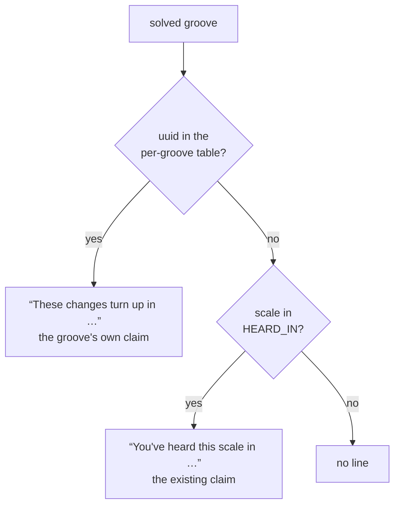

# PRD — Epic 1: A groove can name the song it was built on

Feature: [briefing.md](../briefing.md) · [roadmap.md](../roadmap.md)

## Summary

`heard-in.json` maps a scale to a well-known recording, so every groove in E♭
dorian gets *So What*. This epic lets a single groove carry its own entry, keyed
by uuid, and gives it a sentence of its own — because "you've heard this **scale**
in X" and "these **changes** turn up in X" are two different claims and only one
of them is worth taking to the guitar. It ships with hand-written pins on
existing grooves, so it changes what Sam reads on the morning it lands rather
than waiting for Epic 2's groove.

## Problem

Twenty-one scale entries cover 21 of the 144 root-and-mode combinations, so most
grooves show no line at all, and the ones that do show a line about their mode.
Sam can't take a mode to an instrument:

> *"'These changes' tells me what to put my fingers on. That's the whole reason
> I'd read the line at all."*

There is also no way to say anything about *one* groove. A groove whose four
chords land somewhere a person recognises has no way to say so without claiming
the whole scale does, and claiming the whole scale is how the current table
already overreaches — every E♭ dorian groove is credited to *So What* whatever its
changes are.

## Scope

- `heard-in.json` accepts a groove uuid as a top-level key alongside the scale
  keys
- `heardIn.ts` validates both kinds of key
- `manifest.ts` emits the uuid entries into `grooves.generated.ts`
- the reveal resolves uuid first, scale second
- a new snippet in `src/lib/snippets/en/solved.ts` for the per-groove claim
- hand-written pins on existing grooves, each one honest about the groove's own
  changes

**Out of scope**
- minting any groove — Epic 2
- choosing pins by machine — a person picks these. The skill in Epic 3 picks them
  only for grooves it mints
- retiring the scale table. Both lookups ship; the scale line stays the answer for
  every groove without a pin of its own
- a second language. The new snippet lands in `en/` beside its neighbours, the way
  feature-21 left things

## Requirements

### The data

- **R1** — A top-level key in `heard-in.json` is either a scale name, spelled the
  way `Groove.scale` is, or a groove uuid. The entry shape stays
  `{ track, artist }` for both.
- **R2** — A uuid key must name a groove in `catalogue.json`. One that does not is
  a validation failure that names the offending key, alongside the existing
  failures for an unrendered scale, an empty track and an empty artist.
- **R3** — A scale key must still name a scale some groove renders. The existing
  rule is unchanged; a uuid key does not satisfy it and does not exempt anything
  from it.
- **R4** — Both tables reach `grooves.generated.ts`. The existing `HEARD_IN`
  export keeps its name, its shape and its meaning; the uuid entries ship beside
  it under their own export.
- **R5** — Adding, changing or removing a pin does not re-render audio. The
  manifest is rewritten and the lock's `manifestSha256` moves with it, which is
  what `npm run grooves -- --manifest-only` is for.

### The reveal

- **R6** — When the solved groove's uuid has an entry, the reveal shows the
  per-groove line and not the scale line.
- **R7** — When it does not, the reveal shows the scale line if the groove's scale
  has an entry, and nothing if it does not. Both fallbacks are unchanged from
  today.
- **R8** — The two lines are never shown together. One claim per groove.
- **R9** — The per-groove line is its own snippet, not a re-worded `heardIn`. Its
  subject is the groove's changes, not its scale, and it reads **"Built on the
  changes of “<track>” by <artist>"**.
- **R9a** — That sentence claims the chords, not the history. *Built on the
  changes of Summertime* means the changes this groove is built on are
  Summertime's — true of a groove the skill aimed at the tune and equally true of
  one generated months ago that landed on them. R10 is what makes it keepable in
  both cases.
- **R9b** — The line names no key. The reveal already states the scale one line
  above, in concert pitch and in the player's written pitch where feature-23's
  transposition is on, and a second key in a second notation is arithmetic the
  line would be handing over rather than saving.

### What a pin may claim

- **R10** — A groove is pinned to a tune only when its mode is the tune's mode and
  all four of its chords are the tune's chords. The order may differ — *"loop four
  chords out of a tune in any order and it still smells like the tune; that's what
  a vamp is"* — and the key may differ. Three of the four is not a pin: the
  sentence says *the changes*, definite and plural.
- **R11** — A groove whose mode is not the tune's mode is not pinned. Naming a
  tune whose seventh is not the seventh Sam just spent the puzzle deciding on
  contradicts the game in the one place the player was told the answer:

  > *"If the app can be wrong about the exact thing it asked me to hear, I stop
  > believing the reveal, and the reveal is the part I come back for."*

- **R12** — A groove in a different key from the tune's usual one is still pinned.
  The key costs Sam nothing — *"the key is the least of my problems"* — and the
  reveal already names the scale a line above.
- **R13** — Every pin this epic ships is one a person can defend against R10 and
  R11. The number is however many are honestly true, not a target.

## Behaviour details

### Which line the reveal shows

The uuid branch wins because it is the more specific claim about the same groove,
and because showing both would put two sentences about two different things under
one heading.

## Acceptance criteria

- **AC1** (R1, R4) — Given a `heard-in.json` holding one scale key and one uuid
  key, when the manifest is rendered, then `grooves.generated.ts` carries both,
  the scale entry under `HEARD_IN` unchanged.
- **AC2** (R2) — Given a uuid key naming no groove in the catalogue, when the
  generator validates, then it fails and the message names that key.
- **AC3** (R3) — Given a scale key naming a scale no groove renders, when the
  generator validates, then it fails as it does today, whether or not uuid keys
  are also present.
- **AC4** (R2) — Given a uuid key with an empty track or an empty artist, when the
  generator validates, then it fails the same way a scale key with one does.
- **AC5** (R5) — Given a pin added to `heard-in.json`, when
  `npm run grooves -- --manifest-only` runs, then the manifest and the lock's
  `manifestSha256` change and no file under `public/grooves/` does.
- **AC6** (R6, R9) — Given a solved groove whose uuid is pinned, when the solved
  panel renders, then the per-groove sentence is shown.
- **AC7** (R6, R8) — Given a solved groove whose uuid is pinned *and* whose scale
  has an entry, when the solved panel renders, then only the per-groove sentence
  is shown.
- **AC8** (R7) — Given a solved groove with no pin whose scale has an entry, when
  the solved panel renders, then the existing scale sentence is shown, unchanged.
- **AC9** (R7) — Given a solved groove with no pin whose scale has no entry, when
  the solved panel renders, then no line is shown where one would be.
- **AC10** (R13) — Given the shipped `heard-in.json` after this epic, when its
  uuid keys are read, then every one names a groove in `GROOVES`, and at least one
  pin ships.
- **AC11** (R10, R11) — Given every uuid pin this epic ships, when each pinned
  groove's flavour and four chords are compared with the tune it names, then the
  mode agrees and all four chords are the tune's.
- **AC12** (R9) — Given a pinned groove, when the solved panel renders, then the
  line reads "Built on the changes of “<track>” by <artist>".
- **AC13** (R9b) — Given a pinned groove whose key differs from the tune's usual
  one, when the solved panel renders, then the line names no key.

## Dependencies

**Needs:** nothing. This epic is the first thing that can be built.

**Hands to Epic 2, as a frozen contract:** *a top-level key in `heard-in.json` may
be a groove uuid instead of a scale name; the entry stays `{ track, artist }`;
a uuid key must name a groove in the catalogue.* Epic 2 writes such an entry and
needs none of this epic's code to do it.

**Hands to Epic 3:** the same contract, plus the rule in R10–R12 for when a pin
may be written at all — the skill applies it to the grooves it mints.

## Assumptions

- The per-groove export is a second `Record<string, HeardIn>` in the manifest,
  keyed by uuid. Its name is an implementation call.
- Pins are hand-written in `heard-in.json` and validated on render. There is no UI
  for adding one and no plan for one.
- "A handful" is whatever survives R10 and R11 — five is a handful, so is two.
- The persona names no repertoire, so which tunes Sam actually knows is not
  answerable from `docs/persona.md`. Sam said so directly rather than inventing
  one. Pins are chosen for how widely known a tune is, and that judgement is
  Fred's.

## Question log

Answered questions, kept for traceability. The requirements above are the source
of truth — this records how they got there. Append-only.

### Cycle 1 — 2026-09-06

**Q1. What does the per-groove line actually say?**
Answer: **B) "Built on the changes of “Summertime” by George Gershwin"** — the
stronger claim, taken together with the strict threshold in Q2 that makes it
keepable. Sam argued for the weaker "these changes turn up in" on the grounds
that a seed search cannot always keep a promise; Q2's answer removes the case it
was protecting against, since a pin is only written when all four chords are the
tune's.
Applied to: R9, R9a, AC12

**Q2. When is a pin honest enough to ship?**
Answer: **A) Same mode, and the tune's chords are the ones being played** — order
may differ, key may differ. A wrong mode contradicts the one thing the puzzle
just asked the player to hear.
Applied to: R10, R11, R12, AC11

**Q3. When the key differs, does the line say so?**
Answer: **A) No** — the scale is already named a line above, in both notations,
and a second key would be arithmetic rather than information.
Applied to: R9b, AC13
