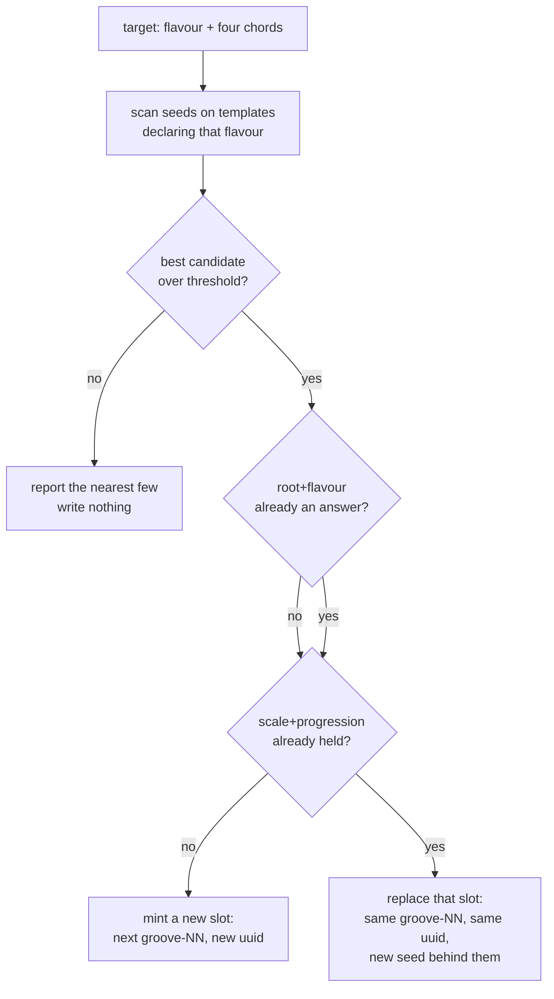

# PRD — Epic 2: A groove built to a standard's changes

Feature: [briefing.md](../briefing.md) · [roadmap.md](../roadmap.md)

## Summary

Teach the generator to be aimed. Today a groove's key, mode and four chords fall
out of a seeded draw nobody may touch; this epic adds a search that scans seeds
and reports which `{ template, seed }` comes closest to a wanted set of changes,
then mints the winner. One standard goes in by hand — a person names the tune and
its harmony, the search finds the seed, a listening pass accepts it — so the
mechanism ships proved by a groove Sam can play rather than by a green test.
Epic 3 puts a skill in front of it.

## Problem

`buildEvents` draws bpm, root, flavour and the whole progression from
`rngFor(\`${template}:${seed}:events\`)`, and `MUSIC_LABEL = 'events'` is on
[music.md](../../../../docs/music.md)'s never-change list: nothing may be added to
that stream, because every committed answer derives from it in exactly this
order. So there is no override to write. The only lever that exists is *which
seed*, and nothing today searches over it for anything but scarcity and
uniqueness.

That is not a small lever. `chordsForScale` gives one scale's whole legal chord
vocabulary, `buildHarmony` draws three or four of them starting on the tonic, and
across nine templates × thousands of seeds the reachable progressions are many.
Somewhere in there are four bars that sound like Summertime. Nothing can find
them.

## Scope

- a matcher module under `scripts/grooves/` that scores a `{ template, seed }`
  candidate against a wanted target and ranks candidates
- a read-only way to run it and see the ranked candidates without writing
  anything
- a way to mint a chosen `{ template, seed }` — including onto an existing slot,
  where the target collides with a groove the catalogue already holds
- the two `selectSeeds` guards, waived for a song-targeted mint, and the two
  shipped tests that assert them, narrowed
- one standard, targeted by hand, minted, auditioned and pinned
- `ROTA_EPOCH` bumped
- `docs/music.md`'s routing table gains the row

**Out of scope**
- deriving the target from a song title — Epic 3 owns every musical judgement
  about which tune, which style, which four chords
- the `heard-in.json` uuid key and the reveal that reads it — Epic 1. This epic
  writes an entry against the format Epic 1 freezes and depends on nothing else
  of it
- any new style, any new mode, any edit to a template's `flavours` list
- changing what a seed produces. The search reads `buildEvents`; it never
  extends, reorders or re-labels a draw

## Requirements

### The target and the match

- **R1** — A **target** names a wanted flavour and a wanted four-chord shape. It
  is data a person or a skill supplies; the matcher never invents one.
- **R2** — The matcher scans `{ template, seed }` pairs and returns candidates
  ranked by how closely the seed's own drawn harmony matches the target. It calls
  `buildEvents` and reads `music` and `harmony`; it renders no audio, so a scan
  of thousands of seeds costs no encoding.
- **R3** — A candidate's score is reported alongside it, broken into the parts
  that produced it, so a person reading the list can see *why* one seed beat
  another rather than trusting a single number.
- **R4** — The matcher only considers a template that declares the target's
  flavour. A feel owns two to four modes and cannot draw one it does not list, so
  a target's flavour narrows the styles before the scan begins.
- **R5** — A candidate **qualifies** only when its flavour is the target's and all
  four of the target's chords are the four it plays. Order may differ; three of
  the four does not qualify. The pin the run exists to write says *the changes*,
  definite and plural, and a two-thirds match under a whole tune's name is the
  thing the threshold is there to refuse.
- **R5a** — Where no candidate qualifies, the matcher returns the nearest few and
  reports that none did. It never promotes a poor match by returning it alone.
- **R5b** — Where no candidate qualifies, nothing is minted. The run was for a
  song; a groove nobody asked for, added to the answer pool because a search
  happened to be running, is not the outcome and is how a catalogue drifts without
  anyone deciding it should.
- **R6** — Running the matcher writes nothing: no audio, no catalogue entry, no
  manifest, no lock. Seeing the candidates and minting one are two commands.

### Minting the winner

- **R7** — A chosen `{ template, seed }` can be minted into the catalogue, taking
  the next `groove-NN` and a fresh uuid, and passing the same seven-check quality
  gate every other groove passes. A song groove that fails the gate is rejected
  like any other; being a song buys it nothing.
- **R8** — A song-targeted mint is not bound by the answer rule. Where the
  target's root and flavour are already an answer in the catalogue, the mint
  proceeds and two grooves share that answer.
- **R9** — A song-targeted mint is not bound by the pair rule either, but it
  resolves a collision differently: where the target's `scale|progression` pair is
  one an existing groove already holds, the new groove **replaces that groove in
  its slot**. The slot keeps its `groove-NN` and its uuid; the `{ template, seed }`
  behind them becomes the song's; the audio, the manifest row and the lock entry
  are re-rendered.
- **R10** — A replacement never mints a uuid and never retires one. A groove's
  uuid is on music.md's never-change list because share links resolve it, and the
  slot surviving is what keeps those links alive.
- **R11** — Both waivers apply only to a mint that carries a song pin. An ordinary
  `grooves:add` is bound by both guards exactly as it is today.

### What the waivers cost, and what still holds

- **R12** — The catalogue may hold two grooves with the same root-and-flavour
  answer, and the shipped assertions that forbade it say so: they exempt a groove
  that carries a song pin and continue to fail on any other duplicate.
- **R13** — The mode distribution still passes `dominanceFailure` at the shipped
  ratio. A mint or a replacement that would let one mode dominate the answers is
  rejected on that ground.
- **R14** — After a replacement, `uuidFreeze.test.ts` passes on both tiers with
  its frozen table unedited. An edit to that table means the replacement moved a
  uuid, which is the failure the table exists to catch.
- **R15** — `npm run grooves:verify` passes. `grooves.lock.json` is unchanged for
  every groove that predates the run except a replaced slot, whose `sha256` and
  `bytes` move while its `id` does not.

### The one that ships

- **R16** — One standard is targeted, matched, minted and pinned in this epic. It
  is chosen by a person, its target harmony decided by a person or the `musician`,
  and it enters the catalogue only after a listening sign-off.
- **R17** — `ROTA_EPOCH` is bumped, so the whole catalogue reshuffles rather than
  the new groove being appended to an order players already know. A date already
  played keeps its groove, pinned from the stored result.

## Behaviour details

### The two collisions, and why they resolve differently

A shared answer is two days asking the same question, weeks apart, and the rota
already keeps them off consecutive days — `selectGroove.ts`'s `clashes` refuses
to place two grooves sharing a root, a flavour or a style back to back. A shared
`scale|progression` pair is two grooves playing the same puzzle, and a second
copy of it earns the catalogue nothing. So the first is tolerated and the second
is resolved by replacement.

### What a replacement costs

`DailyResult` holds `{ date, answer, attempts, solved, grooveId }`, and
`pinnedGrooveId(date)` resolves a played date back to its groove. A player who
revisits the day they played the replaced `groove-NN` gets the new audio and the
new answer, with their old attempts beside it. That is the price
[music.md](../../../../docs/music.md) already names — *"A groove is a slot, not a
record … whatever is behind it today is the answer"* — paid on one date per
replacement. It is the reason replacement is the collision path and never a
preference.

## Acceptance criteria

- **AC1** (R2, R6) — Given a target naming a flavour and four chords, when the
  matcher runs, then it returns a ranked candidate list and the working tree is
  unchanged — no file under `public/grooves/`, `catalogue.json`, the manifest or
  the lock is written.
- **AC2** (R2) — Given a fixed target and a fixed seed range, when the matcher
  runs twice, then it returns the same candidates in the same order.
- **AC3** (R3) — Given a returned candidate, when its score is read, then the
  contributing parts are readable individually, not only as a total.
- **AC4** (R4) — Given a target whose flavour only one template declares, when the
  matcher runs over all templates, then every candidate it returns is on that
  template.
- **AC5** (R5a) — Given a target no seed in range matches above the threshold,
  when the matcher runs, then it reports that none qualified and still lists the
  nearest few.
- **AC5a** (R5) — Given a candidate playing three of the target's four chords and
  another playing all four, when the matcher ranks them, then only the second is
  reported as qualifying.
- **AC5b** (R5) — Given a candidate playing all four of the target's chords in a
  different order, when the matcher ranks it, then it qualifies.
- **AC5c** (R5b) — Given a run where no candidate qualifies, when it finishes,
  then `catalogue.json`, the manifest, the lock and `public/grooves/` are all
  unchanged.
- **AC6** (R7) — Given a chosen `{ template, seed }` whose render fails any of the
  seven gate checks, when the mint runs, then nothing is written and the failure
  names the check and the measured value.
- **AC7** (R8) — Given a target whose root and flavour match an existing groove's
  answer, when a song-targeted mint runs, then a new slot is created and both
  grooves are in the shipped catalogue.
- **AC8** (R9, R10) — Given a target whose `scale|progression` matches an existing
  groove's, when a song-targeted mint runs, then the catalogue holds the same
  number of grooves as before, that groove's `id` and `uuid` are unchanged, and
  its `template`/`seed` are the target's.
- **AC9** (R11) — Given an ordinary `npm run grooves:add` run with no song pin,
  when it selects seeds, then a duplicate answer and a duplicate
  `scale|progression` are both still refused.
- **AC10** (R12) — Given the shipped manifest after this epic, when the
  uniqueness assertions run, then a duplicate answer between two song-pinned
  grooves passes and a duplicate between any other pair fails.
- **AC11** (R13) — Given the shipped catalogue after the mint, when
  `lets no mode dominate the answers` runs, then it passes at the shipped ratio.
- **AC12** (R14) — Given a replacement has happened, when `uuidFreeze.test.ts`
  runs on both tiers with its table untouched, then both pass.
- **AC13** (R15) — Given the committed tree after this epic, when
  `npm run grooves:verify` runs, then it passes, and `git diff` on
  `grooves.lock.json` shows a changed entry only for a replaced slot.
- **AC14** (R16) — Given the shipped catalogue, when the epic's standard is played
  in `/dev/grooves`, then its four bars are the targeted changes and its reveal
  names the tune.
- **AC15** (R17) — Given the release, when `ROTA_EPOCH` is compared against its
  previous value, then it has increased by one.

## Dependencies

**Needs, as a contract only:** Epic 1's `heard-in.json` format — *a top-level key
may be a groove uuid instead of a scale name; the entry stays
`{ track, artist }`*. This epic writes such an entry. It does not need Epic 1's
lookup, its snippet or its validation to exist first; both epics re-render the
manifest, and the collision resolves by re-running
`npm run grooves -- --manifest-only` after the merge.

**Hands to Epic 3:** the matcher's input shape (what a target is), its output
shape (a ranked candidate with a broken-out score), and the mint route that takes
a chosen `{ template, seed }` and a pin. Epic 3 supplies the target and calls
these; it adds no search of its own.

## Assumptions

- The matcher lives under `scripts/grooves/` with its test beside it, on the
  generator tier (`npm run test:gen`). Whether it is reached by a flag on
  `grooves:add` or by its own `grooves:match` entry point is an implementation
  call.
- The scan range is bounded and stated, not unbounded. `selectSeeds` already
  works to a `DEFAULT_MAX_ATTEMPTS` of 4000 per template and that is the
  precedent.
- **The strict threshold is reachable, and cheaply.** A scan of 4000 seeds across
  all nine templates — 36,000 candidates — took 5.3 seconds with no rendering, and
  found exact four-of-four matches for four different targets, several each. The
  i–ii°–V–i shape in harmonic minor that stands in for Summertime turns up on
  `half-time` at seeds 56, 154 and 403; seed 154 gives A♭mMaj7–B♭m7♭5–E♭7–A♭mMaj7.
  Requiring all four chords does not make the search fail — it makes it pickier
  over a set that is large enough to be picky about.
- A target must start on the tonic, because `buildHarmony` always does. A tune
  whose four bars begin somewhere else is unreachable, and that is a refusal
  rather than a near miss.
- Neither waiver is common. No mode currently holds more than five of its twelve
  roots, so a transposition almost always has room, and an exact
  `scale|progression` collision is rarer still. Both paths must work; neither is
  the normal one.
- The epic's standard is chosen when the epic is built, not named here. Naming it
  now would fix a musical decision the `musician` should make against a working
  matcher.

## Question log

Answered questions, kept for traceability. The requirements above are the source
of truth — this records how they got there. Append-only.

### Cycle 1 — 2026-09-06

**Q1. Where exactly is the acceptance threshold — what about three of four?**
Answer: **B) Only four of four** — three is a two-thirds match wearing a whole
tune's name, and the pinned line says *the changes*. A scan of 36,000 candidates
confirmed exact matches are plentiful, so the strict bar costs the search
nothing.
Applied to: R5, AC5a, AC5b, Assumptions

**Q2. A candidate clears the gate but not the threshold. Mint it anyway?**
Answer: **A) Don't mint** — the run was for a song, and a catalogue that grows by
accident is how the answer pool drifts without anyone deciding it should.
Applied to: R5b, AC5c
