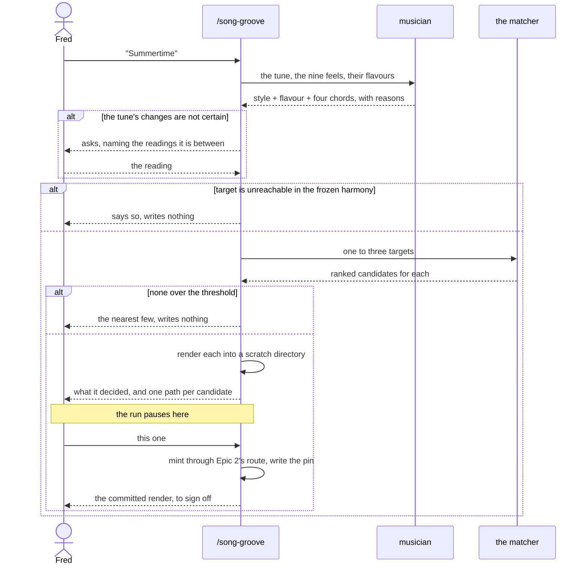

# PRD — Epic 3: `/song-groove "Summertime"` does it unattended

Feature: [briefing.md](../briefing.md) · [roadmap.md](../roadmap.md)

## Summary

A skill that takes a song title and comes back with a groove. It decides which of
the nine existing styles fits the tune and which four chords stand in for its
changes, hands that target to Epic 2's matcher, and renders the winner into a
scratch directory for a person to hear. Nothing reaches the catalogue until
someone promotes it. Sam never sees the skill; what Sam sees is that tunes they
recognise keep turning up months from now instead of the same twenty-one scale
entries going round.

## Problem

Epic 2 makes a groove steerable, but only by someone who can read a lead sheet,
knows which of nine feels a tune belongs to, and knows which of that feel's two
to four modes the tune is in. That is an afternoon per song, by one person, and
it is the reason the catalogue's songs would stop at one.

The judgement is also genuinely coupled, which is what makes it worth automating
rather than writing down. A feel owns two to four flavours and cannot draw one it
does not declare, so wanting harmonic minor picks `half-time` and nothing else;
wanting a ballad tempo narrows the modes on offer to `open-ballad`'s two. Style
and mode cannot be chosen one after the other — they have to be solved together
against `templates/*.ts`.

## Scope

- `.claude/skills/song-groove/SKILL.md`, in the shape the eleven existing skills
  take
- the song → target decision: which style, which mode, which four chords,
  dispatching the `musician` for the musical call
- calling Epic 2's matcher and rendering the winning candidate into a scratch
  directory outside the repo
- a promote step that takes an audited scratch render into the catalogue, mints
  it through Epic 2's route and writes its pin
- the refusal paths — for a tune the skill cannot pin down, and for a target no
  seed comes close to
- what the skill reports back: what it decided, what it assumed, and what it
  wants a person to listen to

**Out of scope**
- the matcher, the mint and the replacement path — Epic 2 owns all three. This
  epic supplies a target and calls them
- the `heard-in.json` format and the reveal — Epic 1
- committing. Promotion writes the audio, catalogue, manifest, lock and pin into
  the working tree; committing them stays a person's move
- any new style, mode or template `flavours` edit. The briefing rules this out in
  as many words: *"no new style is created for it — do everything inside the
  boundaries we already have"*
- rendering the tune's melody. The lead register stays empty; what the skill
  produces is a backing track over a tune's changes

## Requirements

### Deciding the target

- **R1** — The skill takes a song, named by the user. It never chooses one.
- **R2** — It decides the target as one judgement, not two: a `{ style, flavour,
  four chords }` triple that is legal against `templates/*.ts`, where the chosen
  style declares the chosen flavour.
- **R3** — The musical call is the `musician`'s. The skill dispatches it with the
  tune and the nine feels' declared flavours, tempo ranges and character, and
  takes back a target with the reasoning behind it.
- **R4** — The four chords are named as chords the frozen harmony can actually
  produce — degrees of one scale, starting on the tonic, no degree repeating back
  to back. A target the generator cannot reach is a refusal, not a search that
  quietly returns nothing.
- **R5** — Where the skill is not confident of the tune's own changes, it **asks**,
  naming what it was unsure about and the readings it was choosing between. It
  never proceeds on a silent guess: a wrong target does not fail loudly, it
  produces a real groove under a real tune's name, and the only thing between that
  and the player is whether somebody happened to know the tune.
- **R5a** — Asking is the last resort, not the first move. The skill asks when the
  uncertainty is about the *tune* — an arrangement it cannot settle, a title that
  names two songs — because no amount of rendering resolves that. Uncertainty
  about which reachable target best stands in for changes it does know is settled
  by R6a instead, by ear.

### Running it through

- **R6** — The skill calls Epic 2's matcher with the target, and presents the
  ranked candidates with the parts of each score visible.
- **R6a** — Where more than one target plausibly stands in for the tune — a
  different four-bar summary, a different style whose flavours also reach it, or
  the same chords in an order the frozen draw offers — the skill **does not
  choose**. It takes each through the matcher and carries them all to the
  audition, because which one sounds like the tune is a question about the audio
  and no amount of reasoning about degrees settles it.
- **R6b** — At most three targets reach the audition, each labelled with the
  target behind it and why it was a candidate. A listening pass over more than
  three loops stops being a listening pass.
- **R7** — Where no candidate clears the threshold, the skill reports the nearest
  few, says none qualified, writes nothing, and suggests the tune is one this
  catalogue cannot reach. It never mints under a famous title on a poor match.
- **R8** — Where candidates qualify, the skill renders each into a scratch
  directory outside the repository, reports the paths and what each one is, and
  **stops there and waits**. Until the person names one to go ahead with,
  `catalogue.json`, the manifest, the lock and `public/grooves/` are untouched.
- **R8a** — The audition is a pause inside one run, not a second command. The
  skill promotes the candidate the person names, in the same session, minting
  through Epic 2's route and writing the pin. Exactly one candidate is promoted
  per run; the rest are discarded with the scratch directory. A groove reaches the
  catalogue only after somebody has heard it and asked for it, and that is the
  whole reason the pause exists.
- **R8b** — A run abandoned at the pause leaves no trace in the repository. There
  is nothing to clean up and nothing to `git checkout` away.
- **R8b1** — The audition decides which changes, not which take. The committed
  file is a different render from the scratch one, so the run reports it after the
  mint and the listening sign-off happens there.
- **R8c** — Nothing is lost by abandoning a run. Determinism is the generator's
  load-bearing property, so the same target re-run gives the same seed and the
  same audio; a session that ends at the pause costs a re-run, not the work.
- **R9** — The skill never reports that a groove sounds good. `docs/music.md` puts
  the listening sign-off with a person, and the skill's job ends at handing them
  something to listen to.

### Writing the pin

- **R10** — A promoted groove gets a `heard-in.json` entry keyed by its uuid,
  naming the tune and its writer or best-known artist. The pin is written at
  promotion, with the uuid the mint assigns — a scratch render has no uuid to pin
  to.
- **R11** — The skill applies Epic 1's rule for when a pin may be written at all,
  unchanged: the pin claims the groove's four chords, and a groove whose mode is
  not the tune's mode does not get one.
- **R12** — The skill reports what it decided and what it assumed — the style and
  why, the mode and why, the four chords and how they stand in for the tune's, the
  seed it chose and what it scored — so the person auditioning is reviewing a
  decision rather than accepting a result.

### What it must not do

- **R13** — The skill adds no style, no mode, no template `flavours` entry, and
  nothing to `MUSIC_LABEL`'s draw. Every one of those is on music.md's
  never-change list or the briefing's exclusion list.
- **R14** — The skill commits nothing and pushes nothing.

## Behaviour details

### The run, and the three places it stops

Every outcome leaves the repository untouched until a person has listened and
named a groove. The expensive mistake is a groove in the catalogue under a name it
does not deserve, and no single command can make one.

The skill stops in three different ways and they are not interchangeable. It
**asks** when the uncertainty is about the tune, because nothing it can render
resolves that. It **auditions several** when the uncertainty is about which
reachable target sounds most like changes it already knows, because that is
exactly what rendering resolves. It **declines** when the frozen harmony cannot
reach the tune at all, because there is nothing to ask and nothing to hear.

### The audition and the committed file are different takes

`renderVoices` seeds its round-robin sample choice from the groove's id, so a
scratch render under a temporary id and the file the mint writes under
`groove-NN` are not the same audio. The audition therefore decides **which
changes**, and it is the committed file that gets the listening sign-off
`docs/music.md` asks for. Treating the scratch render as the thing signed off
would sign off a take that never ships.

### Two notes the roadmap does not yet carry

**The hedge is gone.** The roadmap's Epic 3 says a mode mismatch is handled by
hedging the pinned line — *"built on the changes of", never "this is"*. That
survives only as the sentence's ordinary wording: Epic 1 settled that a mode
mismatch is not pinned at all, so there is no case left for a hedge to cover.

**A run pauses before it mints.** The roadmap has the skill leaving a minted
groove in the working tree the way `grooves:add` does, in one pass. It renders to
a scratch directory first and waits to be told to go ahead; only then does it
write anything the roadmap describes.

## Acceptance criteria

- **AC1** (R2) — Given a run for any tune, when the skill produces a target, then
  the named style's `flavours` list in `templates/*.ts` contains the named
  flavour.
- **AC2** (R4) — Given a target, when its four chords are checked against
  `chordsForScale` for the named root and flavour, then every one is a chord that
  scale supports and the first is the tonic.
- **AC3** (R5) — Given a tune whose changes the skill cannot establish, when it
  runs, then it asks, naming what it was unsure about and the readings it was
  choosing between, and the working tree is unchanged.
- **AC3a** (R5a) — Given a tune whose changes the skill does know but which more
  than one reachable target could stand in for, when it runs, then it does not
  ask — it carries the alternatives to the audition.
- **AC4** (R7) — Given a target no candidate matches above the threshold, when the
  skill runs, then it reports the nearest few and the working tree is unchanged.
- **AC5** (R8) — Given candidates that qualify, when one invocation reaches the
  pause, then a playable render exists at each reported scratch path and
  `catalogue.json`, the manifest, the lock and `public/grooves/` are unchanged.
- **AC5e** (R6a, R6b) — Given a tune with more than one plausible target, when the
  run reaches the pause, then between two and three renders are offered, each
  labelled with its target and why it was a candidate.
- **AC5f** (R8a) — Given three candidates at the pause, when the person names one,
  then exactly that one is minted and no trace of the other two reaches the
  repository.
- **AC5g** (R8b1) — Given a promoted groove, when the run finishes, then it names
  the committed file as the thing to sign off, not the scratch render.
- **AC5a** (R8b) — Given a run abandoned at the pause, when `git status` is read,
  then the working tree is clean.
- **AC5b** (R8a, R10) — Given a run at the pause, when the person names a
  candidate, then the catalogue gains that groove, its uuid is a key in
  `heard-in.json`, and both changes appear in one working tree for a person to
  commit.
- **AC5d** (R8c) — Given a target run twice, when the two scratch renders are
  compared, then they name the same `{ template, seed }` and produce identical
  audio.
- **AC6** (R9) — Given a completed run, when its report is read, then it contains
  no claim about how the groove sounds.
- **AC7** (R10, R11) — Given a promoted groove, when `heard-in.json` is read, then
  its uuid is a key, and its flavour and four chords are the tune's.
- **AC8** (R12) — Given a completed run, when its report is read, then the style,
  the mode, the four chords, the chosen seed and its score are each stated with a
  reason.
- **AC9** (R13) — Given a completed run, when `git diff` is read, then no file
  under `templates/`, `src/lib/theory/names.ts` or `events.ts` is changed.
- **AC10** (R14) — Given a completed run, when `git log` is read, then no commit
  was made.
- **AC11** (R1–R12) — Given two tunes in different modes, when the skill runs on
  each and both are promoted after a listening pass, then both grooves are in the
  catalogue and pinned; and given a tune the frozen harmony cannot reach, the skill
  declines before rendering anything.

## Dependencies

**Needs:** Epic 2's matcher — its target shape and its ranked-candidate output —
and its mint route, which the run calls only after the pause. Epic 1's pin format and its R10–R12 rule for when a pin is
honest. Both are real dependencies, not contracts: this epic calls the code.

**Hands to:** nothing. It is the last epic.

## Assumptions

- One tune per run. A batch is a loop the user can write, and a skill that renders
  several before anyone has listened to the first is the opposite of the sign-off
  music.md asks for.
- The scratch directory follows `rehearse.ts`, which already renders candidates
  into an `mkdtemp` directory outside the repo for exactly this purpose.
- The pause is the skill waiting on the person in conversation, not a lock file or
  a resumable state on disk. R8c is what makes that affordable.
- The skill is invoked `/song-groove "<title>"`, optionally with the artist where
  a title is ambiguous.
- It names the writer for a standard and the best-known performer for a
  recording, matching how `heard-in.json` is already populated — *Bourrée in E
  minor* is credited to Bach, *So What* to Miles Davis.
- Whether Sam knows any given tune is not answerable from `docs/persona.md`,
  which names no repertoire. Sam declined to invent one. Which tunes are worth
  minting is Fred's judgement, exercised one run at a time.

## Question log

Answered questions, kept for traceability. The requirements above are the source
of truth — this records how they got there. Append-only.

### Cycle 1 — 2026-09-06

**Q1. Does one invocation go all the way to a minted groove?**
Answer: **C) Mint into a scratch directory; promoting it into the catalogue is a
separate step** — the only real gate on a groove is a person listening, and one
command that both decides and commits the decision has no place to put that
person.
Applied to: Summary, Scope, R8, R8a, R8b, R10, AC5, AC5a, AC5b, Behaviour details

**Q2. What does the skill do with a tune whose changes it is unsure of?**
Answer: **A) Stop, and say what it was unsure about** — a wrong target does not
fail loudly; it produces a real groove under a real tune's name.
Applied to: R5, AC3

### Cycle 2 — 2026-09-06

**Q3. How is a scratch render promoted?**
Answer: **D) The skill promotes when the user says so in the same session** — the
audition is a pause in one run, not a second command. Nothing has to be
re-derived or re-read from disk, because the run is still holding the decision;
and nothing is lost by walking away, because the same target re-renders
identically.
Applied to: R8, R8a, R8b, R8c, AC5a, AC5b, AC5d, Behaviour details, Assumptions

### Cycle 3 — 2026-09-06

**Revision to Q2 (Cycle 1).** Q2 was answered *"A) Stop, and say what it was
unsure about"*, and R5 was written to stop. Fred revised it: the skill **asks**.
Stopping ends the run; asking keeps it, and a tune with two common arrangements
is a question a person answers in a sentence.
Applied to: R5, R5a, AC3, Behaviour details

**Added: uncertainty about the target is settled by ear, not by asking.** Where
more than one reachable four-chord target could stand in for changes the skill
already knows, it renders several and carries them all to the audition rather
than choosing one or asking about it. This is what the pause was already for.
Applied to: R6a, R6b, R8, R8a, AC3a, AC5, AC5e, AC5f, Behaviour details

**Added: the audition and the committed file are different takes.** `renderVoices`
seeds its round-robin from the groove id, so a scratch render is not the audio the
mint writes. The audition decides which changes; the committed file takes the
sign-off.
Applied to: R8b1, AC5g, Behaviour details
