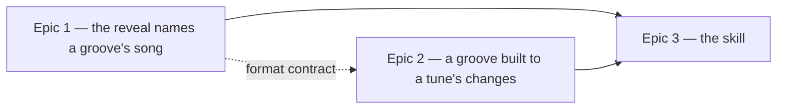

# Roadmap — Grooves from songs

Source: [briefing.md](briefing.md)

## Overview

A named song becomes a groove, inside every boundary the catalogue already
has. The reveal learns to name a song for *one groove* rather than for a whole
scale, and ships with hand-written pins so it changes something the morning it
lands. Then the generator learns to be steered at a tune's changes — by
searching seeds, never by touching the frozen draw. Last, a skill does the
picking, so a song costs a command instead of an afternoon.

## Epics

### Epic 1 — A groove can name the song it was built on

**Visible when done:** Sam solves the day's groove and the reveal names *that
tune* — "built on the changes of 'Summertime'" — rather than a song that merely
shares its mode. Grooves in scales the twenty-one-entry table has never covered
can carry a song for the first time.
**Depends on:** none
**Parallel with:** Epic 2

**Scope**
- `heard-in.json` accepts a groove uuid as a top-level key alongside the scale
  keys. The entry shape stays `{ track, artist }`.
- `heardIn.ts` validates both key kinds: a scale key must still name a rendered
  scale, and a uuid key must name a groove in `catalogue.json`.
- `manifest.ts` emits the uuid entries into `grooves.generated.ts`; the existing
  `HEARD_IN` table keeps its shape and its meaning.
- The reveal resolves the groove's uuid first and its scale second.
- **A second sentence, beside the existing one.** `solved.heardIn` reads "You've
  heard this scale in …", which is a claim about the mode. A uuid pin is a claim
  about the groove — "Built on the changes of “Summertime” by George Gershwin" —
  and it gets its own key in `src/lib/snippets/en/solved.ts` rather than
  borrowing that one. Sam: *"those are two different sentences and I'd want them
  to read differently … if the second one wears the first one's wording I'll read
  it as the first and be confused when the changes don't match."*
- **A handful of hand-written pins on existing grooves — but only where the
  groove's own four chords resemble a tune a person can name.** Not every groove
  whose scale happens to have an entry: a pin is a claim about the changes, and
  pinning on a shared mode alone is the claim this epic exists to stop making.
  Without pins the epic changes nothing anyone can see. Sam: *"A is the only one
  of the three that changes tomorrow morning and the morning after."*

**Out of scope**
- Any newly minted groove — Epic 2.
- Deciding which existing groove deserves which pin by machine. A person picks
  these; the skill in Epic 3 picks them for grooves it mints.
- Retiring the scale table. Both lookups ship; the scale line stays the answer
  for every groove without a pin of its own.

**Validation**
- `/dev/grooves` → a pinned groove → solve it → the reveal names the tune in the
  new sentence. An unpinned groove in a covered scale still shows the old line;
  an unpinned groove in an uncovered scale still shows nothing.
- `heardIn.test.ts`: a uuid key naming no groove fails, a scale key naming no
  rendered scale fails, both kinds together pass.
- `grooves.generated.test.ts`: every shipped uuid key names a groove in
  `GROOVES`.
- `SolvedPanel.test.tsx`: the three lookup outcomes — uuid, scale, neither.

### Epic 2 — A groove built to a standard's changes

**Visible when done:** a new groove joins the rota whose four bars are a tune's
changes rather than a seed's, and whose reveal names it. Sam meets it on the day
the rota gives it.
**Depends on:** Epic 1's `heard-in.json` format — contract only: *a top-level key
may be a groove uuid; the entry shape does not change*. Pin that and this epic
runs beside Epic 1 rather than after it.
**Parallel with:** Epic 1

**Scope**
- A matcher under `scripts/grooves/`: given a wanted mode and a wanted chord
  shape, scan seeds and score `{ template, seed }` candidates. `buildEvents`
  yields root, mode and progression without rendering any audio, which is what
  makes the scan cheap — `selectSeeds` already runs exactly that over four
  thousand seeds a template.
- A read-only way to see the candidates before anything is written, and the
  existing off-catalogue audition — `npm run grooves -- --template <id> --seed
  <n> --out <tmp>` — to hear one.
- A route into the mint that takes a chosen `{ template, seed }`.
- One song, targeted by hand: a person (or the `musician`) decides its mode and
  its four chords, the search runs, the winner is auditioned, minted and pinned.
- Bump `ROTA_EPOCH`. Every release that mints does.

**The two walls this epic cannot move** — both from
[music.md](../../../docs/music.md):
- Nothing is added to `MUSIC_LABEL`'s draw. The search *picks a seed*; it never
  changes what a seed produces. That is the whole reason this is a search.
- The four chords come from one scale's `chordsForScale`, always start on the
  tonic, and never repeat a degree back to back. The result **resembles** the
  tune; it does not transcribe it.

**And the two rules it does move**

`selectSeeds` carries two guards against a song groove, and neither binds one:

- **The answer rule** — no two grooves share a root+mode. 48 of 144 are taken.
  Where a free root exists the song transposes into it; Sam: *"the key is the
  least of my problems … move it wherever you have room."* Where none does, the
  song **takes the answer anyway** and two grooves share it.
- **The pair rule** — no two grooves share `scale|progression`. Where the tune's
  changes land on a pair a groove already holds, the song **replaces that groove
  in place**: the slot keeps its `groove-NN` and its uuid, and the seed behind it
  becomes the song's. Fred: *"The catalogue is a list of what Sam has heard, not
  a list of what Sam has heard first."* This is the move music.md already
  blesses — *"A groove is a slot, not a record … whatever is behind it today is
  the answer"* — and it is the only reading that keeps a share link alive, since
  a uuid is on the never-change list and the slot's is untouched.

Three consequences, all in this epic's scope:

- `grooves.generated.test.ts`'s **"asks a different question every day it can"**
  and `select.test.ts`'s **"never repeats an answer"** both assert uniqueness over
  the whole catalogue. Both narrow to *except a groove pinned to a song* — the
  invariant is not deleted, it is given an exception with a name.
- **A replaced slot invalidates one stored result.** `DailyResult` holds
  `{ date, answer, attempts, grooveId }`, and `pinnedGrooveId` resolves a played
  date back to its groove. A player who revisits the day they played the old
  groove-NN now hears the new one, with their old attempts beside it. That is
  the price music.md already names, paid on one date per replacement rather than
  across the catalogue — but it is the reason a replacement is the collision path
  and never a preference.
- The rota already absorbs a shared answer. `selectGroove.ts`'s `clashes` refuses
  to place two grooves sharing a root, a flavour or a style back to back, so
  duplicated answers cannot land on consecutive days.

Neither waiver is the normal path. No mode holds more than five of its twelve
roots, so a transposition almost always has room, and an exact pair collision is
rarer still.

**Out of scope**
- Deriving the style, the mode or the chords from a song title — Epic 3.
- Any new style, any new mode, any edit to a template's `flavours`.

**Validation**
- `npm run grooves:verify` green. `grooves.lock.json` is unchanged for every
  groove that predates the mint **except a replaced slot**, whose audio hash
  moves while its id and uuid do not.
- `uuidFreeze.test.ts` green on both tiers without editing the frozen table — a
  replacement keeps the `id → uuid` pair, and a test edit there would mean the
  replacement was done wrong.
- `lets no mode dominate the answers` still passes: a replacement changes the
  mode distribution, and `dominanceFailure` is what says by how much.
- The matcher unit-tested against fixed seeds: a known target returns a known
  candidate list in a known order.
- The two narrowed uniqueness tests still fail on a duplicate answer that is *not*
  pinned to a song — the exception is by pin, not by fiat.
- A listening sign-off on the new groove, per music.md. Nothing in this epic
  reports that it sounds good.

### Epic 3 — `/song-groove "Summertime"` does it unattended

**Visible when done:** songs Sam knows keep turning up months from now, instead
of the same twenty-one scale pins going round — because turning a tune into a
groove costs a command rather than an afternoon. Sam, honestly: *"C reaches me
only through its consequence. I never see a skill."*
**Depends on:** Epic 2 (the matcher), Epic 1 (the pin)
**Parallel with:** nothing

**Scope**
- `.claude/skills/song-groove/SKILL.md`, in the shape the other eleven skills
  take.
- Song → target: which of the nine styles, which mode, which four chords. It
  dispatches the `musician`, per [AGENTS.md](../../../AGENTS.md).
- **Style and mode are not independent choices.** A feel owns two to four modes,
  so wanting harmonic minor picks `half-time` for you, and wanting a ballad
  narrows the modes on offer. The skill has to reason over the pair, not pick one
  then the other.
- Run the matcher, audition the winner, mint, write the uuid pin, report what it
  did and what it assumed.
- The refusal path: when nothing scores close enough it says so and names the
  three nearest, rather than shipping a bad match under a famous title.
- The hedge: when the mode is not the tune's mode, the pinned line says "built on
  the changes of", never "this is". Sam: *"Mode change or 'resembles', say so in
  the line."*

**Out of scope**
- Committing. Like `grooves:add`, it leaves the audio, catalogue, manifest, lock
  and pin for a person to hear and commit.
- New styles, new modes, anything on music.md's frozen list.

**Validation**
- Run it on two songs of different modes; both produce a groove the listening
  pass accepts.
- Run it on a song the frozen harmony cannot reach; it declines with the near
  misses rather than minting.
- `npm run test:all` and `npm run grooves:verify` green.

## Dependency map

## Execution waves

- **Wave 1 (parallel):** Epic 1, Epic 2 — Epic 2 against Epic 1's frozen
  `heard-in.json` format, not against its code.
- **Wave 2:** Epic 3 — needs the matcher to exist and the pin to work.

**The one merge point.** Both wave-1 epics rewrite generated files: Epic 1
changes what `manifest.ts` emits, Epic 2 mints a groove and re-renders. The
collision is in `grooves.generated.ts` and `heard-in.json`, and it resolves by
re-running `npm run grooves -- --manifest-only` after the merge, not by hand.

## Assumptions

- **The skill mints.** The briefing says "the skill creates the groove". It stops
  short of committing, because a groove is not accepted until someone has heard
  it.
- **The matcher scores against `progressionDegrees` and chord qualities**, not
  against a recording. Nothing here listens to the original song.
- **The melody is never rendered.** The lead register stays empty; the skill
  produces a backing track over a tune's changes, not the tune.
- **Titles and artists are credit text.** A song title and a chord shape are what
  this feature copies, and nothing else — no audio, no lyrics, no notation.
- **Where the matcher lives** — a flag on `grooves:add` or its own
  `grooves:match` CLI — is a spec-level call, not a roadmap one.
- **A pin is per groove, not per song.** Two grooves may be built from the same
  tune; each carries its own entry.
- **"A handful" of Epic 1 pins is however many are honestly true** — a person
  reads the catalogue's progressions and pins the ones they can name. Five is a
  handful; so is two.
- **The new sentence is a new snippet key**, not a variant of `heardIn`. It lands
  in `src/lib/snippets/en/solved.ts` beside it, the way feature-21 left things.
- **"Delete the old one" means the slot survives.** A replaced groove keeps its
  `groove-NN` and its uuid and changes what is behind them. Dropping the row
  outright would retire a uuid, which music.md's never-change list forbids
  because share links resolve it.
