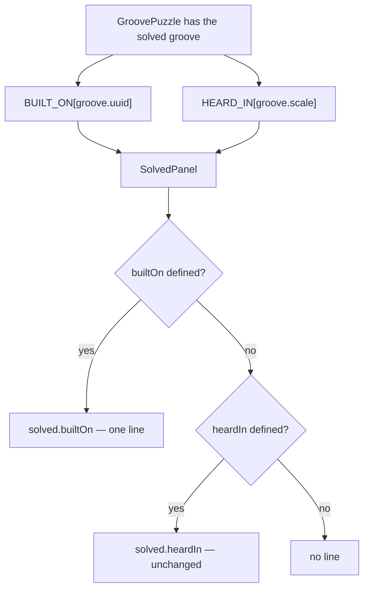

# Tech spec — Epic 1: A groove can name the song it was built on

PRD: [../prd/epic-1-a-groove-can-name-the-song-it-was-built-on.md](../prd/epic-1-a-groove-can-name-the-song-it-was-built-on.md) ·
Roadmap: [../roadmap.md](../roadmap.md)

## Approach

One JSON file learns a second kind of key, and everything else follows from how
that key is recognised. `heard-in.json` stays one flat
`Record<string, { track, artist }>`; a key is a **uuid key** when it has the
shape of a uuid and a **scale key** otherwise, and that single predicate is what
validation, rendering and the reveal all hang off. `heardIn.ts` gains
`isUuidKey` and `splitHeardIn`, `heardInFailures` gains the catalogue's uuids to
check membership against, and `manifest.ts` — with its signature unchanged, on
purpose — splits the table it is handed and emits a second export, `BUILT_ON`,
beside `HEARD_IN`. On the app side the reveal gains a second optional prop and a
second snippet, and the panel prefers the per-groove line when it has one.

Two tracks run at once in Wave 1: the generator half (key kinds, second export,
CLI validation) and the app half (the sentence and the panel that shows it).
Neither can see the pins yet, and neither needs to — the app half is proved
against props, not against shipped data. Wave 2 is the pins themselves: a musical
judgement about which of the 54 committed grooves actually plays a tune's
changes, written into `heard-in.json`, rendered with
`npm run grooves -- --manifest-only`, and defended in a table in `docs/music.md`
that a generator test checks against the data. Wave 3 wires `GroovePuzzle.tsx`
to the new export, which cannot happen earlier because `BUILT_ON` does not exist
in the committed manifest until Wave 2 re-renders it.

The one thing worth arguing with before reading the steps: **the manifest keeps
one `heardIn` argument and splits it itself.** That is what leaves
`writeManifest(entries, path, pools, heardIn)` untouched, which is what lets
Epic 2 mint and re-render in parallel without ever reading this spec.

## Architecture

### The moving parts

| Part | Where | What changes |
| :-- | :-- | :-- |
| the key kinds | `scripts/grooves/heardIn.ts`, `heardIn.test.ts` | `isUuidKey`, `splitHeardIn`, `heardInFailures(table, scales, uuids)` |
| the second export | `scripts/grooves/manifest.ts`, `manifest.test.ts` | `BUILT_ON_BANNER`, `renderBuiltOn`, `renderManifest` splits before rendering |
| the validation call | `scripts/grooves/cli.ts`, `cli.test.ts` | one argument added at the existing throw site (line 126) |
| the sentence | `src/lib/snippets/types.ts`, `en/solved.ts`, `snippets.test.ts` | `SolvedSnippets.builtOn` |
| the reveal | `.../components/solved/SolvedPanel.tsx` + its test | a second optional prop, preferred over `heardIn` |
| the wiring | `.../components/GroovePuzzle.tsx` + `GroovePuzzle.page.test.tsx` | `BUILT_ON[groove.uuid]` beside `HEARD_IN[groove.scale]` |
| the pins | `scripts/grooves/heard-in.json` | uuid keys, hand-picked |
| the shipped data | `data/grooves.generated.ts`, `grooves.lock.json`, `data/grooves.generated.test.ts` | one `--manifest-only` render, one moved `manifestSha256` |
| the paper trail | `docs/music.md`, `scripts/grooves/docs.test.ts` | the pin rule, one row per pin, checked against the JSON |

### How a key is classified

A key is a uuid key **by shape, not by membership**:

```ts
const UUID_SHAPE = /^[0-9a-f]{8}-[0-9a-f]{4}-[0-9a-f]{4}-[0-9a-f]{4}-[0-9a-f]{12}$/i
```

Deliberately looser than `uuid.ts`'s `CANONICAL` (which pins version 4 and
lowercase) and case-insensitive. Classifying by membership in the catalogue
instead would send a mistyped uuid down the scale branch and report
`3f2a…: no groove renders this scale`, which is the wrong sentence about the
wrong thing — R2 asks for a failure that names the offending key *as a uuid*.
Shape decides the branch; the catalogue decides whether the key is any good. No
scale name can collide with the shape: every scale name in
`src/lib/theory/names.ts` carries a space.

### Which line the reveal shows



The lookup stays where it is today: `GroovePuzzle.tsx` indexes both manifests
and hands the panel two optional entries. The precedence — R8's "never both" —
is one ternary in the panel, beside the four conditional lines it already holds
(`character`, `instrumentKey !== 'C'`, `nearMiss`, `heardIn`). No new module
under `lib/presentation/`, and therefore no new arrow in
[architecture.md](../../../../docs/architecture.md)'s intra-slice graph: the
shell keeps reading its own manifests, and coaching is not involved because
nothing here is coaching — it is one string chosen by presence.

### What the manifest looks like afterwards

```ts
export const HEARD_IN: Record<string, HeardIn> = {
  'A dorian': { track: 'Oye Como Va', artist: 'Santana' },
  // … the twenty-one, unchanged, still sorted by key
}

export const BUILT_ON: Record<string, HeardIn> = {
  '323eedd7-0c46-4394-abed-21e601dd0f94': { track: '…', artist: '…' },
}
```

Both exports appear whenever `renderManifest` is given a table, `BUILT_ON` as
`{}` when the table holds no uuid key — symmetric with how `HEARD_IN` already
renders an empty table, and it keeps `import { BUILT_ON }` valid in the app
whatever the pins do. The `import type { Groove, HeardIn }` line is unchanged:
`BUILT_ON` reuses `HeardIn`, so the conditional at `manifest.ts` line ~98 keeps
its two branches.

### What this epic deliberately does not touch

- **`add.ts` does not validate.** `grooves:add` renders the table into the
  manifest it regenerates and has never called `heardInFailures`. Teaching it to
  is one line, but `add.ts` is Epic 2's file and this epic has no requirement
  that reaches it. A pin written during a mint is checked on the next
  `npm run grooves`, and `grooves.generated.test.ts`'s new assertions (Step C2)
  catch it in the app tier either way.
- **No `index.ts` is invented.** Nothing here grows a folder;
  `lib/presentation/` keeps its door and nobody else earns one.
- **`ROTA_EPOCH` does not move.** No groove is minted, no answer changes, the
  rota is untouched. Epic 2 bumps it; this epic must not, or the two epics'
  merges fight over one integer for no reason.

## Contracts

Frozen for the whole epic, and — the first block especially — frozen for Epic 2.

### C1 — the file format (this is the contract Epic 2 builds against)

`scripts/grooves/heard-in.json` is one flat object. A top-level key is either a
scale name spelled the way `Groove.scale` is, or a groove uuid. The entry shape
is unchanged for both:

```jsonc
{
  "E♭ dorian":                             { "track": "So What",  "artist": "Miles Davis" },
  "323eedd7-0c46-4394-abed-21e601dd0f94": { "track": "…",       "artist": "…" }
}
```

- A key matching `/^[0-9a-f]{8}-[0-9a-f]{4}-[0-9a-f]{4}-[0-9a-f]{4}-[0-9a-f]{12}$/i`
  is a uuid key. Every other key is a scale key.
- A uuid key must name a groove in `catalogue.json`; a scale key must name a
  scale some groove renders. Both must carry a non-empty track and artist.
- **Epic 2 needs nothing else.** It mints a groove, writes one object entry keyed
  by that groove's uuid, and re-renders. It does not import `heardIn.ts`, does
  not read `BUILT_ON`, and makes no call this epic changes the signature of.

### C2 — `scripts/grooves/heardIn.ts`

```ts
export type HeardInTable = Record<string, HeardIn>
export const HEARD_IN_PATH: string
export function readHeardIn(path?: string): HeardInTable        // unchanged
export function isUuidKey(key: string): boolean
export function splitHeardIn(table: HeardInTable): { byScale: HeardInTable; byUuid: HeardInTable }
export function heardInFailures(
  table: HeardInTable,
  scales: readonly string[],
  uuids?: readonly string[],   // defaults to []
): string[]
```

Failure strings, one per problem, key-prefixed as today:

| Problem | Message |
| :-- | :-- |
| scale key no groove renders | `${key}: no groove renders this scale` *(unchanged)* |
| uuid key no groove has | `${key}: no groove has this uuid` |
| empty track / artist, either kind | `${key}: empty track` / `${key}: empty artist` *(unchanged)* |

`uuids` defaults to `[]` so a caller that has not been taught about pins fails
**loudly** (every uuid key reported as naming no groove) rather than quietly
passing a key it never checked. That default is a migration aid for the one call
site, not a licence: `cli.ts` passes the real list in Step A4.

### C3 — `scripts/grooves/manifest.ts` — signature unchanged

```ts
export function renderManifest(entries: readonly Groove[], pools?: Pools, heardIn?: HeardInTable): string
export function writeManifest(entries: readonly Groove[], path: string, pools?: Pools, heardIn?: HeardInTable): void
```

`heardIn` is the whole flat table. `renderManifest` splits it and emits, in this
order: `GROOVES`, the three pools, `HEARD_IN` (scale keys, sorted), `BUILT_ON`
(uuid keys, sorted). Every existing call site — `cli.ts`, `add.ts`, and both
their tests — compiles and behaves as before.

### C4 — the manifest's exports

```ts
export const HEARD_IN: Record<string, HeardIn>   // keyed by Groove.scale — unchanged name, shape, meaning
export const BUILT_ON: Record<string, HeardIn>   // keyed by Groove.uuid
```

### C5 — the snippet

```ts
// src/lib/snippets/types.ts → SolvedSnippets
builtOn: (args: { track: string; artist: string }) => string

// src/lib/snippets/en/solved.ts
builtOn: ({ track, artist }) => `Built on the changes of “${track}” by ${artist}`
```

Curly quotes around the track, matching `heardIn`. No key, no root, no mode: the
argument list is the guarantee (R9b).

### C6 — the panel's props

```ts
type SolvedPanelProps = {
  // …unchanged…
  heardIn?: HeardIn
  builtOn?: HeardIn   // when defined, shown INSTEAD of heardIn
}
```

### The merge point with Epic 2

Both wave-1 epics of this feature write generated files. Epic 1 changes what
`manifest.ts` emits and adds uuid keys to `heard-in.json`; Epic 2 mints a groove,
adds its own uuid key, and re-renders everything.

| File | How the collision resolves |
| :-- | :-- |
| `src/features/daily-groove/data/grooves.generated.ts` | never by hand — take either side, then re-run `npm run grooves -- --manifest-only` |
| `scripts/grooves/grooves.lock.json` (`manifestSha256`, and Epic 2's audio hashes) | same re-render; `npm run grooves:verify` is the check |
| `scripts/grooves/heard-in.json` | a real merge — the two epics add different keys to one object; keep both, keep it sorted |
| `scripts/grooves/manifest.ts` / `add.ts` | no overlap by construction: this epic changes no signature Epic 2 calls |
| `docs/music.md` | this epic adds a `## Song pins` section; Epic 2 edits the rota/mint rows. Different regions |

Whichever epic merges second re-renders. Nothing else.

## Tracks

### Track A — The generator learns two kinds of key

- **Goal** — `heard-in.json` may hold uuid keys; they are validated against the
  catalogue and emitted as `BUILT_ON`, with `renderManifest`'s and
  `writeManifest`'s signatures unchanged.
- **Owns** — `scripts/grooves/heardIn.ts`, `scripts/grooves/heardIn.test.ts`,
  `scripts/grooves/manifest.ts`, `scripts/grooves/manifest.test.ts`,
  `scripts/grooves/cli.ts`, `scripts/grooves/cli.test.ts`
- **Role** — `implementer`. **This departs from the default.** A track owning
  `scripts/grooves/**` normally takes the `musician`, because those files decide
  what the grooves sound like. Nothing here does: it is JSON key classification,
  a validation message and a string-rendering function. No pool, no draw, no
  threshold, no `MUSIC_LABEL` — `rerender-check` reports the same 54 of 54 before
  and after. The musical judgement in this epic is Track C's, and it is the only
  place a wrong answer would be audible.
- **Depends on** — C1, C2, C3, C4 only
- **Parallel with** — Track B
- **Done when** — `npm run test:gen` is green, a uuid key naming no groove fails
  by name, a scale key naming no rendered scale still fails, both kinds together
  pass, and `renderManifest` emits both tables. Committed data unchanged: the
  table still holds 21 scale keys and no pins.

### Track B — The second sentence, and the panel that chooses it

- **Goal** — the reveal can render "Built on the changes of “…” by …", shows it
  instead of the scale line when it has one, and behaves exactly as today when it
  does not.
- **Owns** — `src/lib/snippets/types.ts`, `src/lib/snippets/en/solved.ts`,
  `src/lib/snippets/snippets.test.ts`,
  `src/features/daily-groove/components/solved/SolvedPanel.tsx`,
  `src/features/daily-groove/components/solved/SolvedPanel.test.tsx`
- **Role** — `implementer`
- **Depends on** — C5, C6 only. Not on Track A, not on any shipped pin: every
  assertion is driven by props.
- **Parallel with** — Track A
- **Done when** — `npm test` is green, the panel shows the per-groove line when
  given one, shows only that line when given both, and the four existing
  heard-in tests pass untouched.

### Track C — Which grooves have actually earned a pin

- **Goal** — a set of pins a person can defend against R10 and R11, in
  `heard-in.json`, in the shipped manifest, and written down with the reasoning
  a later reader would need to challenge them.
- **Owns** — `scripts/grooves/heard-in.json`,
  `src/features/daily-groove/data/grooves.generated.ts`,
  `scripts/grooves/grooves.lock.json`,
  `src/features/daily-groove/data/grooves.generated.test.ts`,
  `docs/music.md`, `scripts/grooves/docs.test.ts`
- **Role** — `musician`. This is the track the default was written for: deciding
  whether a groove's four chords *are* a tune's changes, and whether its mode is
  the tune's mode, is reading progressions against repertoire. It is also the only
  work in the epic that no test can settle — R10 and R11 are judgements, and AC11
  is graded by reading Step C3's table, not by running anything.
- **Depends on** — Track A (a uuid key in the committed file turns the generator
  tier red until `heardInFailures` knows what one is). **The reading does not:**
  the catalogue can be scanned for candidates the moment this epic starts, in
  parallel with Wave 1. Only the write-out waits.
- **Parallel with** — nothing in Wave 2
- **Done when** — `npm run test:gen` and `npm test` are green, at least one pin
  ships, `npm run grooves:verify` passes, `git status --porcelain public/grooves`
  is empty, and every pin has a row in `docs/music.md`'s `## Song pins` table.

### Track D — The reveal reads the groove's own pin

- **Goal** — a pinned groove's solved panel names its tune, in the real app.
- **Owns** — `src/features/daily-groove/components/GroovePuzzle.tsx`,
  `src/features/daily-groove/components/GroovePuzzle.page.test.tsx`
- **Role** — `implementer`
- **Depends on** — Track C (the committed manifest must export `BUILT_ON`, or the
  import does not typecheck) and Track B (the prop and the snippet)
- **Parallel with** — nothing
- **Done when** — `npm test` is green and the page test proves all three lookup
  outcomes over real shipped data.

## Execution waves

- **Wave 1 (parallel):** Track A, Track B
- **Wave 2:** Track C — needs A's validation and A's `BUILT_ON` rendering
- **Wave 3:** Track D — needs C's regenerated manifest and B's prop

Track C's *decision* work is wave-free: point the musician at the catalogue on
day one. What it may not do before Track A lands is commit a uuid key.

## Implementation

### Track A — The generator learns two kinds of key

#### Step A1 — a key that looks like a uuid is a uuid key

Covers: R1

- **Test first** — `scripts/grooves/heardIn.test.ts`, new
  `describe('isUuidKey')`: true for `'323eedd7-0c46-4394-abed-21e601dd0f94'`,
  true for that string uppercased, false for `'E♭ dorian'`, false for
  `'C mixolydian'`, false for `'323eedd7-0c46-4394-abed'`. Run it: fails with
  `SyntaxError: … does not provide an export named 'isUuidKey'`.
- **Implement** — `scripts/grooves/heardIn.ts`: `UUID_SHAPE` as in C1 and
  `isUuidKey(key: string): boolean`. Do not import `uuid.ts` — that module's
  `CANONICAL` pins version 4 and lowercase, and a key that is a *wrong* uuid must
  still be judged as a uuid so it fails with the right sentence.
- **Green when** — five assertions pass, `npm run test:gen` green.
- **Refactor** — none.

#### Step A2 — the flat table splits into the two the manifest emits

Covers: R1, R4

- **Test first** — `heardIn.test.ts`, new `describe('splitHeardIn')`: a table of
  one scale key and one uuid key returns `byScale` holding only the scale entry
  and `byUuid` holding only the uuid entry; an empty table returns two empty
  objects; a table of only scale keys returns an empty `byUuid`; entries are the
  same objects' contents, not copies with fields dropped. Run it: fails with no
  export named `splitHeardIn`.
- **Implement** — `heardIn.ts`: `splitHeardIn` as in C2, one pass over
  `Object.entries`, branching on `isUuidKey`.
- **Green when** — the four assertions pass.
- **Refactor** — none.

#### Step A3 — a uuid key is validated against the catalogue, not against the scales

Covers: R2, R3, AC2, AC3, AC4

- **Test first** — `heardIn.test.ts`, in `describe('heardInFailures')`, with
  `const UUIDS = ['323eedd7-0c46-4394-abed-21e601dd0f94']`:
  1. a table whose only key is that uuid, with a track and an artist, against
     `(SCALES, UUIDS)` → `[]`;
  2. a table keyed by a well-formed uuid **not** in `UUIDS` →
     `['<that uuid>: no groove has this uuid']`, and the message does **not**
     contain `renders this scale` (AC2);
  3. a mixed table — the good uuid plus `'C♯ locrian'` → exactly
     `['C♯ locrian: no groove renders this scale']`, so uuid keys neither satisfy
     nor exempt the scale rule (AC3);
  4. the good uuid with `track: ' '` → `['<uuid>: empty track']`, and with
     `artist: ''` → `['<uuid>: empty artist']` (AC4);
  5. the existing scale-only cases, unchanged, called with the new third
     argument omitted.
  Run it: assertion 1 fails first — the uuid key is reported as
  `…: no groove renders this scale`.
- **Implement** — `heardIn.ts`: `heardInFailures(table, scales, uuids = [])`
  builds `new Set(uuids)`, and inside the loop chooses the membership check by
  `isUuidKey(key)` — uuid keys checked against the uuid set with the uuid
  message, scale keys as today. The empty-track and empty-artist checks stay
  **outside** that branch so both kinds get them; do not `continue` out of the
  uuid branch.
- **Green when** — every assertion in the describe passes, including the five
  that predate this epic.
- **Refactor** — none. Leave the committed-table test alone; Step A4 moves it.

#### Step A4 — the generator refuses a pin that names no groove

Covers: R2, AC2

- **Test first** — two places.
  - `scripts/grooves/cli.test.ts`, in `describe('generate with a heard-in table')`:
    `generate({ ...opts, encode: false, heardIn: { '<a uuid of a groove in the test catalogue>': { track: 'X', artist: 'Y' } } })`
    resolves, and the manifest it writes contains that uuid; a second case with a
    well-formed uuid belonging to no spec rejects with
    `/heard-in\.json: .*: no groove has this uuid/`. Run it: the first case
    **fails** — `generate` throws, because `cli.ts` still passes no uuids and the
    default `[]` rejects every pin.
  - `heardIn.test.ts`, `describe('the committed table')`: pass the catalogue's
    uuids as the third argument —
    `heardInFailures(readHeardIn(), scales, readCatalogue().map((s) => s.uuid))`
    — so the shipped file is checked the way `cli.ts` checks it.
- **Implement** — `scripts/grooves/cli.ts` line ~126:
  `heardInFailures(heardIn, entries.map((e) => e.scale), entries.map((e) => e.uuid))`.
  Nothing else in that function moves; the throw and its message prefix stay.
- **Green when** — both cli cases pass and the committed-table test still reports
  no failures with 21 scale keys and no pins.
- **Refactor** — none.

#### Step A5 — the manifest carries the uuid entries beside the scale ones

Covers: R1, R4, AC1

- **Test first** — `scripts/grooves/manifest.test.ts`, extending the HEARD_IN
  block: with a table of one scale key and one uuid key,
  1. the source contains `export const BUILT_ON: Record<string, HeardIn> = {`;
  2. the parsed `HEARD_IN` object equals the scale entry alone — byte-for-byte
     the same rendering as today for the same scale key (AC1's "unchanged");
  3. the parsed `BUILT_ON` object equals the uuid entry alone;
  4. `BUILT_ON` renders `{}` when the table holds no uuid key, and `HEARD_IN`
     renders `{}` when it holds no scale key;
  5. `renderManifest(entries, pools)` with no table contains neither `HEARD_IN`
     nor `BUILT_ON` (the existing assertion, widened);
  6. `BUILT_ON`'s keys are sorted, like `HEARD_IN`'s;
  7. the import line is still `import type { Groove, HeardIn } from '@/lib/groove'`
     — one type serves both.
  Run it: fails on 1, `expected … to contain 'export const BUILT_ON'`.
- **Implement** — `manifest.ts`: import `splitHeardIn` from `./heardIn.ts`; give
  `renderHeardIn` the `byScale` table; add `BUILT_ON_BANNER` and a `renderBuiltOn`
  built the same way over `byUuid` (extract the shared body into one
  `renderTable(name, banner, table)` if the duplication is exact). Banner text:
  *one recording per groove uuid, for a groove whose own four chords are that
  tune's changes; a groove with an entry here shows this line instead of the
  scale line.* `renderManifest`'s parameter list does not change.
- **Green when** — all seven pass, and `add.test.ts`'s `heardInKeys` helper —
  which slices the manifest from `indexOf('export const HEARD_IN')` — still
  reports the same keys. If that helper starts picking up `BUILT_ON`, fix the
  helper, not the emission order.
- **Refactor** — collapse `renderHeardIn`/`renderBuiltOn` into one parameterised
  renderer; keep both banners as named constants so the diff of a future manifest
  stays readable.

### Track B — The second sentence, and the panel that chooses it

#### Step B1 — the sentence exists, and names no key

Covers: R9, R9a, R9b, AC12, AC13

- **Test first** — `src/lib/snippets/snippets.test.ts`, new
  `describe('the built-on line (F26 E1)')` with
  `const args = { track: 'Summertime', artist: 'George Gershwin' }`:
  1. `snippets.solved.builtOn(args)` is exactly
     `'Built on the changes of “Summertime” by George Gershwin'` (AC12);
  2. it returns the same string for the same arguments;
  3. the track appears before the artist;
  4. the line contains no standalone key or root token —
     `expect(line).not.toMatch(/\b[A-G][♯♭]?\b/)` — so a pin in a different key
     from the tune's cannot leak one (AC13, R9b);
  5. it is not the heard-in wording: `expect(line).not.toMatch(/heard this/i)`.
  Run it: fails with `snippets.solved.builtOn is not a function`.
- **Implement** — `src/lib/snippets/types.ts`: add `builtOn` to `SolvedSnippets`
  exactly as C5 writes it. `src/lib/snippets/en/solved.ts`: add the key beside
  `heardIn`, same argument shape, curly quotes.
- **Green when** — five assertions pass; `snippets.test.ts`'s
  `exports a non-empty object per area` and the private-folder scan stay green.
- **Refactor** — none. Do not reword `heardIn`; R9 is that these are two
  sentences.

#### Step B2 — the panel shows the per-groove line when it has one

Covers: R6, R9, AC6, AC9, AC12

- **Test first** — `.../solved/SolvedPanel.test.tsx`, beside the existing
  heard-in tests:
  1. `renderPanel({ builtOn: { track: 'Summertime', artist: 'George Gershwin' } })`
     → `within(headerBlock()).getByText(solved.builtOn({ … }))` is in the
     document;
  2. it is styled as the mode line is — same assertion shape as
     `styles the heard-in line as it styles the mode line`;
  3. it shows on a given-up day: `renderPanel({ revealed: true, builtOn })` still
     renders it;
  4. `renderPanel()` with neither prop renders no built-on line —
     `expect(headerBlock().textContent).not.toMatch(/built on/i)` — and, as
     today, no heard-in line either (AC9).
  Run it: fails on 1, `Unable to find an element with the text: Built on the
  changes of …`.
- **Implement** — `SolvedPanel.tsx`: add `builtOn?: HeardIn` to the props and
  destructuring; replace the `heardIn !== undefined` block with one that renders
  `solved.builtOn(builtOn)` when `builtOn` is defined, else
  `solved.heardIn(heardIn)` when `heardIn` is defined, else nothing. One `<Text
  size="sm" tone="inverted-muted">`, same position, same styling — the line
  changes, the slot does not.
- **Green when** — the four pass and every existing `SolvedPanel.test.tsx`
  assertion still passes untouched.
- **Refactor** — if the ternary makes the JSX hard to read, lift it to a
  `const songLine = builtOn ? solved.builtOn(builtOn) : heardIn ? solved.heardIn(heardIn) : undefined`
  above the return and render `{songLine !== undefined && …}`. Keep it in this
  file; it is not a `lib/presentation/` concern.

#### Step B3 — one claim per groove

Covers: R8, AC7

- **Test first** — `SolvedPanel.test.tsx`:
  `renderPanel({ builtOn: { track: 'Summertime', artist: 'George Gershwin' }, heardIn: { track: 'So What', artist: 'Miles Davis' } })`
  → the built-on line is present, `queryByText(solved.heardIn({ track: 'So What', artist: 'Miles Davis' }))`
  is null, and `headerBlock().textContent` does not match `/heard this/i`. Run
  it: after B2 this is already the behaviour, so **prove it red first** by
  running it against a panel that renders both blocks unconditionally (change
  the ternary to two independent `&&` blocks, watch it fail on the second
  assertion, revert). The point of the step is that the assertion exists and is
  known to bite.
- **Implement** — nothing beyond B2 if B2 was done right.
- **Green when** — all three assertions pass.
- **Refactor** — none.

#### Step B4 — the fallbacks are unchanged

Covers: R7, AC8

- **Test first** — no new test. The four existing heard-in tests in
  `SolvedPanel.test.tsx` (the scale line under the mode line, its styling, the
  given-up day, and the nothing-when-no-track case) and the transposition test
  at line ~776 must pass **with no edit to their bodies**. An edit to any of them
  means the fallback moved and R7 is broken.
- **Implement** — nothing.
- **Green when** — `npm test` green with those tests' diffs empty.
- **Refactor** — none.

### Track C — Which grooves have actually earned a pin

#### Step C1 — the pins are chosen and written

Covers: R10, R11, R12, R13

- **Test first** — `scripts/grooves/heardIn.test.ts`,
  `describe('the committed table')` (Step A4 already gave it the uuids): add
  1. `expect(Object.keys(readHeardIn()).filter(isUuidKey).length).toBeGreaterThan(0)`
     — at least one pin ships;
  2. `heardInFailures(readHeardIn(), scales, uuids)` is `[]` — which now
     exercises the uuid path against the real catalogue.
  Run it: fails on 1, `expected 0 to be greater than 0`.
- **Implement** — the musical work, in three moves.
  1. **Read the catalogue.** Everything the judgement needs is in the shipped
     manifest, `src/features/daily-groove/data/grooves.generated.ts`: 54 entries,
     each carrying `id`, `uuid`, `scale`, `chord`, `progression`,
     `progressionDegrees` and `flavour`. Read the file directly — it is plain
     TypeScript literals, and `grep -n "uuid:\|scale:\|progression:\|flavour:"`
     over it is enough to lay the 54 out side by side.
  2. **Judge each candidate against R10 and R11.** A pin is written only when the
     groove's `flavour` is the tune's mode **and** the four chords of
     `progression` are the tune's chords. Order may differ (a vamp is a vamp);
     key may differ (R12) — transpose the tune to the groove's root before
     comparing, and do not let a matching key tempt a loose chord match. A
     repeated chord in the progression counts as the chord it is: three distinct
     chords across four bars is a match only if the tune's changes are those
     three. Three of four is **not** a pin. When in doubt, do not pin — R13 is
     "however many are honestly true", and one defensible pin beats five
     arguable ones.
  3. **Write them** into `scripts/grooves/heard-in.json`, keyed by the groove's
     uuid, `{ "track": …, "artist": … }`, and keep the file sorted so the merge
     with Epic 2 is a clean one. Do not remove or reword any scale entry.
- **Green when** — `npm run test:gen` green, at least one uuid key present, no
  failure reported for any key.
- **Refactor** — none.

#### Step C2 — the shipped manifest carries them, and no audio moves

Covers: R4, R5, AC1, AC5, AC10

- **Test first** — `src/features/daily-groove/data/grooves.generated.test.ts`,
  new `describe('the built-on table (F26 E1)')`, importing `BUILT_ON` beside
  `GROOVES` and `HEARD_IN`:
  1. every key of `BUILT_ON` is the `uuid` of a groove in `GROOVES`, the key
     named in the failure message;
  2. every entry has a non-empty track and artist;
  3. `Object.keys(BUILT_ON).length` is at least 1 (AC10);
  4. `HEARD_IN` is untouched by this epic — its key count is still 21 and every
     key is still a shipped groove's scale (the existing block, re-run).
  Run it: fails at import — `does not provide an export named 'BUILT_ON'`.
- **Implement** — `npm run grooves -- --manifest-only`, then commit
  `src/features/daily-groove/data/grooves.generated.ts` and
  `scripts/grooves/grooves.lock.json`. **Read the manifest diff before
  committing:** it must add the `BUILT_ON` block and change nothing else — no
  `headDelaySeconds`, no pool, no entry. If any groove field moved, stop; the
  render was not manifest-only or the tree is not what this epic thinks it is.
  The lock diff must be `manifestSha256` alone.
- **Green when** — `npm test` green, `npm run grooves:verify` reports the 54
  grooves, the notes, both manifests and the catalogue matching, and
  `git status --porcelain public/grooves` is empty (AC5).
- **Refactor** — none.

#### Step C3 — the reasoning is on paper, and the paper is checked

Covers: R10, R11, R12, R13, AC11

- **Test first** — `scripts/grooves/docs.test.ts`, new
  `describe('the song pins')`, reading `docs/music.md` with the file's existing
  `sectionOf` / `tableRowsOf` helpers and `readHeardIn` from `./heardIn.ts`:
  1. a section headed `## Song pins` exists;
  2. the set of uuids in its table's first column equals the set of uuid keys in
     `heard-in.json` — both directions, so neither an undocumented pin nor a
     stale row survives;
  3. each row's track and artist match that key's entry exactly;
  4. each row names a mode and four chords in the columns the header declares
     (assert the header row, and that no cell in those two columns is empty);
  5. the section states the rule — it contains the mode requirement and the
     four-chord requirement, and the words that make the licence explicit
     (a different key is fine).
  Run it: fails on 1, `no section headed "## Song pins"`.
- **Implement** — `docs/music.md`, a new `## Song pins` section between
  `## What must never change` and `## Where to change what`: two short paragraphs
  for R10–R12 (same mode; all four chords are the tune's; order may differ; key
  may differ and the line names none), then one row per pin —
  `groove id | uuid | tune | artist | the tune's mode | the tune's four chords | the groove's four chords`.
  That table **is** AC11's evidence: a reader compares the last two columns and
  the mode column and can disagree. Also update the existing
  *Where to change what* row for `heard-in.json` to say a key may be a scale name
  **or** a groove uuid, and that the uuid form is a claim about one groove's
  changes.
- **Green when** — `npm run test:gen` green, including the four prose assertions
  that already guard this document.
- **Refactor** — none.

### Track D — The reveal reads the groove's own pin

#### Step D1 — a pinned groove names its tune, in the app

Covers: R6, R7, R8, AC6, AC7, AC8, AC9, AC12

- **Test first** — `.../components/GroovePuzzle.page.test.tsx`, new
  `describe('the built-on line (F26 E1)')`, mirroring the existing
  `the heard-in line (quick 001)` block:
  ```ts
  const pinned = GROOVES.find((g) => BUILT_ON[g.uuid] !== undefined) as Groove
  const scaleOnly = GROOVES.find(
    (g) => BUILT_ON[g.uuid] === undefined && HEARD_IN[g.scale] !== undefined,
  ) as Groove
  const neither = GROOVES.find(
    (g) => BUILT_ON[g.uuid] === undefined && HEARD_IN[g.scale] === undefined,
  ) as Groove
  ```
  1. solving `pinned` in `mode="shared"` shows `solved.builtOn(BUILT_ON[pinned.uuid])`
     inside `getByRole('status')` (AC6), and the status region does not match
     `/heard this/i` (AC7 — the pinned groove's scale may or may not have an
     entry; assert the absence either way);
  2. the same line shows on a given-up day, via the existing give-up helper;
  3. solving `scaleOnly` shows `solved.heardIn(HEARD_IN[scaleOnly.scale])`
     unchanged (AC8) and no `/built on/i`;
  4. solving `neither` shows neither (AC9);
  5. before the solve, none of the three shows any line.
  Run it: fails on 1 — the panel gets no `builtOn` prop, so the line is absent.
- **Implement** — `GroovePuzzle.tsx`: line 20 becomes
  `import { BUILT_ON, GROOVES, HEARD_IN } from '../data/grooves.generated'`, and
  the `SolvedPanel` call gains `builtOn={BUILT_ON[groove.uuid]}` beside the
  existing `heardIn={HEARD_IN[groove.scale]}`. Nothing else in the composer
  changes.
- **Green when** — all five pass and the existing heard-in page tests pass
  untouched.
- **Refactor** — none. Resist moving the two lookups into a helper: two index
  reads at one call site is what the file already does, and a helper would be the
  first module of a `lib/presentation/` door nothing has earned.

## Integration and verification

1. **The generator tier.** `npm run test:gen` — key classification, the split,
   both validation branches, the second export, the committed table with its
   pins, and the `## Song pins` table against the JSON.
2. **The app tier.** `npm test` — the snippet, the panel's three outcomes, the
   `BUILT_ON` assertions over shipped data, and the page test over real grooves.
3. **The lock.** `npm run grooves:verify` — 54 grooves, the notes, both manifests
   and the catalogue matching. A stale manifest here means Step C2's render was
   not committed.
4. **No audio moved.** `git diff --stat` for the epic touches nothing under
   `public/grooves/`, and `grooves.lock.json`'s diff is `manifestSha256` alone
   (AC5). This is the whole of R5's proof; nothing in this epic calls
   `encodeMp3`.
5. **The pre-push set.** `npm run lint`, `npm run test:all`, `npm run build` —
   `prebuild` runs `grooves:verify`, so a manifest that was edited by hand rather
   than rendered fails the build.
6. **The demo path**, from the roadmap. `npm run dev`, open `/dev/grooves`, pick
   a groove from Step C3's table, solve it, and read the reveal: it says *Built
   on the changes of “…” by …* and does not say *You've heard this scale in …*.
   Then a groove with no pin whose scale is one of the 21 — the old line,
   unchanged. Then a groove with neither — no line, and no gap where one was.
7. **The judgement.** AC11 is not proved by a test run. Read `## Song pins`:
   for each row, the mode column must equal the groove's mode and the last two
   chord columns must be the same four chords. A row that cannot survive that
   reading is deleted from both the table and `heard-in.json`, and Step C2's
   render is repeated.

## Requirement coverage

| Requirement | Steps |
| :-- | :-- |
| R1 | A1, A2, A5 |
| R2 | A3, A4 |
| R3 | A3 |
| R4 | A2, A5, C2 |
| R5 | C2, Integration 4 |
| R6 | B2, D1 |
| R7 | B4, D1 |
| R8 | B3, D1 |
| R9 | B1, B2 |
| R9a | B1, C1, C3 |
| R9b | B1 |
| R10 | C1, C3, Integration 7 |
| R11 | C1, C3, Integration 7 |
| R12 | C1, C3 |
| R13 | C1, C3 |
| AC1 | A5, C2 |
| AC2 | A3, A4 |
| AC3 | A3 |
| AC4 | A3 |
| AC5 | C2, Integration 4 |
| AC6 | B2, D1 |
| AC7 | B3, D1 |
| AC8 | B4, D1 |
| AC9 | B2, D1 |
| AC10 | C1, C2 |
| AC11 | C3, Integration 7 |
| AC12 | B1, B2, D1 |
| AC13 | B1 |

## Assumptions

- **The export is `BUILT_ON`, the prop `builtOn`, the snippet
  `solved.builtOn`.** The PRD leaves the name open. `HEARD_IN_BY_UUID` would keep
  one vocabulary across both tables, but it would name the *key* rather than the
  claim, and the claim is the whole point of the epic: the scale table says
  "you've heard this scale in", the uuid table says "built on the changes of".
  The cost is that one JSON file and one type (`HeardIn`) now feed an export
  whose name does not match them — accepted, because renaming the file would
  break C1, the contract Epic 2 is already building against. Reversal is a
  rename across five files and no data.
- **Precedence lives in `SolvedPanel.tsx`, not in `lib/presentation/`.** A
  `selectSongLine(groove)` module would be more testable in isolation and would
  match `selectNearMiss`. It would also change the panel's prop from an entry to
  a finished string, which rewrites four existing heard-in assertions into
  "renders whatever line it is given" — a relocated assertion that has lost its
  subject, which [testing.md](../../../../docs/testing.md) names directly. One
  ternary beside four existing conditionals is the cheaper truth. If a third
  claim ever appears, that is when the module is earned.
- **`renderManifest` splits rather than taking two tables.** A fourth positional
  parameter would keep `manifest.ts` free of key classification, at the price of
  every caller — `cli.ts`, `add.ts`, and both their test suites, one of which is
  Epic 2's file — learning to split. The import `manifest.ts` → `heardIn.ts` is
  new but one-directional and inside the generator; there is no cycle.
- **`uuids` defaults to `[]`.** A required third parameter would be stricter, but
  it would leave the tree un-typecheckable between Steps A3 and A4 and would
  force `add.ts` into this epic's scope. The default fails loudly, and the one
  caller that matters is wired one step later.
- **`grooves:add` still does not validate the table.** Pre-existing, unchanged,
  and out of this epic's requirements. A pin written during Epic 2's mint is
  checked by the next `npm run grooves` and by `grooves.generated.test.ts`.
  Teaching `add.ts` to call `heardInFailures` is Epic 2's call, because `add.ts`
  is Epic 2's file.
- **Both exports are emitted whenever a table is given**, `BUILT_ON` as `{}` when
  there are no pins. The alternative — omit the export until a pin exists — would
  make `import { BUILT_ON }` fail on any tree rendered before Track C, and would
  make Epic 2's first mint the thing that changes the manifest's shape.
- **The pins land in `heard-in.json` only, never in `catalogue.json`.** A pin is
  credit text about a groove, not part of what the generator draws; putting it in
  the catalogue would put it inside the lock's spec hashes for no gain.
- **No pin is required for the epic to be correct, but one is required for it to
  ship.** AC10 says at least one. If the musician's honest reading of the 54
  yields nothing defensible, that is a finding to report before Step C2, not a
  reason to loosen R10 — and it would send the epic back to the PRD rather than
  into a weaker sentence.
- **`ROTA_EPOCH` is not bumped and no answer changes**, so
  `data/pastPuzzles.test.ts` and `select.test.ts` are untouched by this epic. A
  diff that reaches either means something in Track C did more than write a pin.

## Decision log

*(Empty — first cycle. Decisions made without asking are recorded under
Assumptions; the four that would be expensive to reverse are the export name,
where precedence lives, the single-argument `renderManifest`, and classifying a
key by shape rather than by membership.)*

## Open questions

None. Every choice this spec made is either fixed by the PRD or cheap to reverse,
and the four judgement calls are recorded under *Assumptions* where a reviewer
can overturn them without re-planning a track.
