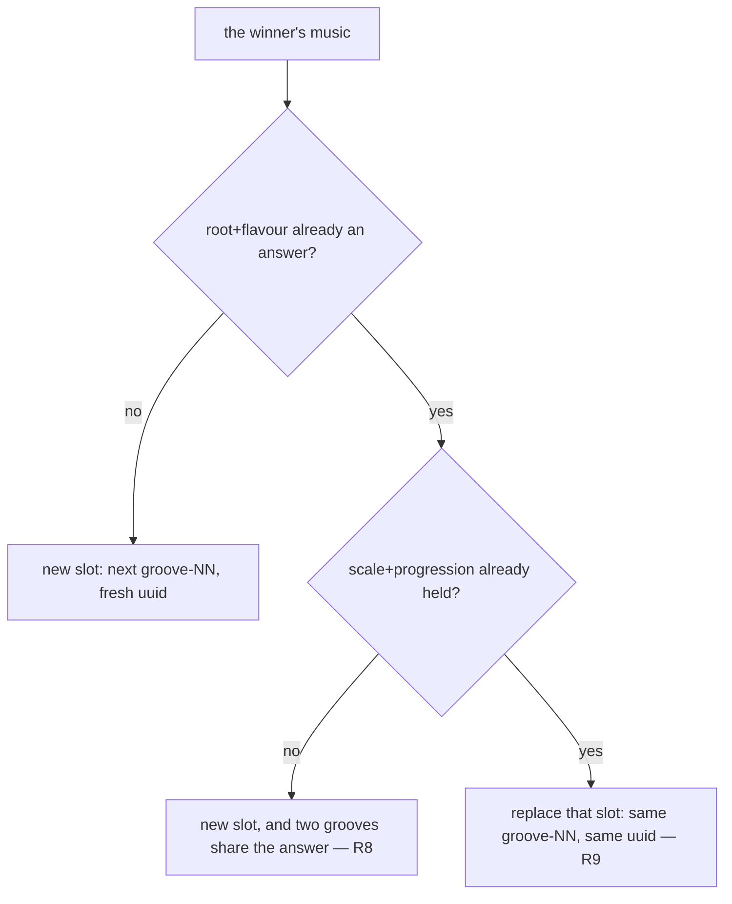

# Tech spec — Epic 2: A groove built to a standard's changes

PRD: [../prd/epic-2-a-groove-built-to-a-standards-changes.md](../prd/epic-2-a-groove-built-to-a-standards-changes.md) ·
Roadmap: [../roadmap.md](../roadmap.md)

## Approach

The epic adds no randomness and changes no draw. It adds a **reader** over the
draw that already exists — `matchTarget` scans `{ template, seed }` pairs,
calls `buildEvents`, and ranks what it finds against a wanted shape — and a
**second mint route** that takes one chosen pair, `mintSong`, whose whole reason
to exist separately is that it does not call `selectSeeds`. That is the design
decision the rest falls out of: the two guards R8 and R9 waive are inside
`selectSeeds`, so a route that never enters it waives them by construction
rather than by a flag, and `grooves:add` is bound by both exactly as it is today
with no code change and no regression risk (R11, AC9).

Three tracks can therefore run at once in Wave 1 — the matcher, the mint route,
and the narrowed uniqueness assertions — because the narrowing is proved on
**synthetic** entries rather than on the shipped catalogue. That matters more
than it sounds: the standard this epic ships will very probably collide with
nothing, so an assertion that waits for a real duplicate is an assertion that is
never exercised. Wave 2 is the mint itself, which is one unit because its
dependency is *output* and not a file: the instant the catalogue grows, the
count assertions and the three fixtures on both tiers go red together.

The pin is the last thing that happens, and it happens **after** the merge with
Epic 1 — not out of caution but because `heardIn.test.ts` asserts the shipped
`heard-in.json` against the shipped scales today, and a uuid key turns that red
until Epic 1's validation lands. `mintSong` therefore prints the entry rather
than writing it. See *The merge point* below.

## Architecture

### The moving parts

| Part | Where | What it is |
| :-- | :-- | :-- |
| the target | `match.ts` | `SongTarget` — a flavour and four scale degrees; validated against `buildHarmony`'s own shape rules |
| the scan | `match.ts` | `matchTarget`, over templates that declare the flavour, `buildEvents` only, no render |
| the read-only run | `match-cli.ts`, `npm run grooves:match` | prints the ranked list, writes nothing |
| the collision | `song.ts` | reads the existing catalogue's `scale\|progression` pairs and decides *new slot* or *replacement* |
| the mint | `song.ts`, `song-cli.ts`, `npm run grooves:song` | `buildEvents` → `renderCandidate` → `gateCandidate` → `writeBatch` |
| the replacement | `add.ts` | `writeBatch` gains `replacing?: string`; the catalogue is mapped, not appended |
| the narrowing | `catalogue.test.ts`, `grooves.generated.test.ts`, `select.test.ts` | answer uniqueness holds over the grooves that carry **no** song pin |
| the standard | `catalogue.json`, one mp3, the lock, both manifests, four fixtures | one groove, auditioned and signed off |
| the reshuffle | `selectGroove.ts`, `selectGroove.test.ts` | `ROTA_EPOCH` 4 → 5, and the two sweep strings recaptured |
| the document | `docs/music.md`, `docs.test.ts` | one routing-table row |

### The target is degree-relative, and that is the load-bearing choice

`chordsForScale` derives **exactly one chord per degree**: the first quality in
`QUALITIES`, richest first, whose every interval the scale already holds. So
inside one `(root, flavour)` the degree *determines* the quality, and the quality
determines the chord name. A target that named absolute chord names would
therefore be a target that named one root out of twelve — and Sam's line on the
key is the opposite of that: *"the key is the least of my problems … move it
wherever you have room."* R8's whole answer waiver exists because a transposition
is expected to be free.

So a target is a flavour and four degrees, and a candidate's
`music.progressionDegrees` is what it is compared against. That is the roadmap's
own assumption — *"the matcher scores against `progressionDegrees` and chord
qualities"* — read to its conclusion: within a flavour, degrees *are* the
qualities.

What a person writes is therefore a lead sheet in roman numerals. Summertime's
stand-in, i–ii°–V–i in harmonic minor, is `{ flavour: 'harmonic-minor',
degrees: [0, 1, 4, 0] }`, and the search returns `half-time` seed 154, which
plays `A♭mMaj7–B♭m7♭5–E♭7–A♭mMaj7`.

### Which targets are reachable at all

`buildHarmony` starts on the tonic, draws three or four chords from the
**non-tonic** degrees, never repeats a degree back to back, and pads a draw of
three with the tonic. Read as a predicate on the four degrees it can produce:

```
degrees[0] === 0            // always the tonic
degrees[1] !== 0            // drawn from `others`, which excludes the tonic
degrees[2] !== 0            // same
degrees[1] !== degrees[2]   // no back-to-back repeat
degrees[2] !== degrees[3]   // same; degrees[3] may be 0, from the pad
```

Anything else is **unreachable, not a near miss**, and `matchTarget` throws
naming the rule rather than scanning 36,000 seeds to report 3/4. That converts
the PRD's tonic-start assumption from a caveat into an error message, and it
covers three more cases the assumption did not name.

What is *not* checked here is whether the flavour's scale actually supports a
chord on a named degree — blues has six degrees and its idiom names chords on
three of them. Reachability of a *degree* is answered by the scan returning
nothing, which is R5a's path and costs a second.

### The two collisions, and why one is a strict subset of the other

`music.scale` is `scaleName(root, flavour)` — *"A♭ harmonic minor"*. The pair key
is `scale|progression`, so it **carries the root**. Therefore:



A pair collision **implies** an answer collision; the reverse does not hold. Two
consequences the PRD's flowchart leaves implicit and the implementation depends
on:

- **The replacement path needs no answer waiver.** It removes the groove whose
  answer it duplicates, so the answer count is unchanged and the narrowed
  assertion is not even consulted. R8's waiver fires exactly when the roots
  collide and the progressions do not.
- **A pair collision can match at most one existing groove**, because the shipped
  catalogue's pairs are unique — `catalogue.test.ts`'s
  `never repeats a scale-and-progression pair` is what says so. So "replace *that*
  groove" is well defined and needs no tie-break.

### Three assertions narrow, not two — and the pair rule narrows none

The PRD names `grooves.generated.test.ts:351` and `select.test.ts:109`. Read
against the tree there are three answer-uniqueness assertions, and they are not
the same kind of thing:

| Assertion | Subject | What happens |
| :-- | :-- | :-- |
| `grooves.generated.test.ts` — `asks a different question every day it can` | the **shipped** manifest | narrows: uniqueness over the unpinned grooves |
| `catalogue.test.ts` — `asks a different question every time — no repeated root and flavour` | the **shipped** catalogue | narrows the same way. **The PRD does not name it, and it is the one that actually goes red on the gen tier** |
| `select.test.ts` — `never repeats an answer — root and flavour are unique across the catalogue` | what `selectSeeds` **produces** | needs no exemption: a song mint never enters `selectSeeds`. Its *name* narrows — it claims "across the catalogue" and tests something smaller — and a comment records why |

And the two pair assertions (`catalogue.test.ts:143`, `select.test.ts:118`) stay
exactly as they are. **Replacement is the mechanism that keeps the pair invariant
absolutely true**, which is the strongest argument for replacement being the
collision path rather than a preference: the waiver R9 asks for is a waiver the
catalogue never has to hold.

The two shipped-data assertions cannot share code — an app test may not import
from `scripts/` — so both declare `duplicateAnswers` under that exact name and a
`grep -rn duplicateAnswers` finds the pair. That is the `DOMINANCE_RATIO`
precedent, applied to a function instead of a constant.

### A song pin is read, never inferred

The exemption asks one question: *does the shipped heard-in table hold an entry
under this groove's uuid?* A scale key can never equal a uuid, so no format check
is needed. Gen tier reads `readHeardIn()` and the catalogue's uuids; app tier
reads `HEARD_IN` and `GROOVES`. Before the merge with Epic 1 the table holds no
uuid key, the exemption set is empty, and both assertions behave exactly as they
do today — which is why Track C is green in Wave 1 and provable only against
synthetic input.

### The audition is not the render

`renderVoices` seeds its round-robin from the **groove's id** —
``roundRobin(`${options.id}:rr`)``. So `npm run grooves -- --template half-time
--seed 154 --out /tmp/x` renders under `audition-half-time-154` and picks
different sample alternates than the mint will under `groove-83`; a replacement
renders under the slot it takes over. Same notes, same timing, same mix,
different take.

**Audition to decide the changes; sign off on the committed render.** AC14 asks
for `/dev/grooves`, which plays the committed file, and that is the right place
for R16's listening sign-off. The audition's job is to answer "is this the
tune?", not "does this take sound good".

### The merge point

Both wave-1 epics rewrite `grooves.generated.ts`, and this epic also rewrites
`catalogue.json`, the lock and one mp3. The roadmap says the collision resolves
by re-running `npm run grooves -- --manifest-only`. There is a second, harder
coupling it does not name:

- `heardIn.test.ts` asserts `heardInFailures(readHeardIn(), scales)` is empty
  over the **shipped** table. `heardInFailures` rejects any key that is not a
  rendered scale name, so a uuid key makes the generator tier red.
- `cli.ts`'s `generate()` throws on the same check, so `npm run grooves` and
  `npm run grooves -- --manifest-only` both fail on a uuid key.
- `grooves.generated.test.ts`'s `names only scales a shipped groove carries`
  fails on the app tier for the same reason.

All three are Epic 1's to fix, in Epic 1's files. This epic does not touch
`heardIn.ts`, `heard-in.json` or those assertions, so **`mintSong` prints the
entry to add and writes nothing into `heard-in.json`.** The pin is one hand-made
line, applied at the merge — which is how Epic 1's own pins are written anyway.

Ordering, either way round:

- **Epic 1 lands first** — apply the pin line, run `--manifest-only`, commit.
- **This epic lands first** — the groove ships unpinned and shows the old scale
  line or nothing. Apply the pin when Epic 1 merges. **R16's pin and AC14's
  reveal are discharged at the merge, not inside this epic**, and a
  `/verify-epic` over Epic 2 alone should read them that way.

One file is edited by both epics: `src/features/daily-groove/data/grooves.generated.test.ts`.
Epic 2's edit is in the `the catalogue is a real rotation` describe; Epic 1's is
in `the heard-in table (quick 001)` describe. Textual conflict at worst,
semantically independent.

## Contracts

Frozen before any track starts.

**C1 and C2 are the hand-off to Epic 3**, and they are frozen against it, not
only against this epic's tracks. Epic 3 supplies a target and calls these; it
adds no search and no mint of its own. The two paragraphs headed *Frozen for
Epic 3* below are written to be quoted verbatim in Epic 3's spec — if that spec
needs a third shape, it says so before its wave starts rather than widening one
of these during it.

### C1 — the target, the candidate and the scan

```ts
// scripts/grooves/match.ts
import type { Root } from '../../src/lib/groove.ts'
import type { FeelTemplate, Flavour, MusicMeta } from './types.ts'

export const CHORDS_PER_TARGET = 4
export const MATCH_SEED_RANGE = 4000
export const MATCH_LIMIT = 10

export type SongTarget = {
  flavour: Flavour
  degrees: number[]   // four scale degrees, 0-based over `intervalsFor(flavour)`
  root?: Root         // a preference, ranked; never a requirement
}

export type CandidateScore = {
  chords: number      // 0..4 — target degrees the candidate plays, as a multiset
  order: number       // 0..4 — bars whose degree is the target's, in place
  root: number        // 1 when the candidate's root is `target.root`, else 0
  total: number       // chords * 100 + order * 10 + root
}

export type Candidate = {
  template: string
  seed: number
  qualifies: boolean
  score: CandidateScore
  music: MusicMeta
}

export type MatchOptions = {
  templates?: readonly FeelTemplate[]
  startSeed?: number  // default 1
  seeds?: number      // default MATCH_SEED_RANGE
  limit?: number      // default MATCH_LIMIT
}

export type MatchResult = {
  target: SongTarget
  templates: string[]  // the ids actually scanned, in registry order
  scanned: number      // templates.length * seeds
  qualifying: number   // how many of `scanned` qualified, not how many are listed
  candidates: Candidate[]
}

export function assertTarget(target: SongTarget): void
export function scoreCandidate(target: SongTarget, music: MusicMeta): CandidateScore
export function matchTarget(target: SongTarget, options?: MatchOptions): MatchResult
```

Frozen rules:

- **`qualifies` is `music.flavour === target.flavour && score.chords === 4`.**
  Nothing else. Order may differ (AC5b); three of four does not qualify (AC5a).
- **`total` is a lexicographic encoding, never read alone.** `chords` dominates
  `order` dominates `root`, and the parts are what R3 asks a reader to see. A
  reader comparing two candidates compares the parts.
- **Ranking** is `total` descending, then template registry index ascending, then
  seed ascending. Fully determined by the inputs, so AC2 is a property of the
  ordering and not of luck.
- **`candidates` is capped at `limit` and is never empty for a legal target on a
  non-empty template set.** When `qualifying === 0` the list is the nearest few
  by the same ranking (R5a), and the caller reads `qualifying`, not
  `candidates.length`, to know whether anything matched.
- **`templates` is the registry filtered by `t.flavours.includes(target.flavour)`**
  (R4). Empty after the filter throws, naming the flavour and the ids that do
  offer it.
- **`assertTarget` throws** on: a `degrees` length other than 4; a degree that is
  not a non-negative integer below `intervalsFor(flavour).length`; and each of
  the four shape rules in *Architecture*, each message naming `buildHarmony` as
  the rule's author.
- **`matchTarget` renders nothing and writes nothing.** Its only call into the
  generator is `buildEvents`.

**Frozen for Epic 3.** A target is **a flavour and four scale degrees, plus an
optional preferred root** — `{ flavour: Flavour; degrees: number[]; root?: Root }`,
`degrees` exactly four, 0-based over `intervalsFor(flavour)`, `degrees[0] === 0`.
It is never chord names, never a key signature, and never a bar count. Epic 3's
song-to-target step therefore produces two things a musician can state — *which
mode* and *which four roman numerals* — and one it may leave out, the root; the
optional root is a **preference that ranks**, never a filter that excludes, so a
skill that omits it still gets every root the search can reach. The reason the
shape is degrees and not names: `chordsForScale` derives exactly one chord per
degree, so within a flavour the degree already determines the quality, and a
degree target searches all twelve roots at once — which is what R8's
transposition freedom and Sam's *"move it wherever you have room"* both assume.
Because mode and style are not independent (a feel owns two to four modes), the
flavour a target names is also what narrows the styles, per R4 — Epic 3 reasons
over the pair by choosing the flavour and reading `MatchResult.templates` back.

### C2 — the song mint

```ts
// scripts/grooves/song.ts
export type SongPin = { track: string; artist: string }

export type MintSongOptions = {
  template: string
  seed: number
  pin: SongPin
  cataloguePath?: string
  outDir?: string
  manifestPath?: string
  lockPath?: string
  packDir?: string
  pack?: SamplePack
  templates?: readonly FeelTemplate[]
  heardIn?: HeardInTable
  gate?: GateFn
  mintUuid?: () => string
  log?: (message: string) => void
}

export type MintSongResult = {
  spec: GrooveSpec
  replaced: string | null   // the id whose slot was taken over, or null
  music: MusicMeta
  pinLine: string           // the heard-in.json entry to paste, keyed by uuid
}

export async function mintSong(options: MintSongOptions): Promise<MintSongResult>
```

- **`pin` is required and both fields must be non-empty.** That is R11 made
  structural: the waived route cannot be entered without naming a tune. An
  empty field throws before anything is read.
- **The slot decision**, in order: build the winner's music; walk the existing
  catalogue building each spec's music; if some spec's `scale|progression`
  equals the winner's, `replaced` is that id and the new spec keeps that id
  **and that uuid**; otherwise `replaced` is `null`, the id is the next
  `groove-NN` by `highestNumber`, and the uuid is freshly minted.
- **`mintSong` calls `selectSeeds` never.** Both waivers are the absence of that
  call.
- **The gate is `gateCandidate`, unchanged, all seven checks.** A failure throws
  naming the check and the measured value, and nothing is written — no mp3, no
  catalogue, no manifest, no lock (AC6).
- **`heard-in.json` is not written.** `pinLine` is the exact JSON line
  `"<uuid>": { "track": "…", "artist": "…" },` for a person to paste. See *The
  merge point*.
- Every write goes through `writeBatch`, so audio, catalogue, manifest and lock
  move together or not at all.

**Frozen for Epic 3.** The mint route takes **a chosen `{ template, seed }` and a
song pin**, and nothing else decides anything: it does not search, it does not
pick among candidates, and it does not choose between a new slot and a
replacement — the collision does that, and `MintSongResult.replaced` reports
which happened. `pin` is required, so a skill cannot reach the waived route
without naming a tune. The pin is returned as `pinLine` for a person to paste
into `heard-in.json`; Epic 3 reports it, and does not write it either.

### C3 — `writeBatch` learns to replace

```ts
// scripts/grooves/add.ts — exported for song.ts
export async function writeBatch(
  minted: readonly Minted[],
  existing: readonly GrooveSpec[],
  templates: readonly FeelTemplate[],
  paths: {
    cataloguePath: string
    outDir: string
    manifestPath: string
    lockPath: string
    heardIn: HeardInTable
    replacing?: string
  },
): Promise<void>
```

- `replacing` absent: `[...existing, ...minted]` — today's behaviour, character
  for character, and `addGrooves` passes no such key (AC9).
- `replacing` set: `existing.map(s => s.id === replacing ? minted[0].spec : s)`.
  Catalogue length is unchanged, **order is unchanged**, and the mp3 is written
  over `<id>.mp3`.
- `replacing` naming an id the catalogue does not hold throws before any write.
- `replacing` with `minted.length !== 1` throws. A replacement is one slot.
- Everything downstream is already correct for a replacement and must not be
  touched: `probeHeadDelaySeconds` re-probes the whole catalogue, `buildLock`
  re-hashes every file on disk, and `mergeLock` takes `next.grooves` wholesale —
  so the replaced slot's `sha256` and `bytes` move and no other entry does
  (R15, AC13).

### C4 — the exemption, declared twice under one name

```ts
// scripts/grooves/catalogue.test.ts
// src/features/daily-groove/data/grooves.generated.test.ts
// The same function under the same name on both sides of the tier boundary —
// `grep -rn duplicateAnswers` finds the pair. An app test may not import from
// scripts/, which is why there are two.
type AnswerRow = { id: string; uuid: string; answer: string }

function duplicateAnswers(rows: readonly AnswerRow[], pinned: ReadonlySet<string>): string[]
```

- Rows whose `uuid` is in `pinned` are dropped, then the remainder is checked for
  a repeated `answer`. One message per duplicate, naming both ids and the answer.
- `pinned` is built from the shipped heard-in table: `readHeardIn()` on the
  generator tier, the manifest's `HEARD_IN` on the app tier, intersected with the
  uuids that exist.
- **The exemption is answer-uniqueness only.** The dominance cap, the pair rule,
  the gate and every other assertion count a song-pinned groove exactly like any
  other (R13).

### C5 — the two commands

```
npm run grooves:match -- --flavour harmonic-minor --degrees 0,1,4,0 [--root A♭] [--seeds 4000] [--start 1] [--limit 10]
npm run grooves:song  -- --template half-time --seed 154 --track "Summertime" --artist "George Gershwin"
```

- Both parse through an exported pure `parseArgs`, and both `main`s are exported
  and take their options object, so no test spawns a process. That is
  `add-cli.ts`'s shape and this follows it.
- `grooves:match` prints one line per candidate — rank, template, seed,
  `qualifies`, the three score parts, root, scale, progression — plus a header
  saying how many were scanned and how many qualified, and, when none did, the
  sentence that none did before the list (R5a).
- `grooves:match` **cannot mint**. There is no flag for it. That is R5b and AC5c
  made structural rather than conditional.
- `grooves:song` prints the minted id, uuid, template, seed, the music, whether a
  slot was replaced and which, and then `pinLine`.
- Both script entries live in `package.json`, added by Track B against these
  frozen names.

## Tracks

### Track A — The matcher

- **Goal** — a target can be written down, validated, scanned for, and read back
  as a ranked list with its score broken out, without a byte being written.
- **Owns** — `scripts/grooves/match.ts` (new),
  `scripts/grooves/match.test.ts` (new), `scripts/grooves/match-cli.ts` (new),
  `scripts/grooves/match-cli.test.ts` (new)
- **Role** — `musician`. The scoring rule is the musical decision in this epic:
  what "all four of the target's chords, order may differ" means as a comparison,
  what a near miss is worth against an exact match in the wrong order, and
  whether a preferred root outranks a bar in the right place. A plumber would
  pick weights; this needs someone who knows which candidate a player would
  rather hear.
- **Depends on** — C1 only. It reads `buildEvents`, `allTemplates` and
  `intervalsFor`, all of which exist.
- **Parallel with** — B, C, E
- **Done when** — `npm run test:gen` is green, a fixed target over a fixed seed
  range returns the same candidates in the same order twice, an unreachable
  target throws naming `buildHarmony`, and `git status` is clean after the
  suite.

### Track B — The mint route and the replacement path

- **Goal** — a chosen `{ template, seed }` plus a song pin mints into a new slot
  or takes over a colliding one, through the same seven-check gate, and
  `grooves:add` behaves exactly as it does today.
- **Owns** — `scripts/grooves/add.ts`, `scripts/grooves/add.test.ts`,
  `scripts/grooves/song.ts` (new), `scripts/grooves/song.test.ts` (new),
  `scripts/grooves/song-cli.ts` (new), `scripts/grooves/song-cli.test.ts` (new),
  `package.json`
- **Role** — `implementer`, departing from the default for a `scripts/grooves/**`
  track. Nothing here decides what a groove sounds like: `writeBatch` maps an
  array instead of concatenating it, the collision test is a string comparison
  over an existing key, and the CLI is `add-cli.ts` with two more flags. The
  musical decisions in this epic are the scoring rule (Track A) and the standard
  (Track D).
- **Depends on** — C2, C3, C5. Every test passes `templates:`, a temp-directory
  catalogue and a stub pack, so it needs no groove that does not yet exist.
- **Parallel with** — A, C, E
- **Done when** — `npm run test:gen` is green, the committed `catalogue.json`,
  `grooves.lock.json` and `public/grooves/` are byte-identical after the suite,
  a replacement leaves the catalogue's length, order, ids and uuids alone, and a
  gate failure leaves the temp tree untouched.

### Track C — The narrowed uniqueness assertions

- **Goal** — answer uniqueness holds over the grooves that carry no song pin, on
  both tiers, proved on synthetic input; the pair rule and the dominance cap are
  recorded as **not** narrowing, with the reason.
- **Owns** — `scripts/grooves/catalogue.test.ts`,
  `scripts/grooves/select.test.ts`,
  `src/features/daily-groove/data/grooves.generated.test.ts`
- **Role** — `implementer`, departing from the default for its two
  `scripts/grooves/**` files. The work is transcribing one rule into two test
  files that cannot share it; the rule itself is settled in C4.
- **Depends on** — C4. It needs no mint: the shipped exemption set is empty until
  the merge, and every exception case is proved against fabricated rows.
- **Parallel with** — A, B, E
- **Runs** — `npm run test:all`; it owns files on both tiers.
- **Done when** — both tiers are green with the shipped catalogue unchanged, a
  fabricated duplicate between two unpinned grooves fails on both tiers, the
  same duplicate with either groove pinned passes on both, and
  `grep -rn duplicateAnswers` finds exactly two definitions.

### Track D — The standard, the mint and the reshuffle

- **Goal** — one named tune is in the catalogue, its four bars are the targeted
  changes, a person has heard it and said so, both tiers' arithmetic and all
  four fixtures agree, and the rota has reshuffled.
- **Owns** — `scripts/grooves/catalogue.json`,
  `public/grooves/groove-<NN>.mp3`, `scripts/grooves/grooves.lock.json`,
  `scripts/grooves/events.fixture.json`,
  `scripts/grooves/harmony.fixture.json`, `scripts/grooves/events.test.ts`,
  `scripts/grooves/uuidFreeze.test.ts`,
  `src/features/daily-groove/data/grooves.generated.ts`,
  `src/features/daily-groove/data/uuidFreeze.test.ts`,
  `src/features/daily-groove/lib/puzzle/selectGroove.ts`,
  `src/features/daily-groove/lib/puzzle/selectGroove.test.ts`
- **Role** — `musician`, with the app-tier arithmetic and the `ROTA_EPOCH` bump
  as its second, mechanical turn. Choosing the tune, deciding its flavour and its
  four degrees, reading the ranked list and signing off on what it sounds like
  are all musical judgements nothing else in this epic can make.
- **Depends on** — A (the scan), B (the mint route). It does **not** depend on C:
  the exemption set is empty until the pin lands, so C's narrowing changes
  nothing about what this track measures.
- **Parallel with** — nothing
- **Runs** — `npm run test:all`, `npm run grooves:verify`
- **Done when** — `npm run test:all` is green, `npm run grooves:verify` reports
  the new count, `git diff` on `grooves.lock.json` shows one added entry (or one
  changed entry for a replaced slot) and nothing else, both `uuidFreeze` tables
  are appended-to and never edited, and the epic's report carries the tune, the
  target, the ranked list and a listening verdict **in a person's own words**.
  A gate pass is not a sign-off.

### Track E — The routing table

- **Goal** — a reader who wants a groove built on a tune's changes is sent to the
  two commands rather than to `grooves:add`, and the document fails if they are
  renamed.
- **Owns** — `docs/music.md`, `scripts/grooves/docs.test.ts`
- **Role** — `musician`. The row it adds is a musical routing decision — where a
  person goes to aim a groove — and `docs/music.md` is the musician's document.
- **Depends on** — C5, the frozen command names. Nothing else.
- **Parallel with** — A, B, C
- **Done when** — `npm run test:gen` is green and `docs.test.ts` asserts the
  *Where to change what* table names both commands, so renaming one without
  updating the document is a red test.

## Execution waves

- **Wave 1 (parallel):** Track A, Track B, Track C, Track E
- **Wave 2:** Track D — needs A's scan and B's mint route to exist
- **Wave 3:** Integration — the merge with Epic 1, the pin, `--manifest-only`

Wave 1's four tracks own disjoint paths. Track D re-opens no file Wave 1 owns
except `package.json`, which it does not touch.

**Track D is one unit and cannot be two.** The mint and the arithmetic that
follows it depend on the mint's *output*, not on a file: the instant
`catalogue.json` grows, `grooves.generated.test.ts`'s `covers all 54 catalogued
grooves`, `eventsFixture.test.ts`'s deep-equal, `harmony.test.ts`'s
`finds a fixture covering every catalogue groove` and `events.test.ts`'s
`names the same music for every groove in the catalogue` all go red together, and
both tiers stay red until every one of them is brought forward. Splitting that
across a wave boundary is a wave that starts red.

## Implementation

### Track A — The matcher

#### Step A1 — a target is four degrees starting on the tonic

Covers: R1, AC5a

- **Test first** — `scripts/grooves/match.test.ts`: `assertTarget({ flavour:
  'harmonic-minor', degrees: [0, 1, 4, 0] })` does not throw. Each of
  `[0, 1, 4]`, `[0, 1, 4, 0, 2]`, `[1, 4, 0, 1]` (no tonic start),
  `[0, 0, 4, 0]`, `[0, 1, 0, 2]`, `[0, 1, 1, 2]`, `[0, 1, 4, 4]`,
  `[0, 1, 4, 7]` (degree out of range for a seven-note scale) and
  `[0, 1, 4.5, 0]` throws, and each message names both the offending degree and
  `buildHarmony`. Run it: fails, no such module.
- **Implement** — `scripts/grooves/match.ts`: `CHORDS_PER_TARGET`,
  `SongTarget`, `assertTarget`, reading `intervalsFor` from
  `../../src/lib/theory/scales.ts` for the degree bound.
- **Green when** — the legal target passes and all nine illegal ones throw by
  name.
- **Refactor** — none. `boundary.test.ts` scans every import specifier under
  `scripts/`; `../../src/lib/theory/scales.ts` is the shape the generator already
  uses, but re-run it.

#### Step A2 — a target may prefer a root without requiring one

Covers: R1

- **Test first** — `match.test.ts`: a target with `root: 'A♭'` and one without
  both pass `assertTarget`; a `root` that is not in `ROOTS` throws naming it.
- **Implement** — the `root` branch of `assertTarget`.
- **Green when** — all three behave.
- **Refactor** — none.

#### Step A3 — the scan reads the draw and writes nothing

Covers: R2, R6, AC1

- **Test first** — `match.test.ts`: run `matchTarget` over a two-template list
  and `seeds: 50`, and assert `scanned === 100`, `candidates.length <= MATCH_LIMIT`,
  and that every candidate's `music` deep-equals
  `buildEvents({ id: '', uuid: '', template, seed }, template).music`. Snapshot
  `mtimeMs` for `catalogue.json`, `grooves.lock.json`, the manifest and every
  file in `public/grooves/` before and after, and assert none moved. Run it:
  fails, `matchTarget` is not exported.
- **Implement** — `matchTarget`: filter templates by flavour, loop templates in
  registry order and seeds `startSeed … startSeed + seeds - 1`, call
  `buildEvents`, score, keep.
- **Green when** — the counts hold and no mtime moved.
- **Refactor** — none. Do not call `renderCandidate`, `loadPack` or
  `probeHeadDelaySeconds` anywhere in this file; the absence is the requirement.

#### Step A4 — four of four qualifies, three does not, order does not matter

Covers: R2, R5, AC2, AC5a, AC5b

- **Test first** — `match.test.ts`, against `scoreCandidate` with hand-made
  `MusicMeta`: target `[0, 1, 4, 0]` versus a candidate playing `[0, 1, 4, 0]`
  scores `chords: 4, order: 4` and qualifies; `[0, 4, 1, 0]` scores
  `chords: 4, order: 2` and qualifies (AC5b); `[0, 1, 3, 0]` scores `chords: 3`
  and does **not** qualify (AC5a); a candidate in a different flavour with all
  four degrees does not qualify. Multiset, not set: target `[0, 1, 4, 0]` against
  `[0, 1, 4, 2]` scores `chords: 3`, because the target wants the tonic twice.
  Then, for AC2, call `matchTarget` twice with identical arguments and
  `toEqual` the whole result, and assert the ranking of a hand-built
  three-candidate list is `total` desc, then template index, then seed.
- **Implement** — `scoreCandidate` and the comparator per C1.
- **Green when** — all six scoring cases and the two determinism assertions pass.
- **Refactor** — the multiset intersection is the only subtle line; give it a
  name rather than a comment.

#### Step A5 — the score is readable in parts

Covers: R3, AC3

- **Test first** — `match.test.ts`: every candidate carries `score.chords`,
  `score.order`, `score.root` and `score.total` as numbers; two candidates with
  the same `chords` and different `order` rank in that order; a target naming
  `root` gives `score.root: 1` to a candidate in that root and `0` otherwise, and
  changing only `root` never reorders two candidates whose `chords` differ.
  Assert `total === chords * 100 + order * 10 + root` for a sample of ten.
- **Implement** — the `CandidateScore` shape and `total`.
- **Green when** — the parts are individually readable and `total` is derived.
- **Refactor** — none.

#### Step A6 — only a template that declares the flavour is scanned

Covers: R4, AC4

- **Test first** — `match.test.ts`: over `allTemplates()`, a target in
  `lydian-dominant` (declared by `open-ballad` alone today) returns candidates
  whose `template` is only that id, and `result.templates` is `['open-ballad']`.
  Derive the expected id list from `allTemplates().filter(...)` rather than
  typing it, so a later style that adds the mode does not break the test for the
  wrong reason. A target whose flavour no supplied template declares throws,
  naming the flavour and listing the flavours that are offered.
- **Implement** — the filter, and the throw.
- **Green when** — both hold.
- **Refactor** — none.

#### Step A7 — nothing qualified, and it says so before it lists

Covers: R5a, AC5

- **Test first** — `match.test.ts`: a legal but unreachable target — a
  `harmonic-minor` shape whose degrees no seed in a 50-seed range plays —
  returns `qualifying: 0`, a non-empty `candidates`, and every candidate
  `qualifies: false`. Then in `match-cli.test.ts`: `main` over that target
  writes a line containing `none qualified` **before** the first candidate row,
  and returns `0` — a scan that found nothing is not an error.
- **Implement** — `qualifying` on the result; the CLI's header.
- **Green when** — the count is zero, the near misses are listed, and the order
  of the two lines is asserted.
- **Refactor** — none.

#### Step A8 — the read-only command cannot mint

Covers: R5b, R6, AC1, AC5c

- **Test first** — `match-cli.test.ts`: `parseArgs` accepts `--flavour`,
  `--degrees`, `--root`, `--seeds`, `--start`, `--limit` in both `--flag value`
  and `--flag=value` forms; an unknown flag throws naming the token; a flag
  without a value throws. Then assert **by source scan**, the way
  `boundary.test.ts` does, that `match.ts` and `match-cli.ts` between them import
  none of `./add.ts`, `./song.ts`, `./encode.ts`, `./catalogue.ts`'s
  `writeCatalogue`, `./manifest.ts`, `./lock.ts` or `node:fs`'s write functions,
  and that neither source contains the string `--mint`. Run it: fails, no CLI.
- **Implement** — `match-cli.ts` per C5.
- **Green when** — the parser cases pass and the source scan finds nothing.
- **Refactor** — none. The absence of a mint path is the assertion; do not add a
  flag "for convenience" later without reopening R5b.

### Track B — The mint route and the replacement path

#### Step B1 — `writeBatch` is exported and still appends

Covers: R9

- **Test first** — `scripts/grooves/add.test.ts`: import `writeBatch` from
  `./add.ts` and call it against a temp catalogue of three specs with one minted
  spec and no `replacing`; assert the written catalogue is the three followed by
  the one, in that order, and that the manifest holds four entries. Run it:
  fails, `writeBatch` is not exported.
- **Implement** — export `writeBatch` and its `Minted` type from `add.ts`. No
  behaviour change.
- **Green when** — the append case passes and every existing `add.test.ts` case
  still does.
- **Refactor** — none.

#### Step B2 — `replacing` maps the slot instead of appending

Covers: R9, R10, AC8

- **Test first** — `add.test.ts`: with `replacing: 'groove-02'` and one minted
  spec, the written catalogue has the same length and the same order, index 1
  carries the new `template`/`seed` and the **old** `id` and `uuid`, and every
  other entry is `toEqual` its input. `replacing: 'groove-99'` throws naming the
  id. `replacing` with two minted specs throws. Run it: fails, `replacing` is not
  a key.
- **Implement** — the `replacing` branch in `writeBatch` per C3.
- **Green when** — all four cases behave.
- **Refactor** — none.

#### Step B3 — a chosen pair mints into a new slot

Covers: R7

- **Test first** — `scripts/grooves/song.test.ts`: `mintSong` with a stub pack, a
  temp catalogue of three, a `mintUuid` counter and a pin returns
  `replaced: null` and a spec whose id is the next `groove-NN` and whose uuid is
  the counter's; the catalogue on disk has four entries; the mp3 exists;
  `music` is `buildEvents`' own. Run it: fails, no such module.
- **Implement** — `scripts/grooves/song.ts` per C2, reusing `renderCandidate`,
  `gateCandidate` and `writeBatch` from `add.ts`.
- **Green when** — the new-slot path writes everything and returns the spec.
- **Refactor** — none.

#### Step B4 — a gate failure writes nothing and says what it measured

Covers: R7, AC6

- **Test first** — `song.test.ts`: with `gate` stubbed to return
  `{ check: 'loudness', detail: 'measured -35.0 dBFS RMS, outside -29..-20' }`,
  `mintSong` rejects; the thrown message contains both the check and the detail;
  the temp `catalogue.json`, manifest, lock and out dir are byte-identical to
  before the call. Then assert the real `gateCandidate` is the default by
  omitting `gate` and stubbing the pack to render silence, and that it fails on
  `silence`.
- **Implement** — the gate call and the throw.
- **Green when** — nothing is written and both the check and the value appear.
- **Refactor** — none.

#### Step B5 — a duplicate answer no longer stops the mint

Covers: R8, AC7

- **Test first** — `song.test.ts`: build a temp catalogue holding a spec whose
  `root|flavour` a chosen `{ template, seed }` also produces but whose
  progression differs — the `TWINS` fixture in `add.test.ts` is the shape to
  copy, two templates with the same `flavours` list. `mintSong` returns
  `replaced: null`, the catalogue grows by one, and **both** grooves are in the
  written manifest with the same root and flavour. Assert the same
  `{ template, seed }` through `addGrooves` is refused, so the difference is the
  route and not the seed.
- **Implement** — nothing beyond B3. This step exists to prove the waiver is the
  absence of `selectSeeds`, and it is red before B3 for that reason.
- **Green when** — two grooves share the answer and the manifest holds both.
- **Refactor** — none.

#### Step B6 — a duplicate pair takes the slot over

Covers: R9, R10, R14, AC8, AC12

- **Test first** — `song.test.ts`: a temp catalogue holding a spec that produces
  exactly the winner's `scale|progression`. `mintSong` returns
  `replaced: 'groove-0N'`; the catalogue length is unchanged; that entry's `id`
  and `uuid` are unchanged and its `template`/`seed` are the winner's; every
  other entry is untouched; `<id>.mp3` was rewritten (its bytes differ from
  before); the lock entry for that id has a new `sha256` and every other lock
  entry is identical. Assert the collision is found by comparing
  `scale|progression` and not by comparing seeds.
- **Implement** — the collision walk in `mintSong` and the `replacing`
  hand-through.
- **Green when** — all seven assertions hold.
- **Refactor** — the collision walk builds events for the whole catalogue; it is
  the same loop `selectSeeds` opens with, and it stays local rather than being
  hoisted into a shared helper — `selectSeeds` is the function this route exists
  not to call.

#### Step B7 — the pin is required, and printed rather than written

Covers: R11

- **Test first** — `song.test.ts`: `mintSong` with `pin: { track: '', artist:
  'x' }` throws naming the empty field, before anything is read; the same for an
  empty artist. A successful mint returns a `pinLine` containing the minted uuid,
  the track and the artist, and `heard-in.json` — passed as a temp path — is
  byte-identical afterwards. Assert `song.ts`'s source names no write into
  `heard-in.json`.
- **Implement** — the validation and `pinLine`.
- **Green when** — both empties throw and the pin file is untouched.
- **Refactor** — none.

#### Step B8 — `grooves:add` is bound by both guards exactly as today

Covers: R11, AC9

- **Test first** — `add.test.ts`: over the `TWINS` fixture, `addGrooves` with a
  held catalogue whose answers are pairwise distinct never produces a duplicate
  `root|flavour` and never a duplicate `scale|progression`, and `AddOptions` has
  no key that waives either — assert `Object.keys` of a fully-populated
  `AddOptions` literal contains neither `pin` nor `replacing`. Assert
  `add.ts`'s `addGrooves` passes no `replacing` to `writeBatch`.
- **Implement** — nothing. This is the regression assertion for the design.
- **Green when** — both guards still refuse.
- **Refactor** — none.

#### Step B9 — the two commands exist and parse

Covers: R7, R11

- **Test first** — `scripts/grooves/song-cli.test.ts`: `parseArgs` accepts
  `--template`, `--seed`, `--track`, `--artist` in both flag forms; a missing
  `--track` or `--artist` throws naming it; a non-integer `--seed` throws;
  an unknown flag throws naming the token. `main` with a stubbed `mintSong`
  option object returns `0` and prints the id, the uuid, the music, the
  replacement (or `no slot replaced`) and `pinLine`; a throwing mint returns `1`
  and prints `nothing was written`.
- **Implement** — `song-cli.ts` per C5, and the two `package.json` entries:
  `"grooves:match": "node scripts/grooves/match-cli.ts"` and
  `"grooves:song": "node scripts/grooves/song-cli.ts"`.
- **Green when** — the parser cases pass and both exit codes are right.
- **Refactor** — none. Track A owns `match-cli.ts`; this track adds only its
  `package.json` line, against C5's frozen name.

### Track C — The narrowed uniqueness assertions

#### Step C1 — the app tier exempts a song-pinned groove

Covers: R12, AC10

- **Test first** — `src/features/daily-groove/data/grooves.generated.test.ts`:
  add cases for `duplicateAnswers` against fabricated rows — two unpinned rows
  sharing an answer returns one message naming both ids and the answer; the same
  two with the first pinned returns `[]`; with the second pinned returns `[]`;
  with both pinned returns `[]`; three unpinned rows sharing an answer returns a
  message that names all three. Then rewrite
  `asks a different question every day it can` to
  `asks a different question every day it can, unless a groove is pinned to a song`,
  asserting `duplicateAnswers(rows, songPinned)` is `[]` over the shipped
  `GROOVES`, where `songPinned` is the set of uuids `HEARD_IN` holds a key for.
  Run it: fails, `duplicateAnswers` does not exist.
- **Implement** — `duplicateAnswers` and `songPinned` as file-local helpers in
  that test, per C4, with the cross-tier comment naming its twin.
- **Green when** — the five synthetic cases and the shipped assertion pass.
- **Refactor** — none. Keep the helpers test-local: this is a rule about the
  catalogue's contents, not app logic, and putting it in `src/lib/` would put
  product policy in a leaf that must stay domain-only.

#### Step C2 — the generator tier's shipped-catalogue twin

Covers: R12, AC10

- **Test first** — `scripts/grooves/catalogue.test.ts`: the same five synthetic
  cases, then rewrite `asks a different question every time — no repeated root
  and flavour` the same way, with `songPinned` built from `readHeardIn()`
  intersected with the catalogue's uuids. Run it: fails, no such helper.
- **Implement** — the twin per C4, with a comment naming
  `grooves.generated.test.ts` as its pair and saying why they cannot share.
- **Green when** — both tiers report the same thing about the same catalogue.
- **Refactor** — none.

#### Step C3 — `select.test.ts` says what it is a property of

Covers: R12

- **Test first** — `scripts/grooves/select.test.ts`: rename
  `never repeats an answer — root and flavour are unique across the catalogue`
  to `never repeats an answer — root and flavour are unique in what selectSeeds
  produces`, unchanged in body, and add beside it an assertion that
  `SelectOptions` has no key that waives either guard and that `selectSeeds`'
  source names neither `pin` nor a heard-in read. Prove the rename is honest by
  asserting the test's subject is `selectSeeds(...)` output and not
  `readCatalogue()`.
- **Implement** — the rename and the new assertion. `select.ts` is not edited.
- **Green when** — `npm run test:gen` is green and the name matches the subject.
- **Refactor** — leave a one-line note recording that a song mint does not enter
  `selectSeeds`, so this assertion needs no exemption and gaining one would mean
  the route was wired wrong.

#### Step C4 — what the exemption does not cover

Covers: R12, R13, AC11

- **Test first** — `catalogue.test.ts` and `grooves.generated.test.ts`: assert
  that `dominanceFailure`'s counts are built from **every** groove, pinned or
  not, by feeding a fabricated set in which the only groove pushing a mode over
  the ratio is song-pinned and asserting the failure is still reported. In
  `catalogue.test.ts`, leave `never repeats a scale-and-progression pair`
  untouched and add a comment recording that a song mint replaces rather than
  duplicates, so this rule holds absolutely and its exemption would be a bug.
- **Implement** — nothing beyond the comments.
- **Green when** — both tiers still fail a genuine dominance breach and the pair
  rule is unweakened.
- **Refactor** — none.

### Track D — The standard, the mint and the reshuffle

#### Step D1 — the target, written down before anything runs

Covers: R16

- **Test first** — none. This is a musical decision, and the artefact is a
  paragraph in the epic's report: the tune, why it is reachable inside
  `docs/music.md`'s frozen harmony, the flavour, the four degrees as roman
  numerals and as indices, and any preferred root. Record what the target
  *cannot* say — `buildHarmony` starts on the tonic and repeats no degree back to
  back, so the four bars will **resemble** the tune and not transcribe it.
- **Implement** — `assertTarget` is run against it first; a target it throws on
  is a target that goes back to D1.
- **Green when** — `assertTarget` accepts it.
- **Refactor** — none.

#### Step D2 — the scan, and the refusal that is also an outcome

Covers: R2, R5a, R5b, R16

- **Test first** — none; the matcher's tests are Track A's.
- **Implement** — `npm run grooves:match -- --flavour … --degrees …`. Paste the
  ranked list into the report as it printed, including `scanned` and
  `qualifying`.
- **Green when** — at least one candidate qualifies. **If none does, this epic
  mints nothing** (R5b): report the nearest few and go back to D1 with a
  different tune or a different reading of its changes. That is a legitimate
  finish for this step, not a failure of the mechanism.
- **Refactor** — none.

#### Step D3 — the audition

Covers: R16

- **Test first** — none.
- **Implement** — `npm run grooves -- --template <id> --seed <n> --out /tmp/audition`,
  and listen. The question here is only *are these the changes* — the round-robin
  is seeded from the groove id, so this file is a different take of the same
  groove from the one the mint will write.
- **Green when** — a person can name the tune in the four bars.
- **Refactor** — none. Delete the temp directory; `--out` never writes into the
  repo, and `cli.ts` refuses `--template` without it.

#### Step D4 — the mint

Covers: R7, R8, R9, R15, R16, AC13

- **Test first** — none new; B3–B7 are the tests, and this step runs them against
  the real pack and the real catalogue.
- **Implement** — `npm run grooves:song -- --template <id> --seed <n> --track "…"
  --artist "…"`. Then `npm run grooves:verify`. Record whether a slot was
  replaced, and the printed `pinLine`, in the report.
- **Green when** — `grooves:verify` reports the new count and everything
  matching, and `git diff --stat` shows: `catalogue.json`, one mp3, the lock, the
  manifest — and nothing else. On a **new slot**: one added lock entry. On a
  **replacement**: one changed `sha256` and `bytes` under an unchanged `id`, and
  the catalogue's length unchanged.
- **Refactor** — none.

#### Step D5 — the four pins the mint moves

Covers: R14, AC12

- **Test first** — `npm run test:gen` is already red here; the four failures are
  the test.
- **Implement**, in this order:
  1. `scripts/grooves/uuidFreeze.test.ts` and
     `src/features/daily-groove/data/uuidFreeze.test.ts` — **append** the new
     `[id, uuid]` line to both tables from the block the failure prints. On a
     replacement, **change nothing**: the pair is unmoved, and an edit here would
     mean the replacement moved a uuid, which is the failure the table exists to
     catch (R14).
  2. `node scripts/grooves/eventsFixture.ts --write`, then read the diff — a new
     slot adds one `template:seed` key and rewrites none; a replacement removes
     one key and adds one, and rewrites none of the rest.
  3. `scripts/grooves/harmony.fixture.json` — add the new id's eight harmonic
     fields, or, on a replacement, change that one id's entry. That single
     changed entry is the review evidence for what the replacement cost.
  4. `scripts/grooves/events.test.ts` — add the new id's row to
     `PRE_EPIC_MUSIC`, or change the replaced id's row. The assertion demands the
     key set equal the catalogue's exactly.
- **Green when** — `npm run test:gen` is green.
- **Refactor** — none. Never regenerate a `uuidFreeze` table wholesale.

#### Step D6 — the app tier's arithmetic

Covers: R13, AC11

- **Test first** — `npm test` is red here on `covers all 54 catalogued grooves`;
  that is the test.
- **Implement** — move the count to the new one in
  `src/features/daily-groove/data/grooves.generated.test.ts`. Then re-measure the
  mode spread on both tiers and, **only if `dominanceFailure` reports**, widen
  `DOMINANCE_RATIO` in both `catalogue.test.ts` and `grooves.generated.test.ts`
  and record the new spread in the comment, per the standing rule those comments
  carry. One groove is unlikely to move a ratio of 2 over 54; if it does, say by
  how much.
- **Green when** — `npm test` is green.
- **Refactor** — none.

#### Step D7 — a person hears it

Covers: R16, AC14

- **Test first** — none. Nothing in this repo can hear.
- **Implement** — `npm run dev`, open `/dev/grooves`, find the new groove, play
  it end to end, and solve it. Record a verdict in the listener's own words: does
  it sound like the tune's changes, is the mode right, is the take good enough to
  ship. A rejection here goes back to D2 with the next qualifying candidate — the
  scan returns ten.
- **Green when** — a person has written the verdict down. **A gate pass is not a
  sign-off.**
- **Refactor** — none. The half of AC14 that says *"its reveal names the tune"*
  is discharged at the merge, when the pin lands — see *The merge point*.

#### Step D8 — the rota reshuffles

Covers: R17, AC15

- **Test first** — `src/features/daily-groove/lib/puzzle/selectGroove.test.ts`:
  change `expect(ROTA_EPOCH).toBe(4)` to `5` in both places. Run it: red on the
  epoch and on both sweep strings.
- **Implement** — `ROTA_EPOCH = 5` in `selectGroove.ts`, then recapture
  `SWEEP_OVER_THREE` and `SWEEP_OVER_SIXTEEN` from the failures. Both sweeps run
  over synthetic grooves, so they move because the epoch moved and for no other
  reason — which is exactly what the comment above them says to check.
- **Green when** — `npm test` is green and the epoch is one higher than it was.
- **Refactor** — none.

### Track E — The routing table

#### Step E1 — the document sends a tune to the two commands

Covers: R16

- **Test first** — `scripts/grooves/docs.test.ts`: assert the *Where to change
  what* table in `docs/music.md` holds a row whose left cell names building a
  groove on a named tune's changes and whose right cell contains both
  `grooves:match` and `grooves:song`; assert the section also states that the
  search picks a seed and changes no draw. Run it: fails, no such row.
- **Implement** — the row in `docs/music.md`, under *Where to change what*, and
  a sentence in *Harmony* recording that a progression can now be **searched
  for** — the four chords still come from `chordsForScale`, still start on the
  tonic and still never repeat a degree back to back, so what the search finds
  resembles a tune rather than transcribing it.
- **Green when** — `npm run test:gen` is green.
- **Refactor** — none. Add nothing to *What must never change*: this epic freezes
  nothing new.

## Integration and verification

The tracks meet at Track D, and the epic closes across the wave-1 merge.

1. **The generator tier.** `npm run test:gen`. The matcher, the song mint, the
   replacement path, both narrowed assertions, all four pins moved, the document.
2. **The app tier.** `npm test`. The new count, the narrowed answer assertion,
   the dominance cap, the bumped epoch and both recaptured sweeps.
3. **The lock.** `npm run grooves:verify` reports the new count and everything
   matching. `git diff grooves.lock.json` shows one added entry, or exactly one
   changed `sha256`/`bytes` under an unchanged `id`, and nothing else (AC13).
4. **The read-only claim, checked by hand.** With a clean tree, run
   `npm run grooves:match` over the epic's target and then `git status` — clean
   (AC1, AC5c).
5. **The pre-push set.** `npm run lint`, `npm run build`. `prebuild` runs
   `grooves:verify`, so a stale manifest fails the build.
6. **The demo path.** `/dev/grooves` → the new groove → play → solve. Its four
   bars are the targeted changes (AC14, first half).
7. **The merge with Epic 1**, in whichever order the two land:
   - merge, then paste `pinLine` into `scripts/grooves/heard-in.json` keyed by
     the new groove's uuid;
   - `npm run grooves -- --manifest-only` — this is the roadmap's named
     resolution for both epics' generated-file collision, and it is also the
     first run that can succeed with a uuid key in the table, because Epic 1's
     `heardIn.ts` accepts one;
   - `npm run test:all`, `npm run grooves:verify`;
   - `/dev/grooves` → solve the groove → **the reveal names the tune** (AC14,
     second half).

**Steps 1–6 close without Epic 1.** Step 7 is the only thing this epic owes that
it cannot finish alone, and it owes it because `heardIn.ts` is Epic 1's file, not
because the work is unfinished.

## Requirement coverage

| Requirement | Steps |
| :-- | :-- |
| R1 | A1, A2 |
| R2 | A3, A4, D2 |
| R3 | A5 |
| R4 | A6 |
| R5 | A4 |
| R5a | A7, D2 |
| R5b | A8, D2 |
| R6 | A3, A8, Integration 4 |
| R7 | B3, B4, B9, D4 |
| R8 | B5, D4 |
| R9 | B1, B2, B6, D4 |
| R10 | B2, B6 |
| R11 | B7, B8, B9, C3 |
| R12 | C1, C2, C3, C4 |
| R13 | C4, D6 |
| R14 | B6, D5 |
| R15 | D4, Integration 3 |
| R16 | D1, D2, D3, D4, D7, E1 |
| R17 | D8 |
| AC1 | A3, A8, Integration 4 |
| AC2 | A4 |
| AC3 | A5 |
| AC4 | A6 |
| AC5 | A7 |
| AC5a | A1, A4 |
| AC5b | A4 |
| AC5c | A8, Integration 4 |
| AC6 | B4 |
| AC7 | B5 |
| AC8 | B2, B6 |
| AC9 | B8 |
| AC10 | C1, C2 |
| AC11 | C4, D6 |
| AC12 | B6, D5 |
| AC13 | D4, Integration 3 |
| AC14 | D7 (the changes), Integration 7 (the reveal — discharged at the merge with Epic 1, by design; see *The merge point*) |
| AC15 | D8 |

## Assumptions

- **The pair key carries the root**, because `music.scale` is
  `scaleName(root, flavour)`. So a pair collision is a strict subset of an answer
  collision, and the two branches of the PRD's flowchart are not independent. The
  implementation reads them in the PRD's order and nothing depends on the
  subset relation, but a reader who assumes they are independent will
  over-estimate how often R9 fires.
- **`mintSong` prints the pin; it never writes `heard-in.json`.** Writing it
  would need `heardIn.ts` widened to accept a uuid key, which is Epic 1's R and
  Epic 1's file. Reversing this later is one flag on `song-cli.ts` and one write,
  once Epic 1 has landed.
- **The matcher's programmatic surface is `matchTarget`, not the CLI's stdout.**
  Epic 3 imports `match.ts` rather than parsing a table. No `--json` flag ships;
  adding one is three lines if Epic 3 wants it.
- **The scan range is 4000 seeds per template, stated in `MATCH_SEED_RANGE`**,
  mirroring `selectSeeds`' `DEFAULT_MAX_ATTEMPTS`. R4's filter usually leaves one
  to three templates, so a real scan is 4,000–12,000 candidates and about a
  second — the 36,000-candidate, 5.3-second figure in the PRD is the worst case
  of an unfiltered scan.
- **`duplicateAnswers` and `songPinned` are test-local on both tiers**, declared
  twice under the same names. They encode a policy about the catalogue's
  contents, not a domain fact, so `src/lib/` would be the wrong home for them
  under `docs/architecture.md`'s leaf rule — and the app tier could not import
  the generator's copy anyway.
- **The narrowed assertion in `grooves.generated.test.ts` is guarded by review,
  not by lint.** `data/` sits in no ESLint zone — `docs/architecture.md` names
  this as one of its four "review only" rows — so nothing mechanical stops that
  file reaching somewhere it should not. It reaches only `./grooves.generated`
  and `@/lib/...`, exactly as it does today.
- **`select.test.ts` gets a rename and a note rather than an exemption**, because
  a song mint does not enter `selectSeeds`. This is a deliberate reading of R12's
  "the shipped assertions that forbade it say so": there is nothing to exempt in
  a function that cannot produce the case. The assertion that *does* need the
  exemption on the generator tier is `catalogue.test.ts`'s, which the PRD does
  not name.
- **The audition and the mint are different renders**, because `renderVoices`
  seeds its round-robin from the groove id. Nothing about the notes, the timing
  or the mix changes; the sample alternates do. The sign-off is taken on the
  committed file.
- **A replacement edits one entry in `harmony.fixture.json` and one row in
  `events.test.ts`'s `PRE_EPIC_MUSIC`.** Both files exist to catch exactly that
  kind of movement, so both diffs are the review evidence for what the
  replacement cost, and both must be one entry wide.
- **`DOMINANCE_RATIO` is probably not touched.** One groove over 54 at a ratio of
  2 has little chance of moving the spread, but if it does, D6 widens both copies
  and records the new numbers — the standing rule those comments already carry.
- **This epic freezes nothing new in `docs/music.md`.** It adds no RNG stream, no
  voice, no flavour and no template, and it changes no draw. The only never-change
  entry it touches is the one that is *meant* to move: `ROTA_EPOCH`.

## Decision log

Settled architectural decisions. The sections above are the source of truth —
this records how they got there, and what each one cost. Append-only.

### Cycle 1 — 2026-09-06

**D1. The pin is printed, not written.** `mintSong` returns `pinLine` and leaves
`heard-in.json` alone, because `heardIn.ts`, `heardIn.test.ts` and
`grooves.generated.test.ts`'s heard-in assertions are all Epic 1's, and a uuid
key turns three of them red until Epic 1's validation lands. Cost: R16's pin and
half of AC14 are discharged at the wave-1 merge rather than inside this epic, and
one hand-made line has to be remembered. What it buys: two epics that genuinely
run in parallel, with no shared file between them but the one test file whose
edits are in different `describe` blocks.
Changed: C2, *The merge point*, Track D's done-condition, Integration 7, AC14's
coverage row.

**D2. Three answer assertions narrow, not the two the PRD names.**
`catalogue.test.ts`'s `asks a different question every time` is the generator
tier's shipped-catalogue assertion and is the one that actually goes red on a
waived mint; `select.test.ts`'s is a property of `selectSeeds`, which a song mint
does not enter, so it gets a rename and a note instead of an exemption. Cost: a
reviewer comparing the spec to the PRD finds one file the PRD did not name.
Changed: *Three assertions narrow*, C4, Track C, Steps C1–C3.

**D3. Neither pair assertion narrows, and that is the argument for replacement.**
Because a song mint replaces the groove it collides with rather than joining it,
`never repeats a scale-and-progression pair` stays absolutely true on both tiers.
Cost: none. Recorded because an implementer reading R9 as "a waiver" would look
for the pair exemption and not find one.
Changed: *Three assertions narrow*, Step C4.

**D4. Track D is one unit and cannot be split.** The mint's dependants — two
count assertions, `events.fixture.json`, `harmony.fixture.json`,
`events.test.ts`'s `PRE_EPIC_MUSIC` and both `uuidFreeze` tables — depend on the
mint's *output*, not on a file it writes, so a wave boundary between them is a
wave that starts red on both tiers. Cost: one track spans the generator and the
app tier and runs `npm run test:all`; its role is `musician` with the arithmetic
as a mechanical second turn, which is feature-25 Epic 1's Track G precedent.
Changed: Track D, *Execution waves*.

### Cycle 2 — 2026-09-06

**Q1. What vocabulary does a target speak — degrees, or chord names?**
Decision: **A) Four scale degrees, plus an optional preferred root.**
`chordsForScale` derives exactly one chord per degree, so within a flavour the
degree already determines the quality; a degree-relative target therefore
searches all twelve roots at once, which is what R8's answer waiver and Sam's
*"the key is the least of my problems"* both assume. Absolute chord names would
have pinned every search to one root out of twelve and made a transposition
unreachable. Cost of the choice: a person writing a target has to think in roman
numerals rather than in chord symbols, and a name-to-degree convenience layer —
the rejected option C — stays unbuilt.
Changed: nothing in the design moved; the shape was already specified this way.
`Contracts` gains a *Frozen for Epic 3* paragraph in C1 stating the shape as the
thing Epic 3 consumes, and the `Contracts` preamble now says the two contracts
are frozen against Epic 3 rather than only against this epic's tracks.

**Q2. How does a song mint escape the two guards?**
Decision: **A) A separate route, `mintSong`, that never calls `selectSeeds`.**
The waivers are the absence of a call rather than a flag, so `select.ts` is not
edited, `grooves:add` needs no code change, and AC9 is a regression assertion
instead of a new branch. `selectSeeds` keeps one meaning: the guarded path.
Cost: two mint routes exist, sharing `renderCandidate`, `gateCandidate` and
`writeBatch`, and a reader has to be told which one is which — Step C3's note in
`select.test.ts` is where that is written down for the next person to open the
file.
Changed: nothing in the design moved. `Contracts` gains a *Frozen for Epic 3*
paragraph in C2 stating what the mint route takes and what it refuses to decide.

**Both cycle-2 answers confirmed the recommended option, so no track, wave, step
or coverage row moved.** What changed is that two paragraphs are now written for
a sibling spec to quote, and the questions are settled rather than open.
