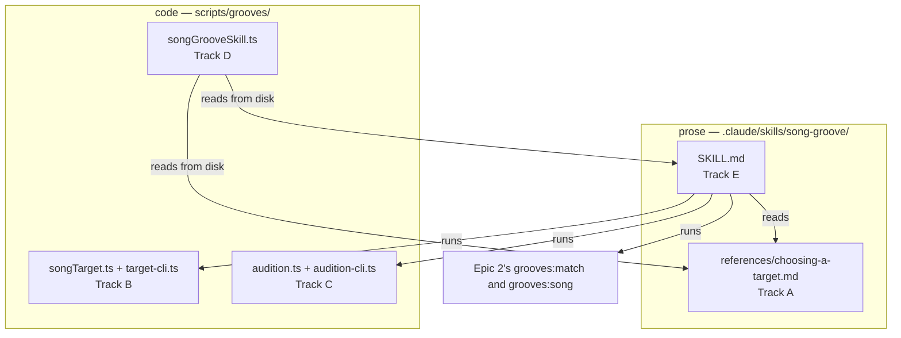

# Tech spec — Epic 3: `/song-groove "Summertime"` does it unattended

PRD: [../prd/epic-3-song-groove-does-it-unattended.md](../prd/epic-3-song-groove-does-it-unattended.md) ·
Roadmap: [../roadmap.md](../roadmap.md)

## Approach

The deliverable is a prompt, so the spec splits it into the part a test can hold
and the part only a person can. Three small generator modules carry everything
mechanical: `songTarget.ts` decides whether a proposed `{ style, flavour, four
degrees, optional preferred root }` is a thing `buildHarmony` could ever draw and
whether the scale carries a chord on each of those degrees, `audition.ts` renders
one `{ template, seed }` into a directory under `tmpdir()` and reports its
sha256, and `songGrooveSkill.ts` is a rules table plus a pure checker that reads
the two markdown files from disk and reports which clauses are missing — the
`scripts/agent-floor.ts` / `scripts/grooves/docs.test.ts` shape this repo already
uses to test documents. Each ships with a CLI, because a skill can only use what
a command exposes.

The prose then gets real red-green steps rather than faked ones: the guard lands
in wave 1 with its last cases failing, and every step in the two prose tracks
names the guard id it turns green. What no guard can check is said as "checked
against" instead — a clause's presence is testable, its musical correctness is
not.

**The skill stops in three ways, and the spec keeps them apart everywhere.** It
**asks** when the uncertainty is about the tune (R5, R5a); it **auditions
several** when the uncertainty is about which reachable target stands in for
changes it already knows (R6a, R6b); it **declines** when the frozen harmony
cannot reach the tune at all (R4, R7). Four guard ids carry the distinction —
`asks-when-unsure`, `auditions-several`, `declines-when-unreachable`,
`declines-when-no-candidate` — and a fifth, `asks-only-about-the-tune`, is what
stops the first from swallowing the second. Blurring them is the failure mode
this epic is most exposed to, because all three end with the skill handing
something back to a person, and a skill that asks about everything is a skill
nobody runs unattended.

**Verified by a test:** AC1, AC2 (Track B), AC5, AC5d (Track C), and the
*presence* of every clause behind AC3, AC3a, AC4, AC5e, AC5f, AC5g, AC6, AC8,
AC9, AC10 (Track D's guard over the shipped SKILL.md). **Verified by a person
running the skill:** AC3, AC3a, AC4, AC5a, AC5b, AC5e, AC5f, AC5g, AC6, AC7,
AC8, AC9, AC10, AC11 — the whole of §Integration. The overlap is deliberate: the
guard proves the skill *says* it writes nothing before the pause; only a run
proves it *did*.

**Epic 3's code imports nothing from Epic 2**, and Epic 2's spec records the same
property from its side. The skill reaches the matcher and the mint through their
commands, so Epic 2's module and symbol names never enter this epic's TypeScript.
What the two do share is Epic 2's **vocabulary**: a target is four scale degrees
plus an optional preferred root, spelled `--flavour`, `--degrees` and `--root` on
both commands, so the flags that validate a target are the flags that search for
it. Getting a command name wrong is caught by the guard's `unknownCommands`
check, which asserts every `npm run …` the skill names is a script in
`package.json`.

## Architecture



### What `buildHarmony` can actually reach

`buildHarmony` in `theory/harmony.ts` is the whole constraint, and reading it
gives a sharper rule than the PRD's wording. `others` excludes degree 0 outright,
`length` is `3 + floor(rng() * 2)`, and a length-3 draw is padded with the tonic.
So the reachable four-degree set is exactly:

- `[0, a, b, 0]` — a length-3 draw padded, where `a` and `b` are non-tonic
  degrees and `a ≠ b`; or
- `[0, a, b, c]` — a length-4 draw, where `a`, `b`, `c` are non-tonic and no two
  adjacent are the same degree; or
- `[0, 0, 0, 0]`, and only where `chordsForScale` yields nothing but a tonic.

**The tonic may be the first chord or the fourth, and never the second or the
third.** `i–iv–♭VII–i` is reachable; `i–iv–i–V` is not, and a great many
four-bar summaries of a standard land in the second shape. That is the rule the
musician's method has to write to, and the reason `targetProblems` carries a
`tonic-mid-progression` code of its own rather than folding it into
`no-chord-on-degree`.

Epic 2's `assertTarget` throws on the same five predicates, and the overlap is
deliberate rather than an oversight. `assertTarget` throws, mid-command; this
epic needs the answer *before* the matcher runs, as a list with the alternatives
named, so the skill's decline is a printed refusal a person can read rather than
a stack trace. Step B7 is what keeps the two honest: it grades this validator
against the shipped catalogue, which is the same oracle Epic 2's rule is graded
against.

### The one question Epic 2's target deliberately does not answer

Epic 2's spec says it in as many words — `assertTarget` checks the four shape
rules and the degree's range, and **not** whether the flavour's scale carries a
chord on a named degree. Blues declares six degrees and its idiom names chords on
three of them. Epic 2 answers that by the scan returning nothing, which costs a
few thousand `buildEvents` calls; this epic answers it up front, because AC2 asks
for exactly that check and because the skill's decline path is worth more when it
costs a second.

`chordsForScale` is what answers it, and it answers it once for all twelve roots.
Its general path admits a quality only when `scale.has((rootPc + i) % 12)` for
every interval, with `rootPc = base + offset`, so membership reduces to a
question about the flavour's interval set and the `base` cancels; the blues idiom
path indexes degrees by `degrees.indexOf(offset)`, which never sees the root at
all. **Which degrees carry a chord is a property of the flavour; only the
spelling depends on the root.** So `targetProblems` answers the degree question
for a target that names no preferred root, and uses `target.root ?? 'C'` purely
to spell the names its refusal message prints.

### Where the guard lives, and on which tier

`scripts/grooves/songGrooveSkill.ts`, tested by its neighbour, on the generator
tier (`npm run test:gen`). Two things settle it: `scripts/grooves/docs.test.ts`
already reads `docs/`, `specs/` and repo-root markdown from disk while importing
`allTemplates()`, which is exactly what the two registry-derived checks
`names-every-style` and `no-embedded-flavour-table` need; and
`scripts/tiers.test.ts` already asserts that a change under `.claude/` selects
the generator tier. A guard over `.claude/skills/song-groove/` running under
`npm run test:gen` is what the repo's own tier routing already says should
happen.

### The scratch render is the off-catalogue path, not `rehearse.ts`

`rehearse.ts` searches for *new* grooves through `addGrooves` and the gate.
Auditioning a known `{ template, seed }` is `cli.ts`'s `--template --seed --out`
path, whose `optionsFrom` already redirects the manifest and the lock into the
out directory and sets `heardIn: {}` — without that last one a one-spec render
throws, because `heardInFailures` fails every scale key no groove in the render
covers. `audition.ts` therefore builds a `CliArgs` and calls `optionsFrom` rather
than assembling `GenerateOptions` by hand: the "never writes into the repo"
policy stays in one place.

### The scratch render is a different take from the committed file

`optionsFrom` renders an off-catalogue pair under ``id: `audition-${template}-${seed}` ``
with `uuid: ''`, and `renderVoices` seeds its round-robin sample choice from that
id. So the audition and the file the mint later writes under `groove-NN` are the
same notes, the same timing and the same mix, drawn from different sample
alternates. Two consequences the spec carries rather than assumes:

- **AC5d holds, and its wording is "under the same id".** The id is derived from
  `{ template, seed }` and from nothing else — not from the directory, not from
  the clock — so two auditions of the same pair are byte-identical however many
  directories apart they are, which is what step C3 asserts and what makes
  abandoning the pause free. Scratch-to-mint is a different comparison and this
  epic never makes it.
- **AC5g is not a wording nicety.** The audition decides *which changes*; the
  committed render is what takes the listening sign-off `docs/music.md` asks
  for, and the run names it as such after the mint. Signing off on the scratch
  file would sign off a take that never ships.

## Contracts

Frozen before any track starts. Track A writes prose against the reachable-shape
rule while Track B implements it; Tracks D and E build against the check ids
without waiting for each other.

```ts
// scripts/grooves/theory/harmony.ts — export widened, no behaviour change
export type DegreeChord = { degree: number; midi: number[]; name: string }
export function chordsForScale(root: Root, flavour: Flavour): DegreeChord[]
```

```ts
// scripts/grooves/songTarget.ts
import type { Root } from '../../src/lib/groove.ts'
import type { Flavour } from './types.ts'

export const DEGREES_PER_TARGET = 4

export type ProposedTarget = {
  track: string
  artist: string
  style: string            // a registered template id
  flavour: Flavour         // a slug, as templates declare them
  degrees: number[]        // four scale degrees, 0-based over `intervalsFor(flavour)`
  root?: Root              // a preference the matcher ranks; never a requirement
}

export type TargetProblem = {
  code:
    | 'unknown-style'
    | 'flavour-not-declared'
    | 'wrong-length'
    | 'degree-out-of-range'
    | 'no-chord-on-degree'
    | 'not-tonic-first'
    | 'tonic-mid-progression'
    | 'degree-repeats'
  detail: string           // names the offending value and what was expected
}

export type ReachableDegree = { degree: number; name: string }

export function targetProblems(target: ProposedTarget): TargetProblem[]  // [] = reachable
export function reachableDegrees(flavour: Flavour, root?: Root): ReachableDegree[]
```

**Why `ProposedTarget` and not `SongTarget`.** Epic 2 exports a `SongTarget` from
`scripts/grooves/match.ts` — the same folder — and this epic imports nothing from
Epic 2, so one name would mean two types two files apart. The three fields the
two share are `flavour`, `degrees` and `root?`, named and typed identically on
purpose: `--flavour`, `--degrees` and `--root` mean the same thing on
`grooves:target` and on `grooves:match`, and a validated target is pasted
straight into the search. What this type adds is what the skill needs and the
matcher does not — the tune it is proposed for, and the style it is proposed
under, which the matcher derives itself by filtering the registry on the flavour.
`--track` and `--artist` are spelled as `grooves:song` spells them for the same
reason.

```ts
// scripts/grooves/audition.ts
import type { Groove } from '../../src/lib/groove.ts'

export type Audition = {
  dir: string        // under os.tmpdir(), never under the repo
  file: string       // the playable mp3
  id: string         // `audition-<template>-<seed>` — not the id the mint renders under
  sha256: string
  bytes: number
  seed: number
  groove: Groove     // uuid is '' — a scratch render has none
}

export async function auditionGroove(opts: {
  template: string
  seed: number
  into?: string      // a run label, resolved under tmpdir(); never an absolute path
  packDir?: string
  log?: (line: string) => void
}): Promise<Audition>
```

- **`into` is what puts two or three candidates side by side** (R6b, AC5e). It is
  a *label*, not a path: `auditionGroove` resolves it under `os.tmpdir()` and
  throws on anything that escapes, so every decision about where a scratch render
  may land stays inside this module and the skill never names an absolute path of
  its own. Each candidate still gets its own leaf directory under it, so no two
  renders share a manifest or a lock.
- **`id` is on the contract because AC5g depends on it.** It is what says the
  audition is not the committed take, and it is what makes C3's determinism
  assertion true across directories.

```ts
// scripts/grooves/songGrooveSkill.ts
import type { FeelTemplate } from './types.ts'

export type SkillCheck = { id: string; mustMatch: RegExp; why: string }

export const SKILL_CHECKS: SkillCheck[]           // over SKILL.md
export const METHOD_CHECKS: SkillCheck[]          // over references/choosing-a-target.md
export function templateChecks(templates: readonly FeelTemplate[]): SkillCheck[]
export function missingChecks(source: string, checks: readonly SkillCheck[]): string[]
export function unknownCommands(source: string, packageJson: string): string[]
```

**The two files the guard reads:**

- `.claude/skills/song-groove/SKILL.md` — frontmatter `name: song-groove`,
  `description`, `argument-hint: "<song title>" [artist]`
- `.claude/skills/song-groove/references/choosing-a-target.md`

**The two `package.json` scripts, added once by Track B:**

- `"grooves:target": "node scripts/grooves/target-cli.ts"`
- `"grooves:audition": "node scripts/grooves/audition-cli.ts"`

**The twenty-three SKILL.md check ids**, frozen so Track E can write to them.
The five in bold are the three stops and the two lines drawn between them; a
guard that let any two of them share one clause would be a guard that lets the
skill blur them.

| id | what the file must say | R / AC |
| :-- | :-- | :-- |
| `frontmatter` | `name: song-groove`, a description, an argument-hint | — |
| `never-commits` | never `git add`, `commit`, `push` or branch | R14 / AC10 |
| `never-touches-frozen` | names `templates/`, `src/lib/theory/names.ts`, `events.ts`, `MUSIC_LABEL` as unwritable | R13 / AC9 |
| `user-names-the-tune` | the user names the song; the skill never picks one | R1 |
| `dispatches-the-musician` | the musical call goes to the `musician` agent | R3 |
| `reads-the-templates` | flavours, tempo ranges and voices are read from `scripts/grooves/templates/`, never quoted from memory | R3 |
| `target-is-one-judgement` | style, flavour and the four degrees are solved together, not in sequence | R2 |
| `target-is-validated` | runs the target command; names the tonic-first rule and `chordsForScale` | R4 / AC1, AC2 |
| **`asks-when-unsure`** | a tune whose changes it cannot establish is a **question**: it names what it was unsure about and the readings it is between, and the run continues on the answer | R5 / AC3 |
| **`asks-only-about-the-tune`** | it asks only where the uncertainty is about the tune — an arrangement it cannot settle, a title naming two songs — because no amount of rendering resolves that; uncertainty about which reachable target to use is never a question | R5a / AC3a |
| **`auditions-several`** | more than one plausible target is neither chosen nor asked about: each goes through the matcher and all of them reach the audition, because which one sounds like the tune is a question about audio | R6a / AC3a, AC5e |
| `at-most-three-candidates` | the cap is three, each labelled with its target and why it was a candidate | R6b / AC5e |
| **`declines-when-unreachable`** | a target the frozen harmony cannot reach is a decline, not an empty search and not a question | R4 |
| **`declines-when-no-candidate`** | reports the nearest few, says none qualified, writes nothing | R7 / AC4 |
| `renders-each-to-scratch` | runs the audition command once per candidate and reports every path | R8 / AC5, AC5e |
| `pauses-before-promoting` | stops and waits; `catalogue.json`, the manifest, the lock and `public/grooves/` untouched until the person names one | R8, R8a, R8b / AC5, AC5a |
| `promotes-exactly-one` | exactly the candidate the person names is minted; the rest are discarded with the scratch directory | R8a / AC5f |
| `determinism-makes-the-pause-cheap` | an abandoned run costs a re-run: the same target under the same id gives the same seed and the same audio | R8c / AC5d |
| `committed-file-is-the-take` | the audition decided which changes; the committed render is a different take, and the run names *it* as the thing to sign off, after the mint | R8b1 / AC5g |
| `never-says-it-sounds-good` | no claim about how the groove sounds; the listening call is the person's | R9 / AC6 |
| `pin-at-promotion` | the pin is the line the mint prints, pasted into `heard-in.json` after the mint, keyed by the uuid the mint assigned, naming track and artist | R10 / AC7 |
| `pin-only-in-the-tunes-mode` | a groove whose mode is not the tune's gets no pin | R11 / AC7 |
| `report-names-five-things` | the report states style, mode, the four degrees, the seed and its score, each with a reason | R12 / AC8 |

**The six method check ids** over `references/choosing-a-target.md`:
`reachable-shape`, `flavour-must-be-declared`, `reads-the-templates`,
`when-to-ask-and-when-to-audition`, `when-to-decline`, `mode-is-the-tunes-mode`.
The fourth and the fifth are one rule split in two on purpose: the method file
has to say which uncertainty is a question and which is a listening pass, and a
single "when to refuse" section is exactly where those two collapse into each
other.

Plus two derived from the registry, applied to both files: `names-every-style`
(every `allTemplates()` id appears in the method file) and
`no-embedded-flavour-table` (for no registered template does either file list two
or more of that template's own flavour slugs on one line).

## Tracks

### Track A — how a tune becomes a target

- **Goal** — `.claude/skills/song-groove/references/choosing-a-target.md`: the
  method the `musician` follows to turn a named tune into a legal
  `{ style, flavour, four degrees, optional preferred root }`, the alternatives it
  carries to the audition when more than one target is legal, and the grounds on
  which it asks or declines.
- **Owns** — `.claude/skills/song-groove/references/choosing-a-target.md`
- **Role** — `musician`. This is the epic's musical core: which of nine feels a
  tune belongs to, which of that feel's two-to-four modes it is in, which four
  degrees stand in for its changes, and when two readings of a tune are both
  worth hearing are decisions no other role may make. It
  writes no file under `scripts/grooves/`, which keeps its own rule intact.
- **Depends on** — the reachable-shape rule and the `ProposedTarget` contract only
- **Parallel with** — Tracks B, C, D
- **Done when** — `missingChecks` reports no `METHOD_CHECKS` failure over it, and
  a reader can follow it from a tune title to a target without opening the
  generator.

### Track B — is this target reachable at all

- **Goal** — `targetProblems` and its CLI: a proposed target is either reachable
  or refused with a reason naming which degrees the scale does carry a chord on.
- **Owns** — `scripts/grooves/songTarget.ts`, `scripts/grooves/songTarget.test.ts`,
  `scripts/grooves/target-cli.ts`, `scripts/grooves/target-cli.test.ts`, the
  `export` on `chordsForScale`/`DegreeChord` in
  `scripts/grooves/theory/harmony.ts` and the cases added to
  `scripts/grooves/theory/harmony.test.ts`, **and `package.json`** (the two
  frozen `scripts` entries, added in step B0; no other track writes this file)
- **Role** — `implementer`, not `musician`, though it owns generator files. It
  makes no musical decision: it mechanises a rule `buildHarmony` already froze,
  and its correctness is settled by B7, which replays the shipped catalogue's own
  progressions through it. The musical judgement about *which* target to write is
  Track A's.
- **Depends on** — the `ProposedTarget` contract only
- **Parallel with** — Tracks A, C, D
- **Done when** — `npm run test:gen` green over `songTarget.test.ts`,
  `target-cli.test.ts` and `theory/harmony.test.ts`.

### Track C — one seed, rendered where the repo is not

- **Goal** — `auditionGroove` and its CLI: a playable mp3 under `tmpdir()`, its
  sha256 reported, up to three of them side by side under one run label, and
  nothing in the working tree touched.
- **Owns** — `scripts/grooves/audition.ts`, `scripts/grooves/audition.test.ts`,
  `scripts/grooves/audition-cli.ts`, `scripts/grooves/audition-cli.test.ts`
- **Role** — `implementer`. Same reasoning as Track B: it re-uses `cli.ts`'s
  existing off-catalogue path and decides nothing about what the audio contains.
- **Depends on** — the `Audition` contract, and Track B's `package.json` entry
  for `grooves:audition`, which is frozen above so C is not blocked on it
- **Parallel with** — Tracks A, B, D
- **Done when** — `npm run test:gen` green over `audition.test.ts` and
  `audition-cli.test.ts`, including the determinism case and the `--into` case.

### Track D — the guard over the two markdown files

- **Goal** — a checker that reports which required clauses a skill document is
  missing, unit-tested over fixtures, plus the cases that run it over the real
  files.
- **Owns** — `scripts/grooves/songGrooveSkill.ts`,
  `scripts/grooves/songGrooveSkill.test.ts`
- **Role** — `test-writer`. Its product is the assertions the two prose tracks
  are graded against; the small amount of code in it exists only so those
  assertions can be written at all, and the judgement it carries — *what must
  SKILL.md say* — is a test-authoring judgement, not an implementation one.
- **Depends on** — the twenty-three + six check ids in Contracts
- **Parallel with** — Tracks A, B, C
- **Done when** — every fixture case is green **and** step D8's two real-file
  cases are red, naming the ids the shipped files still fail. That redness is the
  epic's red step; see the wave note below.

### Track E — the skill

- **Goal** — `.claude/skills/song-groove/SKILL.md`: the run, its three stops —
  the question, the audition of up to three candidates, the decline — the pause,
  the promotion and the report.
- **Owns** — `.claude/skills/song-groove/SKILL.md`
- **Role** — `architect`. The deliverable is a procedure another agent executes,
  with frozen contracts and an ordered set of stops — the same artefact an
  architect writes, in a different template.
- **Depends on** — Track D's guard (it runs it to see red, then green), Track A's
  reference file (it links to it), Tracks B and C's commands, and Epic 2's
  shipped `grooves:match` and `grooves:song`, whose names and flags it reads off
  `package.json` and Epic 2's spec rather than from this one
- **Parallel with** — nothing
- **Done when** — `missingChecks` and `unknownCommands` report nothing over
  `SKILL.md`, and D8 is green.

## Execution waves

- **Wave 1 (parallel):** Track A, Track B, Track C, Track D — four disjoint file
  sets, no track needs another's output.
- **Wave 2:** Track E — needs D's guard to fail against, A's reference file to
  link, and B and C's commands to name.
- **Wave 3:** Integration — the two-tune demo, the abandoned run and the
  unreachable tune, run by a person.

**The wave-1 gate is red on purpose, in exactly two cases.** At the end of wave
1, `npm run test:gen` fails `songGrooveSkill.test.ts`'s two real-file cases,
because `.claude/skills/song-groove/SKILL.md` does not exist yet (Track A's half
goes green inside wave 1). Every other case in the epic is green. **Do not
weaken, skip or delete a check to close them** — Track E is what closes them, and
a guard trimmed to fit the prose it is guarding has stopped being a guard.

## Implementation

### Track B — is this target reachable at all

#### Step B0 — the two commands exist before anything calls them

Covers: R4, R8

- **Test first** — `scripts/grooves/target-cli.test.ts`: read `package.json` and
  assert `scripts['grooves:target']` and `scripts['grooves:audition']` are the
  two strings frozen in Contracts. Run it: fails with `expected undefined to be
  'node scripts/grooves/target-cli.ts'`.
- **Implement** — `package.json`: add both entries, verbatim from Contracts.
- **Green when** — the case passes. No other track writes `package.json`.
- **Refactor** — none.

#### Step B1 — the chord vocabulary of a scale is readable from outside

Covers: R4, AC2

- **Test first** — `scripts/grooves/theory/harmony.test.ts`: import
  `chordsForScale` and assert `chordsForScale('A♭', 'harmonic-minor')` contains
  exactly one `degree: 0` entry, that every entry's `name` parses through
  `pitchClassesOf` without throwing, and that no two entries share a degree. Run
  it: fails at import — `chordsForScale is not exported`.
- **Implement** — `scripts/grooves/theory/harmony.ts`: add `export` to
  `chordsForScale` and to the `DegreeChord` type. No other edit.
- **Green when** — the case passes and `harmony.fixture.json` is unchanged; a
  moved fixture would mean the edit was not an export.
- **Refactor** — none.

#### Step B2 — a style that does not declare the flavour is refused

Covers: R2, AC1

- **Test first** — `scripts/grooves/songTarget.test.ts`: for every template in
  `allTemplates()`, a `ProposedTarget` naming that template with a `FLAVOURS` slug
  the template does not declare yields a `flavour-not-declared` problem naming
  both the style and the flavour, and listing the flavours that style does
  declare; and a target naming one it does declare yields no problem of that
  code. Plus: an unregistered style id yields `unknown-style` listing the nine
  known ids. Run it: fails — `Cannot find module './songTarget.ts'`.
- **Implement** — `scripts/grooves/songTarget.ts`: `ProposedTarget`,
  `DEGREES_PER_TARGET`, and a `targetProblems` that resolves `target.style`
  through the templates registry and checks
  `template.flavours.includes(target.flavour)`.
- **Green when** — both cases pass across all nine templates.
- **Refactor** — none.

#### Step B3 — four degrees, each carrying a chord, the first one the tonic

Covers: R4, AC2

- **Test first** — `scripts/grooves/songTarget.test.ts`: three degrees yields
  `wrong-length` naming `DEGREES_PER_TARGET`; a degree at or above
  `intervalsFor(flavour).length`, or negative, or not an integer, yields
  `degree-out-of-range` naming the value and the bound; a degree inside that
  bound on which `chordsForScale` derives no chord yields `no-chord-on-degree`
  naming the degree — `blues`, whose idiom names chords on three of six declared
  degrees, is the case that makes this reachable; `degrees[0] !== 0` yields
  `not-tonic-first`; and `{ flavour: 'harmonic-minor', degrees: [0, 1, 4, 0] }`
  yields none of the four. Plus: `targetProblems` returns the same problems for
  that target with `root: 'A♭'`, with `root: 'E'`, and with no root at all —
  which degrees carry a chord is a property of the flavour. Run it: fails with
  `expected [] to contain { code: 'no-chord-on-degree' }`.
- **Implement** — `scripts/grooves/songTarget.ts`: build the degree set from
  `chordsForScale(target.root ?? 'C', target.flavour)`, check membership per
  degree, and compare `degrees[0]` against `0`.
- **Green when** — all five cases pass, the blues case included.
- **Refactor** — none. `target.root ?? 'C'` gets no comment; the root-invariance
  argument lives in §Architecture, where it can be re-derived.

#### Step B4 — the tonic sits first or fourth, never second or third

Covers: R4, AC2

- **Test first** — `scripts/grooves/songTarget.test.ts`: `[0, a, 0, b]` yields
  `tonic-mid-progression` naming the position; `[0, a, b, 0]` yields no problem;
  `[0, a, a, b]` yields `degree-repeats`; `[0, a, b, c]` with three distinct
  non-tonic degrees yields no problem. Run it: fails — `expected [] to contain
  { code: 'tonic-mid-progression' }`.
- **Implement** — `scripts/grooves/songTarget.ts`: encode the reachable set from
  §Architecture — degree 0 allowed at index 0 and index 3 only, adjacent degrees
  distinct — with the single exception that a scale whose `chordsForScale` yields
  only a tonic reaches `[0, 0, 0, 0]`.
- **Green when** — all four cases pass, plus a case asserting the degenerate
  all-tonic target is accepted for a scale with no non-tonic chord (and skipped
  with a named reason if no registered flavour produces one).
- **Refactor** — fold the three shape rules into one pass over the degree list;
  keep the three codes distinct, because the refusal message is what the musician
  reads.

#### Step B5 — a decline says which degrees the scale does carry

Covers: R4

- **Test first** — `scripts/grooves/songTarget.test.ts`:
  `reachableDegrees('harmonic-minor', 'A♭')` returns one `{ degree, name }` per
  entry of `chordsForScale`, sorted by degree, with degree 0 first; the same call
  with no root returns the same `degree` list and names spelled at `C`;
  `reachableDegrees('blues')` returns three entries, not six. Run it: fails —
  `reachableDegrees is not a function`.
- **Implement** — `scripts/grooves/songTarget.ts`: `reachableDegrees` maps
  `chordsForScale(root ?? 'C', flavour)` to `{ degree, name }`, sorted by degree.
- **Green when** — the three cases pass.
- **Refactor** — none. The `blues` case is the one that would go quietly wrong if
  the idiom path were ever folded into the general one; keep it named.

#### Step B6 — the command refuses loudly

Covers: R4, AC1, AC2

- **Test first** — `scripts/grooves/target-cli.test.ts`: `parseTargetArgs` turns
  `--style half-time --flavour harmonic-minor --degrees 0,1,4,0 --root A♭ --track
  "Summertime" --artist "George Gershwin"` into a `ProposedTarget`; `--root` is
  optional and its absence leaves `root` undefined; a missing required flag throws
  naming the flag; a `--degrees` value that is not four comma-separated integers
  throws naming the token; and `describeResult` for a target with problems returns
  a string containing each problem's `detail` and the `reachableDegrees` list as
  `degree: name` pairs, while a clean target's string says the target is reachable
  and echoes the `--flavour`/`--degrees`/`--root` flags to paste into
  `grooves:match`. Run it: fails — `Cannot find module './target-cli.ts'`.
- **Implement** — `scripts/grooves/target-cli.ts`, on `add-cli.ts`'s shape: pure
  `parseTargetArgs` and `describeResult`, and an `invokedDirectly` block that
  prints and exits 1 when `targetProblems` is non-empty, 0 otherwise.
- **Green when** — the cases pass.
- **Refactor** — none. The flag names are Epic 2's, not this epic's: `--flavour`,
  `--degrees` and `--root` are spelled as `grooves:match` spells them and
  `--track`/`--artist` as `grooves:song` does, so a validated target is a
  copy-paste into the search. Renaming one here silently un-does that.

#### Step B7 — everything the generator actually draws validates

Covers: R4, AC2

- **Test first** — `scripts/grooves/songTarget.test.ts`: for every spec in
  `readCatalogue()`, run `buildEvents` and build a `ProposedTarget` from its own
  `music.root`, `music.flavour`, `spec.template` and its
  `music.progressionDegrees`; assert `targetProblems` returns `[]` for all of
  them. Run it: fails for any target shape the validator got wrong.
- **Implement** — whatever B4's rule got wrong; the shipped catalogue is the
  oracle here, not a hand-written case.
- **Green when** — every shipped groove's own progression is judged reachable.
  This is the step that proves the validator agrees with `buildHarmony` rather
  than with the spec author.
- **Refactor** — none. Keep the case; a future change to `buildHarmony` should
  fail here first.

### Track C — one seed, rendered where the repo is not

#### Step C1 — a playable file, outside the repo

Covers: R8, AC5

- **Test first** — `scripts/grooves/audition.test.ts`: `auditionGroove({
  template: 'half-time', seed: 154 })` returns a `dir` that starts with
  `os.tmpdir()` and does not start with the repo root, a `file` that
  `existsSync`, `bytes > 0`, a 64-character `sha256`, an `id` of
  `'audition-half-time-154'`, and a `groove` whose `uuid` is `''` and whose
  `style` is `'half-time'`. Run it: fails — `Cannot find module './audition.ts'`.
- **Implement** — `scripts/grooves/audition.ts`: `mkdtempSync(join(tmpdir(),
  'song-groove-'))`, build a `CliArgs` of `{ only: [], seeds: [seed], template,
  outDir: join(dir, 'audio'), manifestOnly: false }`, pass it through
  `optionsFrom`, call `generate`, then `sha256File` and `statSync` on the one
  rendered mp3.
- **Green when** — the case passes.
- **Refactor** — none. Building `CliArgs` and calling `optionsFrom`, rather than
  assembling `GenerateOptions`, is what keeps `heardIn: {}` and the redirected
  manifest and lock in one place.

#### Step C2 — the working tree is untouched

Covers: R8, R8b, AC5, AC5a

- **Test first** — `scripts/grooves/audition.test.ts`: before and after an
  audition, hash `CATALOGUE_PATH`, `DEFAULT_LOCK_PATH` and
  `DEFAULT_MANIFEST_PATH`, and list `DEFAULT_OUT_DIR`; assert all four are
  identical across the call. Run it: fails with a changed manifest hash if the
  helper ever lets `generate` fall back to its defaults.
- **Implement** — nothing new if C1 is right; this case exists to pin it.
- **Green when** — all four comparisons pass.
- **Refactor** — none. Use the four exported constants, never a literal path:
  `scripts/grooves/boundary.test.ts` string-scans every `.ts` under `scripts/`
  and the manifest's path may appear only in `DEFAULT_MANIFEST_PATH`.

#### Step C3 — the same pair, under the same id, is the same audio

Covers: R8c, R8b1, AC5d, AC5g

- **Test first** — `scripts/grooves/audition.test.ts`: two `auditionGroove` calls
  with the same `{ template, seed }` return equal `sha256`, equal `bytes`, equal
  `id`, and equal `groove.scale`, `chord`, `progression` and `bpm`, in two
  different `dir`s. Plus the assertion that says *why*: `id` is
  `` `audition-${template}-${seed}` `` and contains no part of `dir`. Run it:
  fails if anything in the path reads the clock, `Math.random`, or the directory.
- **Implement** — nothing new; the assertions are the deliverable.
- **Green when** — both cases pass. This is the same byte-determinism
  `grooves.lock.json` and `rerender-check.ts` already rest on, asserted on a
  scratch path so the skill's pause can be abandoned for free. **The claim is
  scratch-to-scratch under the same id, and no more than that** — the mint
  renders under `groove-NN`, `renderVoices` seeds its round-robin from the id, so
  the committed file is a different take by construction. Nothing here asserts
  otherwise, and R8b1 is why.
- **Refactor** — none. If two encodes prove too slow for the tier, the fallback is
  a second call with `encode: false` compared on the returned PCM — but that is a
  different assertion and must be named as such in the test, not swapped in
  quietly.

#### Step C4 — the command prints the path to listen to

Covers: R8, AC5

- **Test first** — `scripts/grooves/audition-cli.test.ts`: `parseAuditionArgs`
  turns `--template half-time --seed 154` into `{ template, seed }`, accepts an
  optional `--into summertime`, rejects a non-integer seed naming the value, and
  `describeAudition` returns a string containing the file path, the sha256, the
  scale and the progression. Run it: fails — `Cannot find module
  './audition-cli.ts'`.
- **Implement** — `scripts/grooves/audition-cli.ts` on `verify-cli.ts`'s shape:
  pure parse and describe, plus an `invokedDirectly` block.
- **Green when** — the cases pass and `npm run grooves:audition -- --template
  half-time --seed 154` prints a path under `tmpdir()`.
- **Refactor** — none.

#### Step C5 — three candidates land side by side, and still outside the repo

Covers: R6b, R8, AC5e

- **Test first** — `scripts/grooves/audition.test.ts`: three `auditionGroove`
  calls with different `{ template, seed }` pairs and the same
  `into: 'summertime'` return three `dir`s that share a parent, each holding its
  own mp3 and its own manifest, and all three under `os.tmpdir()`. Then the
  guard: `into: '../../escape'`, `into: '/etc'` and an `into` containing a path
  separator each throw naming the value, and nothing is created. Run it: fails —
  `auditionGroove` ignores `into`.
- **Implement** — `scripts/grooves/audition.ts`: reject an `into` that is not a
  single safe path segment, then `mkdtempSync(join(tmpdir(), into, 'candidate-'))`
  after `mkdirSync` on the parent; with no `into`, `mkdtempSync(join(tmpdir(),
  'song-groove-'))` as C1 already does.
- **Green when** — the three-candidate case and all three escape cases pass.
- **Refactor** — none. `into` is a label rather than a path precisely so this
  rejection can be total: the skill has no way to name a directory, so it has no
  way to name the wrong one.

### Track D — the guard over the two markdown files

#### Step D1 — a missing clause is reported by id

Covers: R13, R14

- **Test first** — `scripts/grooves/songGrooveSkill.test.ts`: `missingChecks` over
  an in-memory fixture carrying every clause returns `[]`; over the same fixture
  with the never-commit sentence deleted it returns `['never-commits']`. Run it:
  fails — `Cannot find module './songGrooveSkill.ts'`.
- **Implement** — `scripts/grooves/songGrooveSkill.ts`: `SkillCheck`,
  `missingChecks(source, checks)` returning the ids whose `mustMatch` does not
  match, and the first two entries of `SKILL_CHECKS`.
- **Green when** — both cases pass.
- **Refactor** — none. This is `scripts/agent-floor.ts`'s shape on purpose; keep
  the two readable side by side.

#### Step D2 — every check says which requirement it stands behind

Covers: R13

- **Test first** — `scripts/grooves/songGrooveSkill.test.ts`: every entry in
  `SKILL_CHECKS` and `METHOD_CHECKS` has a kebab-case `id`, a `RegExp`
  `mustMatch`, and a `why` matching `/R\d/` and naming the PRD by path; ids are
  distinct within each table. Run it: fails on the first entry with no `why`.
- **Implement** — fill in `why` for the two existing entries.
- **Green when** — the cases pass, and they keep passing as later steps add
  entries.
- **Refactor** — none.

#### Step D3 — the two things the skill may never do

Covers: R13, R14, AC9, AC10

- **Test first** — a fixture missing the frozen-files sentence returns
  `['never-touches-frozen']`; a fixture naming only `templates/` and not
  `MUSIC_LABEL` returns it too. Run it: fails — the id is not in the table.
- **Implement** — add the `never-touches-frozen` check, requiring all four of
  `templates/`, `src/lib/theory/names.ts`, `events.ts` and `MUSIC_LABEL`.
- **Green when** — both fixtures behave as asserted.
- **Refactor** — none.

#### Step D4 — the run, the pause and the promotion

Covers: R1, R2, R3, R8, R8a, R8b, R8b1, R8c, AC5, AC5a, AC5d, AC5f, AC5g

- **Test first** — one fixture per id, each missing exactly that clause, for
  `user-names-the-tune`, `dispatches-the-musician`, `reads-the-templates`,
  `target-is-one-judgement`, `target-is-validated`, `renders-each-to-scratch`,
  `pauses-before-promoting`, `promotes-exactly-one`,
  `determinism-makes-the-pause-cheap` and `committed-file-is-the-take`; each
  returns exactly that id. Two of them carry the wordings the PRD's Cycle 3
  settled and are the reason those two are not just the old checks renamed: a
  fixture that renders **one** candidate fails `renders-each-to-scratch`, and a
  fixture that offers the scratch path as the thing to sign off fails
  `committed-file-is-the-take`. Run it: fails, ten ids unknown.
- **Implement** — add the ten checks to `SKILL_CHECKS`, worded from the Contracts
  table.
- **Green when** — each fixture returns exactly its own id, and the complete
  fixture returns `[]`.
- **Refactor** — none.

#### Step D4a — three stops, three clauses, no clause doing two jobs

Covers: R4, R5, R5a, R6a, R6b, R7, AC3, AC3a, AC4, AC5e

The one step in this epic whose failure mode is a guard that *passes*. Each of
the three stops is a separate id, and the assertions below are written so a
document that collapses two of them into one sentence goes red rather than
green.

- **Test first** — `scripts/grooves/songGrooveSkill.test.ts`, six fixtures and
  four cross-cases. The six: one fixture per id, each missing exactly that
  clause, for `asks-when-unsure`, `asks-only-about-the-tune`,
  `auditions-several`, `at-most-three-candidates`, `declines-when-unreachable`
  and `declines-when-no-candidate`; each returns exactly that id. The four
  cross-cases, which are the point: a fixture whose unsure branch **stops**
  rather than asking returns `['asks-when-unsure']`; a fixture that asks the
  person which of two reachable targets to use returns
  `['asks-only-about-the-tune']`; a fixture that *picks* one of two plausible
  targets itself returns `['auditions-several']`; and a fixture that treats an
  unreachable target as a question to the person returns
  `['declines-when-unreachable']`. Run it: fails, six ids unknown.
- **Implement** — add the six checks to `SKILL_CHECKS`. `asks-when-unsure` wants
  the ask *and* the continue; `asks-only-about-the-tune` wants the sentence that
  restricts the question to the tune; `auditions-several` wants "neither chooses
  nor asks"; the two decline checks want the word for a stop that has nothing to
  ask and nothing to hear.
- **Green when** — all six fixtures and all four cross-cases pass, and the
  complete fixture returns `[]`.
- **Refactor** — none. If a later cycle merges two of these ids, the four
  cross-cases are what will have to be deleted to do it, and deleting them is
  the visible cost.

#### Step D5 — the report, and when a pin may be written

Covers: R9, R10, R11, R12, AC6, AC7, AC8

- **Test first** — fixtures for `never-says-it-sounds-good`, `pin-at-promotion`,
  `pin-only-in-the-tunes-mode` and `report-names-five-things`; the last requires
  all five of style, mode, the four degrees, seed and score to be named, so a
  fixture listing four returns the id. `pin-at-promotion` requires the pin to
  come from the line the mint prints — Epic 2's `mintSong` returns `pinLine` and
  writes no `heard-in.json` of its own — so a fixture that composes the entry by
  hand returns the id too. Run it: fails, four ids unknown.
- **Implement** — add the four checks.
- **Green when** — each fixture returns exactly its own id.
- **Refactor** — none.

#### Step D5a — the method file has its own six, and two of them are one rule split

Covers: R2, R3, R4, R5a, R6a, R7, R11, AC1, AC2, AC3a

- **Test first** — `scripts/grooves/songGrooveSkill.test.ts`: one fixture per id
  over `METHOD_CHECKS`, each missing exactly that clause, for `reachable-shape`,
  `flavour-must-be-declared`, `reads-the-templates`,
  `when-to-ask-and-when-to-audition`, `when-to-decline` and
  `mode-is-the-tunes-mode`; each returns exactly that id. Plus the cross-case
  that is the reason the last two are separate ids: a method fixture with one
  "when to refuse" section covering both the tune it cannot read and the harmony
  it cannot reach returns **both** `when-to-ask-and-when-to-audition` and
  `when-to-decline`, not neither. Run it: fails, six ids unknown.
- **Implement** — populate `METHOD_CHECKS` with the six, `why` filled per D2.
- **Green when** — the six fixtures and the cross-case pass, and a fixture
  carrying every clause returns `[]`.
- **Refactor** — none. `SKILL_CHECKS` and `METHOD_CHECKS` share the `SkillCheck`
  shape and nothing else; a clause required of both documents is written twice on
  purpose, because the two files are read by different roles.

#### Step D6 — the skill quotes no table that can drift

Covers: R3, R13

- **Test first** — `templateChecks(allTemplates())` over a fixture listing
  `half-time`'s two flavour slugs on one line returns
  `['no-embedded-flavour-table']`; over a fixture that names the templates
  directory and no flavour list it returns `[]`; and over a method fixture naming
  eight of the nine template ids it returns `['names-every-style']`. Run it:
  fails — `templateChecks is not a function`.
- **Implement** — `templateChecks(templates)` builds the two registry-derived
  checks from the live template list.
- **Green when** — the three cases pass. This is `docs.test.ts`'s "gives every
  template the modes that template declares", inverted: the skill is required
  *not* to carry the table, because it reads it.
- **Refactor** — none.

#### Step D7 — every command the skill names exists

Covers: R6, R8, R8a

- **Test first** — `unknownCommands` over a fixture naming `npm run grooves:match`
  and a `package.json` fixture without it returns `['grooves:match']`; with it,
  `[]`. Run it: fails — `unknownCommands is not a function`.
- **Implement** — `unknownCommands(source, packageJson)`: extract every
  `npm run <name>` from the source, return those absent from `scripts`.
- **Green when** — both fixtures behave. Epic 2 has since frozen its two names —
  `grooves:match` and `grooves:song` — so this check has stopped being insurance
  against a guess and become a regression assertion: it is what goes red if Epic
  2 renames a command after Track E is written.
- **Refactor** — none.

#### Step D8 — the real files, and the epic's red step

Covers: R1–R14, AC3, AC3a, AC4, AC5e, AC5f, AC5g, AC6, AC8, AC9, AC10

- **Test first** — read `.claude/skills/song-groove/SKILL.md` and
  `.claude/skills/song-groove/references/choosing-a-target.md` from disk; assert
  each is over 2000 characters, that `missingChecks(source, [...SKILL_CHECKS,
  ...templateChecks(allTemplates())])` is `[]` for the first and
  `missingChecks(source, [...METHOD_CHECKS, ...templateChecks(...)])` is `[]` for
  the second, and that `unknownCommands` over `SKILL.md` and the real
  `package.json` is `[]`. Run it: **fails** — `ENOENT ... SKILL.md`, and Track A's
  half goes green as soon as Track A lands.
- **Implement** — nothing here. Tracks A and E are the implementation of this
  step.
- **Green when** — Track E lands. Until then this is the epic's red step and the
  wave-1 gate is expected to show it; see §Execution waves.
- **Refactor** — none.

### Track A — how a tune becomes a target

Prose. No step here claims a test failed first; each names what the section must
say and what checks it.

#### Step A1 — the nine feels, read rather than quoted

Covers: R2, R3

- **Says** — open `scripts/grooves/templates/` and read all nine files before
  deciding anything; each declares `tempoRange`, `subdivision`, `swing`,
  `flavours`, `voices` and `density`, and those declarations are the only source
  for them. Name each of the nine template ids with a one-line character sketch
  drawn from its own declared numbers, not from memory.
- **Checked against** — `names-every-style` and `no-embedded-flavour-table` in
  `templateChecks`, and `reads-the-templates` in `METHOD_CHECKS`. Adding a tenth
  template turns `names-every-style` red, which is the reminder to revisit this
  file.

#### Step A2 — style and mode are one decision

Covers: R2, AC1

- **Says** — a feel owns two to four flavours and can draw no other, so the pair
  is solved together: start from the tune's mode and see which feels declare it,
  or start from the tune's tempo and character and see which modes that leaves.
  State the reasoning for both halves, because Track E's report has to carry it.
- **Checked against** — `flavour-must-be-declared` in `METHOD_CHECKS`; and by
  `targetProblems`, which refuses the pair the method got wrong.

#### Step A3 — the shape the harmony can reach

Covers: R4, AC2

- **Says** — a target is **four scale degrees**, not four chord names: within one
  flavour `chordsForScale` derives exactly one chord per degree, so the degree
  already fixes the quality and a degree-relative target searches all twelve
  roots at once. Write the target as roman numerals and as indices, the way
  `grooves:match` takes it. The first degree is the tonic; the tonic may return
  as the fourth and may not appear as the second or the third; no two adjacent
  degrees are the same. Give the two reachable shapes, `[0, a, b, 0]` and
  `[0, a, b, c]`, and say plainly that a tune whose four-bar summary sits on the
  tonic in bar three has to be re-summarised or declined. Say too that a degree
  inside the scale is not automatically a degree that carries a chord — blues
  declares six and names chords on three — and that `grooves:target` is what
  answers that in a second rather than after a scan.
- **Checked against** — `reachable-shape` in `METHOD_CHECKS`, and by
  `npm run grooves:target`, which is the arbiter.

#### Step A4 — the root is a preference, not a decision

Covers: R2

- **Says** — the root is optional, and when named it is a *preference the matcher
  ranks*, never a filter: the search is degree-relative, so it covers every root
  already, and the tune's original key is not owed anything — the persona's line
  is *"the key is the least of my problems"*. Say when it is worth naming one
  (a tune a player is likely to recognise in its own key) and that a target is
  never abandoned for its root, because a target with no root is the same search
  with one fewer point of tie-break.
- **Checked against** — nothing automated. A person reading the method decides
  whether it is followable. `targetProblems` accepts a rootless target, which is
  the mechanical half of the same statement.

#### Step A5 — the question, and the alternatives that are not one

Covers: R5, R5a, R6a, R6b, AC3, AC3a

- **Says** — the line R5a draws, from the musician's side. **Ask** when the
  uncertainty is about the tune: an arrangement you cannot settle, a title that
  names two songs, a bar you genuinely cannot read. Name what you were unsure
  about and the readings you are between — a person answers that in a sentence,
  and no amount of rendering would have. **Do not ask** when the changes are
  known and what is unsettled is which reachable four-degree summary stands in
  for them best: hand back up to three targets instead, each with the sentence
  saying why it is a candidate, and let the audition decide. Give the shapes the
  alternatives usually take — a different four-bar summary, a different style
  whose flavours also reach the mode, the same degrees in an order the draw
  offers — and say that three is the cap, because a listening pass over more than
  three loops stops being one.
- **Checked against** — `when-to-ask-and-when-to-audition` in `METHOD_CHECKS`,
  and, from the skill's side, `asks-only-about-the-tune` and `auditions-several`.

#### Step A6 — when to decline

Covers: R4, R7, R11, AC4

- **Says** — the third stop, and the one with nothing to ask and nothing to hear:
  the frozen harmony cannot reach the tune at all. That is `grooves:target`
  exiting non-zero, or a search in which nothing qualifies. Say that a decline is
  a real answer — this catalogue cannot do this tune — and not a prompt for the
  person to try again with different words. Beside it, the pin's own stop: where
  the mode you would pin is not the tune's mode, Epic 1's rule says no pin may be
  written at all, and the groove is minted unpinned or not at all. Say why the
  bar is here rather than later: a wrong target does not fail loudly, it produces
  a real groove under a real tune's name.
- **Checked against** — `when-to-decline` and `mode-is-the-tunes-mode` in
  `METHOD_CHECKS`.

### Track E — the skill

Every step here is genuinely red-green: run
`npm run test:gen -- songGrooveSkill`, read the ids `missingChecks` reports, write
the section, watch the id disappear.

#### Step E1 — the file exists, in the shape the eleven others take

Covers: R1

- **Red** — D8 fails with `ENOENT`.
- **Write** — `.claude/skills/song-groove/SKILL.md`: frontmatter `name`,
  `description`, `argument-hint: "<song title>" [artist]`; `# Song groove`; a
  three-line intro; `## 0. Never commit, never write before the pause`; then
  numbered sections in the shape `quick-feature/SKILL.md` uses.
- **Green when** — D8 gets past `ENOENT` and reports ids rather than a read
  error; `frontmatter` and `never-commits` clear.

#### Step E2 — the user names the tune, the musician names the target

Covers: R1, R2, R3

- **Red** — `user-names-the-tune`, `dispatches-the-musician`,
  `reads-the-templates`, `target-is-one-judgement`.
- **Write** — `## 1. Resolve the tune` (the title comes from the argument; the
  skill never picks one; the artist disambiguates) and `## 2. Decide the target`
  — read all nine files in `scripts/grooves/templates/`, dispatch the `musician`
  with the tune, those declarations and
  `references/choosing-a-target.md`, and take back one to three
  `{ style, flavour, four degrees, optional root }` targets, each with the
  reasoning for it and, where there is more than one, the sentence saying why it
  is a candidate.
- **Green when** — the four ids clear.

#### Step E3 — the question, and the decline that is not one

Covers: R4, R5, R5a, AC1, AC2, AC3, AC3a

- **Red** — `target-is-validated`, `asks-when-unsure`,
  `asks-only-about-the-tune`, `declines-when-unreachable`.
- **Write** — `## 3. Check each target is reachable`: run
  `npm run grooves:target -- --style <id> --flavour <slug> --degrees <a,b,c,d>
  [--root <R>] --track "…" --artist "…"` once per target, and on a non-zero exit
  **decline** — print what it printed, say the frozen harmony cannot reach the
  tune, write nothing. Above it, the earlier and different stop: where the
  musician was not confident of the tune's own changes, `## 2` **asks**, naming
  what it was unsure about and the readings it is between, and the run continues
  on the answer. Write the line between them in as many words: the question is
  for uncertainty about the *tune*, because nothing that can be rendered resolves
  it; uncertainty about which reachable target to use is never asked about and is
  handled in `## 4`.
- **Green when** — the four ids clear.

#### Step E4 — the search, one run per target, and the second decline

Covers: R6, R6a, R6b, R7, AC3a, AC4, AC5e

- **Red** — `auditions-several`, `at-most-three-candidates`,
  `declines-when-no-candidate`.
- **Write** — `## 4. Search for a seed`: run Epic 2's match command —
  `npm run grooves:match -- --flavour <slug> --degrees <a,b,c,d> [--root <R>]`,
  the same flags `## 3` just validated, and **read its name off `package.json`
  and Epic 2's tech spec rather than from here** — once per target, and present
  the ranked candidates with each score's parts shown separately. Say plainly
  that where more than one target survived `## 3`, the skill neither chooses
  between them nor asks: each goes through the matcher and all of them go to the
  audition, capped at three, because which one sounds like the tune is a question
  about audio. Where nothing qualifies for any target, **decline**: report the
  nearest few, say none qualified, write nothing, and say the tune is one this
  catalogue cannot reach.
- **Green when** — the three ids clear and `unknownCommands` reports nothing.

#### Step E5 — render each, report, stop

Covers: R8, R8b, R8c, R12, AC5, AC5a, AC5d, AC5e, AC8

- **Red** — `renders-each-to-scratch`, `pauses-before-promoting`,
  `determinism-makes-the-pause-cheap`, `report-names-five-things`.
- **Write** — `## 5. Audition`: run `npm run grooves:audition -- --template <id>
  --seed <n> --into <run label>` **once per surviving candidate**, report every
  path, label each with its target and the sentence saying why it was a
  candidate, and stop. Say in as many words that `catalogue.json`, the manifest,
  the lock and `public/grooves/` are untouched until the person names one, that a
  run abandoned here leaves nothing to clean up, and that walking away costs a
  re-run rather than the work, because the same target under the same id gives
  the same seed and the same audio. The report states the style, the mode, the
  four degrees, the seed and its score, each with the reason behind it, for every
  candidate.
- **Green when** — the four ids clear.

#### Step E6 — promote exactly one, pin with the minted uuid, sign off the committed take

Covers: R8a, R8b1, R10, R11, AC5b, AC5f, AC5g, AC7

- **Red** — `promotes-exactly-one`, `pin-at-promotion`,
  `pin-only-in-the-tunes-mode`, `committed-file-is-the-take`.
- **Write** — `## 6. Promote`: only after the person **names one candidate**, in
  the same session, mint that one through Epic 2's route —
  `npm run grooves:song -- --template <id> --seed <n> --track "…" --artist "…"` —
  and say that exactly one is promoted per run and the rest are discarded with
  the scratch directory. `mintSong` **prints** the pin line and writes no
  `heard-in.json` of its own, so the next move is to paste that line into
  `heard-in.json`: it is already keyed by the uuid the mint assigned, which is
  the uuid a scratch render never had. Where the mode is not the tune's mode, no
  pin is written; that was decided in section 2 and is restated here. Close the
  section with what the audition did *not* settle: the committed render under
  `groove-NN` is a different take from the scratch file — `renderVoices` seeds its
  round-robin from the groove id — so name the committed file, in
  `public/grooves/`, as the thing to listen to and sign off.
- **Green when** — the four ids clear.

#### Step E7 — what the skill never says, and never touches

Covers: R9, R13, R14, AC6, AC9, AC10

- **Red** — `never-says-it-sounds-good`, `never-touches-frozen`.
- **Write** — the `## 0.` section gains the frozen list: no file under
  `scripts/grooves/templates/`, no edit to `src/lib/theory/names.ts` or
  `events.ts`, nothing added to `MUSIC_LABEL`'s draw, no new style and no new
  mode; and no `git add`, `commit`, `push` or branch, at any point. A closing
  `## 7. Report` section says the skill never reports that a groove sounds good —
  the listening sign-off is the person's, per `docs/music.md`.
- **Green when** — both ids clear and D8 is green in full.

## Integration and verification

The epic is proven by one person running the skill four times, and the three
stops are what those four runs are chosen to separate. Everything before this
proves the parts.

- **I1 — the suites.** `npm run test:all`, `npm run lint`, `npm run build` and
  `npm run grooves:verify` all green with D8 green. *(Covers the wave-1 red step
  being closed.)*
- **I2 — a run abandoned at the pause, with more than one candidate.**
  `/song-groove "<tune A>"` — a tune whose changes are known but which more than
  one four-degree summary could stand in for — through to the audition, then walk
  away. Two or three paths are reported, each labelled with its target and why it
  was a candidate; each is under `tmpdir()` and plays; `git status` is clean. The
  skill did not ask which target to use. *(AC5, AC5a, AC5e, AC3a, AC3's tree
  clause.)*
- **I3 — the same tune again.** Re-run it. The reported `{ template, seed }` list
  is the same and each audition's sha256 matches the one I2 printed for the same
  pair. *(AC5d, R8c.)*
- **I4 — promote one of them.** Name one candidate. `git status` shows
  `catalogue.json`, the manifest, `grooves.lock.json`, **one** new
  `public/grooves/*.mp3` and `heard-in.json`, and nothing else — no trace of the
  other candidates; the new uuid is a key in `heard-in.json` whose flavour and
  four degrees are the tune's; the run names the committed mp3, not a scratch
  path, as the thing to sign off; `git diff --name-only` names no file under
  `scripts/grooves/templates/`, `src/lib/theory/names.ts` or
  `scripts/grooves/events.ts`; `git log` is unchanged. *(AC5b, AC5f, AC5g, AC7,
  AC9, AC10.)*
- **I5 — a second tune in a different mode**, promoted the same way. Both grooves
  are in the catalogue and pinned. *(AC11.)*
- **I6 — a tune the frozen harmony cannot reach** — one whose four-bar summary
  sits on the tonic in bar three, so `grooves:target` exits non-zero. The skill
  **declines** before rendering anything, does not ask, and nothing is written.
  *(AC11, R4, R7.)*
- **I7 — a tune the skill cannot pin down.** A title that names two songs, or a
  standard with two common arrangements. The skill **asks**, naming what it was
  unsure about and the readings it is between, the working tree is unchanged
  while it waits, and answering the question carries the run on into `## 3`
  rather than requiring a re-invocation. *(AC3, AC3a, R5, R5a.)*
- **I8 — read the two reports.** Neither contains a claim about how the groove
  sounds; each states the style, the mode, the four degrees, the seed and its
  score with a reason. *(AC6, AC8.)*
- **I9 — the listening pass.** A person plays both promoted grooves in
  `/dev/grooves`, which is the **committed** render and not the audition.
  Nothing in this epic reports that they sound good; the acceptance of I4 and I5
  is graded **partly** until that pass happens, per `docs/music.md`.

**I2, I6 and I7 are the same requirement seen three ways**, and running only one
of them proves nothing about the other two: a skill that asks in all three cases
passes I7 and fails the epic.

## Requirement coverage

| Requirement | Steps |
| :-- | :-- |
| R1 | E1, E2, D4 |
| R2 | A1, A2, A4, B2, E2, D4, D5a |
| R3 | A1, E2, D4, D5a, D6 |
| R4 | B1, B3, B4, B5, B6, B7, A3, A6, E3, D4a, D5a, I6 |
| R5 | A5, E3, D4a, I7 |
| R5a | A5, E3, E4, D4a, D5a, I2, I7 |
| R6 | E4, D7 |
| R6a | A5, E4, D4a, D5a, I2 |
| R6b | A5, C5, E4, E5, D4a, I2 |
| R7 | A6, E4, D4a, D5a, I6 |
| R8 | C1, C2, C4, C5, E5, D4, I2 |
| R8a | E6, D4, I4 |
| R8b | C2, E5, D4, I2 |
| R8b1 | C3, E6, D4, I4, I9 |
| R8c | C3, E5, D4, I3 |
| R9 | E7, D5, I8 |
| R10 | E6, D5, I4 |
| R11 | A6, E6, D5, D5a |
| R12 | E5, D5, I8 |
| R13 | E7, D3, D6, I4 |
| R14 | E1, E7, D3, I4 |
| AC1 | B2, A2, D5a |
| AC2 | B1, B3, B4, B7, A3, D5a |
| AC3 | A5, E3, D4a, I7 |
| AC3a | A5, E3, E4, D4a, D5a, I2, I7 |
| AC4 | A6, E4, D4a, D5a, I6 |
| AC5 | C1, C2, E5, D4, I2 |
| AC5e | C5, E4, E5, D4a, I2 |
| AC5f | E6, D4, I4 |
| AC5g | C3, E6, D4, I4, I9 |
| AC5a | C2, E5, D4, I2 |
| AC5b | E6, D5, I4 |
| AC5d | C3, E5, D4, I3 |
| AC6 | E7, D5, I8 |
| AC7 | E6, D5, I4 |
| AC8 | E5, D5, I8 |
| AC9 | E7, D3, I4 |
| AC10 | E1, E7, D3, I4 |
| AC11 | I5, I6 |

## Assumptions

- **The two markdown files are the whole skill.** A `references/` subfolder is
  what `.claude/skills/writespec/` already does, and splitting the musical method
  out gives the `musician` a file it owns without touching the procedure the
  `architect` writes. Reversing this is moving prose between two files.
- **The guard runs on the generator tier.** It needs `allTemplates()` for two of
  its checks, and `scripts/tiers.test.ts` already routes a `.claude/` change to
  that tier. `scripts/agent-floor.ts` is the competing precedent — a `.claude/`
  guard on the tooling tier — and it wins only for a checker that needs no
  generator import, which this one does.
- **The target's root is optional, and AC2 is read through that.** AC2 says the
  four chords are checked "for the named root", written before Epic 2 settled
  that a target is four degrees plus an *optional* preferred root. `targetProblems`
  therefore answers AC2's question for a rootless target too, on the ground argued
  in §Architecture: which degrees carry a chord is a property of the flavour and
  the root only spells them. If that reading is wrong, the fix is one required
  field, not a new module.
- **The skill runs `grooves:target` once per candidate target rather than taking a
  list.** Up to three commands is a shorter contract than a batch flag, and the
  decline stays one per target. A `--targets` flag is a later convenience,
  not a missing piece.
- **Two full renders in `audition.test.ts` are affordable.** The generator tier
  runs at a 30s timeout with four workers and already renders audio in several
  suites; step C3 says what to do if the measurement says otherwise.
- **`docs/skills.md` gains no entry.** The PRD does not ask for one, the `Skill`
  tool lists a skill by its own description, and inventing an index row is scope
  this spec did not have. A follow-up ticket can add it.
- **The demo tunes are chosen when the epic is built.** The PRD says which tunes
  are worth minting is a judgement exercised one run at a time; naming two here
  would make a musical decision with no matcher in front of it. The same goes for
  I7's ambiguous title and I2's multi-target tune — what the spec fixes is the
  property each run has to show, not the repertoire.
- **Epic 2's command names and flags are read, not guessed.** Steps E4 and E6 say
  so and step D7 makes a wrong name a test failure, which is the whole mitigation
  for this epic's only cross-epic coupling. The flags are unguarded by comparison:
  `unknownCommands` reads command names and not their arguments, so a renamed
  `--degrees` would be caught by a person running the skill and by nothing else.

## Decision log

### Cycle 1 — 2026-09-06

**Q1. How does a markdown deliverable get a red step without faking one?**
Decision: **A guard track lands first and its real-file cases fail.** Track D
ships `songGrooveSkill.ts` in wave 1 with eighteen + six named checks; its last
step reads the two files from disk and goes red because they do not exist. Every
step in Tracks A and E then names the id it turns green. The alternative —
writing the prose and asserting it afterwards — produces a guard shaped to fit
whatever got written, which is not a guard.
Changed: Tracks D and E, §Execution waves' red-gate note, steps D1–D8 and E1–E7.

**Q2. Do Tracks B and C take the `musician`, since they own `scripts/grooves/`
files?**
Decision: **No — `implementer`.** The repo's default is that a generator track
takes the musician, and it holds because generator changes are usually musical.
These two are not: `targetProblems` mechanises a rule `buildHarmony` already
froze, and `auditionGroove` re-uses `cli.ts`'s existing off-catalogue path. The
musical decision in this epic is which target to write, and it is Track A's,
where the musician sits. Step B7 is what makes the departure safe: it replays
every shipped groove's own progression through the validator, so the validator is
graded against the generator rather than against the spec author.
Changed: Tracks B and C's role bullets, step B7.

**Q3. Does Epic 3's code import Epic 2's matcher?**
Decision: **No. It runs Epic 2's commands.** Epic 2's PRD R6 already says seeing
the candidates and minting one are two commands, so the coupling can live in the
skill's prose instead of in a TypeScript import. That removes Epic 2's module and
symbol names from this epic entirely, lets all four wave-1 tracks proceed without
knowing them, and turns a wrong command name into a red test (`unknownCommands`)
rather than a broken build.
Changed: §Approach, Contracts (no Epic 2 types), steps E4, E6, D7.

### Cycle 2 — 2026-09-06

**Q4. Two promoted grooves land in the catalogue. Does this epic bump
`ROTA_EPOCH` again?**
Decision: **C) No bump — Epic 2's bump covers the release.** Epic 2's R17 bumps
`ROTA_EPOCH` 4 → 5 for the release that mints, and two more grooves arriving in
the same release ride that one reshuffle; a second bump would move every player's
rota twice for one release.
**What option C itself warned about, recorded here because it is the whole risk:**
this is *wrong the moment Epic 3 ships on its own*. It is defensible only while
the three epics of feature-26 ship together. A later reader who finds Epic 3
being cut as its own release has two moves and no third — ship it with Epics 1
and 2 as planned, or revisit this decision and bump. Nothing in the code will
say which, because a rota that did not reshuffle looks exactly like a rota that
did not need to.
Changed: nothing in the steps — no step or coverage row had assumed a bump, and
the epic touches `ROTA_EPOCH` nowhere. §Open questions removed.

**Applied without a question: the PRD's Cycle 3.** Three settled changes arrived
in the PRD after this spec was written, and they are design here rather than
questions. *Unsure → ask, not stop* (R5, R5a, AC3, AC3a): the guard's
`refuses-when-unsure` became `asks-when-unsure` and gained
`asks-only-about-the-tune` beside it. *Unsure which target → audition several*
(R6a, R6b, AC5e, AC5f): `auditions-several`, `at-most-three-candidates` and
`promotes-exactly-one` are new, `renders-to-scratch` became
`renders-each-to-scratch`, and `auditionGroove` gained `into` so the candidates
land side by side. *The audition is a different take* (R8b1, AC5g):
`committed-file-is-the-take` is new and `Audition` now carries `id`. The two
`refuses-when-*` ids became `declines-when-*`, which is not cosmetic — the three
stops now have three verbs, and step D4a's four cross-cases are what stop any two
of them sharing a clause.
Changed: §Approach, §Architecture (the take section), Contracts (the check table,
`Audition`), steps C3, C5, D4, D4a, D5, D5a, A5, A6, E3–E6, §Integration (I2, I4, I7,
I9), §Requirement coverage.

**Applied without a question: Epic 2's two answers.** A target is four scale
degrees plus an optional preferred root, and the mint route is `mintSong`, whose
waivers are the absence of a `selectSeeds` call. This epic's validator now speaks
that vocabulary instead of chord names — `ProposedTarget`, `degrees`,
`no-chord-on-degree`, `reachableDegrees` — and its CLI spells `--flavour`,
`--degrees`, `--root`, `--track` and `--artist` exactly as `grooves:match` and
`grooves:song` do, so a validated target is a copy-paste into the search. Two
consequences worth naming: `mintSong` **prints** the pin line rather than writing
`heard-in.json`, so E6 pastes it; and Epic 2's `assertTarget` deliberately does
not check whether a degree carries a chord, which is the gap this epic's
`targetProblems` fills and AC2 asks for. The property that Epic 3 imports no code
from Epic 2 is unchanged and is now recorded from both sides.
Changed: §Approach, §Architecture (reachable shape in degrees, the new
`chordsForScale` section), Contracts (`ProposedTarget`, `Audition`), Tracks A and
B, steps B2–B7, A3, A4, D5, D7, E2–E6, §Assumptions.
