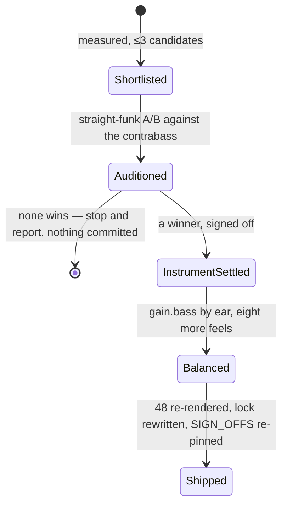

# PRD — Epic 1: Every groove is carried by an electric bass

Feature: [briefing.md](../briefing.md) · [roadmap.md](../roadmap.md)

## Summary

Replace the generator's `bass` voice — a pizzicato contrabass from VSCO 2 CE —
with a 60s Fender Precision, and re-render all 48 grooves with it. Every bass
line, every pattern, every voicing rule stays exactly as it is: this is a change
of instrument, not of playing. It ships when the P Bass sits right in all nine
feels, because Sam plays along to the bass more than to anything else on the
page.

## Problem

The bass is the voice the player leans on. It is currently an upright — a
plucked contrabass sampled for an orchestral library — and the nine feels in the
catalogue are funk, shuffle, half-time, bright straight, ballad, swung sixteenth,
bossa nova, second line and boom-bap. Six of those are styles a P Bass defined.
The briefing puts it in four words: it just sounds better.

Nothing structural is in the way. The renderer resamples whatever the pack holds,
`BASS_*` in `events.ts` writes the same lines either way, and `docs/music.md` says
in as many words that the audio is not frozen — a groove is a slot, not a record.
What stands in the way is the work of doing it properly: measuring a new
instrument's pitches, covering its register, re-balancing nine feels by ear, and
re-earning eight listening sign-offs that the pack change voids the moment it
lands.

## Scope

- audition free P Bass sample sets against the contrabass on `straight-funk`
- prepare the winner into the pack: measure, cap, fade, mono, FLAC
- `samples/pack.json`, `samples/provenance.json`, `samples/README.md`
- `gain.bass` in all nine templates, re-balanced by ear
- the bass-over-kick medians `boom-bap.test.ts` and `second-line.test.ts` assert
- re-render 48 grooves, rewrite `grooves.lock.json`
- `SIGN_OFFS` in `gate.test.ts`, re-pinned on a fresh listening pass
- `docs/music.md`'s voice table row for `bass`

**Out of scope**
- the credit line under the groove box — Epic 2, and only if the licence needs it
- the comp. It stays the VSCO 2 upright piano, and the 24 reference notes under
  `public/notes/` render from `comp` alone, so none of them re-render
- bass lines, register, voicing. `BASS_*` and the pattern pools are untouched
- minting grooves, and therefore bumping `ROTA_EPOCH`. Every uuid keeps its slot
  and its answer
- per-feel sample sets. One bass everywhere
- the other thirteen voices, their gains and their pans

## Requirements

### Choosing the instrument

- **R1** — The bass sample set is a 60s Fender Precision, or the closest thing a
  freely licensed library holds. Candidates are shortlisted on measurement —
  register coverage, velocity layers, noise floor — and at most three reach the
  ear.
- **R2** — The shortlist is auditioned against the contrabass on `straight-funk`
  alone, as a back-to-back pair of renders of the same groove, written as scratch
  MP3s into a gitignored folder and played one after the other. That one A/B is
  the go/no-go for the whole feature, and it happens before anything enters the
  repo.
- **R3** — If no candidate beats the contrabass by ear, the work stops there and
  reports. Nothing is committed, the pack is unchanged, and the 48 grooves are
  not re-rendered.
- **R4** — A CC-BY library is acceptable. Its attribution string is recorded in
  `provenance.json` when the pack is written, so Epic 2 has its contract before
  the catalogue is re-rendered.

### Preparing the pack

- **R5** — Every sampled note's sounding pitch is established by measuring the
  fundamental, never by reading the filename, and is carried as `measuredHz` in
  `pack.json`. Measured pitch is within half a semitone of the declared MIDI note.
- **R6** — The sampled notes cover sounding MIDI 26–51 with no gap wider than 4
  semitones, so no note the generator asks for is more than 2 semitones from a
  sample.
- **R7** — Where the instrument bottoms out — a four-string P Bass at MIDI 28, the
  same open low E the contrabass has — the shortfall is documented rather than
  faked by committing a pitched-down copy.
- **R8** — Files are capped, faded, downmixed to mono and stored as 44.1 kHz
  16-bit FLAC, with the source lead-in kept so a bass note lands with the kick it
  is written beside.
- **R9** — The pack takes the library's own velocity layers. The level jump at
  each layer boundary is measured across the register by quick ticket 8's method,
  and the layers are flattened to one only if a jump reaches the 7.5 dB that pass
  measured on the comp — the one figure in this repo that came with a listening
  verdict attached.
- **R10** — `provenance.json` records, per file, the library, the source path,
  the licence and the modifications applied.

### The mix

- **R11** — `gain.bass` is re-measured by ear in all nine templates. The current
  values (`-3.1` … `+1.0`) are not a starting point: a pickup and a plucked
  string have different crest factors, so the numbers do not carry over.
- **R12** — Each feel is balanced on its own merits, by ear. The bass-over-kick
  medians that `boom-bap.test.ts` and `second-line.test.ts` assert against
  `straight-funk`'s are re-measured to what the new instrument needs; today's
  figures were measured for a plucked contrabass and holding them would be
  balancing to a number instead of to an ear.
- **R13** — Every re-rendered groove passes all seven gate checks unchanged,
  including the loudness band of −29…−20 dBFS. A feel that falls out of the band
  is a balance failure to fix, not a band to widen.
- **R14** — One bass across the whole app. No feel keeps the contrabass and the
  pack carries no second bass set, even if a feel resists: a feel that will not
  sit right is fixed by ear, because two bass sounds would let the feel be
  guessed from the instrument rather than from the groove.

### Signing it off

- **R15** — The instrument is signed off once, on the `straight-funk` A/B, before
  any of the other eight feels are balanced.
- **R16** — The other eight feels each get their own listening verdict, recorded
  one per feel, after the instrument is settled.
- **R17** — Every entry in `SIGN_OFFS` is re-pinned against the new renders, with
  the words of the verdict it rests on and the scope those words covered. A hash
  moves only after a fresh ear has heard the new render.
- **R18** — The catalogue is re-rendered and `grooves.lock.json` rewritten in the
  same change as the pack, so `npm run grooves:verify` — which `prebuild` runs —
  never sees a lock that disagrees with the samples.

## Behaviour details

The two listening stages are gates inside this epic, not a place the work can
stop. `straight-funk` approved while the other eight feels sit unbalanced is a
half-swapped catalogue, which is the state the persona reads as a broken app.

## Acceptance criteria

- **AC1** (R1, R2) — Given a shortlist of at most three prepared candidates, when
  the same `straight-funk` groove is rendered with each and with the contrabass
  into a gitignored scratch folder, then the pair that decided it is playable back
  to back and the verdict is recorded in the epic's implementation notes.
- **AC2** (R3) — Given no candidate beats the contrabass, when the audition ends,
  then `git status` is clean of pack, catalogue and lock changes and the epic
  reports "no winner" rather than shipping one.
- **AC3** (R5) — Given every sampled bass note, when its fundamental is measured,
  then it is within half a semitone of its declared MIDI note and
  `samples/pack.test.ts` asserts it.
- **AC4** (R6) — Given the bass's declared register, when the sampled notes are
  sorted, then no gap between adjacent notes exceeds 4 semitones, asserted by
  `samples/pack.test.ts`.
- **AC5** (R9) — Given the prepared pack, when the level at each velocity-layer
  boundary is measured across the register, then either every jump is below 7.5 dB
  or the pack ships one layer, and the measurements are written down.
- **AC6** (R10, R4) — Given a non-CC0 library, when `samples/pack.test.ts` runs,
  then every one of its rows carries an attribution and `provenance.attributions`
  contains it.
- **AC7** (R11, R13) — Given all nine templates re-balanced, when
  `catalogue-gate.test.ts` runs over the 48 re-rendered grooves, then all seven
  checks pass for every groove, RMS inside −29…−20 dBFS included.
- **AC8** (R12) — Given the re-rendered catalogue, when `boom-bap.test.ts` and
  `second-line.test.ts` compare their bass-over-kick medians against
  `straight-funk`'s, then both pass against re-measured figures.
- **AC9** (R14) — Given the shipped pack, when `pack.json` is read, then it holds
  exactly one `bass` sample set and no template selects a different one.
- **AC10** (R15, R16, R17) — Given the listening pass, when `gate.test.ts` runs,
  then every `SIGN_OFFS` entry hashes to a current render and carries the verdict
  and scope it rests on, with one verdict for the instrument and one per feel.
- **AC11** (R18) — Given the change as committed, when `npm run grooves:verify`
  runs, then it passes; and when `npm run test:all` runs, then it is green.
- **AC12** (R6, R8) — Given the app in the browser, when any day's groove plays,
  then the bass under it is the electric bass and no note is silent, clipped or
  out of tune.

## Dependencies

Needs nothing. Hands Epic 2 one contract, as soon as the library is chosen:
`provenance.attributions` — the sorted set of distinct non-CC0 attribution
strings, length 2 today. If it becomes 3, Epic 2 exists and the third string is
its input; if it stays 2, Epic 2 is dropped.

## Assumptions

- ffmpeg / ffprobe and the existing `pcmio.ts` path are enough to prepare the
  samples; no new tooling is needed.
- The audition's scratch renders go under the epic's gitignored `.implement/`
  folder, the same place its run reports go.
- The pack keeps its `vcsl-funk` id. The id names the pack, not its libraries,
  and renaming it would touch every provenance row for no gain.
- `docs/music.md`'s "fifteen voices" list and the routing table need one edited
  row each, not a rewrite.
- Re-rendering grooves players have already heard needs no migration and no
  notice. The audio is explicitly not frozen, and the persona does not go back.
- `heard-in.json` is keyed by scale, not by instrument, so nothing there moves.

## Question log

Answered questions, kept for traceability. The requirements above are the source
of truth — this records how they got there.

### Cycle 1 — 2026-09-06

**Q1. How is the go/no-go A/B put in front of your ear?**
Answer: **A) A pair of scratch MP3s in a gitignored folder, played back to back** —
a losing audition has to leave no trace in the repo, and nothing about the
comparison needs the app's transport.
Applied to: R2, AC1, Assumptions

**Q2. Does the electric bass get to sit louder than the upright did?**
Answer: **A) Balance each feel on its own merits** — the medians were measured for
a plucked contrabass, so holding them would balance the new instrument to a
number rather than to an ear.
Applied to: R12, AC8

**Q3. What if one feel will not sit right with a P Bass?**
Answer: **A) Fix it by ear; one bass everywhere, no exceptions** — two bass sounds
would let the feel be guessed from the instrument instead of from the groove.
Applied to: R14, AC9, Out of scope

**Q4. What counts as an audible velocity-layer boundary?**
Answer: **A) Reuse quick ticket 8's method and its measured 7.5 dB** — the only
measurement this repo has made of the problem, and it came with a listening
verdict attached.
Applied to: R9, AC5
