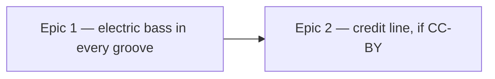

# Roadmap — New bass

Source: [briefing.md](briefing.md)

## Overview

The generator's `bass` voice is a pizzicato contrabass from VSCO 2 CE. This
feature replaces it with a 60s Fender Precision, leaves every bass line, pattern
and voicing rule exactly as it is, and re-renders all 48 grooves. One epic does
the swap end to end — source, prepare, balance, re-render, sign off — because
the player's verdict is that a swapped bass at an unbalanced level is a broken
app, not a milestone. A second, conditional epic follows only if the library
that wins is CC-BY: a third attribution beside the two DrumGizmo strings.

## Epics

### Epic 1 — Every groove is carried by an electric bass

**Visible when done:** Sam hits play on any day's groove and the bass under it
is an electric P Bass instead of an upright — at a level that sits right in all
nine feels, from the ballad to the boom-bap.
**Depends on:** none
**Parallel with:** none

**Scope**

- Audition the free P Bass sample sets against the contrabass **on
  `straight-funk` alone**, and treat that as the go/no-go: one feel, one A/B, one
  verdict on the instrument itself. The briefing's whole reason is "it just
  sounds better", so if nothing beats what is there, stop and report rather than
  ship a swap for its own sake.
- Prepare the winner the way `samples/README.md` requires: sounding pitch
  **measured**, never read off the filename, and carried as `measuredHz`; capped
  and faded; downmixed to mono 44.1 kHz 16-bit FLAC; lead-in kept.
- Take the library's own velocity layers rather than imposing a shape, then
  measure the level jump at each layer boundary the way quick ticket 8 measured
  the comp's. Flatten to one layer only if a boundary is audible on that
  measurement — the comp's was ~7.5 dB.
- Cover sounding MIDI 26–51 with no gap wider than 4 semitones, so linear
  interpolation stays inside the 2-semitone bound. A four-string P Bass bottoms
  out at MIDI 28, the same open low E the contrabass has, so the existing
  ⚠ note about the bottom four semitones carries over rather than being solved.
- Wire it into `samples/pack.json` and `samples/provenance.json` as the `bass`
  voice, with the licence row and, for a non-CC0 library, its attribution string.
- Re-balance `gain.bass` in all nine templates by ear — it is `-3.1 … +1.0`
  today and a pickup has a different crest factor than a plucked string, so the
  old numbers are not a starting point that means anything.
- Re-measure the bass-over-kick medians `boom-bap.test.ts` and
  `second-line.test.ts` assert against `straight-funk`'s.
- Re-render the catalogue and rewrite `grooves.lock.json`.
- A second listening pass over the other eight feels, once the instrument is
  settled — one verdict each, recorded. Every entry in `SIGN_OFFS` names
  `samples/pack.json` as upstream, so all of them are void the moment the pack
  changes.

**The two listening stages are gates inside this epic, not an epic boundary.**
`straight-funk` approved while the other eight feels sit unbalanced is exactly
the half-swapped state the persona calls broken, so it is never a place the work
stops.

**Out of scope**

- The credit line under the groove box — Epic 2, and only if the licence needs it.
- The comp. It stays the VSCO 2 upright piano, and the 24 reference notes under
  `public/notes/` render from `comp` alone, so nothing there is re-rendered.
- Bass lines, register, voicing: `BASS_*` in `events.ts` and the pattern pools
  are untouched. A different instrument, not different playing.
- Minting grooves, and therefore bumping `ROTA_EPOCH`. Every uuid keeps its slot
  and its answer; only the sound behind it changes.
- Per-feel sample sets — one bass everywhere, see Assumptions.

**Validation**

- Open the app, hit play: the bass is electric. `/dev/grooves` under `next dev`
  plays one groove per feel, which is the audition path and the sign-off path.
- `npm run grooves` re-renders 48 grooves; `npm run grooves:verify` (also the
  `prebuild` step) passes against the rewritten lock.
- `npm run test:all`: `samples/pack.test.ts` on measured pitch (half a semitone),
  note spacing and attribution-per-non-CC0-row; `catalogue-gate.test.ts` on all
  seven gate checks over 48 grooves, the loudness band included;
  `gate.test.ts`'s `SIGN_OFFS` re-pinned; the two median tests re-measured.
- The listening verdicts written down beside the pins: one for the instrument on
  `straight-funk`, one per feel for the other eight.

### Epic 2 — The credit line names where the bass came from

**Visible when done:** the credit under the groove box names the bass library
alongside the two DrumGizmo strings, so the app satisfies the licence a player
can see rather than only the one in the repo.
**Depends on:** Epic 1 — but only on its licence outcome, which is pinned as
soon as the library is chosen, not when the catalogue is re-rendered.
**Parallel with:** the back half of Epic 1

**Scope**

- Grow `provenance.attributions` to three, and grow the app's credit with it:
  `src/lib/snippets/en/puzzle.ts`, the `GrooveCard` credit and their tests, which
  today assert the exact two-library string.
- Nothing else. A third attribution is a longer line, not a new UI.

**Out of scope**

- Moving the credit anywhere. Quick ticket 9 put it on the groove box on purpose.
- This epic **does not exist if the chosen library is CC0**, which both current
  pitched voices are. Dropping it then is the right outcome, not a gap.

**Validation**

- `snippets.test.ts` and `GrooveCard.test.tsx` assert the third name; `HowToPlay.test.tsx`
  still asserts no credit leaked back into the how-to-play box.
- `samples/pack.test.ts` — every non-CC0 row carries an attribution.

## Dependency map

## Execution waves

- **Wave 1:** Epic 1.
- **Wave 2:** Epic 2 — needs only the chosen library's licence and attribution
  string, so it can start as soon as Epic 1 has picked a winner.

## Assumptions

- **One bass across the whole app, the upright retired everywhere.** The
  briefing says swap it, and Sam agrees for a reason the briefing doesn't give:
  *"Two bass sounds means that on some mornings the thing I'm playing along to is
  a different instrument, and I'd start guessing the feel from the bass tone
  instead of from the groove — which is the puzzle answering itself in a way I
  didn't ask for."* Per-feel sample sets stay a later feature.
- **The balance is not a separate epic.** Sam on the split: *"If I open the app
  on a Tuesday and the bass has gone electric but it's sitting too loud under the
  kick or too quiet to hear at all, I don't think 'nice, balance is coming
  Wednesday' — I think the app broke overnight and I close it."*
- **The better sound outranks the licence.** A CC-BY library is acceptable and
  Epic 2 pays for it; the target stays a 60s Precision rather than any electric
  bass, and no paid library is in play.
- **The candidates that reach the ear are a shortlist.** Measure register
  coverage, layer count and noise floor first; up to three survivors go to the
  `straight-funk` A/B.
- Re-rendering grooves players have already heard is allowed and needs no
  migration: `docs/music.md` says the audio is explicitly not frozen, and Sam
  says he doesn't go back — his instinct, not a line in the persona file.
- The gate's loudness band (−29…−20 dBFS) holds for the new instrument. If a
  feel falls out of it, that is a balance failure to fix, not a band to widen.

Answered 2026-09-06: Q1 A (no winner → stop and report), Q2 A (best sound wins,
CC-BY acceptable), Q3 C (`straight-funk` as the go/no-go, then the other eight),
Q4 A (the library's layers, flattened only on a quick-8 measurement).
