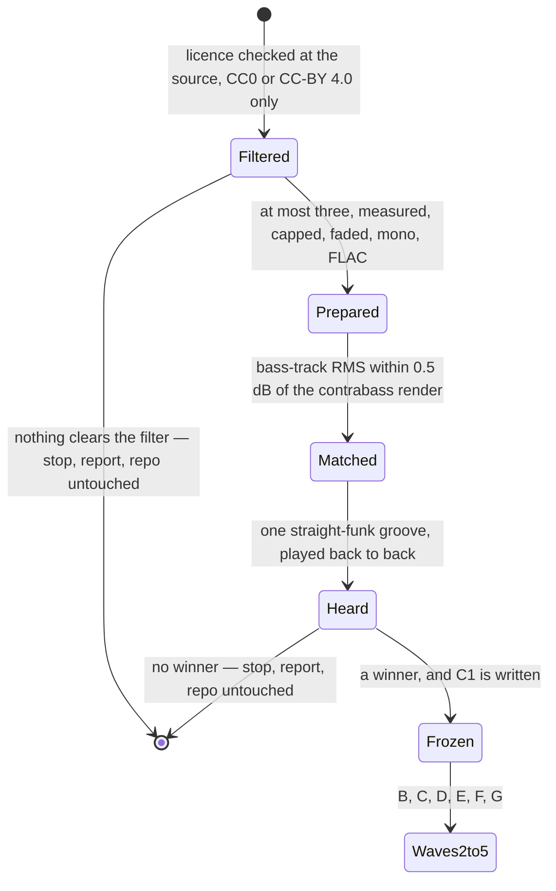

# Tech spec — Epic 1: Every groove is carried by an electric bass

PRD: [../prd/epic-1-every-groove-is-carried-by-an-electric-bass.md](../prd/epic-1-every-groove-is-carried-by-an-electric-bass.md) ·
Roadmap: [../roadmap.md](../roadmap.md)

## Approach

The epic is one pack swap with a human gate in front of it and nine human
verdicts behind it, and everything about the decomposition falls out of those
two facts. The gate (R2, R3) can end the epic, so **Wave 1 owns nothing inside
the repo at all** — the shortlist is prepared, loudness-matched and auditioned
entirely inside `specs/features/feature-27/.implement/`, which is gitignored,
using `npm run grooves -- --pack <scratch> --out <scratch>`, a flag pair the CLI
already has. A losing audition therefore leaves `git status` clean by
construction rather than by discipline. The gate's output is a single frozen
measurement record, and every later track builds against that record rather than
against each other, which is what lets the test track and the pack track run at
once in Wave 2.

Behind the gate the work is a genuine chain, not caution: the mix cannot be set
until the pack is committed (a gain set against a scratch pack is a gain nobody
heard), the catalogue cannot be re-rendered until the mix is settled, and
`SIGN_OFFS` cannot be re-pinned until the renders exist. Two things run beside
that chain: the documents, which need only the library's name, and the pack's
test contract, which needs only the measurement record.

The listening is not a step this spec can write. **Four steps in this plan wait
on a person, and between them they collect ten listening events** — the go/no-go
A/B (A4, one), `straight-funk`'s balance (D1, one), the other eight feels (D2),
and whatever the loop back from D3 or D4 costs — and each of them says what the
person is asked to listen to and what they are *not* being asked.
`docs/music.md` is explicit that the gains are turned by a listening sign-off and
that nothing in this repo can hear, so a step that claimed to automate one would
be lying about its done-condition.

## Architecture

### The moving parts

| Part | Where | What changes |
| :-- | :-- | :-- |
| the audition | `specs/features/feature-27/.implement/**` (gitignored) | shortlist, prepared candidate packs, scratch renders, the measurement record. Nothing in the repo |
| the samples | `scripts/grooves/samples/bass/*.flac` | 26 `BKCtbss_Pizz_*` files out, the winner's prepared files in |
| the declaration | `scripts/grooves/samples/pack.json` | the `bass` block: `midi`, `measuredHz`, layers, and an explicit `nominalVelocity` on every layer, which it does not carry today |
| the record | `scripts/grooves/samples/provenance.json` | 26 bass rows replaced; `licence`; `attributions` grows to 3 if the winner is CC-BY 4.0 |
| the rulebook | `scripts/grooves/samples/README.md` | source table, voice mapping, note spacing, the two ⚠ bass sections, levelling, length caps, and a new audition section |
| the pack's tests | `scripts/grooves/pack.test.ts`, `scripts/grooves/samples/pack.test.ts` | every assertion that names the contrabass; a new headroom bound; the attribution count |
| the mix | the nine `scripts/grooves/templates/<feel>.ts` | `gain.bass` only — nine numbers, `-4.0 … +1.0` today |
| the medians | `scripts/grooves/templates/boom-bap.test.ts`, `scripts/grooves/second-line.test.ts` | the measured figures the tolerance was sized against. `ON_THE_LINE_DB` stays at 1.5 — C7 |
| the catalogue | `public/grooves/*.mp3`, `scripts/grooves/grooves.lock.json`, `src/features/daily-groove/data/grooves.generated.ts` | every groove re-renders; the lock's groove hashes and `packSha256` both move |
| the sign-offs | `scripts/grooves/gate.test.ts` | eight entries re-pinned, four added, the id list grown |
| the documents | `docs/music.md`, `scripts/grooves/docs.test.ts` | the library count and the routing row that says where a voice's instrument lives |

### The gate, and what it costs every later track



**Two distinct outcomes end the epic at the gate, and the plan owes both a
name.** The PRD's R3 covers the second — no candidate beats the contrabass. The
first is a consequence of a rule the PRD does not restate: `samples/pack.test.ts`
allows exactly `CC0` and `CC-BY-4.0` on a provenance row, so CC-BY 3.0, any
`-SA`, any `-NC` and every freeware-but-not-redistributable library are out
before a byte is downloaded, and the shortlist can come back empty. Both
outcomes have the same effect on this plan: **Tracks B–G never start**, no file
under `scripts/`, `src/`, `public/` or `docs/` is touched, `provenance.attributions`
stays at length 2, and Epic 2 is dropped for the same reason it is dropped on a
CC0 win.

### Ten listening events, and the one that cannot be pinned

`gate.test.ts`'s `voidSignOff` is unambiguous: a pinned hash must reproduce, from
the committed tree, the audio a person actually heard. The A/B render cannot
satisfy that. It is made from a scratch `pack.json` against the *old* committed
templates, so no committed tree ever reproduces it. **So the epic collects ten
listening events, not nine**, and `straight-funk` is heard twice:

| # | Verdict | Given on | Recorded in | Pinned? |
| :-- | :-- | :-- | :-- | :-- |
| 1 | the instrument | the A/B, one `straight-funk` groove, scratch pack | `samples/README.md`'s audition section (Track C), asserted by Track B | **no — and cannot be** |
| 2 | `straight-funk`'s balance | a render from the committed pack and the committed `gain.bass` | `SIGN_OFFS` | yes |
| 3–10 | the other eight feels, one each | the same, per feel | `SIGN_OFFS` | yes |

That is one more listening event than the PRD's R15/R16 arithmetic implies, and
it is what the epic does. R15's ordering is untouched — the instrument is still
signed off first, on the A/B, before any other feel is balanced — and R16's eight
feel verdicts are still eight. What is added is `straight-funk`'s own balance
verdict, which R15 folded into the instrument's and which has to be separate for
one reason: **every entry in `SIGN_OFFS` must reproduce**, and a pin resting on
the A/B would not. The cost is one replay of one groove at the moment
`straight-funk`'s gain is settled, when the listener is already there. Step D1
collects it; Step A4 says plainly that the A/B verdict is never pinned and where
it is kept instead.

### Four feels have never been pinned, and this epic is where that costs

`SIGN_OFFS` holds eight entries over five feels: `shuffle` (groove-07, groove-08),
`swung-sixteenth` (groove-28, groove-40, groove-48), `bossa-nova` (groove-58),
`second-line` (groove-65), `boom-bap` (groove-71). The multiple entries on the
two riding feels are one per *ride figure*, which is that table's own stated
compression; the three single entries are one per *feel*, which is the
compression feature-25 added for feels that play no ride.

`straight-funk`, `half-time`, `bright-straight` and `open-ballad` have no entry
at all. The table's own comment records that this was true of three feels until
feature-25 and calls it "the one property this table exists to hold, and it was
false for three whole feels". It is still false for four. **This epic collects a
verdict on each of them anyway under R16**, so pinning them costs one table entry
each and not one extra minute of listening — and not pinning them means four
verdicts are given and nothing in the repo guards any of them. Track F adds them:
eight entries become twelve.

### The lock's pack hash is written by `npm run notes`, not by `npm run grooves`

This is the trap in R18/AC11 and it is invisible from the outside.
`buildLock` in `scripts/grooves/lock.ts` sets `packSha256` only inside
`if (paths.packDeclarationPath !== undefined && noteIds.length > 0)`, and
`npm run grooves` passes no note ids. `mergeLock` then carries the *existing*
`packSha256` forward untouched. So after `pack.json` changes:

- `npm run grooves` rewrites 54 mp3s, the manifest and every groove hash, and
  leaves `packSha256` stale.
- `npm run grooves:verify` — which `prebuild` runs — fails `pack-stale`, whose
  remedy string tells you to re-render the notes.
- `npm run notes` re-renders 24 reference notes that are **byte-identical**
  (they render from `comp` alone, which this epic does not touch) and writes the
  fresh `packSha256`.

`samples/pack.test.ts`'s `records the current pack.json hash, so prebuild does
not fail as pack-stale` is the assertion that goes red the instant Track C lands
and green only after `npm run notes` — which makes it Track E's red step rather
than a footnote.

### What this epic must not touch

`events.ts` (`BASS_*`, `BASS_PATTERNS`, `VELOCITIES`, `PLACEMENTS`, `FILLS`),
`humanize.ts`, `mix.ts`, `gate.ts`, `catalogue.json`, `heard-in.json`,
`src/lib/hash.ts`, `ROTA_EPOCH`, and every template field except `gain.bass` —
`swing`, `tempoRange`, `passes`, `density`, `flavours`, `patterns`, `figures`,
`pan` and the whole `humanize` block all stay. A groove keeps its uuid, its slot
and its answer; only the recording behind it changes, which is exactly what
`docs/music.md`'s *What must never change* says is always allowed.

The comp is untouched, and so is the design that quick-8 settled for it: one
`dyn2` layer, `SINGLE_LAYER_BY_DESIGN`, and `gain.comp` in all nine templates.
This epic reads that section for its method and changes none of its numbers.

## Contracts

### C1 — the winner's measurement record

Written once by Track A at the gate, to
`specs/features/feature-27/.implement/audition/winner.md`, and **frozen**.
Tracks B and C both build against it and neither re-measures. If any field is
missing when Wave 2 starts, B and C merge into one track instead — the whole
reason they can be parallel is that this record is complete.

```ts
type BassPackFacts = {
  library: string            // as it will read in provenance.source, e.g. "Foo Bass Library (FooBass), P Bass, finger"
  url: string
  licence: 'CC0' | 'CC-BY-4.0'
  attribution: string | null // required and non-empty iff licence is CC-BY-4.0
  licenceTextFile: string | null // `LICENSE-<first token of source>.txt`, iff CC-BY-4.0
  sourceFileRoot: string     // the path prefix inside the library, for provenance.sourceFile
  filePrefix: RegExp         // every committed file matches, e.g. /^bass\/FooBass_P_/
  capSeconds: number
  fadeSeconds: 0.08
  ffmpegLine: string         // the exact invocation, recorded in the README beside the cap
  notes: {
    midi: number
    measuredHz: number       // fitted over the harmonic series, never peak-picked
    centsError: number
    layers: { maxVelocity: number; nominalVelocity: number; files: string[]; peakDbfs: number }[]
  }[]
  lowestSampledMidi: number
  highestSampledMidi: number
  widestGapSemitones: number // ≤ 4
  layerDecision: {           // R9 / AC5
    method: 'quick-8'
    boundaryStepsDb: number[]  // net step per boundary, after nominalVelocity pays back
    threshold: 7.5
    outcome: 'keep the library’s layers' | 'flatten to one'
  }
}
```

### C2 — the register, unchanged

`events.ts` is untouched, so the register the generator asks for is exactly
today's: `BASS_BASE_MIDI = 24`, floor `28`, ceiling `48`, and
`BASS_PLAYED = { lowest: 24, highest: 47 }` in `scripts/grooves/pack.test.ts`
stays as written. The pack must cover sounding MIDI 26–51 with no gap wider than
4 semitones (R6), and `lowestSampledMidi - 24 ≤ 4` is the documented shortfall
(R7), the same bound the contrabass satisfies at 28.

### C3 — the headroom bound

`gainFor` in `scripts/grooves/voices.ts` is
`Math.min(velocity / nominalVelocity, MAX_LAYER_GAIN)` with `MAX_LAYER_GAIN = 2`,
and `humanize` clamps velocity to 1. With `VELOCITIES.bass.strong = 0.92` and the
largest `humanize.velocity` in the registry being `shuffle`'s `0.13`, the loudest
bass hit the catalogue can produce is **velocity 1.0**. A layer is only reached
by velocities up to its own `maxVelocity`, so the bound is per layer:

```
loudest(layer) = min(layer.maxVelocity, min(1, VELOCITIES.bass.strong + max(humanize.velocity)))
loudest(layer) / layer.nominalVelocity < 2
```

For a top layer, that reduces to `nominalVelocity > 0.5`.

**The committed contrabass fails it on every one of its eight notes**, because no
bass layer declares a `nominalVelocity` at all and every one of them falls
through to a band midpoint:

| Note | Layer | maxVelocity | fallback nominal | loudest / nominal |
| :-- | :-- | --: | --: | --: |
| 28, 31, 34, 36, 40 | lower | 0.8 | 0.4 (midpoint of 0 … 0.8) | **2.00** |
| 28, 31, 34, 36, 40 | upper | 1 | 0.9 (midpoint of 0.8 … 1) | 1.11 |
| 42, 45, 49 | only | 1 | 0.5 | **2.00** |

Both failing rows sit exactly on `MAX_LAYER_GAIN` — the clamp the README says
`rim` was "one change away from" — and the lower layer's is not theoretical:
`VELOCITIES.bass.medium` is `0.8`, so every off-eighth bass note in the catalogue
lands on that boundary. The new pack declares an explicit `nominalVelocity` on
every layer, and Track B pins the bound.

### C4 — the attribution contract Epic 2 reads

`provenance.attributions` is the sorted set of distinct non-CC0 attribution
strings. It is length 2 today. After this epic it is **2 if the winner is CC0, 3
if the winner is CC-BY 4.0**, and Epic 2 exists iff it is 3.

The boundary is exact, so the two epics never contend:

| Owner | Files |
| :-- | :-- |
| **Epic 1** | `scripts/grooves/samples/pack.test.ts` (the count), `provenance.json` (the strings), and every section of `scripts/grooves/samples/README.md` **except** *⚠ The drums and the ride carry an attribution obligation* |
| **Epic 2** | that one README section, in its own one-step `musician` track after Epic 1's README edit is committed; plus the app's credit line — `src/lib/snippets/en/puzzle.ts`, `src/lib/snippets/snippets.test.ts`, `src/features/daily-groove/components/puzzle/GrooveCard.test.tsx` |

Epic 2 touches no other generator file, and Epic 1 does not pre-empt that
section — see Step C5s for what goes stale in the window between them and why
nothing goes red. Without Step B8, `samples/pack.test.ts`'s
`expect(provenance.attributions!.length).toBe(2)` goes red on a CC-BY win and
Epic 1 cannot satisfy AC11.

### C5 — the commands

`npm test` (app + tooling) · `npm run test:gen` (generator) · `npm run test:all`
(everything) · `npm run grooves` · `npm run notes` · `npm run grooves:verify`
(also `prebuild`). Every track here except none owns generator files, so
**`npm run test:gen` is the per-track command**; Track E and the integration pass
take `npm run test:all` because E writes an app-tier generated file.

### C6 — the catalogue size is read, never typed

`readCatalogue().length` is **54** in the working tree today and 48 at HEAD;
quick ticket 12 mints the difference and is `🛠 Ready to build` as this is
written. No step in this spec names a count. Every command is run over the
catalogue as it stands when the epic runs.

### C7 — the harmony-balance bound is a gate, and it does not move

`ON_THE_LINE_DB = 1.5` in `scripts/grooves/templates/boom-bap.test.ts` and
`scripts/grooves/second-line.test.ts` **stays at 1.5**, and both assertions keep
their relative form: the median post-gain bass-over-kick (and comp-over-kick)
distance from `straight-funk`'s, over the six committed grooves of each feel.

```
|median(feel) − median(straight-funk)| ≤ 1.5 dB    for feel ∈ { boom-bap, second-line }
                                                    for voice ∈ { comp, bass }
```

**A breach is a balance failure to fix, not a tolerance to widen.** This is R13's
stance on the loudness band applied one level up, and the bound has the room for
it: it was sized at five times the largest deviation ever measured against it
(0.27 dB), and four times tighter than the floor assertion's own slack. A feel
whose ear-set `gain.bass` puts it more than 1.5 dB from `straight-funk`'s means
those two feels really have drifted apart, not that the bound was tight — and the
answer is another pass at that feel's gain in Step D2, or at `straight-funk`'s
anchor in D1, never an edit to the constant.

Three things this fixes for Track D. The constant is **not** in its writable
surface, even though it owns the file the constant lives in. The relative form is
not converted to a literal — the comment above each assertion says at length that
a literal would freeze an arithmetic result where this freezes a decision. And
the assertions are not deleted: `SIGN_OFFS` pinning both feels does not replace
them, because a pin catches a change to the *audio* and this catches a change to
the *relationship*, which is what the harmony re-gain's verdict was actually
about.

What Track D does rewrite is the measured figures in the comments above each
assertion — see Step D3. Those are the record of what 1.5 dB was sized against,
and leaving them at the contrabass's numbers would make the bound rest on a
measurement that no longer exists.

## Tracks

### Track A — The shortlist and the go/no-go audition

- **Goal** — either a winner, prepared and measured, with C1 frozen; or a
  written "no winner" report and a repo nothing has touched.
- **Owns** — `specs/features/feature-27/.implement/**` (gitignored). **No file
  in `scripts/`, `src/`, `public/` or `docs/`.**
- **Role** — `musician`. It decides which instrument the app plays, which is the
  most musical decision in the feature.
- **Depends on** — nothing.
- **Parallel with** — nothing. It is the gate.
- **Done when** — either `winner.md` holds every field of C1 and a verdict is
  recorded in the person's own words, or the report says "no winner" (or "empty
  shortlist") and `git status --porcelain -- scripts/ src/ public/ docs/` prints
  nothing.

### Track B — The pack's test contract

- **Goal** — the two pack test files assert the new instrument, its measured
  pitches, its spacing, its levelling headroom, its provenance and what it owes,
  and they fail against the committed contrabass in exactly the ways Step B1–B9
  name.
- **Owns** — `scripts/grooves/pack.test.ts`,
  `scripts/grooves/samples/pack.test.ts`
- **Role** — `implementer`. **This is the one place this epic departs from the
  blanket rule that a `scripts/grooves/**` track takes the musician**, and the
  reason is that every number this track writes down comes out of C1, which the
  musician already measured. It turns no knob, chooses no sample, and makes no
  claim about what anything sounds like: it encodes measurements as assertions.
  The lead can override it to `musician` at zero cost — it changes one word and
  no step.
- **Depends on** — C1 only.
- **Parallel with** — Track C.
- **Done when** — the assertions are written and red for the named reasons; the
  wave is green once C lands. The one exception is
  `records the current pack.json hash, so prebuild does not fail as pack-stale`,
  which stays red until Track E runs `npm run notes`.

### Track C — The pack

- **Goal** — the committed pack plays the new instrument, prepared exactly the
  way `samples/README.md` requires, levelled by that document's two-job rule, and
  documented well enough that the next reader can re-measure rather than believe.
- **Owns** — `scripts/grooves/samples/bass/**`,
  `scripts/grooves/samples/pack.json`,
  `scripts/grooves/samples/provenance.json`,
  `scripts/grooves/samples/README.md` — **every section except
  *⚠ The drums and the ride carry an attribution obligation***, which Epic 2 owns
  and edits after this track's README edit is committed,
  `scripts/grooves/samples/LICENSE-<Library>.txt` (new, only on a CC-BY win)
- **Role** — `musician`. The levelling, the cap, the layer decision and the
  README's reasoning are musical judgements with measurements attached.
- **Depends on** — C1 only.
- **Parallel with** — Track B.
- **Done when** — `npm run test:gen` is green apart from the two things this wave
  cannot close: `pack-stale` (Track E) and the eight `SIGN_OFFS` pins (Track F).
  `readdirSync(samples/bass)` equals the declared file set exactly, and the
  README carries the audition table, the note-spacing rows, the levelling
  arithmetic and the length cap.

### Track D — The mix, by ear

- **Goal** — nine `gain.bass` values a person has heard and accepted, one verdict
  per feel recorded verbatim — verdicts 2 through 10, `straight-funk`'s own
  included — and the two bass-over-kick medians re-measured against what the new
  instrument actually does, inside the 1.5 dB C7 fixes.
- **Owns** — `scripts/grooves/templates/straight-funk.ts`, `shuffle.ts`,
  `swung-sixteenth.ts`, `half-time.ts`, `bright-straight.ts`, `open-ballad.ts`,
  `bossa-nova.ts`, `second-line.ts`, `boom-bap.ts` — **the `gain.bass` line and
  nothing else in any of them** — plus
  `scripts/grooves/templates/boom-bap.test.ts` and
  `scripts/grooves/second-line.test.ts`, **in which the only writable text is the
  measured figures in the two comments above the harmony-balance assertions.**
  `ON_THE_LINE_DB` is C7's and is not this track's to move.
- **Role** — `musician`.
- **Depends on** — Track C. A gain set against a scratch pack is a gain nobody
  heard.
- **Parallel with** — Track G.
- **Done when** — nine feel verdicts are recorded (events 2 through 10, one of
  them `straight-funk`'s second listen), `catalogue-gate.test.ts` passes all
  seven checks over every catalogued groove including the −29…−20 dBFS band, and
  both median assertions pass at `ON_THE_LINE_DB = 1.5`, unchanged, with their
  comment figures re-measured.

### Track E — The re-render and the lock

- **Goal** — every groove on disk is the render its feel's verdict was given on,
  the lock agrees with the pack, and `grooves:verify` is clean.
- **Owns** — `public/grooves/*.mp3`, `public/notes/*.mp3`,
  `scripts/grooves/grooves.lock.json`,
  `src/features/daily-groove/data/grooves.generated.ts`,
  `src/features/daily-groove/data/notes.generated.ts`
- **Role** — `implementer`. It runs three committed commands and checks their
  output; it decides nothing. Anything it would have to decide is a failure that
  goes back to Track D.
- **Depends on** — Track D.
- **Parallel with** — nothing.
- **Done when** — `npm run grooves`, `npm run notes` and `npm run grooves:verify`
  all complete clean, `node scripts/grooves/rerender-check.ts` reports N of N
  matching, and `npm run test:all` is green **except** `gate.test.ts`'s
  `SIGN_OFFS` pins, which Track F closes.

### Track F — The sign-offs

- **Goal** — twelve entries, one per feel plus the extra ride-figure anchors,
  each hashing to a render on disk, each carrying the words of the verdict it
  rests on and the scope those words covered.
- **Owns** — `scripts/grooves/gate.test.ts`
- **Role** — `musician`. Choosing which groove anchors a feel, and writing what
  the verdict did and did not cover, is the judgement this table is made of.
- **Depends on** — Track E (the renders) and Track D (the verdicts).
- **Parallel with** — nothing.
- **Done when** — `npm run test:all` is green.

### Track G — The documents

- **Goal** — nothing in the repo still says the app's bass is a pizzicato
  contrabass, the library count is right, and a reader who wants to change which
  instrument a voice is can find where it lives.
- **Owns** — `docs/music.md`, `scripts/grooves/docs.test.ts`
- **Role** — `implementer`. It transcribes an outcome Track A already decided.
- **Depends on** — C1 (the library's name and licence only).
- **Parallel with** — Track D. It touches no pack, template, audio, lock or
  manifest file, and D touches no document.
- **Done when** — `npm run test:gen` is green on `docs.test.ts` and the routing
  table has a row sending "which instrument a voice is" to the pack.

## Execution waves

- **Wave 1:** Track A — alone, and it can end the epic.
- **Wave 2 (parallel):** Track B, Track C — disjoint files, both built against
  the frozen C1.
- **Wave 3 (parallel):** Track D, Track G.
- **Wave 4:** Track E.
- **Wave 5:** Track F.

No path appears in two tracks in the same wave. Later waves re-open no file an
earlier wave owned, which is unusual for this repo and is a property of the epic:
the pack, the mix, the audio and the sign-offs are four disjoint layers of one
change.

**The loop this plan admits, and its three triggers.** The work goes back to
Track D for one feel alone — then forward through E and F again — when any of
these happens:

- Step D4 puts a feel outside the −29…−20 dBFS loudness band. R13 is explicit
  that the band does not widen.
- Step D3 puts `boom-bap`'s or `second-line`'s bass or comp more than 1.5 dB from
  `straight-funk`'s. C7 is explicit that the tolerance does not widen either.
- A Wave-5 re-pin surfaces a render nobody accepted.

The loop is per feel, not per epic, and in all three cases what moves is a
`gain.bass` value, never a constant in a test.

## Implementation

### Track A — The shortlist and the go/no-go audition

#### Step A1 — the licence filter runs before a byte is downloaded

Covers: R1, R4

- **Test first** — the assertion already exists and is already green:
  `scripts/grooves/samples/pack.test.ts` →
  `carries only a licence that permits redistribution`, whose
  `ALLOWED = ['CC0', 'CC-BY-4.0']` is the whole filter. Run it now and read it as
  the specification of what may enter the shortlist: **CC-BY 3.0 is not CC-BY
  4.0, `-SA` is not CC-BY, `-NC` is out, and a freeware library whose EULA
  forbids redistributing the samples is out** — this repo commits the audio.
  A candidate that fails here after it is on disk fails at Track C with files
  already in the tree, which is the outcome this step exists to prevent.
- **Implement** — `.implement/audition/shortlist.md`: one row per library
  considered, with the licence **as stated at the source**, checked two ways the
  way the ride's was (the library's own README and its project page). Follow
  `samples/README.md`'s *The ride, and the four rounds it took* table shape:
  library, licence, outcome, and for a rejection the reason.
- **Green when** — every row that survives carries `CC0` or `CC-BY-4.0`, and at
  most three survive to A2 (R1).
- **Stop condition** — an empty surviving set ends the epic under R3 with the
  repo untouched. Report it as "empty shortlist", distinct from "no winner".
- **Refactor** — none.

#### Step A2 — at most three candidates are prepared into scratch packs

Covers: R1, R2, R5, R6, R7, R8, R9

- **Test first** — no repo test can run here; the assertions that will bind this
  work are Track B's, and they are written against the record this step produces.
  What stands in for a test is measurement, and the measurement rule is
  `samples/README.md`'s oldest: **fit the harmonic series, never peak-pick.** A
  plucked or picked bass has a fundamental weaker than its second and third
  partials on the low notes, which is precisely how the contrabass fooled a
  tuner; a peak-picking measurement reads an octave high and the whole game
  becomes unplayable.
- **Implement** —
  1. Prepare every file with the README's one invocation, per candidate cap:
     `ffmpeg -i in.wav -af "pan=mono|c0=0.5*c0+0.5*c1,afade=t=out:st=<cap−0.08>:d=0.08" -t <cap> -ar 44100 -sample_fmt s16 <name>.flac`.
     Nothing is trimmed at the front (R8's lead-in — a bass note has to land with
     the kick it is written beside), nothing is normalised (the layer levels are
     the data), and **no filter** (the README: a voice that needs EQ to be the
     right instrument is the wrong instrument).
  2. Cover sounding MIDI 26–51 with no gap wider than 4 semitones (R6). Record
     `lowestSampledMidi`; a four-string P Bass bottoms out at 28, the same open
     low E the contrabass has, so R7's shortfall carries over verbatim rather
     than being solved — and it is **not** faked by committing a pitched-down
     copy, which would be the identical arithmetic the renderer already does at
     load time.
  3. Build `.implement/audition/<candidate>/pack.json` as a copy of
     `scripts/grooves/samples/pack.json` with only the `bass` block replaced, and
     symlink the other fourteen voice folders plus the licence texts beside it so
     `loadPack` resolves them.
- **Green when** — each candidate's scratch pack loads:
  `npm run grooves -- --pack specs/features/feature-27/.implement/audition/<candidate> --out specs/features/feature-27/.implement/audition/<candidate>/render --only <straight-funk id>`
  writes an mp3 without throwing.
- **Refactor** — none.

#### Step A3 — the two renders are matched on the bass track, not on the master

Covers: R2

- **Test first** — `mixTracks` normalises **true peak onto `PEAK_CEILING`**, so
  the masters match by construction and the bass's share of them does not. An A/B
  matched on the master is an A/B of two different balances, and the ear will
  pick the louder bass. The precedent is the ride's worked example in
  `samples/README.md`: *"Measure the track, not the sample"*, and the ear "was
  given both, back to back, at matched loudness".
- **Implement** — a scratch script `.implement/audition/levels.ts` that imports
  `buildEvents`, `renderVoices`, `mixTracks` and `voiceLevels` from
  `scripts/grooves/` by relative path — the same composition `gate.test.ts`'s
  `renderGroove` uses — and prints post-gain per-voice RMS for one render. Tune
  each candidate's scratch `nominalVelocity` values until its `bass` track RMS is
  **within ±0.5 dB** of the contrabass render's on the same groove. Never a
  template `gain`: `templates/straight-funk.ts` is in the repo and R2 says
  nothing enters it.
- **Green when** — the printed `bass` figures for the contrabass render and each
  candidate agree to 0.5 dB, and every other voice's figure is identical between
  them (nothing but the bass moved).
- **Refactor** — none. The script is scratch and is never committed.

#### Step A4 — the A/B is played back to back, and the verdict is a person's

Covers: R2, R15, AC1 — **human gate**

- **Test first** — none, and there cannot be one. `docs/music.md`'s *What the
  gate cannot do* says it in as many words: nothing here can hear, the per-voice
  gains and the instrument behind them are turned by a listening sign-off, and an
  agent must "propose values and say what you expect them to do; do not report
  that the result sounds good."
- **What the person is asked** — play the contrabass render of one
  `straight-funk` groove, then each candidate's render of the *same* groove, back
  to back, at matched bass-track loudness. The question is only: **is this
  instrument better under this groove than the upright?** They are explicitly
  *not* being asked whether the level is right — that is Track D — nor whether
  the other eight feels will work, which is what R15 defers.
- **Which groove** — the straight-funk groove whose bass line spends the most
  time below MIDI 32, measured over `groove-01`, `groove-02`, `groove-03`,
  `groove-04`, `groove-18`, `groove-22`, because that is where a pickup and a
  plucked string differ most. Record which one and why; default to `groove-01` if
  the measurement does not separate them.
- **Implement** — record the verdict verbatim in
  `.implement/audition/verdict.md`. Verbatim, not paraphrased: the words go into
  `samples/README.md`'s audition section (Track C, Step C5s), where Step B9's
  assertion fails if they are deleted. That README section is this verdict's only
  committed home.
- **This verdict is never pinned, and the listener is told so** — it is verdict 1
  of the ten, the one the architecture table marks *no — and cannot be*. The
  render behind it comes from a scratch `pack.json` against the old committed
  templates, so no committed tree will ever reproduce it and `SIGN_OFFS` cannot
  hold it. **`straight-funk` is therefore heard a second time, at Step D1**, once
  its `gain.bass` is settled and the render is one the tree reproduces; that
  second verdict is the one Track F pins. Say so when asking for this one, so the
  person knows the replay is coming and why.
- **Green when** — a verdict exists. The epic branches on it.
- **Refactor** — none.

#### Step A5 — no winner stops the epic with the repo untouched

Covers: R3, AC2

- **Test first** — `git status --porcelain -- scripts/ src/ public/ docs/` prints
  nothing. Run it *before* A4 as well, to prove the audition never needed to
  write into the repo. It should already be silent.
- **Implement** — the report: which libraries were considered, which three
  reached the ear, what the person said about each, and the one sentence that
  matters — nothing beat the contrabass. Follow the ride's precedent and keep the
  measurements, so nobody re-runs them: *"a better cymbal measured better and
  sounded worse"* is the finding that section exists to carry forward.
- **Green when** — `npm run test:all` is green (nothing moved), `git status` is
  clean of pack, catalogue and lock changes, and the report says "no winner".
  Tracks B–G do not start. Epic 2 is dropped.
- **Refactor** — none.

#### Step A6 — the winner freezes C1

Covers: R1, R4, R5, R6, R7, R9, R10, AC5

- **Test first** — none; this is the record every later assertion is written
  from. What makes it checkable is that Track B fails loudly on any field that is
  wrong, and Track C cannot write a provenance row without one.
- **Implement** — `.implement/audition/winner.md`, holding every field of C1.
  The two parts that need real work:
  - **the levelling, in the README's order.** Two independent jobs, and the
    README says confusing them is the mistake that costs the most: fix the pack
    (`nominalVelocity`) first, and only then the template (`gain.bass`, Track D).
    A layer's nominal is the top layer's midpoint scaled by the ratio of this
    layer's measured peak to the top layer's, taken on the **first-listed
    alternate**; a single layer covering all of `(0, 1]` takes its band's
    midpoint — except that C3 forbids `0.5` for this voice, so a single-layer
    bass declares a nominal above it and says why beside the number.
  - **the layer decision (R9/AC5), by quick-8's method.** Measure peak dBFS per
    layer per note with `ffmpeg volumedetect`, over the register the catalogue
    actually plays — `BASS_PLAYED = { lowest: 24, highest: 47 }`, not the whole
    declared 26–51 — and compute the *net* step at each boundary: the recorded
    difference minus what the nominals pay back. Flatten to one layer only if a
    net step reaches **7.5 dB**, the figure quick-8 measured on the comp and the
    only one in this repo that came with a listening verdict attached. Write
    every measurement down whichever way it goes; AC5 asks for the numbers, not
    just the outcome.
- **Green when** — C1 is complete. Wave 2 starts.
- **Refactor** — none.

**Worth knowing before you measure.** The committed contrabass splits its layers
at `maxVelocity: 0.8` and `VELOCITIES.bass.medium` is exactly `0.8`, so every
off-eighth bass note sits precisely on a layer boundary and humanize jitter flips
it from one recording to the other on the same note. That is the same defect
quick-8 found on the comp, one step worse, and it is a reason to expect the
measurement to point at one layer — but it is a prediction, not a decision. The
measurement decides.

### Track B — The pack's test contract

Every step below edits an existing assertion rather than adding one beside it. A
test named after the contrabass that passes against a P Bass is a false record,
which is why a step whose assertion would pass unchanged still has work in it.

#### Step B1 — the committed bass is the new instrument, and no contrabass file survives

Covers: R5, R14, AC9

- **Test first** — `scripts/grooves/pack.test.ts`: replace
  `is a pizzicato contrabass from VSCO 2 CE, and no FM Piano file survives` with
  `is a <instrument> from <library>, and no contrabass file survives`. Assert
  every entry of `pitchedFilesOf('bass')` matches C1's `filePrefix`; assert none
  matches `/BKCtbss_Pizz_/`; keep the existing
  `expect(readdirSync(join(SAMPLES, 'bass')).sort()).toEqual(...)`, which is what
  keeps a stray file out of the folder. Run it: fails 26 times with
  `bass/BKCtbss_Pizz_E0_v1_rr1.flac is not a <instrument> sample`.
- **Implement** — Track C, Step C1s.
- **Green when** — the declared set, the on-disk set and the prefix all agree.
- **Refactor** — none.

This is also where **AC9** lands. "Exactly one `bass` sample set and no template
selects a different one" holds by construction — `pack.json` has a single `bass`
key, `FeelTemplate` in `scripts/grooves/types.ts` has no field that could name a
sample set, and `samples/pack.test.ts`'s
`declares exactly the voices VOICE_NAMES names` binds the key list. What was
missing is the assertion that the one set is *one instrument*, and the prefix
check is it.

#### Step B2 — every sampled note's declared midi agrees with its measured fundamental

Covers: R5, AC3

- **Test first** — `scripts/grooves/pack.test.ts`:
  `declares a midi that its measured fundamental agrees with, within half a semitone`
  is instrument-agnostic and stays **verbatim** — do not touch it; it is the
  assertion AC3 names and it should not move when the instrument does. What
  changes is its neighbour,
  `is not the octave the filenames would suggest read as scientific pitch`, whose
  `39 < measuredHz < 43` window is the contrabass's open low E. Rewrite it
  against C1's lowest note: `expect(lowest.midi).toBe(<C1.lowestSampledMidi>)` and
  `measuredHz` inside half a semitone of that note's nominal frequency, with a
  comment recording this library's own naming trap or stating that it has none.
  Run it: fails with `expected 40.9 to be greater than <lower bound>` (or, if the
  winner also bottoms out at 28, on the `measuredHz` window, because 40.9 Hz is
  the contrabass's measurement and not the winner's).
- **Implement** — Track C, Step C2s.
- **Green when** — all eight-or-so notes are inside half a semitone and the
  lowest note is C1's.
- **Refactor** — none.

#### Step B3 — the spacing and the register, named after the instrument that ships

Covers: R6, R7, AC4, AC12

- **Test first** — `scripts/grooves/pack.test.ts`:
  - `samples the bass no more than four semitones apart` — keep the ≤ 4
    assertion; set the note-count floor to C1's count.
  - `covers the register the contrabass has: MIDI 26 up, not the 22 the spec asks for`
    → rename for the new instrument and assert
    `lowest === <C1.lowestSampledMidi>`, `highest + 2 >= 50`,
    `BASS_PLAYED.highest <= highest + 2` and
    `lowest - BASS_PLAYED.lowest <= 4` (R7's documented shortfall).
  Run it: fails on the name change alone if the winner also starts at 28, and on
  `expected 28 to be <C1.lowestSampledMidi>` otherwise.
  `samples/pack.test.ts`'s
  `samples pitched voices densely enough that nothing shifts more than two semitones`
  covers the same bound from the other side and needs no edit.
- **Implement** — Track C, Step C2s.
- **Green when** — both pass and no assertion still names the contrabass.
- **Refactor** — none.

#### Step B4 — the pack leaves headroom for a humanized strong hit

Covers: R9, R13, C3

- **Test first** — a new assertion in `scripts/grooves/pack.test.ts`, modelled on
  `samples/pack.test.ts`'s
  `leaves the ride headroom for the jitter humanize adds on top of a strong hit`:
  for every layer of every `notesOf('bass')` entry, assert C3's per-layer bound —
  `Math.min(layer.maxVelocity, Math.min(1, VELOCITIES.bass.strong + Math.max(...allTemplates().map((t) => t.humanize.velocity)))) / nominalOf(note.layers, i) < 2`,
  where `nominalOf` is a two-line local helper — `layer.nominalVelocity` if
  declared, otherwise the band midpoint `(previousMax + maxVelocity) / 2` —
  because `pack.ts`'s own `nominalOf` is module-private and must stay that way,
  with the message
  `bass MIDI <n> layer at <maxVelocity> asks for more than 2× its recorded level at a humanized strong hit`.
  Run it against the committed tree: **fails with `expected 2 to be less than 2`
  eight times** — once on the `maxVelocity: 0.8` layer of each of MIDI 28, 31,
  34, 36 and 40, and once on the single layer of each of MIDI 42, 45 and 49. No
  bass layer declares a `nominalVelocity`, so every one falls through to a band
  midpoint that puts it exactly on the clamp. C3 has the arithmetic. That is a
  latent defect in the shipped pack, not an artefact of the new test.
- **Implement** — Track C, Step C2s: every layer declares an explicit
  `nominalVelocity`, derived by the README's ratio rule and large enough to clear
  C3's bound — above `0.5` for a top layer, above half its own `maxVelocity` for
  any layer below it.
- **Green when** — every bass layer clears the bound.
- **Refactor** — none. The bound is worth a comment naming `MAX_LAYER_GAIN` and
  the `rim` precedent, so the next reader knows what the clamp costs.

#### Step B5 — every bass layer declares an explicit nominalVelocity

Covers: R9

- **Test first** — `scripts/grooves/pack.test.ts`, beside B4: for every layer of
  every `notesOf('bass')` entry, `typeof layer.nominalVelocity === 'number'`,
  `> 0`, `<= 1`, with the message
  `bass MIDI <n> layer at <maxVelocity> defaults to its band midpoint`. This is
  the sibling of `samples/pack.test.ts`'s
  `declares an explicit nominalVelocity on every layer`, which cannot reach the
  bass because it loops `decl.voices[voice].layers` and the pitched voices
  declare `notes` instead. Run it: fails on all eight committed notes.
- **Implement** — Track C, Step C2s.
- **Green when** — every layer carries one.
- **Refactor** — none.

#### Step B6 — the velocity-layer decision is named, not silent

Covers: R9, AC5

- **Test first** — `scripts/grooves/samples/pack.test.ts`, and which edit depends
  on C1's `layerDecision.outcome`:
  - **flatten to one** — delete `SINGLE_VELOCITY_IN_SOURCE.bass = [42, 45, 49]`
    and add `bass` to `SINGLE_LAYER_BY_DESIGN` with the measured reason, in the
    shape `comp`'s entry already uses. The existing
    `holds every single-layer pitched voice to exactly one layer, so the reason still fits`
    then binds it, and the existing
    `round-robins the notes it cannot velocity-layer` stops applying to `bass`,
    so alternates are asserted by B1's file set instead — add the
    two-alternates-per-layer assertion beside B5 so the machine-gun guard does
    not quietly disappear.
  - **keep the layers** — re-measure `SINGLE_VELOCITY_IN_SOURCE.bass` to the
    notes the winner really records once, and leave the majority test
    `velocity-layers most of every pitched voice that declares layers at all`
    to bind the rest.
  Run it: fails with `bass MIDI 42 has a single velocity layer` (flatten branch,
  before C lands) or `bass MIDI <n> is exempted but not declared` (keep branch).
- **Implement** — Track C, Step C2s, plus the README paragraph in C5s. AC5 asks
  for the measurements to be *written down*, and the README is where the ride's
  and the comp's are.
- **Green when** — whichever branch C1 chose is asserted and the other's
  machinery is gone rather than left dangling.
- **Refactor** — none.

#### Step B7 — provenance names the new library on every bass row

Covers: R10, R4, AC6

- **Test first** — `scripts/grooves/pack.test.ts`:
  `records a VSCO 2 CE provenance entry for every bass file` →
  `records a <library> provenance entry for every bass file`. Assert per file
  that `source` contains C1's library token, `licence === <C1.licence>`,
  `sourceFile` matches C1's `sourceFileRoot`, and — new, and taken from the
  assertion the four feature-24 voices already get — `modifications` is non-empty
  and names the cap, the fade, the mono downmix and that nothing was normalised.
  Run it: fails with `bass/… does not name <library>`, 26 times.
- **Implement** — Track C, Step C3s.
- **Green when** — all 26-or-so rows agree with C1.
- **Refactor** — none.

#### Step B8 — the attribution count says what the pack owes

Covers: R4, AC6, C4

- **Test first** — `scripts/grooves/samples/pack.test.ts` →
  `owes a second attribution once a second CC-BY library ships, which is Epic 3’s flag`.
  Its `expect(provenance.attributions!.length).toBe(2)` becomes C1's count. On a
  CC-BY win: `toBe(3)`, plus `toContain(<C1.attribution>)` beside the two
  DrumGizmo strings, and the test is renamed to say it is **Epic 2's flag** for
  this feature. On a CC0 win the assertion is unchanged and the step is a
  one-line comment recording that the bass came in CC0 and Epic 2 is dropped.
  Run it on a CC-BY win: fails with `expected 3 to be 2`.
- **Implement** — Track C, Steps C3s and C4s: `provenance.attributions`,
  `provenance.licence` (which
  `carries only a licence that permits redistribution` reads for both `CC0` and
  `CC-BY-4.0`), and the licence text file, which
  `ships a licence text for every library that requires one` **derives** as
  `LICENSE-${source.split(/[\s,(]/)[0]}.txt` and requires to contain
  `Attribution 4.0 International`. C1's `library` string and
  `licenceTextFile` must agree with that derivation, or the test fails on a file
  nobody thought to add.
- **Green when** — the count and the strings agree, and `npm run test:gen` shows
  no attribution failure.
- **Refactor** — none.

#### Step B9 — the audition survives the gitignore

Covers: R1, R10, AC1

- **Test first** — `scripts/grooves/samples/pack.test.ts`: add a sibling to
  `describe('the README records the ride audition R5 asked for — R4, R5, AC13b')`,
  built on the same `readmeTables()` helper. Assert that one README table names
  every shortlisted library, that each row carries a verdict (`chosen` /
  `rejected`) and a licence (`CC0|CC-BY`), that exactly one row says `chosen`,
  and that a rejection which never reached the ear carries its reason. Run it:
  fails with
  `no README table names all of <candidates> — the shortlist R2 requires is the epic's report, and it is gone`.
- **Implement** — Track C, Step C5s.
- **Green when** — the table is in `samples/README.md` and the assertion passes.
- **Refactor** — none.

**Why this step exists.** AC1 says the verdict is "recorded in the epic's
implementation notes", and `.implement/` is gitignored — the feature-25 and
quick-8 sign-off files that `SIGN_OFFS` cites by name are not in this repo and
cannot be opened. The ride's audition survived because someone wrote it into
`samples/README.md` and then wrote a test that fails if it is deleted. This does
the same for the bass, and it is the only committed record AC1 will have.

### Track C — The pack

#### Step C1s — the files land, prepared to the README's shape

Covers: R8, R10

- **Test first** — the assertions are already written and red from B1, plus the
  three that already exist and are already instrument-agnostic:
  `stores every bass sample as mono 44.1 kHz FLAC` (`flac,44100,1`),
  `starts every bass sample near silence and never leaves it silent`
  (`|pcm[0]| < 0.01`, `peak > 0.001`), and
  `leaves each note’s velocity layers un-normalised, so v3 is louder than v1`
  — which on the flatten branch becomes vacuous and should be re-pointed at the
  round-robin alternates instead of deleted.
- **Implement** — delete the 26 `scripts/grooves/samples/bass/BKCtbss_Pizz_*.flac`;
  copy the winner's prepared files from `.implement/audition/<winner>/bass/`.
  No front trim, no normalisation, no filter.
- **Green when** — B1 and the three format assertions pass.
- **Refactor** — none.

#### Step C2s — `pack.json` declares the bass

Covers: R5, R6, R9

- **Test first** — B2, B3, B4, B5, B6, all red.
- **Implement** — `scripts/grooves/samples/pack.json`: replace the `bass` block
  with C1's `notes`, each carrying `midi`, `measuredHz` and layers with an
  explicit `nominalVelocity`. Layers ascending, topping out at exactly `1` — the
  two existing generic assertions
  (`orders each voice’s layers by ascending maxVelocity`,
  `reaches full velocity, so a velocity of 1 always finds a layer`) bind that and
  need no edit.
- **Green when** — B2–B6 pass.
- **Refactor** — none.

#### Step C3s — `provenance.json` records every file

Covers: R10, R4

- **Test first** — B7 and B8, red; plus the four existing generic assertions
  (`lists every audio file present in the pack`, `names no file that is absent`,
  `records a non-empty source and origin for every sample`,
  `records the required attribution on every row that is not CC0`) which the old
  rows satisfy and the new ones must too.
- **Implement** — replace the 26 bass rows with one per committed file:
  `file`, `source` (C1's `library`), `sourceFile` (under C1's `sourceFileRoot`),
  `url`, `licence`, `modifications`, and `attribution` on every row iff CC-BY.
  Update `provenance.licence` to name the new library on the right side of its
  sentence, and `provenance.attributions` to the sorted distinct set.
- **Green when** — B7, B8 and the four generic assertions pass.
- **Refactor** — none.

#### Step C4s — the licence text ships, if one is owed

Covers: R4

- **Test first** — `samples/pack.test.ts` →
  `ships a licence text for every library that requires one`. On a CC0 win it is
  already green and this step is empty. On a CC-BY win it fails with
  `LICENSE-<Library>.txt is required but missing`.
- **Implement** — add `scripts/grooves/samples/LICENSE-<Library>.txt`, the CC-BY
  4.0 legal code, named so the test's own derivation from `source` finds it.
- **Green when** — the file exists and contains `Attribution 4.0 International`.
- **Refactor** — none.

#### Step C5s — the README says what changed, and what was measured

Covers: R1, R5, R7, R9, R10, AC5

- **Test first** — B9, plus the three existing README guards in
  `samples/pack.test.ts`: `maps every voice pack.json declares`,
  `names every library provenance.json draws on`, and
  `records a length cap for every voice it levels`. Note that
  `records a levelling band for every layer pack.json declares` reads
  `voice.layers` only, so it does **not** reach the bass — the bass's levelling
  lives in prose, and always has, which is why B4/B5 exist.
- **Implement** — `scripts/grooves/samples/README.md`, section by section:
  - *Source and licence* — the four-library table becomes five (or the VSCO 2 CE
    row loses `bass` and keeps `comp`); the count sentence moves with it.
  - the prepared-file paragraph — the winner's cap and its `ffmpeg` line.
  - *Voice mapping* — the `bass` row: instrument, and layers × round-robins.
  - *Note spacing* — the `bass` bullet, and the paragraph explaining why the grid
    is uneven, re-measured for this instrument.
  - *⚠ The bass does not reach the bottom of its declared register* — kept if the
    winner also bottoms out at MIDI 28, rewritten if it does not. R7 is satisfied
    by documenting the shortfall, never by committing a pitched-down copy.
  - *⚠ VSCO 2 names octaves with C3 as middle C* — replaced by this library's own
    naming trap, or by a line saying it has none and that the pitches were
    measured anyway.
  - *Levelling* — the nominal derivation for this voice, in the README's own two-
    job order, and the arithmetic in the shape the ride's worked example uses.
  - *Length caps* — the `bass` row.
  - **a new section, `## The bass, and the audition it took`** — the shortlist
    table B9 asserts, the verdict in the person's own words, and the
    measurements, so nobody re-runs them. If the winner measured worse than a
    loser and won anyway, say so: that is the finding the ride's section exists
    to carry, and it is worth more than the numbers.
- **Do not touch *⚠ The drums and the ride carry an attribution obligation*.**
  That section is Epic 2's, edited in its own one-step `musician` track after
  this one is committed. On a CC-BY win it goes stale in the window between the
  two epics — it says the pack owes two attributions and that `pack.test.ts`
  asserts 2, while Step B8 has already moved the assertion to 3. **No test binds
  that sentence**, so nothing goes red; it is a known and deliberate window, not
  an oversight, and it closes when Epic 2 lands. On a CC0 win the section is
  correct as it stands and Epic 2 does not exist.
- **Green when** — B9 and the three README guards pass.
- **Refactor** — none.

### Track D — The mix, by ear

#### Step D1 — `straight-funk`'s `gain.bass` is set by ear, and it anchors the rest

Covers: R11, AC7, AC10 — **human gate, and the second listening event on
`straight-funk`**

This is verdict 2 of the ten. Step A4 gave verdict 1 on a scratch pack and it
cannot be pinned; this one is given on a render the committed tree reproduces,
and it is the one Track F pins as `straight-funk`'s entry. The listener has
already been told at A4 that this replay is coming.

- **Test first** — `npm run test:gen scripts/grooves/catalogue-gate.test.ts` over
  the six `straight-funk` grooves: all seven checks, loudness inside −29…−20
  dBFS. It is a floor, not the target — it cannot hear a bass that is 4 dB too
  loud. The target is the ear.
- **Implement** — render from the committed tree into the gitignored folder:
  `npm run grooves -- --only <id> --out specs/features/feature-27/.implement/mix/`.
  Because `--out` changes only where the file is written, that render is **byte
  identical to what `npm run grooves` will later commit**, which is what lets
  Track F pin it honestly. Adjust `gain.bass` in
  `scripts/grooves/templates/straight-funk.ts` — `-1` today, and the PRD is right
  that it is not a starting point, because a pickup and a plucked string have
  different crest factors and the peak-pinned master turns that straight into a
  different RMS. Re-render, replay, repeat.
- **What the person is asked** — does the bass sit right under this groove:
  audible under the kick, not covering the comp, and not so loud it stops being a
  backing track. Record the verdict verbatim.
- **The measurement that goes beside it, not instead of it** — post-gain track
  RMS for `bass` against `kick`, median over the six straight-funk grooves. It is
  `−5.28 dB` today and it is the figure two other feels are asserted against
  under C7, so it has to be re-measured whether or not anything else moves. **It
  is the anchor, not a target**: this feel is balanced to the ear alone, and the
  number is recorded so D3 can measure the other two against it.
- **Green when** — the verdict is given, the seven gate checks pass on all six,
  and the new median is written down.
- **Refactor** — none.

#### Step D2 — the other eight feels, one verdict each

Covers: R11, R12, R14, R16 — **human gate, eight times** — verdicts 3 through 10

- **Test first** — the same seven gate checks, per feel.
- **Implement** — for each of `shuffle`, `swung-sixteenth`, `half-time`,
  `bright-straight`, `open-ballad`, `bossa-nova`, `second-line`, `boom-bap`:
  propose a `gain.bass`, render one groove of that feel into `.implement/mix/`,
  play it, adjust, and record one verdict in the person's own words. Which groove
  becomes that feel's anchor is Track F's input, so choose it deliberately — the
  sharpest test of the balance for that feel, in the shape the existing entries'
  comments use (the densest, the fastest, the one whose bass sits lowest).
- **`boom-bap` and `second-line` carry one extra constraint, and it is a hard
  one.** Their ear-set `gain.bass` must also land inside C7's 1.5 dB of
  `straight-funk`'s median, which D3 measures. Balance them by ear first — that
  is R12 — and check the bound after; if it breaches, the fix is another pass at
  the gain, not an edit to `ON_THE_LINE_DB`. Two feels of the eight are gated
  twice; the other six are gated by the ear and the loudness band alone.
- **One bass everywhere (R14)** — if a feel resists, it is fixed by ear. No feel
  keeps the contrabass and no second bass set enters the pack; two bass sounds
  would let the feel be guessed from the instrument rather than from the groove,
  and B1 makes a second set fail the suite.
- **Green when** — eight verdicts are recorded and all seven checks pass on every
  groove of all eight feels.
- **Refactor** — none.

#### Step D3 — the two bass-over-kick medians are re-measured

Covers: R12, AC8

- **Test first** — run
  `scripts/grooves/templates/boom-bap.test.ts` →
  `puts its comp and its bass where straight-funk puts them, over the six that shipped`
  and the identically-named test in `scripts/grooves/second-line.test.ts`. Both
  assert `|median(feel) − median(straight-funk)| ≤ ON_THE_LINE_DB` (1.5) on
  post-gain track RMS against the kick, over the six committed grooves of each
  feel. **The assertion is relative, not a literal** — which is the point of it,
  and the reason a re-render alone does not break it. Expected failure, if the
  ear puts a feel's bass somewhere else:
  `bass sits −7.94 dB over the kick, against straight-funk's −5.31 dB`.
- **Implement** — two things, and the second is the one that is easy to skip:
  1. `gain.bass` for `boom-bap` (`-3.1`) and `second-line` (`-1.9`), set by ear
     in D2 like the rest.
  2. **the comment figures above each assertion.** They read
     `comp −2.42 / bass −5.14 against straight-funk's −2.69 / −5.28` and
     `comp −2.61 / bass −5.15 against straight-funk's −2.69 / −5.28`, and they
     are the record of what the 1.5 dB tolerance was sized against — five times
     the larger deviation, in `boom-bap`'s words. Left stale they are a false
     record; the numbers are re-measured and rewritten with the same reasoning
     carried over: state the new deviations, and state how much room 1.5 dB still
     has above the larger of them.
- **`ON_THE_LINE_DB` stays at 1.5, and a breach is fixed in the gain.** C7 is
  the rule and this step is where it bites. If either assertion fails, the work
  goes back to Step D2 for that feel — another pass at its `gain.bass` by ear —
  or, if `straight-funk`'s own anchor turns out to be what moved, back to D1.
  What is never the fix: raising the constant, converting the assertion to a
  literal, or deleting it because `SIGN_OFFS` now pins both feels. A pin catches
  a change to the audio; this catches a change to the *relationship between two
  feels*, which is what the harmony verdict it descends from was about.
- **Green when** — both assertions pass at `ON_THE_LINE_DB = 1.5`, unchanged, and
  both comments state today's measurements.
- **Refactor** — none. Do not turn either assertion into a literal: the comment
  above it explains at length why a literal would freeze an arithmetic result
  where the current form freezes a decision.

#### Step D4 — the loudness band holds, and it does not widen

Covers: R13, AC7

- **Test first** — `npm run test:gen scripts/grooves/catalogue-gate.test.ts` over
  the whole catalogue: all seven checks on every groove, RMS inside −29…−20
  dBFS. Expected failure shape: `loudness: −19.4 dBFS is outside −29…−20`.
- **Implement** — nothing here. A feel outside the band goes back to D1/D2 for
  that feel alone. R13 is explicit and `docs/music.md` agrees: the band
  accommodates a *measured* spread and is "a guard against gross error — a voice
  left at the wrong gain — not a mastering tolerance". Widening it to admit a
  balance nobody listened to is the one move this step forbids.
- **Green when** — every groove passes all seven.
- **Refactor** — none.

### Track E — The re-render and the lock

#### Step E1 — every groove re-renders

Covers: R18, AC11

- **Test first** — `npm run test:all`. It is red in exactly one place before this
  step: `gate.test.ts`'s eight `SIGN_OFFS` pins, each failing with
  `groove-07 no longer renders the audio a person heard and approved. … Something upstream of it moved — samples/pack.json …`.
  That message is correct, and Track F is the only legitimate answer to it.
- **Implement** — `npm run grooves`. It writes every mp3 under `public/grooves/`,
  `src/features/daily-groove/data/grooves.generated.ts` and
  `scripts/grooves/grooves.lock.json`'s groove hashes. `headDelaySeconds` in the
  manifest is probed from the encoded file, so it may move by a microsecond or
  not at all; either is legitimate and the diff is expected to be small.
- **Green when** — the render completes over `readCatalogue().length` grooves and
  `node scripts/grooves/rerender-check.ts` reports N of N matching.
- **Refactor** — none.

#### Step E2 — `npm run notes` refreshes the pack hash the lock carries

Covers: R18, AC11

- **Test first** — `scripts/grooves/samples/pack.test.ts` →
  `records the current pack.json hash, so prebuild does not fail as pack-stale`.
  It has been red since Track C landed and E1 does not fix it, because
  `buildLock` writes `packSha256` only when it is given note ids and `mergeLock`
  carries the stale one forward. Run it: fails with
  `expected '<old sha>' to be '<new sha>'`. Then run `npm run grooves:verify`:
  fails with
  `pack-stale — the sample pack declaration does not match the checksum recorded when it was rendered`.
- **Implement** — `npm run notes`. The 24 reference notes render from `comp`
  alone, which this epic does not touch, so their mp3 bytes and
  `notes.generated.ts` are expected to be **identical**; what moves is
  `grooves.lock.json`'s `packSha256`.
- **Green when** — the assertion passes, `npm run grooves:verify` prints no
  failures, and `git status` shows `public/notes/` unchanged with only
  `packSha256` moving inside the lock. A note mp3 that *did* change is a signal
  that something outside this epic's scope moved — stop and find it.
- **Refactor** — none.

#### Step E3 — the tree is internally consistent

Covers: R18, AC11

- **Test first** — `npm run test:all`, `npm run lint`, `npx tsc --noEmit` (or the
  project's type check as `npm run build` runs it), and `npm run grooves:verify`.
- **Implement** — nothing. This step is the check.
- **Green when** — everything is green **except** the eight `SIGN_OFFS` pins,
  which Track F closes. Any other red is a defect in Waves 2–4, not something for
  Track F to absorb.
- **Refactor** — none.

### Track F — The sign-offs

#### Step F1 — the eight existing entries are re-pinned on fresh ears

Covers: R17, AC10

- **Test first** — the eight `renders the exact audio that was played to a person and approved`
  assertions, red since E1, each quoting `voidSignOff`'s full message. The one
  thing that message forbids is the one thing that makes it green quickest, and
  the table exists to say so: *"do not re-pin it to make the suite green."*
- **Implement** — for each entry, in `scripts/grooves/gate.test.ts`:
  - `pcm` — `pcmSha256(renderGroove(id).pcm)` from the committed tree.
  - `mp3` — `groove-07` is the only entry with a non-null encoded hash; re-take
    it with `ffmpeg 6.0 / libmp3lame 3.100, -b:a <MP3_BITRATE>`, the encoder
    `SIGNED_OFF_ENCODER` names. The other seven stay `null` for the reason
    `groove-40`'s comment gives, which this epic does not change.
  - `file` — the committed `public/grooves/<id>.mp3`.
  - `approval` — the feature-27 verdict for that feel, **replacing** the quick-8
    and Wave-5 words. Those no longer describe what was heard, and appending to
    them would make the entry claim two verdicts it does not have.
  - `scope` — what those words covered: which feel, which grooves were played,
    which were not, and that the pass was about the bass.
  - `upstream` — gains the new voice, e.g.
    `samples/pack.json — the bass's <library> sample set as much as the comp's dyn2 layer — …, and the <feel> template's gain.bass`.
  - the comment above each entry — what it replaces, and why this groove still
    anchors its ride figure.
- **Green when** — the eight assertions pass.
- **Refactor** — none.

#### Step F2 — the four unpinned feels get an entry each

Covers: R16, R17, AC10

- **Test first** — `still guards every sign-off this repo has been given` asserts
  the id list literally. Grow it from eight to twelve in catalogue order and run
  it: fails with
  `a sign-off was dropped from the table — removing one is the same as re-pinning it blind`,
  the actual list being eight and the expected twelve.
- **Implement** — four new entries, for `straight-funk`, `half-time`,
  `bright-straight` and `open-ballad` — the four feels the table has never
  covered, whose verdicts D1 and D2 collected anyway. Each anchors on the groove
  its verdict was given on, with the comment saying why that groove is the
  sharpest test of the balance for that feel, in the convention the `bossa-nova`,
  `second-line` and `boom-bap` entries set. Each carries the same one-pin-per-feel
  reasoning: the feel's grooves render from one template file over one shared
  pack, so the unpinned ones cannot move without the pinned one moving too.
- **Green when** — twelve entries, twelve passing pins, and the id list matches.
- **Refactor** — extend the block comment above `SIGN_OFFS` to record that the
  table now covers **every registered feel**, and that four of them were pinned
  for the first time here. That comment is the table's own history and it is
  where the next reader learns what a pin means.

#### Step F3 — the ride-figure coverage still holds

Covers: R17

- **Test first** — `pins one signed-off render per ride figure the catalogue ships`.
  It walks riding templates only, so four non-riding entries cannot break it —
  but it re-runs here and must stay green. Expected failure, if it comes:
  `swung-sixteenth [0,4,8,12,15] ships on groove-28, groove-50, groove-82 and no entry in SIGN_OFFS pins any of them`
  — which would mean quick ticket 12's `swung-sixteenth` mint introduced a ride
  figure no entry covers.
- **Implement** — if it fails, that gap is quick-12's and not this epic's, and
  the honest fix is the same either way: play one of the named grooves in this
  epic's listening pass and add an entry. Do not delete the test.
- **Green when** — every figure the catalogue ships is covered.
- **Refactor** — none.

### Track G — The documents

#### Step G1 — `music.md` names the libraries the pack now draws on

Covers: R10

- **Test first** — `scripts/grooves/docs.test.ts` →
  `credits every library the pack now draws on`. Change
  `expect(section).not.toMatch(/three libraries/)` to `/four libraries/` and
  `expect(section).toMatch(/four libraries/)` to `/five libraries/` (on a new
  library; a winner from a library already in the pack leaves both alone and this
  step is only the prose). Run it: fails with
  `expected '… Samples come from four libraries …' to match /five libraries/`.
- **Implement** — `docs/music.md`, *The fifteen voices*: the library-count
  sentence, the CC0 sentence that today reads
  `bass/comp (VSCO 2 CE) are CC0`, and — on a CC-BY win — the obligation
  paragraph, which currently says there are two attribution strings and would
  become three. `lists exactly the voices VoiceName holds` and
  `counts the voices the code declares` need no edit: no voice is added or
  removed.
- **Green when** — `docs.test.ts` is green.
- **Refactor** — none.

#### Step G2 — the routing table says where a voice's instrument lives

Covers: R14

- **Test first** — `scripts/grooves/docs.test.ts`, in
  `describe('where to change what')`: add
  `sends the instrument behind a voice to the sample pack` — a routing row whose
  target matches `/samples\/pack\.json/` and whose label matches
  `/instrument|sample set/i`, in the shape the three existing `rowSendingTo`
  assertions use. Run it: fails with
  `no routing row sending the instrument behind a voice`.
- **Implement** — `docs/music.md`, *Where to change what*: one row,
  `which instrument a voice is` → `scripts/grooves/samples/pack.json` and
  `provenance.json`, with `samples/README.md` named as the rulebook for preparing
  it. This is the PRD's "one edited row", and it is what a reader following the
  table would have found nothing for today: `add a voice` is there,
  *replace* one is not.
- **Green when** — the new assertion passes.
- **Refactor** — while the file is open, check *Voicing → Bass*. Its
  `the open low E of a four-string, true of upright and electric alike` is
  correct either way and becomes literally true; say which one ships so the
  sentence stops being a hedge. No test binds it — **review only**.

## Integration and verification

The tracks meet at Track F. What proves the epic:

1. **The full suite.** `npm run test:all` green, `npm run lint` clean, the type
   check clean, `npm run build` clean (which runs `prebuild` →
   `npm run grooves:verify`). AC11.
2. **The reproducibility check.** `node scripts/grooves/rerender-check.ts`
   reports N of N matching, so every mp3 on disk is reproducible from the tree
   that ships it. R18.
3. **The sign-off table.** Twelve entries, twelve passing pins, every registered
   feel covered, every ride figure covered. AC10.
4. **The demo path, in the browser.** `npm run dev`, open the app, hit play on
   the day's groove: the bass under it is electric, no note is silent, clipped or
   out of tune. Then `/dev/grooves`, which lists every groove by date and is the
   sign-off path the roadmap names — play one groove per feel and confirm the
   same. AC12.
5. **The handover to Epic 2.** `provenance.attributions` is 2 or 3. If 3, Epic 2
   exists and the third string is its input. If 2, Epic 2 is dropped, and that is
   the right outcome rather than a gap.

If the epic ended at the gate instead, verification is Step A5: `npm run test:all`
green because nothing moved, `git status --porcelain -- scripts/ src/ public/ docs/`
silent, and a report naming every candidate and why none won.

## Requirement coverage

| Requirement | Steps |
| :-- | :-- |
| R1 | A1, A2, A6, B9, C5s |
| R2 | A2, A3, A4 |
| R3 | A5 |
| R4 | A1, A6, B7, B8, C3s, C4s |
| R5 | A2, A6, B1, B2, C2s, C5s |
| R6 | A2, A6, B3, C2s, C5s |
| R7 | A2, A6, B3, C5s |
| R8 | A2, C1s |
| R9 | A2, A6, B4, B5, B6, C2s, C5s |
| R10 | A6, B7, B9, C1s, C3s, C5s, G1 |
| R11 | D1, D2 |
| R12 | D2, D3 |
| R13 | B4, D4 |
| R14 | B1, D2, G2 |
| R15 | A4 |
| R16 | D2, F2 |
| R17 | F1, F2, F3 |
| R18 | E1, E2, E3 |
| AC1 | A2, A3, A4, B9, C5s |
| AC2 | A5 |
| AC3 | B2 |
| AC4 | B3 |
| AC5 | A6, B6, C5s |
| AC6 | B7, B8, C3s, C4s |
| AC7 | D1, D4 |
| AC8 | D3 |
| AC9 | B1, D2 |
| AC10 | D1, D2, F1, F2 |
| AC11 | E1, E2, E3, Integration 1 |
| AC12 | B3, Integration 4 |

## Assumptions

- **The catalogue is 54 grooves, not 48.** The PRD and roadmap say 48, which was
  true at HEAD when they were written; quick ticket 12 mints six more and is
  `🛠 Ready to build`. No step here names a count — every command runs over
  `readCatalogue()` as it stands. If quick-12 has not landed when this epic runs,
  the count is 48 and nothing else changes.
- **`gain.bass` spans `-4.0 … +1.0` today, not `-3.1 … +1.0`.** The PRD's lower
  bound misses `bossa-nova`'s `-4`. The nine values are: `straight-funk -1`,
  `shuffle +1`, `swung-sixteenth -1`, `half-time 0`, `bright-straight -3`,
  `open-ballad -1`, `bossa-nova -4`, `second-line -1.9`, `boom-bap -3.1`. None of
  them is a starting point, so the discrepancy costs nothing — it is recorded so
  a reviewer is not surprised by a tenth value or a wider spread.
- **The scratch pack is assembled by symlinking the fourteen untouched voice
  folders.** `loadPack` resolves every declared file relative to the pack
  directory, so a candidate pack needs the whole set present. Symlinks are
  cheaper than 300 MB of copies and Node reads through them. If a platform makes
  that awkward, `cp -a` the folder instead — the audition is scratch either way.
- **A scratch `.ts` under `.implement/` may import `scripts/grooves/` by relative
  path.** `scripts/grooves/boundary.test.ts` scans `scripts/grooves/` for
  forbidden specifiers and the ESLint zones govern `src/` and `scripts/`; nothing
  binds a gitignored file under `specs/`. It is never committed, so it is not
  repo code.
- **`npm run notes` produces byte-identical note audio.** The 24 reference notes
  render from `comp` at `NOTE_VELOCITY = 0.85`, and this epic touches no comp
  file, no comp layer and no `gain.comp`. A changed note mp3 means something
  outside scope moved.
- **`groove-07`'s encoder pin can be re-taken.** It is the only entry with a
  non-null `mp3` hash and it is only reproducible under
  `ffmpeg 6.0 / libmp3lame 3.100`. If the machine running the epic has a
  different build, `voidEncoderPin`'s own guidance applies — the pcm hash carries
  the music and the encoded pin is re-taken against the build in use, recorded in
  `SIGNED_OFF_ENCODER`.
- **The audition needs no new committed tooling.** `--pack`, `--out` and `--only`
  already exist on `npm run grooves`; `level.ts`'s `voiceLevels` already reports
  per-voice RMS; `ffmpeg volumedetect` is quick-8's method. Nothing under
  `scripts/grooves/` is added.
- **`ffmpeg` and `ffprobe` are present.** `scripts/grooves/pack.test.ts` already
  fails loudly without them (`ffmpeg is required for the generator tests`).
- **Track B's `implementer` role is the one deliberate departure** from the rule
  that a `scripts/grooves/**` track takes the `musician`, and Tracks E and G are
  the others. The line drawn is between tracks that *decide* what the grooves
  sound like — A, C, D, F, all musician — and tracks that transcribe a decision
  already made: B encodes C1's measurements as assertions, E runs three committed
  commands, G edits prose. If the lead prefers the blanket rule, changing all
  three to `musician` costs one word each and changes no step.

## Decision log

Settled architectural decisions. The sections above are the source of truth —
this records how they got there, and what each one cost. Append-only.

### Cycle 1 — 2026-09-06

**Q1. When the ear puts a feel's bass more than 1.5 dB from `straight-funk`'s, what gives?**
Decision: **A) The 1.5 dB stands.** A feel outside it is a balance failure to
fix, not a tolerance to widen. `ON_THE_LINE_DB` in
`scripts/grooves/templates/boom-bap.test.ts` and
`scripts/grooves/second-line.test.ts` does not move, both assertions keep their
relative form against `straight-funk`, and neither is deleted on the grounds that
`SIGN_OFFS` now pins both feels.

Why: it is R13's stance on the loudness band applied one level up, and the bound
has the room for it — 1.5 dB was sized at five times the largest deviation ever
measured against it (0.27 dB) and four times tighter than the floor assertion's
own slack. A breach therefore means those two feels really have drifted from
`straight-funk`, not that the bound was tight. Reversing this later costs one
constant in two files and a re-render; reversing it the other way costs a
listening verdict nobody can re-give.

Changed: new **Contract C7** stating the bound, its form and what it forbids;
*The moving parts* row for the medians; Track D's **Owns** (the two test files
are writable only in the comment figures — the constant is not this track's) and
its **Done when**; *Execution waves*' loop paragraph, which now names three
triggers rather than one; Step **D2**, which gains the extra constraint on
`boom-bap` and `second-line` and says the fix is another pass at the gain; Step
**D3**, which gains an explicit "the constant stays at 1.5, a breach goes back to
D2 or D1" bullet and drops the sentence deferring to this question; Step **D1**,
whose measured median is now stated as the anchor D3 measures against rather than
a target.

**Q2. Does `straight-funk` get a second listen after the A/B, or does the A/B render become the one that is pinned?**
Decision: **A) Ten listening events** — one unpinned instrument A/B, then nine
pinned feel verdicts, `straight-funk`'s own included. R15's ordering is untouched
and R16's eight are still eight; what is added is `straight-funk`'s balance
verdict, given on a render the committed tree reproduces.

Why: `gate.test.ts`'s `voidSignOff` requires a pinned hash to reproduce, from the
committed tree, the audio a person heard. The A/B render is made from a scratch
`pack.json` against the old committed templates, so no committed tree will ever
reproduce it and it cannot legally be pinned. This is the only reading under
which every entry in `SIGN_OFFS` reproduces, which is the single property that
table exists to hold. The cost is one replay of one groove at the moment
`straight-funk`'s gain is settled, when the listener is already there. The A/B
verdict is still kept — in `samples/README.md`'s audition section, where Step B9
makes a test fail if it is deleted.

Changed: *Nine verdicts, and the one that cannot be pinned* is now
*Ten listening events, and the one that cannot be pinned*, with the hedge that
deferred to this question replaced by the reasoning above; the *Approach*
paragraph on human gates, which now names the count; Step **A4**, which gains a
bullet saying this verdict is never pinned, why, and that the listener is told
the replay is coming; Step **D1**, retitled in its `Covers` line to R11/AC7/AC10
— R15 belongs to A4 alone — and opened with a paragraph naming it verdict 2 of
ten; Step **D2**, whose verdicts are numbered 3 through 10; Track D's **Goal**;
the coverage table rows for R16 (D1 dropped — those are the *other* eight) and
AC10 (D1 and D2 added — the pins rest on verdicts those steps collect).

**Not a question, decided in the same cycle: the `samples/README.md` split with
Epic 2.** Epic 2 owns
*⚠ The drums and the ride carry an attribution obligation* in its own one-step
`musician` track, after Track C's README edit is committed. Track C's **Owns**
now excludes that section by name, Contract **C4** carries the file boundary as a
table, and Step **C5s** gains a bullet stating that on a CC-BY win the section is
stale between the two epics, that no test binds the sentence, and that the window
is deliberate.
