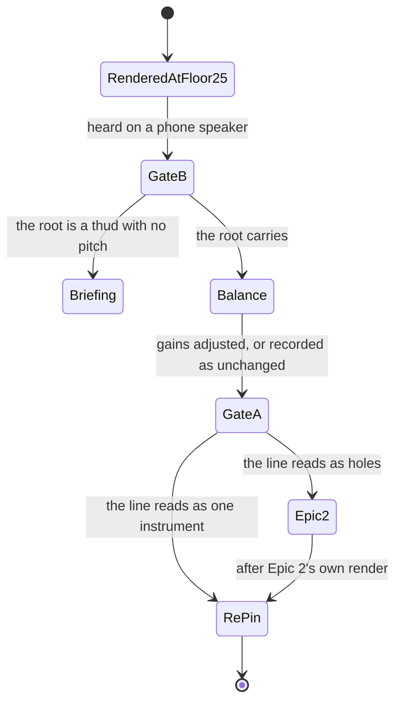

# PRD — Epic 1: The low roots sound on the low string

Feature: [briefing.md](../briefing.md) · [roadmap.md](../roadmap.md)

## Summary

Drop `BASS_FLOOR_MIDI` from 28 to 25 so a root in C♯, D or D♯ sounds on the low
string instead of being lifted a full octave, re-render the 48 grooves that
changes, and re-earn the listening sign-offs it voids. Nothing about how the bass
*plays* moves — not the pop, not the approach note, not the ceiling. It ships
when the root is still audible on a phone and the bass still sits right in all
nine feels.

## Problem

`inRegister` places a bass note at `24 + pitchClass` and lifts it an octave when
that lands under the floor. The floor is the open low E of a four-string, so C,
C♯, D and D♯ all come up — 502 of the catalogue's 2474 bass notes sit at MIDI
37–39, across 50 grooves.

That is not a tuning nicety. MIDI 37–39 is the register Sam plays guitar chords
in, and `docs/persona.md` reserves it: *"the lead register stays empty. Sam
brings the melody instrument."* Asked about the grooves that are lifted today,
Sam described the symptom without the cause: *"a bass that's crept up into my
chord voicings makes the groove feel thin and slightly in the way — I'd say
'this one's a bit weak, I don't fancy playing along to it' and I'd never once
think 'the root got lifted an octave.'"* About one groove a week is currently
that one.

Feature-27 removed the reason it had to be that way. The Squier Bass VI pack
samples down to C♯1, MIDI 25 — a detuned low string the library recorded — so
three of the four lifted pitch classes can now be played where a bass player
would play them.

## Scope

- `BASS_FLOOR_MIDI` in `scripts/grooves/events.ts`
- `events.test.ts`'s sampled-range bound and `pack.test.ts`'s `BASS_PLAYED`
- re-render 48 grooves, rewrite `grooves.lock.json`, both manifests, `events.fixture.json`
- the bass-over-kick medians in `templates/boom-bap.test.ts` and `second-line.test.ts`
- two listening gates, then `gain.bass` in the nine templates only if they call for it
- the rule `SIGN_OFFS` anchors are chosen by, and then one re-pin
- `docs/music.md`'s *Voicing* paragraph

**Out of scope**
- **the octave pop.** Measured, not deferred: all nine sites the lower floor
  unblocks land on the pitch the note already has today
- **the approach note's direction.** The flip is symmetric, and the mechanism it
  exposes is true today
- `BASS_CEILING_MIDI` and the widened span — Epic 2, and only on a verdict
- minting grooves, and therefore `ROTA_EPOCH`
- the comp, the drums, and the 24 reference notes under `public/notes/`, which
  render from `comp` alone
- the trained musician's read on a 23-semitone leap. `docs/persona.md` rules them
  out of the default page, and gate A is Sam's ear, not a transcriber's

## Requirements

### The register

- **R1** — `BASS_FLOOR_MIDI` is 25. `BASS_BASE_MIDI` stays 24 and
  `BASS_CEILING_MIDI` stays 48, so the fold rule itself is unchanged: C still
  lands at 24, still falls under the floor, and still comes up to C2. That is the
  lowest C a four-string plays and it is correct rather than a leftover.
- **R2** — The floor is the lowest note the library **sampled**, not the lowest
  the pack can interpolate to. MIDI 23 is inside the two-semitone bound and is
  not a note this instrument has; the register claims no pitch the recording does
  not hold.
- **R3** — Every bass note the catalogue asks for sounds at MIDI 25 or above.
  `BASS_PLAYED` reads `{ lowest: 25, highest: 48 }` — the low value because 25 is
  now the lowest `inRegister` can return, and the high value because the
  catalogue already plays 48 and the committed `47` was wrong before this change
  touched it.
- **R4** — The twelve grooves rooted C♯, D or E♭ place that root at MIDI 25–27,
  shown by a measurement over the committed catalogue rather than by reading the
  constant.
- **R5** — 48 of the 54 grooves re-render and 508 bass notes move. A materially
  different count means something else changed with it and is investigated, not
  re-baselined. The six that do not move are groove-08, 52, 54 and 82, which
  carry notes at 37–39 that stay, and groove-49 and 68, which move only through
  the approach note.
- **R6** — Both octave-pop sites are unchanged. A note that folded to 37 and
  failed `37 + 12 ≤ 48` now folds to 25, passes, and pops back to 37, so
  `previousBass` chains identically and nothing downstream moves. Leaving the pop
  alone is the option that changes no audio; constraining it would change 36 more
  notes across 8 more grooves and raise leaps of 18 semitones or more from 140 to
  152 per pass.
- **R7** — The approach note is unchanged. `events.ts` has always had exactly one
  pitch class it cannot approach from below — whichever fold lands on the floor —
  and this moves that from E to C♯, sixteen flips per pass, eight each way. A
  semitone above resolving down is as idiomatic as one from below.
- **R8** — The always-lift is unchanged. `bottom` drops in 48 grooves, but
  widening its filter only admits lower notes and the site takes the maximum: the
  same note is lifted from the same pitch in 54 of 54 grooves, and each line's
  highest note is identical.

### Identity

- **R9** — No committed puzzle answer moves. `rest`, `repeat` and `drop` are
  drawn unconditionally before the floor is consulted and `inRegister` is
  arithmetic on already-drawn values, so `MUSIC_LABEL`'s draw order is untouched.
  `src/lib/hash.ts` and its fixed table, the `FLAVOURS` order, and every uuid's
  scale, chord, root, bpm and name are unchanged. Nothing is minted, so
  `ROTA_EPOCH` stays at 4.

### The two gates

- **R10** — Gate B is heard first and is dispositive. If the root is not audible,
  the floor is wrong and no verdict on the span matters.
- **R11** — **Gate B, the root.** The root's audibility is judged on a phone
  speaker and nowhere else. The downbeat is exempt from rest, repeat and the
  32% pop roll (`events.ts:599-604`), and on the twelve low-rooted grooves it is
  also below the always-lift's reach, since that site only lifts a note above the
  figure's lowest and a root at 25–27 *is* the lowest — so the answer-bearing note
  is the one that drops lowest, on every bar. (The always-lift is not exempt in
  general: 31 of its 54 lifts land on a downbeat root, against what
  `docs/music.md:332-336` claims. That is true today, it is not this epic's to
  fix, and Epic 2's repair is where it would be.) C♯1 measures 34.76 Hz and `mix.ts` applies no
  high-pass, so what reaches the ear is whatever the device reproduces of its
  harmonics. Anchors: groove-44 (53.6% of bass note-time below MIDI 28), 17
  (50.0%), 79 (45.5%), 03 (41.7%). The device and the playback level are recorded
  with the verdict.
- **R12** — A gate B verdict of "the root is a thud with no pitch" is a verdict
  against floor 25 for the bottom pitch classes. It returns the feature to the
  briefing; it is not fixed by a gain, and it is not passed to Epic 2.
- **R13** — **Gate A, the span.** Whether the widened register reads as one
  instrument continuing or as a second one entering. Anchors: groove-20, 79, 17,
  42, 57 and 72, each carrying a leap of 21 semitones or more. A "holes in the
  line" verdict is what creates Epic 2.
- **R14** — `gain.bass` is re-measured per feel only if gate B calls for it.
  Nothing forces it: all 54 grooves pass all seven gate checks at floor 25 with
  the nine committed values untouched, and the per-feel median RMS moves at most
  −0.11 dB. The expected direction of any fix is a small **raise**, because the
  bass's own pre-gain RMS falls everywhere — by −0.20 to −1.23 dB per feel and
  −2.25 dB at worst — the pack's low samples carrying less energy than their upper
  octave at the same velocity. Most exposed: `open-ballad` (33.3% of bass
  note-time below MIDI 28) and `bright-straight` (24.9%); least,
  `swung-sixteenth` (7.0%). "Nothing to change" is a valid outcome and is
  recorded as one.
- **R15** — The bass-over-kick medians in `boom-bap.test.ts` and
  `second-line.test.ts` are re-measured to what the lower register produces. They
  assert each feel within 1.5 dB of `straight-funk`'s and were last measured by
  feature-27 at bass −5.19 against −5.25.
- **R16** — Every re-rendered groove passes all seven gate checks, the −29…−20
  dBFS loudness band included. A feel that falls out of the band is a balance
  failure to fix, not a band to widen.

### The rule the sign-offs are chosen by

- **R17** — The `SIGN_OFFS` preamble's justification for one pin per feel — "a
  feel's grooves render from one template file over one shared pack, so the
  unpinned ones cannot move without the pinned one moving too" — is rewritten,
  because this change disproves it. It moves events rather than a template or the
  pack, so groove-08 and groove-48 render byte-identical and their pins stay green
  over sibling grooves nobody has heard since.
- **R18** — "The groove that moved most" is **one fixed metric for every entry:
  the share of a groove's bass note-time that sounds below MIDI 28.** Each feel's
  anchor is that metric's maximum among the feel's grooves, and the rule holds as
  a test beside `pins one signed-off render per registered feel` rather than as
  prose. It lands **before** the re-pin, so anchors are picked by it rather than
  retrofitted to it.
- **R19** — The metric is computed from the committed catalogue's own event
  streams, so it says nothing until this epic lands: at floor 28 no groove has any
  bass note-time below MIDI 28 and every groove scores exactly zero. The rule
  therefore discriminates on this epic's renders and on whatever replaces them —
  a later change that moves the streams moves the argmax, and the rule re-picks
  rather than holding an anchor by history.
- **R20** — The table grows rather than swaps. `still guards every sign-off this
  repo has been given` pins the exact list of ids and calls removing one "the same
  as re-pinning it blind"; groove-08's and groove-48's approvals still stand on
  audio that did not move, so a `shuffle` and a `swung-sixteenth` anchor that did
  move join the table beside them. Growing rather than swapping is also what keeps
  the ride-figure coverage test green: no figure loses the entry that covers it.
- **R21** — **`SIGN_OFFS` is pinned once per feature, against the render that
  ships.** If gate A passes, that render is this epic's and the pin happens here,
  after both gates and after any gain change. If gate A says the line has holes,
  Epic 2's render is what ships, so no hash moves here: this epic records its
  verdict in words and Epic 2 carries the only pin. The table never holds a hash
  for audio that no player heard.
- **R22** — Both gates are heard on this epic's renders either way. Q3-C defers the
  pin, not the listening: gate A's verdict cannot be formed without hearing these
  renders, and gate B's decides whether the floor is right at all.
- **R23** — While the pin is deferred, `gate.test.ts` says so in the type rather
  than in a comment. `SignOff.pcm` becomes `string | null`, null meaning "awaiting
  the render that will ship", and the entry's `upstream` names what it is waiting
  for. This is the shape the type already carries one field over — `mp3` is
  `string | null`, documented as "null where the groove is deliberately not
  encoder-pinned" — so the per-entry pcm assertion becomes conditional exactly as
  the encoder assertion already is.
- **R24** — A null entry is never silent. The suite asserts that every unpinned
  entry names what it awaits, so a pending sign-off appears in a passing run as a
  named pending thing rather than as nothing at all. Re-pinning a void entry to
  make the suite green stays forbidden; a null is not a re-pin.

### Shipping

- **R25** — This epic does not reach `main` on its own if gate A says the line has
  holes. Floor 25 and the span bound then ship as one commit, so a leap the one
  physical instrument cannot play is never released and one `git revert` is the
  whole rollback. If gate A passes, this epic is the whole feature and ships alone.
- **R26** — The epic is still built and validated on its own criteria either way,
  and waiting for Epic 2 delays the commit rather than the work. With R23 the
  suite stays green through the interval, so the earlier concession that this epic
  could not be graded in the Epic-2 branch no longer holds: what it cannot claim
  is a *sign-off*, and AC13 grades that as a recorded verdict instead of a hash.
- **R27** — Nothing with a null `pcm` reaches `main`. **This is not machine-checked
  and the PRD says so rather than implying otherwise:** the repo has no CI and no
  pre-push hook, so what holds it is Epic 2's own requirement that every pending
  entry is resolved, plus review — the same "review only" status
  `docs/architecture.md` gives four of its own boundaries.

### The record

- **R28** — `docs/music.md`'s *Voicing* paragraph is rewritten: the hard floor,
  "the open low E of a four-string", and "only C, C♯, D and D♯ come up an octave"
  are all three false afterwards. It also records why the floor is a sampled note
  rather than the pack's interpolation limit, so the next reader does not reach
  for MIDI 23.
- **R29** — groove-02 bar 2 beat 1 is resolved in writing. B folds to 35 and
  `BASS_OCTAVE_LIFT` takes it to 47 under the ceiling; B0 is 23, unreachable from
  a floor at 25, so the note is deliberately unchanged and that is the record
  rather than an oversight.

## Behaviour details

The fold, at both floors, for the four pitch classes that behave differently:

| pitch class | `24 + pc` | floor 28 | floor 25 | pop reachable at 25? |
| :-- | --: | --: | --: | :-- |
| C | 24 | 36 (lifted) | 36 (lifted) | unchanged |
| C♯ | 25 | 37 (lifted) | **25** | yes → 37, the pitch it has today |
| D | 26 | 38 (lifted) | **26** | yes → 38, the pitch it has today |
| D♯ | 27 | 39 (lifted) | **27** | yes → 39, the pitch it has today |
| E and above | 28+ | unchanged | unchanged | unchanged |

The gate order, and what each verdict does:

## Acceptance criteria

- **AC1** (R1, R2) — Given the committed generator, when the bass is asked for a
  note in every pitch class, then nothing sounds below MIDI 25 and C sounds at 36.
- **AC2** (R3) — Given `BASS_PLAYED`, when the pack's sampled notes are measured
  against it, then the lowest asked note equals the lowest sampled note and no
  asked note is more than 2 semitones from a sample.
- **AC3** (R4) — Given the committed catalogue, when the twelve grooves rooted
  C♯, D or E♭ are read from their event streams, then each places its root at
  MIDI 25–27.
- **AC4** (R5) — Given the re-render, when the changed set is counted, then 48
  grooves and 508 notes moved, and the six named grooves did not.
- **AC5** (R6, R7, R8) — Given both floors, when the event streams are compared,
  then every pop lands on the pitch it lands on today, the approach flips number
  sixteen per pass with eight in each direction, and the always-lift picks the
  same note from the same pitch in all 54 grooves.
- **AC6** (R9) — Given the re-rendered catalogue, when every uuid's scale, chord,
  root, bpm and name is compared with the previous manifest, then all are
  identical, `ROTA_EPOCH` is 4, and `hash.test.ts`'s fixed table passes untouched.
- **AC7** (R11, R12) — Given the four gate B anchors played on a phone speaker,
  when the listener is asked whether they can hear the root, then the answer and
  the device are recorded, and a negative answer stops the epic rather than
  adjusting a gain.
- **AC8** (R13) — Given the six gate A anchors, when they are played, then a
  verdict on the span is recorded and a "holes" verdict opens Epic 2.
- **AC9** (R14, R16) — Given the final renders, when all 54 are gated, then all
  seven checks pass over every groove with RMS inside −29…−20 dBFS, and any
  `gain.bass` change is recorded per feel with the ear it was set by.
- **AC10** (R15) — Given the re-rendered catalogue, when each feel's
  bass-over-kick median is measured, then every feel sits within 1.5 dB of
  `straight-funk`'s.
- **AC11** (R18, R19, R20) — Given the anchor rule as a test, when the table is
  read, then each feel's anchor is the groove with the highest share of bass
  note-time below MIDI 28 among that feel's grooves, groove-08 and groove-48 are
  still pinned, and every ride figure the catalogue ships still has an entry
  covering it.
- **AC12** (R21, R22) — Given a gate A verdict that the span reads fine, when the
  sign-off suite runs, then every entry's pcm hash matches its render and every
  re-pinned entry carries a verdict and a scope.
- **AC13** (R21, R23) — Given a gate A verdict of "holes", when this epic ends,
  then the ten entries whose audio changed carry `pcm: null`, no hash has been
  moved, and both gates' verdicts are recorded in the epic's own words.
- **AC14** (R24) — Given any entry with `pcm: null`, when the sign-off suite runs,
  then it passes and names that entry and what it is waiting for; and given every
  entry pinned, the same suite asserts every hash as it does today.
- **AC15** (R25, R26, R27) — Given a gate A verdict of "holes", when the feature
  is graded, then it is graded once over the joint commit, nothing was pushed
  carrying a leap the instrument cannot play, and no committed entry has a null
  `pcm`.
- **AC16** (R28, R29) — Given `docs/music.md`, when the *Voicing* paragraph is
  read, then it states the floor as C♯1, says why it is a sampled note, and no
  sentence claims the four-string low E; and groove-02's B2 is explained in the
  epic's record.

## Dependencies

- **feature-27, committed** (`f282391`). Its epic-1 contract C2 froze
  `events.ts`, `BASS_BASE_MIDI`, the floor, the ceiling and `BASS_PLAYED`; the
  contract is discharged and those are this epic's to change. Its pack is what
  makes MIDI 25 a real note.
- **Hands to Epic 2:** the renders both gates were heard on, and gate A's verdict.
  Epic 2 exists only if that verdict says the line has holes, and it cannot start
  before the renders have been heard, because no measurement answers its question.
- **Shares a commit with Epic 2** when Epic 2 exists. This epic's floor change is
  the working tree Epic 2 builds on, and neither reaches `main` without the other.

## Assumptions

- **Re-rendering audio players have already heard needs no migration.**
  `docs/music.md` puts the audio explicitly off the freeze list: "A groove is a
  slot, not a record."
- **Sam never compares two days.** *"I play one puzzle a day and then it's
  over."* The win is not that C♯ grooves now match E grooves; it is that about one
  groove a week stops being the thin one.
- **The listening passes are one person's, recorded in their words.** That is how
  every sign-off in this repo has been taken, and nothing here can assert it.
- **Gate B's device is the phone the app is normally played on**, at the level it
  is normally played at, both recorded with the verdict — not a controlled
  listening test.
- **The catalogue holds at 54 grooves**, so the rota is untouched.
- **The fixed metric is honest only while the bass is what keeps changing.** A
  ride, swing or pattern change would pick its anchor by a number with nothing to
  do with what it moved, and the rule would then be worse than the prose it
  replaced. That is the price of one metric instead of a registry; the change that
  hits it is the change that should revisit it.
- **A listening pass is the anchors, not the catalogue** — ten to twelve grooves,
  the way feature-27 took one verdict per feel. Earlier notes on this feature said
  "the whole catalogue twice", which overstates it by about a factor of five.
- **Q4 makes the interval green, which retires an argument made twice.** Q1-A in
  the roadmap and Q3-B here both turned on "an epic that ends red cannot be graded
  done". With a nullable `pcm` the interval is not red, so that argument stops
  applying to this feature — and the thing it was protecting, a released commit
  with failing tests, was already ruled out by Q2-B.
- **Q3 was not about listening cost.** Both of its live options heard these
  renders; they differed only in whether the intermediate audio got a hash. So
  the deferral buys integrity in the table and saves no time, and the "the cost is
  smaller than it reads" argument made for option A was answering the wrong axis.

## Question log

### Cycle 1 — 2026-09-07

**Q1. What does "the groove that moved most" mean, in a form a test can assert?**
Answer: **B) One fixed metric for every entry — share of bass note-time below
MIDI 28.** A dozen lines instead of a metric registry, at the stated cost that a
later change of a different kind picks its anchor by an irrelevant number.
Applied to: R18, R19, AC11, Assumptions

**Q2. If gate A says the line has holes, does Epic 1 still ship?**
Answer: **B) No — Epic 1 holds until Epic 2 lands, and the two ship as one
commit.** A leap the one physical instrument cannot play is a defect by
`docs/music.md`'s own standard, and shipping one to fix it next week is what "fine
for now" looks like the first time.
Applied to: R21, R22, R23, AC13, Dependencies

### Cycle 2 — 2026-09-07

**Q3. When Epic 2 runs, does this epic still take its own sign-off pass?**
Answer: **C) The pin happens once, after Epic 2** — the table only ever holds a
hash for audio that shipped, which is what its own failure message is for. The
listening still happens here; only the hash waits.
Applied to: R21, R22, R23, R25, AC12, AC13, AC14, Assumptions

**Conflict surfaced rather than resolved silently.** The roadmap's Q1-A chose to
keep the re-pin inside Epic 1 *specifically* so the epic would end green — "an
epic that deliberately ends red on `voidSignOff` cannot be verified done" — and
that is the reason Q3-B was written as a rejected option. Q3-C accepts the same
red state that reasoning rejected. It is a narrower version of it: Q3-B deferred
the whole sign-off, while Q3-C keeps both listening gates and defers only the
hash, and Q2-B had already removed the release Q1-A was protecting, since Epic 1
no longer reaches `main` alone. What does not survive is Q1-A's promise that this
epic ends green — R25 now says plainly that in the Epic-2 branch it does not, and
the feature is graded once over the joint commit instead. Q4 below is the part
that is still genuinely undecided.

### Cycle 3 — 2026-09-07

**Q4. How does `gate.test.ts` report ten sign-offs whose render is still coming?**
Answer: **A) `pcm: string | null`, null meaning "awaiting the render that will
ship"** — the same shape `mp3: string | null` already has, so the per-entry
assertion becomes conditional the way the encoder assertion already is, and the
id list and ride-figure coverage stay intact.
Applied to: R23, R24, R26, R27, AC13, AC14, AC15, Assumptions

**One thing Q4-A promised that this PRD cannot deliver as stated.** The option's
reasoning ended with "a test asserting 'no entry is left null on `main`' is what
stops the state becoming permanent". No test can know which branch it is on, and
this repo has neither CI nor a pre-push hook, so that guard does not exist to be
written. R27 records the rule and names it as review-enforced rather than
pretending a test holds it; Epic 2's requirement that every pending entry is
resolved is the mechanical half. The candidate idea "CI pipeline" in
`specs/features.md` is where the missing guard would actually land.

**This PRD is settled.** Nothing high-impact is open.
