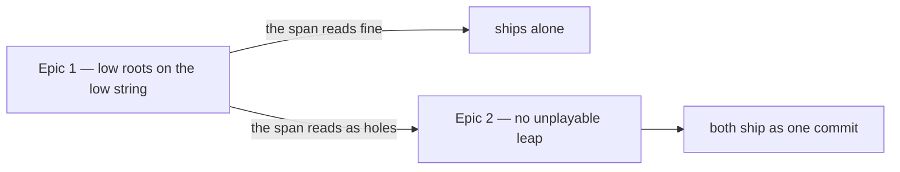

# Roadmap — Bass register lower end

Source: [briefing.md](briefing.md)

## Overview

The generator refuses to play the bass below MIDI 28, the open low E of a
four-string, so every C♯, D and D♯ is lifted a full octave to 37–39 — into the
register Sam plays guitar chords in. The Squier Bass VI pack feature-27 shipped
samples down to C♯1 (MIDI 25), so the floor can drop and those roots can sound
where a bass player would put them. One epic does that end to end: the constant,
48 re-renders, the balance, and one listening pass that pins the sign-offs once.
It also fixes the rule those sign-offs are chosen by, which this change is what
falsifies. A second epic exists only if that listen says the widened register has
opened holes in the line — a bound on how far the line may leap, taken by ear,
that nothing in the measurement can settle in advance. If it exists, the two ship
as one commit: a leap the instrument cannot play is never released on its own.

## Epics

### Epic 1 — The low roots sound on the low string

**Visible when done:** Sam hits play on a C♯, D or E♭ groove and the bass is down
where a bass belongs instead of up in the register they play chords in — at a
level that still sits right in all nine feels.
**Depends on:** none
**Parallel with:** none

**Scope**

- `BASS_FLOOR_MIDI` 28 → 25 in `scripts/grooves/events.ts:45`. Nothing else in
  the register moves: `BASS_BASE_MIDI` stays 24, so C still folds up to C2 by the
  same rule, and `BASS_CEILING_MIDI` stays 48 (Epic 2 is where that is revisited).
- `scripts/grooves/events.test.ts:231` — the one hard-coded floor assertion, in a
  test called *"keeps pitched notes inside the sample pack's sampled range"*. The
  pack has sampled down to 25 since feature-27, so that bound is already three
  semitones above its own stated subject. It goes to 25 and the test starts
  matching its name.
- `BASS_PLAYED` in `scripts/grooves/pack.test.ts:344-350` → `{ lowest: 25,
  highest: 48 }`, and the comment paragraph above it, which currently names the
  floor as 28 and cites feature-27's discharged contract C2. The lowest value
  `inRegister` can return becomes exactly the lowest sampled note, so `:456`'s
  shortfall goes 1 → 0 and `samples/pack.test.ts:255`'s two-semitone spacing
  bound gets easier rather than harder.
- Re-render: **48 of 54 grooves change**, 508 bass notes move. Not the 50 that
  carry a note at 37–39 — groove-08, 52, 54 and 82 have such notes that don't
  move, and groove-49 and 68 move without one, through the approach note. Then
  `grooves.lock.json`, both generated manifests, `events.fixture.json`.
- Re-measure the bass-over-kick medians in `templates/boom-bap.test.ts:243` and
  `second-line.test.ts`, which assert each feel's median within 1.5 dB of
  `straight-funk`'s and were last measured by feature-27 at bass −5.19 against
  −5.25.
- **Listening gate A — the span.** Anchors: groove-20, 79, 17, 42, 57, 72, each
  carrying a leap of 21 semitones or more. The question is whether the low note
  reads as the same instrument continuing or as a second one entering. A "holes
  in the line" verdict is what creates Epic 2.
- **Listening gate B — is the root still audible on a phone speaker?** Judged
  there and nowhere else (Q2-A), and measured before anything is pinned. Anchors:
  groove-44 (53.6% of bass note-time below MIDI 28), 17 (50.0%), 79 (45.5%),
  03 (41.7%). C♯1 measures 34.76 Hz in `samples/pack.json` and `mix.ts` applies
  no high-pass, so nothing in the render removes it — the question is entirely
  what the playback device reproduces. The downbeat is exempt from rest, repeat
  and pop (`events.ts:599-604`), so on the twelve grooves rooted there the
  answer-bearing note is exactly the one that drops lowest, on every bar.
- **`gain.bass` per feel, only if gate B calls for it.** Nothing forces it:
  all 54 grooves pass all seven gate checks at floor 25 with the nine values
  untouched, and the per-feel median RMS moves at most −0.11 dB. The expected fix,
  if any, is a small *raise* — the bass's own pre-gain RMS falls everywhere, by
  −0.20 to −1.23 dB per feel and −2.25 dB at worst, because the pack's low
  samples carry less energy than their upper octave at the same velocity
  (at v0.9: 37 → 25 is −5.3 dB, 38 → 26 is −3.7, 39 → 27 is −1.1). Most exposed:
  `open-ballad` (33.3% of bass note-time below 28) and `bright-straight` (24.9%);
  least, `swung-sixteenth` (7.0%).
- **Fix the rule the anchors are chosen by, before re-pinning anything** (Q3-C).
  The `SIGN_OFFS` preamble justifies its one-pin-per-feel compression with "a
  feel's grooves render from one template file over one shared pack, so the
  unpinned ones cannot move without the pinned one moving too", and this change
  is what disproves it: it moves *events*, so groove-08 and groove-48 come out
  byte-identical and their pins stay green over sibling grooves nobody has heard
  since. Rewrite that paragraph, and make the rule "the groove that moved most"
  hold as a test beside `pins one signed-off render per registered feel`
  (`gate.test.ts:1245`) rather than as prose. The metric is Q4.
- **Then re-pin `SIGN_OFFS` once, at the end** (`gate.test.ts:749`). Ten of the
  twelve go void. The table **grows rather than swaps**: `still guards every
  sign-off this repo has been given` (`:1131`) pins the exact twelve ids and says
  "removing one is the same as re-pinning it blind", and groove-08's and
  groove-48's approvals still stand on audio that did not move — so a new anchor
  for `shuffle` and `swung-sixteenth` joins them instead of replacing them.
- `docs/music.md:325-329` — all three sentences of the *Voicing* paragraph: the
  hard floor, "the open low E of a four-string", and "only C, C♯, D and D♯ come
  up an octave". No test reads that prose, so it is review-only.
- Resolve groove-02 bar 2 beat 1 in writing, per the briefing: B folds to 35 and
  `BASS_OCTAVE_LIFT` takes it to 47 under the ceiling. B0 is 23, unreachable from
  a floor at 25, so the note is deliberately unchanged and that is the record.

**The two gates are gates inside this epic, not an epic boundary** (Q1-A). This
is feature-27's shape, for its reason and one of its own: pinning twice means
listening to the whole catalogue twice, and an epic that deliberately ends red on
`voidSignOff` cannot be verified done — one **partly** blocks the whole feature
from ✅ under `/implement-feature` §10.

**Out of scope**

- **The octave pop, and this is a finding rather than a deferral.** All nine
  sites the lower floor unblocks land on the pitch the note already has today: a
  note that folded to 37 and failed `37 + 12 ≤ 48` now folds to 25, passes, and
  pops back to 37. `previousBass` chains identically, so nothing downstream moves
  either — groove-08's bass line is unchanged *because* of this. Leaving both
  sites alone is the option that changes nothing; constraining them is the
  behaviour change, and it is measurably worse (36 more notes across 8 more
  grooves, and leaps ≥18 semitones rising 140 → 152). The briefing leaves this
  open; the measurement closes it.
- **The approach note's direction.** The flip is exactly symmetric — 16 per pass,
  8 each way. `events.ts:626-629` has always had one pitch class it cannot
  approach from below, whichever fold lands on the floor; this moves it from E to
  C♯ one-for-one. The real smell is that `direction` is drawn at `:619` and then
  overridden 8 times per pass, which is true today and is its own ticket.
- **`bottom` and the always-lift.** `bottom` drops in 48 grooves, but widening
  `note.midi > bottom` only admits lower notes and the site takes the maximum —
  the same note is lifted from the same pitch in 54 of 54 grooves, and the line's
  maximum is identical in every changed groove.
- the widened span, and any bound on it — Epic 2, and only on a verdict.
- Minting grooves, and therefore `ROTA_EPOCH`. Every uuid keeps its slot and its
  answer; only the sound behind it changes.
- `src/lib/hash.ts`, `MUSIC_LABEL`'s draw order, the `FLAVOURS` order. No draw
  moves: `rest`, `repeat` and `drop` are drawn unconditionally at
  `events.ts:596-598` before the floor is read, and `inRegister` is arithmetic on
  already-drawn values.
- The 24 reference notes under `public/notes/`. They render from `comp` alone.

**Validation**

- `/dev/grooves` under `next dev` is the listening path for both gates: it plays
  any groove by date, which is how the twelve low-rooted ones get heard together.
- `npm run grooves` re-renders; `npm run grooves:verify` (also `prebuild`) passes
  against the rewritten lock.
- `npm run test:all`: `events.test.ts`'s sampled-range test at the new bound;
  `catalogue-gate.test.ts` on all seven checks over 54 grooves, the −29…−20 dBFS
  loudness band included; `pack.test.ts` on `BASS_PLAYED` and the pack shortfall;
  `samples/pack.test.ts` on note spacing; the two bass-over-kick medians;
  `gate.test.ts`'s `SIGN_OFFS` re-pinned and `voidSignOff` green.
- A measurement, not a reading, for the briefing's second promise: the twelve
  grooves rooted C♯/D/E♭ place that root at MIDI 25–27, taken over the committed
  catalogue.
- `uuidFreeze.test.ts` on both tiers, and every uuid's scale, chord, root and bpm
  unchanged in `grooves.generated.ts` — the proof that answers didn't move.

### Epic 2 — No leap the bass could not actually play

**Visible when done:** the bass line reads as one instrument all the way down —
no jump so wide that the low note arrives as something else entering.
**Depends on:** Epic 1's listening gate A. **This epic does not exist if the
verdict is that the widened register reads fine**, and dropping it then is the
right outcome rather than a gap.
**Parallel with:** none

**Scope**

- **A leap bound** in `events.ts` — a rule on the interval between consecutive
  bass notes, with a re-voicing when it is exceeded. Both ends of the register
  stay: floor 25, ceiling 48.
- Re-render, re-balance and re-pin as Epic 1 does. This is the larger change of
  the two: **890 notes across 53 grooves**, against Epic 1's 508 across 48.
- The count of octave pops the catalogue plays, before and after. A rule that
  fixes the leaps by making the pop rare has failed.

**Out of scope**

- **`BASS_CEILING_MIDI` 48 → 45**, which is what this epic was first sketched as.
  It fixes a leap problem by shrinking the register — spending three of the
  semitones Epic 1 bought and blocking 20 pops where Epic 1 blocks 9. Priced
  (span back to 18/20, leaps ≥18 down to 16) and rejected.
- Constraining the pop sites instead. Measured as the wrong lever — it strands
  low notes beside unchanged high ones and raises the very leaps this epic exists
  to lower.
- Any change to the floor. Epic 1's verdict on that stands.

**Validation**

- The same six span anchors, heard again: groove-20, 79, 17, 42, 57, 72.
- All seven gate checks over 54 grooves; the two bass-over-kick medians; the
  `SIGN_OFFS` re-pinned once more.
- Every consecutive interval measured over the committed catalogue, not read off
  a constant, and the pop count recorded against Epic 1's.

## Dependency map

## Execution waves

- **Wave 1:** Epic 1. Built and graded on its own criteria either way.
- **Wave 2:** Epic 2 — conditional, and gated on a listening verdict rather than
  on code. Nothing in it can start before Epic 1's renders have been heard,
  because the measurement cannot answer the question it turns on.
- **The commit is joint whenever Epic 2 exists.** Epic 1 does not reach `main`
  carrying a leap the one physical instrument cannot play, so it waits in the
  working tree and the two land together — which is also what keeps one
  `git revert` as the whole rollback for the feature.

## Assumptions

- **The change is right for a reason the briefing doesn't give.** Sam on the
  grooves that are lifted today: *"a bass that's crept up into my chord voicings
  makes the groove feel thin and slightly in the way — I'd say 'this one's a bit
  weak, I don't fancy playing along to it' and I'd never once think 'the root got
  lifted an octave.'"* `docs/persona.md`'s *the lead register stays empty* points
  down as well as up.
- **Sam never compares two days.** *"I play one puzzle a day and then it's
  over."* So the win is not "C♯ grooves now match E grooves" — it is that about
  one groove a week stops being the thin one.
- **Re-rendering audio players have already heard needs no migration.**
  `docs/music.md` § *What must never change* puts the audio explicitly off that
  list: "A groove is a slot, not a record."
- **The balance may turn out to be a no-op.** The gate passes at floor 25 with
  every gain untouched, so gate B may end in "nothing to change" — which is a
  verdict, and it still has to be listened for rather than assumed.
- **A phone problem is a floor problem, not a playback ticket.** Q2-A judges gate
  B on a phone speaker alone, so "the root is a thud with no pitch there" is a
  verdict against floor 25 for the bottom pitch classes — it goes back to the
  briefing rather than forward to Epic 2. `docs/persona.md` grounds it: *"a win
  in two minutes, on the phone, before the day starts"*, and the one failure it
  names outright is *"a puzzle that is unwinnable"*.
- **The catalogue holds at 54 grooves.** Nothing here mints, so the rota is
  untouched and `ROTA_EPOCH` stays at 4.

## Answered — Q1-A, Q2-A, Q3-C

**Q1-A — the balance and the sign-off stay inside Epic 1**, as the two listening
gates. The roadmap already read this way and now records it as a decision: one
listening pass, one re-pin, and an epic that ends green. Both agents argued for
the split, and the reason it lost is mechanical rather than musical — an epic
that deliberately ends red on `voidSignOff` can never be graded done. Sam's
condition on the split survives the merge and is worth keeping in the PRD: *"the
fix is a real Epic 2, not a shrug."*

**Q2-A — gate B is judged on a phone speaker.** Not both, not headphones. That
makes the gate strict in a way worth stating plainly: it is the option under
which the answer can be "floor 25 is wrong for the bottom pitch classes", and
that verdict sends the feature back to the briefing rather than on to Epic 2. See
Assumptions.

**Q3-C — the anchor rule changes, and it changes as a test.** One correction to
how the question was put: the rule is not in `docs/music.md`'s freeze list at
all. `music.md` says only that the gains "are turned by a listening sign-off";
the one-pin-per-feel compression and its justification live entirely in the
`SIGN_OFFS` preamble in `scripts/grooves/gate.test.ts`, so that is the prose that
changes and `music.md`'s freeze list is untouched by this answer.

Two things follow, both now in Epic 1's scope. The rule change lands **before**
the re-pin, so the new anchors are picked by the new rule rather than
retrofitted. And the table **grows rather than swaps** — that one is decided by
the existing test's own words rather than by me: `still guards every sign-off
this repo has been given` pins the exact twelve ids and calls removing one "the
same as re-pinning it blind", and groove-08 and groove-48 render byte-identical,
so their approvals still stand. A `shuffle` and a `swung-sixteenth` anchor that
did move join the table beside them.

What it opens is the one thing "moved most" does not say: measured how.

## Open questions — round 2

**None here. Q4 moved into the Epic 1 PRD**, where it is Q1 — the metric behind
"the groove that moved most" decides what a requirement says, so it belongs
beside the requirement rather than in two documents. Answer it in
[prd/epic-1-the-low-roots-sound-on-the-low-string.md](prd/epic-1-the-low-roots-sound-on-the-low-string.md).

The roadmap's own shape is settled: Q1-A, Q2-A and Q3-C above.
