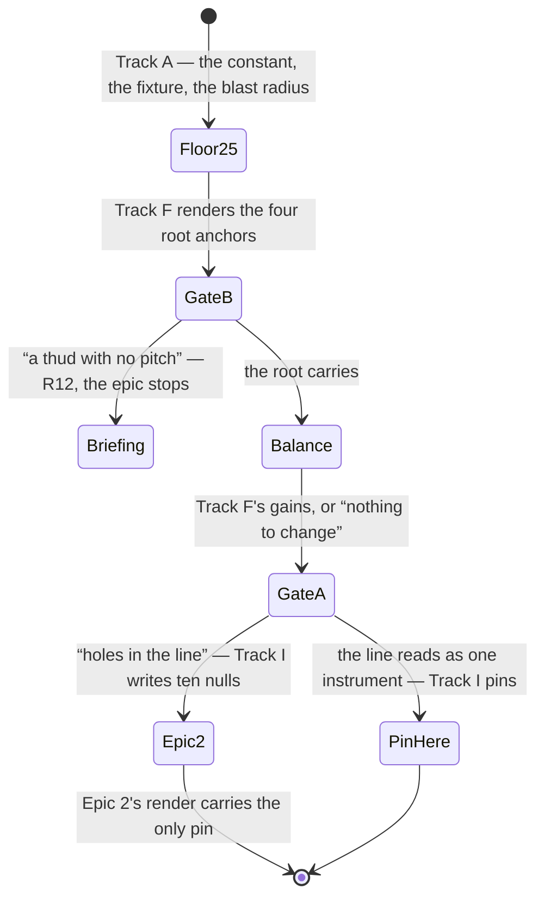

# Tech spec — Epic 1: The low roots sound on the low string

PRD: [../prd/epic-1-the-low-roots-sound-on-the-low-string.md](../prd/epic-1-the-low-roots-sound-on-the-low-string.md) ·
Roadmap: [../roadmap.md](../roadmap.md)

## Approach

The epic is one character of source — `28` → `25` at `scripts/grooves/events.ts:45` —
and everything else in this plan is either a test that could not fail before it or
a consequence of it that has to be measured, heard or recorded. The decomposition
falls out of two facts. First, **lowering a floor loosens every bound written
against it**, so the naive red step does not exist: `events.test.ts:231`'s
`toBeGreaterThanOrEqual(28)` still passes at floor 25, and so does
`:551`'s `(24)`. Four tests in this plan genuinely fail at floor 28 and pass at
floor 25, and they are what the red steps are built from — the twelve low-rooted
grooves' roots (R4), the catalogue's *exact* lowest bass note, `BASS_PLAYED`'s
shortfall (R2), and the anchor rule's non-degeneracy guard (R19). Second, **two
of the steps wait on a person and one of them can end the feature**, so the chain
behind them is real: render → gate B → balance → gate A → re-render → pin.

The one instrument that makes the mechanical half cheap is already committed and
neither the PRD nor the roadmap names it: **`scripts/grooves/events.fixture.json`
is a byte-identity record of all 54 grooves' event streams**, keyed
`template:seed`, holding `music` plus one serialised line per event with its
midi (`eventsFixture.ts`). Comparing `buildFixture()` at floor 25 against
`git show HEAD:scripts/grooves/events.fixture.json` at floor 28 answers R5, R6,
R7, R8 and half of R9 in seconds, with no audio rendered — and because the render
is deterministic, "the groove's event stream changed" and "the groove's mp3
changed" are the same set, so the fixture also names R5's *48 grooves* before a
single mp3 is written — and, more usefully, proves per groove which six of the 54
did **not** move.

Wave 1 is where the parallelism is: the register, the pack's played range, the
anchor rule and the documents own four disjoint file sets and three of the four
carry a genuine red step. Waves 2 to 5 are a chain by necessity, not by caution —
a gain set before gate B is a gain nobody heard, a span verdict before the gains
is a verdict on audio that will not ship, and a hash pinned before the render is
a hash of nothing.

## Architecture

### The moving parts

| Part | Where | What changes |
| :-- | :-- | :-- |
| the register | `scripts/grooves/events.ts:45` | `BASS_FLOOR_MIDI` 28 → 25. Nothing else in the file |
| the register's tests | `scripts/grooves/events.test.ts` | `:231` and `:551`'s bass lower bounds; two new measurements over the committed catalogue |
| the played range | `scripts/grooves/pack.test.ts:343-350`, `:447-457` | `BASS_PLAYED` `{ lowest: 24, highest: 47 }` → `{ lowest: 25, highest: 48 }`, the comment paragraph above it, and the shortfall assertion |
| the event record | `scripts/grooves/events.fixture.json` | 48 of 54 entries rewritten, 508 bass midi values moved |
| the mix | the nine `scripts/grooves/templates/<feel>.ts` | `gain.bass` only, and **only if gate B calls for it** — nine numbers, `−23.4 … −19.0` today |
| the medians | `scripts/grooves/templates/boom-bap.test.ts:238`, `scripts/grooves/second-line.test.ts:593` | the measured figures in the comments. `ON_THE_LINE_DB` stays 1.5 — C7 |
| the catalogue | `public/grooves/*.mp3`, `scripts/grooves/grooves.lock.json`, `src/features/daily-groove/data/grooves.generated.ts` | 48 mp3s, their lock rows, `manifestSha256`, and the `headDelaySeconds` of whatever moved |
| the rule | `scripts/grooves/lowRegister.ts` (new), `lowRegister.test.ts` (new) | the anchor metric, R18's one fixed metric |
| the sign-offs | `scripts/grooves/gate.test.ts` | `SignOff.pcm` nullable, the preamble's falsified justification, the rule as a test, the entries |
| the record | `docs/music.md:325-330` | the *Voicing* paragraph's three false sentences, plus why the floor is a sampled note, the approach note's two directions and its fallback, and why groove-02's B2 is unchanged |

### The four tests that are red at floor 28

This is the whole TDD spine of the epic, collected in one place because the
default assumption — "lower the constant, watch a test go green" — is wrong here.

| Red test | Fails at floor 28 with | Step |
| :-- | :-- | :-- |
| the twelve low-rooted grooves place their root at MIDI 25–27 | `groove-03: expected 39 to be within 25..27` | A2 |
| the catalogue's lowest bass note is **exactly** 25 | `expected 28 to be 25` | A1 |
| the played register's low end equals the lowest sampled note | `the register claims a pitch the recording does not hold: expected 1 to be 0` | B2 |
| every feel's anchor metric is greater than zero | `straight-funk: every groove scores 0.0% — this rule discriminates nothing` | C5 |

Two more assertions fail today for reasons that have nothing to do with the
floor, and both are R3's: the catalogue plays MIDI 48 on 102 events (measured
over the committed fixture) while `BASS_PLAYED.highest` reads `47`, and the
shortfall `lowest − BASS_PLAYED.lowest` reads `1` against a pack whose lowest
sampled note has been 25 since feature-27. Track B closes both and does not need
Track A to have landed.

### What the committed fixture already proves, before anything renders

Measured over `scripts/grooves/events.fixture.json` as committed (`22a5f6c`):

- **2474 bass events** in the catalogue, of which **502 sound at MIDI 37, 38 or 39**
  and **0 sound below MIDI 28** — R19's claim, verified: at floor 28 the anchor
  metric scores exactly zero for all 54 grooves.
- **50 of the 54 grooves carry at least one note at 37–39.** The four that carry
  none are `groove-46` (half-time), `groove-48` (swung-sixteenth), `groove-49`
  (open-ballad) and `groove-68` (second-line).
- The catalogue's bass spans **MIDI 28–48**, with 96 events at 47 and **102 at 48**.

**R5's parenthetical list of the six unchanged grooves is garbled and the plan
uses the measured set instead.** R5 says six do not move and then names
`groove-08, 52, 54, 82` (unchanged) *and* `groove-49, 68` — which it says in the
same sentence do move. The roadmap's wording is the consistent one: of the 50
grooves carrying a 37–39 note, four (`groove-08, 52, 54, 82`) carry only
pop-reachable ones that stay, so 46 move; `groove-49` and `groove-68` move
without carrying one, through the approach note; 46 + 2 = 48. The remaining two
of the four zero-count grooves are therefore the unchanged pair, and the
measurement above names them: the six that do not move are

> **groove-08, groove-46, groove-48, groove-52, groove-54, groove-82.**

Both grooves R20 depends on rendering byte-identical — `groove-08` (shuffle) and
`groove-48` (swung-sixteenth) — are in that set, which is the independent check
that the arithmetic is right. Step A5 measures it rather than asserting it from
here.

**AC4 is graded on its byte-identity half, and the departure from R5's wording is
deliberate rather than a transcription slip.** Step A5 **asserts** the unchanged
set — `groove-08, 46, 48, 52, 54, 82` — and **records** the two totals without a
pass/fail on their value. The split is not tidiness: `groove-08` and `groove-48`
carry live sign-off pins, so their byte-identity is an independent check with a
consequence, while "48 grooves and 508 notes" is a derived statistic that rules
nothing out on its own. R5's tripwire clause — a materially different count is
investigated, never re-baselined — is enforced by **review plus Steps A6 and
A7**, which fail on the mechanism that moved rather than on a total that came out
different. Step A0 is what makes any of the three comparisons possible at all.
**This spec does not edit the PRD**: R5's inconsistent list and AC4's "then 48
grooves and 508 notes moved" are both the PRD's to adjust in a later
`/brainstorm` cycle, and recording the departures here is what keeps a builder
from splitting the difference.

### The gate order, and the branch it opens



Gate B is heard first and is dispositive (R10). Its verdict has three
destinations and only one of them is this plan: a negative verdict returns the
feature to `briefing.md` and Tracks G, H and I never run. Gate A's verdict
decides only *where the hash lands*, never whether the work was right, which is
why Track I has two shapes rather than two outcomes.

### Three listening events, and the eleven grooves they cover

| # | Event | Heard on | Asked | Recorded in | Pinned? |
| :-- | :-- | :-- | :-- | :-- | :-- |
| 1 | **Gate B — the root** | groove-44, 17, 79, 03, rendered at floor 25 with today's gains, played on a phone speaker | can you hear the root, or is it a thud with no pitch? | `.implement/gates/root/gate-b.md` + the epic report | yes, if gate A passes |
| 2 | **Gate A — the span** | groove-20, 79, 17, 42, 57, 72, rendered after the balance | does the low note read as the same instrument continuing, or as a second one entering? | `.implement/gates/span/gate-a.md` + the epic report | yes, if it passes |
| 3 | **The anchor approvals** | all eleven of the listening set, on the post-balance render | groove by groove, in the listener's own words: what does this one sound like? | `.implement/gates/anchors/approvals.md`, then each `SIGN_OFFS` entry's `approval` and `scope` | one entry each |

Event 3 is not a gate. It decides nothing, it can stop nothing, and it is not a
third question — it is the words. It exists because
`still guards every sign-off this repo has been given` (`gate.test.ts:1182`)
asserts a non-empty `approval` **and** a non-empty `scope` on every entry, and
the anchor rule now puts an entry on nine feels rather than on the two R20 names.
**No groove is pinned on a sibling's words**, so every entry Track I writes needs
a listener who heard that groove.

**The listening set is eleven grooves**, the union of three heavily overlapping
sets:

| Set | Grooves | Count |
| :-- | :-- | --: |
| gate B's root anchors | 03, 17, 44, 79 | 4 |
| gate A's span anchors | 17, 20, 42, 57, 72, 79 | 6 |
| the rule's nine argmaxes | 03, 14, 17, 44, 50, 57, 67, 72, 79 | 9 |
| **the union — the listening set** | **03, 14, 17, 20, 42, 44, 50, 57, 67, 72, 79** | **11** |

The two gates between them cover eight of the eleven. **Three — groove-14
(half-time), groove-50 (swung-sixteenth) and groove-67 (second-line) — are named
by the rule and by neither gate**, so nothing in either anchor list reaches them.
Step G3 is where those three are heard, and it is the step the every-feel rule
actually costs: eleven is the "ten to twelve grooves" the PRD's Assumptions size
a listening pass at, and the three extra grooves are the whole difference between
that figure and the eight the gates cover on their own.

Both gates are heard on this epic's renders either way (R22). Gate B's four are
heard **before** the balance, because gate B is dispositive and comes first
(R10); event 3 is heard **after** it, so a gain that moved is a gain the pinned
words were formed on. If F3 changes nothing — a valid outcome under R14 — those
four renders are byte-identical to the ones gate B was played, and event 3 is a
re-listen only in the bookkeeping sense.

### The anchor rule, and why its test is red before the floor moves

R18 fixes one metric for every entry: **the share of a groove's bass note-time
that sounds below MIDI 28**, note-time being `Σ durationSec`. R19 then says the
metric is degenerate at floor 28 — every groove scores zero — so a test for the
rule written before the render passes vacuously. This plan confronts that in two
places rather than one:

1. **The metric's arithmetic is unit-tested on constructed event streams**
   (Step C1), which discriminates at any floor and is what makes the module
   testable before the catalogue can exercise it.
2. **The rule's catalogue test carries a non-degeneracy guard** (Step C5): before
   asserting that a feel's argmax is pinned, it asserts that the feel's maximum
   share is greater than zero, with a failure message naming R19. At floor 28
   that assertion fails on the first feel; at floor 25 it passes and the argmax
   assertion becomes the real one. So the rule test is red for an honest reason
   before Track A lands, and red for a second honest reason after — the argmax of
   eight feels is not in the table — until Track I closes it.

`LOW_REGISTER_CEILING_MIDI = 28` is the metric's own constant and **is not
`BASS_FLOOR_MIDI`.** 28 is the four-string's open low E, the register boundary
the change is about; binding the metric to the live floor would make it read zero
again the day the floor moves, which is the opposite of what R19 asks for.

Measured over the committed fixture, the argmax per feel at floor **28**
(a proxy for floor 25 — it counts note-time at 37–39, which is where the fold
puts it today, and it reproduces the PRD's own figures for groove-17 at 50.0%,
groove-79 at 45.5% and groove-03 at 41.7% exactly):

| Feel | argmax | proxy share | in `SIGN_OFFS` today? |
| :-- | :-- | --: | :-- |
| straight-funk | groove-03 | 41.7% | no (groove-01 is) |
| shuffle | groove-44 | 46.9% | no (groove-07, groove-08 are) |
| swung-sixteenth | groove-50 | 27.0% | no (groove-28, -40, -48 are) |
| half-time | groove-14 | 33.3% | no (groove-38 is) |
| bright-straight | **groove-17** | 50.0% | **yes** |
| open-ballad | groove-79 | 45.5% | no (groove-78 is) |
| bossa-nova | groove-57 | 30.0% | no (groove-58 is) |
| second-line | groove-67 | 36.8% | no (groove-65 is) |
| boom-bap | groove-72 | 35.8% | no (groove-71 is) |

**The rule binds every registered feel, and eight of the nine feels' argmax is
not pinned.** Step C5 asserts, for all nine, that the feel's argmax has a
`SIGN_OFFS` entry; Track I adds one entry per unpinned argmax, which is eight.

R20's own wording is narrower — "a `shuffle` and a `swung-sixteenth` anchor that
did move join the table beside them" reads as two new entries — and **AC11 is the
reading this plan takes**: *each* feel's anchor is the argmax, which under R20's
grow-don't-swap rule is eight. The two are not in conflict about the mechanism,
only about the count, and the count follows from the measurement above rather
than from either sentence. Taking R20's count instead would leave seven feels'
anchors held by history, which is the prose R17 is deleting, written as a test.

The proxy is not the rule — Step I1 re-measures with the real metric on the real
streams and the argmax may move by a groove or two. If it moves to a groove
outside the eleven, Step G3 hears that groove before Step I1 pins it.

### The approach note already draws in both directions, and only the record is missing

`events.ts:626-629` is the whole mechanism, committed, and **unchanged by this
epic**:

```ts
const target = inRegister(nextRoot, BASS_BASE_MIDI)
const approachStep = template.subdivision - 1
const approach =
  direction < 0.5 && target - 1 >= BASS_FLOOR_MIDI ? target - 1 : target + 1
```

A semitone **below** the next bar's root is preferred when `direction` draws it,
and **below gives way to above when a semitone below would fall under the
floor.** So the fallback is not a rule this epic adds — it is the rule the file
has always had, and lowering the floor moves the one pitch class it fires on from
**E to C♯**. That is exactly what R7's "sixteen flips per pass, eight each way"
counts: eight positions stop falling back to `target + 1`, because C♯'s
`target − 1` is legal at floor 25; eight start, because E's is not the fold at
the boundary any more.

**There is no ceiling twin to add, and the arithmetic says why.** `target` is
`inRegister(nextRoot, 24)`, so it ranges over 28–39 at floor 28 and 25–36 at
floor 25 — its highest value is **39** today and 36 afterwards. `target + 1`
therefore tops out at 40, eight semitones under `BASS_CEILING_MIDI = 48`, and the
above-direction branch cannot reach the ceiling from any root in any feel. The
asymmetry in the code is a fact about the register, not an omission.

**No step in this plan changes that behaviour**, and Step A6's measurement 2 says
so in as many words so a builder cannot read a count of flips as licence to edit
`events.ts:626-629`. What was missing was the record: `docs/music.md`'s *Voicing*
paragraph mentions the approach note only as something that "resolves onto" the
downbeat and states neither direction, and Track J is rewriting that paragraph
anyway. Step J1 states the rule there.

### `rerender-check.ts` cannot be used here, and it would cost ten minutes to find out

`scripts/grooves/rerender-check.ts` is the repo's render-diff-listen-promote
harness and it looks made for this epic. It is not. Its stage 4 hard-codes the
expected change set:

```
const expected = ridingIds(specs, templateById)          // rerender-check.ts:262
```

`ridingIds` returns every groove of a template whose `voices` include `ride`,
which is `shuffle` and `swung-sixteenth` — twelve grooves. This epic changes 48,
so `compareChanged` reports 36 surprising and 12 missed and `check()` returns
`EXIT_AUDIO_SET` after rendering the whole catalogue. The tool is feature-25's,
written for a change whose blast radius *was* the riding feels
(`rerender-check.ts:72`: "the changed audio is not exactly the riding feels'
grooves"). **Do not run it, and do not generalise it — that is a ticket of its
own.** Track H uses `npm run grooves` and `npm run grooves:verify`, and
`classifyAudio` from `rerenderReport.ts` is available as a pure function if the
lock-level change set is wanted beside the fixture-level one.

### `npm run notes` is not run, which is the inverse of feature-27's trap

Feature-27's spec had to run `npm run notes` because `pack.json` moved and
`buildLock` writes `packSha256` only on a notes render. **This epic does not
touch `pack.json`**, so `mergeLock` carries the committed `packSha256` forward
unchanged, `samples/pack.test.ts`'s `records the current pack.json hash, so
prebuild does not fail as pack-stale` never goes red, and the 24 reference notes
under `public/notes/` — which render from `comp` alone — are byte-identical.
`src/features/daily-groove/data/notes.generated.ts` is in no track's writable
surface.

### What this epic must not touch

`BASS_BASE_MIDI`, `BASS_CEILING_MIDI`, `BASS_OCTAVE_LIFT`, `BASS_REST_CHANCE`,
`BASS_REPEAT_CHANCE`, `BASS_OCTAVE_CHANCE`, `BASS_PATTERNS`, `VELOCITIES`,
`PLACEMENTS`, `FILLS`, the approach note's `direction` draw **and its
below-gives-way-to-above fallback** (`events.ts:626-629`), `MUSIC_LABEL` and
its order; `humanize.ts`, `mix.ts`, `gate.ts`, `level.ts`, `voices.ts`,
`pack.ts`, `samples/pack.json`, `samples/**`, `samples/provenance.json`,
`catalogue.json`, `heard-in.json`, `rerender-check.ts`, `rerenderReport.ts`,
`src/lib/hash.ts`, `ROTA_EPOCH`, `public/notes/**`,
`src/features/daily-groove/data/notes.generated.ts`, `ON_THE_LINE_DB`, the
−29…−20 dBFS loudness band, and every template field except `gain.bass`.

## Contracts

### C1 — the register, after this epic

Frozen before any track starts. Every track builds against these five numbers and
none re-derives them.

```ts
// scripts/grooves/events.ts
const BASS_BASE_MIDI = 24        // unchanged
const BASS_OCTAVE_LIFT = 12      // unchanged
const BASS_CEILING_MIDI = 48     // unchanged — Epic 2's, not this epic's
const BASS_FLOOR_MIDI = 25       // 28 → 25. The whole source change of this epic
```

`inRegister(midi, base) = (base + midi % 12) < 25 ? … + 12 : …`, unchanged in
shape (`events.ts:359-362`). The fold, for the four pitch classes that behave
differently:

| pitch class | `24 + pc` | floor 28 | floor 25 | pop reachable at 25? |
| :-- | --: | --: | --: | :-- |
| C | 24 | 36 (lifted) | 36 (lifted) | unchanged |
| C♯ | 25 | 37 (lifted) | **25** | yes → 37, the pitch it has today |
| D | 26 | 38 (lifted) | **26** | yes → 38, the pitch it has today |
| D♯ | 27 | 39 (lifted) | **27** | yes → 39, the pitch it has today |
| E and above | 28+ | unchanged | unchanged | unchanged |

25 is the lowest note the Squier Bass VI pack **sampled** — `pack.json`'s bass
block declares nine notes at MIDI 25, 28, 31, 34, 37, 40, 43, 46, 49, the first
measured at 34.76 Hz. MIDI 23 is inside the pack's two-semitone interpolation
bound and is not a note the recording holds; nothing in this epic may reach for
it (R2).

### C2 — the played register

```ts
// scripts/grooves/pack.test.ts:350
const BASS_PLAYED = { lowest: 25, highest: 48 }
```

`lowest: 25` because 25 is now exactly the lowest value `inRegister` can return,
so the shortfall against the lowest sampled note is **0** rather than the
committed `1`. `highest: 48` because the committed catalogue already plays MIDI
48 on 102 events, so the committed `47` was wrong before this epic touched it
(R3). Both bounds feed `playedNotesOf`'s ±2-semitone filter (`:352-359`); the
graded note set does not change, because the pack's lowest sampled note is 25 and
its highest is 49.

### C3 — the anchor metric

Frozen so Track C, Track F's anchor selection and Track I's entries all read one
definition. **The module is `scripts/grooves/lowRegister.ts`** — a new generator
file with its own colocated test, imported by `gate.test.ts` and by nothing the
CLI reaches.

```ts
// scripts/grooves/lowRegister.ts
export const LOW_REGISTER_CEILING_MIDI = 28

/** Share of a groove's bass note-time that sounds below MIDI 28, in 0..1. */
export function lowRegisterShare(events: readonly NoteEvent[]): number

/** The feel's grooves, sorted by lowRegisterShare descending, ids only. */
export function lowRegisterRanking(
  feel: string,
  catalogue?: readonly GrooveSpec[],
): { id: string; share: number }[]
```

`lowRegisterShare` is `Σ durationSec of bass events with midi < 28` over
`Σ durationSec of all bass events`, and returns `0` when a groove has no bass
event. `lowRegisterRanking` ties are broken by catalogue order, so the argmax is
deterministic. The threshold is its own constant and is never `BASS_FLOOR_MIDI`.

**Nothing in the repo objects to the new file, and both guards were checked
rather than assumed.**

- `scripts/tiers.test.ts` routes by path prefix, so
  `tiersFor(['scripts/grooves/lowRegister.ts'])` selects the generator tier, and
  `lowRegister.test.ts` matches the generator project's one include,
  `scripts/grooves/**/*.{test,spec}.ts`. Its
  `partitions every test file in the repo across the three projects` therefore
  gives the new test exactly one owner: neither `unowned` nor `shared` grows, and
  `everyTestFile.length > 100` only gets truer.
- `scripts/grooves/boundary.test.ts` scans import specifiers, and the module's
  four are all local — `./catalogue.ts`, `./events.ts`, `./templates/index.ts`,
  `./types.ts`. `NoteEvent` and `GrooveSpec` come from `./types.ts`, so no
  `src/lib/` crossing is added. Two of its assertions bind what may be added:
  **`reaches the app only through src/lib` asserts the crossing set *equals*
  exactly five specifiers**, so neither `lowRegister.ts` nor its test may import
  anything under `src/`; and **`names src/features only as the manifests it
  writes` scans the raw source text** for `src/features`, so neither file may
  name an app path even inside a comment. (`specs/features/…` is a different
  string and is not matched, so the header comment C2 writes is safe.)

### C4 — `SignOff`, and it is shared with Epic 2

**Frozen. Epic 2's spec is written against this same block; neither spec varies
it.**

```ts
// scripts/grooves/gate.test.ts
type SignOff = {
  // …existing fields unchanged…
  pcm: string | null   // null = awaiting the render that will ship
  upstream?: string    // what a null pcm is waiting for, e.g. 'feature-28 epic 2'
}
```

**How to read it against the committed type** (`gate.test.ts:580-598`). `pcm` is
`string` today and becomes `string | null` — that is the type diff, and it is the
whole of it. `upstream` is *already* a required `string` on every entry
(`:597`, documented "What has to move for this render to change; quoted back in
the failure"), so the `upstream?` line above names the **meaning** a null `pcm`
gives that field, not a change of optionality: an entry awaiting Epic 2's render
says so in the `upstream` string it already has to carry. Reading it as a change
to `upstream` would contradict the block's own `…existing fields unchanged…`
line. Recorded in Assumptions so the lead can arbitrate if Epic 2's architect
read it the other way.

The precedent this copies is one field over: `mp3: string | null`, "null where
the groove is deliberately not encoder-pinned", whose per-entry assertion is
already conditional —

```ts
// gate.test.ts:1271
if (entry.mp3 !== null) {
  const mp3 = entry.mp3
  it('encodes that audio to the exact mp3 that was heard', async () => { … })
}
```

— and the pcm assertion becomes conditional in exactly that shape (Step C3).

### C5 — the commands

`npm test` (app + tooling) · `npm run test:gen` (generator) · `npm run test:all`
(everything) · `npm run grooves` · `npm run grooves:verify` (also `prebuild`) ·
`node scripts/grooves/eventsFixture.ts --write`.

Every track except J owns files under `scripts/grooves/`, so **`npm run test:gen`
is the per-track command**. Track H takes `npm run test:all` because it writes
`src/features/daily-groove/data/grooves.generated.ts`, an app-tier file. Track J
owns only `docs/music.md`, which no test reads. Verified rather than assumed:
`docs.test.ts`'s bass assertions are all scoped to the `## The <n> voices`
section, and its only whole-document matches are the two negatives on
`contrabass` and `pizzicato` — nothing in it matches the *Voicing* paragraph, the
floor, or the approach note. **So Track J adds no assertion to `docs.test.ts`**,
including for the approach rule J1 states; it is review-only, and it takes
`npm run test:gen` to prove it broke nothing.

**`npm run notes` is not in this list and is not run** — see Architecture.
**`node scripts/grooves/rerender-check.ts` is not in this list and is not run** —
see Architecture.

### C6 — every count is measured, never typed

`readCatalogue().length` is **54**. 48, 508, 502, 2474, the twelve low-rooted
grooves and the eight unpinned argmaxes are all *measurements*, taken by the step
that needs them over the tree as it stands when the epic runs, against the
figures this spec records. A material disagreement is a finding to investigate
(R5), never a number to re-baseline in a test.

**Measured is not the same as asserted, and only some of these are both.** The
twelve low-rooted grooves (A2), the six unchanged grooves (A5), 54 of 54
unchanged `music` blocks (A7) and the nine feels' argmaxes (I1) are asserted:
each is an independent check whose failure names a mechanism. **48 and 508 are
recorded, not asserted** — they are the sum of what the floor change did, and a
surprising total is a finding in the epic report rather than a red step.

### C7 — the harmony-balance bound does not move

`ON_THE_LINE_DB = 1.5` in `scripts/grooves/templates/boom-bap.test.ts:60` and
`scripts/grooves/second-line.test.ts:89` stays at 1.5, and both assertions keep
their relative form: `|median(feel) − median(straight-funk)| ≤ 1.5 dB` on
post-gain track RMS against the kick, over the six committed grooves of each
feel, for `comp` and `bass`. Feature-27's C7 carried forward verbatim, including
its stance: **a breach is a balance failure to fix in `gain.bass`, not a
tolerance to widen**, and the assertion is never converted to a literal. Last
measured by feature-27 at `comp −2.42 / bass −5.19` (boom-bap) and
`comp −2.61 / bass −5.16` (second-line) against straight-funk's
`−2.69 / −5.25`. Only the figures in the two comments are writable.

## Tracks

### Track A — The register, its blast radius and the event record

- **Goal** — the before-state is copied out of the working tree first; the
  generator then plays C♯, D and D♯ on the low string; the exact minimum is
  asserted rather than a loose bound; and the six grooves that do not move, the
  three unchanged mechanisms and the identity of every answer are asserted against
  that copy — with the 48/508 totals recorded beside them — before the fixture is
  rewritten.
- **Owns** — `scripts/grooves/events.ts`, `scripts/grooves/events.test.ts`,
  `scripts/grooves/events.fixture.json`,
  `specs/features/feature-28/.implement/measure/**` (gitignored)
- **Role** — `musician`. The floor is the epic's musical claim: which pitches the
  instrument is allowed to sound, and therefore what 48 grooves sound like. The
  measurement steps A5–A7 are arithmetic, and the implementer turn of the unit is
  where they land.
- **Depends on** — C1 only.
- **Parallel with** — Tracks B, C, J.
- **Done when** — `.implement/measure/before.json` was taken **before** the
  constant moved, `npm run test:gen` is green over `events.test.ts` and
  `eventsFixture.test.ts`, `npm test` is green over `src/lib/hash.test.ts`, and
  `.implement/measure/moved.md` **asserts** the six unchanged ids, the pop sites,
  the approach flips and the always-lift, and **records** the 48-groove and
  508-note totals beside the figures this spec carries.
- **Step order is load-bearing inside this track.** A0 copies the before-state
  from the working tree and there is no second copy anywhere; A3 changes the
  constant. A3 before A0 makes A5, A6 and A7 impossible to run at all.

### Track B — The played register

- **Goal** — `BASS_PLAYED` says what the catalogue actually asks the pack for at
  both ends, the shortfall against the lowest sampled note is zero, and the test
  that grades it is named after the register it grades.
- **Owns** — `scripts/grooves/pack.test.ts`
- **Role** — `implementer`. **This is the one departure from the rule that a
  `scripts/grooves/**` track takes the musician**, and it is feature-27 Track B's
  departure for feature-27 Track B's reason: every number here is a measurement
  already taken — 25 from `pack.json`'s bass block, 48 from the committed
  fixture — and the track turns no knob, picks no sample and makes no claim about
  what anything sounds like. It encodes measurements as assertions. The lead can
  override it to `musician` at the cost of one word and no step.
- **Depends on** — C2 only. **Not on Track A** — both of its red steps fail
  against the committed floor.
- **Parallel with** — Tracks A, C, J.
- **Done when** — `npm run test:gen scripts/grooves/pack.test.ts` is green, and
  `npm run test:gen scripts/grooves/samples/pack.test.ts` is green untouched.

### Track C — The rule the sign-offs are chosen by

- **Goal** — "the groove that moved most" is a function with a unit test, a rule
  the suite asserts, and a nullable `pcm` that lets a pending sign-off appear in a
  passing run as a named pending thing. R18's "it lands before the re-pin" is
  bought by putting this in wave 1 and Track I in wave 5.
- **Owns** — `scripts/grooves/lowRegister.ts` (new),
  `scripts/grooves/lowRegister.test.ts` (new), `scripts/grooves/gate.test.ts`
- **Role** — `musician`. It rewrites the `SIGN_OFFS` preamble's argument for what
  a pin covers (R17) and decides what "moved most" means for the table, which is
  the judgement that table is made of. The metric's arithmetic is the
  implementer turn's.
- **Depends on** — C3, C4.
- **Parallel with** — Tracks A, B, J. **It re-opens no file they own, and Track I
  re-opens `gate.test.ts` three waves later** — the only file in this plan two
  tracks write, and never in the same wave.
- **Done when** — `lowRegister.test.ts` is green; `gate.test.ts` type-checks and
  every existing assertion in it still passes; and the rule test is red for
  exactly one of its two named reasons (R19's degeneracy before Track A lands,
  the unpinned argmaxes after). Track I closes it.

### Track D — *(none — folded into A)*

The blast-radius measurement was drafted as its own track and merged into A: its
only inputs are Track A's constant and the fixture Track A owns, and a step whose
real dependency is another track's *output rather than a file* has to be modelled
inside one unit.

### Track F — Gate B, and the balance

- **Goal** — one verdict on whether the root is audible on a phone speaker, and
  nine `gain.bass` values a person has heard — or a recorded "nothing to change",
  which is a valid outcome (R14).
- **Owns** — `scripts/grooves/templates/straight-funk.ts`, `shuffle.ts`,
  `swung-sixteenth.ts`, `half-time.ts`, `bright-straight.ts`, `open-ballad.ts`,
  `bossa-nova.ts`, `second-line.ts`, `boom-bap.ts` — **the `gain.bass` line and
  nothing else in any of them** — plus
  `scripts/grooves/templates/boom-bap.test.ts` and
  `scripts/grooves/second-line.test.ts`, **in which the only writable text is the
  measured figures in the comments above the harmony-balance assertions**, and
  `specs/features/feature-28/.implement/gates/root/**` and
  `specs/features/feature-28/.implement/gates/mix/**` (both gitignored).
  **Not `.implement/gates/**` as a whole** — Track G owns two sibling folders
  under it, and a glob that swallowed them would put two tracks on one path.
- **Role** — `musician`. Gate B's verdict and any gain that follows it are the
  two most musical decisions in the epic.
- **Depends on** — Track A. A render at the old floor answers no question this
  gate asks.
- **Parallel with** — nothing.
- **Done when** — gate B's verdict, its device and its playback level are
  recorded verbatim; the nine `gain.bass` values are settled (possibly all
  unchanged, recorded as such); `catalogue-gate.test.ts` passes all seven checks
  over all 54 with RMS inside −29…−20 dBFS; and both median assertions pass at
  `ON_THE_LINE_DB = 1.5` with their comment figures re-measured.
- **Stop condition** — a gate B verdict of "the root is a thud with no pitch"
  ends the epic under R12. Tracks G, H and I do not run; the working tree goes
  back to `briefing.md` with the verdict recorded.

### Track G — Gate A, the span, and the words every entry is pinned on

- **Goal** — a recorded verdict on whether the widened register reads as one
  instrument continuing or a second one entering; approval words for each of the
  eleven grooves Track I will pin, including the three the two gates' anchor lists
  do not reach; and the branch that follows the verdict.
- **Owns** — `specs/features/feature-28/.implement/gates/span/**` and
  `specs/features/feature-28/.implement/gates/anchors/**` (both gitignored).
  **No file in `scripts/`, `src/`, `public/` or `docs/`.**
- **Role** — `musician`. It is listening and nothing else — one verdict and
  eleven sets of words.
- **Depends on** — Track F. A span verdict on audio whose balance is about to
  change is a verdict on audio that will not ship, and words recorded against a
  render that is about to move are words Track I cannot honestly quote.
- **Parallel with** — nothing. It decides Track I's shape *and* supplies the
  `approval` and `scope` text every entry Track I writes has to carry.
- **Done when** — a verdict on the six span anchors exists in the listener's own
  words; each of the eleven grooves in the listening set has words of its own in
  `.implement/gates/anchors/approvals.md`; and the branch is written down: *pin
  here*, or *Epic 2 exists and Track I writes nulls*.

### Track H — The re-render, the lock and the manifest

- **Goal** — every groove on disk is the render both gates were given on, no
  committed answer moved, and `grooves:verify` is clean.
- **Owns** — `public/grooves/*.mp3`, `scripts/grooves/grooves.lock.json`,
  `src/features/daily-groove/data/grooves.generated.ts`
- **Role** — `implementer`. It runs two committed commands and one pure diff and
  decides nothing. Anything it would have to decide is a failure that goes back
  to Track F.
- **Depends on** — Track F (the gains) and Track G (the branch — a "holes"
  verdict still re-renders, because Epic 2 builds on this working tree).
- **Parallel with** — nothing.
- **Done when** — `npm run grooves` completes, `diffManifests` reports zero
  harmonic and zero unexpected field differences, `npm run grooves:verify` is
  clean, and `npm run test:all` is green **except** `gate.test.ts`'s pins, which
  Track I closes.

### Track I — The sign-offs

- **Goal** — a table whose every entry either hashes to a render on disk that a
  person heard, or carries `pcm: null` and names what it awaits — and whose
  anchors are the ones the rule picks rather than the ones history left.
- **Owns** — `scripts/grooves/gate.test.ts`
- **Role** — `musician`. Choosing which groove anchors a feel, and writing what
  the verdict did and did not cover, is what this table is made of.
- **Depends on** — Track C (the rule and the type), Track H (the renders),
  Track F (gate B's verdict and the gains) and Track G (gate A's verdict, the
  branch, and the eleven grooves' approval words).
- **Parallel with** — nothing.
- **Done when** — `npm run test:all` is green, and the epic report says which
  entries carry a hash and which carry a null.

### Track J — The record

- **Goal** — nothing in the repo still says the bass floor is the open low E of a
  four-string; the next reader knows why the floor is a sampled note rather than
  the pack's interpolation limit; the approach note's two directions and its
  below-gives-way-to-above fallback are stated where the paragraph only implied
  them; and groove-02 bar 2 beat 1 is resolved in writing.
- **Owns** — `docs/music.md`
- **Role** — `implementer`. It transcribes decisions C1 and R29 already made.
- **Depends on** — C1 only.
- **Parallel with** — Tracks A, B, C.
- **Done when** — `npm run test:gen` is green (it was green before; this proves
  the prose is read by no test); no sentence in the *Voicing* paragraph claims a
  floor of 28, a four-string low E, or "only C, C♯, D and D♯ come up an octave";
  and the paragraph states the approach rule and its fallback, which it has never
  stated at either floor.

## Execution waves

- **Wave 1 (parallel):** Track A, Track B, Track C, Track J — four disjoint file
  sets, three of them with a red step that fails against the committed tree.
- **Wave 2:** Track F — gate B, then the balance. **Can end the epic.**
- **Wave 3:** Track G — gate A, then the eleven anchors' approval words.
  **Decides Track I's shape and writes the text its entries quote.** This is the
  wave the every-feel anchor rule costs: eleven grooves of listening, of which
  three (groove-14, 50, 67) are heard nowhere else.
- **Wave 4:** Track H — the render, the lock, the manifest.
- **Wave 5:** Track I — the sign-offs.

`scripts/grooves/gate.test.ts` is the one path two tracks write (C in wave 1, I
in wave 5) and they are four waves apart. Every other path appears in exactly one
track.

**The loop this plan admits, and its three triggers.** The work goes back to
Track F for one feel alone — then forward through H and I again — when:

- Step F5 puts a feel outside the −29…−20 dBFS loudness band. R16 is explicit
  that the band does not widen.
- Step F4 puts `boom-bap`'s or `second-line`'s bass or comp more than 1.5 dB from
  `straight-funk`'s. C7 is explicit that the tolerance does not widen either.
- Step I2 surfaces a render nobody accepted.

In all three the thing that moves is a `gain.bass` value, never a constant in a
test.

## Implementation

### Track A — The register, its blast radius and the event record

#### Step A0 — the before-state is copied out of the working tree, and it is the only copy there will be

Covers: R5, AC4

- **Test first** — none, and no test is possible: this step's product is a file
  that exists so a later step can compare against it. What stands in for a red
  step is that A5, A6 and A7 **cannot run at all** without it, and A3 destroys
  its subject.
- **Implement** — one copy, and it is the **first action of the whole track**:
  ```
  mkdir -p specs/features/feature-28/.implement/measure
  cp scripts/grooves/events.fixture.json \
     specs/features/feature-28/.implement/measure/before.json
  ```
  Nothing else. It is a plain copy of the working tree's committed fixture, not a
  `git show`, and nothing new is committed.
- **The ordering is load-bearing, in a way it would not have been for a
  git-based read.** `before.json` is a copy of a file A3 is about to make stale
  and A8 is about to overwrite. Once A3 has run, the floor-28 stream exists
  nowhere in the tree, so the copy cannot be taken afterwards and **A5, A6 and A7
  cannot be run at all**. **A3 does not start until this file exists.**
- **A0 is required by A6 and A7, not only by A5.** Every step in this track that
  compares two floors reads this one file: A6's three mechanism checks (the pop,
  the approach, the always-lift) and A7's 54 `music` blocks both need the
  floor-28 stream, and A5's totals are the smallest of the three claims resting
  on it. So the demotion of the 48/508 count changes nothing about this step:
  drop A0 and the two checks that actually catch a moved draw become impossible
  to run at all.
- **The cost, stated rather than discovered later.** `.implement/` is gitignored,
  so the before-state lives exactly as long as the scratch folder does: **once
  the epic ships, none of the three before/after comparisons can be re-run.** What
  survives is
  `.implement/measure/moved.md` and the epic report — a record a reader trusts
  rather than re-runs. No test holds the claim and nothing new is committed for
  it. That is the deliberate trade; the alternative, reading the same bytes back
  out of git, stays available to anyone who wants the claim re-measurable later
  and costs one command.
- **Green when** — `before.json` exists, parses as JSON, and has **54** keys
  (`node -e "console.log(Object.keys(require('./specs/features/feature-28/.implement/measure/before.json')).length)"`),
  and `git status --porcelain` is unchanged by it.
- **Refactor** — none.

#### Step A1 — the catalogue's lowest bass note is exactly the pack's lowest sampled note

Covers: R1, R2, R3, AC1

- **Test first** — `scripts/grooves/events.test.ts`, a new test beside
  `keeps pitched notes inside the sample pack’s sampled range` (`:226`):
  import `readCatalogue` from `./catalogue.ts` and, over all 54 committed specs
  through `buildEvents`, assert
  `expect(Math.min(...bassMidis), 'the floor is not the lowest sampled note').toBe(25)`
  and, in the same test, that C still sounds at 36 — build a spec whose chord
  root is C and assert its bar-1 downbeat bass event is `36`, the fold R1 keeps.
  Run it: fails with `expected 28 to be 25`.
- **Implement** — nothing yet. A1's test is red until A3.
- **Green when** — A3 lands. A1 exists as a step of its own because
  `toBeGreaterThanOrEqual(25)` — the shape A4 edits — is *green at floor 28* and
  would prove nothing; `toBe(25)` is the assertion that binds the floor to the
  pack.
- **Refactor** — none.

#### Step A2 — the twelve low-rooted grooves put their root on the low string

Covers: R4, AC3

- **Test first** — `scripts/grooves/events.test.ts`, a new test: over
  `readCatalogue()`, select every spec whose `buildEvents(...).music.root` is
  `'C♯'`, `'D'` or `'E♭'`; assert there are **twelve** of them (measured:
  groove-03, 09, 14, 17, 18, 19, 40, 42, 50, 51, 53, 73); and for each, assert
  that the groove's **bar-1 downbeat bass event** — the earliest bass event, which
  `events.ts:599-603` makes the bar's root unconditionally — sounds at
  `24 + pitchClassOf(root)` and that that value is within 25–27.
  `pitchClassOf` comes from `../../src/lib/theory/roots.ts`, which
  `events.test.ts:38` already imports `ROOTS` from and which zone 5 permits the
  generator to reach. Run it: fails with
  `groove-03: expected 39 to be within 25..27`.
- **Implement** — nothing yet; A3 turns it green.
- **Green when** — A3 lands and all twelve pass. **If the always-lift has reached
  one of the twelve** — R11 argues it cannot, because that site only lifts a note
  above the figure's lowest and a root at 25–27 *is* the lowest — the test fails
  and that is a finding for the epic report, not a bound to relax.
- **Refactor** — none.

#### Step A3 — the floor drops to the lowest note the library sampled

Covers: R1, R2, AC1, AC3

- **Test first** — A1 and A2, both red. **And A0 has run** — check that
  `.implement/measure/before.json` exists and holds 54 keys before touching the
  constant. This edit is what makes the floor-28 event stream unreachable, and
  the before-state has no other home.
- **Implement** — `scripts/grooves/events.ts:45`: `const BASS_FLOOR_MIDI = 28`
  becomes `const BASS_FLOOR_MIDI = 25`. Nothing else in the file. `BASS_BASE_MIDI`
  (`:39`), `BASS_OCTAVE_LIFT` (`:41`) and `BASS_CEILING_MIDI` (`:43`) are
  untouched, so `inRegister`'s shape, the pop's `midi + 12 ≤ 48` test and the
  approach's `target − 1 ≥ BASS_FLOOR_MIDI` test are all structurally unchanged.
- **Green when** — A1 and A2 pass. `scripts/grooves/eventsFixture.test.ts` →
  `deep-equals what the generator builds today` now **fails**, which is expected
  and is A8's business; nothing else in `npm run test:gen` should move, and
  anything that does is a finding.
- **Refactor** — none. The constant stays private to `events.ts`; nothing in this
  epic exports it.

#### Step A4 — the two sampled-range bounds stop being three semitones above their own subject

Covers: R3, AC1

- **Test first** — the two existing tests, both named
  `keeps pitched notes inside the sample pack’s sampled range`:
  `events.test.ts:231` asserts `toBeGreaterThanOrEqual(28)` and `:551` asserts
  `toBeGreaterThanOrEqual(24)`. **Neither is red at floor 25** — that is the
  point of naming them here rather than pretending otherwise: `28` is now three
  semitones above the pack's lowest sampled note and `24` is one below it, so both
  tests pass while describing a register neither the pack nor the generator has.
  The assertion that actually binds the floor is A1's `toBe(25)`.
- **Implement** — both bounds become `25`, so each test starts matching its own
  name.
- **Green when** — `npm run test:gen scripts/grooves/events.test.ts` is green,
  and each of the two bounds now fails if the floor is ever lowered past the
  pack's recording (verify by hand: set the constant to 24, watch both go red,
  set it back).
- **Refactor** — none.

#### Step A5 — the six grooves that do not move are asserted; the totals are recorded

Covers: R5, AC4

**The two halves of R5 are not the same kind of claim, and this step stops
treating them as one.** "48 grooves and 508 notes moved" is a derived statistic:
it is the *sum* of what the floor change did, and no value of it rules anything
out on its own. "These six grooves did not move" is an independent check with a
consequence — **groove-08 and groove-48 carry live sign-off pins**, and if either
turns out to have moved, two entries in `SIGN_OFFS` are void and R20's
grow-don't-swap argument ("removing one is the same as re-pinning it blind")
collapses. So the byte-identity half is asserted per groove and the totals are
written down.

- **Test first** — A0's copy, `.implement/measure/before.json`, taken from the
  working tree before A3 moved the constant. **No test is committed for this and
  no fixture of the before-state is committed either.** The red step is the
  six-groove assertion, and it has a real expected failure: run the comparison
  with `groove-08` deliberately excluded from the expected set and it fails with
  `unchanged set: expected [08, 46, 48, 52, 54, 82] to equal [46, 48, 52, 54, 82]`.
  Nothing here has a threshold on a total.
- **Implement** — a script under `.implement/measure/` that imports
  `buildFixture` from `scripts/grooves/eventsFixture.ts` and reads A0's
  `before.json` **in place** (no `git show`, no second copy). It **asserts** one
  thing and **records** the rest.

  **Asserted — the six that do not move.** The set of `template:seed` keys whose
  `events` array is byte-identical before and after equals exactly
  `groove-08, groove-46, groove-48, groove-52, groove-54, groove-82`
  (the measured set — see *Architecture* for why R5's own list of the six is
  garbled). Assert the **set**, not its size, so a swap inside it fails as loudly
  as a shrinkage. **`groove-08` and `groove-48` are the two that matter most**:
  Step I1 leaves their feature-27 pins and words untouched on the strength of
  this assertion, so a failure here is a failure of Track I's plan, not a number
  to adjust.

  **Recorded, with no pass/fail on the value.** Into
  `.implement/measure/moved.md`:
  - the number of keys whose `events` array differs — the spec's figure is 48;
  - the number of positional differences among `bass@…` lines — the spec's figure
    is 508;
  - each of those two figures beside the spec's, with the difference if any;
  - the command that produced them.

  **Also asserted, because it is not a total either** — every key has the same
  event *count* before and after, since `rest`, `repeat` and `drop` are drawn
  unconditionally at `events.ts:595-597` and the silence repair at `:656-669`
  keys on steps rather than pitches. A changed count means a draw moved, which is
  R9's business and A7's.
- **Green when** — the unchanged set is exactly those six ids and every key's
  event count is unchanged. **The totals are not a green condition.** A groove
  count or a note count that differs from 48 or 508 does not fail this step: it
  is written into `moved.md` and **carried into the epic report as a finding for
  the lead to read**.
- **R5's tripwire survives, and what enforces it is not this step.** "A materially
  different count is investigated, not re-baselined" still holds — nobody edits
  the spec's figures to match a surprise. But the thing that actually catches
  "something else changed with it" is **Step A6** (every pop lands on the pitch it
  lands on today, the approach flip is symmetric at eight each way, the
  always-lift picks the same note from the same pitch in 54 of 54) and **Step
  A7** (every uuid's scale, chord, root, bpm and name identical across all 54
  `music` blocks). Those two fail on the *mechanism* that moved; a total can only
  ever say a number came out different, and "47 grooves instead of 48" would not
  tell a reader which mechanism to look at. Review plus A6 and A7 is the
  enforcement; this step's totals are the evidence a reviewer reads.
- **This is a stated departure from AC4's literal wording**, in the same way the
  six-groove list departs from R5's. AC4 reads "when the changed set is counted,
  then 48 grooves and 508 notes moved, and the six named grooves did not." **The
  second clause is graded as an assertion; the first is graded as a record.** The
  totals are a derived statistic with no independent tripwire function once A6
  and A7 are in place, and grading a spec on one buys a red step whose failure
  message names no mechanism. `/verify-epic` should read AC4 that way, and the
  epic report says so rather than leaving the grader to guess.
  **This spec does not edit the PRD**; AC4's wording is the PRD's to adjust in a
  later `/brainstorm` cycle.
- **`moved.md` is the durable half and `before.json` is not.** Write the six ids,
  the two totals and the command into `moved.md` and into the epic report,
  because the folder they were computed in is gitignored and goes away with the
  epic.
- **Refactor** — none.

#### Step A6 — the pop, the approach and the always-lift are unchanged, and each is shown

Covers: R6, R7, R8, AC5

- **Test first** — the same before/after pair, A0's `before.json` against what
  `buildFixture` builds now. Three measurements, one per requirement, and none of
  them may be asserted from this spec:
  1. **The pop (R6).** For every bass position where the after-stream's midi is
     37, 38 or 39 and the before-stream's is the same, confirm the note is a pop
     site: at floor 28 the fold gave 37–39 and `37 + 12 ≤ 48` failed, so no pop
     fired; at floor 25 the fold gives 25–27, the pop's test passes, and a fired
     pop returns the same pitch. Expect **zero** positions where a pop changes
     the sounding pitch, and expect the four grooves carrying them — measured over
     the committed fixture as groove-08 (4 events at 37), groove-52 (8 at 37),
     groove-54 (4 at 37) and groove-82 (4 at 38, 8 at 39) — to be byte-identical.
  2. **The approach (R7).** Count the positions at `step === subdivision − 1`
     whose midi differs by the flip `target ± 1` rather than by the fold. Expect
     **sixteen per pass, eight in each direction**.
     **What this measures is the existing fallback firing on a different pitch
     class, not a new rule.** `events.ts:626-629` already draws the approach
     below or above — below when `direction` picks it, above when a semitone
     below would fall under the floor — so it has always had exactly one pitch
     class it cannot approach from below, whichever fold lands on the floor. The
     floor change moves that pitch class from **E to C♯**, one for one: eight
     positions stop falling back to `target + 1` and eight start.
     **`events.ts:626-629` is not edited by this step or by any step in this
     epic.** A count that comes out asymmetric is a finding about the fold, not
     an invitation to add a direction, a ceiling test, or a second branch — and
     there is no ceiling twin to add, because `target` peaks at 39 today and 36
     at floor 25, so `target + 1` tops out at 40 against a ceiling of 48. What
     this epic does change is the *record*: Step J1 states the rule in
     `docs/music.md`, which has never stated it at either floor.
  3. **The always-lift (R8).** For all 54 grooves, compute the site's input at
     both floors: `bottom = min(pitches)` and the `liftable` filter
     `note.midi > bottom && note.midi + 12 ≤ 48` (`events.ts:670-681`). Assert
     the **same note object position is lifted from the same pitch in 54 of 54**,
     and that each groove's maximum bass midi is identical before and after.
     `bottom` drops in 48 grooves and the filter only admits lower notes, and the
     site takes the maximum of what it admits.
- **Implement** — extend A5's script; write the three tables into
  `.implement/measure/moved.md`.
- **Green when** — all three measurements match. **A pop that changes a pitch, an
  asymmetric approach flip, or one groove whose lifted note moved is a finding
  that reopens the PRD's out-of-scope list**, not a number to write down.
- **Refactor** — none.

#### Step A7 — no committed answer moved

Covers: R9, AC6

- **Test first** — three existing suites, all of which must stay green and none
  of which this epic edits: `src/lib/hash.test.ts`'s fixed table (`npm test`),
  `scripts/grooves/uuidFreeze.test.ts` on both tiers, and
  `scripts/grooves/catalogue.test.ts`. Run them before A3 and after.
- **Implement** — the fixture carries the proof and needs no render:
  `GrooveDigest` holds `music` as well as the events, so for all 54 keys assert
  `after[key].music` deep-equals `before[key].music`. That is `bpm`, `bars`,
  `loopBars`, `root`, `flavour`, `scale`, `chord`, `progression` and
  `progressionDegrees` — every field a puzzle answer is drawn from. Record it in
  `.implement/measure/identity.md`, together with the reading that makes it
  expected: `rest`, `repeat` and `drop` are drawn at `events.ts:595-597` before
  the floor is consulted, and `inRegister` is arithmetic on already-drawn values,
  so `MUSIC_LABEL`'s stream is untouched.
- **Green when** — 54 of 54 `music` blocks are identical, the three suites are
  green, `ROTA_EPOCH` in
  `src/features/daily-groove/lib/puzzle/selectGroove.ts` is still 4, and
  `git diff --stat` shows no change to `src/lib/hash.ts`,
  `scripts/grooves/catalogue.json` or any `FLAVOURS` list. Step H2 re-proves the
  same thing one layer out, over the rendered manifest.
- **Refactor** — none.

#### Step A8 — the event record is rewritten

Covers: R5

- **Test first** — `scripts/grooves/eventsFixture.test.ts` →
  `deep-equals what the generator builds today`, red since A3. Run it: fails with
  a deep-equal diff over 48 keys.
- **Implement** — `node scripts/grooves/eventsFixture.ts --write`. It prints
  `wrote 54 grooves, <N> events`; the event total must be unchanged from before
  (A5's count check).
- **Green when** — `npm run test:gen scripts/grooves/eventsFixture.test.ts` is
  green, and `git diff --stat scripts/grooves/events.fixture.json` shows a
  changed file whose key count is still 54.
- **Refactor** — none. Do not hand-edit the fixture; it is written by the module
  that reads it.

### Track B — The played register

#### Step B1 — the played register's top is what the catalogue plays

Covers: R3, AC2

- **Test first** — `scripts/grooves/pack.test.ts`, a new assertion inside
  `covers the register the Bass VI has` (`:447`): the catalogue's highest bass
  midi, measured over `readCatalogue()` through `buildEvents` (or over the
  committed `events.fixture.json`), equals `BASS_PLAYED.highest`. Run it against
  the committed tree: fails with `expected 47 to be 48` — the catalogue plays
  MIDI 48 on 102 events and has done since before this epic.
- **Implement** — `pack.test.ts:350`: `highest: 47` → `highest: 48`.
- **Green when** — the new assertion passes; `expect(BASS_PLAYED.highest).toBeLessThanOrEqual(highest + 2)`
  (`:455`) still passes at 48 ≤ 51; `playedNotesOf` (`:352-359`) grades the same
  nine notes as before, so `keeps every velocity-layer boundary under the 7.5 dB
  that flattened the comp` (`:523`) and
  `measures the two boundary maxima the layer decision was frozen on` (`:544`)
  do not move.
- **Refactor** — none.

#### Step B2 — the played register's bottom is exactly the lowest note the library sampled

Covers: R2, R3, AC2

- **Test first** — `pack.test.ts:456`, today
  `expect(lowest - BASS_PLAYED.lowest, 'the low octave drops further than 4 semitones below the pack').toBeLessThanOrEqual(4)`.
  Replace the bound with an equality and rewrite the message to say what R2
  means: `expect(lowest - BASS_PLAYED.lowest, 'the register claims a pitch the recording does not hold — the floor is the lowest sampled note, not the pack’s interpolation limit').toBe(0)`.
  Run it against the committed tree: fails with `expected 1 to be 0`.
- **Implement** — `pack.test.ts:350`: `lowest: 24` → `lowest: 25`.
- **Green when** — the assertion passes at `25 − 25 = 0`. This is the guard R2
  asks for: a future floor at MIDI 23 — inside the pack's ±2-semitone
  interpolation bound and not a note the recording holds — fails here with
  `expected -2 to be 0` rather than passing quietly.
- **Refactor** — none.

#### Step B3 — the comment and the test name stop describing the old register

Covers: R2, R3

- **Test first** — none; this is prose in a test file, and the two assertions it
  sits above are B1's and B2's.
- **Implement** — two edits:
  1. `pack.test.ts:343-349`, the paragraph above `BASS_PLAYED`. It currently
     names the floor as 28, calls `lowest: 24` "the base's worst case rather than
     a note anything plays", cites feature-27's discharged contract C2 and says
     "events.ts is untouched by feature-27, so both numbers stay as written".
     All four clauses are false after A3. Rewrite it to say: `BASS_BASE_MIDI` is
     24 and `BASS_FLOOR_MIDI` is 25, so 25 is now exactly the lowest value
     `inRegister` can return and `lowest` is a note the catalogue plays rather
     than a worst case; `highest: 48` is measured, 102 events deep, and the
     committed `47` was wrong; feature-28 epic 1 is what changed them.
  2. `pack.test.ts:447`, the test's name:
     `covers the register the Bass VI has: MIDI 23 up, not the 22 the spec asks for`
     is now doubly wrong — it names the interpolation limits of the old bounds.
     Rename it to name the register that ships and the rule behind it, e.g.
     `covers the register the Bass VI sampled: MIDI 25 up, and claims no pitch below it`.
- **Green when** — `npm run test:gen scripts/grooves/pack.test.ts` is green and
  no sentence in the file names 28 as the floor or 24 as a played note.
- **Refactor** — none. `scripts/grooves/samples/pack.test.ts` is **not** in this
  track's surface and needs no edit: its
  `samples pitched voices densely enough that nothing shifts more than two semitones`
  (`:255`) reads `pack.json` alone, and the roadmap's note that it "gets easier
  rather than harder" is a consequence, not a change.

### Track C — The rule the sign-offs are chosen by

#### Step C1 — the metric, on streams a test can construct

Covers: R18, R19

- **Test first** — `scripts/grooves/lowRegister.test.ts` (new). Assert
  `lowRegisterShare` over hand-made `NoteEvent[]`, because that is the only input
  that discriminates at either floor:
  - two bass events of equal duration, one at 25 and one at 40 → `0.5`;
  - a bass event at 27 lasting 3 s beside one at 28 lasting 1 s → `0.75`, which
    pins the boundary as **strictly below 28** (a note *at* 28 does not count);
  - drum and comp events are ignored: a stream of kick and comp events with one
    bass event at 25 → `1`;
  - no bass event at all → `0`, not `NaN`;
  - `LOW_REGISTER_CEILING_MIDI` is `28` and is **not** imported from `events.ts` —
    assert the literal, with a comment saying why: 28 is the four-string's open
    low E and the register boundary this metric is about, and binding it to the
    live floor would make the metric read zero again the day the floor moves.
  Then `lowRegisterRanking('shuffle')` over the committed catalogue: assert it
  returns all six shuffle grooves, sorted descending, with ties in catalogue
  order. Run it: fails with `Cannot find module './lowRegister.ts'`.
- **Implement** — `scripts/grooves/lowRegister.ts`, exactly C3's three exports.
  `lowRegisterRanking` builds each groove's events with
  `buildEvents(spec, templateById(spec.template))`.
- **Green when** — `npm run test:gen scripts/grooves/lowRegister.test.ts` is
  green. Note it is green at **either** floor: that is the point of unit-testing
  the arithmetic separately from the catalogue.
- **Refactor** — none. Do not make the module read `events.fixture.json`: the
  rule must re-pick on whatever the generator builds today (R19), and a fixture
  can be stale by a commit.

#### Step C2 — the metric is not production behaviour, and says so

Covers: R18

- **Test first** — none; the placement is C3's, and what this step does is prove
  the two guards that could have objected do not.
- **Implement** — `lowRegister.ts` renders nothing and is imported by no file the
  CLI reaches. Add a header comment saying so and naming its three consumers:
  `gate.test.ts`'s rule test (C5), Track F's anchor selection, Track I's entries.
  **The comment may not contain the string `src/features`** —
  `boundary.test.ts`'s `names src/features only as the manifests it writes` scans
  raw source text, not just import specifiers, so naming an app path in prose
  fails it. (`specs/features/…` is a different string and is fine.)
  Confirm the boundary: `npm run test:gen scripts/grooves/boundary.test.ts` is
  green — the module imports `./catalogue.ts`, `./events.ts`,
  `./templates/index.ts` and `./types.ts` only, and **adds no `src/lib/`
  crossing**, which matters because `reaches the app only through src/lib`
  asserts the crossing set *equals* exactly five specifiers. `NoteEvent` and
  `GrooveSpec` come from `./types.ts` for that reason.
- **Green when** — `boundary.test.ts` is green over all six of its assertions,
  and `scripts/tiers.test.ts` is green (`npm test` covers the tooling tier) —
  in particular `partitions every test file in the repo across the three
  projects`, which gives `lowRegister.test.ts` exactly one owner via the
  generator project's `scripts/grooves/**/*.{test,spec}.ts`.
- **Refactor** — none.

#### Step C3 — a sign-off may be pending, and the type is where it says so

Covers: R23, AC14

- **Test first** — `scripts/grooves/gate.test.ts`, a new assertion in
  `still guards every sign-off this repo has been given` (`:1182`): every entry's
  `pcm` is either a 64-character hex string or `null`, and no entry has both a
  null `pcm` and a null `mp3` unless its `upstream` names what it awaits. Run it
  against the committed table: green, because all twelve carry a hash — this
  assertion is the *shape* guard, not a red step. The red step is a type error:
  add one `pcm: null` entry to a scratch copy and watch `tsc` reject it before
  C3's edit and accept it after.
- **Implement** — two edits, both C4 exactly:
  1. `gate.test.ts:583`: `pcm: string` → `pcm: string | null`, and the doc
     comment gains "or null where the render it will pin has not shipped yet" —
     the same sentence shape `mp3`'s comment already carries one field down.
  2. `gate.test.ts:1267-1269`: the per-entry pcm assertion becomes conditional in
     the same shape as the encoder assertion immediately below it:
     ```ts
     if (entry.pcm !== null) {
       const pcm = entry.pcm
       it('renders the exact audio that was played to a person and approved', () => {
         expect(pcmSha256(signedOff.pcm), voidSignOff(entry)).toBe(pcm)
       })
     }
     ```
     `voidSignOff` (`:1124`) and `voidEncoderPin` (`:1139`) are **not** edited:
     their words are about a hash that no longer reproduces, which is a different
     failure from a hash that was never taken.
- **Green when** — `npm run test:gen scripts/grooves/gate.test.ts` is green with
  all twelve hashes still asserted, and `tsc` accepts `pcm: null`.
- **Refactor** — none.

#### Step C4 — a pending sign-off is never silent

Covers: R24, AC14

- **Test first** — `gate.test.ts`, a new test beside C3's:
  `names what every unpinned sign-off is waiting for`. For every entry with
  `pcm === null`, assert `entry.upstream` is non-empty and contains the word
  `feature`, and emit the id and that string through the test's own name or its
  message, so a passing run **prints** the pending entries rather than omitting
  them. Also assert the count of nulls, so a null that appears without a spec
  change fails. Run it against the committed table: green with zero nulls, which
  is the correct behaviour when nothing is pending.
- **Implement** — the test only. Re-pinning a void entry to make the suite green
  stays forbidden by `voidSignOff`'s own words; a null is not a re-pin, and this
  test is what keeps the difference visible.
- **Green when** — `npm run test:gen scripts/grooves/gate.test.ts` is green, and
  a hand-made null entry makes the run *name* it.
- **Refactor** — none.

#### Step C5 — the rule holds as a test, and it discriminates

Covers: R18, R19, R20, AC11

- **Test first** — `gate.test.ts`, a new test immediately after
  `pins one signed-off render per registered feel` (`:1245`), named for what it
  holds: `pins the groove that moved most in every registered feel`. For each of
  `allTemplates()`:
  1. `const ranking = lowRegisterRanking(template.id)` — imported from
     `./lowRegister.ts`;
  2. **the non-degeneracy guard**, first:
     `expect(ranking[0].share, `${template.id}: every groove scores 0.0% of bass note-time below MIDI ${LOW_REGISTER_CEILING_MIDI} — this rule discriminates nothing, so the anchor below is picked by history rather than by the metric`).toBeGreaterThan(0)`;
  3. then the rule: `expect(pinned.has(ranking[0].id), …).toBe(true)`, with a
     failure message in the shape the two tests above it use — name the groove,
     say it is the one that moved most in the feel by the metric, and say "play
     it, get it approved, and add an entry — do not delete this test".
  Run it against the committed tree: fails at step 2 with
  `straight-funk: every groove scores 0.0% …`, which is R19 stated as a failure
  rather than as a comment. After Track A lands, run it again: fails at step 3
  for the eight feels whose argmax is unpinned — measured proxy
  `straight-funk → groove-03, shuffle → groove-44, swung-sixteenth → groove-50,
  half-time → groove-14, open-ballad → groove-79, bossa-nova → groove-57,
  second-line → groove-67, boom-bap → groove-72`, with `bright-straight →
  groove-17` already green.
- **Implement** — the test only. Track I adds the entries.
- **Green when** — Track I lands. This step's done-condition is *red for the
  right reason*, and the reason is written into the failure message.
- **Refactor** — none. Do not soften the rule to "some pinned groove of the feel
  scores above zero": that is the prose R17 is deleting, written as a test.

#### Step C6 — the preamble's justification is rewritten, because this change falsifies it

Covers: R17

- **Test first** — none; the `SIGN_OFFS` preamble is a comment and no test reads
  it. What makes the rewrite checkable is C5: the rule the prose used to assert is
  now a test, so the prose only has to explain it.
- **Implement** — `gate.test.ts`, the preamble above `SIGN_OFFS` (`:749`) and the
  per-entry comments that repeat the claim. The falsified sentence is the
  one-pin-per-feel justification — *"a feel's grooves render from one template
  file over one shared pack, so the unpinned ones cannot move without the pinned
  one moving too"*, repeated verbatim in the per-entry comments (e.g. groove-01's,
  `:773-777`). It is false because this epic moves **events**: at floor 25
  `groove-08` and `groove-48` render byte-identical while their siblings move, so
  their pins stay green over audio nobody has heard since. Replace it with what is
  now true and what now holds it:
  - a pin catches a change to the **audio of the groove it names**, and nothing
    more; a change to `events.ts` can move a feel's grooves one at a time;
  - which groove anchors a feel is decided by one measured rule, C5's, and the
    rule re-picks whenever the streams move;
  - the table **grows rather than swaps** — `still guards every sign-off this repo
    has been given` (`:1182`) calls removing an entry "the same as re-pinning it
    blind", and `groove-08`'s and `groove-48`'s approvals still stand on audio
    that did not move.
  Add the assumption R18 rests on and its price, in the preamble's own register:
  the metric is honest only while the bass is what keeps changing, and a ride,
  swing or pattern change would pick its anchor by a number with nothing to do
  with what it moved.
- **Green when** — no sentence in `gate.test.ts` claims a feel's grooves cannot
  move independently, and `npm run test:gen scripts/grooves/gate.test.ts` is
  unchanged in its pass/fail set (C5 red, everything else green).
- **Refactor** — none.

### Track F — Gate B, and the balance

#### Step F1 — the four root anchors are rendered from the floor-25 tree

Covers: R11, R22

- **Test first** — `npm run test:gen scripts/grooves/catalogue-gate.test.ts`
  over the whole catalogue at floor 25 with the nine committed `gain.bass` values
  untouched. R14 says all 54 pass all seven checks as they stand, so this run is
  the *baseline*, not a target: if it is already red, the balance work starts
  from a failure rather than from a verdict.
- **Implement** —
  `npm run grooves -- --only groove-44 --only groove-17 --only groove-79 --only groove-03 --out specs/features/feature-28/.implement/gates/root/`.
  `--out` changes only where the file is written (`cli.ts:180`), so these renders
  are **byte-identical to what `npm run grooves` will later commit**, which is
  what lets Track I pin them honestly. The four are R11's anchors, ranked by the
  metric: groove-44 (53.6% of bass note-time below MIDI 28), 17 (50.0%), 79
  (45.5%), 03 (41.7%).
- **Green when** — four mp3s exist under the gitignored folder and
  `.implement/gates/root/render.md` records the command and the four ids.
- **Refactor** — none.

#### Step F2 — gate B: is the root still audible on a phone speaker?

Covers: R10, R11, R12, AC7 — **human gate, and it can end the feature**

- **Test first** — none, and there cannot be one. `docs/music.md`'s *What the
  gate cannot do* is explicit that nothing in this repo can hear, and R11 puts
  this judgement on a phone speaker **and nowhere else**. A step claiming to
  automate it would be lying about its done-condition.
- **What the person is asked** — play groove-44, then 17, 79 and 03, on the phone
  the app is normally played on, at the level it is normally played at. One
  question: **can you hear the root, or is the low note a thud with no pitch?**
  They are explicitly *not* being asked whether the bass is at the right level —
  that is F3 — nor whether the leaps read as one instrument, which is gate A.
- **Why these four and why the downbeat carries it** — the downbeat is exempt
  from rest, repeat and the 32% pop roll (`events.ts:599-603`), so on a
  low-rooted groove the answer-bearing note sounds on every bar. C♯1 measures
  34.76 Hz in `pack.json` and `mix.ts` applies no high-pass, so nothing in the
  render removes it: what reaches the ear is whatever the device reproduces of
  its harmonics.
- **What is recorded** — in `.implement/gates/root/gate-b.md` and in the epic
  report: the verdict **verbatim**, the **device**, and the **playback level**.
  All three, because R11 makes the device part of the claim and a verdict without
  it cannot be re-taken.
- **The negative verdict is a verdict against floor 25, not a gain to turn**
  (R12). "The root is a thud with no pitch" ends the epic: it goes back to
  `briefing.md`, it is **not** passed to Epic 2, and no gain, no gate check and no
  re-render is attempted first. Say this to the listener when asking, so a
  hedged answer is not read as a pass.
- **Green when** — a verdict exists, with its device and level, and the epic
  branches on it.
- **Refactor** — none.

#### Step F3 — `gain.bass` per feel, by ear, and "nothing to change" is an outcome

Covers: R14, AC9

- **Test first** — `catalogue-gate.test.ts` per feel: all seven checks, RMS
  inside −29…−20 dBFS. It is a floor, not the target — it cannot hear a bass 4 dB
  too quiet. The target is the ear.
- **Implement** — for each of the nine feels, decide whether `gain.bass` moves,
  and record the verdict either way. Today's values, which are the starting
  point and not a target: `straight-funk −20.0`, `shuffle −19.0`,
  `swung-sixteenth −20.7`, `half-time −20.2`, `bright-straight −22.8`,
  `open-ballad −22.0`, `bossa-nova −23.2`, `second-line −22.2`, `boom-bap −23.4`.
  Render into `.implement/gates/mix/` with
  `npm run grooves -- --only <id> --out …`, play, adjust, repeat.
  - **The expected direction of any fix is a small raise**, because the bass's own
    pre-gain RMS falls everywhere — by −0.20 to −1.23 dB per feel and −2.25 dB at
    worst — the pack's low samples carrying less energy than their upper octave at
    the same velocity. Most exposed: `open-ballad` (33.3% of bass note-time below
    MIDI 28) and `bright-straight` (24.9%); least, `swung-sixteenth` (7.0%).
  - **Nothing forces a change.** All 54 pass all seven gate checks at floor 25
    with the nine committed values, and the per-feel median RMS moves at most
    −0.11 dB. R14 makes "nothing to change" a valid outcome, and it is **recorded
    as a verdict** — nine lines saying what was heard — not as an absence.
- **Green when** — nine per-feel verdicts exist in the listener's words, every
  changed value is written down beside the ear that set it, and
  `catalogue-gate.test.ts` is green over all 54.
- **Refactor** — none. No other template field moves: not `swing`, `tempoRange`,
  `passes`, `density`, `flavours`, `patterns`, `figures`, `pan`, `humanize`, and
  not `gain.comp` or any drum gain.

#### Step F4 — the two bass-over-kick medians are re-measured

Covers: R15, AC10

- **Test first** — `scripts/grooves/templates/boom-bap.test.ts:243` and
  `scripts/grooves/second-line.test.ts:595`, both named
  `puts its comp and its bass where straight-funk puts them, over the six that shipped`.
  Both assert `|median(feel) − median(straight-funk)| ≤ ON_THE_LINE_DB` (1.5) on
  post-gain track RMS against the kick. **The assertion is relative, which is why
  a re-render alone need not break it.** Expected failure shape if a feel's ear-set
  gain lands somewhere else:
  `bass sits −7.94 dB over the kick, against straight-funk's −5.31 dB`.
- **Implement** — the **comment figures only**. They read
  `comp −2.42 / bass −5.19 against straight-funk's −2.69 / −5.25`
  (`boom-bap.test.ts:238`) and
  `comp −2.61 / bass −5.16 against straight-funk's −2.69 / −5.25`
  (`second-line.test.ts:593`), and they are the record of what 1.5 dB was sized
  against — five times the larger deviation, in `boom-bap`'s own words. Left stale
  they are a false record. Re-measure all six figures at floor 25, rewrite them,
  and carry the reasoning over: state the new deviations and how much room 1.5 dB
  still has above the larger of them.
- **`ON_THE_LINE_DB` stays at 1.5 and a breach is fixed in the gain** (C7). If
  either assertion fails, the work goes back to F3 for that feel — or to
  `straight-funk`'s own anchor, if that is what moved. Never the constant, never
  a literal, and never a deletion on the grounds that `SIGN_OFFS` pins both feels:
  a pin catches a change to the audio, this catches a change to the relationship
  between two feels.
- **Green when** — both assertions pass at `ON_THE_LINE_DB = 1.5`, unchanged, and
  both comments state today's measurements.
- **Refactor** — none.

#### Step F5 — the loudness band holds over all 54, and it does not widen

Covers: R16, AC9

- **Test first** — `npm run test:gen scripts/grooves/catalogue-gate.test.ts`:
  all seven checks on every groove — `loudness`, `peak`, `silence`, `seam`,
  `harmony`, `pitch`, `density` (`gate.ts:41-141`) — with RMS inside −29…−20
  dBFS. Expected failure shape: `loudness: −19.4 dBFS is outside −29…−20`.
- **Implement** — nothing here. A feel outside the band goes back to F3 for that
  feel alone. R16 is explicit and `docs/music.md` agrees: the band is a guard
  against gross error, not a mastering tolerance, and widening it to admit a
  balance nobody listened to is the one move this step forbids.
- **Green when** — 54 of 54 pass all seven.
- **Refactor** — none.

### Track G — Gate A, the span

#### Step G1 — the eleven-groove listening set is rendered after the balance

Covers: R13, R22, AC11

- **Test first** — F5, green. A span verdict on audio that fails the gate is a
  verdict on audio that will not ship, and words recorded on it are words no
  entry can quote.
- **Implement** — two renders, into two folders, from the same post-balance tree.
  1. R13's six span anchors, each carrying a leap of 21 semitones or more:
     `npm run grooves -- --only groove-20 --only groove-79 --only groove-17 --only groove-42 --only groove-57 --only groove-72 --out specs/features/feature-28/.implement/gates/span/`
  2. the remaining five of the eleven-groove listening set —
     **groove-03, 14, 44, 50, 67** — which is the three the rule names and no
     gate anchors (14, 50, 67) plus gate B's two that gate A does not repeat
     (03, 44):
     `npm run grooves -- --only groove-03 --only groove-14 --only groove-44 --only groove-50 --only groove-67 --out specs/features/feature-28/.implement/gates/anchors/`

  Both are rendered **after** F3's gains, so all eleven are the audio that ships.
  If F3 changed nothing, folder 2's groove-03 and groove-44 are byte-identical to
  F1's, and re-rendering them costs seconds and removes a branch from the step.
- **Green when** — eleven mp3s exist across the two folders, both commands are
  recorded, and the eleven ids are exactly
  `groove-03, 14, 17, 20, 42, 44, 50, 57, 67, 72, 79`. **If Step I1's
  re-measurement has already moved an argmax outside that set, the moved groove
  is added here** — a groove is not pinned on a sibling's words.
- **Refactor** — none.

#### Step G2 — gate A: does the line read as one instrument?

Covers: R13, AC8 — **human gate, and it creates Epic 2 or not**

- **Test first** — none, and there cannot be one. R13's question is not a
  measurement: every consecutive interval in the catalogue is measurable and none
  of those numbers answers whether a 23-semitone leap sounds like the same
  instrument. The PRD's out-of-scope list rules out a transcriber's read as well:
  this is the persona's ear, not a trained musician's.
- **What the person is asked** — play groove-20, 79, 17, 42, 57 and 72. One
  question: **when the bass jumps down, does it read as the same instrument
  continuing, or as a second one entering?** They are explicitly *not* being asked
  whether the root is audible — gate B settled that — nor whether the level is
  right, which F3 settled.
- **What is recorded** — the verdict verbatim in
  `.implement/gates/span/gate-a.md` and in the epic report, with the device it was
  heard on. Unlike gate B, the device is not part of the claim, so recording it is
  hygiene rather than a requirement.
- **Green when** — a verdict exists, in the listener's words.
- **Refactor** — none.

#### Step G3 — the eleven grooves Track I will pin get words of their own

Covers: R20, R22, AC11, AC12

- **Test first** — none, and none is possible: it is listening. What makes the
  step checkable is the assertion that already exists —
  `still guards every sign-off this repo has been given` (`gate.test.ts:1182`)
  requires a non-empty `approval` **and** a non-empty `scope` on every entry, and
  the anchor rule puts an entry on nine feels. Run it after Track I and count
  back: eleven grooves in the listening set, one entry each for the nine feels'
  argmaxes, and no entry whose words came from a groove nobody played.
- **What the person is asked** — play the eleven, on the post-balance renders G1
  wrote, and say what each one sounds like in their own words. **This is not a
  third question and it stops nothing.** Gate B asked whether the root is
  audible; gate A asked whether the span reads as one instrument; this asks
  nothing new — it collects the sentences the table is made of.
- **Which eleven, and why each one is there** — the union of the two gates'
  anchors and the rule's nine argmaxes:
  `groove-03, 14, 17, 20, 42, 44, 50, 57, 67, 72, 79`. Three of them —
  **groove-14 (half-time), groove-50 (swung-sixteenth), groove-67
  (second-line)** — are named by the rule and by neither gate, so this step is
  the only place they are heard at all. Recording *why* each groove is in the set
  is part of the record, because that is what its entry's `scope` has to say.
- **What is recorded** — `.implement/gates/anchors/approvals.md`: one block per
  groove with the words, the feel, whether it also carried gate A's or gate B's
  question, and the render it was heard on. Track I copies these into `approval`
  and `scope`; it invents neither.
- **Green when** — eleven blocks exist, each with non-empty words, and the ids
  match G1's set.
- **Refactor** — none.

#### Step G4 — the branch is written down before Track H runs

Covers: R21, R22, R25, R26, AC13, AC15

- **Test first** — none; this is the epic's own record, and it is what Track I
  reads to know its shape. G2's verdict and G3's eleven blocks both exist by now.
- **Implement** — write one of two paragraphs into the epic report, and say which
  in `.implement/gates/span/branch.md`:
  - **"the line reads as one instrument"** → this epic is the whole feature. Epic
    2 is **dropped**, and dropping it is the right outcome rather than a gap.
    Track I pins ten re-pins and the new anchors against Track H's renders. This
    epic ships alone.
  - **"holes in the line"** → **Epic 2 exists.** No hash moves in this epic:
    Track I writes `pcm: null` with an `upstream` naming `feature-28 epic 2` on
    the ten entries whose audio changed, and Epic 2's render carries the only pin
    (R21). This epic does **not** reach `main` alone (R25): floor 25 and the span
    bound ship as one commit, so a leap the one physical instrument cannot play is
    never released and one `git revert` is the whole rollback. The epic is still
    graded on its own criteria (R26) — AC13 grades a recorded verdict, not a hash.
- **Green when** — the branch is written, and both gates' verdicts are in the
  epic's own words. **Both verdicts are recorded either way** (R22), and so are
  the eleven grooves' words: what waits on the "holes" branch is the hash, never
  the listening.
- **Refactor** — none.

### Track H — The re-render, the lock and the manifest

#### Step H1 — the catalogue re-renders

Covers: R5

- **Test first** — `npm run grooves:verify` against the committed tree: green
  before, because nothing has been rendered yet. Then A5's record, which already
  asserted the six grooves that must **not** move and noted how many did.
- **Implement** — `npm run grooves`. It writes `public/grooves/*.mp3`,
  `src/features/daily-groove/data/grooves.generated.ts` and
  `scripts/grooves/grooves.lock.json`.
  - **Do not run `node scripts/grooves/rerender-check.ts`.** Its stage 4 expects
    the changed set to be exactly the riding feels' twelve grooves
    (`rerender-check.ts:262`), so it exits `EXIT_AUDIO_SET` on this epic's 48
    after rendering the whole catalogue — ten minutes for a wrong answer. If a
    lock-level change set is wanted beside A5's fixture-level one,
    `classifyAudio(committedLock, renderedLock)` from `rerenderReport.ts` is a
    pure function and can be called directly.
  - **Do not run `npm run notes`.** `pack.json` is untouched, so `mergeLock`
    carries the committed `packSha256` forward, `pack-stale` never fires, and the
    24 reference notes are byte-identical.
- **Green when** — `git status --porcelain` shows exactly 48 changed mp3s under
  `public/grooves/`, plus the lock and the manifest; `public/notes/` and
  `notes.generated.ts` are untouched.
- **Refactor** — none.

#### Step H2 — no answer moved, one layer out from A7

Covers: R9, AC6

- **Test first** — `diffManifests` from `scripts/grooves/manifestDiff.ts`, over
  `git show HEAD:src/features/daily-groove/data/grooves.generated.ts` against the
  file H1 just wrote. Assert `diff.harmonic.length === 0` and
  `diff.unexpected.length === 0`. `HARMONIC_FIELDS` is `id`, `uuid`, `bpm`,
  `root`, `flavour`, `scale`, `chord`, `progression`, `progressionDegrees`;
  `MAY_MOVE` is `headDelaySeconds` alone, and everything else — `name`, `style`,
  `bars`, `loopBars`, `audioSrc` — lands in `unexpected` if it moves.
  Expected failure shape if something did: `harmonic  groove-17.chord: 'Dm7' → 'D7'`.
- **Implement** — nothing. A non-empty `harmonic` or `unexpected` list means a
  draw moved, which contradicts A7, and the fix is upstream in Track A, not here.
- **Green when** — zero harmonic, zero unexpected, and `diff.expected` holds only
  `headDelaySeconds` moves. `src/lib/hash.test.ts`, `uuidFreeze.test.ts` and
  `ROTA_EPOCH = 4` are re-checked and unchanged.
- **Refactor** — none.

#### Step H3 — the tree is internally consistent

Covers: R9

- **Test first** — `npm run grooves:verify`, which `prebuild` runs. Expected
  failure shapes it guards: a lock row whose mp3 no longer hashes to it, a
  `manifestSha256` that does not match the manifest on disk, and `pack-stale`.
- **Implement** — nothing; H1 wrote the lock. If `pack-stale` fires, something
  touched `pack.json`, which C8 forbids — investigate, do not run `npm run notes`
  to paper over it.
- **Green when** — `npm run grooves:verify` is clean and `npm run test:all` is
  green **except** `gate.test.ts`'s pins and C5's rule test, which Track I closes.
- **Refactor** — none.

### Track I — The sign-offs

#### Step I1 — the groove that moved most in every feel gets an entry

Covers: R18, R20, AC11

- **Test first** — C5's `pins the groove that moved most in every registered feel`,
  red for the eight feels whose argmax is unpinned. Run it and read the failure
  as the work list: it names the groove per feel. Then **re-measure before writing
  anything**: `lowRegisterRanking(feel)` for all nine feels against the floor-25
  streams. The proxy table in *Architecture* was computed at floor 28 over
  note-time at MIDI 37–39 and is a prediction; the real metric on the real streams
  is what the entries are chosen by. Record both rankings and any feel the two
  disagree on.
- **Implement** — **the rule binds all nine registered feels**, so add one
  `SignOff` entry per unpinned argmax — **eight entries**, one each for
  `straight-funk → groove-03`, `shuffle → groove-44`,
  `swung-sixteenth → groove-50`, `half-time → groove-14`,
  `open-ballad → groove-79`, `bossa-nova → groove-57`,
  `second-line → groove-67` and `boom-bap → groove-72`, with
  `bright-straight → groove-17` already pinned and needing none. Each goes
  **beside** the existing entries, never in place of one, and the id list in
  `still guards every sign-off this repo has been given` (`:1182`) grows to
  match. Each new entry carries:
  - `id`, `pcm` (or `null` — I2 decides), `mp3: null`, `file` naming the committed
    `public/grooves/<id>.mp3`;
  - `approval`: **the words Step G3 recorded for that groove**, copied from
    `.implement/gates/anchors/approvals.md` rather than invented here. Every one
    of the eight argmaxes is inside the eleven-groove listening set — 03, 14, 17,
    20, 42, 44, 50, 57, 67, 72, 79 — so words exist for each. If the
    re-measurement below moves an argmax to a groove outside that set, **that
    groove goes back to G3 and is played before it is pinned**; it is never
    pinned on a sibling's words.
  - `scope`: `gate.test.ts:1182` asserts a non-empty `scope` on every entry, so
    this is not optional in practice. Say which of the three listening events the
    words came from, and what they did and did not cover.
    Keep the register the existing entries use — which grooves the words reach,
    and where the listener's choice of groove per feel was theirs and unrecorded,
    say so.
  - `upstream`: what has to move for this render to change. For a floor-25 entry
    that is `events.ts`'s `BASS_FLOOR_MIDI` **as much as** the pack and the
    feel's `gain.bass` — say the floor explicitly, because it is the thing this
    feature moved and the next reader will look for it.
- **Green when** — C5 is green: all nine feels' argmax has an entry, the table
  has grown from twelve entries to twenty, and the id list matches.
- **Refactor** — none. Do not remove an existing entry to keep the table small.
  `groove-08`'s and `groove-48`'s renders are byte-identical at floor 25
  (measured, A5), so their approvals still stand and removing one is what
  `:1182`'s own message calls "the same as re-pinning it blind".

#### Step I2 — the ten entries whose audio moved take the branch G4 wrote

Covers: R21, R23, R24, AC12, AC13, AC14

- **Test first** — the per-entry pcm assertions, C3's conditional form. Against
  the committed table over H1's renders, ten of the twelve fail with
  `voidSignOff`'s message: `groove-01 no longer renders the audio a person heard
  and approved… Something upstream of it moved`. Two pass untouched —
  `groove-08` and `groove-48`.
- **Implement** — one of two shapes, and G4 already said which:
  - **gate A passed.** Re-pin the ten with fresh `pcm` hashes taken from H1's
    renders, and give each a new `approval` and `scope` from the two gates'
    verdicts. `mp3` stays `null` on every entry it is null on today — the encoder
    pin is a separate decision and this epic re-takes none of them. Every entry
    then carries a hash, and AC12 is met.
  - **gate A said "holes".** Set `pcm: null` on the ten, and set each one's
    `upstream` to name `feature-28 epic 2` as the render it awaits, alongside what
    it already names. **No hash is moved** (R21): the table never holds a hash for
    audio no player heard. Both gates' verdicts still go into the entries'
    `approval` and `scope` — the listening happened here (R22) — and AC13 is met
    by ten nulls, zero moved hashes and two recorded verdicts.
  In both shapes `groove-08` and `groove-48` keep their feature-27 hashes and
  their feature-27 words, untouched. The `FEATURE_27_SCOPE` constant is **split**
  rather than edited where entries diverge, which its own comment says is the
  visible cost of one shared scope and is deliberate.
- **Green when** — `npm run test:all` is green. On the null branch, C4's test
  *names* the ten pending entries in a passing run, which is R24's whole point.
- **Refactor** — none.

#### Step I3 — the two coverage guards survive the growth

Covers: R20, AC11

- **Test first** — `pins one signed-off render per ride figure the catalogue ships`
  (`:1210`) and `pins one signed-off render per registered feel` (`:1245`), both
  green today. Growing the table can only help the first — no figure loses the
  entry that covers it, because no entry is removed — and the second is subsumed
  by C5. Run both.
- **Implement** — nothing, unless a figure comes up uncovered, which would mean
  an entry *was* removed. Then restore it.
- **Green when** — both are green, and `figures.size > 0` still holds so the ride
  test proves something.
- **Refactor** — none.

#### Step I4 — nothing with a null `pcm` reaches `main`, and the repo says so honestly

Covers: R27, AC15

- **Test first** — none, **and the spec says so rather than implying otherwise**.
  No test can know which branch it is on, and this repo has neither CI nor a
  pre-push hook, so the guard the nullable `pcm` seems to invite — "no entry is
  left null on `main`" — does not exist to be written. R27 records the rule as
  review-enforced — the same "review only" status `docs/architecture.md` gives
  four of its own boundaries.
- **Implement** — two lines of record, no code:
  1. in `gate.test.ts`'s preamble, beside C4's test: a null `pcm` is a state the
     working tree may hold and `main` may not, held by Epic 2's requirement that
     every pending entry is resolved plus review;
  2. in the epic report: the count of nulls at hand-off, and the sentence that a
     commit to `main` carrying one is the failure this has no mechanical guard
     against. The candidate idea "CI pipeline" in `specs/features.md` is where the
     missing guard would land, and this epic does not build it.
- **Green when** — the record exists and `npm run test:all` is green.
- **Refactor** — none.

### Track J — The record

#### Step J1 — the *Voicing* paragraph stops describing a floor the app does not have, and starts stating the approach rule

Covers: R2, R7, R28, AC16

- **Test first** — `npm run test:gen scripts/grooves/docs.test.ts`, green before
  and after. Verified rather than assumed: `docs.test.ts`'s bass assertions are
  all scoped to the `## The <n> voices` section and its only whole-document
  matches are the two negatives on `contrabass` and `pizzicato`, so nothing in it
  reads the *Voicing* paragraph, the floor, or the approach note. This edit is
  therefore **review-only**, **no assertion is added to `docs.test.ts`**, and the
  step's honesty depends on saying that rather than on a green tick.
- **Implement** — `docs/music.md:325-330`. Three sentences are false after C1 and
  all three are in that paragraph:
  1. *"Hard floor at `28`"* → `25`;
  2. *"(the open low E of a four-string; an electric is what ships, and the figure
     would be the same on an upright)"* → the low E string tuned down to C♯, MIDI
     25, 34.76 Hz, which is the lowest note the Squier Bass VI library sampled;
  3. *"only C, C♯, D and D♯ come up an octave"* → only **C** comes up an octave,
     to C2 — the lowest C a four-string plays, and correct rather than a leftover.
  Then add what R28 asks for and the paragraph does not carry today: **why the
  floor is a sampled note rather than the pack's interpolation limit.** MIDI 23 is
  inside the ±2-semitone bound `samples/pack.test.ts:255` allows and is not a note
  this instrument has; the register claims no pitch the recording does not hold,
  so the next reader does not reach for 23. Leave *"the octave move is skipped,
  never clamped"* and *"Ceiling `48`, under the comp"* exactly as they are.

  Then add the one rule the paragraph has never stated at either floor, in the
  sentence that already mentions the approach note ("an approach note in the bar
  before resolves onto it"). **The approach is a semitone from the next bar's
  root, drawn below or above; below is preferred when the draw picks it, and
  below gives way to above when a semitone below would fall under the floor.**
  Name the consequence of this epic: the one pitch class that cannot be
  approached from below moves from **E to C♯**. And name why there is no ceiling
  twin: the target tops out at MIDI 36 at floor 25, so a semitone above it never
  reaches the ceiling at 48. **This is a documentation change and nothing else** —
  `events.ts:626-629` has always behaved this way and no step in this epic edits
  it.
- **Do not touch** the paragraph below it (`:332-336`), which claims the downbeat
  is exempt from all three per-note moves. R11 records that this is false of the
  always-lift — 31 of its 54 lifts land on a downbeat root — and says plainly that
  it is true today, is not this epic's to fix, and belongs to Epic 2's repair if
  anywhere. Fixing it here would be a change nobody asked for in a document this
  epic is only correcting.
- **Green when** — no sentence in the paragraph names 28, the four-string low E,
  or the four lifted pitch classes; the paragraph states the approach rule, its
  fallback and the E → C♯ move; `npm run test:gen` and `npm test` are green; and
  `docs/music.md`'s *What must never change* section is untouched.
- **Refactor** — none.

#### Step J2 — groove-02 bar 2 beat 1 is resolved in writing

Covers: R29, AC16

- **Test first** — none. This is a decision recorded, not a behaviour.
- **Implement** — one sentence in the *Voicing* paragraph, immediately after the
  interpolation-limit note, and the same sentence in the epic report. **The
  paragraph is the durable home**, because `.implement/` is gitignored and a
  record only the report holds is a record the next reader cannot find. What it
  says: groove-02 bar 2 beat 1 is a **B**, which folds to 35 and which
  `BASS_OCTAVE_LIFT` takes to 47 under the ceiling; B0 is MIDI 23, below the
  library's lowest sampled note and unreachable from a floor at 25, so the note is
  **deliberately unchanged** by this epic. It is a ceiling-and-pop matter, not a
  floor matter, and this is the record rather than an oversight.
- **Green when** — the sentence is in `docs/music.md` and in the report, and it
  names both MIDI numbers (23 and 47) so the reasoning can be re-checked rather
  than believed.
- **Refactor** — none.

## Integration and verification

1. **Wave 1 joins on nothing.** A, B, C and J own four disjoint file sets. After
   all four land: `npm run test:all` is green **except** C5's rule test, which is
   red because eight feels' argmax is unpinned — the one deliberate red in the
   plan, and Track I is the only thing that closes it. Record the failure text
   verbatim in the epic report before wave 2 starts, so what wave 5 fixes is on
   the record.
2. **The gates, in order, on the real thing.** F2 first (R10). Then F3's gains, or
   the recorded decision not to move one. Then F5. Then G1's two renders, G2's
   span verdict, and G3's eleven blocks of words — the listening set is eleven
   grooves and three of them are heard nowhere but G3. Then G4's branch. The demo
   path is
   `docs/skills.md`'s own: run `next dev`, open `/dev/grooves`
   (`src/app/dev/grooves/page.dev.tsx`, built only under `next dev`), and play any
   groove by date — which is how the twelve low-rooted grooves get heard together
   and how a phone gets the same audio the file does.
3. **The render.** H1, H2, H3. `npm run grooves:verify` clean, `diffManifests`
   empty on both blocking lists.
4. **The pins.** I1, I2, I3, I4. `npm run test:all` green, with the table grown
   from twelve entries to twenty.
5. **The whole set, once.** `npm run lint`, `npx tsc --noEmit`, `npm run test:all`,
   `npm run build` (which runs `grooves:verify` as `prebuild`). Then
   `/verify-epic feature-28 epic-1`.
6. **The hand-off.** If gate A said "holes": the working tree is what Epic 2
   builds on, the ten null entries name it as their `upstream`, and **neither
   epic reaches `main` alone** (R25). If gate A passed: this epic is the whole
   feature, Epic 2 is dropped, and `specs/features.md`'s row for feature-28 closes
   on this epic alone.

The one thing verification cannot claim on the "holes" branch is a **sign-off**.
AC13 grades a recorded verdict rather than a hash, and R26 says the epic is still
built and graded on its own criteria either way — what waits is the commit, not
the work.

## Requirement coverage

| Requirement | Steps |
| :-- | :-- |
| R1 | A1, A3, J1 |
| R2 | A3, B2, B3, J1 |
| R3 | A4, B1, B2, B3 |
| R4 | A2 |
| R5 | A0, A5, A6, A7, A8, H1 |
| R6 | A6 |
| R7 | A6, J1 |
| R8 | A6 |
| R9 | A7, H2, H3 |
| R10 | F2, Integration 2 |
| R11 | F1, F2 |
| R12 | F2 |
| R13 | G1, G2 |
| R14 | F3 |
| R15 | F4 |
| R16 | F5 |
| R17 | C6 |
| R18 | C1, C2, C5, I1 |
| R19 | C1, C5 |
| R20 | C5, C6, G3, I1, I3 |
| R21 | G4, I2 |
| R22 | F2, G1, G2, G3, G4 |
| R23 | C3, I2 |
| R24 | C4, I2 |
| R25 | G4, Integration 6 |
| R26 | G4, Integration 6 |
| R27 | I4 |
| R28 | J1 |
| R29 | J2 |
| AC1 | A1, A3, A4 |
| AC2 | B1, B2 |
| AC3 | A2, A3 |
| AC4 | A0, A5 |
| AC5 | A6 |
| AC6 | A7, H2 |
| AC7 | F2 |
| AC8 | G2 |
| AC9 | F3, F5 |
| AC10 | F4 |
| AC11 | C5, G1, G3, I1, I3 |
| AC12 | G3, I2 |
| AC13 | G4, I2 |
| AC14 | C3, C4, I2 |
| AC15 | G4, I4 |
| AC16 | J1, J2 |

## Assumptions

- **Track B takes the `implementer` although it owns a `scripts/grooves/` file**,
  and this is a deliberate departure from the repo rule that such a track takes
  the `musician`. Every number it writes is a measurement already taken — 25 from
  `pack.json`'s bass block, 48 from the committed `events.fixture.json` — and it
  turns no knob, picks no sample and makes no claim about what anything sounds
  like. Feature-27's Track B departed for the same reason and named it in the same
  place. Track H takes the `implementer` on the same grounds: it runs two
  committed commands and one pure diff. Everything that hears something or turns
  a gain — A, C, F, G, I — takes the `musician`. The lead can override B or H at
  the cost of one word and no step.
- **`upstream` stays a required field.** C4's frozen block lists
  `upstream?: string` under a `…existing fields unchanged…` line, and the
  committed type already declares `upstream: string` as required
  (`gate.test.ts:597`). Read as a change of optionality the block contradicts its
  own preamble, so this plan reads it as naming the *meaning* a null `pcm` gives
  the field, and the type diff is `pcm: string` → `pcm: string | null` alone. If
  Epic 2's architect read it the other way, the lead arbitrates — it is one
  character either way and no step moves.
- **R4/AC3's measurement reads the committed catalogue through `buildEvents`,
  not the app-tier manifest.** `events.test.ts` over `readCatalogue()` is the same
  source of truth `gate.test.ts` and `catalogue-gate.test.ts` use, it keeps the
  test in the generator tier where the register lives, and it does not make an
  app-tier generated file a dependency of a generator assertion.
- **The six unchanged grooves are the measured set, not R5's list.** R5's
  parenthetical is internally inconsistent (see Architecture); the plan uses
  groove-08, 46, 48, 52, 54 and 82, and A5 re-measures rather than asserting from
  here. If the measurement disagrees, the measurement wins and the epic report
  says so.
- **The listening passes are one person's, recorded in their words**, and nothing
  in this repo can assert one. That is how every sign-off here has been taken.
- **`--out` renders are byte-identical to what `npm run grooves` commits**, so a
  gate heard on a scratch render can be pinned honestly against the committed one.
  Feature-27 relied on the same property; `cli.ts:180` shows `--out` changes only
  the destination.
- **`.implement/` is gitignored at any depth** (`.gitignore`), so
  `specs/features/feature-28/.implement/**` holds the scratch renders and the
  measurement records without touching `git status`. Anything that must outlive
  the epic goes into `docs/music.md`, `gate.test.ts` or the epic report — which is
  why J2 puts groove-02's resolution in the paragraph and not only in the report.
- **The proxy anchor table in Architecture is a prediction, not the rule.** It is
  computed at floor 28 over note-time at MIDI 37–39, and it reproduces three of
  the PRD's four measured figures exactly, so it is good enough to size Track I.
  Step I1 re-measures with the real metric on the real streams.
- **`scripts/grooves/lowRegister.ts` is a new file and needs its own colocated
  test**, which C1 writes. It is imported by `gate.test.ts` and by nothing the CLI
  reaches, so it adds no production surface.
- **Nothing in the epic reads or writes `src/`** except Track H's one generated
  manifest, so no app-tier import boundary is in play and
  `src/app/route-boundary.test.ts`, `src/features/daily-groove/structure.test.ts`
  and `src/components/structure.test.ts` are untouched.

- **The 48/508 totals are recorded, not asserted, and nothing grades their
  value.** They are a derived statistic: the sum of what the floor change did,
  with no independent tripwire function once Step A6 checks the three mechanisms
  and Step A7 checks all 54 `music` blocks. What Step A5 asserts instead is the
  **six grooves that did not move**, because `groove-08` and `groove-48` carry
  live sign-off pins and R20's grow-don't-swap argument rests on their staying
  byte-identical. This departs from AC4's literal wording, deliberately and on
  the record.
- **None of the three before/after comparisons survives the epic.** The
  before-state is a copy of the committed fixture under the gitignored
  `.implement/`, so it lives as long as the scratch folder does. `moved.md` and
  the epic report are what survive. Anyone who later
  wants the claim re-runnable can read the same bytes back out of git
  (`git show <the commit before this epic>:scripts/grooves/events.fixture.json`)
  — nothing in this plan forecloses it, and no committed file has to change.
- **`.implement/gates/**` is split between Track F and Track G rather than owned
  by F as a whole.** F owns `gates/root/**` and `gates/mix/**`, G owns
  `gates/span/**` and `gates/anchors/**`. They are in different waves, so an
  overlapping glob would not have collided — but "no path appears in two tracks"
  is the rule that makes ownership checkable, and a glob that swallows another
  track's folder is not disjoint ownership even when the waves save it.
- **The approach note's below-or-above fallback is committed behaviour and this
  epic changes only the record.** `events.ts:626-629` already prefers a semitone
  below and falls back to a semitone above when below would break the floor. No
  step edits it; Step J1 states it in `docs/music.md`, which has never stated it
  at either floor, and Step A6's measurement 2 says in as many words that it is
  measuring that existing fallback firing on a different pitch class. The
  above-direction branch needs no ceiling twin: `target` peaks at 39 at floor 28
  and 36 at floor 25, so `target + 1` tops out at 40 against a ceiling of 48.
- **Three of the eleven listening-set grooves are heard in exactly one step.**
  groove-14, groove-50 and groove-67 are named by the anchor rule and by neither
  gate's anchor list, so Step G3 is their only audition. A plan that folded G3
  into gate A would pin three entries on words nobody said about those grooves,
  which is what `gate.test.ts:1182`'s non-empty `scope` assertion exists to catch.

## Decision log

### Cycle 1 — 2026-09-08

No questions have been answered yet. The decisions recorded in *Architecture* and
*Contracts* are readings of the PRD and of the committed source, not answers to a
cycle; the four questions this cycle opened — Q1 the anchor rule's scope, Q2 the
metric's home, Q3 the before/after comparison, Q4 when the nullable `pcm` lands —
are answered in cycle 2 below.

### Cycle 2 — 2026-09-08

**Q1. Does the anchor rule bind every registered feel, or only the two feels R20
names?**
Decision: **A) Bind every registered feel.** Step C5 asserts, for all nine feels,
that the feel's argmax has a `SIGN_OFFS` entry, and Track I adds one entry per
unpinned argmax. Re-measured over the committed fixture rather than taken from
R20: **eight of the nine argmaxes are unpinned**, not the two R20's sentence
implies — only `bright-straight → groove-17` is already in the table. So the
table grows from twelve entries to twenty and the listening set becomes eleven
grooves.
Changed: *Architecture* — "Two listening events" is now "Three listening events,
and the eleven grooves they cover", with the union arithmetic as a table and the
three gate-less grooves named; the anchor-rule section states the binding as fact
instead of putting it to a reviewer. Track G is renamed and its goal, ownership
and done-condition widened; **new Step G3** collects approval words for all
eleven; Steps G1 and I1 rewritten; old Step G3 renumbered **G4**; coverage table
updated for R20, R22, AC11 and AC12.

**Resolved tension, recorded rather than smoothed over.** R20's literal wording
— "a `shuffle` and a `swung-sixteenth` anchor that did move join the table beside
them" — sizes this at **two** new entries. AC11 asks that *each* feel's anchor be
the argmax, which under R20's own grow-don't-swap rule is **eight**. This spec
takes AC11's reading. The two agree on the mechanism and disagree only on the
count, and the count is a measurement: eight. Taking R20's number instead would
leave seven feels' anchors held by history, which is exactly the prose R17 is
deleting. R20's wording is the PRD's to correct in a later `/brainstorm` cycle;
this spec does not edit the PRD.

**What it cost.** Three grooves — groove-14, groove-50, groove-67 — are named by
the rule and by neither gate, so they are heard only in Step G3. That is the
whole difference between the eight grooves the two gates cover and the eleven the
PRD's Assumptions size a listening pass at. Reversing this later costs another
listening pass, because an entry cannot be added without a verdict on the groove
it names.

**Q2. Where does the anchor metric live?**
Decision: **A) A new generator module, `scripts/grooves/lowRegister.ts`, with its
own colocated test.** Three consumers across two tracks in different waves is
what a frozen contract is for, and a module is what lets Step C1 unit-test the
arithmetic on constructed streams — the only input that discriminates before the
floor moves, and therefore the only defence against R19's vacuous-pass trap.
Changed: C3 names the module as settled fact rather than deferring it; Step C2's
test-first bullet no longer calls the placement open; C3 and C2 both carry the
guard check below.

**Both guards were checked, and neither objects.** `scripts/tiers.test.ts` routes
by path prefix: the module selects the generator tier, and `lowRegister.test.ts`
matches the generator project's one include
(`scripts/grooves/**/*.{test,spec}.ts`), so
`partitions every test file in the repo across the three projects` gives it
exactly one owner. `scripts/grooves/boundary.test.ts` scans import specifiers,
and all four of the module's are local (`./catalogue.ts`, `./events.ts`,
`./templates/index.ts`, `./types.ts`) — `NoteEvent` and `GrooveSpec` come from
`./types.ts` deliberately, because `reaches the app only through src/lib` asserts
the crossing set *equals* five specifiers and a sixth would fail it. One further
constraint the scan imposes and the spec now states: `names src/features only as
the manifests it writes` reads raw source text, so neither new file may contain
the string `src/features` even in a comment. (`specs/features/…` is a different
string.)

**Q3. How is the "48 grooves, 508 notes" comparison captured?**
Decision: **C) A duplicate of the committed fixture under the gitignored
`.implement/`, compared in place** — not the recommended option. Nothing new is
committed and no test holds the claim.
Changed: **new Step A0** takes the copy as the track's first action, with a plain
`cp` of the working-tree fixture rather than a `git show`; Step A5's test-first
bullet rewritten to compare against that copy in place; Step A5's green-when
gains the record-vs-re-measurement distinction; Step A3's test-first bullet gains
an explicit "A0 has run" precondition; Track A's goal, done-condition and a new
step-order note; coverage table gains A0 under R5 and AC4.

**The ordering is now load-bearing in a way option A's git read was not.**
`before.json` is a copy of a file Step A3 makes stale and Step A8 overwrites, and
`.implement/` is gitignored. Take the copy after A3 and the floor-28 stream
exists nowhere in the tree, so the measurement is not merely harder — it is
impossible. Hence A0 rather than a line inside A5.

**The cost this option named, accepted rather than argued away.** The
before-state lives as long as the scratch folder does, so **once the epic ships
the 48/508 claim cannot be re-measured**; `moved.md` and the epic report are a
record a reader trusts rather than re-runs, and AC4 is graded on them. Option A
stays addable later against the same git object — the bytes are in history either
way, and recovering them is one `git show` against the commit before this epic.
Nothing in this plan forecloses it and no committed file would have to change.

**Q4. Does the nullable `pcm` land unconditionally, or only on the "holes"
verdict?**
Decision: **A) Unconditionally, in Track C, wave 1.** `pcm: string | null` and
the conditional per-entry assertion ship whichever way gate A goes; on the
passing branch the field simply holds no nulls. Epic 2's spec is being written
against C4 now, and a type that arrives only on one branch is a contract the
other spec cannot build on. It also makes Track I's two shapes one *edit* apart
rather than one *design* apart.
Changed: nothing structural — C4, Track C and Steps C3, C4 and I2 were already
written this way, so this cycle confirms them as settled rather than provisional.
The residual references to the question were removed from Step G4 and Step I4;
I4's missing-guard paragraph now states the guard on its own terms instead of
attributing it to an option's reasoning. The cost stands as stated: a
`string | null` in the committed type on the branch where nothing is ever null.

**A user-supplied clarification, which added documentation and no behaviour.**
Raised during this cycle: *"An approach note can be below or above the target
note. If playing an approach note below does not work because of too low note,
you can try an approach note from above as fallback."* **That is already the
committed behaviour**, at `events.ts:626-629`:

```ts
const approach =
  direction < 0.5 && target - 1 >= BASS_FLOOR_MIDI ? target - 1 : target + 1
```

Below is preferred when `direction` draws it, and it falls back to `target + 1`
when `target − 1` is under the floor. That fallback **is** the mechanism behind
R7's "sixteen flips per pass, eight each way": lowering the floor moves the one
pitch class that cannot be approached from below from **E to C♯**. The
above-direction branch needs no ceiling twin, and the arithmetic says why —
`target` is `inRegister(nextRoot, 24)`, so it peaks at 39 at floor 28 and 36 at
floor 25, and `target + 1` tops out at 40 against `BASS_CEILING_MIDI = 48`.

**So no step's behaviour changed and no code change was ever needed here.** A
later reader should not go looking for one. What changed is the record: a new
*Architecture* subsection states the rule and the arithmetic; **Step J1 states it
in `docs/music.md`'s *Voicing* paragraph**, which mentions the approach note only
as something that "resolves onto" the downbeat and has never stated either
direction at either floor; and **Step A6's measurement 2 now says explicitly that
it measures the existing fallback firing on a different pitch class, not a new
rule**, so a count of flips cannot be read as licence to edit
`events.ts:626-629`. No assertion was added to `scripts/grooves/docs.test.ts`,
because it asserts nothing about that paragraph — its bass assertions are all
scoped to the `## The <n> voices` section and its only whole-document matches are
the two negatives on `contrabass` and `pizzicato`. Coverage: R7 now maps to A6
and J1.

**The 48/508 measurement was demoted from an assertion to a record.** Raised in
this cycle, in the user's own words: *"I honestly don't think that measuring the
48/508 claim is any important."* Applied, with the reasoning rather than only the
instruction.

The totals are a **derived statistic** — the sum of what the floor change did —
and no value of them rules anything out on its own. R5's stated tripwire function
("a materially different count means something else changed with it") is real but
**redundant once Steps A6 and A7 are in place**: A6 checks the three mechanisms
directly (every pop lands on the pitch it lands on today, the approach flip is
symmetric at eight each way, the always-lift picks the same note from the same
pitch in 54 of 54) and A7 checks all 54 `music` blocks for an identical scale,
chord, root, bpm and name. Those fail on the mechanism that moved; "47 grooves
instead of 48" names none. There is no ordering saving to weigh against it
either — A5, A6 and A7 share A0's one copy and one script.

**The byte-identity half stays a hard assertion, and that half is load-bearing.**
The six grooves that do not move — measured as groove-08, 46, 48, 52, 54, 82 —
are asserted as a **set**, per groove, with a real expected failure.
`groove-08` and `groove-48` carry **live sign-off pins**, and Step I1 leaves
their feature-27 hashes and words untouched on exactly this evidence. If either
moved, two entries in `SIGN_OFFS` are void and R20's grow-don't-swap argument —
"removing one is the same as re-pinning it blind" — collapses. A failure there is
a failure of Track I's plan, not a number to adjust.

Changed: **Step A5 rewritten** and retitled — it asserts the unchanged set and
the per-key event count, records the two totals with no threshold on their value,
and a surprising total is now a **finding carried into the epic report for the
lead** rather than a red step. Its "Green when" no longer makes 48 or 508 a green
condition. *Architecture*'s R5 block and *Contracts* C6 rewritten to separate
*measured* from *asserted*. Track A's goal and done-condition, Step A0's two
framing bullets, Step H1's test-first bullet and one *Assumptions* bullet updated
to match. Coverage table: R5 gains A6 and A7, which is where its tripwire clause
is now enforced; AC4 stays A0, A5.

**A departure from AC4's literal wording, stated rather than smoothed over.** AC4
reads "when the changed set is counted, then 48 grooves and 508 notes moved, and
the six named grooves did not." **The second clause is graded as an assertion;
the first is graded as a record.** `/verify-epic` should read it that way, and
Step A5 and the epic report both say so. R5's spirit survives intact — nobody
edits the spec's figures to match a surprise — but what enforces it is review plus
A6 and A7, not this step's pass/fail. **This spec does not edit the PRD**: R5's
garbled list and AC4's count clause are both the PRD's to adjust in a later
`/brainstorm` cycle.

**Step A0 is unchanged and Q3-C is untouched by this.** The `.implement/` copy is
still required, because A6 and A7 both need the floor-28 stream and A5's totals
were the smallest of the three claims resting on it. The ordering stays
load-bearing for the same reason: take the copy after A3 and the two checks that
*actually* catch a moved draw become impossible to run at all. A later reader
should not conclude A0 existed only for the totals.

**Every major decision is settled and there are no open questions.** The
`## Open questions` section was deleted rather than left empty. Three things a
reader should know are deliberate rather than unresolved, and all three are in
*Assumptions*: the 48/508 totals are recorded rather than asserted, no
before/after comparison survives the epic, and R27's "nothing with a null `pcm`
reaches `main`" has no mechanical guard in this repo.
