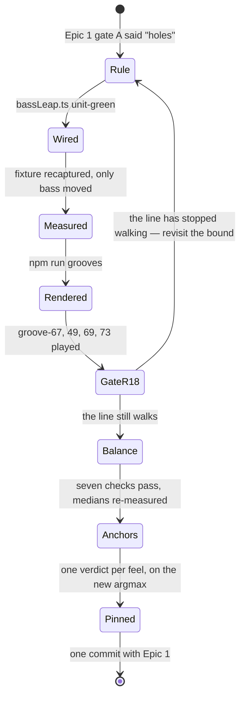

# Tech spec — Epic 2: No leap the bass could not actually play

PRD: [../prd/epic-2-no-leap-the-bass-could-not-actually-play.md](../prd/epic-2-no-leap-the-bass-could-not-actually-play.md) ·
Roadmap: [../roadmap.md](../roadmap.md)

## Approach

**This epic starts on a listening verdict and on nothing else.** Epic 1's gate A
has to have come back "the line reads as holes"; no measurement in this spec, in
the PRD or in the repo creates it, and if the verdict is that the widened
register reads fine then nothing below is built and dropping it is the right
outcome. What it is built *on* is equally specific: **Epic 1's uncommitted
working tree** — `BASS_FLOOR_MIDI = 25` at `scripts/grooves/events.ts:45`, the
catalogue re-rendered at that floor, and `SIGN_OFFS` in
`scripts/grooves/gate.test.ts` grown to twenty entries, of which eighteen carry
`pcm: null` and an `upstream` naming this epic. Nothing here reaches `main` on its own and neither
does Epic 1: **the two land as one commit, so one `git revert` is the whole
rollback for the feature.**

The work itself is one function and five layers of consequence. The function is a
**post-hoc repair pass** over the four-bar bass figure, run after the three
passes that already reshape it — the rest pass (`events.ts:656-668`), the
always-lift (`:672-680`) and the repeat pass (`:686-696`) — and drawing no
randomness at all, which is what keeps `rhythmRng`'s draw count and therefore
every committed answer where it is. Behind it the chain is genuine rather than
cautious: the fixture cannot be recaptured until the pass is wired, the audio
cannot be re-rendered until the events are settled, the four flattened grooves
cannot be heard until they have been rendered, and `SIGN_OFFS` cannot be pinned
until that listening has happened. Two things run beside the chain: the
documents, which need only the measured span median, and the balance, which needs
only the render.

**The measurement instrument is a file that already exists.**
`scripts/grooves/events.fixture.json` is a golden of every catalogued groove's
whole event stream, serialised as `voice@time:duration:velocity[:midi]` by
`serialiseEvent` in `scripts/grooves/eventsFixture.ts:31-35`. The PRD's floor-28
column reproduces from it exactly — 2474 bass notes, 365 intervals ≥ 12, 278
> 12, 87 exactly 12, 74 ≥ 18, largest 20, span median 19 and max 20 — so every
count this epic owes (AC1, AC3, AC5, AC6, AC7's non-bass identity, AC8's changed
set) is a diff of two fixtures rather than a new script. Step B1 captures the
before-picture for exactly that reason.

**Three steps wait on a person.** R18's gate on the four grooves the bound
flattens most (Step D1), the nine per-feel verdicts the twenty pins rest on (Step
F3), and whatever the loop back from D2 costs. `docs/music.md`'s *What the gate
cannot do* is explicit that nothing in this repo can hear, so a step claiming to
automate one of those would be lying about its done-condition.

## Architecture

### The moving parts

| Part | Where | What changes |
| :-- | :-- | :-- |
| the rule | `scripts/grooves/bassLeap.ts` (new) | `BASS_LEAP_MAX`, the register bands, `repairLeaps` |
| its tests | `scripts/grooves/bassLeap.test.ts` (new) | the rule on hand-built figures, both floors |
| the wiring | `scripts/grooves/events.ts` | one call after `:696`, one variable recording the note the repeat pass moved |
| the event tests | `scripts/grooves/events.test.ts` | a catalogue-wide interval assertion; the span assertion in `plays a line, not an arpeggio` (`:1214-1217`), which this change breaks; the structural guards for R11 |
| the golden | `scripts/grooves/events.fixture.json` | recaptured; only `bass@` lines move |
| the audio | `public/grooves/*.mp3`, `scripts/grooves/grooves.lock.json`, `src/features/daily-groove/data/grooves.generated.ts` | 53 of 54 grooves re-render |
| the balance | the nine `scripts/grooves/templates/<feel>.ts` | `gain.bass` only, and only if the gate or a median calls for it |
| the medians | `scripts/grooves/templates/boom-bap.test.ts:238`, `scripts/grooves/second-line.test.ts:593` | the measured figures in the comments. `ON_THE_LINE_DB` stays at 1.5 |
| the sign-offs | `scripts/grooves/gate.test.ts` | eighteen null `pcm` fields resolved, one or two live pins re-taken, the anchor argmax re-derived |
| the record | `docs/music.md:325-336`, `scripts/grooves/docs.test.ts` | the *Voicing* paragraph's span and lift sentences; one routing row |

`src/features/daily-groove/data/notes.generated.ts` and `public/notes/` do
**not** move, and neither does `grooves.lock.json`'s `packSha256`: the 24
reference notes render from `comp` alone and this epic touches no sample, no
`pack.json` and no comp code. So **`npm run notes` is not part of this epic**,
unlike feature-27's, and a changed note mp3 means something out of scope moved.

### The register is two bands, and the pass reads provenance off arithmetic

`inRegister` (`events.ts:359-362`) is `base + pitchClass`, lifted one octave when
that lands under the floor. With `BASS_BASE_MIDI = 24`, Epic 1's floor `25` and
the ceiling `48` untouched (R3), every bass note the generator can write sits in
one of two twelve-wide bands:

```
base band    [floor      .. floor + 11]   = [25 .. 36]   the fold's own output
upper band   [floor + 12 .. ceiling   ]   = [37 .. 48]   base + BASS_OCTAVE_LIFT
approach     [floor      .. floor + 12]   = [25 .. 37]   target ∓ 1, events.ts:626-629
```

Both pop sites produce exactly `base + 12` and nothing produces `base + 24`: the
32% roll requires `midi + 12 <= 48` (`:612`) and the always-lift requires the
same (`:675`), and a note already in the upper band is ≥ 37, so `37 + 12 = 49`
fails both. Three consequences fall out, and they are the reason this pass needs
almost no bookkeeping:

1. **A violating pair's higher note is always in the upper band and its lower
   note always in the base band, and the arithmetic is tighter than the bands
   are.** An interval over 12 needs `upper − lower > 12` with `lower >= floor`,
   so `upper >= floor + 13` (38); and `upper <= ceiling`, so
   `lower <= ceiling − 13` (35). **Every violating pair therefore has its higher
   note in `[38..48]` and its lower note in `[25..35]`** — no overlap, nothing to
   judge, and within either band the widest possible interval is 11 semitones, so
   nothing inside one can violate at all. Measured over the committed fixture at
   floor 28, where the same arithmetic reads `[41..48]` and `[28..35]`, all **278**
   intervals wider than an octave have exactly one endpoint ≥ 40 and one ≤ 39 — 0
   with two, 0 with none — and the two observed bands are exactly `[28..39]` and
   `[40..48]`. **R6's eleven pop-less violations are therefore not a special case
   at the level the pass works at:** what they lack is a note the *32% roll*
   flagged, not a note in the upper octave. A repeated note (`:608-609`) that
   copied a popped pitch, and a lifted note the PRD counts under the always-lift
   rather than the pop, are both in the upper band and both movable. This is what
   makes the eleven a corollary of the partition rather than a case the rule has
   to name.
2. **An approach note is never the movable member.** A violation's higher note is
   at least `floor + 13` (38); an approach note is `target ∓ 1` with
   `target = inRegister(nextRoot, BASS_BASE_MIDI)` in `[25..36]` and `target − 1`
   taken only while it stays ≥ `floor`, so it tops out at `floor + 12` (37). So
   R8 costs the pass nothing on the side that matters, and `movable()`'s existing
   exclusion (`:641-646`) does not have to be replicated. The bound at the other
   end is worth reading too: a violation's lower note is at most 35, so an
   approach note at 36 or 37 is not even the *lower* member of one — measured at
   floor 28, every one of the 31 violations with an approach note on its low side
   has that note at 35 or below.
3. **A note in the upper band at index 0 of its bar was lifted, not popped.** The
   loop returns early for `i === 0` (`:599-604`) without consulting `drop`, and
   neither the rest pass nor the repeat pass can touch index 0 (`movable()` filters
   `index > 0`). The only site that can put a bar's first note above the base band
   is the always-lift, whose `liftable` filter checks `!isApproach` but **not**
   `index > 0` — which is the mismatch with `docs/music.md:332-336` that Epic 1's
   R11 records and R7 asks this epic to repair. Measured on the committed
   fixture, **10 of 54 grooves already carry a bar-1 downbeat root in the upper
   band**: groove-01, 11, 12, 21, 54, 67, 70, 71, 72, 80. Two of those are
   `SIGN_OFFS` anchors (groove-01, groove-71) and one is an R18 anchor
   (groove-67).

So the pass builds no provenance and `events.ts`'s local `BassNote` type
(`:585`) gains no field. Four kinds of note matter to the rule, and each is read
off the figure it is handed:

| The note | How the pass knows it |
| :-- | :-- |
| an octave-up note | `midi >= register.floor + register.lift` — which band it is in, arithmetic on the note itself |
| an approach note | `isApproach(bar, note)`, `events.ts:638-639`'s own predicate, passed in rather than re-derived |
| a bar's downbeat root | `index === 0` of its bar — consequence 3, and `:599-604` returns before `drop` is read, so nothing else can put a bar's first note in the upper band |
| the note the repeat pass moved | `repeatMoved`, the one thing arithmetic cannot recover |

**Which site produced a note is not the question the rule asks.** It asks which
band the note is in and whether it is an approach note or a downbeat root,
because that is what the move depends on — and a note's band is a fact about the
note, not a fact about its history. The flag-per-note alternative would answer a
question the pass never puts: a repeat that copied a popped pitch would carry
`repeated` and not `popped`, and the rule would fall back to the register to know
what to do with it anyway.

### The unit of repair is a run of equal notes, not a single note

A **run** is a maximal group of consecutive notes in the cyclic figure whose
`midi` is equal — most often one note, and two or three where a pass before this
one made them equal. **Every move the pass makes is applied to the whole run the
note belongs to.** A run therefore stays equal, and every repeat in the figure
survives the repair.

That is not a convenience. Two sites put equal notes side by side, and the
assertion at `events.test.ts:1210-1213` — some note in every figure repeats its
predecessor — is what they are for:

- the in-loop repeat (`:608-609`) copies `previousBass` into the next note, so it
  can carry a popped pitch into the upper band without the 32% roll having been
  drawn for it. **That is ten of R6's eleven** — "a repeated note into an approach
  note".
- the repeat pass (`:686-696`) sets one note equal to its predecessor and
  `break`s, and in a figure that repeated nowhere that pair is the *only* repeat
  there is. `repeatMoved` names the note it moved.

Move one member of a run and not the other and the pair is broken; do it to the
repeat pass's pair and the assertion goes with it. Moving the run intact is what
makes R12's "it does not undo them" mechanical instead of a skip list: the
equality is preserved *by* the move rather than by refusing to make one. One rule
then covers every violation — the ten pop-less repeats included — and R12 needs
no second mechanism beside it.

Three properties follow, and the third is a case that cannot arise rather than a
guard:

- **Intervals inside a run are 0 and stay 0**, so a uniform move can never create
  a violation inside the run it moves.
- **A run containing a bar's index-0 note takes `drop` and never `revoice`** —
  R7's rule reaches the whole run, for the same reason `revoice` is unavailable to
  a downbeat root at all.
- **A run whose notes are approach notes is never a violation's movable member.**
  Every note in a run has one `midi`, an approach note is at most `floor + 12`
  (37), and a violation's higher note is at least `floor + 13` (38).

`repeatMoved`'s job narrows to what is left: it is **not** a note the pass skips,
it is the note the pass has to be seen to have left equal to its predecessor.
The returned `LeapMove[]` names every member of a run that moved, so the
postcondition R12 asks for is readable off the log — and that is the only part of
R12 the arithmetic cannot check for itself.

### The pass has two moves, and one of them always applies

| Move | What it does | When | Why it is safe |
| :-- | :-- | :-- | :-- |
| **re-voice** | `up := prev + 12` for every note in the run, where `prev` is the base-band note the run leaves | preferred — it is what keeps the pop (R4, R5) | `prev` is a chord tone of the note's own bar (R7), and an octave above an in-scale pitch class is in scale |
| **drop** | `up -= 12` for every note in the run | when re-voicing does not clear the bound on both sides, when the run's base-band partner is an approach note or sits in another bar, and always for a run holding a downbeat root the always-lift lifted (R7) | the pitch class does not change, so nothing about scale or chord membership can move |

Two existing assertions constrain this and they are why the second column of that
table is short. `events.test.ts:345-356` —
`walks the bass through the progression's chord tones` — asserts that **every
non-approach bass note's pitch class is a chord tone of the bar it sounds in**,
so a note may never take its pitch class from a note in a *different* bar; and
`gate.ts:105-118`'s `pitch` check runs `offScalePitches` over all 54 grooves, so
a note may never take it from an approach note either. `theory/pitches.ts:89-92`
compares pitch classes, which is exactly R8's point: re-octaving an approach note
would pass that gate silently, and the reason it cannot happen here is
consequence 2 above, not the gate.

**The first of those two assertions has a consequence the table's third column
would otherwise leave implicit: `revoice` is only available when the base-band
note the run leaves is in the run's own bar.** `prev + 12` takes `prev`'s pitch
class, so a run at the end of bar 4 revoiced from bar 1's downbeat root would sit
in bar 4 carrying bar 1's chord tone, and
`walks the bass through the progression's chord tones` is what fails. Across a
bar line the move is therefore **`drop`**, which changes no pitch class and so
cannot move a note out of its bar's chord. That is a fourth entry for the drop
column and it is where the loop boundary lands: groove-02's bar 4 ends at `47`
against a bar-1 root at `28`, and the repair is `47 → 35` rather than
`47 → 40`.

**The pass terminates and leaves nothing over the bound**, which is what AC1 and
AC4 need and what makes R6 answerable. Every drop strictly reduces the number of
upper-band notes in the figure — by the size of the run it moves, so by at least
one; when none is left, every pair is base-vs-base (≤ 11) or base-vs-approach
(≤ 12) and the bound holds by the arithmetic above. Re-voicing never changes band
membership, so it cannot loop. R5 is what keeps the
process from degenerating into all-drops — the PRD measures pops 229 → 170 under
R4's repair, so 59 of 229 give way and every feel keeps some. **The priority
order among candidate moves stays build work**, as the PRD says; what is frozen
here is the two moves, the termination argument and the fact that a violation
left standing is a failure rather than a trade-off.

### An approach note can be taken from above, and it is not a third move

The generator already approaches from either side. `events.ts:626-629`:

```ts
const target = inRegister(nextRoot, BASS_BASE_MIDI)
const approachStep = template.subdivision - 1
const approach =
  direction < 0.5 && target - 1 >= BASS_FLOOR_MIDI ? target - 1 : target + 1
```

Below is preferred when `direction` draws it and above is the fallback when below
would fall under the floor — which is the mechanism Epic 1's R7 moves from E to
C♯ as the floor drops. **Flipping that direction is not a repair move, and a
builder should not reach for it as the third option in Step A4**, for three
reasons in the order of how hard they are to argue with.

*It clears fourteen violations, and every one of them is R7's case repaired
worse.* A flip moves the note by exactly 2 semitones, `target − 1` ↔
`target + 1`, and an approach note is never a violation's higher member
(consequence 2), so a flip can only ever help where the approach note is the
*lower* member. Measured over the committed fixture at floor 28: **31 of the 278
violations have an approach note on their low side, and 14 of those a flip would
clear — all 14 exactly 13 semitones wide, and in all 14 the higher note is
`target + 12`**, the very downbeat root the approach resolves to, lifted by the
always-lift after `target` was computed. That is R7's case, note for note. R7's
drop clears the same 14 to **one** semitone instead of eleven and removes a lift
`docs/music.md:332-336` already declares the downbeat exempt from. The other 17,
14 to 20 semitones wide, no 2-semitone move touches. So a flip is never needed,
and where it applies it is dominated.

*It does not breach R8, and it does not honour it either.* Flipping a direction
is not a re-octaving, so R8's letter is intact — R8 forbids moving an approach
note between octaves and this moves it by a tone. But R8's *reason* is that an
approach note stays a semitone from the root it resolves to, and after a flip
into a lifted root it is eleven semitones from the root that sounds. The move R8
forbids and the move a flip makes fail the same requirement.

*The draw already owns the choice.* `direction` at `:621` is the last draw on the
rhythm stream. Re-deciding its result post hoc is re-drawing that stream by
another name, which is the frozen-order violation R11 rules out in as many words.

**The repair reduces the number of stranded approach notes rather than creating
any**, and that is the reconciliation Step B7 owes the PRD. `target` is computed
at `:626` from `BASS_BASE_MIDI`, *before* the always-lift runs at `:672-680`, so
where the lift takes a downbeat root up an octave the approach note written for
the bar before is left 11 or 13 semitones from the root that actually sounds.
Measured over the committed fixture, **28 of the catalogue's 192 approach notes
are stranded exactly that way today**, and in every one of the 28 the root sounds
at `target + 12`. R7's repair returns that root to `target` — the octave the
approach note was computed against in the first place — so every one it touches
goes back to a semitone. Three numbers, and they are three different things: 192
approach notes, 28 stranded today by the lift, and the PRD's 45 that *would* be
stranded if the pass re-octaved approach notes, which A4 forbids and which
therefore never happens.

### The figure is a loop, so the pass is cyclic

`pitches()` (`:670`) is `bassFigure.flat()`, which puts bar 4's last note beside
nothing. But the figure is played `music.loopBars / music.bars` times and — verified
over all 54 committed grooves — **every pass plays the identical bass pitch
sequence**, so the audible stream is the figure repeated, and the pair
`(last note of bar 4, downbeat root of bar 1)` sounds at every pass boundary.
Measured on the committed fixture that pair is over the bound **16 times across
6 grooves — groove-02, 21, 56, 67, 70 and 71** — and a pass that walked
`bassFigure` flat would leave every one of them standing and fail AC1.

Two shapes produce it, and both matter. Where bar 4 ends the progression on the
tonic, `nextRootAt(3)` returns null (`:574-578`), no approach note is written, and
the bar's last note faces the next root directly — groove-02 (degrees 0-4-5-0)
drops 47 → 28, nineteen semitones. Where bar 4 *does* change, the approach note
resolves a semitone into bar 1's root — unless that root is the one the
always-lift lifted, which is groove-21 (degrees 0-6-1-6, approach 35 into a
downbeat root lifted to 48, thirteen semitones). **That second shape is R7's
downbeat-root case, and the loop boundary is where it shows up.**

### R9's protected set and the anchor argmax are both re-derived here

The PRD names groove-03, groove-17, groove-40 and groove-73 as the intersection of
the twelve low-rooted grooves with the fifteen whose lowest note the repair
raises, and that reading is confirmed against the committed manifest: the twelve
rooted C♯, D or E♭ are **groove-03, 09, 14, 17, 18, 19, 40, 42, 50, 51, 53 and
73**, exactly. But the fifteen were measured against a candidate repair, not
against what Track A builds, so **the intersection is re-derived in Step B9 over
this epic's own streams** and asserted per groove rather than over the
catalogue's range. groove-17 and groove-40 are also `SIGN_OFFS` anchors, so a
failure there is a red pin as well as a red assertion.

The same goes for the sign-off anchors. Epic 1's R18 fixes the metric — the share
of a groove's bass note-time that sounds below MIDI 28 — and lands it as a test
beside `pins one signed-off render per registered feel` (`gate.test.ts:1245`).
Epic 1's R19 says the metric is computed from the committed catalogue's own event
streams, so **this epic's streams re-pick the argmax** and a feel's anchor may
differ from the one Epic 1's numbers would have chosen. Epic 1's R20 settles what
happens then: the table **grows rather than swaps**, because
`still guards every sign-off this repo has been given` (`:1182-1206`) pins the ids
literally and calls removing one "the same as re-pinning it blind". So Track G may
end with more entries than it inherits, and the groove Track F plays for a feel is
that feel's *new* argmax.

### Twenty pins, not ten

R16 asks for the ten `pcm: null` entries Epic 1 defers. The table this epic
inherits is larger than that in two directions, and neither is a guess.

**Epic 1's anchor rule binds every registered feel, which takes the table to
twenty.** Epic 1 adds one entry per feel whose argmax is unpinned, and eight of
the nine are — measured over the committed fixture as its proxy: `straight-funk`
groove-03, `shuffle` groove-44, `swung-sixteenth` groove-50, `half-time`
groove-14, `open-ballad` groove-79, `bossa-nova` groove-57, `second-line`
groove-67 and `boom-bap` groove-72, with `bright-straight`'s argmax groove-17
already pinned. Twelve existing entries plus eight is **twenty**. On the branch
this epic exists on none of the eight can carry a hash either: their floor-25
renders are not what ships, so they arrive here with `pcm: null` and an
`upstream` naming this epic, exactly as the ten do. **Eighteen nulls, not ten.**
Epic 1's own Step I1 re-measures the metric on its real streams, so an id may
move and with it the count — Track G reads the table it is handed rather than a
number from this spec, and eighteen-of-twenty is what to plan for. **It does not
matter much to this epic whether the eight arrive null or pinned**: none of the
eight is one of the six grooves Epic 1's R5 leaves unmoved at floor 25, and this
epic re-renders 53 of 54, so a hash Epic 1 had written for one of them would go
void at Step C1 — for all but at most one groove in the whole catalogue. Either
way Track G writes it a fresh `pcm`.

**And the two live pins go too.** groove-08's and groove-48's pins survived Epic 1
because floor 25 left their renders byte-identical. This epic re-renders 53 of 54,
so at most one of the two survives it; their assertions go red at Step C1 with
`voidSignOff`'s message (`gate.test.ts:1124-1137`), and closing them is Step G2.

So **Track G writes a fresh `pcm` for nineteen or twenty of the twenty entries** —
eighteen for the first time, one or two re-taken — and the table grows further
wherever this epic's streams move an argmax onto a groove that is not in it yet
(Step G3). R15's "every entry here is pinned for the first time against audio a
player will actually hear" is satisfied either way; what the PRD's arithmetic
understates is the size of the table, not the rule.

**The listening does not scale with it.** Step F3 gives one verdict per feel on
that feel's argmax — nine grooves — and Step D1's four are heard first, on a
different question. An entry that is not its feel's argmax rests on the verdict
its feel was given and says so in its `scope`: that is what `FEATURE_27_SCOPE`
(`gate.test.ts:626-650`) already does in as many words, for the twelve entries
standing on it today. What such an entry may not do is claim the words were given
on *its* groove.

### The gate order



### What this epic must not touch

`BASS_FLOOR_MIDI` (25) and `BASS_CEILING_MIDI` (48) — R3, and re-opening the
floor would mean Epic 1 was never done. `BASS_BASE_MIDI`, `BASS_OCTAVE_LIFT`,
`BASS_REST_CHANCE`, `BASS_REPEAT_CHANCE`, `BASS_OCTAVE_CHANCE` — the pass is a
repair, not a re-tuning of the three draws. `MUSIC_LABEL` and its draw order,
`RHYTHM_LABEL`'s draw sites, `src/lib/hash.ts`, `ROTA_EPOCH` (4), `catalogue.json`,
every uuid. The samples, `pack.json`, `mix.ts`, `humanize.ts`, `gate.ts`'s seven
thresholds, `ON_THE_LINE_DB`. Every template field except `gain.bass`. Nothing is
minted, so the rota is untouched and a groove keeps its slot and its answer —
`docs/music.md` § *What must never change* puts the audio explicitly off that
list.

## Contracts

### C1 — the repair pass

Frozen before Track A starts, so Track B can write its wiring and its assertions
against the signature while Track A implements behind it.

```ts
// scripts/grooves/bassLeap.ts

/** No two consecutive bass notes further apart than this. Inclusive — R1, R2. */
export const BASS_LEAP_MAX = 12

/** Structurally identical to events.ts:585's local BassNote, so the figure passes straight through. */
export type LeapNote = { step: number; midi: number }

/** The three numbers the bands are derived from. Passed in, so events.ts stays their only source. */
export type BassRegister = { base: number; floor: number; ceiling: number; lift: number }

export type LeapFigure = {
  /** One entry per bar of the pass, in order. The figure is a loop: the last bar's last note precedes bars[0][0]. */
  bars: LeapNote[][]
  /** events.ts:638-639's predicate, passed rather than re-derived. */
  isApproach: (bar: number, note: LeapNote) => boolean
  /**
   * The one note events.ts:686-696 left moved, or null — the only thing about the figure
   * arithmetic cannot recover. Not a note the pass skips: it moves with its run like any
   * other, and this is what lets the caller check that it stayed equal to its predecessor. R12.
   */
  repeatMoved: LeapNote | null
}

export type LeapMove = {
  bar: number
  index: number
  from: number
  to: number
  /** 'revoice' keeps the note an octave above its neighbour; 'drop' returns it to the base octave. */
  kind: 'revoice' | 'drop'
  /**
   * Which run this note moved with — an id the pass mints per run it moves, shared by that
   * run's members and by nothing else. Every note of a run takes the same move, so members of
   * one run also share `kind`, `from` and `to`; the id is what lets a test read "the run moved
   * as a unit" off the log instead of re-deriving adjacency from bar and index.
   */
  run: number
}

/**
 * Mutates figure.bars in place, the way the three passes before it do, and returns
 * what it moved. Takes no rng and imports none, so it cannot draw — R11, AC7.
 */
export function repairLeaps(figure: LeapFigure, register: BassRegister): LeapMove[]
```

Four properties are part of the contract, not of the implementation:

- **`repairLeaps` is a pure function of its arguments.** Called twice on equal
  inputs it returns equal output and leaves equal figures.
- **It draws no randomness.** No rng parameter, no import of `./rng.ts`, no
  `Math.random`. This is the form AC7's "drawn from the same number of times"
  takes here — see C5.
- **It leaves no interval over `BASS_LEAP_MAX`**, cyclically, and it moves no note
  the `isApproach` predicate claims.
- **It moves every note of a run of equal notes or none of them.** Two notes equal
  before the call are equal after it — the pair `repeatMoved` belongs to included —
  and every member of a moved run appears in the returned `LeapMove[]` under one
  `run` id.

### C2 — the register, unchanged

`BASS_BASE_MIDI = 24`, `BASS_FLOOR_MIDI = 25` (Epic 1's, `events.ts:45`),
`BASS_CEILING_MIDI = 48`, `BASS_OCTAVE_LIFT = 12`. `BASS_PLAYED` in
`scripts/grooves/pack.test.ts:344-350` reads `{ lowest: 25, highest: 48 }` and
this epic does not move it: the repair changes which notes sound, never the
bounds they sound inside. `events.test.ts:226-239`'s
`keeps pitched notes inside the sample pack's sampled range` stays at Epic 1's
`25`/`48` and must stay green throughout.

### C3 — `SIGN_OFFS`, shared with Epic 1's spec

Epic 1 introduces the nullable field and grows the table to twenty entries, one
per feel whose argmax it found unpinned beside the twelve already there; this epic
resolves every null in it. **The shape is Epic 1's and is not varied here:**

```ts
// scripts/grooves/gate.test.ts
type SignOff = {
  // …existing fields unchanged…
  pcm: string | null   // null = awaiting the render that will ship
  upstream?: string    // what a null pcm is waiting for, e.g. 'feature-28 epic 2'
}
```

One reading is recorded rather than assumed: the committed declaration is
`upstream: string` — **required** (`gate.test.ts:598`), documented as "What has to
move for this render to change; quoted back in the failure", and set on all
twelve entries. This epic reads the `?` in the shared shape as describing the
field's new *role* for a null entry, not as a loosening, and every entry it
writes carries an `upstream`. If Epic 1 does relax the declaration, nothing here
changes.

### C4 — the commands

`npm test` (app + tooling) · `npm run test:gen` (generator) · `npm run test:all`
(everything) · `npm run grooves` (re-render) · `npm run grooves:verify` (also
`prebuild`) · `node scripts/grooves/eventsFixture.ts --write` (recapture the
golden). Every track here except Track C owns at least one file under
`scripts/`, so **`npm run test:gen` is the per-track command**; Track C and the
integration pass take `npm run test:all` because Track C writes an app-tier
generated file. `npm run notes` is not used — see *The moving parts*.

### C5 — how "no randomness" is actually observed

`rhythmRng` is a local `const` inside `buildEvents` (`events.ts:444`), built from
``rngFor(`${spec.template}:${spec.seed}:${RHYTHM_LABEL}`)``, not injected and not
exported. And there is a trap in AC7 worth stating plainly, because it changes
what the test can be: **the last draw on the rhythm stream is `direction` at
`:621`, inside the final bar of the bass loop.** Nothing after the bass figure
reads `rhythmRng` — the six call sites are `:516`, `:583`, `:595`, `:596`, `:597`,
`:621`, and the four `pick(rhythmRng, …)` sites are `:459`, `:461`, `:463`,
`:464`. So a draw added by a post-hoc pass would shift *nothing downstream*, and
"every non-bass event is byte-identical" would hold even if the pass did draw. A
comparison of outputs cannot prove the draw count.

What can, and what this spec uses:

1. **The signature (C1).** The pass takes no rng, so it has none in scope. This is
   the strongest of the three and it is a compile-time property.
2. **A structural assertion**, in the idiom `scripts/grooves/boundary.test.ts`
   already uses (`specifiersOf`, `:31-41`): `events.ts` names `rhythmRng` in
   exactly the eleven places it names it today — one declaration, four `pick`
   arguments, six calls — and `bassLeap.ts` names no rng module and no
   `Math.random`. This is Step B5.
3. **The fixture diff.** Every non-`bass@` line and every `music` block identical
   between the before and after fixtures, which is AC7's first half exactly and
   also proves no answer moved (`music` carries bpm, root, flavour, chord,
   progression and degrees). This is Step B6.

`vi.mock` is not used. Nothing under `scripts/` mocks anything today, and
`scripts/agent-floor.test.ts:59` names a `vi.mock` of a cross-boundary path as a
violation in its own right.

### C6 — the measurement instrument and where the numbers live

Every count in AC1, AC3, AC4, AC5, AC6, AC7 and AC8 is a read over a **pair** of
`events.fixture.json` files: the Epic-1 fixture in the working tree, copied aside
by Step B1, and the one Track B recaptures. The reads are:

| Quantity | How |
| :-- | :-- |
| consecutive intervals | bass midis in stream order, plus the cyclic pass boundary |
| octave pops | bass notes with `midi >= floor + lift` (37), excluding approach notes, counted per four-bar figure |
| approach notes | last-step note of a bar whose next bar's root differs, a pitch-class semitone from `inRegister(nextRoot, base)` |
| a stranded approach note | an approach note more than a semitone from the root that actually sounds on the next bar's downbeat — 28 of 192 at floor 28, all of them approaches into a root the always-lift took to `target + 12` |
| a groove's range | min and max bass midi per groove |
| the changed set | bass events whose midi differs, and the grooves that hold them |

The **working** record lives under
`specs/features/feature-28/.implement/` (gitignored). The **durable** record —
what R10 and R17 ask for — is three committed places: the header comment of
`bassLeap.ts` (the counts the rule was measured at), `docs/music.md`'s *Voicing*
paragraph (the span median), and each re-pinned `SIGN_OFFS` entry's `scope`.

## Tracks

### Track A — the repair rule

- **Goal** — `repairLeaps` exists, is unit-green on hand-built figures covering
  every case R4, R6, R7, R8 and R12 name, at both floor 28 and floor 25, and
  leaves no interval over the bound.
- **Owns** — `scripts/grooves/bassLeap.ts` (new),
  `scripts/grooves/bassLeap.test.ts` (new)
- **Role** — `musician`. Which note gives way, whether the pop survives as an
  idiom, and what "the note it leaves" means when both neighbours are candidates
  are musical decisions with `docs/music.md:332` behind them.
- **Depends on** — C1 and C2 only. Nothing in the repo.
- **Parallel with** — nothing. It is the wave-1 gate: everything else builds on
  its behaviour, not only on its signature.
- **Done when** — `npm run test:gen scripts/grooves/bassLeap.test.ts` is green
  and no other suite has moved (`git status` shows two new files and nothing
  else).

### Track B — the wiring, the fixture and the measurements

- **Goal** — the pass runs last inside `buildEvents`, the catalogue holds no
  interval over an octave, the golden is recaptured with only `bass@` lines
  moved, and every number AC1–AC8 asks for is measured and written down.
- **Owns** — `scripts/grooves/events.ts`, `scripts/grooves/events.test.ts`,
  `scripts/grooves/events.fixture.json`,
  `specs/features/feature-28/.implement/measurements/**`
- **Role** — `musician`. It owns `events.ts`, and the span assertion it has to
  rewrite (`events.test.ts:1214-1217`) is a claim about what a bass line is.
- **Depends on** — Track A.
- **Parallel with** — nothing.
- **Not split into a test track and a wiring track, deliberately.** The two
  assertions this track owns fail in opposite directions across one
  implementation: the interval assertion is red before the pass is wired and
  green after, and the span assertion is green before and red after. A step whose
  real dependency is another step's *output* has to live in one unit, so
  `events.ts` and `events.test.ts` are one track even though they are two files.
- **Done when** — `npm run test:gen` is green except `gate.test.ts`'s pins, the
  fixture's non-bass lines are byte-identical to the captured baseline, and
  `.implement/measurements/` holds the span, the interval distribution, the
  per-feel pop counts, the eleven, the changed set and the fifteen ranges.

### Track C — the re-render and the lock

- **Goal** — every groove on disk is the render the verdicts will be given on,
  the lock agrees with the tree, and `grooves:verify` is clean.
- **Owns** — `public/grooves/*.mp3`, `scripts/grooves/grooves.lock.json`,
  `src/features/daily-groove/data/grooves.generated.ts`
- **Role** — `implementer`. **It owns no file under `scripts/grooves/`**, so the
  blanket rule does not reach it: it runs two committed commands and reads their
  output, and anything it would have to decide is a failure that goes back to
  Track A or B.
- **Depends on** — Track B.
- **Parallel with** — Track E.
- **Done when** — `npm run grooves` and `npm run grooves:verify` complete clean,
  `node scripts/grooves/rerender-check.ts` reports N of N matching, and
  `npm run test:all` is green **except** the `SIGN_OFFS` pins.

### Track E — the record

- **Goal** — `docs/music.md` no longer presents the octave lift as something an
  arpeggiator does not do while shipping the arpeggiator's version of it, states
  the span the catalogue now measures, and a reader looking for the leap bound
  finds the file it lives in.
- **Owns** — `docs/music.md`, `scripts/grooves/docs.test.ts`
- **Role** — `implementer`. It transcribes measurements Track B already took and
  turns no knob. This is the second deliberate departure from the blanket rule —
  see Assumptions.
- **Depends on** — Track B's measured span median only.
- **Parallel with** — Track C. It touches no audio, lock, manifest, template or
  sign-off file, and C touches no document.
- **Done when** — `npm run test:gen scripts/grooves/docs.test.ts` is green and
  the *Voicing* paragraph's three claims are true of the shipped generator.

### Track D — the listening gate on the four grooves the bound flattens

- **Goal** — a recorded verdict, in the listener's own words, on whether
  groove-67, groove-49, groove-69 and groove-73 still walk.
- **Owns** — `specs/features/feature-28/.implement/listening/**` (gitignored). No
  file in `scripts/`, `src/`, `public/` or `docs/`.
- **Role** — `musician`. It asks the question; it turns nothing.
- **Depends on** — Track C. There is no verdict without audio.
- **Parallel with** — nothing. It gates Tracks F and G, and a bad verdict sends
  the work back to Track A.
- **Done when** — four verdicts exist verbatim, with the device and level
  recorded, and either the epic continues or Track A is re-opened with the bound
  as the thing to revisit.

### Track F — the balance, and the verdict each pin will rest on

- **Goal** — all seven gate checks pass over all 54, both bass-over-kick medians
  sit inside 1.5 dB of `straight-funk`'s with their comment figures re-measured,
  and one verdict per feel is recorded on that feel's new anchor.
- **Owns** — `scripts/grooves/templates/straight-funk.ts`, `shuffle.ts`,
  `swung-sixteenth.ts`, `half-time.ts`, `bright-straight.ts`, `open-ballad.ts`,
  `bossa-nova.ts`, `second-line.ts`, `boom-bap.ts` — **the `gain.bass` line and
  nothing else in any of them** — plus
  `scripts/grooves/templates/boom-bap.test.ts` and
  `scripts/grooves/second-line.test.ts`, **in which the only writable text is the
  measured figures in the comments above the harmony-balance assertions.**
  `ON_THE_LINE_DB` is not this track's to move.
- **Role** — `musician`.
- **Depends on** — Track C (the renders) and Track D (the verdict that there is
  something worth balancing).
- **Parallel with** — nothing.
- **Done when** — `catalogue-gate.test.ts` passes all seven checks over every
  groove including the −29…−20 dBFS band, both median assertions pass at
  `ON_THE_LINE_DB = 1.5` unchanged, and a verdict exists for each of the nine
  feels, given on the groove Step F3's metric picked.

### Track G — the sign-offs

- **Goal** — no entry in `SIGN_OFFS` is awaiting a render, every hash reproduces
  from the committed tree, and every feel's anchor is the groove this epic's
  streams say moved most.
- **Owns** — `scripts/grooves/gate.test.ts`
- **Role** — `musician`. Choosing which groove anchors a feel, and writing what a
  verdict did and did not cover, is the judgement this table is made of.
- **Depends on** — Track C (the renders) and Track F (the verdicts).
- **Parallel with** — nothing.
- **Done when** — `npm run test:all` is green.

## Execution waves

- **Wave 0:** Epic 1's gate A verdict. Not a track — a precondition. "The line
  reads fine" and this epic does not exist.
- **Wave 1:** Track A — alone.
- **Wave 2:** Track B — alone.
- **Wave 3 (parallel):** Track C, Track E.
- **Wave 4:** Track D — the human gate.
- **Wave 5:** Track F.
- **Wave 6:** Track G.

No path appears in two tracks in any wave, and Track B's and Track D's
`.implement/` subtrees are disjoint as well as differently waved. **The chain is
real, not caution**: the fixture cannot be recaptured before the pass exists, the
audio cannot be rendered before the events settle, nothing can be heard before it
is rendered, and no hash may be pinned before it has been heard —
`gate.test.ts:1124-1137` says so in as many words.

`/implement-feature` turns each `musician` track into two dispatches — the
musician decides, an implementer applies — which changes neither the track count
nor the waves.

**The loop this plan admits, and its four triggers.** Work goes back, and it goes
back to a named track:

- Step B2 leaves an interval over the bound → **Track A**. The bound is not
  relaxed to admit it.
- Step D1's verdict is that the line has stopped walking → **Track A**, with
  `BASS_LEAP_MAX` itself as the subject: the single bound is loosened to whatever
  the ear accepts and the chain re-runs from there. R18 is explicit that this is
  not a reason to ship.
- Step F1 puts a feel outside the −29…−20 dBFS band, or Step F2 puts a median
  more than 1.5 dB from `straight-funk`'s → **Track F**, another pass at that
  feel's `gain.bass`. Neither the band nor the constant widens.
- Step G3 finds a feel whose new argmax nobody heard → **Track F**, one more
  groove played.

## Implementation

### Track A — the repair rule

#### Step A1 — the register is two bands, and a violation always straddles them

Covers: R1, R3, R6, AC1

- **Test first** — `scripts/grooves/bassLeap.test.ts`, `describe('the register bands')`:
  with `register = { base: 24, floor: 25, ceiling: 48, lift: 12 }`, assert
  `baseBand(register)` is `[25, 36]`, `overBand(register)` is `[37, 48]`, that
  every `inRegister`-reachable pitch is in exactly one of them, and that the
  widest interval inside either is `11` — therefore `BASS_LEAP_MAX` can only be
  exceeded across the two. Repeat the four assertions at floor 28 (`[28,39]`,
  `[40,48]`), which is the pair the committed fixture measures and the one the
  test can be checked against by hand. Run it: fails to collect with
  `Failed to resolve import "./bassLeap.ts" from "scripts/grooves/bassLeap.test.ts"`.
- **Implement** — `scripts/grooves/bassLeap.ts`: `BASS_LEAP_MAX = 12`, the
  `BassRegister`, `LeapNote`, `LeapFigure` and `LeapMove` types of C1,
  `isOver(midi, register)` as `midi >= register.floor + register.lift`, and a
  header comment carrying the arithmetic and the two measured band pairs.
- **Green when** — the eight assertions pass.
- **Refactor** — none.

#### Step A2 — a pop that leaps too far is re-voiced, and stays in the upper octave

Covers: R1, R2, R4, R7, AC2

- **Test first** — `bassLeap.test.ts`, `describe('a popped note that leaps too far')`:
  a hand-built two-bar figure whose bar 1 runs `[33, 48, 25]` — a base-band chord
  tone, a pop, and a fresh low fold, which is the shape the PRD's *Problem*
  names for groove-20, groove-79 and groove-17. Assert after `repairLeaps` that
  the middle note is `37` (an octave above the `25` it leaps to, and still an
  upper-band note, so the pop survives), that both of its intervals are ≤ 12,
  that the returned `LeapMove` is
  `{ kind: 'revoice', from: 48, to: 37 }` with one `run` id on it, and
  that no other note moved. Add the mirror case, a leap *up* into a pop
  (`[25, 48]`), and the both-sides case (`[33, 48, 25]` where re-voicing to
  either neighbour alone leaves the other over the bound). Run it: fails with
  `expected 48 to be 37`.
- **Implement** — the re-voice move in `repairLeaps`: walk the figure's intervals
  in order, cyclically; for a violating pair take the run containing its higher
  note — a run of one here — and set every member of that run to one octave above
  the base-band note the run leaves, keeping the register and giving up the pitch
  class (R4). By consequence 1 of *The register is two bands* the higher note is
  always ≥ `floor + 13` and the note it leaves always ≤ `ceiling − 13`, so which
  of the pair moves is arithmetic and not a choice. The base-band note must be in
  the run's own bar for this move — across a bar line it is a `drop`, per A6.
  Where both of a run's neighbours violate, the move must clear both.
- **Green when** — every assertion in the describe passes.
- **Refactor** — none. Do not generalise the move to "the nearest chord tone":
  the PRD measured that variant and it leaves 5 pops in the whole catalogue.

#### Step A3 — a lift that landed on a downbeat root gives way instead

Covers: R7, AC2

- **Test first** — `bassLeap.test.ts`, `describe('a lift on a downbeat root')`: a
  two-bar figure whose bar 2 starts at index 0 with `48` and whose bar 1 ends on
  an approach note at `35`, which is groove-21's committed shape read at floor 25.
  Assert that `repairLeaps` returns `{ kind: 'drop', from: 48, to: 36 }` for that
  note, that the root is back in the base octave, that the approach note did not
  move, and that the interval across the bar line is now `1`. Assert the negative
  too: an upper-band note at index 0 is **never** re-voiced, because the only
  base-band note it leaves is the previous bar's chromatic approach and an octave
  above that is off-scale and outside the approach window. Run it: fails with
  `expected 48 to be 36`.
- **Implement** — the drop move, and the rule that selects it: an upper-band
  member at `index === 0` of its bar is always dropped, and so is every note of
  the run it belongs to. `events.ts:599-604` returns before `drop` is read, so
  index 0 can only have reached the upper band through the always-lift
  (`:672-680`), whose `liftable` filter checks `!isApproach` but not `index > 0` —
  and `docs/music.md:332-336` already declares the downbeat exempt from all three
  of rest, repeat and lift. Add the third assertion the same shape earns: the
  approach note that resolves onto that root is now **one** semitone from it,
  because `target` was computed at `:626` before the lift ran, so dropping the
  lift returns the root to the octave the approach note was written against.
- **Green when** — both directions pass and the approach note is a semitone from
  the root.
- **Refactor** — none.

#### Step A4 — an approach note is never moved and never lends its octave

Covers: R8, AC5

- **Test first** — `bassLeap.test.ts`, `describe('the approach note')`: three
  figures. One where the approach note is the base-band member of a violating
  pair — assert it is untouched and the upper member is what moved. One where the
  only base-band neighbour of a violating upper note is an approach note — assert
  the move is `drop`, not `revoice`, because `approach + 12` is a chromatic pitch
  class an octave up. One where an approach note sits at `floor + 12` (37) — assert
  it is never treated as the movable member, and record why it cannot be: a
  violation needs its upper member at `floor + 13` or above. Run it: fails with
  `expected 26 to be 26 (the approach note at bar 1 step 15 was moved to 38)`.
- **Implement** — the `isApproach` guard, applied before either move is chosen,
  and the `revoice`→`drop` fallback when the base-band partner is an approach
  note. `theory/pitches.ts:89-92` compares pitch classes, so `offScalePitches`
  would not catch a re-octaved approach note — the guard, not the gate, is what
  holds R8.

  **There is no third option here, and the one to be talked out of is flipping the
  approach note's direction.** `events.ts:626-629` writes `target − 1` where the
  floor allows it and `target + 1` otherwise, so a flip is available and moves the
  note by exactly 2 semitones. It clears a violation only where the approach note
  is the pair's lower member and the interval is exactly 13 — 14 of the 278 at
  floor 28, every one of them an approach into a downbeat root the always-lift
  took to `target + 12`, which is A3's case and which A3 clears to a semitone
  rather than to eleven. See *An approach note can be taken from above* for the
  measurement and for the two other reasons. Do not add the move.
- **Green when** — all three figures pass.
- **Refactor** — none.

#### Step A5 — a repeated run moves as one, so no repeat is undone

Covers: R6, R12, AC4, AC7

- **Test first** — `bassLeap.test.ts`, `describe('a run of equal notes moves as one')`:
  four figures.
  1. The violating higher note is equal to its predecessor — the in-loop repeat at
     `events.ts:608-609`, which copies `previousBass` and can therefore carry a
     popped pitch into the upper band without the pop having been rolled for it.
     **This is ten of R6's eleven** ("a repeated note into an approach note").
     Bar 1 runs `[33, 48, 48, 26]`. Assert that after `repairLeaps` the two 48s
     are **still equal**, that both are `38` (an octave above the `26` the run
     leaves), that every interval is inside the bound, and that the two returned
     moves carry the **same** `run` id, `kind`, `from` and `to`.
  2. The same figure with `repeatMoved` naming the second of the two: assert the
     identical outcome, and assert explicitly that `repeatMoved` is still equal to
     its predecessor. Passing it in changes nothing — that is the point of the
     assertion, and it is R12's postcondition rather than a skip.
  3. A run of three, `[33, 48, 48, 48, 26]`: all three move, one `run` id, and the
     figure still repeats.
  4. A run that has to be dropped rather than re-voiced because its base-band
     partner is an approach note: assert both members took `drop` and are still
     equal.

  In all four, assert the property the committed suite asserts — some note in the
  figure equals its predecessor — held before and holds after. Run it: fails with
  `expected [ 48, 38, 26 ] to hold a repeated pair — the repair broke the only one`.
- **Implement** — the run is the unit every move applies to: find the maximal
  group of consecutive equal notes containing the note that has to move, cyclically,
  and apply the chosen move to all of them under one `run` id. Intervals inside a
  run are 0 and a uniform move leaves them 0, so the repeat is preserved by the
  move rather than by declining to make it, and nothing about R12 needs a second
  mechanism. `repeatMoved` is read for the postcondition and for nothing else.
- **Green when** — all four figures pass and the eleventh case of R6 ("a chord tone
  into a bar root") is covered by A2 and A3 between them, because its higher note
  is either a pop or a lift by consequence 1 of *The register is two bands*.
- **Refactor** — none.

#### Step A6 — the figure is a loop

Covers: R1, R11, AC1

- **Test first** — `bassLeap.test.ts`, `describe('the loop boundary')`: a four-bar
  figure whose bar 4 ends at `47` and whose bar 1 opens on a downbeat root at
  `28` — groove-02's committed shape, a 19-semitone drop that `bassFigure.flat()`
  never puts side by side. Assert `repairLeaps` fixes it. Add groove-21's shape,
  an approach note at `35` into a lifted downbeat root at `48`, which is the same
  boundary carrying R7's case. Assert the move each takes, because the boundary is
  where the base-band partner is in another bar: groove-02's shape is a **drop**,
  `47 → 35`, not a re-voice to `40` — `prev + 12` would carry bar 1's chord tone
  into bar 4 and fail `walks the bass through the progression's chord tones`
  (`events.test.ts:345-356`); groove-21's is a drop too, by A3's rule, `48 → 36`.
  Assert that a figure whose only violation is at the boundary still returns a
  non-empty move list. Run it: fails with
  `expected 19 to be less than or equal to 12` — or, against a linear
  implementation, with `expected [] not to be empty`.
- **Implement** — the interval walk closes the ring: after the last note of the
  last bar comes `bars[0][0]`. Grounded: over the committed fixture every one of
  the 54 grooves plays the identical bass pitch sequence in every pass, so the
  boundary pair sounds at every pass boundary — 16 intervals over the bound across
  groove-02, 21, 56, 67, 70 and 71 at floor 28.
- **Green when** — both shapes pass.
- **Refactor** — none.

#### Step A7 — the pass terminates, and leaves nothing over the bound

Covers: R1, R6, AC1, AC4

- **Test first** — `bassLeap.test.ts`, `describe('the pass is complete')`: a
  property test over 5 000 pseudo-random figures built from the two bands (a
  seeded generator local to the test, never `rhythmRng`), each with 4 bars, 1–6
  notes per bar, an approach note on some bars and a `repeatMoved` on some.
  Assert for every one: no cyclic interval exceeds 12 afterwards; no approach note
  moved; every note is still inside `[floor, ceiling]`; every moved note's new
  pitch is either its old pitch minus 12 or a neighbour's plus 12; every
  re-voiced run took its octave from a note in its own bar; **every pair of
  equal consecutive notes before the pass is still equal after it**; every member
  of a moved run appears in the move list under one shared `run` id and no run is
  half-moved; and the move list has no note twice. Run it: fails with
  `figure 231: 3 intervals still over the bound after the repair`.
- **Implement** — whatever ordering and priority the rule needs, with the
  termination argument the contract states: each `drop` strictly reduces the
  number of upper-band notes, `revoice` never changes band membership, and with
  no upper-band note left every pair is base-vs-base (≤ 11) or base-vs-approach
  (≤ 12). **A figure the pass cannot clear is a defect in the pass, not a
  violation to record** — that is what separates AC4 from a shrug.
- **Green when** — 5 000 of 5 000 clear.
- **Refactor** — extract the interval walk if A6 and A7 have duplicated it.

#### Step A8 — the pass draws nothing and is pure

Covers: R11, AC7

- **Test first** — `bassLeap.test.ts`, `describe('the pass draws no randomness')`:
  (a) `repairLeaps` on two deep-equal figures returns deep-equal moves and leaves
  deep-equal figures, over the same 5 000 figures as A7; (b) the same figure
  repaired 100 times gives the identical result; (c) a source scan of
  `bassLeap.ts` in `boundary.test.ts`'s idiom asserts it names no `./rng.ts`, no
  `rngFor`, no `Math.random` and no `crypto`. Run (c) before the module has its
  final shape: fails with
  `bassLeap.ts names rngFor — the repair pass may not draw`, if it does.
- **Implement** — nothing beyond keeping the contract. The property is the
  signature's, not a comment's.
- **Green when** — all three pass.
- **Refactor** — none.

#### Step A9 — the pop survives, and the log says which gave way

Covers: R5, AC3

- **Test first** — `bassLeap.test.ts`, `describe('the pop survives')`: over A7's
  5 000 figures, assert that `revoice` is chosen for every run where it clears the
  bound — i.e. no run is repaired by a `drop` where a `revoice` was available and
  sufficient, the three cases where it never is being a run holding a downbeat root
  (A3), a run whose base-band partner is an approach note (A4) and a run whose
  base-band partner is in another bar (A6) — and that the
  returned `LeapMove[]` distinguishes the two kinds, so Step B8 can count pops
  before and after from the fixture and this step's preference from the log. Run it: fails with
  `figure 12: dropped 48 → 36 where revoicing to 37 would have cleared both sides`.
- **Implement** — the preference order, per run: `revoice` first, `drop` only as
  the fallback A3 and A4 require. `docs/music.md:332` counts the octave lift among
  "three things a bass player does that an arpeggiator does not", so a rule that
  makes it rare has failed even when the leap numbers improve.
- **Green when** — the preference holds over all 5 000.
- **Refactor** — none.

### Track B — the wiring, the fixture and the measurements

#### Step B1 — the before-picture is captured before anything moves

Covers: R13, AC8

- **Test first** — `npm run test:gen scripts/grooves/eventsFixture.test.ts` →
  `deep-equals what the generator builds today`. It must be **green** at the start
  of this track: the fixture in the working tree is Epic 1's, and if it is stale
  every number this track measures is measured against the wrong baseline. Run
  it: green, or stop and finish Epic 1.
- **Implement** — copy `scripts/grooves/events.fixture.json` to
  `.implement/measurements/before.fixture.json`, and record alongside it the
  floor-28 figures this spec's grounding rests on so a reader can re-measure the
  whole chain: 2474 bass notes, 365 intervals ≥ 12, 278 > 12, 87 exactly 12,
  74 ≥ 18, largest 20, span median 19 / max 20.
- **Green when** — the baseline exists and `git status` shows nothing in
  `scripts/` changed.
- **Refactor** — none.

#### Step B2 — no consecutive bass interval in the catalogue exceeds an octave

Covers: R1, R2, R3, AC1

- **Test first** — `scripts/grooves/events.test.ts`, a new
  `describe('buildEvents — no leap the bass could not play — R1, AC1')`:
  over every `readCatalogue()` spec, build the events, take the bass midis in
  stream order, and assert every consecutive interval is `<= BASS_LEAP_MAX`,
  **including the pair that closes each pass** — the figure repeats, and 16 of the
  committed violations sit exactly there. In the same describe assert the register
  did not move: the lowest bass midi over the catalogue is `25` and the highest is
  `48` (R3). Run it: fails on the first of the PRD's 385 intervals with
  `groove-20 leaps 23 semitones between two bass notes: expected 23 to be less than or equal to 12`
  — 23 being the largest leap at floor 25, on groove-20 and groove-79.
- **Implement** — `scripts/grooves/events.ts`: import `repairLeaps` from
  `./bassLeap.ts`; record the note the repeat pass left moved (`:686-696`) into a
  local `repeatMoved`, set only on the branch that `break`s; and call
  `repairLeaps({ bars: bassFigure, isApproach, repeatMoved }, { base: BASS_BASE_MIDI, floor: BASS_FLOOR_MIDI, ceiling: BASS_CEILING_MIDI, lift: BASS_OCTAVE_LIFT })`
  immediately after `:696` and before the comp figure is built at `:698`.
- **Green when** — every catalogued groove passes, and `npm run test:gen` is red
  only where Steps B4 and C1 say it will be.
- **Refactor** — none. Do not move the call earlier: R12 and `:693` are why.

#### Step B3 — the pass runs last, and undoes none of the three before it

Covers: R11, R12

- **Test first** — two assertions, in `events.test.ts`. The behavioural one is
  already written and must stay green: `plays a line, not an arpeggio: repeats,
  octaves and rests` (`:1202`) asserts at `:1210-1213` that some note repeats its
  predecessor and at `:1225-1227` that the figure rests somewhere, which is the
  rest pass's and the repeat passes' output surviving the repair. **What keeps the
  first of those green is the run rule, not luck**: a run of equal notes takes one
  move, so a figure whose only repeat is the repeat pass's still has it
  afterwards. The structural one is new — a source read
  of `events.ts` in `boundary.test.ts`'s idiom asserting that the `repairLeaps(`
  call site appears **after** the last of `restsSomewhere()`, the `liftable`
  block and `repeatsSomewhere()`, and before `const compFigure`. Run the
  structural one against a call placed before `:696`: fails with
  `repairLeaps runs before repeatsSomewhere — :693 reads the span, so running earlier changes what that condition sees`.
- **Implement** — nothing if B2 placed the call correctly; otherwise move it.
  `:693` is `if (repeatsSomewhere() && Math.max(...line) - Math.min(...line) > 12) break`,
  so the repeat pass's decision is taken against the **pre-repair** span, on
  purpose.
- **Green when** — both pass over all nine feels and 20 seeds.
- **Refactor** — none.

#### Step B4 — the span assertion keeps its subject

Covers: R2, R5, AC3

- **Test first** — `events.test.ts:1214-1217`, inside
  `plays a line, not an arpeggio: repeats, octaves and rests — R7, AC8`:
  ``expect(Math.max(...pitches) - Math.min(...pitches), `${where} stays inside one octave`).toBeGreaterThan(12)``
  over `allTemplates()` × seeds 1–20, 180 pairs. **This assertion is what the
  epic breaks**, and it breaks by design: the PRD's R18 has groove-67 going from
  an 18-semitone span to 6. Run it after B2: fails with
  `second-line:… stays inside one octave: expected 6 to be greater than 12`.
- **Implement** — rewrite the assertion to the claim the epic actually makes, and
  keep its subject rather than deleting it (`docs/testing.md`: a relocated
  assertion keeps its subject). The subject is *the line is not an arpeggio in one
  octave*, and after this epic that is carried by the octave lift rather than by
  the span: assert that **each feel** plays a note in the upper band
  (`midi >= BASS_FLOOR_MIDI + BASS_OCTAVE_LIFT`) across its 20 seeds, which is
  R5's own claim, and keep the repeat and rest assertions in the same test
  untouched. Per feel and not per seed, because R7's repair legitimately takes
  the only lift out of an individual figure.
- **Green when** — nine of nine feels play an octave-up note and the rewritten
  assertion's message names the feel.
- **Refactor** — update the test's name so it no longer promises a span
  ("plays a line, not an arpeggio: repeats, octaves and rests" still holds; the
  span sentence in its body does not).

#### Step B5 — the rhythm stream is drawn from exactly as often as before

Covers: R11, AC7

- **Test first** — `events.test.ts`, in
  `describe('buildEvents — the music stream is not the rhythm stream — R6, AC6')`
  (`:660`): a source read of `events.ts` asserting `rhythmRng` appears in exactly
  **eleven** places — one declaration at `:444`, four `pick(rhythmRng, …)`
  arguments and six `rhythmRng()` calls — with the reason in a comment: the last
  draw on that stream is `direction` at `:621`, so **nothing downstream would
  shift if the pass drew** and no output comparison could catch it. Add the
  companion assertion that `bassLeap.ts` names no rng module. The assertion
  passes the moment it is written; prove it can go red by adding a temporary
  `rhythmRng()` after `:696`: fails with
  `events.ts draws from rhythmRng 7 times, not 6 — a post-hoc pass may not draw: expected 7 to be 6`.
- **Implement** — nothing. This is the guard C5 explains, and it is the only
  honest form of AC7's draw-count clause in this codebase.
- **Green when** — both counts hold and the temporary draw is removed.
- **Refactor** — none. Do not reach for `vi.mock('./rng.ts')`: nothing under
  `scripts/` mocks anything, and `scripts/agent-floor.test.ts:59` names that shape
  as a violation.

#### Step B6 — the golden is recaptured, and only the bass moved

Covers: R11, R13, AC7, AC8

- **Test first** — `scripts/grooves/eventsFixture.test.ts` →
  `deep-equals what the generator builds today`. Red since B2: fails with
  `expected { straight-funk:1: { … } } to deeply equal { … }`, the diff being
  bass midis.
- **Implement** — `node scripts/grooves/eventsFixture.ts --write`, then a
  scripted comparison of `.implement/measurements/before.fixture.json` with the
  recaptured file asserting three things: every `music` block is **deep-equal**
  (so no bpm, root, flavour, chord, progression or degree moved — which is AC7's
  proof that no answer was re-keyed), every non-`bass@` line is byte-identical in
  the same position, and every `bass@` line differs only in its `midi` field, with
  time, duration and velocity byte-identical.
- **Green when** — the fixture test is green and the comparison reports zero
  non-bass differences. **A changed drum, comp, time or velocity is a stop**: it
  means the pass reached something outside the bass figure.
- **Refactor** — none.

#### Step B7 — every approach note is where it was

Covers: R8, AC5

- **Test first** — a measurement over the fixture pair, recorded in
  `.implement/measurements/approach.md`: identify every approach note in both
  fixtures — the last-step note of a bar whose next bar's root differs, a
  pitch-class semitone from `inRegister(nextRoot, base)` — and assert the two sets
  are identical, note for note. The catalogue holds **192** of them. Run it before
  B2: identical by construction (nothing has moved); run it after: fails with
  `45 approach notes changed octave` if the guard leaked — 45 being the PRD's
  count of the approach notes that would end up more than a semitone from the root
  they resolve to *if* the pass re-octaved them, which A4 is what stops.

  **Then the count that moves in the other direction, and it is the one this step
  reconciles.** An approach note is written against `target` at `events.ts:626`,
  before the always-lift runs at `:672-680`, so a downbeat root the lift takes up
  an octave strands the approach note 11 or 13 semitones from the root that
  sounds. Measured over the before-fixture at floor 28 that is **28 of the 192**,
  every one an approach into a root at exactly `target + 12`. Measure it again
  after: A3 drops those roots back to `target`, so the count **falls** and each
  repaired one is a semitone from its root. Assert the direction — the after-count
  is lower than the before-count and no approach note is stranded that was not
  stranded before — rather than a number, because how many of the 28 the repair
  reaches depends on which of them a violation touches.
- **Implement** — nothing; A3 and A4 are the implementation. Also run
  `events.test.ts` → `walks into every chord change with a chromatic approach note — R8, AC9`
  (`:1231`) and `plays no pitch its scale forbids but the one the approach note buys — R9, AC10`
  (`:1294`), both of which must stay green.
- **Green when** — the two sets match and both existing tests pass.
- **Refactor** — none.

#### Step B8 — the pops are counted per feel, before and after

Covers: R5, AC3

- **Test first** — a measurement, recorded in
  `.implement/measurements/pops.md`: count upper-band bass notes
  (`midi >= 37`, approach notes excluded) per four-bar figure per feel in both
  fixtures. The PRD's expectation is 229 → 170 with every one of the nine feels
  retaining some, and `second-line` paying most (18 → 8). Then assert the part
  that is a requirement rather than a number: **every one of the nine feels still
  plays at least one.** Run it: a feel at zero fails with
  `second-line plays no octave pop after the repair — R5`.
- **Implement** — nothing; A9's preference order is the implementation. A feel at
  zero goes back to Track A, not into the record.
- **Green when** — nine feels non-zero and both counts written down, per feel,
  against the PRD's predictions with the differences called out.
- **Refactor** — none.

#### Step B9 — the four protected grooves keep the low string, and the rest are recorded

Covers: R9, R10, AC6

- **Test first** — `events.test.ts`, a new
  `it('keeps the low string under the twelve grooves rooted C♯, D or E♭ — R9, AC6')`:
  for **groove-03, groove-17, groove-40 and groove-73**, assert per groove that
  the built stream's lowest bass midi is `< 28`. Asserted per groove, not over the
  catalogue's range — a catalogue-wide minimum of 25 says nothing about which
  groove holds it. Run it before B2: green (Epic 1 put those roots at 25–27); run
  it after: fails with
  `groove-73 no longer reaches below MIDI 28 — its lowest bass note is 30`
  if the repair took the root up.
- **Implement** — nothing if Track A is right. If it fails, the fix is Track A's
  preference order — the PRD measured two variants that anchored the downbeat root
  to protect all fifteen grooves and both were worse elsewhere (8 and 24
  violations left standing, pops down to 108 and 130, 9 and 13 approach notes
  broken), and R9 asks for four rather than fifteen precisely so neither is
  needed.
- **Implement, second half** — the record. Measure the min/max bass midi of every
  groove in both fixtures, list every groove whose lowest note rose, and write it
  to `.implement/measurements/ranges.md` with the decision R10 asks for beside
  it. The PRD's fifteen are groove-01, 03, 11, 17, 20, 38, 40, 56, 57, 72, 73, 74,
  75, 77 and 79, and the set is **re-derived here** rather than inherited.
- **Green when** — the four assertions pass and the ranges are written down.
  Recorded, not asserted, for the others: R10 wants a later reader to find a
  decision, not a regression.
- **Refactor** — none.

#### Step B10 — the eleven pop-less violations are named, and none was left standing

Covers: R6, AC4

- **Test first** — a measurement over the before-fixture, recorded in
  `.implement/measurements/eleven.md`: find every interval over the bound whose
  neither endpoint was produced by the 32% roll, name the groove, the bar and the
  two pitches, and say for each which of the three shapes it is — a repeated note
  into an approach note (ten, per the PRD), a chord tone into a bar root (one), or
  a shape the PRD did not see. Then assert over the **after**-fixture that each of
  those intervals is inside the bound. Run it: an unresolved one fails with
  `groove-NN bar 3: 48 → 26 is still 22 semitones — the repair had no pop to undo`.
- **Implement** — nothing; A5 and A3 are the implementation. What this step
  exists for is the proof that AC4 was graded rather than assumed: R6's point is
  that a pop-only rule is incomplete, and the answer this plan gives is that
  *pop-flagged* and *upper-band* are different sets — see *The register is two
  bands*, consequence 1. **No branch in the pass names the ten.** They are
  repeated notes carrying a popped pitch, so the run they belong to moves with
  them and the same rule that clears a lone pop clears them; the eleventh is a
  chord tone into a bar root, which A2 and A3 cover between them.
- **Green when** — every one of the eleven is inside the bound, and the list is
  written down with its shape.
- **Refactor** — none.

#### Step B11 — the span, the distribution and the changed set are measured

Covers: R1, R13, R17, AC1, AC8

- **Test first** — no assertion; this is the measurement R1, R13 and R17 all say
  is taken over the committed catalogue rather than read off a constant. What
  stands in for a test is that every figure is derived from the fixture pair by
  the reads C6 tabulates, so a reader can re-run them.
- **Implement** — `.implement/measurements/summary.md`, holding: the span median
  and max (the PRD's sentence for R17 is that Epic 1's three extra semitones go to
  the low end rather than to leaps, taking the median from 22 back to **19** —
  which is what the catalogue measured before the feature began, and is confirmed
  from the committed fixture); the full interval distribution before and after;
  the count over the bound, which must be 0; the changed set (the PRD's 852 bass
  notes across 53 grooves, **re-measured** as R13 requires, and a materially
  different figure investigated rather than re-baselined); and the pop counts from
  B8.
- **Green when** — the summary is complete and the span median it hands Track E
  is a measured number.
- **Refactor** — none.

### Track C — the re-render and the lock

#### Step C1 — every groove re-renders

Covers: R13, R14, AC8, AC9

- **Test first** — `npm run test:all`. It is red in exactly one place before this
  step and in one place after: `gate.test.ts`'s pins. Before, the eighteen null
  entries assert nothing and groove-08's and groove-48's pass; after, whichever
  of those two moved fails with
  `groove-08 no longer renders the audio a person heard and approved. … Something upstream of it moved — …`.
  That message is correct and Track G is the only legitimate answer to it.
- **Implement** — `npm run grooves`. It writes every mp3 under `public/grooves/`,
  `src/features/daily-groove/data/grooves.generated.ts` and
  `scripts/grooves/grooves.lock.json`'s groove hashes. `packSha256` does **not**
  move, because `pack.json` is untouched, so `npm run notes` is not run and
  `public/notes/` and `notes.generated.ts` stay byte-identical. A changed note
  mp3 is a stop.
- **Green when** — the render completes over `readCatalogue().length` grooves,
  `npm run grooves:verify` prints no failures, and
  `node scripts/grooves/rerender-check.ts` reports N of N matching.
- **Refactor** — none.

#### Step C2 — the tree is internally consistent

Covers: R14, AC9

- **Test first** — `npm run test:all`, `npm run lint`, the type check, and
  `npm run build` (which runs `prebuild` → `npm run grooves:verify`). Also
  `scripts/grooves/uuidFreeze.test.ts` on both tiers and
  `src/lib/hash.test.ts`'s fixed table: nothing here may move an answer.
- **Implement** — nothing. This step is the check.
- **Green when** — everything green **except** the `SIGN_OFFS` pins. Any other
  red is a defect in Wave 1 or 2, not something for Track F or G to absorb.
- **Refactor** — none.

### Track E — the record

#### Step E1 — `music.md` stops claiming what the lift is not

Covers: R2, R17

- **Test first** — `scripts/grooves/docs.test.ts` binds no sentence in the
  *Voicing* paragraph today, so **this half is review-only** and the spec says so
  rather than implying a guard. Read `docs/music.md:325-336` and check the three
  claims Epic 1 and this epic falsify between them: the hard floor (Epic 1's), the
  span, and `Three things a bass player does that an arpeggiator does not … octave
  lift (0.32)`. The last is the one this epic earns: `events.ts:611-613` lifts
  `chord[i % chord.length]` — the *next* chord tone — so what is heard today is
  twelve semitones plus the step between adjacent chord tones (15 st 124 times,
  16 st 57, 19 st 42, 20 st 38, exactly 12 only 87 times).
- **Implement** — `docs/music.md`, *Voicing → Bass*: rewrite the span and lift
  sentences to say that consecutive bass notes are never more than an octave
  apart, that the bound is inclusive because that is a hand shape a pick player
  owns, that a figure exceeding it is repaired after the fact rather than
  re-drawn, that the downbeat's exemption from the lift is now true rather than
  claimed, and the measured span median from Step B11. Name
  `scripts/grooves/bassLeap.ts` as where the rule lives. **One bound, in one
  sentence, and no per-feel figure**: the paragraph carries the number once, so
  loosening it later is one word here and one constant there.
- **Green when** — no sentence in the paragraph is false against the shipped
  generator, and `npm run test:gen scripts/grooves/docs.test.ts` is green.
- **Refactor** — none. `music.md`'s *What must never change* is untouched: the
  audio is explicitly off that list.

#### Step E2 — the routing table says where the leap bound lives

Covers: R17

- **Test first** — `scripts/grooves/docs.test.ts`,
  `describe('where to change what')` (`:569`): add
  `it('sends the bass leap bound to the repair pass')` in the shape the four
  existing `rowSendingTo` assertions use (`:578`, `:583`, `:589`, `:600`) — a row
  whose target matches `/bassLeap\.ts/` and whose label matches `/leap|interval/i`.
  Run it: fails with `no routing row sending the bass leap bound`.
- **Implement** — `docs/music.md`, *Where to change what*: one row,
  `how far the bass may leap` → `scripts/grooves/bassLeap.ts`, with `events.ts`
  named as the call site.
- **Green when** — the new assertion passes.
- **Refactor** — none. This row is one line beyond R17's letter and is called out
  in Assumptions.

### Track D — the listening gate on the four grooves the bound flattens

#### Step D1 — the four flattest grooves are played, and the verdict is a person's

Covers: R18, AC11 — **human gate**

- **Test first** — none, and there cannot be one. R18 says it in as many words:
  nothing in `gate.ts` can tell "settled" from "stuck". Its seven checks are
  loudness, peak, silence, seam, harmony, pitch and density, and a line that has
  stopped moving passes all seven.
- **What is played** — the four grooves the bound flattens most, in this order,
  each on the `/dev/grooves` page under `next dev`, which plays any groove by
  date: **groove-67** (second-line, span 18 → 6, stepwise motion 74% → 91%),
  **groove-49** (open-ballad, 21 → 8), **groove-69** (second-line, 23 → 10),
  **groove-73** (boom-bap, 20 → 12). Two of the four are `second-line`, which is
  the feel the PRD's Assumptions name as the one that would ask for an exemption.
  groove-67 also carries a lifted bar-1 downbeat root today, which is one of the
  notes R7's repair takes back down — so it is the sharpest case of the two
  mechanisms at once.
- **What is asked** — one question: **does the bass line still walk, or has it
  stopped moving?** They are explicitly *not* being asked whether the level is
  right (Track F), whether the low note is audible (Epic 1's gate B, already
  given), or whether they like the groove.
- **What is recorded** — four verdicts verbatim in
  `.implement/listening/gate-r18.md`, with the device and the playback level, and
  the spans before and after so the words are attached to a measurement. The words
  are quoted into the `scope` of whatever `SIGN_OFFS` entry covers each feel in
  Step G1.
- **Green when** — four verdicts exist. The epic branches on them.
- **Refactor** — none.

#### Step D2 — a verdict that the line has stopped walking goes back to the bound

Covers: R18, AC11

- **Test first** — none. This step is the branch.
- **Implement** — on "it has stopped walking", **report it and re-open Track A
  with `BASS_LEAP_MAX` as the subject.** The fix is one number: `BASS_LEAP_MAX`
  moves from 12 to whatever the ear accepts, and there is no per-feel field and no
  per-groove exemption to write — the bound stays one exported constant in
  `scripts/grooves/bassLeap.ts`, which is what makes "move one number and re-run
  the chain" literally one edit. R18 is explicit that the verdict is a reason to
  revisit the bound rather than to ship it, and the PRD's Assumptions price the
  alternative: a per-feel bound is a new `FeelTemplate` field in
  `scripts/grooves/types.ts`, nine template files, `templates/rules.ts` and
  `templates/index.test.ts`, and it makes "how far may the bass leap" a per-feel
  question forever. `second-line` is where the pressure would come from and it is
  not enough to buy that.

  **What re-runs, in order, and it is the whole chain:** Track A's unit tests
  (every one of its assertions is written against the constant, so the band
  arithmetic in A1 and the figures in A2–A9 are re-read at the new bound), then
  Track B — B2's catalogue assertion, the fixture recapture in B6 and every
  measurement in B7–B11 — then Track C's re-render, then **Track D again**, then
  Track F and Track G. Track E's *Voicing* sentence carries the number, so it is
  re-written too. **It costs a second full listening pass**: four R18 verdicts and
  nine anchor verdicts, on audio nobody has heard, and every pin taken on the
  first render is void again. That is the price the option was chosen at, not a
  surprise to be absorbed later.
- **Green when** — either the epic proceeds to Track F, or Track A is re-opened
  with a new `BASS_LEAP_MAX`, the verdict is recorded verbatim as the reason, and
  the re-run list above is worked through from the top.
- **Refactor** — none.

### Track F — the balance, and the verdict each pin will rest on

#### Step F1 — all seven gate checks pass over all 54

Covers: R14, AC9

- **Test first** — `npm run test:gen scripts/grooves/catalogue-gate.test.ts` over
  the whole catalogue: `accepts $id ($template)` for every spec, all seven checks,
  RMS inside −29…−20 dBFS. Expected failure shapes:
  `loudness: −19.4 dBFS is outside −29…−20` and
  `pitch: bass plays MIDI 38 at 4.312s, which E♭ dorian does not contain`. The
  second would mean the repair gave a note a pitch class its bar's chord does not
  hold — a Track A defect, not a balance one.
- **Implement** — nothing here. A feel outside the band goes back to its
  `gain.bass` in Step F2, one feel at a time. The band does not widen:
  `docs/music.md` calls it "a guard against gross error — a voice left at the
  wrong gain — not a mastering tolerance".
- **Green when** — 54 of 54 pass all seven.
- **Refactor** — none.

#### Step F2 — the two bass-over-kick medians are re-measured

Covers: R14, AC9

- **Test first** — `scripts/grooves/templates/boom-bap.test.ts:243` and the
  identically-named test in `scripts/grooves/second-line.test.ts:595`, both
  `puts its comp and its bass where straight-funk puts them, over the six that shipped`:
  `|median(feel) − median(straight-funk)| <= ON_THE_LINE_DB` (1.5) on post-gain
  track RMS against the kick. **The assertions are relative, so a re-render alone
  need not break them.** Expected failure if the repair moved a feel's bass
  energy: `bass sits −7.94 dB over the kick, against straight-funk's −5.31 dB`.
- **Implement** — two things, and the second is the one that is easy to skip:
  1. `gain.bass` for the feel that breached, set by ear, in that template file
     alone. Expected to be a no-op: the repair moves pitches, not levels, and
     Epic 1 measured the per-feel median RMS moving at most −0.11 dB for a much
     larger register change. "Nothing to change" is a valid outcome and is
     recorded as one.
  2. **the comment figures.** `boom-bap.test.ts:238` reads
     `the medians are comp −2.42 / bass −5.19 against straight-funk's −2.69 / −5.25`
     and `second-line.test.ts:593` reads
     `comp −2.61 / bass −5.16 against straight-funk's −2.69 / −5.25`. They are the
     record of what 1.5 dB was sized against; left stale they are a false record.
     Re-measure and rewrite them, carrying the reasoning over: state the new
     deviations and how much room 1.5 dB still has above the larger of them.
- **Green when** — both assertions pass at `ON_THE_LINE_DB = 1.5`, unchanged, and
  both comments state today's measurements.
- **Refactor** — none. Do not raise the constant, convert either assertion to a
  literal, or delete one because `SIGN_OFFS` pins both feels: a pin catches a
  change to the audio, and this catches a change to the relationship between two
  feels.

#### Step F3 — each feel's new anchor is picked by the metric and heard

Covers: R15, AC10 — **human gate**

- **Test first** — Epic 1's anchor test, beside
  `pins one signed-off render per registered feel` (`gate.test.ts:1245`): each
  feel's anchor is the groove with the highest share of bass note-time below MIDI
  28 among that feel's grooves. Run it after Track C: it goes **red** for every
  feel whose argmax this epic's streams moved, with the feel and both grooves
  named. That red is the input to this step, not a defect.
- **Implement** — compute the metric over the committed streams, per feel, take
  the argmax, and play that groove. One verdict per feel, in the listener's own
  words, recorded in `.implement/listening/anchors.md` together with which groove
  it was given on and what the listener was and was not asked. Nine feels, nine
  verdicts; the four grooves Step D1 already covered are heard again here only if
  the metric picks them, because D1's question was different.
- **Green when** — nine verdicts exist, each naming the groove it was given on.
- **Refactor** — none. The metric is Epic 1's and is not re-litigated here; R19
  is explicit that a change which moves the streams moves the argmax and the rule
  re-picks.

### Track G — the sign-offs

#### Step G1 — the eighteen pending entries get a real hash

Covers: R15, R16, AC10

- **Test first** — the per-entry
  `renders the exact audio that was played to a person and approved` assertions
  (`gate.test.ts:1267-1269`), which are conditional on `pcm !== null` after Epic
  1's change and therefore currently assert nothing for eighteen of the table's
  twenty entries, plus Epic 1's R24 assertion that every unpinned entry names what
  it awaits. Run them: green and silent for eighteen entries, which is the state
  R16 exists to end. **Read the count off the table rather than out of this spec**
  — it is twelve pre-existing entries plus one per feel whose argmax Epic 1 found
  unpinned, and Epic 1's Step I1 re-measures which those are.
- **Implement** — for each pending entry, in `scripts/grooves/gate.test.ts`:
  - `pcm` — `pcmSha256(renderGroove(id).pcm)` from the committed tree.
  - `mp3` — unchanged. `groove-07` is the only entry with a non-null encoded
    hash; if the machine's ffmpeg differs from `SIGNED_OFF_ENCODER`
    (`ffmpeg 6.0 / libmp3lame 3.100`), `voidEncoderPin`'s own guidance applies.
  - `file` — the committed `public/grooves/<id>.mp3`.
  - `approval` — the feature-28 verdict for that feel from Step F3, **replacing**
    feature-27's words. Those no longer describe what was heard, and appending
    would make the entry claim two verdicts it does not have.
  - `scope` — what those words covered: which feel, **which groove was actually
    played**, that the pass was about the leap bound, and — for the four feels D1
    touched — the R18 verdict verbatim beside it. Nine of the twenty entries are
    their feel's argmax and were played; the rest rest on the verdict their feel
    was given on a sibling, and their `scope` says so in `FEATURE_27_SCOPE`'s own
    register (`gate.test.ts:626-650`) rather than claiming the words were given
    on this groove.
  - `upstream` — gains the new rule, e.g.
    `scripts/grooves/bassLeap.ts's BASS_LEAP_MAX and the repair's priority order, events.ts's BASS_FLOOR_MIDI (25) and the call site after the repeat pass, or the <feel> template's gain.bass`.
- **Green when** — every pending entry's assertion passes with a real hash.
- **Refactor** — none.

#### Step G2 — groove-08's and groove-48's live pins, which this render also voids

Covers: R15, AC10

- **Test first** — the two entries Epic 1 left pinned because floor 25 rendered
  them byte-identical. The re-render is 53 of 54 grooves, so at most one of the
  two survives. Run it after Track C: fails with
  `groove-48 no longer renders the audio a person heard and approved. The words it was approved in were “…”. … Something upstream of it moved — … — so render it, play it, get it approved, and only then re-pin this hash. Do not re-pin it to make the suite green.`
- **Implement** — treat each exactly as G1 treats a pending entry: it needs a
  **verdict**, not only a hash. Both are `swung-sixteenth`/`shuffle` ride-figure
  anchors, so if Step F3's verdict for that feel was given on a different groove,
  the honest fix is to play this one too — one extra listen — and record it. The
  PRD's R16 counts ten; **this epic writes a hash for nineteen or twenty of the
  twenty entries the table now holds**, and the arithmetic is called out in
  *Twenty pins, not ten* and in Assumptions rather than absorbed.
- **Green when** — every entry's pcm assertion passes.
- **Refactor** — none.

#### Step G3 — the anchor argmax is re-derived, and the table grows where it moved

Covers: R15, AC10

- **Test first** — Epic 1's anchor test (Step F3's red) and
  `still guards every sign-off this repo has been given` (`:1182`), which pins
  every id literally — the twelve this repo had (groove-01, 07, 08, 17, 28, 38,
  40, 48, 58, 65, 71, 78) plus the eight Epic 1 added for the feels whose argmax
  was unpinned. Growing the list to admit a new anchor fails first with
  `a sign-off was dropped from the table — removing one is the same as re-pinning it blind`
  until the literal is extended.
- **Implement** — for each feel whose argmax moved, **add** the new argmax's entry
  beside the existing one and extend the id list in catalogue order. Epic 1's R20
  is the rule and the existing test's own words are the reason: an entry is never
  removed to make room. Then re-run
  `pins one signed-off render per ride figure the catalogue ships` (`:1210`) and
  `pins one signed-off render per registered feel` (`:1245`) — growing cannot
  break either, and both must stay green.
- **Green when** — the anchor test, the id list, the ride-figure coverage and the
  per-feel coverage are all green.
- **Refactor** — extend the block comment above `SIGN_OFFS` to record that the
  deferred pins were taken here, why they were deferred, and which feels'
  anchors this epic's streams re-picked. That comment is the table's own history.

#### Step G4 — nothing is left awaiting a render

Covers: R16, AC10

- **Test first** — inside `still guards every sign-off this repo has been given`,
  add
  `expect(SIGN_OFFS.filter((entry) => entry.pcm === null).map((entry) => entry.id), 'a sign-off is still awaiting the render that will ship — feature-28 epic 2 is what it was waiting for').toEqual([])`.
  A literal empty list, in the same idiom as the id list above it, so a future
  deliberate deferral edits it as deliberately as it edits the ids. Run it before
  G1: fails with `expected [ 'groove-01', 'groove-03', … ] to deeply equal []`,
  eighteen ids long.
- **Implement** — nothing beyond G1 and G2. What this assertion is *not* is the
  guard Epic 1's Q4 wanted and could not have: no test knows which branch it is
  on, and Epic 1's R27 already records that "nothing with a null `pcm` reaches
  `main`" is review-enforced. This one asserts the state at the end of this epic,
  which is what AC10 grades.
- **Green when** — `npm run test:all` is green.
- **Refactor** — none.

## Integration and verification

The tracks meet at Track G. What proves the epic:

1. **The full suite.** `npm run test:all` green, `npm run lint` clean, the type
   check clean, `npm run build` clean (which runs `prebuild` →
   `npm run grooves:verify`). AC9.
2. **The bound, measured rather than read.** Step B2's assertion over every
   catalogued groove, cyclically, plus Step B11's distribution: zero intervals
   over 12, lowest 25, highest 48. AC1.
3. **The identity proof.** Step B6's fixture comparison: every `music` block
   deep-equal, every non-`bass@` line byte-identical, every `bass@` line differing
   only in `midi`. Plus `uuidFreeze.test.ts` on both tiers and
   `src/lib/hash.test.ts`'s fixed table, and `ROTA_EPOCH` still 4. AC7, AC8.
4. **The reproducibility check.** `node scripts/grooves/rerender-check.ts` reports
   N of N matching, so every mp3 on disk is reproducible from the tree that ships
   it. AC8.
5. **The sign-off table.** Twenty entries or more, every one hashing to a render
   on disk, none awaiting a render, every registered feel and every ride figure
   covered. AC10.
6. **The listening record.** Four R18 verdicts and nine anchor verdicts, each in
   the listener's own words, the R18 four quoted into the `scope` of the entries
   that cover their feels. AC11.
7. **The demo path, in the browser.** `npm run dev`, then `/dev/grooves`: play
   groove-67, groove-49, groove-69 and groove-73 — the four the bound flattens —
   and then groove-03, groove-17, groove-40 and groove-73, the four R9 protects.
   The bass reads as one instrument all the way down, and the low string is still
   there under the C♯, D and E♭ roots.
8. **The joint commit.** Epic 1's floor change and this epic's bound land as one
   commit, so a leap the one physical instrument cannot play is never released and
   one `git revert` is the whole rollback. Nothing with a null `pcm` reaches
   `main` — review-enforced, per Epic 1's R27.

**If Step D1's verdict is that the line has stopped walking, verification is Step
D2 and then all eight of the above again.** The verdict is reported rather than
absorbed; `BASS_LEAP_MAX` moves in `scripts/grooves/bassLeap.ts` — one number, no
new `FeelTemplate` field, no per-groove exemption — and Tracks A, B, C, D, E, F
and G re-run in the same waves, because a changed bound changes every groove.
Nothing shorter is honest: every point above is a claim about a render, and the
render is what a new bound replaces. **It costs a second full listening pass** —
four R18 verdicts and nine anchor verdicts on audio nobody has heard — and every
hash taken on the first render is void again. The epic is graded once, on the
render that ships.

## Requirement coverage

| Requirement | Steps |
| :-- | :-- |
| R1 | A1, A2, A6, A7, B2, B11 |
| R2 | A2, B4, E1 |
| R3 | A1, B2 |
| R4 | A2 |
| R5 | A9, B4, B8 |
| R6 | A1, A5, A7, B10 |
| R7 | A2, A3 |
| R8 | A3, A4, B7 |
| R9 | B9 |
| R10 | B9, B11 |
| R11 | A8, B3, B5, B6, A6 |
| R12 | A5, B3 |
| R13 | B1, B6, B11, C1 |
| R14 | C1, C2, F1, F2 |
| R15 | F3, G1, G2, G3 |
| R16 | G1, G4 |
| R17 | B11, E1, E2 |
| R18 | D1, D2 |
| AC1 | A1, A6, A7, B2, B11, Integration 2 |
| AC2 | A2, A3 |
| AC3 | A9, B4, B8 |
| AC4 | A5, A7, B10 |
| AC5 | A4, B7 |
| AC6 | B9 |
| AC7 | A5, A8, B5, B6, Integration 3 |
| AC8 | B1, B6, B11, C1, Integration 3, Integration 4 |
| AC9 | C1, C2, F1, F2, Integration 1 |
| AC10 | F3, G1, G2, G3, G4, Integration 5 |
| AC11 | D1, D2, Integration 6 |

## Assumptions

- **This epic is built on Epic 1's uncommitted working tree**, not on `main`:
  `BASS_FLOOR_MIDI = 25` at `events.ts:45`, the catalogue re-rendered at that
  floor, the fixture recaptured, and ten `SIGN_OFFS` entries carrying `pcm: null`
  with an `upstream` naming this epic. Every line number in this spec is read
  from the committed tree at `22a5f6c`, where the floor is still 28; Epic 1
  changes one constant and no line count, so the references hold.
- **The PRD has one internal inconsistency, and this is the reading taken.** R17
  is the `docs/music.md` rewrite; the last Assumption bullet says "whether
  groove-67's six-semitone line reads as settled or as stuck is not measurable by
  anything in `gate.ts`, which is why R17 exists", but that describes **R18**, the
  listening gate. This spec treats R17 as the documentation requirement its own
  text states (Track E) and R18 as the gate (Track D), and reads the Assumption's
  pointer as a stale cross-reference. Nothing else in the PRD depends on it.
- **groove-74 is rooted A♭, not E.** R10 says "It is rooted E and not one of the
  twelve"; `grooves.generated.ts` says A♭ dorian. R10's conclusion is unaffected —
  A♭ is not C♯, D or E♭, so groove-74 is not one of the twelve and may lose the low
  string — and the twelve are confirmed exactly as the PRD's Q3 log lists them
  (groove-03, 09, 14, 17, 18, 19, 40, 42, 50, 51, 53, 73). Recorded here rather
  than fixed silently, the way the PRD's own Q3 corrected groove-73's root.
- **This epic pins nineteen or twenty entries, not ten.** R16 counts the ten Epic
  1 deferred, and that was the size of the table when the PRD was written. Epic 1's
  anchor rule binds every registered feel, so Epic 1 adds one entry per feel whose
  argmax is unpinned — eight of the nine at its measured proxy — and the table this
  epic inherits holds **twenty entries, eighteen of them with `pcm: null`**. The
  re-render is 53 of 54 grooves, so groove-08's and groove-48's live pins are
  voided too and each needs a verdict as well as a hash (Step G2). If a feel's
  anchor argmax moved onto a groove not in the table, it grows further (Step G3).
  Epic 1's Step I1 re-measures the argmaxes on its own streams, so the ids and
  therefore the exact count are Epic 1's to fix and Track G reads the table it is
  handed. R15's "every entry here is pinned for the first time against audio a
  player will actually hear" is satisfied either way — and the listening does not
  scale with the table: nine per-feel verdicts and D1's four, with a non-argmax
  entry resting on its feel's verdict the way `FEATURE_27_SCOPE`'s twelve do
  today.
- **`upstream` stays required.** The shared C3 shape marks it `upstream?: string`;
  the committed declaration is `upstream: string` at `gate.test.ts:598` and every
  entry sets it. This spec reads the `?` as describing the field's role for a null
  entry rather than as a loosening, and writes an `upstream` on every entry. If
  Epic 1 does relax it, nothing here changes.
- **The PRD's line references are within two lines of the source in three
  places** — the always-lift is `:672-680` rather than `:670-679`, `movable()` is
  `:641-646` rather than `:640-646`, the rest pass is `:648-668` rather than
  `:648-667`, and the approach block runs to `:635`. `:611-615`, `:693`,
  `:682-696` and `theory/pitches.ts:89-92` are exact. This spec uses the measured
  ones.
- **The interval bound is measured over the rendered stream, not over the
  figure.** The PRD's floor-28 column reproduces exactly from
  `events.fixture.json` read that way (2474 / 365 / 278 / 87 / 74 / 20 / 19–20),
  and all 54 grooves play the identical bass pitch sequence in every pass, so
  measuring the stream and measuring the figure cyclically give the same answer.
  That equality is what lets Track A work on a four-bar figure and Track B assert
  over a catalogue.
- **The pop count is per four-bar figure.** The PRD's 229 → 170 is that unit;
  the whole stream carries 908 upper-band bass notes today. Step B8 states the
  unit beside the number so the two are never compared.
- **`npm run notes` is not part of this epic.** `pack.json` is untouched, so
  `grooves.lock.json`'s `packSha256` does not go stale and `grooves:verify` does
  not fail `pack-stale` — the trap feature-27's epic-1 spec had to route around
  does not exist here. `public/notes/` and `notes.generated.ts` stay
  byte-identical, and a changed note mp3 is a stop.
- **The repair is a new module rather than a fourth inline block**, and it takes
  the register as a parameter rather than importing `events.ts`'s constants, which
  would be a circular import. The parameter is also what lets Track A's unit tests
  exercise floor 28 — the only floor whose numbers can be checked against the
  committed fixture by hand. **Nothing in the repo has to be taught about the new
  file:** `scripts/tiers.test.ts` routes by the `scripts/` prefix and the
  generator tier's glob is `scripts/grooves/**/*.{test,spec}.ts`, so
  `bassLeap.test.ts` is picked up by `npm run test:gen` without an entry
  anywhere; and `scripts/grooves/boundary.test.ts` walks every `.ts` under
  `scripts/` and asks only that it import nothing from `src/features` and name no
  path there, which `bassLeap.ts` — importing nothing at all — satisfies.
  `boundary.test.ts:47`'s `files.length > 40` guard only gets safer.
- **Two tracks depart from the rule that a track owning a generator file takes
  the musician, and the line is between deciding and transcribing.** Track C owns no
  file under `scripts/grooves/` at all — it runs `npm run grooves` and
  `grooves:verify` and reads their output — so the rule does not reach it. Track E
  owns `scripts/grooves/docs.test.ts` and does: it edits prose and one routing
  row against measurements Track B already took, turns no knob and makes no claim
  about what anything sounds like. Tracks A, B, F and G are all `musician`,
  including every track that chooses a pitch, a gain or an anchor. The lead can
  override C and E to `musician` at zero cost — one word each, no step changes.
  feature-27's epic-1 spec drew the same line for the same reason and recorded it
  in the same place.
- **Step E2's routing row is one line beyond R17's letter.** R17 asks only for the
  *Voicing* paragraph. A prose-only requirement with no test is exactly what
  `docs.test.ts` exists for, and feature-27's Step G2 set the precedent; the row
  costs one assertion and one table line and reverses for the same.
- **`.implement/` is gitignored**, so the durable record is the three committed
  places C6 names. R10 wants a later reader to find a decision rather than a
  regression, and a gitignored file cannot carry that.
- **The catalogue holds at 54 grooves.** Nothing here mints, `ROTA_EPOCH` stays
  at 4, and no step names a count — every command runs over `readCatalogue()` as
  it stands.
- **`ffmpeg` and `ffprobe` are present.** `scripts/grooves/pack.test.ts` fails
  loudly without them.

## Decision log

Settled architectural decisions. The sections above are the source of truth —
this records how they got there, and what each one cost. Append-only.

### Cycle 1 — 2026-09-08

Nothing has been asked yet, so this cycle records only the decisions taken
**without** asking, each because a measurement closed it rather than a preference.

**The pass is cyclic.** Not a question, because AC1 forces it: 16 intervals over
the bound across groove-02, 21, 56, 67, 70 and 71 sit exactly at the pair
`bassFigure.flat()` never forms, and one of the two shapes that produces it is
R7's lifted downbeat root (groove-21: approach 35 into a root lifted to 48). A
linear pass would satisfy every unit test in Track A and still fail AC1 on six
grooves. Cost of the other reading: a spec that looked complete and a re-render
that was not.

**The register is a two-band partition, and that is where R6's answer comes
from.** Measured over the committed fixture: the bands are exactly `[28..39]` and
`[40..48]`, and all 278 intervals over the bound have exactly one endpoint in
each — none with two, none with none. So R6's eleven "no popped note on either
side" violations are not a hole in the rule; they are notes in the upper octave
that the 32% roll did not put there (a repeat that copied a popped pitch, a note
the always-lift lifted). What this cost was the flag-per-note provenance design
that Q1's option B still describes: with the bands, the pass needs one reference
(the note the repeat pass moved) and infers the rest.

**AC7's draw-count clause is observed structurally, not behaviourally.** The last
draw on the rhythm stream is `direction` at `events.ts:621`, and nothing reads
`rhythmRng` after the bass loop — so a post-hoc draw would shift no downstream
event and "every non-bass event is byte-identical" would hold even if the pass
drew. Step B5 therefore counts the draw *sites* in the source and asserts the
repair module names no rng, and C1 makes the property compile-time by giving
`repairLeaps` no rng parameter. The alternative, `vi.mock('./rng.ts')`, was
rejected: nothing under `scripts/` mocks anything and
`scripts/agent-floor.test.ts:59` names that shape as a violation in its own right.

**`events.ts` and `events.test.ts` are one track.** The two assertions Track B
owns fail in opposite directions across one implementation — the interval
assertion red before and green after, the span assertion at
`events.test.ts:1210-1216` green before and red after — so splitting them would
put a step's real dependency on another step's output across a track boundary.
Cost: no parallelism in Wave 2, which the epic's shape does not offer anyway.

**The span assertion is rewritten rather than deleted or relaxed.** It is the one
committed test this epic breaks by design (R18 has groove-67 going 18 → 6), and
`docs/testing.md` is explicit that a relocated assertion keeps its subject. The
subject moves from *the line spans more than an octave* to *the line still plays
an octave-up note*, per feel, which is R5's own claim — so the epic ends with the
idiom guarded rather than with one fewer test.

### Cycle 2 — 2026-09-08

**Q1. How does note provenance reach the repair pass?**
Answer: **A) Infer everything but one from arithmetic and structure.** An
octave-up note is `midi >= floor + 12`, an approach note is `isApproach`, a
downbeat root is `index === 0`, and only the note the repeat pass moved is passed
in. `BassNote` gains no field and no provenance map is built.
Applied to: *The register is two bands, and the pass reads provenance off
arithmetic* — its tighter arithmetic and its table of the four kinds of note —
C1's `repeatMoved` comment, and Steps A1, A2, A3, A4.

The word that had to be earned is *arithmetic*, and the measurement earns it. A
violating pair needs `upper >= floor + 13` and `lower <= ceiling − 13`, so at
floor 25 its higher note is always in `[38..48]` and its lower always in
`[25..35]`, with no overlap and nothing to judge; at floor 28, the one floor the
committed fixture can check by hand, all 278 intervals over the bound have
exactly one endpoint ≥ 40 and one ≤ 39 — none with two, none with none. **That is
what turns R6's eleven into a corollary rather than a special case:** what they
lack is a note the 32% roll flagged, not a note in the upper octave, and the
pass never asks which site produced a note. Rejected: option B's flag per note,
which widens `BassNote` through three passes that do not care and still does not
answer R6, since a repeat that copied a popped pitch carries `repeated` and not
`popped`; and option C's identity-keyed provenance map, which would have to be
kept in step with four mutation sites that `:666`'s
`filter((n) => n !== silenced.note)` already makes fragile. Cost of reversal:
fields on `events.ts:585`'s `BassNote` and all four mutation sites touched —
cheap in lines, but it re-renders the catalogue and voids every pin, so it is a
re-listen either way.

**Q2. When a violating pair's upper member is part of a repeated note, what
gives?**
Answer: **A) The run moves as a unit.** A run of equal consecutive notes takes
the same move, so it stays equal and the repeat survives.
Applied to: a new *The unit of repair is a run of equal notes, not a single
note*; the two-moves table, which now moves runs; C1's `run` field on `LeapMove`
and its new fourth property; Steps A2, A3, **A5 (rewritten from two figures to
four)**, A7, A9, B3 and B10.

This is the answer that changed the most, because it changed the pass's unit. It
satisfies R12's purpose — "it does not undo them" — by *preserving* the equality
through the move rather than by refusing to make one, and it is the only option
under which R6's ten "repeated note into an approach note" cases are fixed by the
same rule as everything else, with no branch naming them. Checked against
`events.test.ts:1210-1213`, the committed assertion that some note in every
figure repeats its predecessor: a uniform move leaves the intervals inside a run
at 0, so a figure whose only repeat is the repeat pass's still has it afterwards,
and no second mechanism is needed to keep that test green. Rejected: option B,
which folds the base-band partner up instead and re-introduces the strategy R4
measured and rejected; option C, which fails AC1 and AC4 outright.

**What this narrowed, and it is worth a reader's attention.** Under a
single-note pass, `repeatMoved` would have been a skip list. Under the run rule
it is not: the note moves with its run like any other, and what `repeatMoved`
buys is the *postcondition* — the one note the pass has to be seen to have left
equal to its predecessor, readable off the `LeapMove[]`. Q1-A's "only the repeat
pass's moved note is passed in" stands as written; what the field is *for* is
smaller than it was, and C1 and Step A5 say so rather than leaving a reader to
infer a skip that is not there.

**Q3. Does the repair live in its own module, or inline in `events.ts`?**
Answer: **A) A new module, `scripts/grooves/bassLeap.ts`** — an exported pure
function, the register passed in, unit-tested on hand-built figures.
Applied to: confirms C1, C5, Track A and the Assumptions bullet on the module;
no step changed.

This is what the spec was already written against, so the answer is a
confirmation rather than a rework — and it is what makes AC7's "draws no
randomness" a **signature-level** property instead of a comment: `repairLeaps`
takes no rng, so it has none in scope, which is the first and strongest of C5's
three observations. Re-checked against the repo rather than assumed:
`scripts/tiers.test.ts` routes by the `scripts/` prefix and the generator tier's
glob is `scripts/grooves/**/*.{test,spec}.ts`, so `bassLeap.test.ts` joins
`npm run test:gen` with no entry anywhere; `scripts/grooves/boundary.test.ts`
walks every `.ts` under `scripts/` and asks only that it import nothing from
`src/features` and name no path there, which a module importing nothing
satisfies, and its `files.length > 40` guard at `:47` only gets safer. Rejected:
option B, inline after `:696`, which is consistent with the other three passes
but leaves a rule with several branches testable only through `buildEvents` over
whole grooves. Cost of reversal: an inline paste and one deleted test file, at
the price of both properties above.

**Q4. If Step D1's verdict is that the line has stopped walking, what changes?**
Answer: **A) Loosen the single bound and re-run the chain.** `BASS_LEAP_MAX`
moves from 12 to whatever the ear accepts, everything re-renders, everything is
re-heard. No per-feel field and no per-groove exemption.
Applied to: Step D2 (rewritten, with the re-run list), the loop-back trigger in
*Execution waves*, the closing paragraph of *Integration and verification*, and
Step E1's "one bound, in one sentence".

One number, so the fix is literally one edit: `BASS_LEAP_MAX` is a named exported
constant in `scripts/grooves/bassLeap.ts` and nothing else encodes the bound. It
keeps the PRD's "one bound, not per-feel", which the measurement supports rather
than merely permits, and it keeps `docs/music.md`'s *Voicing* paragraph a single
sentence. The cost is written into the steps rather than left in an option's
parenthesis: Tracks A, B, C, D, E, F and G all re-run, and it is **a second full
listening pass** — four R18 verdicts and nine anchor verdicts — with every pin
taken on the first render void again. Rejected: option B's per-feel field, which
would touch `types.ts`, nine templates, `templates/rules.ts` and
`templates/index.test.ts` and make "how far may the bass leap" a per-feel
question forever; option C's per-groove exemption, which puts an exception on a
seed and breaks AC1 as a catalogue-wide property; option D, which contradicts the
roadmap's "Epic 1 does not reach `main` carrying a leap the one physical
instrument cannot play".

**A user clarification, which changed no behaviour here.** Raised while these
answers were being applied: an approach note can be taken from below or from
above, and where below is too low, above is the fallback. **That is already what
the generator does** — `events.ts:626-629` prefers `target − 1` when `direction`
draws it and falls back to `target + 1` when `target − 1` would fall under the
floor; Epic 1's R7 is that fallback moving from E to C♯ as the floor drops. The
question for this epic was whether it changes the repair pass, and it does not.
Recorded as a new section, *An approach note can be taken from above, and it is
not a third move*, and as a paragraph in Step A4, because the measurement behind
it is not what a reader would guess:

- A flip moves the note by exactly 2 semitones, and an approach note is never a
  violation's higher member, so it can only ever help where the approach note is
  the *lower* member. Measured at floor 28: 31 of the 278 violations have an
  approach note on their low side and **14 of those a flip would clear** — so the
  arithmetic that a 2-semitone move "can never clear a violation over 12" is
  wrong, and the spec does not use it.
- **What is true is stronger.** All 14 are exactly 13 semitones wide and in all 14
  the higher note is `target + 12` — the downbeat root the approach resolves to,
  lifted by the always-lift after `target` was computed. That is R7's case, and
  R7's drop clears the same 14 to *one* semitone instead of eleven while removing
  a lift `docs/music.md:332-336` already declares the downbeat exempt from. The
  other 17 are 14 to 20 semitones wide and no 2-semitone move touches them. So a
  flip is never needed and, where it applies, is dominated — which is why it is
  not the third option in Step A4's `revoice`→`drop` fallback.
- R8 is not breached by a flip and is not honoured by one either: R8 forbids
  re-octaving, a flip moves a tone, but R8's reason is that the note stays a
  semitone from the root it resolves to and after a flip into a lifted root it is
  eleven from the root that sounds.
- **And the repair reduces the stranded count rather than creating any.** `target`
  is computed at `:626` before the always-lift runs at `:672-680`, so a lifted
  downbeat root strands the approach note written for the bar before. Measured:
  **28 of the catalogue's 192 approach notes are stranded that way today**, every
  one an approach into a root at `target + 12`. R7's repair returns that root to
  `target` — the octave the approach note was computed against — so each one it
  reaches goes back to a semitone. Step B7 now measures both directions and states
  the three numbers separately: 192 approach notes, 28 stranded today, and the
  PRD's 45 that would be stranded *if* the pass re-octaved them, which A4 forbids.

**One thing the run rule made visible that no question asked about, recorded
because a builder would otherwise hit it in Step B2 rather than in Step A2.**
`revoice` sets a run to `prev + 12`, which takes `prev`'s pitch class — so where
the base-band partner is in *another* bar, re-voicing would leave a note carrying
a chord tone of a bar it does not sound in, and
`walks the bass through the progression's chord tones` (`events.test.ts:345-356`)
is the committed assertion that catches it. Across a bar line the move is
therefore `drop`, which moves no pitch class anywhere. This is a fourth entry in
the drop column rather than a new decision — the constraint was already frozen in
*The pass has two moves* — and it is where the loop boundary lands: groove-02
repairs `47 → 35`, not `47 → 40`. It costs a pop on the six boundary grooves,
which R5 absorbs at the per-feel level it is measured at (Step B8).

**Two line references corrected against the source while the answers were being
applied**, and Cycle 1's copy of one of them is left as it was written rather
than edited: the repeat assertion in `plays a line, not an arpeggio` is
`events.test.ts:1210-1213` and the span assertion this epic rewrites is
`:1214-1217`, not `:1204-1207` and `:1210-1216`. `upstream: string` is
`gate.test.ts:598`. Everything else this spec cites was re-read and holds,
including the eleven `rhythmRng` mentions Step B5 counts — the declaration at
`:444`, the four `pick` arguments at `:459`, `:461`, `:463` and `:464`, and the
six calls at `:516`, `:583`, `:595`, `:596`, `:597` and `:621` — and the floor-28
figures the whole plan is grounded on: 2474 bass notes, 365 intervals ≥ 12, 278
over the bound, 87 exactly 12, 74 ≥ 18, largest 20, span median 19 and max 20,
16 in-stream boundary violations across groove-02, 21, 56, 67, 70 and 71, and the
ten bar-1 downbeat roots in the upper band at groove-01, 11, 12, 21, 54, 67, 70,
71, 72 and 80.
